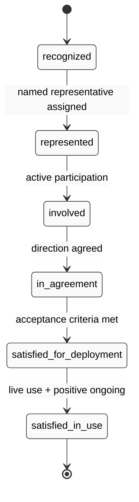

# Stakeholder — state graph

```mermaid
%%{init: {'theme':'base', 'themeVariables': {'primaryTextColor':'#000000','lineColor':'#333333','primaryBorderColor':'#333333','primaryColor':'#fafafa'}}}%%
stateDiagram-v2
    [*] --> recognized
    recognized --> represented: named representative assigned
    represented --> involved: active participation
    involved --> in_agreement: direction agreed
    in_agreement --> satisfied_for_deployment: acceptance criteria met
    satisfied_for_deployment --> satisfied_in_use: live use + positive ongoing
    satisfied_in_use --> [*]
```

Cross-ref: `hypotheses/alphas/stakeholder.md`
