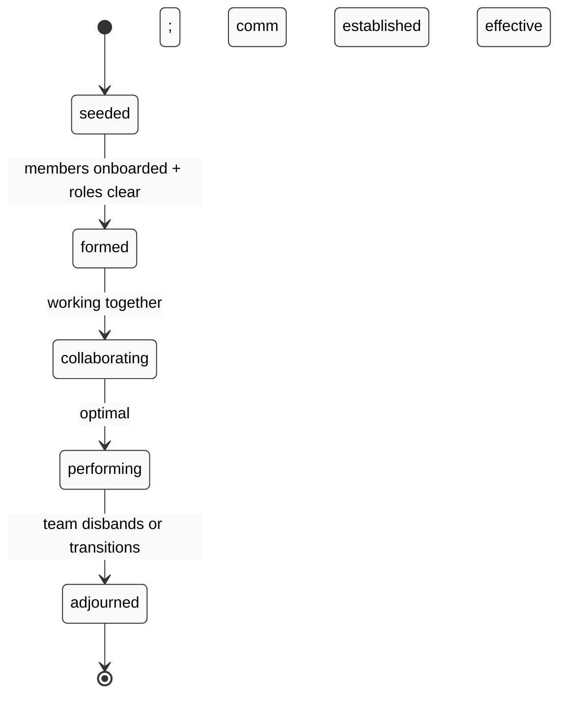

# Team — state graph

```mermaid
%%{init: {'theme':'base', 'themeVariables': {'primaryTextColor':'#000000','lineColor':'#333333','primaryBorderColor':'#333333','primaryColor':'#fafafa'}}}%%
stateDiagram-v2
    [*] --> seeded
    seeded --> formed: members onboarded + roles clear
    formed --> collaborating: working together; comm established
    collaborating --> performing: optimal; effective
    performing --> adjourned: team disbands or transitions
    adjourned --> [*]
```

Cross-ref: `hypotheses/alphas/team.md`
