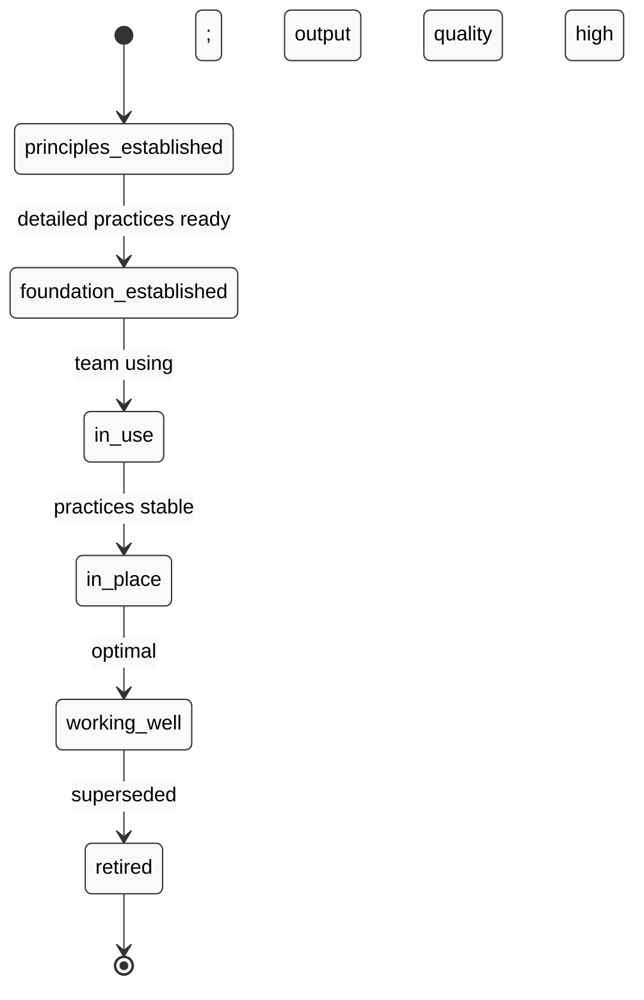

# Way-of-Working — state graph

```mermaid
%%{init: {'theme':'base', 'themeVariables': {'primaryTextColor':'#000000','lineColor':'#333333','primaryBorderColor':'#333333','primaryColor':'#fafafa'}}}%%
stateDiagram-v2
    [*] --> principles_established
    principles_established --> foundation_established: detailed practices ready
    foundation_established --> in_use: team using
    in_use --> in_place: practices stable
    in_place --> working_well: optimal; output quality high
    working_well --> retired: superseded
    retired --> [*]
```

Cross-ref: `hypotheses/alphas/way-of-working.md`
