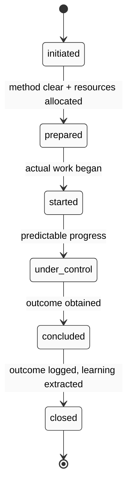

# Work — state graph

```mermaid
%%{init: {'theme':'base', 'themeVariables': {'primaryTextColor':'#000000','lineColor':'#333333','primaryBorderColor':'#333333','primaryColor':'#fafafa'}}}%%
stateDiagram-v2
    [*] --> initiated
    initiated --> prepared: method clear + resources allocated
    prepared --> started: actual work began
    started --> under_control: predictable progress
    under_control --> concluded: outcome obtained
    concluded --> closed: outcome logged, learning extracted
    closed --> [*]
```

Cross-ref: `hypotheses/alphas/work.md`
