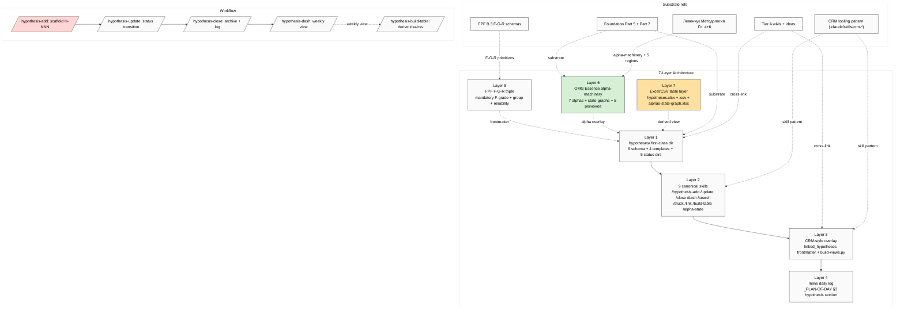

# 7-Layer Architecture (Hypotheses Substrate)

## Layer roster

| Layer | Component | Phase |
|---|---|---|
| 1 | `hypotheses/` dir + schema + templates | 1 |
| 2 | 9 canonical skills (`/hypothesis-*`) | 2 |
| 3 | CRM-style overlay (`linked_hypotheses` + build-views.py) | 6 |
| 4 | Inline daily log integration (`_PLAN-OF-DAY` §3) | 7 |
| 5 | FPF F-G-R mandatory frontmatter triple | 3 |
| 6 | OMG Essence alpha-machinery (7 alphas + state-graphs) | 4 |
| 7 | Excel/CSV table layer (xlsx + csv + alphas-state-graph) | 5 |

## Constitutional posture

- R1 surface only — brigadier scaffolds structure; Ruslan authors prose
- R2 Foundation read-only — new namespace `hypotheses/`
- R6 provenance per hypothesis
- R11 Default-Deny novel actions; CRM-analogous patterns only
- R12 anti-extraction substrate
- EP-5 F-grade mandatory (Layer 5)
- Append-only audit trail (`_log.md`)
- Filesystem-authoritative (Excel/CSV = derived)
