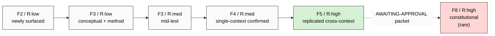
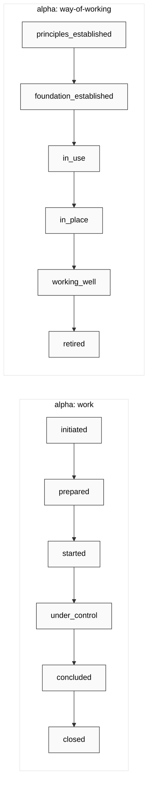

# Hypothesis Lifecycle (state machine)

```mermaid
%%{init: {'theme':'base', 'themeVariables': {'primaryTextColor':'#000000','textColor':'#000000','lineColor':'#333333','primaryBorderColor':'#333333','primaryColor':'#fafafa'}}}%%
stateDiagram-v2
    [*] --> active: /hypothesis-add
    
    active --> testing: test method initiated
    active --> paused: deprioritized pre-test
    
    testing --> confirmed: success criteria met
    testing --> refuted: refutation criteria met
    testing --> paused: blocked / resource constraint
    
    paused --> active: trigger condition met; resume
    
    confirmed --> [*]: archived с learning_extracted
    refuted --> [*]: archived с learning_extracted
    
    note right of confirmed
        Promotion candidate
        if fpf_F=F5+ AND fpf_R=high:
        consider /ingest к wiki/concepts/
        OR Foundation update packet
    end note
```

## State definitions (per `hypotheses/_schema/status.yaml`)

| Status | Description |
|---|---|
| **active** | Гипотеза surfaced; test не initiated |
| **testing** | Test in progress; результаты emerging |
| **confirmed** | Test confirmed гипотезу within scope |
| **refuted** | Test refuted гипотезу within scope |
| **paused** | Testing paused; revisit trigger documented |

## Transitions + file move discipline

| Transition | Action | Skill |
|---|---|---|
| `[*] → active` | Scaffold new file в `hypotheses/active/H-NNN-<slug>.md` | `/hypothesis-add` |
| `active → testing` | `git mv` к `testing/` | `/hypothesis-update --status testing` |
| `testing → confirmed` | `git mv` к `confirmed/`; outcome + learning required | `/hypothesis-close --outcome confirmed` |
| `testing → refuted` | `git mv` к `refuted/`; outcome + learning required | `/hypothesis-close --outcome refuted` |
| `testing → paused` | `git mv` к `paused/`; outcome required | `/hypothesis-close --outcome paused` |
| `paused → active` | `git mv` back к `active/` | `/hypothesis-update --status active` |

Каждая transition → entry в `hypotheses/_log.md` (timestamp + H-NNN + transition + reason).

## F-G-R progression overlay

Per `hypotheses/docs/fpf-integration.md` §2 lifecycle stage → F-G-R progression.

## Alpha state overlay

Каждая hypothesis может tracks 1-3 OMG Essence alphas independently:

Per `/hypothesis-alpha-state` skill + `hypotheses/_schema/alphas.yaml`.

## Cross-refs

- Schema: `hypotheses/_schema/status.yaml` (transitions)
- Schema: `hypotheses/_schema/fgr-triple.yaml` (F-G-R progression rules)
- Schema: `hypotheses/_schema/alphas.yaml` (7 alpha state-graphs)
- Docs: `hypotheses/docs/fpf-integration.md` (Layer 5)
- Docs: `hypotheses/docs/alpha-machinery-guide.md` (Layer 6)
