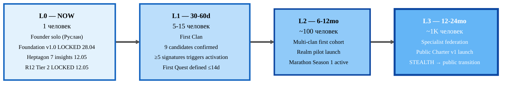
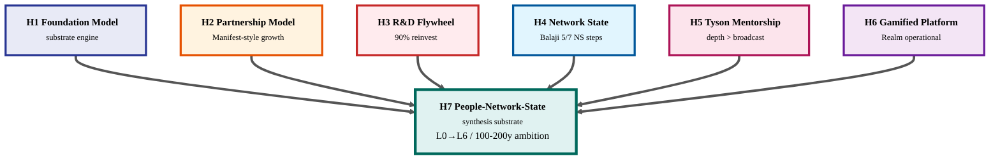
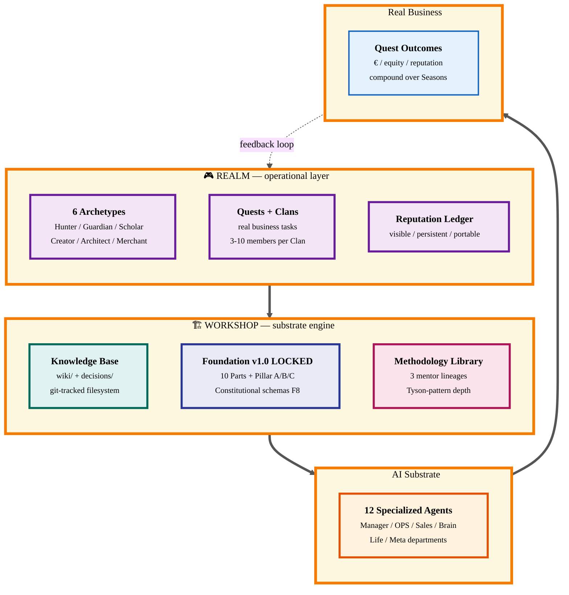
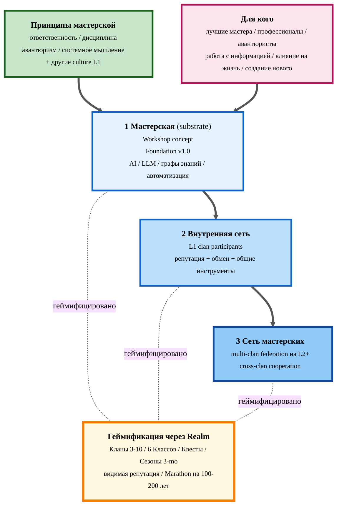
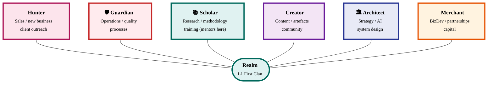

# 📨 Jetix First Clan — Mentor / Partner Pitch

> **STEALTH mode.** Этот документ — base material для **личных разговоров** с 9 L1 candidates. **Не для публичной публикации** до L3 milestone (per Q-D3 ack 2026-05-12).
>
> **Customization.** Базовая версия + per-person tweaks через §8 (ask per role).
>
> **Reading time.** 15-20 минут. Можно читать с начала до конца ИЛИ выборочно: §1 (кто я) → §3 (что Jetix) → §8 (ask конкретно тебе) → §10 (что прошу сейчас) — 5 минут минимум.

---

## §1 Intro — кто я

Меня зовут Руслан. Базируюсь в Берлине. Работаю на пересечении **AI consulting + management thinking** последние ~3 месяца концентрировано (а на самом деле — копилось много дольше).

Двухстрочное био: системный подход к проектам и информации → построил Jetix OS как substrate-первый рабочий стол, через который компаундируется методология. Прошёл от Life OS v0 в марте до **Foundation Architecture v1.0 LOCKED** 28 апреля. Сейчас на пороге **First Clan launch** — координирующего substrate для top-tier профессионалов.

Если тебе интересен **2-месячный narrative**, как мы дошли до этой точки — `reports/anton-call-report-2026-05-11.md` (compressed: 2 месяца / 800K слов wiki / 6 Hexagon insights → теперь Heptagon). [src: anton-call-report-2026-05-11.md]

---

## §2 Путь за ~3 месяца — compressed narrative

Если коротко (детальный narrative — Anton call report):

- **Март 2026** — Life OS v0. Personal productivity substrate, Notion-based, проблема — fragmentation информации.
- **Апрель 2026** — переход к Jetix OS. Wiki архитектура v2 (Karpathy LLM wiki + OmegaWiki таксономия). 8 активных проектов. 12 specialized agents.
- **28.04.2026** — **Foundation Architecture v1.0 LOCKED**. 10 LOCKED Foundation parts + Strategic Layer Pillar A/B/C + 8 RUSLAN-ACK records. F8 constitutional schemas. Tag: `foundation-architecture-locked-2026-04-28`.
- **30.04.2026** — Workshop / TRM model документы. 6 ресурсов (Capital / Time / Audience / Knowledge / Compute / Network).
- **05.05.2026** — Document 1B (Jetix Corporation): 3 tiers Partner/Client/Worker.
- **10.05.2026** — **Hexagon LOCKED**: 6 Strategic Insights — Foundation Model / Partnership Model / R&D Flywheel / Network State (Balaji) / Tyson Mentorship / Gamified Platform.
- **11.05.2026** — People-Network-State research (1237 строк deep dive). Identified 5/7 Balaji NS steps already mapping to Workshop Phase 3-4.
- **12.05.2026 (today)** — **Heptagon LOCKED**: 7-й insight People-Network-State (folds cooperation game-theory inside). **R12 Anti-Extraction** elevated в Tier 2 constitutional rule (12-я hard rule). 4 evening locks acked (filesystem source-of-truth / FULL 6 archetypes / STEALTH launch / ALL monetization variants open).

Wiki current state: **722 entries / 891 edges** в knowledge graph. 12 specialized agents. CRM с 9 deep L1 profiles (~17.3K слов). Foundation v1.0 substrate LOCKED — ready для L1 activation.

[src: git log 2026-03 .. 2026-05-12 + reports/phase-4-wiki-digest-2026-05-11.md (12K слов / 22 sections)]

---

## §3 Что такое Jetix

### §3.1 Короткое определение

**Jetix — это мастерская по работе с информацией.** Не консалтинг-фирма, не AI-стартап, не coworking. **Мастерская** в старом смысле: место, где мастера и подмастерья работают вместе с общими инструментами, по общим принципам, в общем ритме.

Только инструменты другие — AI, языковые модели, графы знаний, автоматизация. И материал, с которым работаем, — не дерево или металл, а **информация**: исследования, методологии, стратегии, тексты, протоколы, систематизация знаний.

### §3.2 Принципы, на которых мастерская стоит

- **Ответственность** — за результат, за слово, за людей, которых привёл
- **Дисциплина** — работа с информацией длинная, не каждый день feels хорошо
- **Авантюризм** — заходить туда, где открывается новое, не туда, где удобно
- **Системное мышление** — не отдельные задачи, а связи между задачами и системами
- **... + другие, добавляемые по мере того как формируется культура L1**

### §3.3 В геймифицированном, интересном стиле

Не игра ради игры — а игровая механика, помогающая оставаться вовлечённым и видеть прогресс на длинных горизонтах:
- **Кланы** (3-10 человек, project-team)
- **Классы** (6 архетипов специализации: Hunter / Guardian / Scholar / Creator / Architect / Merchant)
- **Квесты** (реальные задачи с понятными rewards)
- **Сезоны** (3-month cycles)
- **Репутация** (видимая, накопительная, переносимая)

### §3.4 Для кого

Для **лучших мастеров, профессионалов, авантюристов** — людей, которые хотят:
- работать с информацией
- влиять на жизнь
- создавать новое

Не для всех. Не «масс-маркет». L1 — стартовая когорта 5-10-15 человек.

### §3.5 Архитектура — три слоя

1. Это **мастерская** (substrate — Workshop concept)
2. В ней **сеть** (внутренние связи участников, репутация, обмен)
3. Плюс это **сеть мастерских** (multi-clan federation на L2+)
4. И всё это **геймифицировано** через Jetix Realm (operational layer)

### §3.6 Цели

- **Phase 1 (L1-L2):** Собрать всех таких профессионалов в одной мастерской, с лучшими доступными инструментами, в работающем настрое — и постепенно **перестраивать общество в удобный и безопасный режим**
- **Phase 2 (L3+):** Заниматься исследованиями и развитием человечества как такового

**Marathon на 100-200 лет, не sprint.** L1 → L6 operational ladder работает на горизонте 10-15 лет (1 человек → 10M+ recognition), но Charter ambition — generational scale.

[src: H7 People-Network-State + Charter §1.0a + Q-D2 ack 2026-05-12 + Workshop concept]

---

## §4 Философия

### §4.1 Anti-extraction (R12 verbatim)

Constitutional Tier 2 rule, locked 2026-05-12:

> **AI / substrate cannot extract value from members beyond agreed share; members can fork-and-leave without penalty.**

[src: principles/tier-2-system/foundation-generic/ai-does-not-extract-value-beyond-agreed-share.md §1 LOCKED]

Три гарантии:
1. **No extraction beyond agreed share** — revenue / equity / данные / внимание / репутация — всё ограничено явным соглашением.
2. **Fork-and-leave right** — выход без штрафа, с данными + репутацией + контактами.
3. **Constitutional barrier** — будущие изменения требуют formal amendment через Part 6b stage_gate.

Это прямой counter к **технофеодализму Варуфакиса** (2023). Не маркетинг — это constitutional, F8 enforcement grade.

### §4.2 Cooperation > competition — game-theory grounded

Мы **не отменяем Prisoner's Dilemma теоретически** — мы системно ломаем 7 структурных условий защёлкивающих defection через mechanism design (Axelrod 1984 iterated PD + Nowak indirect reciprocity + Ostrom commons governance). [src: reports/jetix-game-theory-cheating-research-2026-05-12.md §0 + §4]

Cooperation становится **dominant strategy** через iterated visible play, не идеологию.

### §4.3 Tyson Mentorship — depth > broadcast

Anatoliy Tyson не стал чемпионом потому, что слушал 100 mentor'ов. Он стал чемпионом потому, что **Cus D'Amato** был его mentor на 5 лет глубокой работы. Depth-mentorship — паттерн pattern для top-tier achievement, не broadcast. [src: H5 Tyson Mentorship Pattern]

L1 архитектура отражает это: 3 mentor lineages (Левенчук systems-thinking / Брагинский troubleshooting / Тарасов managerial art) — parallel methodology streams, не «общий курс для всех».

### §4.4 Методология как moat

Tools — не moat (любой может купить SaaS). Аудитория — fragile (algorithm change kills). Финансирование — finite. **Методология** — накопленная, валидированная, transferable — **компаундируется**. Левенчук precedent: 20+ лет методологического труда → ШСМ как institution. [src: profiles/l1-first-clan/anatoliy-levenchuk.md + H5 + H1]

### §4.5 Fork-and-leave right (R12 grounded)

Это **двусторонняя** гарантия. Не только защищает участника от substrate — она ещё освобождает substrate от needing «удерживать» участника extraction'ом. Если кто-то хочет уйти — он уходит. Это нормально. Это constitutional.

---

## §5 Геймификация без cringe

«Геймификация бизнеса» обычно = плохая идея. Stars / badges / leaderboards натянутые на работу = corporate humiliation theatre.

**Jetix Realm — другое.** Substantive, не surface.

- **6 archetypes (FULL set per Q-D2 ack):** Hunter / Guardian / Scholar / Creator / Architect / Merchant — каждый со своим Quest pool. [src: H6 §4.2 + Charter §5.1]
- **Marathon Seasons** — 3-месячные циклы / 10-15 лет L0→L6 operational horizon / **100-200 лет Charter ambition** (generational). Не «спринт до конца квартала». [src: H6 §4 + Charter §1.7]
- **Clans** — 3-10 members, cross-archetype, project-team structure. [src: Charter §5.3]
- **Quests** — реальные business tasks с rewards (репутация + €/equity).
- **Reputation ledger** — public, persistent, portable. Cheating instantly visible (per M-B mechanism).

**Grounding:** Castronova (synthetic worlds economics) + Nir Eyal Hooked Model (но используется ethically per anti-extraction) + Csikszentmihalyi flow theory. Best games в индустрии (Torn, Eve Online, Stardew, Civilization) — изучаются на retention mechanics.

**Key constraint:** **R12 anti-extraction principle prevents Hooked Model misuse.** Мы не делаем «addiction by design». Мы делаем «cooperation by design» через repeated games + visibility + bounded extraction.

[src: H6 Gamified Platform §3-§5 + R12]

---

## §6 Метод кооперации — game-theory cheating mechanisms

Title прозвучит провокативно — но именно так формулировал Ruslan: «как зачитерить теорию игр».

Companion research (12.05) — **20 mechanism identified**, 3 наиболее powerful:

### M-A — Repeated games hardcoded

Single-round defection становится impossible. Marathon Seasons (E6) + L0-L6 ladder делают каждое взаимодействие move в multi-decade game с visible history. Single-round → repeated → cooperation becomes dominant per Axelrod 1984 tournament + Folk theorem.

### M-B — Reputation ledger visibility

E1 Persona reputation + E3 Clan reputation + public Charter signatures + public artifact track-record. Anonymity невозможна; defection instantly visible across network. Sources: Nowak indirect reciprocity (Nature 2005), Ostrom commons governance (Nobel 2009).

### M-C — Anti-extraction constitutional anchor

R12 (см. §4.1) делает substrate-мутацию в технофеодализм structurally forbidden. Это **defender's advantage** — barrier built-in at constitution level с самой первой signature, не retrofit after L2 expansion.

**Precedents (12 cases studied):**

- **Mondragón Corporation** (1956+) — 80K worker-owners, $14B revenue. Cooperative ownership пример на десятилетия.
- **PayPal Mafia** — 200 человек → Tesla / LinkedIn / YouTube / Palantir / SpaceX. Mobility-driven ecosystem network.
- **Polish Solidarity** — 10M = 1/3 Polish adults → regime change без выстрела. Coordination scale.
- **OpenAI 770/770 sign rebellion** (Nov 2023) — coordination внутри одной corp.
- **Wikipedia editors** (~280K active), **Linux kernel** (~15K contributors).

**Lesson:** Coordinated professional networks beat single corporations. **Air Traffic Controllers 1981 failure case** (Reagan broke them) shows critical defect: one-country / one-industry / point-target — global distributed network избегает эту failure mode.

[src: reports/jetix-game-theory-cheating-research-2026-05-12.md §0 + §9 + reports/jetix-people-network-state-research-2026-05-11.md §8]

---

## §7 Конкретные шаги L0 → L3

**Diagram M3 (Pitch variant)** — L0→L3 immediate horizon. Полный L0→L6 ladder в Charter §13. [src: H7 §6 + Charter §3.3]

**Что значит «participate» на каждом уровне:**

- **L0 → L1** (now): прочитать Charter, дать обратную связь, подписать (если согласен), участвовать в первом Quest определении.
- **L1 → L2** (6-12mo): mentor / mentee других professionals входящих в Realm pilot; first Marathon Season participation.
- **L2 → L3** (12-24mo): scale own Clan; participate в Federation council; public-facing role (после STEALTH → public transition).

---

## §8 Что мне нужно от тебя — specific ask per role

### Mentors (Левенчук / Брагинский / Тарасов)

- **Конкретный ask:** depth-mentorship pattern. 1-2 раза в месяц 90-minute session — методологическая работа над real-world Jetix decisions (Tyson pattern, не «course»).
- **Что я предлагаю взамен:** твоя методология **компаундируется в Jetix Knowledge Base** + reaches L2-L3 cohort 100-1K next-generation specialists. Methodology validation track в твоём lineage attribute.
- **Anti-extraction guarantee:** твоя methodology IP остаётся твоей (R12). Ты можешь fork-and-leave в любой момент с full data export.

### Partner (Цэрэн)

- **Конкретный ask:** Partnership Model integration — МИМ + Jetix как complementary platforms (МИМ = systems-thinking school depth, Jetix = AI substrate + Workshop / Realm). Pilot 6 месяцев на shared cohort.
- **Что я предлагаю взамен:** Jetix substrate operates под МИМ methodology stewardship; revenue / equity share negotiable upfront (per Q-D4 — all 3 monetization variants open); cross-pollination audiences.
- **Anchor:** ты — **first instantiation** Partnership Model (Manifest-style); precedent для следующих partnerships. [src: H2 Partnership Model §3.2]

### Strategists (Федорив / Гиренко)

- **Конкретный ask:** Strategic Council role (L1) — quarterly strategic review (2 hours / quarter); outreach network access (warm intros через твою сеть к decisive 1-2 next-Clan candidates).
- **Что я предлагаю взамен:** L1 founding signature credit; equity / clan-share opportunity (per Q-D4); early access к Realm beta; brand association с substrate-builder pattern (Jetix = anti-extraction precedent).
- **Strategists specific value:** Федорив = brand + DACH+Ukraine network; Гиренко = corporate-strategy bridge (Accenture / Frankfurt / Strategy Club audience).

### Investor (Хартманн)

- **Конкретный ask:** capital + connections. Two parts:
  - Capital — initial L1 working capital (size TBD, не для extraction — для Quest reward pool seeding + infra).
  - Connections — warm intros к next-Clan candidates через Hartmann Fellowships network.
- **Что я предлагаю взамен:** L1 founding investor credit; equity / clan-share / convertible note (negotiable per Q-D4); Hartmann Fellowships brand association с anti-extraction precedent.
- **Anti-extraction guarantee:** R12 protects YOUR investment exit-right also (symmetric protection).

### Humanities bridge (Дмитрий)

- **Конкретный ask:** Charter language review (gauge humanities-accessible vs jargon-heavy); audience reach pilot (рассказать о Jetix в «Гуманитарщина» format когда STEALTH lift'ed, L2-L3 timing); ongoing language audit на каждом milestone release.
- **Что я предлагаю взамен:** L1 founding signature; humanities-bridge role в Realm Creator archetype lead; cross-pollination audiences (Jetix tech crowd → твой humanities crowd).
- **Specific value:** ты — **gatekeeper против tech-jargon insularity**. Без тебя Jetix рискует become «ещё один tech bubble project».

### Aspirational anchor (Дуров)

- **Конкретный ask:** Telegram alignment + endorsement. Two parts:
  - Alignment — Jetix Realm communication infra почти наверняка builds on Telegram (private channels per Clan, voice для conferences). Endorsement = Telegram-native compatibility statement.
  - Endorsement (optional) — public signature на Charter when STEALTH lifts (L3 transition), as substrate-builder peer recognition.
- **Что я предлагаю взамен:** L1 founding signature credit; Telegram brand association с anti-extraction substrate precedent (counter-narrative к Web 2.0 extraction); Dubai / DACH bridge value.
- **Confidence:** lowest engagement probability (Дуров engagement is rare). Asymmetric upside — даже passive endorsement = massive signaling.

---

## §9 Что я предлагаю взамен (общая структура)

Per Q-D4 ack 2026-05-12 — **все 3 monetization variants открыты**, negotiable per-person:

1. **Consulting / правая рука model** — L1 member коммитит time (1-2 ч/неделя baseline), receives consulting fee tied к Quest outcomes.
2. **Equity / clan-share model** — L1 member receives % в legal entity OR clan-share в shared Quest reward pool. Negotiable upfront.
3. **Subscription model** — L1 member оплачивает subscription (если нет capital flow); используется в Realm pilot infra cost coverage.

Per-person можно комбинировать (e.g. Mentors — primarily equity, Investor — capital + clan-share, Humanities bridge — subscription-free + revenue-share от audience pollination).

**Plus universal benefits:**

- **Charter signing → L1 founding member status** (cannot be retrofitted; defender's advantage)
- **Early access к Jetix Realm beta** (L1 = first players)
- **Network effects benefits** — Reed's law applied to coordinated network (per TRM Network resource)
- **Public credit за foundational contribution** when STEALTH lift'ed
- **Anti-extraction constitutional guarantee** (R12) — symmetric protection
- **Fork-and-leave right** — exit без штрафа в любой момент

---

## §10 Начальный ask (low-barrier)

**Я не прошу commitment сразу.**

Конкретно сейчас я прошу следующее (≤30 минут твоего времени):

1. **Прочитай Charter** (`decisions/JETIX-FIRST-CLAN-CHARTER-2026-05-12.md`) — 15-20 минут.
2. **Прочитай этот Pitch** — 15-20 минут (можешь скипать секции).
3. **Дай обратную связь** — что зашло / что cringe / что unclear / что disagree.
4. **(Optional)** 30-minute разговор когда удобно — про твою perspective + потенциальный role.

**Не прошу:**
- Подписать Charter сразу
- Committed money / time / equity upfront
- Public association до тех пор пока ты сам не готов
- Endorsement до личной convergence

**STEALTH constraint:** не пересылай эти документы дальше без моего ack. Один-на-один conversations only до L3 milestone.

Если после прочтения ты решаешь «не моё» — без обид, без социальной цены, без followup pressure. Тогда давай поддерживать обычный профессиональный контакт.

Если решаешь «да, интересно глубже» — назначаем разговор; обсуждаем role + monetization fit; iterate.

---

## §11 Visuals

### M1. Heptagon overview (7 insights synthesis)

[src: H7 People-NS §3 + §4]

### M2. Workshop + Realm architecture (3 layers)

[src: H6 Gamified Platform §4 + Foundation v1.0 LOCKED + H1 Foundation Model]

### M3. Jetix Workshop Architecture (3 слоя + принципы)

[src: Pitch §3 + Charter §1.0a + Workshop concept + H6 Gamified Platform §4]

### M4. 6 Archetypes circle

[src: H6 §4.2 + Charter §5.1 + Q-D2 ack 2026-05-12]

### M5. 3 game-theory cheating mechanisms (M-A / M-B / M-C)

```mermaid
%%{init: {'theme':'base', 'themeVariables': {'primaryColor':'#fff8e1', 'primaryTextColor':'#000', 'primaryBorderColor':'#f57c00', 'lineColor':'#555', 'fontFamily':'Inter, system-ui, sans-serif', 'fontSize':'14px'}}}%%
flowchart LR
    PD["<b>Prisoner's Dilemma</b><br/><small>default state<br/>defection rational<br/>(single-round / anonymous / low-stakes)</small>"]:::guard

    subgraph MECH ["⚙️ Jetix 3 PD-breaking mechanisms"]
        direction TB
        MA["<b>M-A Repeated Games</b><br/><small>Marathon Seasons hardcoded<br/>L0→L6 multi-decade ladder<br/>(Axelrod 1984)</small>"]:::auto
        MB["<b>M-B Reputation Visibility</b><br/><small>Persona + Clan ledger<br/>public artifact track-record<br/>(Nowak 2005 / Ostrom 2009)</small>"]:::phone
        MC["<b>M-C Anti-Extraction</b><br/><small>R12 Tier 2 constitutional<br/>fork-and-leave right<br/>(Varoufakis counter)</small>"]:::substrate
    end

    COOP["<b>Cooperation Attractor</b><br/><small>dominant strategy<br/>via iterated visible play</small>"]:::master

    PD ==> MECH
    MECH ==> COOP

    classDef guard fill:#ffebee,stroke:#c62828,stroke-width:3px,color:#000
    classDef auto fill:#f3e5f5,stroke:#6a1b9a,stroke-width:3px,color:#000
    classDef phone fill:#e1f5fe,stroke:#01579b,stroke-width:3px,color:#000
    classDef substrate fill:#e8eaf6,stroke:#283593,stroke-width:3px,color:#000
    classDef master fill:#fce4ec,stroke:#ad1457,stroke-width:4px,color:#000

    style MECH fill:#fff8e1,stroke:#f57c00,stroke-width:4px
```

[src: H7 People-NS §5 M-A/B/C + Game Theory research §0 + §4]

---

## §12 Provenance + Sources

- **Charter v0:** `decisions/JETIX-FIRST-CLAN-CHARTER-2026-05-12.md` (companion document; same date)
- **Parent insight:** `decisions/STRATEGIC-INSIGHT-JETIX-AS-PEOPLE-NETWORK-STATE-2026-05-12.md` (H7 LOCKED)
- **Constitutional anchor:** `principles/tier-2-system/foundation-generic/ai-does-not-extract-value-beyond-agreed-share.md` (R12 LOCKED)
- **6 Hexagon insights:** `decisions/STRATEGIC-INSIGHT-*-2026-05-1[01].md` (5 files)
- **9 L1 deep profiles:** `profiles/l1-first-clan/*.md` (17.3K слов total)
- **Anton call report (2-month narrative):** `reports/anton-call-report-2026-05-11.md`
- **People-NS research:** `reports/jetix-people-network-state-research-2026-05-11.md` (1237 строк)
- **Game Theory research:** `reports/jetix-game-theory-cheating-research-2026-05-12.md` (1219 строк)
- **Strategic decisions log:** `reports/strategic-decisions-2026-05-12.md` (Q1-Q7 + Q-D1..Q-D4)
- **Wiki digest:** `reports/phase-4-wiki-digest-2026-05-11.md` (12K слов / 22 sections)
- **Mermaid style guide:** `swarm/wiki/operations/mermaid-style-guide-2026-05-07.md` v1.0

---

> **AI = scribe + skeleton. Ruslan = sole strategist + canonical author + prose authority.** Per Tier 2 R1.
> Status remains `DRAFT-PENDING-RUSLAN-REVISION` до Ruslan revision pass.
> STEALTH mode — circulate only к 9 L1 candidates + close advisors; NOT для public publication до L3.
