# 🗺️ Jetix Idea Map — что внутри + как связано

> **Главная идея.** Jetix = **мастерская по работе с информацией** + сеть мастерских + геймификация + people-network-state на 100-200 лет.

---

## 📊 Mermaid — Jetix Idea Map

```mermaid
%%{init: {'theme':'base', 'themeVariables': {'primaryColor':'#fff8e1', 'primaryTextColor':'#000', 'primaryBorderColor':'#f57c00', 'lineColor':'#555', 'fontFamily':'Inter, system-ui, sans-serif', 'fontSize':'13px'}}}%%
flowchart TB
    CORE["<b>🏛️ JETIX</b><br/><small>Мастерская по работе с информацией<br/>Marathon 100-200 лет</small>"]:::core

    %% Foundation layer
    FOUND["<b>Foundation v1.0</b><br/><small>11 Parts + Pillar A/B/C<br/>28.04 LOCKED</small>"]:::foundation
    VISION["<b>Vision FUNDAMENTAL</b><br/><small>35 UC × 12 categories<br/>27.04</small>"]:::foundation
    R12["<b>R12 Anti-Extraction</b><br/><small>Tier 2 constitutional<br/>12.05 LOCKED</small>"]:::foundation

    %% Strategic core — Heptagon
    HEPTAGON["<b>HEPTAGON</b><br/><small>7 Strategic Insights<br/>synthesized 12.05</small>"]:::insights
    H1["H1 Foundation Model<br/><small>substrate engine</small>"]:::insight_node
    H2["H2 Partnership Model<br/><small>Manifest-style growth</small>"]:::insight_node
    H3["H3 R&amp;D Flywheel<br/><small>90% reinvest</small>"]:::insight_node
    H4["H4 Network State<br/><small>Balaji 5/7 NS steps</small>"]:::insight_node
    H5["H5 Tyson Mentorship<br/><small>depth &gt; broadcast</small>"]:::insight_node
    H6["H6 Gamified Platform<br/><small>Realm operational</small>"]:::insight_node
    H7["<b>H7 People-Network-State</b><br/><small>synthesis substrate<br/>12.05 LOCKED</small>"]:::insight_h7

    %% Workshop concept
    WORKSHOP["<b>WORKSHOP</b><br/><small>5 owner roles<br/>30.04 LOCKED</small>"]:::workshop
    MASTER["мастер<br/><small>craftsmanship</small>"]:::workshop_role
    WORKER["работник<br/><small>execution</small>"]:::workshop_role
    MACHINE["станок<br/><small>tool / agent</small>"]:::workshop_role
    INFO["информация<br/><small>material</small>"]:::workshop_role
    VALUE["ценность<br/><small>output</small>"]:::workshop_role

    %% Realm — gamification layer
    REALM["<b>REALM</b><br/><small>operational gamification<br/>6 archetypes</small>"]:::realm
    E1["E1 Persona<br/><small>TRM stats</small>"]:::realm_entity
    E2["E2 Class<br/><small>6 archetypes</small>"]:::realm_entity
    E3["E3 Clan<br/><small>3-10 team</small>"]:::realm_entity
    E4["E4 Quest<br/><small>real biz task</small>"]:::realm_entity
    E5["E5 Resources<br/><small>energy/AI/etc</small>"]:::realm_entity
    E6["E6 Seasons<br/><small>3-mo cycles</small>"]:::realm_entity

    %% TRM Model
    TRM["<b>TRM Model</b><br/><small>6 resources × L0-L5<br/>30.04 LOCKED</small>"]:::trm
    CAP["Capital"]:::trm_node
    TIME["Time leverage"]:::trm_node
    AUD["Audience"]:::trm_node
    KNOW["Knowledge"]:::trm_node
    COMP["Compute"]:::trm_node
    NET["Network"]:::trm_node

    %% Doc 1B
    DOC1B["<b>Doc 1B</b><br/><small>Jetix Corporation<br/>05.05</small>"]:::corp
    PARTNER["Партнёр"]:::corp_role
    CLIENT["Клиент"]:::corp_role
    WORKER_R["Работник"]:::corp_role

    %% Principles
    PRINCIPLES["<b>4 Принципа</b><br/><small>культура мастерской</small>"]:::principles
    RESP["ответственность"]:::principle_node
    DISC["дисциплина"]:::principle_node
    AVANT["авантюризм"]:::principle_node
    SYST["системное мышление"]:::principle_node

    %% L1 First Clan
    L1["<b>L1 First Clan</b><br/><small>9 candidates<br/>12.05</small>"]:::l1
    L1_TSEREN["Цэрэн"]:::l1_node
    L1_LEVE["Левенчук"]:::l1_node
    L1_TARASOV["Тарасов"]:::l1_node
    L1_KHART["Хартман"]:::l1_node
    L1_BRAG["Брагинский"]:::l1_node
    L1_GIRE["Гиренко"]:::l1_node
    L1_DMIT["Дмитрий"]:::l1_node
    L1_DUROV["Дуров"]:::l1_node
    L1_FED["Федорев"]:::l1_node

    %% L0-L6 Ladder
    LADDER["<b>L0 → L6 Ladder</b><br/><small>1 → 10M+<br/>operational 10-15y<br/>ambition 100-200y</small>"]:::ladder

    %% Charter
    CHARTER["<b>Charter v0</b><br/><small>14 sections<br/>12.05 LOCKED</small>"]:::charter

    %% Connections
    CORE ==> FOUND
    CORE ==> HEPTAGON
    CORE ==> WORKSHOP
    CORE ==> REALM
    CORE ==> PRINCIPLES
    CORE ==> L1

    FOUND -.-> VISION
    FOUND -.-> R12

    HEPTAGON ==> H1
    HEPTAGON ==> H2
    HEPTAGON ==> H3
    HEPTAGON ==> H4
    HEPTAGON ==> H5
    HEPTAGON ==> H6
    HEPTAGON ==> H7

    H1 -.->|substrate| WORKSHOP
    H6 -.->|operational| REALM
    H7 -.->|synthesis| HEPTAGON

    WORKSHOP ==> MASTER
    WORKSHOP ==> WORKER
    WORKSHOP ==> MACHINE
    WORKSHOP ==> INFO
    WORKSHOP ==> VALUE

    REALM ==> E1
    REALM ==> E2
    REALM ==> E3
    REALM ==> E4
    REALM ==> E5
    REALM ==> E6
    E1 -.->|stats| TRM
    E3 -.->|clan-share| TRM

    TRM ==> CAP
    TRM ==> TIME
    TRM ==> AUD
    TRM ==> KNOW
    TRM ==> COMP
    TRM ==> NET

    DOC1B ==> PARTNER
    DOC1B ==> CLIENT
    DOC1B ==> WORKER_R
    DOC1B -.->|extends| H7
    L1 -.->|maps_to| PARTNER

    PRINCIPLES ==> RESP
    PRINCIPLES ==> DISC
    PRINCIPLES ==> AVANT
    PRINCIPLES ==> SYST
    PRINCIPLES -.->|culture| L1

    L1 ==> L1_TSEREN
    L1 ==> L1_LEVE
    L1 ==> L1_TARASOV
    L1 ==> L1_KHART
    L1 ==> L1_BRAG
    L1 ==> L1_GIRE
    L1 ==> L1_DMIT
    L1 ==> L1_DUROV
    L1 ==> L1_FED

    L1 ==> LADDER
    LADDER -.->|signed_by| CHARTER

    CHARTER -.->|cites| H7
    CHARTER -.->|grounded_in| R12
    CHARTER -.->|defines| L1

    classDef core fill:#fff8e1,stroke:#f57c00,stroke-width:5px,color:#000
    classDef foundation fill:#e8eaf6,stroke:#283593,stroke-width:3px,color:#000
    classDef insights fill:#bbdefb,stroke:#0d47a1,stroke-width:3px,color:#000
    classDef insight_node fill:#e3f2fd,stroke:#1565c0,stroke-width:2px,color:#000
    classDef insight_h7 fill:#42a5f5,stroke:#0d47a1,stroke-width:3px,color:#fff
    classDef workshop fill:#fff3e0,stroke:#e65100,stroke-width:3px,color:#000
    classDef workshop_role fill:#ffe0b2,stroke:#e65100,stroke-width:1px,color:#000
    classDef realm fill:#c8e6c9,stroke:#1b5e20,stroke-width:3px,color:#000
    classDef realm_entity fill:#dcedc8,stroke:#33691e,stroke-width:1px,color:#000
    classDef trm fill:#f8bbd0,stroke:#880e4f,stroke-width:3px,color:#000
    classDef trm_node fill:#fce4ec,stroke:#ad1457,stroke-width:1px,color:#000
    classDef corp fill:#d1c4e9,stroke:#4527a0,stroke-width:3px,color:#000
    classDef corp_role fill:#e1bee7,stroke:#6a1b9a,stroke-width:1px,color:#000
    classDef principles fill:#b2dfdb,stroke:#00695c,stroke-width:3px,color:#000
    classDef principle_node fill:#b2ebf2,stroke:#006064,stroke-width:1px,color:#000
    classDef l1 fill:#ffcdd2,stroke:#b71c1c,stroke-width:3px,color:#000
    classDef l1_node fill:#ffebee,stroke:#c62828,stroke-width:1px,color:#000
    classDef ladder fill:#90caf9,stroke:#0d47a1,stroke-width:3px,color:#000
    classDef charter fill:#fff59d,stroke:#f57f17,stroke-width:4px,color:#000
```

---

## 📋 Альтернативный текстовый формат — Idea Map

### 🏛️ JETIX (центр)
**Мастерская по работе с информацией. Marathon 100-200 лет.**

### Слой 1 — Foundation (substrate)
- **Foundation v1.0** (11 Parts + Pillar A/B/C) — substrate engine
- **Vision FUNDAMENTAL** — 35 UC × 12 categories
- **R12 Anti-Extraction** — Tier 2 constitutional rule (12-я hard rule)

### Слой 2 — Heptagon (7 Strategic Insights)
- **H1 Foundation Model** — substrate engine
- **H2 Partnership Model** — Manifest-style growth
- **H3 R&D Flywheel** — 90% reinvest
- **H4 Network State (Balaji)** — 5/7 NS steps map
- **H5 Tyson Mentorship** — depth > broadcast
- **H6 Gamified Platform** — Realm operational
- **H7 People-Network-State** ⭐ — synthesis substrate (folds cooperation game theory)

### Слой 3 — Workshop (мастерская)
- 5 owner roles: **мастер / работник / станок / информация / ценность**
- Adaptive станки = AI agents / LLMs / графы знаний

### Слой 4 — Realm (operational gamification)
- **E1 Persona** — TRM stats
- **E2 Class** — 6 archetypes (Hunter / Guardian / Scholar / Creator / Architect / Merchant)
- **E3 Clan** — 3-10 team
- **E4 Quest** — real business tasks
- **E5 Resources** — energy / AI credits / etc.
- **E6 Seasons** — 3-month cycles

### Слой 5 — TRM Model (resources)
6 ресурсов × L0-L5 ladder: **Capital / Time leverage / Audience / Knowledge / Compute / Network**

### Слой 6 — Doc 1B (Corporation framework)
3 tiers: **Партнёр / Клиент / Работник**

### Слой 7 — Principles (культура)
**Ответственность / Дисциплина / Авантюризм / Системное мышление** (+ добавляются по мере культуры L1)

### Слой 8 — L1 First Clan (9 candidates)
- **Mentors** — Левенчук / Тарасов / Брагинский
- **Partner** — Цэрэн (МИМ)
- **Investor** — Хартман
- **Strategists** — Федорев / Гиренко
- **Humanities bridge** — Дмитрий
- **Aspirational** — Дуров

### Слой 9 — L0 → L6 Ladder (operational growth)
- L0: 1 (Руслан) → L1: 5-15 (30-60 дней) → L2: 100 (6-12 мес) → L3: 1K → L4: 10K-50K → L5: 100K-1M → L6: 10M+
- Operational horizon: 10-15 лет
- Charter ambition: **100-200 лет** (generational)

### Слой 10 — Charter v0 (constitutional artifact)
**14 sections / 4716 слов** — combined Constitutional + Manifesto, signed by 9 L1 → activation at 5

---

## 🎯 Использование в Miro

Same options как в [path-2-months](./ruslan-path-2-months-2026-05-12.md):
- **(A)** Mermaid plugin import (если в Miro)
- **(B)** mermaid.live → PNG → upload в Miro
- **(C)** GitHub render → screenshot
- **(D)** Manual recreation в Miro (используй текстовый формат как outline)

### Recommend для Miro UX:
- Используй разные **колоры per слой** (10 слоёв = 10 distinct colors per categories выше)
- Делай **CORE central, остальное circling** — типа mind-map
- Use **arrows direction** — какие концепции extending vs supporting vs grounding

---

*Awaits Ruslan Miro recreation + использование в video recording / pitch conversations.*
