# 🛤️ Путь Руслана за 2 месяца — март-май 2026

> **Источник.** `reports/anton-call-report-2026-05-11.md` + git log + Daily Logs.
> **Цель.** Показать **развитие от Life OS v0 → Foundation v1.0 LOCKED + Heptagon + R12 LOCKED** за 60 дней.

---

## 📊 Mermaid — Path Timeline

```mermaid
%%{init: {'theme':'base', 'themeVariables': {'primaryColor':'#fff8e1', 'primaryTextColor':'#000', 'primaryBorderColor':'#f57c00', 'lineColor':'#555', 'fontFamily':'Inter, system-ui, sans-serif', 'fontSize':'13px'}}}%%
flowchart TD
    START["<b>~6 месяцев назад</b><br/>~200h работа с ментором<br/><small>ценности / смысл жизни</small>"]:::start
    POST["<b>После работы с ментором</b><br/>каждый день со смыслом<br/><small>начал ценить ресурсы (время/внимание)</small>"]:::stage1

    TRACKING["<b>Tracking ресурсов</b><br/>8000+ часов записано<br/><small>перестал потреблять мусор</small>"]:::stage1

    LIFE_OS["<b>~март 2026</b><br/><b>Life OS v0</b><br/><small>система жизни под себя<br/>задачи/привычки/время</small>"]:::stage2
    AI_LEARN["<b>Параллельно</b><br/>изучение AI<br/><small>foundation models / LLMs / графы</small>"]:::stage2

    REPO["<b>13.04</b><br/><b>Repo init</b><br/><small>переход на CC-based daily logs<br/>filesystem source of truth</small>"]:::stage3
    WIKI["<b>~20.04</b><br/><b>Wiki Architecture v2</b><br/><small>Karpathy LLM wiki<br/>+ OmegaWiki таксономия</small>"]:::stage3

    VISION["<b>27.04</b><br/><b>Vision FUNDAMENTAL</b><br/><small>35 UC × 12 categories<br/>Constitutional Layer 1</small>"]:::stage3

    FOUNDATION["<b>28.04 ⭐</b><br/><b>Foundation v1.0 LOCKED</b><br/><small>11 Parts + Pillar A/B/C<br/>8 RUSLAN-ACK records<br/>tag: foundation-architecture-locked</small>"]:::milestone

    WORKSHOP["<b>30.04</b><br/><b>Workshop concept LOCKED</b><br/><small>5 owner roles<br/>информация I/O<br/>adaptive станки</small>"]:::stage4
    TRM["<b>30.04</b><br/><b>TRM model LOCKED</b><br/><small>6 ресурсов × L0-L5<br/>business model</small>"]:::stage4

    DOC1B["<b>05.05</b><br/><b>Document 1B</b><br/><small>Jetix Corporation<br/>8 faces + Партнёр/Клиент/Работник</small>"]:::stage4

    HEXAGON["<b>10.05 ⭐</b><br/><b>Hexagon LOCKED</b><br/><small>5 Strategic Insights:<br/>Foundation Model / Partnership /<br/>R&D Flywheel / Network State / Tyson</small>"]:::milestone

    GAMIFIED["<b>11.05</b><br/><b>H6 Gamified Platform</b><br/><small>Realm — 6 entities<br/>Castronova / Eyal / Csikszentmihalyi</small>"]:::stage5
    PEOPLE_NS["<b>11.05</b><br/><b>People-NS research</b><br/><small>1237 строк deep dive<br/>5/7 Balaji NS steps map</small>"]:::stage5

    HEPTAGON["<b>12.05 ⭐⭐</b><br/><b>Heptagon LOCKED</b><br/><small>H7 People-Network-State<br/>synthesis substrate<br/>folds Game Theory cooperation</small>"]:::milestone_big

    R12["<b>12.05 ⭐⭐</b><br/><b>R12 Anti-Extraction</b><br/><small>Tier 2 constitutional rule<br/>F5 blast-radius<br/>Tier 2: 11 → 12 rules</small>"]:::milestone_big

    LOCKS["<b>12.05 evening</b><br/><b>4 evening locks</b><br/><small>filesystem-only / FULL 6 archetypes /<br/>STEALTH launch / all monetization</small>"]:::stage5

    L1_PROFILES["<b>12.05</b><br/><b>9 L1 First Clan profiles</b><br/><small>Федорев / Хартман / Брагинский /<br/>Цэрэн / Левенчук / Дмитрий /<br/>Дуров / Гиренко / Тарасов</small>"]:::stage5

    CHARTER["<b>12.05 night ⭐⭐⭐</b><br/><b>Charter v0 LOCKED</b><br/><small>14 sections / 4716 слов<br/>Constitutional + Manifesto combined<br/>Ruslan voice §1 Preamble</small>"]:::current

    PITCH["<b>12.05 night</b><br/><b>Pitch Doc + Document Pool</b><br/><small>3569 слов / 5 mermaid<br/>per-L1-candidate sequence</small>"]:::current

    START ==> POST
    POST ==> TRACKING
    TRACKING ==> LIFE_OS
    TRACKING ==> AI_LEARN
    LIFE_OS ==> REPO
    AI_LEARN ==> REPO
    REPO ==> WIKI
    WIKI ==> VISION
    VISION ==> FOUNDATION
    FOUNDATION ==> WORKSHOP
    FOUNDATION ==> TRM
    WORKSHOP ==> DOC1B
    TRM ==> DOC1B
    DOC1B ==> HEXAGON
    HEXAGON ==> GAMIFIED
    HEXAGON ==> PEOPLE_NS
    GAMIFIED ==> HEPTAGON
    PEOPLE_NS ==> HEPTAGON
    HEPTAGON ==> R12
    HEPTAGON ==> LOCKS
    HEPTAGON ==> L1_PROFILES
    R12 ==> CHARTER
    LOCKS ==> CHARTER
    L1_PROFILES ==> CHARTER
    CHARTER ==> PITCH

    classDef start fill:#e8eaf6,stroke:#283593,stroke-width:3px,color:#000
    classDef stage1 fill:#c8e6c9,stroke:#1b5e20,stroke-width:2px,color:#000
    classDef stage2 fill:#bbdefb,stroke:#0d47a1,stroke-width:2px,color:#000
    classDef stage3 fill:#90caf9,stroke:#0d47a1,stroke-width:2px,color:#000
    classDef stage4 fill:#64b5f6,stroke:#0d47a1,stroke-width:2px,color:#fff
    classDef stage5 fill:#42a5f5,stroke:#0d47a1,stroke-width:2px,color:#fff
    classDef milestone fill:#ff9800,stroke:#e65100,stroke-width:4px,color:#000
    classDef milestone_big fill:#f44336,stroke:#b71c1c,stroke-width:4px,color:#fff
    classDef current fill:#fff8e1,stroke:#f57c00,stroke-width:5px,color:#000
```

---

## 📅 Альтернативный текстовый формат (если mermaid в Miro не импортируется)

### Этап 0 — Подготовка (~6 мес назад)
- **200 часов работы с ментором** — разбирался с ценностями и смыслом жизни
- Каждый день начал быть наполнен смыслом

### Этап 1 — Ценность ресурсов (постепенно за месяцы)
- Начал ценить **время и внимание** как основные ресурсы
- **8000+ часов записано** в tracking за последний год
- Перестал потреблять мусорную информацию

### Этап 2 — Life OS v0 + AI (март 2026)
- Начал строить систему жизни под себя
- Параллельно изучал AI

### Этап 3 — Repo + Wiki (13-27 апреля)
- **13.04** — Repo init, переход на CC-based daily logs (filesystem = source of truth)
- **~20.04** — Wiki Architecture v2 (Karpathy + OmegaWiki)
- **27.04** — Vision FUNDAMENTAL acked (35 UC × 12 categories)

### Этап 4 — Foundation LOCKED ⭐ (28-30 апреля)
- **28.04** — **Foundation Architecture v1.0 LOCKED** (11 Parts + Pillar A/B/C + 8 RUSLAN-ACK)
- **30.04** — Workshop concept LOCKED + TRM model LOCKED

### Этап 5 — Corporation framework (05.05)
- Document 1B — Jetix Corporation (8 faces + Партнёр/Клиент/Работник)

### Этап 6 — Hexagon ⭐ (10-11.05)
- **10.05** — 5 Strategic Insights LOCKED (Foundation Model / Partnership / R&D Flywheel / Network State Balaji / Tyson Mentorship)
- **11.05** — H6 Gamified Platform LOCKED + People-NS research (1237 строк)

### Этап 7 — Heptagon LOCKED ⭐⭐ (12.05)
- **H7 People-Network-State LOCKED** (synthesis substrate, folds cooperation game theory)
- **R12 Anti-Extraction Tier 2 constitutional rule LOCKED** (Tier 2: 11→12 rules)
- 4 evening locks (filesystem / FULL 6 archetypes / STEALTH / all monetization)
- 9 L1 First Clan deep profiles

### Этап 8 — Charter LOCKED ⭐⭐⭐ (12.05 night)
- **Charter v0 LOCKED** (constitutional + manifesto combined, 4716 слов, Ruslan voice §1)
- **Pitch Doc + Document Pool** ready для L1 outreach

---

## 🎯 Использование в Miro

### Option A — Direct mermaid import (если плагин Miro поддерживает)
- Miro плагины: «Mermaid» / «Plantuml» — могут импортировать mermaid syntax
- Copy mermaid block выше → paste в плагин → render

### Option B — Render → PNG → upload
1. Скопируй mermaid block
2. Открой [mermaid.live](https://mermaid.live)
3. Paste → Render → Export PNG
4. Upload PNG в Miro

### Option C — GitHub render → screenshot
1. Open [этот файл в GitHub](https://github.com/Bogersebekov/jetix-os/blob/main/outreach/visualizations/ruslan-path-2-months-2026-05-12.md)
2. GitHub автоматически рендерит mermaid
3. Screenshot diagram
4. Paste в Miro

### Option D — Recreate manually в Miro
Используй текстовый формат выше как outline → создавай ноды + стрелки в Miro вручную (полная control над визуальным стилем + Miro stickers)

---

*Awaits Ruslan Miro import + verbal walkthrough при outreach к L1 candidates.*
