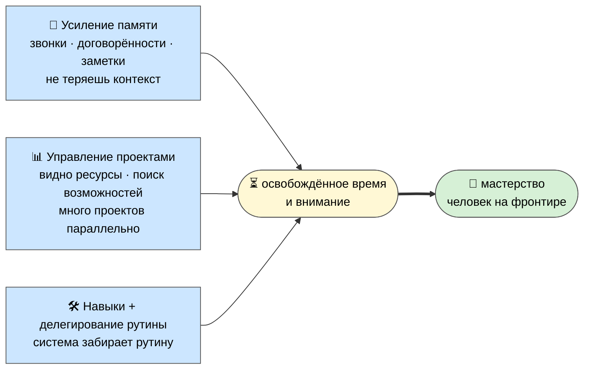

# 🏛️ Jetix — что это

> **Честная рамка (сразу).** Это не презентация продукта и не «вступай к нам». Это описание того,
> что я строю, выложенное открыто, чтобы можно было показать и спросить мнение. Если в конце скажешь
> «интересно, но не моё» — это нормальный и уважаемый ответ. Я ищу обратную связь, а не подписи.

Чтобы объяснить Jetix честно, надо идти слоями — снизу вверх. Сама суть лежит не в «платформе»,
а в одной простой идее о том, как вообще работает развитие. С неё и начну.

---

## Слой 1 — база: всё есть информация и методы её обработки

Если присмотреться, **всё, чем мы оперируем — это информация и методы её переработки.** Звук, образ,
разговор, документ, навык, привычка — это либо информация, либо способ что-то с ней сделать. Чтение —
метод. Программа — метод. Привычка — метод. [src: METHOD-V2 §1]

Из этого следует простая, но несущая мысль: **интеллект — человек или система — пытается развиваться,
и развивается тем быстрее, чем лучше методы, которыми он работает с информацией.** Не «больше знаю», а
«лучше умею выбрать и применить нужный метод в нужный момент». [src: METHOD-V2 §5]

> Это фундамент. Всё остальное в Jetix вырастает отсюда — это применение этой одной идеи.

---

## Слой 2 — на базу накладывается 3P: продукты, процессы, проекты

База «информация + методы» проявляется в жизни через **три формы — 3P:**

- **Продукты** — то, что создаётся. И главный продукт каждого человека — **его собственная жизнь.**
- **Процессы** — то, как это делается раз за разом (можно улучшать, можно ставить «на станок»).
- **Проекты** — то, что собирается ради конкретной цели и завершается.

3P — это не отдельная теория, а **та же база в применении**: продукты/процессы/проекты — это
информация и методы работы с ней, проявленные в деле. [src: O-237..O-241, Voice Batch 18]

И тут — ключевая мысль, которая многое объясняет: **ты — управляющий своей жизнью. Но и другие хотят
ею управлять** (работодатели, платформы, рынки, привычки). Управление = люди + системы + процессы +
технологии. Вопрос не «управляют ли тобой», а «насколько ты сам в этом управлении участвуешь и какими
методами». [src: O-240]

---

## Проблема, против которой работает Jetix — обесценивание мастеров

Сегодня появился reverse engineering на новом уровне: AI способен **заменить мастера**, просто
«посмотрев» его видео, прочитав его книги и разобрав его наработки. А дальше любой другой человек может
повторить то же самое — но эффективнее, **просто закинув больше вычислительных мощностей и ресурсов.**
[src: Ruslan voice 2026-05-29 P-1-enhance]

Опасность вот в чём. Из-за роста доступных вычислений настоящих мастеров начинают вытеснять **не более
талантливые мастера, а те, у кого банально больше ресурсов и compute.** В итоге доминируют не лучшие в
своём деле, а те, кто смог купить больше мощности. Это тупиковый путь — он **обесценивает само
мастерство.** [src: Ruslan voice 2026-05-29 P-1-enhance]

**Jetix работает именно с этой проблемой.** Мы защищаем мастеров от обесценивания — их знаний,
наработок, идей и их самих. Мы объединяем под одной платформой настоящих мастеров и тех, кто хочет ими
стать: людей, которым важно их дело и которые хотят бесконечно развиваться. Платформа даёт им
продолжать заниматься своим делом, но **защищает их интеллектуальный капитал от копирования и
обесценивания.** Ради этого вся система и строится. [src: Ruslan voice 2026-05-29 P-1-enhance]

**Защита через сложность.** Мы намеренно делаем проекты и системы всё сложнее — так, чтобы наработки
участников было трудно скопировать или «догнать» дешёвым reverse engineering. Важно понять рамку: эта
сложность служит **защите мастеров и их наработок от обесценивания**, а не тому, чтобы кого-то
«раздавить». Щит, а не таран. [src: Ruslan voice 2026-05-29 P-1-enhance · ECONOMIC-V10 §10 anti-extraction]

```mermaid
%%{init: {'theme':'base','themeVariables':{'background':'#ffffff','mainBkg':'#eef2f7','primaryColor':'#eef2f7','primaryTextColor':'#000','primaryBorderColor':'#555','secondaryColor':'#f5f5f5','tertiaryColor':'#ffffff','textColor':'#000','lineColor':'#333','edgeLabelBackground':'#ffffff','noteBkgColor':'#fff8d5','noteTextColor':'#000','clusterBkg':'#f5f5f5','clusterBorder':'#999','titleColor':'#000'}}}%%
graph LR
    classDef default fill:#eef2f7,stroke:#555,stroke-width:1px,color:#000;
    subgraph PROB[⚠️ Проблема]
        RE[🔁 reverse engineering<br/>AI копирует мастера<br/>с его видео и книг]
        CP[⚡ + больше compute<br/>и ресурсов]
        RE --> CP --> DOM[📉 вытесняют не лучшие,<br/>а те, у кого больше мощности<br/>= мастерство обесценено]
    end
    subgraph SOL[🏛️ Решение — Jetix]
        UN[🤝 объединяем мастеров<br/>под одной платформой]
        PR[🛡️ защита интеллектуального<br/>капитала от копирования]
        CX[🧩 защита через сложность<br/>щит, не таран]
        UN --> PR --> CX
    end
    DOM ==> UN
    style RE fill:#ffd6d6,color:#000
    style CP fill:#ffd6d6,color:#000
    style DOM fill:#ffd6d6,color:#000
    style UN fill:#d6f0d6,color:#000
    style PR fill:#d6f0d6,color:#000
    style CX fill:#fff8d5,color:#000
```

---

## Слой 3 — суть Jetix: мастерская, сеть, возможности

Теперь — что такое Jetix конкретно. Если база — «развиваться через лучшие методы», а задача —
**защитить мастеров от обесценивания**, то Jetix — это **место и среда, где это делается вместе.**
Три грани одного:

- **🏛️ Мастерская** — пространство (сначала виртуальное, потом сеть физических) со «станками»:
  инструменты, AI, шаблоны, исследовательский центр, зона тренировки навыка, место для встреч.
  Заходишь работать — выходишь немного бо́льшим мастером, чем был. Не курс, не диплом — **среда.**
  [src: WORKSHOP-CONCEPT §1]
- **🌍 Сеть кооперативных кланов** — не один центр-начальник, а равноправные ячейки (mesh, не звезда).
  Клан — автономная группа со своей культурой и методами; внутри почти полная свобода, общий — только
  ценностный пол. Любой может форкнуться и уйти, забрав свою долю. [src: METAPLAN-V4 §4]
- **✨ Возможности** — куча всего, что можно реализовать через эту среду; потенциал, честно, колоссальный.
  (Без обещаний «разбогатеешь» — обещаю не результат, а среду и честные правила. См. P-4.)

Метафора не выдумана: ремесленный цех, мастерская Возрождения, makerspace — места, где мастерство
передаётся через **участие в реальном деле**, а не через лекции. AI добавляет к этому рычаг: рутину
берёт на себя машина, человек идёт на фронтир. [src: WORKSHOP-CONCEPT §1, METHOD-V2 §4 tacit]

---

## Фундамент мастерской — «Усилитель мастера» (система управления жизнью)

Важно: вся «Мастерская» стоит в первую очередь на **системе управления собственной жизнью.** Это не
дополнение, а основание, на котором держится всё остальное. Я называю это **«Усилитель мастера»** — и
он собран из трёх слоёв. [src: Ruslan voice 2026-05-29 P-1-enhance]

1. **Усиление памяти** — система помнит всё за тебя: звонки, проблемы, договорённости, заметки.
   Перестаёшь терять контекст.
2. **Управление проектами** — модифицированный AI-слой: видно, сколько у тебя ресурсов, можно быстро
   искать возможности под каждый проект и вести много проектов параллельно.
3. **Усиление навыков + делегирование рутины** — система забирает рутину, которую человек не хочет
   делать. За счёт этого и работает усилитель: человек концентрируется на мастерстве, а не на рутине.

> Итого: мы строим **Усилитель мастера** — инструмент для самих мастеров и для дальнейшего продвижения
> мастерства, ответственности и развития. [src: Ruslan voice 2026-05-29 P-1-enhance]

---

## Философское ядро системы

> Система отталкивается от принципа: **каждый человек влияет на жизнь, а жизнь влияет на него.** Вопрос
> только в том, кто кем управляет — обстоятельства человеком или человек обстоятельствами. Это зависит
> от того, насколько он способен спланировать свой день, свои мысли и действия — и затем их выполнить.
>
> Насколько сильно ты влияешь на свои привычки, своё мышление и своё виденье мира — **ровно настолько
> же сильно ты влияешь на внешний мир и обстоятельства.**

Поэтому система и позволяет заполнять стратегические документы — чтобы эффективнее управлять своей
жизнью. Наша цель — собрать вместе людей, которые умеют управлять своей жизнью, и затем построить
систему и бизнес, который **адекватно и ответственно управляет всё бо́льшими процессами — на пользу
развитию мастеров, человечества, интеллекта и жизни в целом.** [src: Ruslan voice 2026-05-29 P-1-enhance]

> **Рамка честная (важно не прочесть наоборот).** «Управлять всё бо́льшими процессами» — это не про
> власть над людьми и не про «захват мира». Это про **ответственность и масштаб пользы**: чем лучше
> человек управляет своей жизнью, тем больше адекватной пользы он способен принести вокруг. Начинаем с
> основ — даже с того, что лежит ниже привычного уровня, — и идём глубоко и ответственно. Не «над», а
> «на пользу». [src: O-246, O-262 · R12 guard]

---

## Это уже рабочий шаблон, а не просто описание

Важная деталь: всё, что выше, — это не концепт на бумаге, а **готовый рабочий шаблон.**

- ~**90% техник уже описаны и реально работают** — всё реализовано в Notion.
- Главное здесь — **методология.** Её можно перенести на любое приложение.
- Начинаем в Notion → дальше строим собственное решение, где методология будет развиваться.

[src: Ruslan voice 2026-05-29 P-1-enhance]

> 📎 [Notion: рабочий шаблон системы — ссылки добавит Cloud Cowork (partner-safe)]

---

## Слой 4 — что нужно на текущий момент

Честно о стадии: **это середина стройки.** Substrate собран (год+ работы, открытый репозиторий),
Notion-каркас живой, но это ещё не «компания на полную». Сейчас нужно три вещи: [src: VOICE-PIPELINE-PUBLIC §L]

1. **Фундамент** — техническая, финансовая и юридическая основа, чтобы строить дальше правильно.
2. **Помощь** — руки и головы в конкретных местах.
3. **Партнёры** — взгляд, экспертиза, обратная связь от людей, которым я доверяю.

---

## Как это выглядит в жизни (один пример)

Человек заходит в мастерскую утром. У него своя задача — скажем, выстроить AI-консалтинг для малого
бизнеса. Рутину (поиск, черновики, разбор данных) делает AI. Освободившееся время он тратит на
сложное — там, где нужен он сам. За соседним «верстаком» — человек из другого города, с которым иначе
бы не пересёкся; полчаса вместе ловят слепое пятно в его подходе. К обеду он улучшил один из общих
инструментов и выложил обратно — через час его берут в работе в другой ячейке. Вечером он немного
бо́льший мастер, чем был утром — не «отсидел», а **вырос.** [src: WORKSHOP-CONCEPT §7]

---

## Что я прошу у тебя

В первую очередь — **обратную связь.** Где не сходится, что звучит наивно, чего не хватает. Дальше —
возможно, **помощь** в чём-то конкретном и **твой взгляд** как человека с опытом. Не деньги «на
спасение» и не «вступление в воронку» — честный разговор о том, что я строю. [src: ACK B18 §3]

---

> **DRAFT — R1.** Стратегические формулировки (определения, «суть Jetix», тон обещаний) — за Русланом.
> Этот черновик роя ждёт его prose-pass перед любой отправкой партнёру.
>
> Дальше по пакету: **P-2** (как именно работает метод) · **P-3** (масштаб — 16 направлений) ·
> **P-4** (что я гарантирую — ценности и R12) · **P-5** (твоя роль — как войти и выйти).
