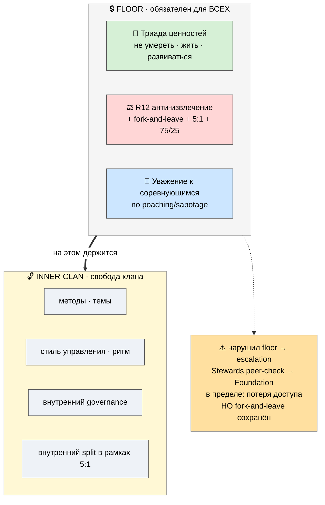

# 📋 Правила и самоуправление

> **Зачем эта страница.** Чтобы ты понимал, **как Jetix управляется** — без начальника-диктатора и
> без хаоса. Главный принцип: **минимум обязательного для всех (ценностный пол) + максимум свободы
> внутри клана.** Здесь — что именно обязательно, что свободно, и как разрешаются конфликты. [src: METAPLAN-V4 §9]

> **Честная рамка.** Это **правила по дизайну**, governance-каркас — не свод, обкатанный годами. Часть
> механизмов (Charter, dispute resolution) ещё предстоит выстроить на фундаменте (P-7, M2 legal). [src: P-7]

---

## 1. Два уровня правил (Charter — 2 слоя)

Вся система правил устроена как **двухуровневый Charter**:

- **🔒 Floor (пол) — обязателен для всех, enforced platform-wide.** Это минимум, ниже которого нельзя.
- **🔓 Inner-clan — свобода каждого клана.** Всё, что выше пола, клан решает сам.

---

## 2. Что обязательно для всех (Floor)

Только три вещи. Всё остальное — свобода.

1. **💎 Триада ценностей** — не умереть (пол) / жить чтобы жить (настоящее) / развиваться (вектор).
   Среда служит им, а не engagement-метрикам (см. P-4). [src: O-138]
2. **⚖️ R12 — анти-извлечение** — нельзя извлекать сверх согласованной доли; можно форкнуться и уйти
   без штрафа; потолок разрыва 5:1; доля 75/25; прозрачность (см. P-4 — 4 гарантии). [src: ECONOMIC-V10 §10]
3. **🤝 Уважение к соревнующимся** — кланы соревнуются, но без переманивания, саботажа и извлечения друг
   из друга. Победа поднимает планку сети. [src: METAPLAN-V4 §9]

> Этот пол — **единственное**, что Jetix навязывает. И он навязан **в защиту участников**, а не для
> подчинения. Убери пол — и среда на масштабе сползёт либо в секту, либо в корпорацию-диктатуру. [src: P-4]

---

## 3. Что свободно (Inner-clan)

Внутри клана — почти полная автономия: методы и темы работы · стиль управления и ритм · внутренний
governance (как клан принимает решения) · внутренний revenue-split (в рамках 5:1). Клан = «множество
путей под одним полом», а не один навязанный путь. [src: METAPLAN-V4 §4]

---

## 4. Особое правило — анти-dark-patterns (#15, gate)

Одно направление помечено особо: **#15 Геймификация** — единственное место, где инструмент мотивации
легко превращается в инструмент манипуляции (те же прогресс-бары и достижения, что TikTok использует
для удержания-любой-ценой). Поэтому к нему привязан **обязательный аудит до любой реализации**:

- ❌ **Запрещено:** addictive loops · variable-reward (slot-machine) · искусственный FOMO/срочность ·
  streak-страх потери · pay-to-win · vanity-метрики как цель.
- ✅ **Дисциплина:** intrinsic motivation · meaningful progression · opt-out always · **метрика = «насколько
  ты вырос», НЕ «время в приложении»** (anti-TikTok).
- **Тест:** *убери метрику «время в системе» — механика всё ещё ценна пользователю?* Если да — проходит.

> Это правило про честность к самим участникам: не превращать среду развития в ловушку внимания. [src:
> METAPLAN-V4 §5 anti-dark-patterns; #15 gate]

---

## 5. Как разрешаются конфликты (governance flow)

Самоуправление, не «начальник решает»:

1. **Внутри клана** — Steward + внутренний consensus / RACI.
2. **Между кланами** — Stewards разных кланов **peer-check** друг друга.
3. **Если не разрешилось** — **Foundation dispute resolution** (нейтральный уровень).
4. **Крайняя мера** — клан, нарушающий пол, теряет доступ к платформе. **Но члены всегда сохраняют
   fork-and-leave** — никого нельзя запереть даже в наказание. [src: METAPLAN-V4 §4 inter-clan governance]

---

## Что это значит для тебя как партнёра

Правил, которым ты обязан подчиняться, — **три** (пол), и все три — в твою защиту, а не для контроля над
тобой. Всё остальное — твой выбор и выбор твоего клана. И если когда-нибудь правила перестанут тебя
устраивать — ты уходишь со своим, без штрафа. Это и есть «самоуправление»: минимум принуждения, максимум
автономии, защита растёт быстрее системы.

---

> **DRAFT — R1.** Формулировки пола и governance-flow ждут prose-pass Руслана. R12 / 5:1 / триада
> приведены из LOCKED substrate, не модифицированы. Глубже: `JETIX-METAPLAN-V4-FINAL` §9 (Правила) +
> §4 (governance). Связанные: **P-4** (ценности / R12 / 4 гарантии) · **P-9** (кланы lifecycle) ·
> **P-3** (#9 Правила, #15 Геймификация на карте).
