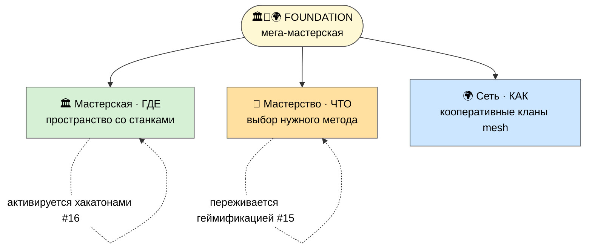

# 🏛️ Мастерская — что это за пространство

> **Зачем эта страница.** «Мега-мастерская» — это **несущая метафора** всего Jetix (в P-1 я назвал её
> сутью, в P-3 — Foundation, вокруг которого 16 направлений). Здесь раскрываю её детальнее: что это за
> пространство, какие в нём «станки», и как оно растёт online → offline. Если понять мастерскую — всё
> остальное «развешано» вокруг неё. [src: METAPLAN-V4 §1 Foundation]

> **Честная рамка.** Сейчас мастерская = **виртуальная** (Notion-каркас + AI-инструменты + методология,
> ~90% техник работают). Физическая сеть — амбиция, не факт (P-7). Это описание *куда идёт*, на готовом
> виртуальном ядре. [src: P-1 «рабочий шаблон»; P-7 online→offline осторожно]

---

## 1. Почему именно «мастерская» (а не «платформа» или «курс»)

Метафора не выдумана для красоты — она выбрана потому, что **мастерство передаётся через участие в
реальном деле**, а не через лекции:

- **Ремесленный цех / мастерская Возрождения / makerspace** — места, где подмастерье растёт рядом с
  мастером, на реальной работе. Не «отсидел курс» — а **сделал и вырос**.
- **Курс** даёт информацию и заканчивается. **Мастерская** — это среда, в которую возвращаешься, и
  каждый раз выходишь немного бо́льшим мастером.
- **AI добавляет рычаг:** рутину (поиск, черновики, разбор данных) берёт машина — человек идёт на
  фронтир, туда, где нужен он сам. [src: WORKSHOP-CONCEPT §1; METHOD-V2 §4 tacit knowledge]

> Заходишь работать — выходишь немного бо́льшим мастером, чем был. Не курс, не диплом — **среда.**

---

## 2. Три грани Foundation (одна мастерская, три проекции)

В центре всего — мега-мастерская. У неё три грани, встроенные в каждое из 16 направлений:

- **🏛️ Мастерская — ГДЕ** (пространство со станками).
- **🎯 Мастерство — ЧТО** прокачивают (выбор нужного метода в нужный момент, см. P-2).
- **🌍 Сеть — КАК** распределено (кооперативные кланы, mesh не звезда, см. P-9).

---

## 3. «Станки» мастерской (что внутри)

Мастерская — это пространство со «станками»: инструментами, которые берут рутину и усиливают мастера.

| «Станок» | Что делает |
|---|---|
| 🤖 **AI-инструменты** | research, сбор, черновики, разбор данных — рутина на машину |
| 📋 **Шаблоны / методология** | готовые методы и SOP — не изобретать заново |
| 🔬 **Исследовательский центр** | где копают новое, на фронтире |
| 🏋️ **Зона тренировки навыка** | где прокачивают мастерство на реальных задачах |
| 🤝 **Место для встреч** | где люди пересекаются, ловят слепые пятна друг друга |
| 🧠 **«Усилитель мастера»** | система управления жизнью (память/проекты/делегирование, см. P-1) |

> Фундамент самой мастерской — **«Усилитель мастера»** (система управления собственной жизнью): без
> него остальные станки не на чем стоят. Подробно — в P-1. [src: WORKSHOP-CONCEPT §1; P-1 Усилитель]

---

## 4. Как мастерская растёт: online → offline

```mermaid
%%{init: {'theme':'base','themeVariables':{'background':'#ffffff','mainBkg':'#eef2f7','primaryColor':'#eef2f7','primaryTextColor':'#000','primaryBorderColor':'#555','secondaryColor':'#f5f5f5','tertiaryColor':'#ffffff','textColor':'#000','lineColor':'#333','edgeLabelBackground':'#ffffff','noteBkgColor':'#fff8d5','noteTextColor':'#000','clusterBkg':'#f5f5f5','clusterBorder':'#999','titleColor':'#000'}}}%%
graph LR
    classDef default fill:#eef2f7,stroke:#555,stroke-width:1px,color:#000;
    ON[💻 Online сейчас<br/>Notion-каркас + AI<br/>~90% техник работают]
    EV[🏆 События/хакатоны<br/>активируют пространство<br/>день/месяц/год]
    OFF[🏢 Offline сеть позже<br/>физические мастерские<br/>экспедиции/поездки]
    ON -->|осторожно| EV --> OFF
    NOTE[⚠️ offline = амбиция,<br/>темп осторожный · P-7]
    OFF -.-> NOTE
    style ON fill:#d6f0d6,color:#000
    style EV fill:#ffe0a0,color:#000
    style OFF fill:#cce6ff,color:#000
    style NOTE fill:#ffd6d6,color:#000
```

- **Сейчас (online):** виртуальная мастерская — Notion-каркас + AI-инструменты + методология. Работает.
- **События активируют:** хакатоны (#16) приводят статичное пространство в движение — день/месяц/год
  ритмы; здесь же материализуется экономика (см. финмодель, P-6/P-7).
- **Offline позже:** сеть физических мастерских + экспедиции/поездки «через Jetix». **Темп осторожный** —
  это амбиция, не обещание срока. [src: METAPLAN-V4 §6 хакатоны; §11 online→offline]

---

## 5. Один день в мастерской (тот же пример, что в P-1)

Человек заходит утром. Своя задача — скажем, AI-консалтинг для малого бизнеса. Рутину (поиск, черновики,
разбор данных) делает AI. Освободившееся время он тратит на сложное — там, где нужен он сам. За соседним
«верстаком» — человек из другого города; полчаса вместе ловят слепое пятно в его подходе. К обеду он
улучшил один из общих инструментов и выложил обратно — через час его берут в работу в другой ячейке.
Вечером он немного бо́льший мастер, чем был утром — не «отсидел», а **вырос.** [src: WORKSHOP-CONCEPT §7]

---

## Что это значит для тебя как партнёра

Мастерская — это не продукт, который тебе продают, а **среда, в которую ты заходишь работать** над
своим делом, с лучшими станками и людьми рядом. Чем понятнее тебе эта метафора, тем яснее всё
остальное: 16 направлений — это её грани, кланы — как в ней группируются, метод — как в ней работают.

---

> **DRAFT — R1.** Формулировка метафоры и тон ждут prose-pass Руслана. Глубже: `JETIX-WORKSHOP-MASTERY-
> NETWORK-CONCEPT` (THE foundation) + `METAPLAN-V4` §1. Связанные: **P-1** (Слой 3 + Усилитель мастера) ·
> **P-3** (#12 Мастерская, Foundation) · **P-9** (кланы в мастерской) · **P-2** (как в ней работают).
