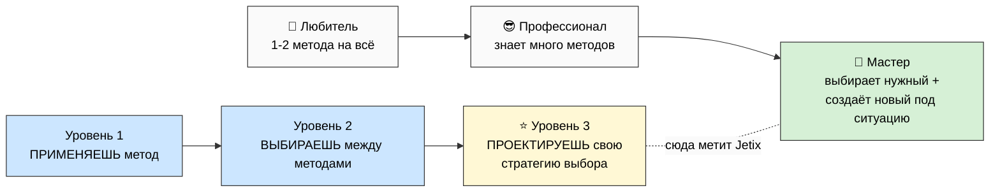
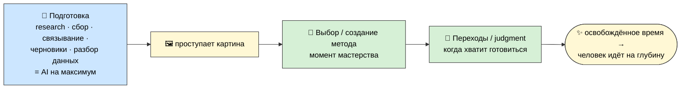

# 🧪 Метод — как мы работаем

> **Честная рамка.** Это не новая фундаментальная методология и не «секрет успеха». Это синтез
> проверенного (Левенчук, Эрикссон, Дуэк, восточные традиции мастерства, инженерная культура),
> усиленный AI и выложенный открыто. Вклад честно небольшой — в **синтезе + AI-усилении** и в
> нескольких вещах, сделанных явными. Не «купи метод», а «вот как я работаю, проверь». [src: VOICE-PIPELINE-PUBLIC §K]

P-1 дал базу: **всё = информация + методы её обработки, и интеллект развивается через лучшие методы.**
Этот документ раскрывает, **как именно** это делается на практике.

---

## 1. Мастерство = не «знать много», а «выбрать нужное в нужный момент»

Три разных вещи легко путают:
- **Любитель** знает 1-2 метода и лупит ими по всему.
- **Профессионал** знает много методов.
- **Мастер** знает много **И выбирает правильный под конкретную ситуацию** — а иногда понимает, что
  нужного нет, и создаёт новый. [src: METHOD-V2 §5, WORKSHOP-CONCEPT §2]

Мастерство = **накопить нужные методы + выбрать и применить нужный в нужный момент.** Это и есть то,
чему Jetix помогает учиться — не списку приёмов, а самому умению выбирать.

---

## 2. Метод выбора методов (вот в чём отличие)

Есть лестница уровней работы:
- Уровень 1 — применяешь метод.
- Уровень 2 — выбираешь между методами.
- **Уровень 3 — проектируешь свою стратегию выбора** (как ты вообще решаешь, что применять). ⭐

Большинство обучения останавливается на уровне 1, кто-то доходит до 2. **Jetix работает на уровне 3** —
учит не методам, а тому, как выбирать методы под себя и под ситуацию. Это и значит «развивать самого
себя», а не просто «накапливать приёмы». [src: METHOD-V2 §5 §J]

---

## 3. Где машина, а где человек (AI-стратификация)

Граница проведена осознанно, и это важно:
- **Подготовка** (research, сбор, связывание, черновики, разбор данных) — **здесь AI на максимум.**
  Это рутина, где интеллект человека не нужен.
- **Выбор или создание метода действия** — **здесь человек.** Момент мастерства.
- **Переходы** (когда остановить подготовку и начать действовать) — **человек.** Это judgment.

AI **не заменяет** человека — он **освобождает время для глубины.** Рутину отдаём машине, чтобы человек
шёл на сложное и непонятное. [src: METHOD-V2 §6, O-182]

И ещё один ход: когда делаешь подготовку как следует, после неё **проступает картина**, и на ней можно
создать **уникальный метод под эту конкретную ситуацию** — часто эффективнее любого готового из
репертуара. Поэтому подготовка — не «прелюдия», а место, где рождается метод. [src: PREPARATION-STAGE §K]

---

## 4. Компаунд: почему это даёт рычаг

Если новые знания **связываются** с уже накопленным, польза растёт не линейно, а экспоненциально
(1% в день → ~37× за год). Большинство людей живут без компаунда: потребляют поверхностно, не
связывают, не ведут внешнюю память, не рефлексируют. Метод развития — это **активная борьба** с этим:
ловить мысли, связывать в базу, доставать нужное под текущий вопрос. [src: METHOD-V2 §4]

И отдельно — **эра AI сдвинула рычаг.** Раньше, чтобы накопить серьёзную базу методов, нужны были годы.
Сейчас человек с AI-substrate накапливает её в разы быстрее. Окно открыто — но оно не вечное; когда
им пользуются все, преимущество выравнивается. [src: METHOD-V2 §6 exocortex]

---

## 5. Живой инструмент: voice-pipeline (как это работает на мне)

Самый конкретный пример метода в действии — практика, которой я пользуюсь больше года:

Голова производит мысли быстрее, чем рука их пишет, и лучшие мысли приходят не за столом — на прогулке,
в очереди, перед сном. Я ловлю их **голосом** (телефон всегда под рукой), а дальше конвейер: транскрипт
→ AI связывает каждую мысль со всей накопленной базой (что новое, что повторяет, что **противоречит** —
ценнейший обычно теряемый сигнал) → потом под конкретный вопрос «линза» достаёт связанный кусок базы,
и из него **проступает картина**, которой не было ни в одной отдельной заметке. [src: VOICE-PIPELINE-PUBLIC §C]

Так, например, родилась сама метафора «мега-мастерской» — десятки разрозненных голосовых заметок про
образование и мастерство AI связал в один подграф, и стало видно: всё это — описание **мастерской.**
**Машина поймала и связала — смысл родился у человека.** Augmentation, не замена. [src: VOICE-PIPELINE-PUBLIC §D]

> Важная деталь честности: в этом конвейере **два обязательных human-gate** — AI ничего не кладёт в базу
> сам. Авто-распределение пробовали и **откатили**: «звучит правильно, но не точно». Ручной review —
> non-negotiable. [src: VOICE-PIPELINE-PUBLIC §O]

---

## Что из этого важно для тебя

Если коротко: метод — это не про «много знать», а про **умение выбирать и создавать методы**, с AI на
подготовке и человеком на сути. Если что-то здесь резонирует с твоим опытом — отлично, давай обсудим
где сходится и где нет. Если звучит слишком абстрактно — это тоже полезный сигнал.

---

> **DRAFT — R1.** Формулировки определения метода и границы AI/человек = за Русланом. Черновик роя ждёт
> prose-pass. Глубже: `METHOD-LIFE-DEVELOPMENT-V2` (canonical, §J meta-method) ·
> `VOICE-PIPELINE-PUBLIC-V2` (инструмент + код открыт).
