# 🗺️ Карта Jetix — масштаб и структура

> **Зачем эта страница.** Чтобы за один взгляд увидеть, **сколько всего** и **как оно организовано.**
> Это не список «модулей продукта» — это карта одной идеи (мастерская), развёрнутой в 16 направлений.
> Не пугайся объёма: всё держится на одной метафоре, направления — её грани и детали. [src: METAPLAN-V4]

---

## Несущая рамка — Foundation (одна метафора, три грани)

В центре всего — **мега-мастерская.** У неё три грани, и они встроены в каждое из 16 направлений:

- **🏛️ Мастерская** — ГДЕ (пространство со станками)
- **🎯 Мастерство** — ЧТО прокачивают (выбор нужного метода в нужный момент)
- **🌍 Сеть** — КАК распределено (кооперативные кланы, mesh не звезда)

```mermaid
%%{init: {'theme':'base','themeVariables':{'background':'#ffffff','mainBkg':'#eef2f7','primaryColor':'#eef2f7','primaryTextColor':'#000','primaryBorderColor':'#555','secondaryColor':'#f5f5f5','tertiaryColor':'#ffffff','textColor':'#000','lineColor':'#333','edgeLabelBackground':'#ffffff','noteBkgColor':'#fff8d5','noteTextColor':'#000','clusterBkg':'#f5f5f5','clusterBorder':'#999','titleColor':'#000'}}}%%
graph TB
    classDef default fill:#eef2f7,stroke:#555,stroke-width:1px,color:#000;
    F([🏛️🎯🌍 FOUNDATION<br/>мега-мастерская])
    F --> WK[🏛️ Мастерская · ГДЕ]
    F --> MA[🎯 Мастерство · ЧТО]
    F --> NE[🌍 Сеть · КАК]

    WK --> D2[🚀 #2 Платформа<br/>станки]
    WK --> D12[🏛️ #12 Мастерская<br/>пространство]
    WK --> D16[🏆 #16 Хакатоны<br/>движок: доход]

    MA --> D1[🧪 #1 Метод<br/>хаб]
    MA --> D13[🎯 #13 Мастерство]
    MA --> D7[🎓 #7 Образование]
    MA --> D15[🎮 #15 Геймификация<br/>движок: вовлечение · R12 STRICT]

    NE --> D4[💰 #4 Заработок<br/>75/25 · 5:1]
    NE --> D8[⚖️ #8 R12 / Обещание<br/>хаб · этика]
    NE --> D14[🌍 #14 Сеть + Кланы]
    NE --> D3[💼 #3 Бизнес<br/>кооператив]

    F --> ARC[📜 #6 Видение → #11 Master Plan]
    ARC --> VAL[💎 #10 Ценности · 📋 #9 Правила · 👥 #5 Партнёры]

    style F fill:#fff8d5,color:#000
    style WK fill:#d6f0d6,color:#000
    style MA fill:#ffe0a0,color:#000
    style NE fill:#cce6ff,color:#000
    style D8 fill:#ffd6d6,color:#000
    style D15 fill:#ffd6d6,color:#000
```

**3 хаба навигации** (с них удобнее всего входить): #1 Метод · #8 R12 · #12 Мастерская.
**2 движка** (что приводит мастерскую в движение): #16 Хакатоны (доход + сообщество) · #15
Геймификация (ежедневное переживание прогресса). [src: METAPLAN-V4 §1]

---

## 16 направлений — по одной строке каждое

| # | Направление | Что это |
|---|---|---|
| 1 | 🧪 **Метод** | Как работать с информацией и методами; «метод выбора методов» (см. P-2). |
| 2 | 🚀 **Платформа** | Personal / Team / Universal OS + AI-инструменты — «станки» мастерской. |
| 3 | 💼 **Бизнес** | Как устроена компания: кооператив + governance + операционка. |
| 4 | 💰 **Заработок** | Модели дохода; 75% участникам / 25% институционально; потолок разрыва 5:1. |
| 5 | 👥 **Партнёры** | 4 типа партнёров и роли; кого ищем и зачем. |
| 6 | 📜 **Видение** | Куда идёт Jetix; мастерская как «тело» видения. |
| 7 | 🎓 **Образование** | Чему и как учим; 7 ступеней (Bloom); смена парадигмы в эпоху AI. |
| 8 | ⚖️ **R12 / Обещание** | Анти-извлечение + право форкнуться и уйти; ядро этики (см. P-4). |
| 9 | 📋 **Правила** | Свод правил работы; граница «общий пол vs свобода клана». |
| 10 | 💎 **Ценности** | Триада: жить чтобы жить / не умереть / развиваться. |
| 11 | 📜 **Master Plan** | План в формате Tesla: Build → Run → Scale → Mature. |
| 12 | 🏛️ **Мастерская** | Пространство со станками; переход online → offline. |
| 13 | 🎯 **Мастерство** | Концепция роста; темы vs уровни; вечная тренировка. |
| 14 | 🌍 **Сеть + Кланы** | Кооперативные кланы (mesh); 7 фаз жизни клана; общий пул ресурсов. |
| 15 | 🎮 **Геймификация** | Ощутимый прогресс каждый день. **R12 STRICT** — здесь максимум соблазна манипуляции, поэтому здесь же максимум защиты (anti-dark-patterns). |
| 16 | 🏆 **Хакатоны / События** | Хакатоны, соревнования, экспедиции — основной движок дохода и сообщества. |

---

## Как читать эту карту

- **Не нужно** разбираться во всех 16 сразу. Достаточно понять Foundation (мастерская + 3 грани) —
  остальное «развешано» вокруг.
- **#15 Геймификация** помечена особо: это единственное направление, где инструмент мотивации легко
  превращается в инструмент манипуляции. Поэтому к нему привязан обязательный аудит до любой реализации
  (см. P-4). [src: METAPLAN-V4 §5]
- **Честный статус.** Карта — это **структура того, что строится**, а не «всё уже работает». Сейчас
  готова часть (метод, voice-pipeline, экономическая модель, Notion-каркас); большинство направлений —
  в стадии наполнения. [src: VOICE-PIPELINE-PUBLIC §L]

> **🔖 Раскрытие ключевых направлений (добавлено 2026-05-30).** Три направления, которые на карте видны
> одной строкой, теперь раскрыты отдельными доками: **#14 Сеть+Кланы → P-9** (lifecycle 7 фаз) · **#9
> Правила → P-10** (пол vs свобода) · **#12 Мастерская → P-11** (foundation metaphor). Числа экономики
> (#4 Заработок) → **A1 финмодель** (иллюстративная). [src: audit системный пробел #3]

> Дальше: **P-4** — что из этого я тебе гарантирую (ценности и R12). **P-5** — твоя роль в этой карте.
