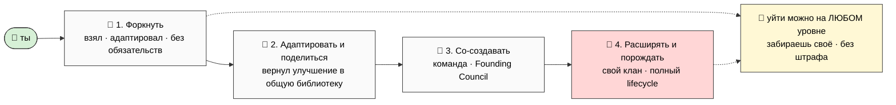

# 🤝 Как участвовать

> **Рамка.** Этот документ — про **тебя**, а не про Jetix. Я не зову «вступить» и не строю воронку.
> Я показываю, что строю, и спрашиваю мнение. Участие — на твоих условиях и в твоём объёме, вплоть до
> «спасибо, посмотрел, не моё» — это тоже полностью нормальный ответ. [src: ACK B18 §3]

---

## Что я прошу в первую очередь

Три вещи, по убыванию важности: [src: ACK B18 «что хотим от партнёра»]

1. **Обратную связь.** Где не сходится, что звучит наивно, чего не хватает, где я себя обманываю.
   Это самое ценное прямо сейчас — substrate не прошёл чужие глаза, а путь от «наработки одного
   автора» к «проверенному» лежит только через них. [src: VOICE-PIPELINE-PUBLIC §E]
2. **Помощь** — какая-то конкретная, если откликнется (по твоей экспертизе).
3. **Твой взгляд** — как человека с опытом: что бы ты сделал иначе, на что смотреть.

Дальше — будет видно. Я не прошу денег «на спасение» и не предлагаю «инвестировать в единорога».

---

## Четыре уровня участия — выбираешь сам

Участвовать можно на любом уровне, и **каждый сделан так, чтобы выход был легче, а не сложнее.**
Это и есть проверка на честность: убери возможность уйти — уровень всё ещё привлекателен? Если да —
честно. [src: METAPLAN-V4 §9, Phase 20 extension protocol]

- **🍴 Уровень 1 — Форкнуть.** Взял что-то (метод, шаблон, инструмент), адаптировал под себя. Никаких
  обязательств. Открыто, как open-source. Это и есть доказательство, что тут нет lock-in.
- **🔄 Уровень 2 — Адаптировать и поделиться.** Улучшил — вернул в общую библиотеку (с проверкой на
  R12). Взаимный обмен, не дань.
- **🤝 Уровень 3 — Со-создавать.** Разрабатываешь вместе с командой; участвуешь в Founding Council.
- **🌱 Уровень 4 — Расширять и порождать свой клан.** Собираешь автономную кооперативную группу со
  своей культурой, методами и экономикой (в рамках общего пола). Можешь даже породить суб-клан.
  [src: METAPLAN-V4 §4 Кланы lifecycle]

---

## Как войти, как быть внутри, как выйти

- **Войти** — никакого «обряда». Начинается с разговора и обратной связи. Дальше — по интересу и
  объёму, который тебе подходит.
- **Быть внутри** — на видимых, оговорённых заранее условиях (см. P-4: 75/25, потолок 5:1,
  прозрачность). Внутри клана — почти полная свобода методов и тем; общий — только ценностный пол.
- **Выйти** — **в любой момент, забрав свою долю, без штрафа и без клейма.** Это не «худший сценарий»,
  а встроенная гарантия. Свободный выход — то, что делает вход безопасным. [src: ECONOMIC-V10 §10.1]

---

## Что honest, а что нет (чтобы не было сюрпризов)

- **Honest:** это середина стройки, не готовая компания. Substrate — год+ работы одного автора,
  усиленного AI, не прошедший peer-review. Твой вклад на раннем этапе реально влияет на форму.
- **НЕ обещаю:** доход, «успех», масштаб. Обещаю среду, честные правила и свободный выход (P-4).
- **Зову не «купить», а «проверить».** Лучший исход этого разговора для меня — ты скажешь, где я не
  прав. [src: VOICE-PIPELINE-PUBLIC §E/§L]

---

> **Следующий шаг — за тобой.** Если откликается — давай созвонимся и пройдёмся по тому, что зацепило
> или вызвало вопросы. Если нет — спасибо, что посмотрел. Без обид и без давления.
>
> *(Draft → Ruslan pass. Глубже про роли и кланы: `JETIX-METAPLAN-V4-FINAL` §4/§9.)*
