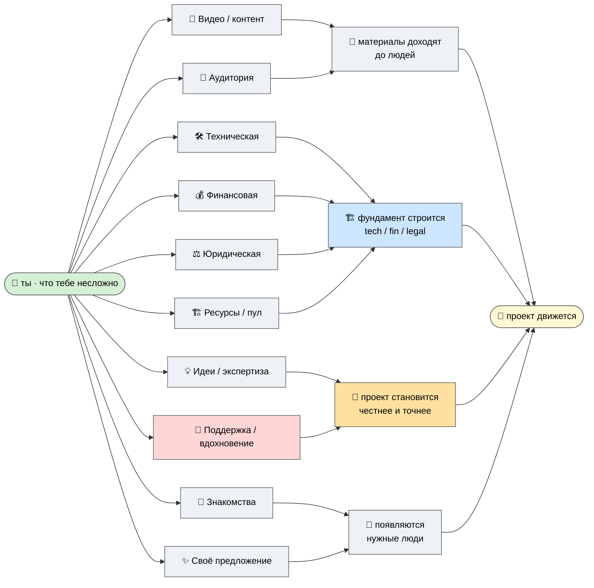

# 🙌 Чем можно помочь

> **Зачем эта страница.** Чтобы ты сразу увидел, **чем именно** можешь внести вклад — без долгих
> расспросов «а что вам нужно?». Здесь честно и широко: вот где проекту сейчас не хватает рук, голов и
> ресурсов. Низкий барьер: **смотри на то, что тебе несложно и кажется нормальным** — этого уже
> достаточно. [src: Ruslan voice 2026-05-29 partner-extend]

> **Рамка (важно прочитать до списка).** Это **вклад в общее дело**, а не «дайте денег на спасение».
> Никакого давления, никаких обязательств, никакого чувства вины, если ты ничего не дашь. Это
> приглашение, а не сбор. И то, что ты внесёшь, **не извлекается сверх оговорённой доли** — а уйти со
> своим можно в любой момент (см. P-4, R12). [src: ECONOMIC-V10 §10.1]

---

## Десять способов помочь — выбери, что откликается

Не нужно мочь во всё. Достаточно одного пункта, который тебе по силам и в радость.

- 🎥 **Видео / контент.** Запись и монтаж: убрать долгие дубли и сырые куски, собрать из наработок
  чистый материал, оформить. У меня много «сырца» — он ждёт руки, которая сделает его смотрибельным.
- 🛠️ **Техническая помощь.** Stack, инфраструктура, multi-agent системы, pipeline, AI/ML. Если ты
  инженер — здесь широкое поле: от ревью архитектуры до конкретного куска кода.
- 💰 **Финансовая.** Структура и бюджет, fundraising, спонсорство, доступ к ресурсам. Не «дай денег», а
  «помоги выстроить финансовую часть честно и устойчиво».
- ⚖️ **Юридическая.** Корпоративная и кооперативная структура, IP, правовой каркас кланов. Это один из
  трёх столбов фундамента (см. P-7, M2) — и здесь нужен профессиональный взгляд.
- 📣 **Развитие аудитории.** Сообщество, дистрибуция, амплификация. Помочь, чтобы материалы дошли до
  тех, кому они полезны — value-first, без накрутки.
- 💡 **Идеи / стратегия / экспертиза.** Свежий взгляд, обратная связь, методология. Где я наивен, где
  ошибаюсь, чего не вижу. Это, возможно, самое ценное прямо сейчас (перекликается с P-5).
- 🧠 **Психологическая поддержка / вдохновение.** Моральная опора, мотивация, вера в дело. Строить
  в одиночку тяжело — и это **тоже реальный вклад**, не «меньшая» помощь.
- 🤝 **Знакомства / интро / связи.** Свести с нужным человеком — инженером, юристом, инвестором,
  носителем экспертизы, единомышленником. Часто одно интро двигает дело сильнее месяца работы.
- 🏗️ **Любые ресурсы.** Помещения, оборудование, доступы, инструменты. Кооперативный паттерн —
  складываем то, что у каждого есть, в общий пул (Mondragón pooling). [src: ECONOMIC-V10 §9]
- ✨ **Любые предложения и возможности.** «Предлагай — мы открыты.» Если ты видишь способ помочь,
  которого нет в списке, — он тоже подходит. Берём всё, что честно двигает дело вперёд.

---

## Карта вклада — как каждый тип помогает проекту двигаться

---

## Как устроена экономика вклада (числа — иллюстрация, не обещание)

> **🔖 числа + фонд (встроено 2026-05-30, DRAFT R1).** Полная модель — `JETIX-FINANCIAL-MODEL-DRAFT`
> (A1, иллюстративная, явные допущения). [src: ECONOMIC-V10 · Концепт 1 · audit Таблица 2 «Числовая
> модель» ⭐ P0 + «фонд» CRITICAL]

Чтобы было видно, что экономика **сходится арифметически** (а не «как-нибудь заработаем»), вот её
структура — **с явными допущениями, как иллюстрация, не как прогноз и не как обещание дохода:**

- **Доля 75/25.** 75% — создателям ценности; **25% — в институциональный фонд.**
- **Фонд = реинвест-петля, НЕ доходность инвестору.** 25% реинвестируются (а) в систему (растит
  инструменты для всех) и (б) в порождение новых кланов (паттерн Mondragón Caja Laboral). Деньги не
  «лежат» и не «доят» — они **возвращаются в дело.**
- **Откуда доход:** события/хакатоны (основной движок) + подписка/инструменты + фонд-возврат — три
  источника, не один.
- **Resource-pooling:** твой вклад (любой из 6 ресурсов) складывается с вкладами когорты **сверх-аддитивно**
  (см. P-5).
- **4 R12-guards на фонд:** нельзя извлекать сверх доли · 5:1 · выход с долей (RageQuit) · согласие. Без
  них фонд = доение — поэтому guards обязательны и видимы.

> ⚠️ **Все числа в A1 — сценарные допущения** (take rate 25%, ~100 платящих партнёров для самоокупаемости
> Y3-Y5, bridge ~€245K Y1-4). Это «при таких-то допущениях получается такой-то порядок», а **не**
> «гарантированно заработаешь X». Я не торгую цифрами роста (см. P-4).

## Честная рамка вклада (чтобы не было давления)

- **Что несложно тебе — уже ценно.** Я не жду, что ты возьмёшь на себя много. Один точечный вклад,
  который тебе по силам, — нормальный и полный ответ.
- **Никаких обязательств.** Помог один раз — спасибо. Не помог — тоже спасибо, что посмотрел. Отказ
  не портит отношения.
- **Это не сбор ресурсов «любой ценой».** Когда я говорю «нам пригодится всё, что помогает», это
  **открытое приглашение к вкладу**, а не ненасытность. Если что-то ощущается как давление —
  значит, я сформулировал плохо, скажи мне. [src: Ruslan voice 2026-05-29 partner-extend]
- **R12.** Что внесёшь — не извлекается сверх оговорённой доли; в любой момент можешь форкнуться и
  уйти со своим, без штрафа (см. P-4). Вклад безопасен по конструкции. [src: ECONOMIC-V10 §10.1]

---

> **Следующий шаг — за тобой.** Если какой-то пункт откликнулся — давай обсудим, как это удобно
> сделать. Если нет — это тоже полностью нормальный ответ (см. P-5).
>
> *(DRAFT → Ruslan prose-pass. Рамка asks и тон приглашения = подпись Руслана, R1.)*
