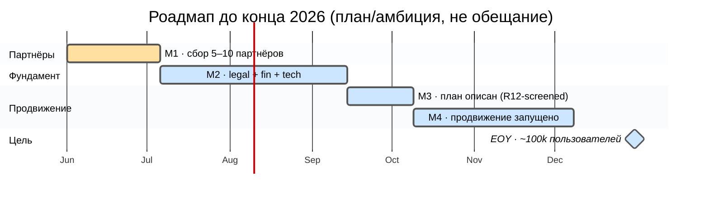
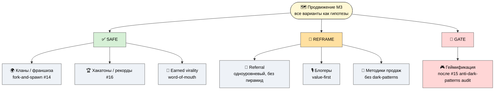

# 🧭 Где мы сейчас и куда идём

> **Зачем эта страница.** Чтобы ты честно понимал: **где проект прямо сейчас** и **куда он идёт** —
> ключевые точки по времени. Без приукрашивания текущей стадии и без занижения амбиции. [src: Ruslan
> voice 2026-05-29 partner-extend]

> **Честно про стадию.** Сейчас это **один человек (Руслан) плюс AI**, документы и наработки, стадия
> идеи и фундамента. Не команда, не работающая платформа, не компания. Всё, что ниже про будущее, —
> **план и амбиция, а не обещание.** [src: VOICE-PIPELINE-PUBLIC §L]

---

## Точки на пути: T0 → M1 → M2 → M3 → M4 → конец года

| Точка | Что | Срок |
|---|---|---|
| **Сейчас (T0)** | Документы и наработки; **один человек** + AI; стадия идеи и фундамента. | — |
| **M1 — партнёры собраны** | Сбор основных партнёров (~10 человек) + совместное обсуждение, что и как улучшить. **Milestone = 5–10 партнёров в кругу.** | ~1 месяц |
| **M2 — фундамент построен** | Фундамент платформы **реально сделан** (не описан — построен): юридическая + финансовая + техническая части. | после M1 |
| **M3 — план продвижения описан** | Описан максимально возможный план продвижения (см. меню ниже), каждый вариант **R12-screened**. | после M2 |
| **M4 — продвижение запущено** | Блогеры + потенциальные помощники → люди **сами заходят**, изучают материалы, строят бизнес, общаются, улучшают жизнь. | после M3 |
| **Конец года (цель)** | **~100 000 пользователей** — это **амбициозный план, а не обещание роста.** | конец 2026 |

> Каждая точка **разблокирует** следующую: партнёры дают руки и обратную связь для фундамента; готовый
> фундамент делает безопасным продвижение; продвижение приводит людей. Порядок не случаен — нельзя
> звать толпу в недостроенный дом. [src: Ruslan voice 2026-05-29 partner-extend]

```mermaid
%%{init: {'theme':'base','themeVariables':{'background':'#ffffff','mainBkg':'#eef2f7','primaryColor':'#eef2f7','primaryTextColor':'#000','primaryBorderColor':'#555','secondaryColor':'#f5f5f5','tertiaryColor':'#ffffff','textColor':'#000','lineColor':'#333','edgeLabelBackground':'#ffffff','noteBkgColor':'#fff8d5','noteTextColor':'#000','clusterBkg':'#f5f5f5','clusterBorder':'#999','titleColor':'#000'}}}%%
graph LR
    classDef default fill:#eef2f7,stroke:#555,stroke-width:1px,color:#000;
    T0[📍 T0 · Сейчас<br/>1 человек + AI<br/>документы, наработки]
    M1[👥 M1 · Партнёры<br/>собраны 5–10<br/>+ обсуждение]
    M2[🏗️ M2 · Фундамент<br/>legal + fin + tech<br/>реально построен]
    M3[🗺️ M3 · План продвижения<br/>максимальный<br/>· R12-screened]
    M4[🚀 M4 · Продвижение<br/>запущено · блогеры<br/>+ помощники]
    EOY[🎯 Конец года<br/>~100k пользователей<br/>план/амбиция, не обещание]

    T0 -->|даёт руки + взгляд| M1
    M1 -->|собранные строят| M2
    M2 -->|готовый дом → безопасно звать| M3
    M3 -->|screened план| M4
    M4 -->|люди сами заходят| EOY

    style T0 fill:#d6f0d6,color:#000
    style M2 fill:#cce6ff,color:#000
    style M3 fill:#ffe0a0,color:#000
    style EOY fill:#fff8d5,color:#000
```

---

## План продвижения (M3) — все варианты как гипотезы, каждый R12-screened

> **Зачем здесь меню вариантов.** Чтобы ты видел всё поле возможностей продвижения — широко, включая
> самые амбициозные. Это **гипотезы, а не выбранная стратегия** (выбор и приоритеты — за Русланом,
> R1). Каждый вариант проходит через фильтр R12 и наших ценностей. [src: Monetization Hypothesis Bank
> 166 H; verdict-методика — influence-ethics RECEIVER screen]

> ⚠️ **Главное напряжение — и как оно разрешается.** «Самое максимальное продвижение / лучшие
> продавцы» на первый взгляд противоречит нашему **анти-маркетингу** (P-1/P-4: «зову проверить, не
> купить»; никаких hooks / FOMO / манипуляции). Разрешение простое: **сильное продвижение ≠ отказ от
> честности.** Лучшее продвижение здесь — это (1) демонстрация результатов, (2) earned virality —
> люди сами рассказывают, (3) R12-совместимый referral и порождение кланов, (4) рекорды на хакатонах.
> Ни один вариант не проходит, если держится на страхе, обмане или извлечении. [src: P-4 anti-patterns;
> VOICE-PIPELINE-PUBLIC §E]

**Легенда вердиктов:** ✅ **SAFE** — проходит как есть · 🔧 **REFRAME** — годится с переформулировкой ·
🚧 **GATE** — только после обязательного аудита · 🔒 **POOL-LOCK** — допустимо лишь внутри общего пула с
оговорёнными долями. Ни один вариант **не выброшен** — широта сохранена, но каждый отфильтрован.

| Вариант продвижения | Вердикт R12 | Условие / как именно |
|---|---|---|
| **Реферальная программа** | 🔧 REFRAME | Только одноуровневая, value-first. **Без пирамидальных цепочек и extraction-chain** — никакого дохода «с приглашённых приглашёнными». [src: Economic V10 §10] |
| **Франшиза-модель** | ✅ SAFE | Это и есть **порождение кланов (#14, fork-and-spawn)** — R12-native по конструкции: автономные ячейки + право форкнуться и уйти. Reconcile сюда. [src: METAPLAN-V4 §4] |
| **«Мировые рекорды» / челленджи** | ✅ SAFE | Это **хакатоны (#16)** + достижения. Развивающее соревнование, уважение к соревнующимся (P-4 ч.3). Не токсичная гонка. [src: METAPLAN-V4 §6] |
| **Геймификация-driven рост** | 🚧 GATE | Только **после anti-dark-patterns аудита (#15)** per ACK B18. Механики **здесь не описываются** до прохождения гейта. Метрика = «насколько вырос», не «сколько провёл времени». [src: METAPLAN-V4 §5] |
| **Influencer / блогеры** | 🔧 REFRAME | Value-first амплификация: блогер показывает реальные материалы и результаты. **Аудитория не извлекается**, не покупается доверие под обман. |
| **Earned virality / word-of-mouth** | ✅ SAFE | Native для Founder-as-Exhibit: люди рассказывают, потому что им зашло. Демонстрация результатов вместо обещаний. [src: VOICE-PIPELINE-PUBLIC §E] |
| **Лучшие методики продаж/продвижения** | 🔧 REFRAME | Доступны как **инструментарий**, но прогнаны через R12: никаких dark-patterns, искусственного дефицита, ложной срочности, давления. Честная ясность ≠ манипуляция. |

---

## Что это значит для тебя как партнёра

- **Стадия честная:** ранняя. Твой вклад сейчас реально влияет на форму проекта (см. P-6).
- **План амбициозный, но не обещание.** 100k к концу года — это куда я целюсь, а не гарантия. Я не
  торгую цифрами роста. [src: P-4 anti-promise]
- **Продвижение будет сильным, но не грязным.** Сила здесь — в честной демонстрации и earned virality,
  а не в манипуляции. Если увидишь, что какой-то ход скатывается в dark-pattern, — это сигнал, что мы
  ошиблись, скажи мне.

---

> **DRAFT — R1.** Роадмап, milestones и приоритеты продвижения — authoring Руслана; рой структурировал
> и прогнал через R12-фильтр. Меню вариантов = гипотезы, не выбранная стратегия. 100k = план/амбиция,
> не обещание. Substrate (Strategic Plan LOCKED / METAPLAN-V4 / ECONOMIC-V10) — read-only, не
> модифицирован. Глубже: `JETIX-METAPLAN-V4-FINAL` · `Monetization Hypothesis Bank`.
