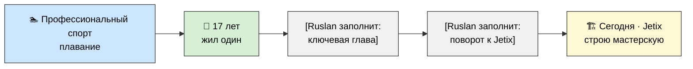

# 👤 Кто я

> **Зачем эта страница.** Чтобы ты понимал, **кто за этим стоит** — не «основатель стартапа» на сайте,
> а живой человек с историей. Это про доверие и контекст, не про достижения. Тон: честный,
> человеческий, без bragging. [src: Ruslan voice 2026-05-29 partner-extend]

> 🚧 **СКЕЛЕТ.** Это каркас, который Руслан заполняет сам — личная история = только его авторство.
> Рой не выдумывает биографию (R6 — no fabrication). Ниже вписаны **только факты, которые Руслан уже
> назвал**; всё остальное — плейсхолдеры `[Ruslan заполнит: ...]`.

---

## Хронология (жизненная линия)

> *Схема — скелет линии жизни. Серые узлы = плейсхолдеры, Руслан заменит на реальные главы.*

---

## Ранние годы

- 🏊 **Профессионально занимался плаванием.** [src: Ruslan voice 2026-05-29]
  > *[Ruslan заполнит: что это дало — дисциплина, отношение к тренировке/мастерству, как связано с
  > идеей «вечной тренировки» в Jetix.]*
- 🧍 **В 17 лет жил один.** [src: Ruslan voice 2026-05-29]
  > *[Ruslan заполнит: контекст, что это сформировало — самостоятельность, ответственность за свою
  > жизнь, ранний опыт «управляющего своей жизнью».]*

> *[Ruslan заполнит: остальные ранние главы — откуда родом, среда и окружение, что было важно в детстве/юности.]*

---

## Ключевые главы

> *[Ruslan заполнит: 2–4 поворотные точки пути — образование, работа, переезды (Берлин?), проекты,
> провалы и уроки. Честно, без приукрашивания.]*

---

## Почему я это строю

> *[Ruslan заполнит: личный «зачем». Что в собственном опыте привело к идее мастерской / сети кланов /
> анти-извлечения (R12). Какую боль или несправедливость хочу исправить. Это сердце страницы.]*

---

## Что из моего пути привело к Jetix

> *[Ruslan заполнит: явная связка биографии с концепцией. Например: спорт → мастерство как вечная
> тренировка; жизнь одному в 17 → «ты управляющий своей жизнью»; опыт X → почему R12 и свободный
> выход для меня не абстракция, а принцип.]*

---

> **SKELETON — R1.** Личная история = полностью authoring Руслана. Рой дал только структуру и вписал
> названные факты verbatim. Ничего не выдумано (R6). После заполнения — лёгкий проход на тон и
> готовность к Notion.
