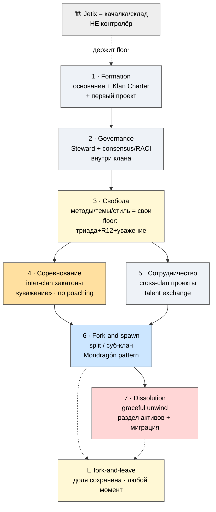

# 🌍 Кланы — как устроена сеть

> **Зачем эта страница.** В P-1 я сказал: Jetix — это **сеть кооперативных кланов**, а не один
> центр-начальник. Здесь объясняю, **что такое клан**, как он живёт (7 фаз), и почему сеть устроена
> как **mesh** (ячейки-равные), а не как **звезда** (центр и подчинённые). Это, по сути, описание
> того, как сотни людей смогут работать вместе, не превращаясь в корпорацию-пирамиду. [src: METAPLAN-V4 §4]

> **Честная рамка.** Кланы сейчас — **концепция и Charter-каркас**, не работающая сеть. Первый клан
> ещё не собран (см. P-7, M1). Это описание того, *как задумано*, чтобы ты мог проверить логику. [src: P-7 T0]

---

## 1. Что такое клан (и чем он НЕ команда)

**Клан = автономная кооперативная ячейка** со своей культурой, методами, экономикой и правом
форкнуться. Это не «отдел» и не «команда под задачу».

| | Команда | Клан (Jetix) |
|---|---|---|
| Структура | группа под общей задачей **внутри иерархии** | **автономная** кооперативная единица |
| Контроль | центр контролирует, может «доить» сверху | mesh — нельзя доить (забирает долю и уходит) |
| Экономика | задаётся сверху | своя, в рамках общего пола (5:1 внутри) |
| Выход | увольнение | **fork-and-leave с долей, без штрафа** |

> Разница принципиальна для R12: команду можно «доить» (центр контролирует); клан — **нельзя**
> (mesh, не star; клан забирает долю и уходит). Кланы дают «множество путей под одним ценностным
> полом», а не один навязанный путь. [src: METAPLAN-V4 §4]

---

## 2. Jetix = «качалка / склад», НЕ контролёр

Ключевая роль платформы: Jetix даёт **инфраструктуру + ценностный пол + события** — и **не диктует**
методы или темы. Как спортзал: даёт станки и правила безопасности, но не указывает, какую программу
тренировать.

- **Что Jetix обязательно держит** (единственное enforced для всех): **ценностный пол** = триада
  (см. P-4) + R12 + уважение к соревнующимся.
- **Что остаётся свободой клана** («внутри клана можно почти всё»): методы · темы · стиль управления ·
  внутренний governance · ритм · внутренний revenue-split (в рамках 5:1).

> Этот единственный «контроль» — он про **защиту участников** (чтобы клан не запер членов и не
> нарушил 5:1), а не про подчинение клана. [src: METAPLAN-V4 §4]

---

## 3. Lifecycle клана — 7 фаз

1. **Formation** — founding members + подписывают **Klan Charter** (пол + внутренние правила) +
   Mondragón-аллокация + первый проект.
2. **Governance** — назначают Steward'а; внутренний consensus / RACI. Как клан решает — дело клана.
3. **Свобода** — методы / темы / стиль / ритм / внутренний split = **inner-clan**; enforced platform-wide
   только пол (триада + R12 + уважение).
4. **Соревнование** — inter-clan хакатоны и турниры (#16); **дух соревнования + уважение между
   соревнующимися**; R12 STRICT — **no poaching / no sabotage / no extraction**. Победа клана поднимает
   планку сети, не «уничтожает» проигравших.
5. **Сотрудничество** — cross-clan проекты, экспедиции, **talent exchange** (мастерство принадлежит
   человеку — уходит вместе с ним, его skill tree + доля).
6. **Fork-and-spawn** — клан делится / порождает суб-клан (Mondragón: кооперативы порождают кооперативы).
   Так сеть растёт органически, а не «франшизой сверху».
7. **Dissolution** — если клан закрывается, то **graceful**: честный раздел активов + миграция членов в
   другие кланы. Закрытие ≠ катастрофа, а часть жизненного цикла.

**+ Inter-clan governance:** Stewards разных кланов peer-check друг друга; спорные ситуации → Foundation
dispute resolution. [src: METAPLAN-V4 §4 «7 фаз»]

---

## 4. Граница «пол vs свобода» — где именно проходит линия

Это самое важное для понимания, как сеть не сползает ни в хаос, ни в диктатуру:

- **Enforced platform-wide (пол, для всех):** триада O-138 + R12 (анти-извлечение + fork-and-leave + 5:1) +
  уважение к соревнующимся.
- **Inner-clan freedom (свобода клана):** методы / темы / стиль управления / внутренний governance / ритм /
  внутренний revenue-split (в рамках 5:1).
- **Если клан нарушает пол** (например, пытается запереть членов или нарушает 5:1) → inter-clan governance
  escalation (Stewards peer-check) → Foundation dispute resolution → в пределе клан теряет доступ к
  платформе. **Но члены всегда сохраняют fork-and-leave.** [src: METAPLAN-V4 §4 §9 Правила]

---

## 5. Как это выглядит в жизни (сценарий)

Клан методологов (5 человек) формируется вокруг темы «AI-консалтинг для малого бизнеса». Подписывает
Klan Charter (пол: триада + R12 + уважение; внутри: свои методы продаж, свой ритм, свой split в рамках
5:1). Через 3 месяца участвует в inter-clan хакатоне против клана «образование» — соревнование поднимает
планку, без переманивания. Один участник переходит в другой клан — его мастерство (skill tree) и доля
**идут с ним**. Через год клан порождает суб-клан «AI для юристов» (fork-and-spawn). Платформа на всём
пути = «качалка/склад» (Notion-шаблоны + AI-инструменты + пространство + события), **не диктовала ни
методы, ни темы** — только держала пол. [src: METAPLAN-V4 §4 worked scenario; IP-1: роли-типы, не люди]

---

## Что это значит для тебя как партнёра

Если ты захочешь делать что-то своё внутри Jetix — ты можешь собрать **свой клан** (это Уровень 4
участия, см. P-5): своя культура, методы, экономика — в рамках одного ценностного пола, который защищает
тебя и твоих людей. И в любой момент можешь форкнуться и уйти со своим. Сеть устроена так, чтобы **тебя
нельзя было запереть.**

---

> **DRAFT — R1.** Структура кланов и формулировка «пола» = ждут prose-pass Руслана. R12-текст и 5:1
> приведены из LOCKED substrate, не модифицированы. Глубже: `JETIX-METAPLAN-V4-FINAL` §4 (Кланы
> lifecycle, full §K). Связанные: **P-4** (R12 / ценностный пол) · **P-5** (Уровень 4 — свой клан) ·
> **P-10** (правила / governance) · **P-3** (#14 на карте).
