# 📦 Партнёрский пакет Jetix

> **Что это.** Восемь коротких документов, чтобы показать честно: вот что я строю, вот как устроено,
> вот что гарантирую, вот твоя роль, чем можешь помочь, куда идём и кто я. Не презентация продукта, не
> продажа, не «вступай к нам» — описание + просьба об обратной связи.
>
> **Для кого.** Для людей, которым я доверяю и чьё мнение ценю: партнёры, помощники, советчики.
>
> **Как читать.** По порядку, ~15 минут на всё. Каждый документ отвечает на один вопрос человека,
> который видит Jetix впервые.

---

## Путь чтения (~27 минут)

**Ядро (5 документов, ~19 мин)** — отвечают на главные вопросы человека, видящего Jetix впервые:

| Шаг | Документ | Отвечает на вопрос | ~Время |
|---|---|---|---|
| 1 | **[P-1 · Overview](P-1-jetix-overview.md)** | «Что это вообще такое?» | 4 мин |
| 2 | **[P-2 · Метод](P-2-metod.md)** | «Как вы работаете?» | 5 мин |
| 3 | **[P-3 · Карта (16 направлений)](P-3-16-directions.md)** | «Сколько всего и как устроено?» | 3 мин |
| 4 | **[P-4 · Ценности и R12](P-4-cennosti-r12.md)** | «Что ты мне гарантируешь?» | 4 мин |
| 5 | **[P-5 · Как участвовать](P-5-kak-uchastvovat.md)** | «Какая моя роль и как войти/выйти?» | 3 мин |

**Дополнительно (3 документа, ~12 мин)** — для тех, кто захотел глубже:

| Шаг | Документ | Отвечает на вопрос | ~Время |
|---|---|---|---|
| 6 | **[P-6 · Чем помочь](P-6-chem-pomoch-resursy.md)** | «Чем именно я могу помочь?» | 4 мин |
| 7 | **[P-7 · Таймлайн / роадмап](P-7-timeline-roadmap.md)** | «Где вы сейчас и куда идёте?» | 5 мин |
| 8 | **[P-8 · Кто я](P-8-kto-ya-ruslan.md)** | «Кто за этим стоит?» (можно читать первым — для доверия) | 3 мин |

```mermaid
%%{init: {'theme':'base','themeVariables':{'background':'#ffffff','mainBkg':'#eef2f7','primaryColor':'#eef2f7','primaryTextColor':'#000','primaryBorderColor':'#555','secondaryColor':'#f5f5f5','tertiaryColor':'#ffffff','textColor':'#000','lineColor':'#333','edgeLabelBackground':'#ffffff','noteBkgColor':'#fff8d5','noteTextColor':'#000','clusterBkg':'#f5f5f5','clusterBorder':'#999','titleColor':'#000'}}}%%
graph LR
    classDef default fill:#eef2f7,stroke:#555,stroke-width:1px,color:#000;
    P8[P-8 кто я<br/>опц. в начале] -.доверие.-> P1
    P1[P-1 что это] --> P2[P-2 как работаем] --> P3[P-3 масштаб] --> P4[P-4 что гарантирую] --> P5[P-5 твоя роль]
    P5 --> P6[P-6 чем помочь]
    P6 --> P7[P-7 куда идём]
    P7 --> CALL[💬 созвон / углубиться]
    P5 --> BYE[🚪 спасибо, не моё<br/>тоже ок]
    style P8 fill:#fafafa,color:#000
    style P1 fill:#d6f0d6,color:#000
    style P4 fill:#ffd6d6,color:#000
    style P5 fill:#cce6ff,color:#000
    style P6 fill:#ffe0a0,color:#000
    style BYE fill:#fff8d5,color:#000
```

**После прочтения — два равноправных пути:** созвониться и пройтись по тому, что зацепило или вызвало
вопросы — **или** сказать «спасибо, посмотрел, не моё». Второе так же уважаемо, как первое.

---

## Несущая логика всего пакета (слоями)

1. **База** — всё есть информация и методы её обработки; интеллект развивается через лучшие методы.
2. **Наложение 3P** — продукты / процессы / проекты = база в применении (жизнь = главный продукт).
3. **Суть Jetix** — мега-мастерская + сеть кооперативных кланов + возможности.
4. **Что нужно сейчас** — фундамент (tech / fin / legal) + помощь + партнёры.

> 3P не сам по себе — он **накладывается** на базовую методологию. Сначала база, потом её применение.

---

## Честная рамка (одна на весь пакет)

- Это **середина стройки**, не готовая компания. Substrate — год+ работы одного автора, усиленного AI,
  не прошедший peer-review.
- **Никаких обещаний дохода** или «успеха». Обещаю среду, честные правила и свободный выход (P-4).
- Зову **проверить**, а не «купить». Лучший исход — ты скажешь, где я не прав.

---

## Статус документов (для Руслана)

| Документ | Статус | Нужен prose-pass? |
|---|---|---|
| P-1 Overview | DRAFT | ✅ да (strategic prose — R1) |
| P-2 Метод | DRAFT | ✅ да (R1) |
| P-3 Карта | ready | — (структурная карта) |
| P-4 Ценности + R12 | DRAFT | ✅ да (ценности = подпись Руслана — R1) |
| P-5 Как участвовать | draft | лёгкий проход желателен |
| P-6 Чем помочь | DRAFT | ✅ да (рамка asks = R1) |
| P-7 Таймлайн / роадмап | DRAFT | ✅ да (роадмап + milestones = R1) |
| P-8 Кто я | **СКЕЛЕТ** | ✍️ **Ruslan заполняет** (личная история = только его авторство) |

> **DRAFT-only.** P-1 / P-2 / P-4 / P-6 / P-7 — не финал, ждут prose-pass Руслана перед любой
> отправкой партнёру. **P-8 — скелет**: каркас + плейсхолдеры, личную историю пишет Руслан сам.
> Формат всех документов — чистый markdown, готов к заливке в Notion-подстраницу «Сбор партнёрских
> документов».
