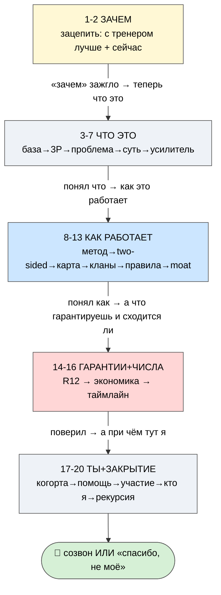
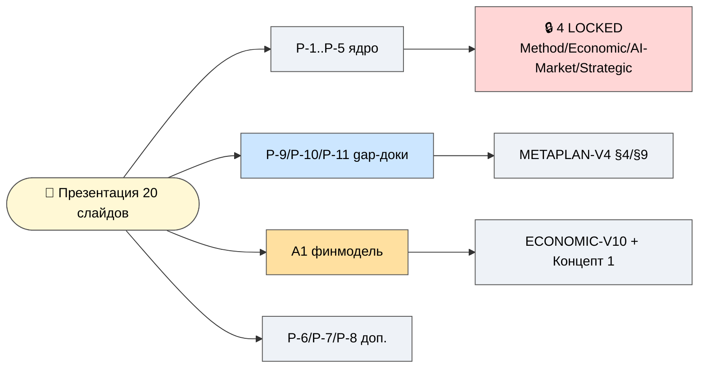

# 🧭 Индекс и порядок рассказа

> **Зачем этот документ.** Ruslan просил «посмотреть порядок и углубиться по вариантам». Здесь — (1)
> что в презентации одной строкой на слайд, (2) **порядок рассказа** (нарратив-флоу с логикой
> переходов), (3) тайминг по блокам, (4) связь «слайд ↔ глубинный P-doc» (что открыть, если партнёр
> хочет глубже). **Главное для тебя — посмотреть порядок** (АКТ 1-5) и решить, что переставить.

---

## §1 Что в презентации (20 слайдов, по строке)

| # | Слайд | Одна строка | Глубже (P-doc) |
|---|---|---|---|
| **АКТ 1 — ЗАЧЕМ** | | | |
| 1 | С тренером лучше | WHY: benefit-stack ×7 «лучше иметь, чем не иметь» | P-1 opener · coach-thesis wiki |
| 2 | Почему сейчас | AI = новое электричество; Jetix = слой над compute | AI-MARKET LOCKED |
| **АКТ 2 — ЧТО ЭТО** | | | |
| 3 | База | всё = информация + методы; интеллект через лучшие методы | P-1 Слой 1 · METHOD-V2 |
| 4 | 3P | продукты/процессы/проекты; жизнь = главный продукт | P-1 Слой 2 |
| 5 | Проблема | обесценивание мастеров (reverse-eng + compute); Jetix защищает | P-1 Проблема |
| 6 | Суть Jetix | мастерская + сеть кланов + возможности (3 грани) | P-1 Слой 3 · P-11 |
| 7 | Усилитель мастера | система управления жизнью (3 слоя + 8 практик) | P-1 |
| **АКТ 3 — КАК РАБОТАЕТ** | | | |
| 8 | Метод + интеллект | выбор/создание метода; интеллект = горизонт × ответственность | P-2 · Концепт 4 |
| 9 | Two-sided | профи ↔ заряженные ученики (love-economy) | P-2 · two-sided wiki |
| 10 | Карта 16 | одна метафора → 16 граней; 3 хаба + 2 движка | P-3 |
| 11 | Кланы | 7 фаз, mesh не звезда, Jetix = качалка/склад | **P-9** |
| 12 | Правила | пол (3) vs свобода клана; #15 anti-dark-patterns | **P-10** |
| 13 | Кооперация-moat | 4 концепта = один R12-контур; почему не скопировать | Концепты 1-4 · P-4 |
| **АКТ 4 — ГАРАНТИИ + ЭКОНОМИКА** | | | |
| 14 | Ценности R12 | 4 гарантии (fork-and-leave / 5:1 / 75-25 / качалка) | P-4 |
| 15 | Числа / бизнес-модель | unit-econ + 3 монетизации + фонд + pooling (иллюстрация!) | **A1 финмодель** · P-6/7 |
| 16 | Таймлайн | T0→M1→M2→M3→M4→EOY (план/амбиция, не обещание) | P-7 |
| **АКТ 5 — ТЫ + ЗАКРЫТИЕ** | | | |
| 17 | Когорта | full-stack ~20 по ролям + resource-pooling | P-5/6 · A5 |
| 18 | Чем помочь | 10 способов, value-first, без давления | P-6 |
| 19 | Участие + кто я | 4 уровня + founder-story (🚧 Ruslan) | P-5 · **P-8** |
| 20 | Recursive close | я→система→люди→мир→компания→жизнь + что прошу | P-1 close · O-281 |

---

## §2 Порядок рассказа (нарратив-флоу + логика переходов)

> **Главный сдвиг vs пакет P-1..P-8:** раньше вели «**что это**» (layering — база→3P→суть). Теперь
> ведём «**зачем**» (WHY-first) — сначала эмоционально-утилитарный вход (S1-2), потом структура. Это
> ключевой вывод аудита (системный пробел #1).

**Логика переходов (почему именно такой порядок):**
1. **S1-2 (ЗАЧЕМ):** сначала зацепить «зачем это вообще нужно» (с тренером лучше) + «почему сейчас»
   (волна AI). Эмоционально-утилитарный вход **до** структуры.
2. **S3-7 (ЧТО ЭТО):** только зажёгши «зачем», объясняем «что это» слоями — база → 3P → проблема
   (обесценивание мастеров — обостряет ставки) → суть → усилитель (на чём стоит).
3. **S8-13 (КАК РАБОТАЕТ):** «как именно» — метод, two-sided механика, карта 16, кланы, правила, и
   кульминация акта — **почему не скопировать** (кооперация-moat, 4 концепта).
4. **S14-16 (ГАРАНТИИ + ЧИСЛА):** теперь, когда партнёр «верит в идею», даём (а) что гарантирую (R12),
   (б) сходится ли экономика (числа-иллюстрация), (в) куда и когда идём (таймлайн).
5. **S17-20 (ТЫ + ЗАКРЫТИЕ):** «а при чём тут я» — когорта, чем помочь, как войти/выйти, кто я, и
   **recursive close** (петля я→...→жизнь) + просьба об обратной связи.

> **Альтернативные порядки (на твой выбор, Ruslan):**
> - **Founder-first:** S19 (кто я) → S1 — если партнёр сначала хочет понять, кто за этим стоит (доверие).
> - **Investor-first:** после S1-2 сразу S13 (moat) + S15 (числа) — если партнёр с инвест-фокусом.
> - **Short (10 слайдов):** S1·S2·S6·S10·S11·S13·S14·S15·S19·S20 — если время ограничено.

---

## §3 Тайминг по блокам

| Акт | Слайды | Полный (~30 мин) | Короткий (~12 мин) |
|---|---|---|---|
| 1 ЗАЧЕМ | 1-2 | 4 мин | 2 мин |
| 2 ЧТО ЭТО | 3-7 | 7 мин | 3 мин (S6 only) |
| 3 КАК РАБОТАЕТ | 8-13 | 9 мин | 3 мин (S11+S13) |
| 4 ГАРАНТИИ+ЧИСЛА | 14-16 | 6 мин | 2 мин (S14+S15) |
| 5 ТЫ+ЗАКРЫТИЕ | 17-20 | 5 мин | 2 мин (S19+S20) |
| **Итого** | 20 | **~31 мин** | **~12 мин** |

> Диалог/вопросы — сверх тайминга. Презентация = повод к разговору, не монолог.

---

## §4 Связь «слайд ↔ глубинный документ» (если партнёр хочет глубже)

- **Хочет про кланы/правила** → P-9 / P-10 → (глубже) METAPLAN-V4 §4/§9.
- **Хочет про числа/экономику** → A1 финмодель → (глубже) ECONOMIC-V10 LOCKED.
- **Хочет про метод** → P-2 → METHOD-V2 LOCKED.
- **Хочет про мастерскую** → P-11 → WORKSHOP-CONCEPT.
- **Хочет про timing/рынок** → AI-MARKET LOCKED.
- **Хочет про гарантии** → P-4 → ECONOMIC-V10 §10 (R12 verbatim).

---

## §5 Что от тебя нужно (Ruslan, R1)

- [ ] **Порядок** — посмотреть АКТ 1-5; что переставить? (альтернативы §2: founder-first / investor-first / short).
- [ ] **Prose-pass** — strategic-формулировки (S1 WHY, S6 суть, S13 moat, S14 ценности, S20 close).
- [ ] **Слайд 19 (founder-story)** — заполнить P-8 (личная история = только твоё авторство, IP-1).
- [ ] **Числа (S15)** — посмотреть допущения финмодели (A1 §6); что подтвердить/поправить?
- [ ] **Глубина по вариантам** — углубиться по слайдам, где хочешь больше (отдельные prompt'ы).

---

> **DRAFT — R1.** Порядок и тайминг — предложение роя; финальный флоу = за Русланом. Связанные:
> `PRESENTATION-MASTER-2026-05-30.md` (контент 20 слайдов) · `README.md` (пакет) · P-1..P-11 · A1 финмодель.
