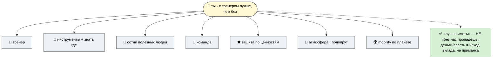
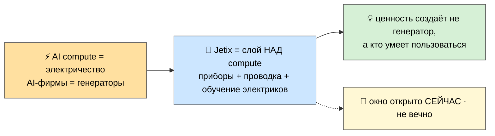
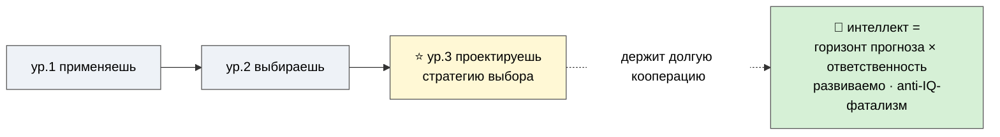
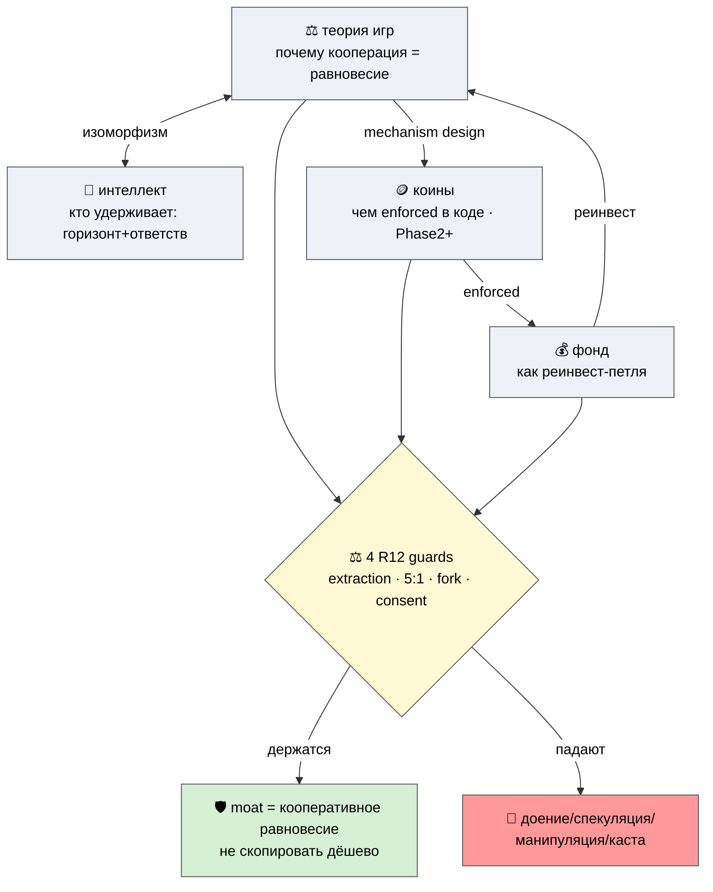
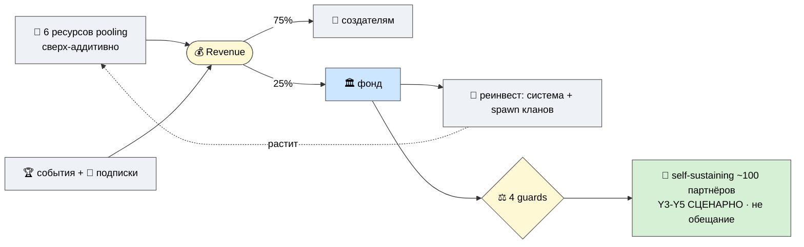

# 🎤 Jetix — партнёрская презентация (MASTER, контент-уровень)

> **Что это.** Полный слайд-нарратив (20 слайдов) для показа партнёрам/помощникам. **Контент-уровень**
> (что на каждом слайде, какое сообщение, какой визуал) — не визуальный дизайн. **WHY-first**: ведём
> «зачем», а не «что это» (главный вывод аудита). Каждый слайд → mapping на P-doc + audit-pick.
>
> **Формат слайда:** № · 🏷️ Заголовок · 🎯 Ключевое сообщение (одна фраза) · контент/буллеты · 🖼️
> Визуал/mermaid · 📎 Источник (P-doc / LOCKED) · 🔖 audit-pick.
>
> **R12 STRICT (сквозное).** Числа = иллюстрация с допущениями, НЕ обещание. Никакого «станешь богатым».
> Фонд = реинвест-петля (4 guards), не доходность. Коины = Phase 2+ opt-in, не «токен вырастет». #15
> геймификация = gated (механики НЕ строим). Benefit-stack = «лучше иметь, чем не иметь» (НЕ FOMO).

> **🚧 Что за Русланом (R1):** (1) **порядок рассказа** — посмотреть/переставить (см. 00-INDEX-AND-ORDER);
> (2) **prose-pass** на strategic-формулировки; (3) **Слайд 19 (founder-story)** — заполняет сам (IP-1).

---

## Карта нарратива (5 актов)

```mermaid
%%{init: {'theme':'base','themeVariables':{'background':'#ffffff','mainBkg':'#eef2f7','primaryColor':'#eef2f7','primaryTextColor':'#000','primaryBorderColor':'#555','secondaryColor':'#f5f5f5','tertiaryColor':'#ffffff','textColor':'#000','lineColor':'#333','edgeLabelBackground':'#ffffff','noteBkgColor':'#fff8d5','noteTextColor':'#000','clusterBkg':'#f5f5f5','clusterBorder':'#999','titleColor':'#000'}}}%%
graph LR
    classDef default fill:#eef2f7,stroke:#555,stroke-width:1px,color:#000;
    A1[🎯 АКТ 1 · ЗАЧЕМ<br/>S1-2 · WHY + почему сейчас]
    A2[🧱 АКТ 2 · ЧТО ЭТО<br/>S3-7 · база→3P→проблема→суть→усилитель]
    A3[⚙️ АКТ 3 · КАК РАБОТАЕТ<br/>S8-13 · метод→платформа→карта→кланы→правила]
    A4[💎 АКТ 4 · ЧТО ГАРАНТИРУЮ + ЭКОНОМИКА<br/>S14-16 · R12+moat→числа→таймлайн]
    A5[🤝 АКТ 5 · ТЫ + ЗАКРЫТИЕ<br/>S17-20 · когорта→помощь→участие→кто я→recursive]
    A1 --> A2 --> A3 --> A4 --> A5
    style A1 fill:#fff8d5,color:#000
    style A2 fill:#d6f0d6,color:#000
    style A3 fill:#cce6ff,color:#000
    style A4 fill:#ffd6d6,color:#000
    style A5 fill:#ffe0a0,color:#000
```

---

# АКТ 1 — ЗАЧЕМ (WHY-first)

## Слайд 1 — С тренером лучше, чем без

- 🎯 **Ключевое сообщение:** Jetix существует, потому что **с тренером лучше, чем без** — лучше *иметь*,
  чем не иметь, поддержку, инструменты и людей рядом.
- **Контент (benefit-stack ×7 — «лучше иметь, чем не иметь»):**
  1. 🏅 **Тренер** — кто-то/что-то, помогающее расти быстрее (наставник / метод / система).
  2. 🧰 **Готовые инструменты** — и знание, *где они лежат* (не изобретать заново).
  3. 🤝 **Знать о сотнях полезных людей** — сеть как актив.
  4. 👥 **Быть в команде** — не в одиночку.
  5. 🛡️ **Защита среди своих по ценностям** — ценностный пол как щит.
  6. 💪 **Рабочая атмосфера** — «жопу подопрут, не последними деньгами рискуешь».
  7. 🌍 **Mobility по планете** — возможность двигаться, не быть привязанным к месту.
- **Рамка (R12 REFRAME — критично):** это **«лучше иметь, чем не иметь»** (additive value), а **не**
  «без нас пропадёшь» (FOMO). Power/деньги в стеке **отсутствуют как обещание** — только как исход вклада.
- 🖼️ **Визуал:** центр «👤 ты» → 7 лучей benefit-stack (иконки). Тёплый, человеческий, не корпоративный.
- 📎 **Источник:** coach-thesis-why-jetix (Tier A, O-275) · P-1.
- 🔖 **Pick:** Таблица 2 «WHY-opener» **P0** · системный пробел #1 (WHY-вход).

---

## Слайд 2 — Почему именно сейчас (AI как электричество)

- 🎯 **Ключевое сообщение:** мы на старте новой волны — **AI = новое электричество**, и сейчас момент,
  когда выстраивается слой «приборов и проводки» поверх него.
- **Контент:**
  - AI compute = сырьё-утилита (как электричество в 1880-х). AI-фирмы = «генераторы».
  - **Jetix не конкурирует с compute** — строит слой *над* ним: методы + инфраструктуру + «обучение
    электриков» (профессионалов, умеющих пользоваться AI).
  - Аналогия с электрификацией: ценность создали не генераторы, а **приборы, проводка и люди, умеющие
    с этим работать**. Окно открыто сейчас и не вечно.
- 🖼️ **Визуал:** таймлайн-аналогия (1880-е электрификация ↔ 2020-е AI); слой Jetix = «приборы + провода
  + электрики» над «генераторами».
- 📎 **Источник:** AI-MARKET-ELECTRICITY-ANALOGY LOCKED · P-1 (контекст).
- 🔖 **Pick:** Таблица 2 «Почему сейчас (timing)» P1 · Таблица 3 п.5 (AI-Market абзац) · системный пробел #3 (timing).

---

# АКТ 2 — ЧТО ЭТО (база → суть)

## Слайд 3 — База: всё есть информация и методы

- 🎯 **Ключевое сообщение:** всё, чем мы оперируем — это **информация и методы её обработки**; интеллект
  развивается тем быстрее, чем лучше методы.
- **Контент:**
  - Звук, образ, разговор, навык, привычка — либо информация, либо способ что-то с ней сделать.
  - Интеллект (человек или система) развивается не от «больше знаю», а от **«лучше умею выбрать и
    применить нужный метод в нужный момент»**.
  - Это фундамент — всё остальное в Jetix вырастает отсюда.
- 🖼️ **Визуал:** информация ⇄ методы → развитие (простая базовая схема).
- 📎 **Источник:** METHOD-V2 §1/§5 LOCKED · P-1 (Слой 1).
- 🔖 **Pick:** несущая база (existing P-1); усилена intelligence-frame (S8).

---

## Слайд 4 — 3P: продукты, процессы, проекты (жизнь = главный продукт)

- 🎯 **Ключевое сообщение:** база проявляется через **три формы — 3P**, и главный твой продукт — **твоя
  собственная жизнь**.
- **Контент:**
  - **Продукты** — то, что создаётся (главный = твоя жизнь). **Процессы** — как делается раз за разом.
    **Проекты** — собирается ради цели и завершается.
  - **Ты — управляющий своей жизнью. Но и другие хотят ею управлять** (работодатели, платформы, рынки,
    привычки). Вопрос не «управляют ли тобой», а «насколько ты сам в этом участвуешь».
- 🖼️ **Визуал:** база → 3P (3 ветки) → «ты управляющий ↔ другие тоже хотят».
- 📎 **Источник:** P-1 (Слой 2), O-237..241.
- 🔖 **Pick:** existing P-1; вход к «Усилителю мастера» (S7).

---

## Слайд 5 — Проблема: обесценивание мастеров

- 🎯 **Ключевое сообщение:** AI + дешёвый compute обесценивают мастерство — вытесняют не лучших, а тех,
  у кого больше вычислительных ресурсов. **Против этого и работает Jetix.**
- **Контент:**
  - Reverse engineering нового уровня: AI «посмотрел» видео/книги мастера → повторил → любой с бо́льшим
    compute обходит оригинал.
  - Доминируют **не лучшие в деле, а купившие больше мощности** — тупиковый путь, обесценивает мастерство.
  - **Jetix защищает** интеллектуальный капитал мастеров от копирования. **Защита через сложность** —
    щит, а не таран.
- 🖼️ **Визуал:** проблема (reverse-eng + compute → вытеснение) ⇒ решение (объединение + защита + сложность).
  *(полный mermaid — P-1, блок «Проблема»; reuse.)*
- 📎 **Источник:** P-1 (Проблема) · ECONOMIC-V10 §10 anti-extraction.
- 🔖 **Pick:** existing P-1; усилен moat-аргументом (S13).

---

## Слайд 6 — Суть Jetix: мастерская + сеть кланов + возможности

- 🎯 **Ключевое сообщение:** Jetix = **место и среда, где развиваются вместе** — три грани одного.
- **Контент:**
  - **🏛️ Мастерская** — пространство со «станками» (online сейчас → сеть физических потом). Не курс — среда.
  - **🌍 Сеть кооперативных кланов** — равноправные ячейки (mesh, не звезда); внутри свобода, общий —
    ценностный пол; можно форкнуться и уйти со своим.
  - **✨ Возможности** — потенциал колоссальный. **Без обещаний «разбогатеешь»** — обещаю среду и честные
    правила (см. S14).
- 🖼️ **Визуал:** Foundation (3 грани) → мастерская/сеть/возможности.
- 📎 **Источник:** P-1 (Слой 3) · P-11 (мастерская) · P-9 (кланы) · WORKSHOP-CONCEPT.
- 🔖 **Pick:** existing P-1; раскрытие — S11 (кланы) + S6→P-11.

---

## Слайд 7 — Усилитель мастера (система управления жизнью)

- 🎯 **Ключевое сообщение:** вся мастерская стоит на **системе управления собственной жизнью** —
  «Усилителе мастера»; это основание, а не дополнение.
- **Контент (3 слоя + практики):**
  - 🧠 **Усиление памяти** · 📊 **Управление проектами** · 🛠️ **Навыки + делегирование рутины**.
  - Повседневные практики (видимость своей жизни): ⏱️ время · 🎯 внимание · 📥 инфо-диета · 🔁 привычки ·
    🪞 рефлексия · 🧩 ключевые решения · 🧭 стратегическое направление · 🔥 настрой.
  - **Уже работает:** ~90% техник в Notion; голосом «работал 9–12 над X» → Toggl + Daily Log.
- 🖼️ **Визуал:** 3 слоя → освобождённое время → мастерство (полный mermaid — P-1, reuse).
- 📎 **Источник:** P-1 (Усилитель мастера + практики самоуправления).
- 🔖 **Pick:** existing P-1 extend.

---

# АКТ 3 — КАК РАБОТАЕТ

## Слайд 8 — Метод + интеллект (что именно развиваем)

- 🎯 **Ключевое сообщение:** мастерство = не «знать много», а **выбирать и создавать метод под ситуацию**;
  а интеллект = **(горизонт прогноза) × (ответственность)** — то, что держит долгую кооперацию.
- **Контент:**
  - Лестница: применяешь метод → выбираешь между методами → **проектируешь свою стратегию выбора** (ур.3,
    сюда метит Jetix). AI — на подготовке, человек — на сути.
  - **Интеллект-frame (Концепт 4):** «дальше просчитать» = долгий горизонт; «ответственнее» = надёжность/
    репутация. Это две человеческие переменные, которые удерживают кооперацию (мост к S13). Развиваемо —
    не врождённый IQ (anti-фатализм).
- 🖼️ **Визуал:** лестница уровней (mermaid — P-2, reuse) + врезка «интеллект = горизонт × ответственность».
- 📎 **Источник:** P-2 · METHOD-V2 §5 · Концепт 4.
- 🔖 **Pick:** Таблица 2 «intelligence-frame» P1 · Таблица 1 #1/#13 · Концепт 4.

---

## Слайд 9 — Two-sided платформа (профи ↔ заряженные ученики)

- 🎯 **Ключевое сообщение:** Jetix — **двусторонняя платформа**: мастера-профи с одной стороны,
  заряженные ученики с другой; «тренер заряжен учениками, ученик заряжен тренером».
- **Контент:**
  - Профи получают усиление, защиту IP и заряженных людей рядом; ученики — тренера, среду и команду.
  - Это **love-economy / mutual-belief**: обе стороны выигрывают от наличия друг друга (не extraction).
  - Механика «тренер ↔ ученик» масштабируется через кланы (S11) и события (S15).
- 🖼️ **Визуал:** двусторонний рынок — профи ⇄ ученики, общая среда между ними.
- 📎 **Источник:** two-sided-talent-platform (Tier B, O-264) · P-2.
- 🔖 **Pick:** Таблица 2 «two-sided платформа» P1 · Таблица 1 #2.

---

## Слайд 10 — Карта: 16 направлений вокруг одной мастерской

- 🎯 **Ключевое сообщение:** всё держится на **одной метафоре** (мастерская); 16 направлений — её грани,
  не 16 отдельных продуктов.
- **Контент:**
  - 3 грани Foundation: 🏛️ Мастерская (ГДЕ) · 🎯 Мастерство (ЧТО) · 🌍 Сеть (КАК).
  - 3 хаба навигации: #1 Метод · #8 R12 · #12 Мастерская. 2 движка: #16 Хакатоны (доход) · #15
    Геймификация (вовлечение, **R12 STRICT — gated**).
  - **Не нужно** разбираться во всех 16 сразу — достаточно понять Foundation.
- 🖼️ **Визуал:** Foundation → 3 грани → 16 направлений (полный mermaid — P-3, reuse).
- 📎 **Источник:** P-3 · METAPLAN-V4 §1-2.
- 🔖 **Pick:** existing P-3; системный пробел #3 (6 направлений видимы — раскрыты на S11-S13 + P-9/P-10/P-11).

---

## Слайд 11 — Кланы: как устроена сеть (7 фаз, mesh не звезда)

- 🎯 **Ключевое сообщение:** сеть = **кооперативные кланы** (mesh, не звезда); Jetix = «качалка/склад», не
  контролёр; клан можно собрать, форкнуть и покинуть со своим.
- **Контент:**
  - Клан ≠ команда: автономная кооперативная ячейка со своей культурой/методами/экономикой и правом
    форкнуться. Команду можно «доить» сверху; клан — нельзя.
  - **7 фаз:** Formation → Governance → Свобода → Соревнование → Сотрудничество → Fork-and-spawn →
    Dissolution. Inter-clan governance: Stewards peer-check → Foundation dispute.
  - Jetix держит только **пол** (триада + R12 + уважение); всё остальное — свобода клана.
- 🖼️ **Визуал:** lifecycle 7 фаз (полный mermaid — P-9, reuse).
- 📎 **Источник:** **P-9** (gap-doc) · METAPLAN-V4 §4.
- 🔖 **Pick:** Таблица 1 #14 P2 PRIMARY · системный пробел #3 (#14 был невидим) · gap-doc P-9.

---

## Слайд 12 — Правила и самоуправление (пол vs свобода)

- 🎯 **Ключевое сообщение:** **минимум обязательного для всех (пол) + максимум свободы внутри клана**;
  правил, которым ты обязан, — три, и все три в твою защиту.
- **Контент:**
  - **Floor (для всех):** триада + R12 + уважение к соревнующимся.
  - **Inner-clan (свобода):** методы · темы · стиль · внутренний governance · ритм · split в рамках 5:1.
  - **Анти-dark-patterns правило** (#15 gate): метрика = «насколько вырос», НЕ «время в приложении».
  - **Конфликты:** Steward → inter-clan peer-check → Foundation dispute; крайняя мера — потеря доступа,
    но **fork-and-leave всегда сохранён**.
- 🖼️ **Визуал:** 2-уровневый Charter — floor ⊃ freedom (полный mermaid — P-10, reuse).
- 📎 **Источник:** **P-10** (gap-doc) · METAPLAN-V4 §9.
- 🔖 **Pick:** Таблица 1 #9/#3 (Бизнес-governance) · системный пробел #3 (#9 был невидим) · gap-doc P-10.

---

## Слайд 13 — Почему это не скопировать: кооперация как преимущество

- 🎯 **Ключевое сообщение:** защита Jetix — не «секрет», а **кооперативное равновесие**, удерживаемое
  R12-конституцией. Это и есть **moat** (и сильнейший аргумент устойчивости).
- **Контент (4 концепта как ОДИН R12-контур):**
  - **Теория игр (Концепт 3):** «нагнуть» = структурно инвертировать условия предательства (repeated +
    reputation-visible + punishment + communication) → кооперация = best-response. Не уговорить — изменить
    payoff. *Честно: легитимно, пока кооперация выгодна каждому (не скрытая манипуляция).*
  - **Интеллект (Концепт 4):** люди с длинным горизонтом + ответственностью **удерживают** это равновесие
    (изоморф folk-theorem). Jetix отбирает/развивает обе оси (без касты «умных»).
  - **Крипта/коины (Концепт 2):** R12 enforced **в коде** — смарт-контракты против доения и lock-in
    (5:1 cap + RageQuit-выход + QF + SBT-репутация). *Phase 2+ opt-in; коин = utility/governance, НЕ
    «токен вырастет».*
  - **Инвест-фонд (Концепт 1):** treasury реинвестируется по петле (см. S14).
  - **R12 = то, что держит весь контур здоровым** (4 guards). Без них: фонд=доение, коин=спекуляция,
    mechanism=манипуляция, отбор=каста.
- 🖼️ **Визуал:** 4 концепта = один контур + 4 guards (полный mermaid — D2, reuse).
- 📎 **Источник:** Концепты 1-4 (four-concepts report) · P-4 · R12-Ethereum.
- 🔖 **Pick:** Таблица 2 «Cooperation-moat» + «коины» P1/P2 · Таблица 3 п.4 (Cooperation-as-Moat 8-я Insight) ·
  Таблица 1 #8 · все 4 концепта (один контур).

---

# АКТ 4 — ЧТО ГАРАНТИРУЮ + ЭКОНОМИКА

## Слайд 14 — Ценности и обещание (R12 — 4 гарантии)

- 🎯 **Ключевое сообщение:** я обещаю **не результат («разбогатеешь»), а среду и честные правила.** Вот
  четыре конкретные гарантии (R12).
- **Контент:**
  - **Триада** (чему служит среда): не умереть / жить чтобы жить / развиваться.
  - **R12 — 4 гарантии:** 🚪 можно уйти, забрав своё (fork-and-leave, без штрафа) · 💰 потолок разрыва
    **5:1** (Mondragón) · 📊 прозрачность + доля **75/25** · 🏗️ платформа = «качалка/склад», не контролёр.
  - **Анти-обещания:** никакого «станешь миллионером»; никакого центра-диктатора; никаких ловушек
    удержания; никаких закрытых ворот; никакого извлечения сверх доли.
- 🖼️ **Визуал:** R12 → 4 гарантии (полный mermaid — P-4, reuse).
- 📎 **Источник:** P-4 · ECONOMIC-V10 §10 (R12 verbatim).
- 🔖 **Pick:** existing P-4; benefit-stack REFRAME подтверждён (S1).

---

## Слайд 15 — Бизнес-модель и числа (иллюстрация, не обещание)

- 🎯 **Ключевое сообщение:** экономика **сходится арифметически** — вот структура (с честными
  допущениями). **Это иллюстрация, не прогноз и не обещание дохода.**
- **Контент (из финмодели A1):**
  - **Unit-econ:** на пользователя (free → utility ~€10-30/мес → создатель 75%) · на клан (5:1 внутри) ·
    на событие (≥$30K target первых 3 — *target, не median*).
  - **3 монетизации:** 🏆 события/хакатоны (основной движок) · 🧰 подписка/инструменты · 💰 фонд-возврат.
  - **Treasury/фонд:** 75% создателям / **25% в институциональный фонд** → реинвест (в систему + spawn
    кланов, Caja-Laboral) — **петля, НЕ доходность инвестору** (4 guards).
  - **Resource-pooling:** соединение 6 ресурсов когорты = **сверх-аддитивно и считаемо** (связи ~N²,
    non-rival ×N).
  - **Самоокупаемость:** ~100 платящих партнёров, Y3-Y5 сценарно; bridge ~€245K Y1-4 (честно: деньги нужны).
- 🖼️ **Визуал:** экономическая петля + 4 guards (полный mermaid — финмодель §5, reuse).
- 📎 **Источник:** **JETIX-FINANCIAL-MODEL-DRAFT (A1)** · ECONOMIC-V10 LOCKED · Концепт 1 · P-6/P-7.
- 🔖 **Pick:** Таблица 2 «Числовая модель» ⭐ **P0** · Таблица 3 п.1 (A1 финмодель) · «фонд» CRITICAL · системный пробел #2 (числа).

---

## Слайд 16 — Таймлайн и роадмап (план/амбиция, не обещание)

- 🎯 **Ключевое сообщение:** где мы сейчас и куда идём — честно: **середина стройки**, дальше план.
- **Контент:**
  - **T0 (сейчас):** один человек + AI, документы и наработки.
  - **M1 партнёры (~1 мес)** → **M2 фундамент (legal+fin+tech)** → **M3 план продвижения (R12-screened)**
    → **M4 продвижение запущено** → **EOY ~100k пользователей** (*план/амбиция, НЕ обещание роста*).
  - Каждая точка разблокирует следующую: нельзя звать толпу в недостроенный дом.
  - Продвижение будет **сильным, но не грязным** (earned virality + демонстрация результатов, не манипуляция).
- 🖼️ **Визуал:** T0→M1→M2→M3→M4→EOY + Gantt (полный mermaid — P-7, reuse).
- 📎 **Источник:** P-7 · Strategic Plan LOCKED.
- 🔖 **Pick:** existing P-7; timing-вход усилен (S2).

---

# АКТ 5 — ТЫ + ЗАКРЫТИЕ

## Слайд 17 — Партнёрская когорта (full-stack, resource-pooling)

- 🎯 **Ключевое сообщение:** я собираю **сбалансированную когорту** партнёров — full-stack по ролям, чтобы
  6 ресурсов сложились сверх-аддитивно (а не «набрать побольше»).
- **Контент:**
  - Состав по ролям (named-roster ~20, A5 — структура): tech · legal · finance · контент · аудитория ·
    идеи/стратегия · знакомства · ресурсы. Каждый закрывает грань.
  - **Resource-pooling:** соединение знакомств/помещений/идей/денег/информации/мастерства когорты = больше
    суммы (связи ~N²; non-rival ресурсы копируются ×N) — **считаемо** (см. S15).
  - **No false-scarcity:** это не «успей в закрытый клуб» — открытое приглашение к вкладу.
- 🖼️ **Визуал:** 6 ресурсов → pooling → сверх-аддитивно (полный mermaid — финмодель §4, reuse).
- 📎 **Источник:** P-5/P-6 · A5 список-20 (структура) · O-272 · Концепт 1.
- 🔖 **Pick:** Таблица 2 «full-stack когорта 20» P1 · Таблица 3 п.2 (A5 список-20 — связать с PARTNER-SELECTION) · resource-pooling.

> 📋 **A5 — список-20 (заглушка-структура):** named-roster по ролям ведётся отдельно в
> `PARTNER-SELECTION-FRAMEWORK` (CRM-связка); здесь — только структура когорты, не имена. [src: Таблица 3 п.2]

---

## Слайд 18 — Чем можно помочь (value-first, без давления)

- 🎯 **Ключевое сообщение:** вот **чем именно** можешь помочь — смотри на то, что тебе **несложно**;
  один точечный вклад уже ценен.
- **Контент (10 способов):** 🎥 видео/контент · 🛠️ техническая · 💰 финансовая · ⚖️ юридическая · 📣
  аудитория · 💡 идеи/стратегия · 🧠 поддержка/вдохновение · 🤝 знакомства/интро · 🏗️ ресурсы (пул) ·
  ✨ своё предложение.
- **Рамка (R12 REFRAME — критично):** это **вклад в общее дело**, а не «дайте денег на спасение».
  Никакого давления и вины. Что внесёшь — не извлекается сверх доли, уйти со своим можно всегда.
- 🖼️ **Визуал:** ты → 10 способов → как каждый двигает проект (полный mermaid — P-6, reuse).
- 📎 **Источник:** P-6 · ECONOMIC-V10 §10.
- 🔖 **Pick:** Таблица 2 «benefit-stack» REFRAME P1 (no «миллионер») · existing P-6.

---

## Слайд 19 — Как участвовать + кто я (4 уровня + founder-story)

- 🎯 **Ключевое сообщение:** участие **на твоих условиях**, вход безопасен потому что **выход свободен**;
  и вот кто за этим стоит — живой человек, а не «основатель стартапа».
- **Контент:**
  - **4 уровня:** 🍴 форкнуть → 🔄 адаптировать и поделиться → 🤝 со-создавать → 🌱 свой клан. **Уйти можно
    на любом уровне, забрав своё.**
  - **🚧 Founder-story (Слайд за Русланом, IP-1):** хронология (спорт/плавание → жил один в 17 → [Ruslan
    заполнит ключевые главы] → Jetix); почему я это строю; что из пути привело к R12 и мастерской.
    *Рой не выдумывает биографию (R6) — только каркас.*
- 🖼️ **Визуал:** лестница 4 уровней + выход (P-5, reuse) + линия жизни (P-8 скелет, Ruslan заполняет).
- 📎 **Источник:** P-5 (участие) · **P-8** (founder-story — Ruslan only).
- 🔖 **Pick:** Таблица 2 «founder-story» P1 · Таблица 3 п.7 (P-8 Ruslan IP-1) · cohort no-false-scarcity.

> 🚧 **P-8 — placeholder.** Личная история = полностью authoring Руслана. Здесь только структурный слот.

---

## Слайд 20 — Recursive close (я → система → люди → мир) + что прошу

- 🎯 **Ключевое сообщение:** всё это — **рекурсивная петля**: я строю систему → система усиливает людей →
  люди двигают мир → это растит компанию → компания усиливает мою жизнь и жизнь участников. И я прошу
  **обратную связь**, не подписи.
- **Контент:**
  - **Рекурсия ценности:** я → система → люди → мир → компания → жизнь (и обратно). Чем лучше каждый
    управляет своей жизнью, тем больше адекватной пользы вокруг — **«на пользу», не «над»** (R12 guard).
  - **Что прошу (по убыванию):** 1) обратную связь (где не сходится, что наивно) · 2) помощь, если
    откликнется · 3) твой взгляд. **Не деньги «на спасение», не «вступление в воронку».**
  - **Следующий шаг:** созвон и пройтись по тому, что зацепило — **или** «спасибо, посмотрел, не моё»
    (равноправно и уважаемо).
- 🖼️ **Визуал:** рекурсивная петля (кольцо я↔система↔люди↔мир↔компания↔жизнь).
- 📎 **Источник:** recursive-value-chain (Tier B, O-281) · P-1 close · P-5.
- 🔖 **Pick:** Таблица 2 «Recursive close» **P0** · системный пробел #1 (recursive close).

```mermaid
%%{init: {'theme':'base','themeVariables':{'background':'#ffffff','mainBkg':'#eef2f7','primaryColor':'#eef2f7','primaryTextColor':'#000','primaryBorderColor':'#555','secondaryColor':'#f5f5f5','tertiaryColor':'#ffffff','textColor':'#000','lineColor':'#333','edgeLabelBackground':'#ffffff','noteBkgColor':'#fff8d5','noteTextColor':'#000','clusterBkg':'#f5f5f5','clusterBorder':'#999','titleColor':'#000'}}}%%
graph LR
    classDef default fill:#eef2f7,stroke:#555,stroke-width:1px,color:#000;
    ME[👤 я строю] --> SYS[⚙️ система]
    SYS --> PEOPLE[👥 усиливает людей]
    PEOPLE --> WORLD[🌍 двигают мир]
    WORLD --> CO[🏛️ растит компанию]
    CO --> LIFE[🔥 усиливает жизнь]
    LIFE -.петля.-> ME
    ASK[🙏 прошу обратную связь, не подписи<br/>«на пользу», не «над»]
    LIFE -.-> ASK
    style ME fill:#fff8d5,color:#000
    style PEOPLE fill:#d6f0d6,color:#000
    style WORLD fill:#cce6ff,color:#000
    style ASK fill:#ffe0a0,color:#000
```

---

## §Mapping: слайд → P-doc → audit-pick (полнота)

| # | Слайд | P-doc | Audit-pick | Приор |
|---|---|---|---|---|
| 1 | С тренером лучше | P-1 opener | WHY-opener / coach-thesis | P0 |
| 2 | Почему сейчас | P-1 контекст | timing / AI-Market | P1 |
| 3 | База: инфо+методы | P-1 Слой 1 | существующее | — |
| 4 | 3P | P-1 Слой 2 | существующее | — |
| 5 | Проблема мастеров | P-1 | существующее + moat | — |
| 6 | Суть Jetix | P-1 Слой 3 / P-11 | существующее | — |
| 7 | Усилитель мастера | P-1 | существующее extend | — |
| 8 | Метод + интеллект | P-2 / Концепт 4 | intelligence-frame #1/#13 | P1 |
| 9 | Two-sided | P-2 / O-264 | two-sided #2 | P1 |
| 10 | Карта 16 | P-3 | пробел #3 (6 направлений) | P1 |
| 11 | Кланы 7 фаз | **P-9** | #14 PRIMARY / gap-doc | P2 |
| 12 | Правила | **P-10** | #9/#3 / gap-doc | P2 |
| 13 | Кооперация-moat | Концепты 1-4 / P-4 | moat + коины + 8-я Insight #8 | P1 |
| 14 | Ценности R12 | P-4 | существующее / REFRAME | — |
| 15 | Числа / бизнес-модель | **A1 финмодель** / P-6/7 | числовая модель ⭐ / фонд | **P0** |
| 16 | Таймлайн | P-7 | существующее + timing | — |
| 17 | Когорта full-stack | P-5/6 / A5 | full-stack 20 / pooling | P1 |
| 18 | Чем помочь | P-6 | benefit-stack REFRAME | P1 |
| 19 | Участие + кто я | P-5 / **P-8** | founder-story / 4 уровня | P1 |
| 20 | Recursive close | P-1 / O-281 | recursive close | P0 |

> ✅ **Полнота picks:** все P0 (WHY-opener S1 · числовая модель S15 · recursive close S20) размещены.
> Все P1/P2 picks из Таблиц 1-2 нашли слайд. Таблица 3 (TO PROCESS): A1 финмодель ✅ (S15) · A5 список-20
> ✅ (S17 + PARTNER-SELECTION) · Cooperation-as-Moat 8-я Insight ✅ (S13, surface R1) · AI-Market timing
> ✅ (S2) · #15 audit gate-note ✅ (S10/S12) · P-8 ✅ (S19, Ruslan) · tokens defer ✅ (S13 Phase2+). 4
> концепта = один R12-контур (S13). 3 системных пробела закрыты (WHY S1 / числа S15 / moat+timing+6
> направлений S2/S10-13/S13).

---

> **DRAFT — R1.** Контент-уровень презентации (20 слайдов). Strategic-формулировки + порядок рассказа
> ждут Ruslan (см. 00-INDEX-AND-ORDER). Слайд 19 founder-story = Ruslan only (IP-1, P-8). R2 STRICT
> (Foundation / 4 LOCKED / V4 untouched — substrate only). R12 STRICT (все guards видимы; no
> wealth-promise; numbers no-promise; #15 gated; коины Phase2+; benefit-stack REFRAME). Append-only.

*Closure 2026-05-30. PRESENTATION MASTER — 20 слайдов WHY-first (coach-thesis) → recursive-close (O-281),
впитывают ВСЕ audit-picks (4 таблицы) + 4 концепта (один R12-контур S13) + 3 системных пробела. 8 inline
mermaid светлых + reuse ссылки на P-doc диаграммы. R1 (Ruslan review порядок+prose) · R2 STRICT · R6
(mapping таблица) · R11 · R12 STRICT · IP-1 (S19 founder). Append-only.*
