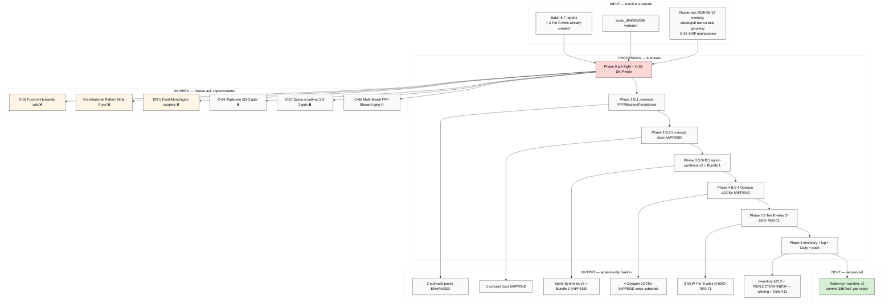

# EXPLAIN — Batch-6 Fixation Execute

> **Trigger:** Ruslan ack 2026-05-19 evening «всё там зафиксируй на всю душняку, потенциально эти вики и так далее… насчёт этого фонда пропускаем, никуда не заносим… похуй этот». Voice batch-6 surface'нул 11 NCs + 8 deep research candidates + 12 decisions; этот run executes the §APPEND queue + Tier B wikis (where actionable) + O-62 explicit SKIP-note.

---

## §1 Что у нас есть СЕЙЧАС

**Batch-6 substrate complete:**
- `reports/voice-pipeline-2026-05-19-batch-6/` — 7 docs (Summary 1450w + Master Index + per-note + FPF lens + 10-lens cross + work plan + candidates)
- 3 Tier A wikis already created Phase 5:
  - `wiki/concepts/fpf-as-info-transfer-vocabulary.md` (O-63) ⭐⭐
  - `wiki/concepts/mastery-formula.md` (O-64)
  - `wiki/claims/persistence-beats-talent.md` (O-69)
- §APPEND inventory §25 + REFLECTION-INBOX + wiki/log.md + Daily Log §10 done

**Pending Ruslan ack (12 decisions / 7 plan items) — all surface'нуто в `05-candidates-3-buckets.md`:**
- D-1 O-62 Fund-of-Humanity — **NOW: Ruslan-acked SKIP** ✓
- D-2 O-63 FPF Tier A ratification — **NOW: Ruslan-acked confirm** ✓ (no-op; wiki created Phase 5)
- D-3 O-65 5 functional skills sub-spec vs independent — Ruslan не уточнил → **default: independent NC wiki**
- D-4 Sprint-Synthesis-v2 §APPEND batch-6 — **NOW: Ruslan-acked include** ✓
- B.1-B.6 plan items — **NOW: Ruslan-acked execute** ✓ (except O-62-touching parts)
- Tier B 4 wikis ack-pending — **NOW: Ruslan-acked «потенциально эти вики»** → create where no additional gate

---

## §2 Что делает этот prompt (одним абзацем)

Server CC автономно executes all batch-6 fixation work in одном run: (a) **B.1** verbatim FPF anchor extraction в Karpathy + Engineer outreach packs; (b) **B.2** §APPEND-batch-6 entries в 5 acked concept docs с voice substrate cross-link (skip Fund-of-Humanity mentions); (c) **B.3** §APPEND-batch-6 substrate в Sprint-Synthesis-v2 Doc 2; (d) **B.5** §APPEND audio_695 substrate в Bundle 1 RUSLAN-ACK (supplement-2 or canonical equivalent); (e) **B.6** §APPEND-batch-6 в 4 Octagon LOCKs (H5 Tyson / H6 Gamified / H7 People-NS / H8 Trust-Infrastructure); (f) **Tier B wikis create where actionable**: O-65 (5 functional skills independent NC default) + O-70 (Learning-Knowledge-Understanding Trichotomy с Ryle/Polanyi lit) + O-71 (Recursive Supportive Control Pattern); (g) **O-62 SKIP-note** explicit в Phase 0 inventory §25 + REFLECTION-INBOX + wiki/log.md (Ruslan-acked SKIP preservation per append-only AP-6); (h) **Daily Log §11 §APPEND** execution log + final push.

**НЕ делает:** O-62 anything (Fund-of-Humanity = SKIPPED everywhere) / O-66 Triple-win (SD-3 A/B gate) / O-67 Здесь-и-сейчас (SD-2 utopian gate) / O-68 Multi-Modal Methods (FPF-Steward gate) / Constitutional Pattern Note C.1.1 (Fund-touching, dropped) / DR-1 Fund-of-Humanity Mondragón (Fund-touching, dropped) / DR-2..DR-8 launch (scoping defer per «потом») / Foundation v1.0 modifications / Pillar C modifications / 8 Octagon LOCK content modifications (только §APPEND voice substrate).

---

## §3 Что берёт на вход

- `reports/voice-pipeline-2026-05-19-batch-6/05-candidates-3-buckets.md` — full bucket A/B/C spec
- `reports/voice-pipeline-2026-05-19-batch-6/01-per-note-breakdown.md` — per-claim substrate
- `raw/voice-memos-2026-05-19-batch/audio_69{4,5,6}*.md` — verbatim source
- Targets для §APPEND:
  - `outreach/karpathy-outreach-pack-2026-05-19.md`
  - `outreach/engineer-cohort-outreach-script-2026-05-19.md`
  - `decisions/strategic/JETIX-AS-HACKATHON-PLATFORM-2026-05-18.md`
  - `decisions/strategic/JETIX-RECURSIVE-SELF-DEVELOPMENT-ENGINE-2026-05-18.md`
  - `decisions/strategic/JETIX-SYSTEM-MERGER-PROTOCOL-FPF-2026-05-18.md`
  - `decisions/strategic/JETIX-OUTREACH-SYSTEM-SCALABLE-2026-05-18.md`
  - `decisions/strategic/JETIX-EDUCATION-LAYER-SYSTEM-THINKING-2026-05-18.md`
  - `reports/sprint-synthesis-v2-2026-05-19-evening/02-action-plan-v2.md`
  - `decisions/RUSLAN-ACK-WAVE-C-BUNDLE-1-supplement-2-2026-04-28.md` (or canonical equivalent — server CC verify)
  - 4 Octagon LOCKs: `decisions/STRATEGIC-INSIGHT-TYSON-MENTORSHIP-PATTERN-2026-05-10.md` (H5) / `decisions/STRATEGIC-INSIGHT-JETIX-AS-GAMIFIED-PLATFORM-2026-05-11.md` (H6) / `decisions/STRATEGIC-INSIGHT-JETIX-AS-PEOPLE-NETWORK-STATE-2026-05-12.md` (H7) / `decisions/STRATEGIC-INSIGHT-JETIX-TRUST-INFRASTRUCTURE-2026-05-17.md` (H8)
- New Tier B wiki output paths:
  - `wiki/concepts/intellect-5-functional-skills.md` (O-65 independent)
  - `wiki/concepts/learning-knowledge-understanding-trichotomy.md` (O-70)
  - `wiki/concepts/recursive-supportive-control-pattern.md` (O-71)
- Inventory + REFLECTION-INBOX + wiki/log:
  - `reports/phase-0-fpf-scope/01-jetix-objects-inventory.md` (§25 §APPEND)
  - `decisions/REFLECTION-INBOX-2026-05-16.md` (§APPEND)
  - `wiki/log.md` (append)
  - `daily-logs/_DAILY-LOG-2026-05-19.md` (§11 §APPEND)

---

## §4 Что обрабатывает (6 phases)

| Phase | Что | Time | Commit msg |
|---|---|---|---|
| **Phase 0** | Pre-flight verify all target paths exist; if Bundle 1 canonical path missing → use supplement-2; record O-62 explicit SKIP-note in execution log | 5 min | `[batch-6-fix] Phase 0 pre-flight verify + O-62 SKIP-note` |
| **Phase 1 — Outreach extraction (B.1)** | Append §APPEND-batch-6 section к Karpathy + Engineer outreach packs с verbatim FPF anchor (audio_696 claim 11) + Mastery formula (claim 8) + Persistence>Talent (claim 16) | 10 min | `[batch-6-fix] Phase 1 B.1 outreach FPF/Mastery/Persistence anchors` |
| **Phase 2 — 5 concept docs §APPEND (B.2)** | §APPEND-2026-05-19-batch-6 entry в каждый из 5 acked concept docs с relevant audio_696 claims per concept (Education / Recursive / System Merger / Outreach / Hackathon). SKIP Fund-of-Humanity mentions per Ruslan ack. | 20 min | `[batch-6-fix] Phase 2 B.2 5 concept docs §APPEND` |
| **Phase 3 — Sprint-Synthesis-v2 + Bundle 1 §APPEND (B.3+B.5)** | §APPEND batch-6 substrate в Sprint-Synthesis-v2 Doc 2 critical path (skip Fund) + §APPEND audio_695 voice substrate в Bundle 1 supplement-2 (or canonical) | 10 min | `[batch-6-fix] Phase 3 B.3+B.5 sprint-synthesis-v2 + Bundle 1 §APPEND` |
| **Phase 4 — 4 Octagon LOCKs §APPEND (B.6)** | §APPEND-2026-05-19-batch-6 voice corroboration в 4 Octagon LOCKs (H5 mentorship / H6 platform / H7 people-NS / H8 trust). PRESERVE LOCK content untouched — append-only к §APPEND section | 15 min | `[batch-6-fix] Phase 4 B.6 4 Octagon LOCKs §APPEND voice substrate` |
| **Phase 5 — 3 Tier B wikis create** | Create O-65 (5 functional skills independent NC) + O-70 (Learning-Knowledge-Understanding Trichotomy с Ryle/Polanyi lit corroboration) + O-71 (Recursive Supportive Control Pattern с Bundle 1 cross-link); update wiki/log.md | 20 min | `[batch-6-fix] Phase 5 3 Tier B wikis (O-65/O-70/O-71)` |
| **Phase 6 — Inventory + REFLECTION-INBOX + Daily Log + push** | §APPEND inventory §25.2 «Fixation execute» entry; REFLECTION-INBOX §APPEND with O-62 SKIP record + decisions executed; Daily Log §11 §APPEND execution log; final push origin main | 10 min | `[batch-6-fix] Phase 6 inventory + REFLECTION-INBOX + Daily Log + push` |

**Total: ~90 min server CC autonomous; <€2 cost (built-in tools only).**

---

## §5 Что получим на выходе

**Modified (append-only, ~13 files):**
- 2 outreach packs (Karpathy + Engineer)
- 5 acked concept docs (§APPEND-batch-6)
- 1 Sprint-Synthesis-v2 Doc 2 (§APPEND)
- 1 Bundle 1 ack (§APPEND)
- 4 Octagon LOCKs (§APPEND voice substrate)
- 1 Phase 0 inventory (§25.2 §APPEND)
- 1 REFLECTION-INBOX (§APPEND)
- 1 wiki/log.md (append)
- 1 Daily Log (§11 §APPEND)

**Created (3 new Tier B wikis):**
- `wiki/concepts/intellect-5-functional-skills.md` (O-65)
- `wiki/concepts/learning-knowledge-understanding-trichotomy.md` (O-70)
- `wiki/concepts/recursive-supportive-control-pattern.md` (O-71)

---

## §6 К чему ведёт (next phase pointer)

После завершения этого fixation run:
1. **Левенчук inventory v2** (prompt уже на main `38b7ec7`) — launch second autonomous run
2. Post-Левенчук: review output → ack → deep FPF research run (отдельный prompt)
3. DR-top-3 deep research scoping defer per Ruslan «потом» (DR-1 Fund DROPPED entirely; new top-3 = DR-2 FPF-Field-Test / DR-3 Mastery-Calibration / DR-5 5-Functional-Skills-Pedagogy)

---

## §7 Mermaid схема

---

## §8 Constitutional posture

- **R1 surface only.** Brigadier-scribe scribe mode; voice anchors verbatim preserved; no strategic prose authoring
- **R2 ack-gated §APPEND.** All §APPENDs to concept docs / Octagon / Bundle 1 = Ruslan-acked «фиксируй»; PRESERVE LOCK content untouched (только §APPEND voice substrate sections)
- **R6 provenance.** Each §APPEND carries [src: audio_NNN claim N / batch-6 report path] cite
- **R11 Default-Deny.** No novel actions / no Foundation writes / O-62 SKIP-note preserves Ruslan dissent per AP-6
- **R12.** O-62 SKIP eliminates HIGH-risk extraction pattern; remaining items R12-clean
- **EP-5 F-grade.** F2-F3 surface predominant; no F4+ auto-claims
- **IP-1 STRICT.** Roles abstract; substrate ≠ instance preserved
- **Append-only.** New §APPEND sections only; no canonical modifications
- **AP-6 dissent preservation.** O-62 SKIP recorded explicit в inventory + REFLECTION-INBOX («Ruslan-acked SKIP 2026-05-19 evening: «похуй, никуда не заносим»») — preserves decision trail для future audit

---

## §9 Cost cap

- €10/день baseline; built-in tools only (Read/Edit/Write/Bash git)
- No external API; no WebFetch needed (всё local file ops)
- Estimated total: <€2 / ~90 min

---

*EXPLAIN closure 2026-05-19 evening. Ready для launch. Per memory `feedback_prompt_explanation_required.md` + `feedback_cowork_can_push.md` — Ruslan acked «фиксируй», commit+push без re-ack.*
