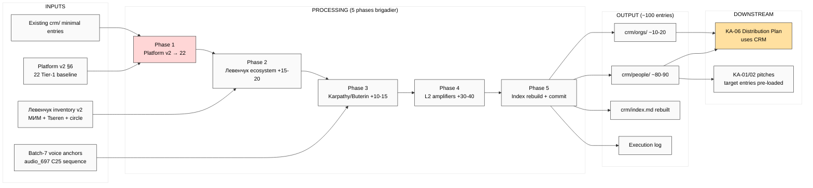

# EXPLAIN — KA-03 CRM First-Pass 100 Contacts

> **TL;DR.** Brigadier compile 100 Tier-1 contacts в CRM из Platform v2 §6 baseline + voice anchors batch-7 + Левенчук inventory v2. Per Ruslan ack 2026-05-20 — prompt prepared and saved; **launch когда Ruslan скажет**.

---

## §1 Что у нас есть СЕЙЧАС

**Baseline:**
- Platform v2 §6 — 22 Tier-1 partner candidates (already в repo)
- Existing CRM: `crm/people/` + `crm/orgs/` (current state — minimal, mostly ICP discovery entries)
- Левенчук inventory v2 — Левенчук + Tseren as priority Tier-1
- Batch-7 surface — Karpathy + Buterin + Anthropic + Дмитрий (audio_697 C25 sequence target)
- 5 acked concept docs — implicit audience targets

**Pending:**
- DR-14 methodology (for scaling beyond 100 manual) — in research pool (NOT launched)

---

## §2 Что делает prompt (одним абзацем)

Brigadier autonomous: (a) extract все Platform v2 §6 Tier-1 names (22) → migrate в `crm/people/<slug>.md` + `crm/orgs/<slug>.md` using `/crm-add` skill; (b) extend до ~100 entries через cross-link audio anchors batch-7 + Левенчук ecosystem (Левенчук circle / МИМ residents / Tseren network) + Karpathy lineage + Buterin/Anthropic + L2 amplifiers + RU L2 telegram community sample; (c) per-entry segmentation L1 engineer / L2 amplifier / L3 institutional + status (cold/warm/contacted); (d) `/crm-rebuild-index` → `crm/index.md` updated; (e) commit + push.

**НЕ делает:** auto-outreach (это KA-01/02 после R12 review path decided) / promote contacts beyond «discovered» status / spam contacts / scrape external sources beyond public availability.

---

## §3 Что берёт на вход

- `reports/jetix-platform-v2-2026-05-19/` §6 — 22 Tier-1 baseline (existing)
- `research/levenchuk-corpus-inventory-v2-2026-05-19-evening/` — Левенчук ecosystem references
- Batch-7 voice anchors (audio_697 C25 sequence Дмитрий → Левенчук + others)
- WebSearch (only для verifying known names — not for scraping new ones)
- `crm/_schema/` — segmentation taxonomy
- `crm/_templates/` — entry templates

---

## §4 Phases (5)

| Phase | Что | Time | Commit |
|---|---|---|---|
| 1 | Migrate 22 Platform v2 §6 baseline → CRM | 1h | `[ka-03] Phase 1 Platform v2 §6 baseline → 22 entries` |
| 2 | Extend Левенчук ecosystem 15-20 entries (МИМ + Tseren + Левенчук inner circle) | 1.5h | `[ka-03] Phase 2 Левенчук ecosystem ~15-20 entries` |
| 3 | Extend Karpathy lineage + Buterin + Anthropic 10-15 entries | 1h | `[ka-03] Phase 3 Karpathy/Buterin/Anthropic ~10-15 entries` |
| 4 | L2 amplifiers + RU telegram community 30-40 entries | 1.5h | `[ka-03] Phase 4 L2 amplifiers + RU community ~30-40 entries` |
| 5 | `/crm-rebuild-index` + per-entry tag validation + final commit + push | 1h | `[ka-03] Phase 5 index rebuild + finalize ~100 entries` |

**Total: ~6h brigadier autonomous. <€2 cost (built-in tools).**

---

## §5 Per-entry format

Per `crm/_templates/person.md`:

```yaml
---
slug: <kebab-case>
type: person | org
tier: 1 | 2 | 3
segmentation: L1-engineer | L2-amplifier | L3-institutional
status: discovered | cold | warm | contacted | discovery_call | proposal | active | past
roles: [strategic-partner | mentor | investor | client | etc]
priority: P1 | P2 | P3
source: [Platform v2 §6 / Левенчук inventory v2 / audio_697 / etc]
created: 2026-05-20
---

# <Full Name>

## §1 Identity
- Full name / handles / contact channels

## §2 Why на Tier-1 (rationale)
- Воспроизведение audio anchors / Platform v2 references

## §3 Cross-link к Jetix substrate
- 5 concept docs / Platform v2 / K-research relevance

## §4 Strategy hooks (offers / asks)
- §7 offers — what Jetix может предложить
- §8 asks — что нам нужно от этого человека

## §5 Status timeline
- 2026-05-20: discovered via KA-03 batch
```

---

## §6 Что получим на выходе

```
crm/people/
├── <22 Platform v2 Tier-1 entries>.md
├── <15-20 Левенчук ecosystem>.md
├── <10-15 Karpathy/Buterin/Anthropic>.md
└── <30-40 L2 amplifiers + RU community>.md

crm/orgs/
└── <organizations entries — Anthropic / МИМ / Mondragón / etc>.md

crm/index.md — rebuilt
crm/log.md — append entry «KA-03 first-pass 100 contacts 2026-05-20»
reports/voice-pipeline-2026-05-20-batch-7/_KA-03-EXECUTION-LOG.md — execution summary
```

---

## §7 К чему ведёт

- **Step 4 Distribution Plan substrate (KA-06)** — этот CRM = foundational target list для outreach pipeline
- **KA-01/02 first targets** — Дмитрий + Левенчук entries будут уже в CRM с full metadata
- **DR-14 unlock** — если scale beyond 100, methodology document можно apply к existing 100 для validation

---

## §8 Mermaid



---

## §9 Constitutional

- **R1 surface only** — discovered status; не auto-outreach; не promote beyond facts found
- **R2** — no Foundation modifications; only crm/ writes (new namespace per CRM canonical)
- **R6 provenance per entry** — source citation (Platform v2 §X / Левенчук inv v2 / audio_NNN claim N)
- **R11 Default-Deny** — only `/crm-add` skill ops (canonical CRM skill); no external scraping; no spam
- **R12 anti-extraction** — no contact information used for unsolicited extraction; all entries = discovered/cold status
- **EP-5 F2 surface** — observable facts only (name + role + public references); no inferred private data

---

## §10 Cost + runtime

- **Runtime:** ~6h brigadier autonomous (5 phases)
- **Cost:** <€2 Groq + Max sub bundled
- **Ruslan time:** ~0.5h × 22 Tier-1 ack review ≈ 11h spread across days
- **Per-phase commit cadence** preserves recoverability

---

## §11 Trigger to launch

Ruslan acks «launch KA-03» → я copy `prompts/ka-03-crm-first-pass-100-2026-05-20.md` к server CC tmux session + paste prompt. Per memory `feedback_cowork_can_push.md` — acked.

---

*EXPLAIN closure 2026-05-20. Prompt SAVED. Awaiting Ruslan launch ack (separate from this initial fixation).*
