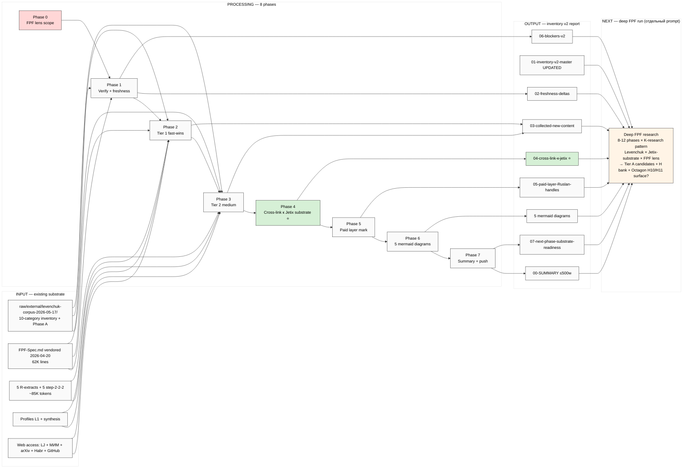

# EXPLAIN — Levenchuk Corpus Inventory v2

> **TL;DR.** Sprint 16-19.05 закончен. Перед deep FPF research (next phase) — refresh + extend 2026-05-17 corpus inventory: verify freshness, fill Tier 1+2 collection gaps, cross-link к новому Jetix substrate (5 concept docs / Platform v2 / 6 K-research), mark paid layer для Ruslan handling. **Inventory отчёт, не deep semantic dive** — substrate для следующего FPF deep run.

---

## §1 Что у нас есть СЕЙЧАС (state до launch)

### Existing Левенчуковский substrate (RAW corpus + research extracts)

**Vendored / existing-in-repo:**
- `raw/external/ailev-FPF/FPF-Spec.md` — 62,202 lines / 5.7 MB (vendored 2026-04-20)
- `raw/external/ailev-FPF/Readme.md` — 384 lines
- `raw/external/levenchuk-corpus-2026-05-17/` — 10-category corpus inventory (327 lines) + Phase A collection MANIFEST + blockers.md
  - `01-github/freshness-check-2026-05-17.md`
  - `02-livejournal/key-posts-captured-2026-05-17.md` (~12K words; 9 captured items)
  - `04-aisystant-paid/IWE-SESSION-PROTOCOL-2026-05-17.md` — DEPRECATED per `feedback_iwe_chat_rejected.md`

**Research extracts (already done):**
- `raw/research/levenchuk-deep-research-2026-04-18.md` — bio (361 lines)
- `raw/research/levenchuk-for-ai-deep-research-2026-04-19.md` — AI angle (1041 lines)
- `raw/research/levenchuk-fpf-knowledge-base-2026-04-20.md` — FPF KB (2456 lines)
- `raw/research/fpf-gap-analysis-2026-04-20.md` (2486 lines)
- `raw/research/levenchuk-fpf-research-2026-04-20/R-{A,B,C,D,E}.md` — 5 sub-extracts (~85K tokens combined)
- `raw/research/step-2-2-2-extractions/{A,B,C,D,E}*.md` — 5 sub-agent extractions
- `raw/research/2026-04-28-tseren-{tg,yt}-export/` — Tseren full TG (618 posts) + YT metadata (127+452+37 videos)

**Profile docs:**
- `profiles/l1-first-clan/anatoliy-levenchuk.md`
- `profiles/l1-first-clan/tseren-tserenov.md`
- `_archive/calls/_L1-PROFILES-TSEREN-LEVENCHUK-2026-05-16.md` — synthesis

### Существующие blockers (от 17.05) — частично resolved:
- **B1 Aisystant subscription handoff** — Ruslan ack «handle separately» (Option C активен)
- **B2 IWE direct interaction** — **REJECTED** per memory `feedback_iwe_chat_rejected.md` (Aisystant chat «помойка»; используем только materials)
- **B4 «Инженерия интеллекта»** — pending Ruslan clarification
- **B6 YouTube transcripts** — infrastructure-blocked (metadata-only degrade)

### Что добавилось sprint 16-19.05 (substrate для cross-link)
- 5 acked concept docs F2 (Hackathon Platform / Recursive Engine / System Merger / Outreach Scalable / Education Layer)
- 5 deep research outputs (hackathon-platform-deep / recursive-engine-deep / system-merger-deep / outreach-deep / education-layer-deep)
- Platform v2 (22 people / 32 resources / FPF 8-layer / 15 monetization)
- **6 K-research deep** ⭐ (K-1 Info-Substrate / K-2 AGI Reception / K-3 Society-Code / K-4 Intellect-12 / K-5 Safety-Develop / K-6 Method-Systems-Thinking+Exokortex)
- 3 NEW Tier A wikis K-6 (method-systems-thinking / jetix-as-exokortex / sense-of-measure-scientific-approach)
- Voice corpus batch-1/2/3/4/5 (text_001-014 + audio_669-691)

---

## §2 Что делает этот prompt (одним абзацем)

Server CC автономно: (a) **verify** 2026-05-17 corpus inventory delta (FPF upstream freshness vs vendored 2026-04-20 + новые LJ posts с 17.05 + новые videos / books / channels surfaced); (b) **fill** Tier 1+2 collection gaps от 17.05 (LJ tag-filtered samples, МИМ public site core pages, arXiv PDFs, Habr/vc.ru third-party, GitHub ailev/* repo listing, Psybertron English review fresh check); (c) **cross-link** Levenchuk-corpus topics к Jetix substrate (5 concept docs + Platform v2 + 6 K-research — особенно K-6 Method+Exokortex который semantic overlap с Levenchuk methodology); (d) **mark paid layer** explicit что Ruslan handles separately (aisystant courses + Ridero books + R0/R1/R2 residency); (e) **output** structured inventory v2 report ready как substrate для следующего FPF deep research run.

**НЕ делает:** не paid content download, не selection «что важно/не важно», не deep semantic FPF dive (это next phase), не Foundation writes, не canonical modifications.

---

## §3 Что берёт на вход

**Existing repo material:**
- `raw/external/levenchuk-corpus-2026-05-17/00-INVENTORY.md` (10-category source map)
- `raw/external/levenchuk-corpus-2026-05-17/MANIFEST.md` (Phase A collection summary)
- `raw/external/levenchuk-corpus-2026-05-17/blockers.md` (B1-B10)
- `raw/external/ailev-FPF/FPF-Spec.md` (vendored 2026-04-20)
- 5 R-A/B/C/D/E research extracts
- `profiles/l1-first-clan/{anatoliy-levenchuk,tseren-tserenov}.md`

**Web access (free):**
- `gh api repos/ailev/FPF/commits/main` — FPF freshness
- `WebFetch` для LJ posts, МИМ site, arXiv, Habr, vc.ru, Psybertron, Medium
- `WebSearch` для discovery (новые channels / publications с 17.05)

**Jetix substrate для cross-link:**
- `decisions/strategic/JETIX-*-2026-05-18.md` (5 concept docs)
- `reports/jetix-platform-v2-2026-05-19/` (Platform v2)
- `research/method-systems-thinking-deep-2026-05-19/` (K-6) ⭐⭐
- `research/info-substrate-philosophy-deep-2026-05-19/` (K-1)
- `research/agi-reception-market-deep-2026-05-19/` (K-2)
- `research/society-as-code-stress-test-2026-05-19/` (K-3)
- `research/intellect-12-component-audit-2026-05-19/` (K-4)
- `research/safety-develop-validation-2026-05-19/` (K-5)
- `wiki/concepts/method-systems-thinking.md` + `wiki/concepts/jetix-as-exokortex.md` + `wiki/concepts/sense-of-measure-scientific-approach.md` (3 Tier A wikis)

---

## §4 Что обрабатывает (8 phases)

| Phase | Что делает | Time est | Commit message |
|---|---|---|---|
| **Phase 0** | **FPF lens scope** — object = Levenchuk-corpus (artefact body + bio + ecosystem); layer = FPF F2 surfacing inventory level; diff predicate = N/A (cataloguing, не comparison); F-G-R = F2 surface / G=corpus-map / R=medium web-discoverable | 5 min | `[levenchuk-inventory-v2] Phase 0 FPF lens scope` |
| **Phase 1** | **Verify existing inventory** — FPF upstream freshness check (`gh api`), confirm 10 categories still valid, mark resolved blockers (B2 IWE = REJECTED, B5 «Системный фитнес» = practice not book) | 10 min | `[levenchuk-inventory-v2] Phase 1 verify + freshness deltas` |
| **Phase 2** | **Tier 1 fast-wins collection** — LJ key posts 02.10-02.11 re-verify + новые с 17.05, МИМ public site core pages (03.01/03.05/03.06/03.11), arXiv 07.01/07.02 PDFs metadata, Psybertron 09.03 fresh, systemsworld.club Tseren 08.11 | 15-20 min | `[levenchuk-inventory-v2] Phase 2 Tier 1 collection` |
| **Phase 3** | **Tier 2 medium-effort** — LJ tag-filtered samples (02.02-02.09, top 20/tag), Habr 09.01 / vc.ru 09.02 третий-party batch, GitHub `ailev/*` other repos listing (01.03), TechInvestLab 2015 PDF (07.05), inexsu.wordpress.com (09.06), in.wiki bio (09.08) | 15-20 min | `[levenchuk-inventory-v2] Phase 3 Tier 2 collection` |
| **Phase 4** | **Cross-link к Jetix substrate** — Levenchuk topics × (5 concept docs + Platform v2 + 6 K-research особенно K-6 + 3 Tier A wikis); per-topic overlap matrix; identify где Levenchuk methodology уже latent в нашем substrate vs где gap | 15-20 min | `[levenchuk-inventory-v2] Phase 4 cross-link к Jetix substrate` |
| **Phase 5** | **Paid layer mark** — explicit list что Ruslan handles separately (aisystant 8 courses + 9 Ridero books + R0/R1/R2 residency); access plan per item; cost estimate; recommended priority order для Ruslan acquisition | 10 min | `[levenchuk-inventory-v2] Phase 5 paid layer Ruslan-handles` |
| **Phase 6** | **Mermaid diagrams (5)** — (1) corpus map landscape / (2) publication timeline 2000-2026 / (3) topic taxonomy / (4) paid-vs-free-vs-blocked / (5) cross-link к Jetix substrate | 10-15 min | `[levenchuk-inventory-v2] Phase 6 mermaid diagrams` |
| **Phase 7** | **Synthesis + Summary for Ruslan + Cost snapshot + Push** — `00-SUMMARY-FOR-RUSLAN.md` ≤500w + Daily Log §APPEND + final push origin main | 10 min | `[levenchuk-inventory-v2] Phase 7 Summary + final push` |

**Total: ~90-110 min server CC autonomous; <€2 cost (built-in WebFetch / WebSearch / Bash / Read только).**

---

## §5 Что получим на выходе

```
research/levenchuk-corpus-inventory-v2-2026-05-19-evening/
├── 00-SUMMARY-FOR-RUSLAN.md       (entry; ≤500w; что собрано / что paid / что blocked / next phase substrate)
├── 01-inventory-v2-master.md      (10-category map UPDATED; status per source: ✅ collected / 🟡 free-pending / 🟢 paid-Ruslan / 🔴 blocked)
├── 02-freshness-deltas.md         (FPF upstream HEAD vs 2026-04-20 vendored + новые LJ posts с 17.05 + новые videos/books surfaced)
├── 03-collected-new-content.md    (Tier 1+2 captures: LJ posts text + МИМ pages + arXiv abstracts + Habr/vc.ru samples + Psybertron + inexsu)
├── 04-cross-link-к-jetix-substrate.md  (Levenchuk topics × 5 concept docs / Platform v2 / 6 K-research / 3 Tier A wikis — matrix + gaps)
├── 05-paid-layer-ruslan-handles.md (aisystant 8 courses + 9 Ridero books + R0/R1/R2; access plan; cost est; priority order)
├── 06-blockers-v2.md              (updated from 17.05: B2 RESOLVED rejected, B5 RESOLVED practice-not-book; new blockers if any)
├── 07-next-phase-deep-fpf-prompt-substrate.md (substrate brief для будущего deep FPF research prompt — это NOT prompt сам, just substrate readiness check)
└── diagrams/
    ├── 01-corpus-map-landscape.md
    ├── 02-publication-timeline-2000-2026.md
    ├── 03-topic-taxonomy.md
    ├── 04-paid-vs-free-vs-blocked.md
    └── 05-cross-link-к-jetix-substrate.md
```

**Что в каждом файле (концептуально):**
- `00-SUMMARY` — Ruslan-facing entry: что нового vs 17.05 / что paid awaiting tebya / что blocked / какие cross-link findings ⭐ / ready как substrate для next FPF deep
- `01-inventory-v2-master` — full 10-category map с UPDATED status flags + новые sources surfaced с 17.05
- `02-freshness-deltas` — explicit delta report: FPF upstream commits с 2026-04-20 → 2026-05-19 + новые LJ posts с 17.05 + любые новые videos / books / Tg channels
- `03-collected-new-content` — actual captured text (Tier 1+2): LJ posts, МИМ pages, arXiv, Habr/vc.ru samples — primary substrate для next phase
- `04-cross-link-к-jetix-substrate` — main analytical doc: где Levenchuk methodology уже latent в 5 concept docs / Platform v2 / K-6 / etc. + identifying gaps для deep FPF phase
- `05-paid-layer-ruslan-handles` — operational doc для tebya: что купить / в каком порядке / cost est
- `06-blockers-v2` — clean updated list
- `07-next-phase-deep-fpf-substrate` — checklist readiness signal для следующего FPF deep run

---

## §6 Конкретные шаги (sequential)

1. **Server CC reads** prompt + this EXPLAIN + existing 2026-05-17 inventory + 3 blockers files + R-A/B/C/D/E extracts
2. **Phase 0 FPF lens scope** — write `phase-0-fpf-lens-scope.md` inside output dir (5 min)
3. **Phase 1 freshness check** — `gh api repos/ailev/FPF/commits/main`; compare HEAD vs vendored 2026-04-20; new LJ posts via WebFetch ailev.livejournal.com latest 30; flag B2 RESOLVED + B5 RESOLVED → write `02-freshness-deltas.md`
4. **Phase 2 Tier 1 collection** — 5-8 WebFetch calls (LJ key posts re-verify + МИМ site core pages + arXiv abstracts + Psybertron + systemsworld.club Tseren); все content → `03-collected-new-content.md` с per-source provenance
5. **Phase 3 Tier 2 collection** — 10-15 WebFetch calls (LJ tag samples + Habr/vc.ru + ailev GitHub repos listing + TechInvestLab + inexsu + in.wiki); append to `03-collected-new-content.md`
6. **Phase 4 cross-link** — read 5 concept docs + Platform v2 + 6 K-research summaries; build matrix Levenchuk topics × Jetix substrate; identify overlap / gap → `04-cross-link-к-jetix-substrate.md`
7. **Phase 5 paid layer** — write `05-paid-layer-ruslan-handles.md` с explicit access plan
8. **Phase 6 mermaid** — 5 diagrams (black text theme init per `wiki/operations/mermaid-style-guide-2026-05-07.md`)
9. **Phase 7 Summary + Daily Log §APPEND + final push** — ≤500w entry doc + push origin main

**Per-phase commit + push** (как pattern K-research / sprint-synthesis-v2). Final echo: `DONE Phase 7 — {N} commits / {M} files / 5 mermaid / corpus inventory v2 ready для next FPF deep phase`.

---

## §7 К чему ведёт (next phase pointer)

Этот run = **substrate prep**. Next phase (отдельный prompt после Ruslan reviews этот output) = **deep FPF research по всей Levenchuk-substrate × Jetix-substrate** через FPF lens:

- 8-12 phases analogous к K-research pattern (Phase 0 FPF scope → philosophical lineage → primitives audit → method × Jetix mapping → cross-pollination matrix → Tier A wiki candidates → 99-Summary)
- Cross-link к K-6 (Method of Systems Thinking) особенно — Levenchuk = direct predecessor lineage
- Output: Tier A wiki candidates / new Phase 0 inventory objects / 30-50 H hypothesis bank / possible new O- candidates для Octagon H10/H11 surface

**Этот inventory v2 = prerequisite, not the deep run itself.** Ruslan reviews → acks → next prompt (FPF deep) launches.

---

## §8 Mermaid схема (input → processing → output)



---

## §9 Constitutional posture

- **R1 surface only.** No strategic prose; all output = derivative scribe-mode
- **R2 preserved.** No Foundation writes / no canonical modifications / no AWAITING-APPROVAL packets needed (это новый namespace `research/levenchuk-corpus-inventory-v2-2026-05-19-evening/`)
- **R6 provenance.** Per-source [src: URL / file path] на каждое утверждение
- **R11 Default-Deny.** No novel action classes (только WebFetch / Read / Bash gh+curl / Write)
- **R12.** N/A (corpus inventory, не value extraction)
- **EP-5 F-grade.** F2 surfacing predominant (cataloguing); никакие F4+ claims авторитетные
- **IP-1 STRICT.** Roles abstract (brigadier-scribe scribe mode)
- **FPF lens FIRST.** Phase 0 mandatory before collection (per `feedback_fpf_lens_first.md`)
- **Breadth NOT selection.** No «top-N» / «recommended» / «priority pick» language; pure inventory with status flags
- **Append-only.** New namespace; Daily Log §APPEND only; existing 2026-05-17 inventory PRESERVED unchanged
- **No paid content download.** Per `feedback_iwe_chat_rejected.md` IWE chat REJECTED; aisystant materials = Ruslan manual download separately

---

## §10 Cost cap

- €10/день baseline (built-in WebFetch / WebSearch / Bash / Read — no external API)
- €50 hard halt (impossible этим scope; ~€1.5-2 estimated)
- yt-dlp NOT used (B6 infrastructure-blocked; metadata-only degrade preserved)
- No ANTHROPIC_API_KEY direct calls

---

*EXPLAIN closure 2026-05-19 evening Berlin. Ready for Ruslan ack + launch. Per memory `feedback_prompt_explanation_required.md` — explanation BEFORE launch enforced.*

**Next signal:** Ruslan reads this → ack «погнали / launch / делай» → я launch'аю prompt через tmux server CC.
