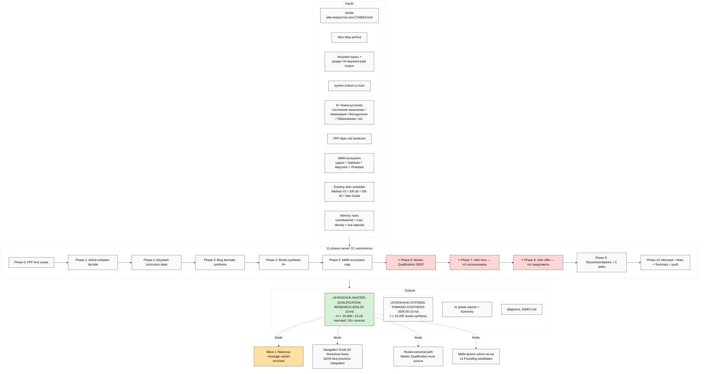

# 📋 EXPLAIN — Левенчук Master Qualification research

## §1 Что у нас есть СЕЙЧАС (state ДО запуска)

- ✅ Article URL: https://ailev.livejournal.com/1794653.html (про «Квалификация мастера»)
- ✅ Левенчук corpus в репо `raw/external/levenchuk-corpus-2026-05-17/` (включая `04-aisystant-paid/` материалы)
- ✅ FPF spec vendored `raw/external/ailev-FPF/FPF-Spec.md` (72К строк)
- ✅ Method V2 §13 12 traditions deep (Левенчук как один из anchors)
- ✅ DR-38 main (только что закончился) — Шедровицкий ММК + Левенчук метод-объект lineage уже covered
- ✅ Existing Левенчук distillation pack pre-staged для Wave 1 outreach (per handoff)
- ⚠️ НО — нет dedicated deep research конкретно про **«Квалификация мастера»** + step-by-step path + Jetix cross-pollination opportunities

---

## §2 Что делает этот prompt

**11 phases server CC autonomous** (10-15h / <€4 / per-phase commit + push) — берёт:
- Левенчук blog article (WebFetch + verbatim decode)
- Полный ШСМ/МИМ corpus
- 8+ Левенчук books
- Aisystant курсы материалы
- МИМ ecosystem map

→ выдаёт:
1. **Master Qualification deep** — что это / как получить / дисциплины / тесты / time / cost / step-by-step actionable path
2. **Jetix lens** — что Jetix может **использовать** из ШСМ corpus (cross-pollination per Jetix subsystem)
3. **Jetix offer** — что Jetix может **предложить** Левенчук-circle (substrate / tools / partnership)
4. **Recommendations + 5 strategic paths**

**Это substantiates Wave 1 Левенчук-bridge** — без этого ты идёшь к нему «вслепую»; с этим = знаешь его world inside-out + чётко формулируешь cross-pollination value.

---

## §3 Что берёт на вход

| Input | Откуда |
|---|---|
| Primary article | https://ailev.livejournal.com/1794653.html (WebFetch verbatim) |
| Ailev blog archive | https://ailev.livejournal.com/ (related posts тематические серии) |
| Aisystant курсы content | https://aisystant.system-school.ru/ + `raw/external/levenchuk-corpus-2026-05-17/04-aisystant-paid/` |
| ШСМ main site | https://system-school.ru/ |
| Левенчук books | «Системное мышление 2020» / «Системная инженерия» / «Методология» / «Образование для образованных» / «Системный менеджмент» / «ОТМИ» / «Бизнес как платформа развития» / «Системная инженерия мышления» + другие |
| FPF spec | `raw/external/ailev-FPF/FPF-Spec.md` |
| МИМ ecosystem figures | Цэрэн / Gabdulin / Batyrshin / Podobed + другие |
| Existing Jetix substrate | Method V2 §13 / DR-38 / DR-40 / Levenchuk distillation / Navigation Guide |
| Memory rules | constitutional + max-density + iwe-rejected + research-pool + breadth + fpf-first |

---

## §4 Что обрабатывает (pipeline 11 phases)

0. **FPF lens scope** — define «Квалификация мастера» в FPF terms; кто object / на каком scale / acceptance predicate
1. **Article verbatim decode** — WebFetch + cite every claim
2. **Aisystant curriculum deep** — структура программ / дисциплины / prerequisites / timeline / fees
3. **Ailev blog thematic synthesis** — related Master Qualification posts crawl
4. **Левенчук books synthesis** — 8+ books per book: thesis / structure / contribution / cross-cite
5. **МИМ ecosystem map** — 5+ figures positioning + alignment с Jetix
6. ⭐ **MASTER QUALIFICATION DEEP** — what / how / disciplines / tests / requirements / timeline / cost / step-by-step actionable path
7. ⭐ **JETIX LENS** — что Jetix использует из ШСМ corpus (concrete per subsystem Foundation/Wiki/Workshop/Hypothesis)
8. ⭐ **JETIX OFFER** — что Jetix предлагает Левенчук-circle (с R12 paired-frame discipline)
9. **Recommendations + 5 strategic paths**
10. **Mermaid pass + Main deliverable + Summary + final push**

---

## §5 Что получим на выходе

| File | Что внутри |
|---|---|
| ⭐⭐⭐ `decisions/strategic/LEVENCHUK-MASTER-QUALIFICATION-RESEARCH-2026-05-23.md` | Main ~20-30K / 12-18 mermaid / 50+ sources / Phases 6+7+8 primary value-add |
| ⭐⭐ `decisions/strategic/LEVENCHUK-SYSTEMS-THINKING-SYNTHESIS-2026-05-23.md` | Sub-doc ~15-20K — 8+ books deep synthesis |
| 11 phase reports | `reports/levenchuk-master-research-2026-05-23/00-10-*.md` |
| `reports/.../diagrams/_INDEX.md` | 12-18 mermaid catalogued |
| `00-SUMMARY-FOR-RUSLAN.md` | ≤1500w summary для твоего read |

---

## §6 К чему ведёт (продвижение в roadmap)

- **Substantiates Левенчук Wave 1 outreach** — чёткое понимание его world + cross-pollination value proposition
- **Provides Ruslan's personal path к Master Qualification** (если решишь pursue) — step-by-step actionable
- **Identifies Jetix subsystems** где ШСМ tradition обогащает (FPF / методология / educational format / examination)
- **Identifies Jetix offer** для МИМ alumni cohort recruit (potential Layer 1 Founding partners)
- **Enriches Wave 1 message variants** — Левенчук получит message который шows deep understanding его work
- **Feeds Navigation Guide §4 (Workshop frame)** — формат «мастерская инженеров-менеджеров» enriched per ШСМ best practices
- **Compounds c DR-38** (метод-объект lineage уже covered) + **DR-40** (cybernetic) → triple anchor для Левенчук discussion

---

## §7 Mermaid схема — input → processing → output

---

## §8 Дополнительные notes

- ⚠️ **RAM:** server CC RAM свободна сейчас. Этот = HEAVY (ROY 500% + MAX tokens × 3). Recommend launch как **1st priority single** — если хочешь добавить параллельно, легкий `nav-guide deep` ОК (2-parallel). DR-37 HEAVY → recommend sequential.
- ✅ **Cost <€4** (10-15h Claude Max bundled + Groq если transcription нужна = €0)
- ✅ **Per-phase commit + push** = resumable если crash
- ✅ Article URL обязательный WebFetch (доступен у server CC)
- ⚠️ **Aisystant курсы:** materials в `raw/external/levenchuk-corpus-2026-05-17/04-aisystant-paid/` — если incomplete, flag «нужно докупить [slug]» в Phase 9; ты делаешь manually

---

## §9 Готов к launch?

После твоего ack «launch lev-master» → дам launch command для server CC (analog DR-38 / DR-40 sequence).

---

*EXPLAIN closure 2026-05-22 evening. Per `feedback_prompt_explanation_required.md`.*
