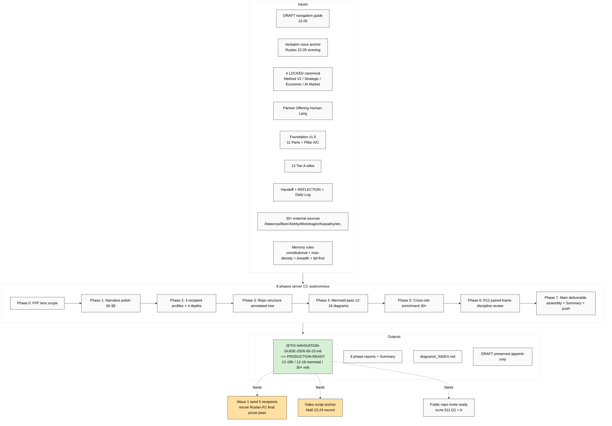

# 📋 EXPLAIN — Navigation Guide Deep prompt

> **Кому:** Ruslan, перед launch. **Чтобы:** ты увидел что именно делает prompt — input / output / steps / куда продвигает.

---

## §1 Что у нас есть СЕЙЧАС (state ДО запуска)

- ✅ **DRAFT version** `decisions/strategic/JETIX-NAVIGATION-GUIDE-2026-05-22-DRAFT.md` (создан Cloud Cowork только что; ~500 lines / 15 секций / 7 mermaid; substrate compile из твоей voice диктовки 22.05 evening)
- ✅ Все 4 LOCKED canonical (Method V2 / Strategic Plan / Economic V10 / AI Market PLAN Stage 1)
- ✅ Partner Offering Human-Lang ACKED
- ✅ 13 Tier A wikis + Foundation v1.0
- ✅ Verbatim voice anchor preserved §0 DRAFT
- ⚠️ DRAFT не отполирован под Wave 1 send quality; reading paths не deep per recipient profile; repo structure tree minimal; mermaid 7 (target 12-18); cross-cites minimal

---

## §2 Что делает этот prompt

**Полирует DRAFT → publication-ready Wave 1 communication primitive** через 8 фаз autonomous server CC execution (3-5h / <€2 / per-phase commit + push). Берёт твою voice диктовку + DRAFT structure + всё repo substrate + memory rules → выдаёт production-ready `JETIX-NAVIGATION-GUIDE-2026-05-23.md` (~12-18K words / 12-18 mermaid / 30+ cross-cites / 4 recipient profiles с per-profile reading paths / annotated repo structure tree).

**НЕ авторит R1 strategic prose** — substrate compile only; твой R1 voice прозрачно остаётся за тобой для финальной полировки.

---

## §3 Что берёт на вход

| Input | Откуда |
|---|---|
| DRAFT navigation guide | `decisions/strategic/JETIX-NAVIGATION-GUIDE-2026-05-22-DRAFT.md` |
| Verbatim voice anchor | DRAFT §0 (Ruslan dictation 22.05 evening) |
| Method V2 main | `decisions/strategic/METHOD-LIFE-DEVELOPMENT-V2-2026-05-21.md` |
| Strategic Plan | `decisions/strategic/STRATEGIC-PLAN-NEAR-FUTURE-2026-05-21.md` |
| Economic Model V10 | `decisions/strategic/ECONOMIC-MODEL-TOKENOMICS-2026-05-22.md` |
| AI Market PLAN Stage 1 | `decisions/strategic/AI-MARKET-ELECTRICITY-ANALOGY-PLAN-2026-05-22.md` |
| Partner Offering | `PARTNER-OFFERING-HUMAN-LANG-2026-05-22.md` |
| Foundation overviews | `swarm/wiki/synthesis/foundation-master-overview-*.md` |
| 13 Tier A wikis | `wiki/concepts/*.md` |
| Handoff | `_HANDOFF_to_next_cowork_session_2026-05-22.md` |
| REFLECTION-INBOX recent | `decisions/REFLECTION-INBOX-2026-05-16.md` (§APPEND-batch-10 + batch-11 + Ruslan ACK records) |
| Daily Log 22.05 | `daily-logs/_DAILY-LOG-2026-05-22.md` |
| CRM Левенчук + Цэрэн profiles | `crm/people/*.md` (для tone calibration) |
| External substantiation sources | Левенчук + ШСМ + Beer VSM + Ashby + Mondragón + Buterin + Karpathy + Anthropic + Goertzel/Hutter/Legg + Bateson + Polanyi + Senge + Wiener + Shannon + Bostrom + Yampolskiy + etc. (30+ targets) |
| Memory rules | feedback_constitutional + feedback_max_density + feedback_no_unsolicited_alternatives + feedback_fpf_lens_first + feedback_prompt_explanation_required + role_cloud_cowork_assistant |

---

## §4 Что обрабатывает (pipeline)

1. **Phase 0** — FPF lens scope (что есть «navigation guide» в FPF terms; кому; на каком уровне; acceptance predicate)
2. **Phase 1** — DRAFT integration + narrative polish (§0-§8 history / thesis / plan / Workshop frame / запрос / urgency / AGI / society — sharpen prose без changing R1 substance)
3. **Phase 2** — 4 recipient profiles × 4 reading depths (Левенчук / Цэрэн / МИМ-inner / outside engineer) — per-profile reading paths tables
4. **Phase 3** — Annotated repo structure tree (every top-level dir explained; ⭐ markers per importance)
5. **Phase 4** — Mermaid pass — 12-18 diagrams (each ≥6 nodes; dense; styled per Jetix mermaid-style-guide)
6. **Phase 5** — Cross-cite enrichment (30+ external substantiation refs)
7. **Phase 6** — R12 paired-frame 8-item discipline review of every claim/offer/ask
8. **Phase 7** — Main deliverable assembly + Summary + final push (replaces DRAFT-status → PRODUCTION-READY status)

---

## §5 Что получим на выходе

| File | Что внутри |
|---|---|
| `decisions/strategic/JETIX-NAVIGATION-GUIDE-2026-05-23.md` ⭐⭐ | Main deliverable ~12-18K words / 12-18 mermaid / 30+ cross-cites / 4 recipient profiles / annotated repo tree / R12-checked; PRODUCTION-READY для Wave 1 send (после твоей R1 final prose pass) |
| `reports/navigation-guide-deep-2026-05-23/phase-0-fpf-lens-scope.md` | FPF lens scope definition |
| `reports/navigation-guide-deep-2026-05-23/01-narrative-polish.md` | Sharpened §0-§8 prose draft |
| `reports/navigation-guide-deep-2026-05-23/02-navigation-paths.md` | 4 profiles × 4 reading depths tables |
| `reports/navigation-guide-deep-2026-05-23/03-repo-structure-annotated.md` | Annotated repo tree |
| `reports/navigation-guide-deep-2026-05-23/04-mermaid-pass.md` + `diagrams/_INDEX.md` | 12-18 mermaid diagrams catalogued |
| `reports/navigation-guide-deep-2026-05-23/05-cross-cite-refs.md` | 30+ external substantiation refs |
| `reports/navigation-guide-deep-2026-05-23/06-r12-review.md` | R12 8-item discipline check log |
| `reports/navigation-guide-deep-2026-05-23/00-SUMMARY-FOR-RUSLAN.md` | Summary ≤1500w для твоего review |
| **DRAFT preserved** | `decisions/strategic/JETIX-NAVIGATION-GUIDE-2026-05-22-DRAFT.md` — append-only NOT overwritten |

---

## §6 Конкретные шаги (8 phases per-phase commit + push)

См. `prompts/navigation-guide-deep-2026-05-23.md` §1 table — каждая phase = отдельный commit с message `[nav-guide] Phase N description`.

---

## §7 К чему ведёт (продвижение в roadmap)

- **Unlocks Wave 1 send 5 recipients** (Левенчук + Цэрэн + 3 МИМ-inner) — production-ready navigation primitive ready после твоего R1 final pass
- **Substantiates** Wave 1 outreach package §4 (document inventory) с production-ready 4-th essential
- **Compounds** с уже-запущенными wiki-promo (3 NEW Tier A wikis) + DR-38 (8-component meta-method) + DR-40 (cybernetic external-system) — все эти result feed обратно в Navigation Guide §10-§12 для Wave 1.5 augment
- **Production-ready document** для public repo invite (если ack §11.Q1 = (b) public)
- **Anchor** для video script (Май 23-24 record) — providing структурированный narrative

---

## §8 Mermaid схема — input → processing → output

---

## §9 Дополнительные notes

- ⚠️ **RAM constraint:** 3 prompts уже крутятся (wiki-promo + DR-38 + DR-40); 4-th parallel = OOM risk. **Recommended:** wait wiki-promo (~1-2h) finishes, then launch этот как 2nd-parallel с одним из DRs. Альтернатива — после finish одного из DRs (~9-14h slow).
- ✅ **Light mechanical compile**, не deep research (DR-pattern) — поэтому 3-5h, не 8-14h
- ✅ Per-phase commit + push pattern = resumable если crash
- ⚠️ **R1 final prose pass всё равно требуется** Ruslan'ом перед actual Wave 1 send — этот prompt НЕ заменяет R1 authorship, только substrate compile + polish + mermaid + cross-cites

---

## §10 Готов к launch?

После твоего ack «погнали nav-guide» → я даю launch command для server CC (аналогично DR-38 / DR-40 sequence). Default рекомендация: wait wiki-promo finish first.

---

*EXPLAIN closure 2026-05-22 evening. Per `feedback_prompt_explanation_required.md` — sibling explanation file должен exist для каждого server CC prompt; этот = parent_explain ссылка из prompt frontmatter.*
