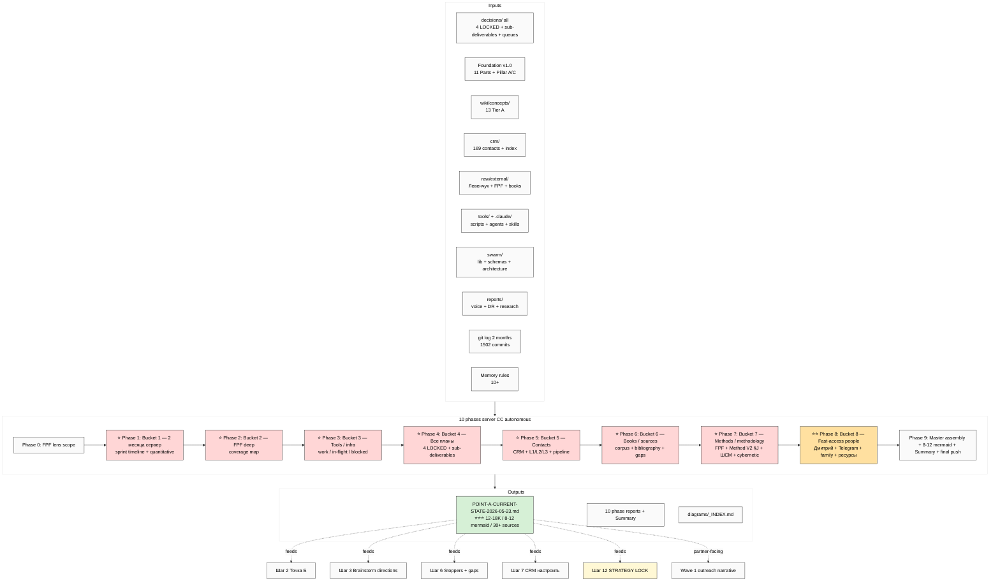

# 📋 EXPLAIN — Point A Current State

## §1 Что у нас есть СЕЙЧАС (ДО запуска)

- Substrate distributed по multiple folders (decisions/ / wiki/ / crm/ / raw/ / tools/ / .claude/ / swarm/ / principles/ / reports/)
- 1502 commits / 4004+ md files / ~1.3-1.5M words substrate
- НО — нет single document который собрал бы **всё это в одной плотной inventory**
- Plan-of-Day 23.05 Шаг 1 = «описать Точка А» — это нужный artifact

---

## §2 Что делает этот prompt

**10 phases server CC autonomous** (6-10h / <€3 / per-phase commit + push) — собирает **factual inventory** того что есть СЕЙЧАС, разделённый на **8 buckets per Ruslan dictation**:

1. **Что сделано за 2 месяца на сервере** — sprint timeline 24.03 → 23.05 week-by-week + quantitative
2. **FPF deep inventory** — full FPF coverage map в repo
3. **Tools / infrastructure** — ROY swarm + Wiki v2 + CRM + voice pipeline + AW + Toggl + skills + Foundation infrastructure
4. **Все планы** — 4 LOCKED canonical + sub-deliverables + Action Plan + Distribution Plan + Hypothesis Architecture + Updated Execution Plans
5. **Contacts (CRM + network)** — 169 contacts + L1/L2/L3 tiers + 14 Tier-1 ack queue + outreach pipeline status
6. **Books / sources / corpus** — `raw/external/` tree + cited sources across deliverables + bibliographic synthesis + gaps
7. **Methods / methodology** — FPF + Method V2 §J + ШСМ tradition + cybernetic principles + composition + meta-method
8. **Fast-access people + их ресурсы** — Дмитрий + Telegram channels + family + friends + existing professional contacts — per-person resource map

→ выдаёт production-ready `POINT-A-CURRENT-STATE-2026-05-23.md` (~12-18K / 8-12 mermaid / 30+ sources)

---

## §3 Что берёт на вход

| Input | Откуда |
|---|---|
| Все strategic substrate | `decisions/strategic/` + `decisions/` всё |
| Foundation v1.0 | `swarm/wiki/foundations/` 11 Parts + Pillar A/C |
| Wikis | `wiki/concepts/` 13 Tier A |
| CRM | `crm/people/` + `crm/orgs/` + `crm/index.md` |
| External corpus | `raw/external/` (Левенчук + FPF + books) |
| Tools | `tools/` (scripts + pipelines) |
| ROY swarm | `.claude/agents/` |
| Infrastructure | `swarm/` (lib / schemas / wiki architecture) + `principles/` |
| Prompts history | `prompts/` + `prompts/explanations/` |
| Daily logs | `daily-logs/` recent |
| Voice batches | `reports/voice-pipeline-*` |
| DR research | `research/` + DR mains |
| Git log | `git log --since='2026-03-24' --until='2026-05-23'` full 2-month |
| Memory rules | constitutional + max-density + breadth + fpf-first + no-unsolicited-alternatives |

---

## §4 Что обрабатывает (10 phases)

0. FPF lens scope + sub-inventory plan
1. Bucket 1: 2 месяца на сервере — sprint timeline week-by-week + quantitative + ⭐ deliverables
2. Bucket 2: FPF deep inventory — coverage map + где применяется
3. Bucket 3: Tools / infrastructure — что work / in-flight / blocked
4. Bucket 4: Все планы — 4 LOCKED + sub-deliverables + queues
5. Bucket 5: Contacts — CRM + L1/L2/L3 + Tier-1 ack queue + pipeline status
6. Bucket 6: Books / sources — corpus tree + cited bibliography + gaps
7. Bucket 7: Methods / methodology — FPF + Method V2 §J + ШСМ + cybernetic + composition
8. Bucket 8: Fast-access people + ресурсы — Дмитрий + Telegram + family + friends + professional — resource map
9. Master assembly + Mermaid (8-12 diagrams) + Summary + final push

---

## §5 Что получим на выходе

| File | Что внутри |
|---|---|
| ⭐⭐⭐ `decisions/strategic/POINT-A-CURRENT-STATE-2026-05-23.md` | Main ~12-18K consolidated / 8-12 mermaid / 8 buckets / quantitative inventory / 30+ sources |
| 10 phase reports | `reports/point-a-2026-05-23/00-09-*.md` |
| Diagrams INDEX | `reports/point-a-2026-05-23/diagrams/_INDEX.md` |
| Summary | `reports/point-a-2026-05-23/00-SUMMARY-FOR-RUSLAN.md` ≤1500w |

**Visualizations (8-12 mermaid):**
- Sprint timeline gantt 24.03-23.05 week-by-week
- Substrate stack architecture (Foundation → Wiki → decisions → reports)
- Tools inventory tree
- Contacts network graph (L1/L2/L3 tiers + per-role)
- FPF coverage map (primitives applied per substrate area)
- Books bibliography network (sources → deliverables)
- Methods stack (FPF + Method V2 §J + ШСМ + cybernetic layers)
- Fast-access people resource map (Дмитрий + Telegram + family + друг + leverage potential)
- Sprint quantitative dashboard (commits / words / files / contacts / sources)

---

## §6 К чему ведёт

- **Foundation для Шагов 2-12 Orientation Day 23.05** — без Точки А нельзя effectively сравнить с Точкой Б + brainstorm directions + select strategy
- **Partner-facing narrative ready** — раздел Bucket 1 = «что я сделал за 2 месяца» формат который можно показывать (Левенчук / Цэрэн / Дмитрий)
- **Tool inventory clear** — Bucket 3 показывает что реально работает vs paper-only
- **Resource awareness explicit** — Bucket 8 surfacing что есть в network для leverage activation
- **Gap visibility** — где не хватает (Bucket 6 «что докупить» / Bucket 5 «кого нет в network» / Bucket 7 «какие methodology gaps»)

---

## §7 Mermaid схема — input → processing → output

---

## §8 Дополнительные notes

- ⚠️ **RAM:** server RAM свободна. Light-medium prompt (inventory, не deep research) → OK 1-2 parallel. Recommend single launch first.
- ✅ **Cost <€3** (6-10h Claude Max bundled)
- ✅ Per-phase commit + push = resumable
- ✅ Подходит для Orientation Day Шаг 1 — после finish ты можешь review + decide Шаг 2 prompt scope
- ⚠️ **R1 final review needed** — после server CC finish, ты review + corrections / additions / R1 prose pass где нужно

---

## §9 Готов к launch?

После ack «погнали Точка А» → дам launch command для server CC.

---

*EXPLAIN closure 2026-05-23 evening. Per `feedback_prompt_explanation_required.md`.*
