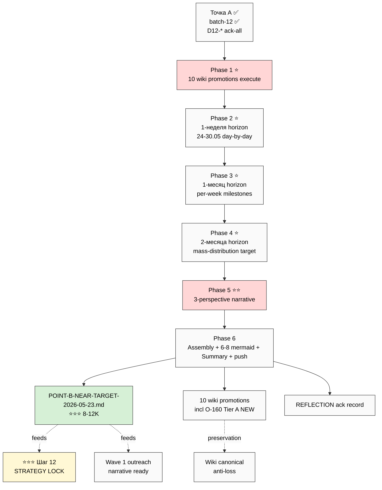

# 📋 EXPLAIN — Point B COMPACT + D12-* Wiki Promotions

## §1 Что у нас есть СЕЙЧАС

- ✅ Точка А CLOSED (~30K main + 12 mermaid + 220+ sources)
- ✅ batch-12-quick CLOSED (10 ideas O-156..O-165 + 11 D12-* ack queue)
- ⚠️ Ruslan ack-all D12-* → promote все к Wiki
- ⏳ Точка Б оригинальный prompt (point-b-near-target-2026-05-23.md) = 11 phases / 6-10h — slishком много для evening session
- ❌ Нет focused компактного Точка Б prompt

---

## §2 Что делает этот prompt

**7 phases server CC autonomous** (2-3h COMPACT / <€2 / per-phase commit + push):

**Dual mandate:**

1. **Execute D12-* ack-all wiki promotions** (Phase 1) — 10 wiki actions (§APPEND existing / NEW Tier B-Plus / NEW Tier A standalone O-160)
2. **Build Точка Б compact** (Phases 2-6) — 3 horizons (1 неделя / 1 месяц / 2 месяца) + 3-perspective narrative

**Mode:** COMPACT — NOT MAX-density mandate full / NOT ROY 500% / NOT 11 deep phases. Focused 2-3h.

---

## §3 Что берёт на вход

| Input | Откуда |
|---|---|
| ⭐ Точка А output | `POINT-A-CURRENT-STATE-2026-05-23.md` |
| ⭐ batch-12 substrate | `reports/voice-batch-12-quick-2026-05-23/*` + 3 per-audio MDs |
| Plan-of-Day 23.05 | `_PLAN-OF-DAY-2026-05-23.md` §2 Шаг 2 |
| 4 LOCKED canonical TL;DRs | Method V2 / Strategic Plan / Economic V10 / AI Market PLAN |
| Partner Offering + Navigation Guide DRAFT | Cross-cite |
| 13 Tier A wikis inventory | `wiki/concepts/` (для D12 promotion targets) |
| Memory rules | constitutional + fpf-first + no-unsolicited |

---

## §4 Что обрабатывает (7 phases)

0. Pre-flight + scope confirm
1. ⭐ **D12-* ack-all wiki promotions execute** (10 wiki actions per mapping)
2. ⭐ Точка Б 1-неделя horizon (24-30.05) — day-by-day с batch-12 integration
3. ⭐ Точка Б 1-месяц horizon (24.05-24.06) — per-week milestones
4. ⭐ Точка Б 2-месяца horizon (24.05-24.07) — mass-distribution-ready target
5. ⭐⭐ Consolidated narrative 3-perspective (Ruslan / partner / recruit)
6. Master assembly + 6-8 mermaid + Summary + final push

---

## §5 Что получим на выходе

| File | Что внутри |
|---|---|
| ⭐⭐⭐ `decisions/strategic/POINT-B-NEAR-TARGET-2026-05-23.md` | Main ~8-12K / 6-8 mermaid / 3 horizons / 3 perspectives |
| ⭐⭐ **10 wiki edits** | Per D12-* mapping: §APPEND existing OR NEW Tier B-Plus / Tier A |
| ⭐⭐⭐ **NEW** `wiki/concepts/development-promotion-mode-transition.md` | O-160 Tier A standalone |
| 6 phase reports | `reports/point-b-compact-2026-05-23/00-05-*.md` |
| Diagrams INDEX | `reports/point-b-compact-2026-05-23/diagrams/_INDEX.md` |
| Summary | `reports/point-b-compact-2026-05-23/00-SUMMARY-FOR-RUSLAN.md` ≤800w |
| ack record | REFLECTION-INBOX §APPEND-Ruslan-ACK-D12-promote-all |

---

## §6 D12-* promotion mapping

| ID | Path | Substrate weight |
|---|---|---|
| O-156 | §APPEND method-method-one-liner | medium |
| O-157 | §APPEND jetix-as-exokortex (distribution) | medium |
| **O-158 ⭐** | NEW `notion-mvp-bypass-pattern.md` | strong (actionable) |
| O-159 | §APPEND external-system-cybernetic (scale) | light |
| **O-160 ⭐⭐⭐** | **NEW Tier A `development-promotion-mode-transition.md`** + §APPEND method-method-one-liner | STRONGEST (transition fixation) |
| **O-161 ⭐⭐** | NEW `cohort-target-profile-ontology.md` (Tier B-Plus / A) | strong |
| **O-162 ⭐⭐** | §APPEND O-161 wiki (companion) | strong (paired) |
| O-163 | §APPEND all-is-information (testable hypothesis) | medium |
| O-164 | §APPEND method-method-one-liner (4th layer) | medium |
| O-165 | CRM update DRAFT + Direction Card (NOT wiki) | operational |

---

## §7 К чему ведёт

- **Direct input** для Шага 12 STRATEGY LOCK (final деliverable Plan-of-Day) — теперь Ruslan имеет:
  - Точка А (done)
  - Точка Б compact (done)
  - All D12-* in wiki (preservation + cross-cite ready)
- **Wave 1 outreach ready** — Точка Б narrative tailored partner-facing
- **D12-* preserved permanently** в wiki = anti-loss
- **O-160 как Tier A** = explicit phase-transition fixation в canonical layer

---

## §8 Mermaid flow

---

## §9 Дополнительные notes

- ⚠️ **Supersedes** оригинальный `point-b-near-target-2026-05-23.md` (preserved append-only) — этот compact = focused replacement
- ✅ Cost <€2 / 2-3h (vs 6-10h original)
- ✅ Per-phase commit = resumable
- ✅ Light-medium prompt → OK single launch
- ⚠️ **O-160 NEW Tier A wiki** = substrate compile с verbatim voice anchor; R1 strategic-prose pass для headline narrative остаётся за Ruslan (но Tier A page creation OK — это substrate canonical, не strategic prose)

---

## §10 Готов к launch?

После ack «погнали Точка Б compact» → дам launch command.

---

*EXPLAIN closure 2026-05-23 late-evening. Per `feedback_prompt_explanation_required.md`.*
