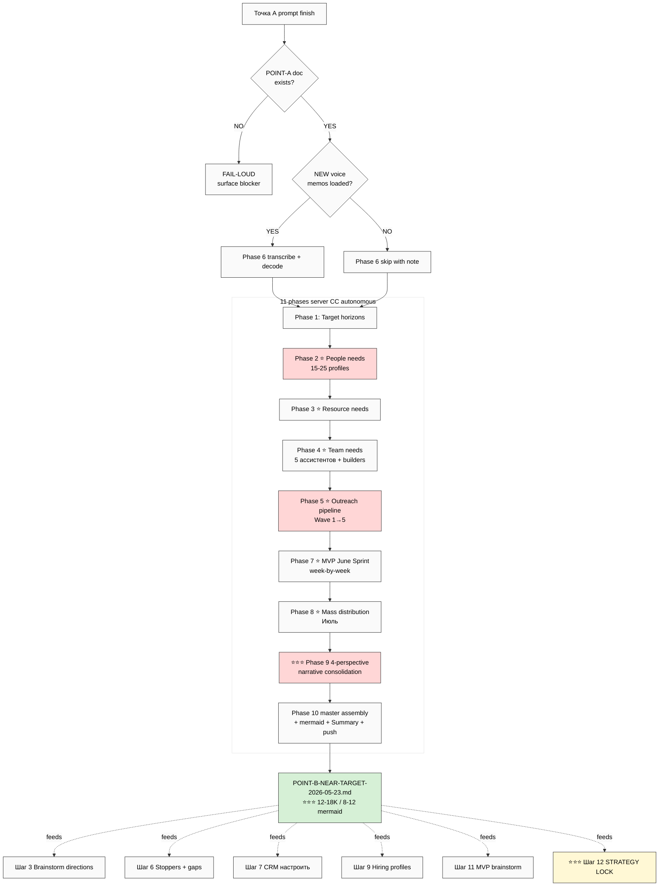

# 📋 EXPLAIN — Point B Near Target

## §1 Что у нас есть СЕЙЧАС (ДО запуска)

- Plan-of-Day 23.05 Шаг 2 = «Точка Б» (в Plan as bullet outline; не deep document)
- Strategic Plan §3 Wave 1 outreach detail (but partial)
- Economic Model V10 Q3 launch target
- AI Market PLAN Stage 1 thesis
- 14 Tier-1 ack queue (per CRM)
- Last processed voice = **audio_728** (22.05 17:40:59) — batch-11 closure
- Возможно есть новые voice memos audio_729+ (Ruslan загрузит)
- ⚠️ **Точка А prompt в очереди** — Точка Б sequential, ждёт его finish

---

## §2 Что делает этот prompt

**11 phases server CC autonomous** (6-10h / <€3 / per-phase commit + push) — после finish Точки А:

1. Reads `POINT-A-CURRENT-STATE-2026-05-23.md` (foundation)
2. Builds **target state описание** — куда Jetix идёт в ближайшее время
3. 4 horizons (1 неделя / 1 месяц / 3 месяца / 6 месяцев) с measurable indicators
4. Detailed people / resource / team / outreach needs
5. **Processes NEW voice memos** (audio_729+) если loaded — pool integration
6. MVP June Sprint week-by-week detail + Mass distribution Июль
7. 4-perspective narrative (Ruslan / partner / recruit / due-diligence)

→ выдаёт `POINT-B-NEAR-TARGET-2026-05-23.md` (~12-18K / 8-12 mermaid / 4 perspectives)

---

## §3 Что берёт на вход

| Input | Откуда |
|---|---|
| ⭐ **Точка А output** | `decisions/strategic/POINT-A-CURRENT-STATE-2026-05-23.md` (MUST exist) |
| Plan-of-Day 23.05 | `daily-logs/_PLAN-OF-DAY-2026-05-23.md` Шаг 2 |
| 4 LOCKED canonical | Method V2 / Strategic Plan / Economic Model V10 / AI Market PLAN |
| Partner Offering + Nav Guide | `PARTNER-OFFERING-HUMAN-LANG-2026-05-22.md` + Navigation Guide DRAFT |
| REFLECTION + Updated Plans + Wave 1 Outreach Package | All recent strategic substrate |
| CRM full | 169 contacts inventory |
| Action Plan + Distribution + Hypothesis Architecture | Strategic substrate |
| **NEW voice memos** (audio_729+) | `raw/voice-memos-2026-05-23-batch/` если loaded ДО launch |
| Memory rules | constitutional + max-density + breadth + research-pool + fpf-first + no-unsolicited |

---

## §4 Что обрабатывает (11 phases)

0. FPF lens scope + Точка А read + acceptance predicate (fail-loud если Точка А absent)
1. ⭐ Target horizons (1w / 1m / 3m / 6m) с measurable indicators + dependencies
2. ⭐ People needs — per-tier + per-role + 15-25 concrete profiles
3. ⭐ Resource needs — capital / time / tools / external services
4. ⭐ Team needs — 5 ассистентов + potential Layer 1 builders
5. ⭐ Outreach pipeline forward — Wave 1 → Wave 5 cascade с recipient-level detail
6. ⭐⭐ **NEW voice memos integration** — transcribe + 5-cell + FPF lens + decode + pool integration (audio_729+)
7. ⭐ MVP June Sprint week-by-week detail (Layer 1-3 + Polish)
8. ⭐ Mass distribution Июль target detail
9. ⭐⭐⭐ Consolidated Point B narrative — 4-perspective framing
10. Master assembly + 8-12 mermaid + Summary + final push

---

## §5 Что получим на выходе

| File | Что внутри |
|---|---|
| ⭐⭐⭐ `decisions/strategic/POINT-B-NEAR-TARGET-2026-05-23.md` | Main ~12-18K / 8-12 mermaid / 4 perspectives / 4 horizons |
| 10 phase reports | `reports/point-b-2026-05-23/00-09-*.md` |
| Diagrams INDEX | `reports/point-b-2026-05-23/diagrams/_INDEX.md` |
| Summary | `reports/point-b-2026-05-23/00-SUMMARY-FOR-RUSLAN.md` ≤1500w |
| New voice transcripts (если есть) | `raw/voice-transcripts/audio_729+.txt` + per-audio MDs |

**Visualizations (8-12 mermaid):**
- Target horizons gantt (1w/1m/3m/6m timeline)
- People needs hierarchy (per-tier + per-role)
- Resource flow (capital + time + tools + services)
- Team org chart (5 ассистентов + Layer 1 builders)
- Outreach wave cascade (Wave 1 → 5)
- MVP June Sprint week-by-week
- Mass distribution funnel (Июль)
- Point A → Point B delta (gap)
- Risk register heatmap
- New voice ideas pool integration (if applicable)

---

## §6 К чему ведёт

- **Direct input** для Шагов 3-12 Orientation Day (Brainstorm + Selection + Stoppers + CRM + Hiring + Pитч + MVP + Strategy Lock)
- **4-perspective framing** Phase 9 enables tailored Wave 1 message variants
- **MVP June Sprint detail** Phase 7 enables Шаг 11 brainstorm с concrete grounding
- **Outreach pipeline** Phase 5 enables Шаг 7 CRM настроить
- **People + Team + Resource needs** Phases 2-4 enable Шаг 9 Hiring profiles
- **New voice ideas** Phase 6 enriches Шаг 3 Brainstorm directions

---

## §7 Mermaid схема — sequence + flow



---

## §8 Sequential launch sequence (важно)

```
1. Точка А prompt finishes
2. Ruslan reviews POINT-A
3. Ruslan загружает новые voice memos в raw/voice-memos-2026-05-23-batch/ (если есть)
4. Cloud Cowork commits + push новые voice memos
5. Ruslan launches THIS prompt
6. Server CC reads POINT-A + processes new voice + builds POINT-B
7. Ruslan reviews POINT-B
8. Continues Шаги 3-12 Plan-of-Day
```

---

## §9 Дополнительные notes

- ⚠️ **Sequential**: НЕ запускать пока Точка А не done; иначе Phase 0 fail-loud halt
- ✅ Cost <€3 / 6-10h
- ✅ Per-phase commit + push = resumable
- ✅ Light-medium prompt → OK 1 parallel с другим light prompt (если RAM)
- ⚠️ **R1 final review needed** — после server CC finish, Ruslan review + corrections

---

## §10 Готов к launch?

Wait Точка А finish → review → загрузить новые voice (если есть) → push voice → ack «погнали Точка Б» → дам launch command.

---

*EXPLAIN closure 2026-05-23 evening. Sequential dependency Точка А explicit. Per `feedback_prompt_explanation_required.md`.*
