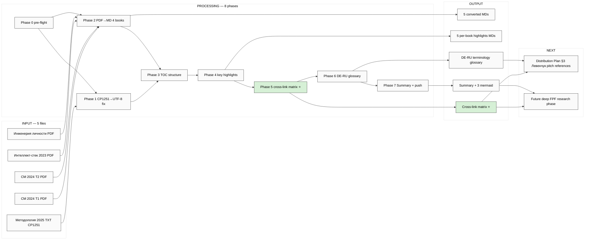

# EXPLAIN — Step 3 Левенчук Books Distillation

> **TL;DR.** Server CC autonomous: 4 PDF + 1 TXT (top-4 Левенчук newest editions) → conversion to MD + TOC extract + per-book key chapter highlights + cross-link matrix к Jetix substrate (3 K-6 Tier A wikis + Левенчук inventory v2 + 5 concept docs + Platform v2 + 6 K-research). Output: Summary + 5 per-book MDs + cross-link doc + DE-RU terminology glossary.

---

## §1 Что у нас есть СЕЙЧАС

**Vendored:**
- `raw/external/levenchuk-books-2026-05-20/` 5 файлов / ~17 MB:
  - Системное мышление 2024 Т1 (PDF, 3.55 MB) ⭐⭐
  - Системное мышление 2024 Т2 (PDF, 4.95 MB) ⭐⭐
  - Методология 2025 (TXT, CP1251, 1.23 MB) ⭐⭐
  - Интеллект-стек 2023 (PDF, 5.61 MB) ⭐
  - Инженерия личности 2023 (PDF, 1.74 MB)
- `raw/external/levenchuk-books-2026-05-20/00-INVENTORY.md`

**Sprint substrate cross-link target (READ-ONLY):**
- 3 K-6 Tier A wikis: `method-systems-thinking.md` / `jetix-as-exokortex.md` / `sense-of-measure-scientific-approach.md`
- K-4 Intellect-12-Component Audit summary
- K-6 Method of Systems Thinking deep research (31 components × 10 thinkers — direct lineage)
- Левенчук inventory v2 cross-link matrix (189 cells)
- 5 acked concept docs + Platform v2

**Missing (не блокирует):**
- Системная инженерия 2022 — defer
- Системный менеджмент 2023 — defer

---

## §2 Что делает prompt (одним абзацем)

Server CC autonomous: (a) **fix TXT encoding** Методология 2025 CP1251 → UTF-8 via `iconv`; (b) **PDF → MD conversion** для 4 PDF — используя `pdftotext` (poppler-utils) для plain text extraction (or `pymupdf` если pdftotext fails / quality issues); (c) **per-book MD structure** — TOC + chapter boundaries + key sections highlight; (d) **cross-link matrix к Jetix substrate** — 4 books × 8 Jetix sources (3 K-6 wikis + Левенчук inv v2 + 5 concept docs + Platform v2 + K-4/K-6 summaries); (e) **DE-RU terminology glossary** — Левенчук method terms cross-cite к 3 K-6 Tier A wikis (особенно method-systems-thinking 31 components mapping); (f) **summary + push**.

**НЕ делает:** Foundation modifications / Tier A auto-promote new wikis (это отдельный ack) / strategic prose authoring (R1) / deep philosophical analysis (это будущая deep FPF research phase); просто distillation + cross-link surface.

---

## §3 Что берёт на вход

- 5 файлов в `raw/external/levenchuk-books-2026-05-20/`
- INVENTORY: `raw/external/levenchuk-books-2026-05-20/00-INVENTORY.md`
- Cross-link target:
  - `wiki/concepts/method-systems-thinking.md`
  - `wiki/concepts/jetix-as-exokortex.md`
  - `wiki/concepts/sense-of-measure-scientific-approach.md`
  - `research/method-systems-thinking-deep-2026-05-19/99-SUMMARY-FOR-RUSLAN.md` (K-6)
  - `research/intellect-12-component-audit-2026-05-19/99-SUMMARY-FOR-RUSLAN.md` (K-4)
  - `research/levenchuk-corpus-inventory-v2-2026-05-19-evening/04-cross-link-к-jetix-substrate.md`
  - 5 concept docs F2
  - Platform v2 §6 + §7

---

## §4 8 phases

| # | Phase | Time | Commit |
|---|---|---|---|
| 0 | Pre-flight + INVENTORY read + verify all 5 files | 5m | `[step-3-lev] Phase 0 pre-flight` |
| 1 | TXT encoding fix Методология 2025 CP1251→UTF-8 + sanity check | 5-10m | `[step-3-lev] Phase 1 txt encoding fix` |
| 2 | PDF → MD conversion 4 books (pdftotext primary; pymupdf fallback) | 15-20m | `[step-3-lev] Phase 2 PDF→MD conversion 4 books` |
| 3 | Per-book TOC extract + chapter boundaries | 10-15m | `[step-3-lev] Phase 3 TOC + chapter structure` |
| 4 | Per-book key chapter highlights (top 3-5 per book) — NOT deep, just surface | 20-30m | `[step-3-lev] Phase 4 key chapter highlights` |
| 5 | Cross-link matrix 4 books × 8 Jetix sources | 15-20m | `[step-3-lev] Phase 5 cross-link matrix` |
| 6 | DE-RU terminology glossary (Левенчук terms cross-cite к 3 K-6 wikis) | 10-15m | `[step-3-lev] Phase 6 terminology glossary` |
| 7 | Summary + Daily Log §APPEND + push | 10m | `[step-3-lev] Phase 7 Summary + push` |

**Total: ~90-120 min server CC autonomous; <€2 cost (built-in tools только, no external API).**

---

## §5 Что получим на выходе

**Converted MDs (full text extraction):**
```
raw/external/levenchuk-books-2026-05-20/converted/
├── 01-sistemnoe-myishlenie-2024-tom-1.md
├── 02-sistemnoe-myishlenie-2024-tom-2.md
├── 03-metodologiya-2025.md (CP1251→UTF-8 fixed)
├── 04-intellekt-stek-2023.md
└── 05-injeneriya-lichnosti.md
```

**Distillation outputs:**
```
research/levenchuk-books-distillation-2026-05-20/
├── 00-SUMMARY-FOR-RUSLAN.md (entry ≤1000w)
├── 01-sistemnoe-myishlenie-2024-tom-1-toc-highlights.md
├── 02-sistemnoe-myishlenie-2024-tom-2-toc-highlights.md
├── 03-metodologiya-2025-toc-highlights.md
├── 04-intellekt-stek-2023-toc-highlights.md
├── 05-injeneriya-lichnosti-toc-highlights.md
├── 06-cross-link-к-jetix-substrate.md (matrix 4 books × 8 sources)
├── 07-DE-RU-terminology-glossary.md (~30-50 entries)
└── diagrams/
    ├── 01-corpus-overview.md
    ├── 02-cross-link-к-substrate.md
    └── 03-chapter-priority-heatmap.md (per-chapter importance for next deep FPF phase)
```

---

## §6 Что НЕ delivers (preserved для будущих phases)

- ❌ Deep philosophical FPF analysis — это **next FPF deep research run** (отдельный prompt после Step 3 review)
- ❌ Tier A wiki auto-promotion из book content — Ruslan acks per concept
- ❌ Foundation modifications — preserve untouched
- ❌ 16 transdisciplines × Jetix 12-component detailed mapping — for FPF deep
- ❌ Strategic prose authoring (R1)

---

## §7 К чему ведёт

После Step 3:
1. **4 books processed → MD readable** в repo
2. **Cross-link matrix** показывает где Левенчук overlap с Jetix substrate / где gaps
3. **DE-RU glossary** = terminology bridge для использования в pitches (KA-01 Левенчук pitch via canonical terms)
4. **Substrate ready для deep FPF research** (next phase per Левенчук inventory v2 §3.4)
5. **KA-01 Левенчук pitch (Distribution Plan §3)** может использовать concrete book references

---

## §8 Mermaid



---

## §9 Constitutional posture

- **R1 surface.** Brigadier-scribe distillation; verbatim quotes preserved
- **R2.** No Foundation modifications; new namespace `research/levenchuk-books-distillation-2026-05-20/` + `raw/.../converted/`
- **R6 provenance.** Per-extract `[src: book.pdf page N]` или `[src: chapter X]`
- **R11.** No novel actions; discovery + distillation only
- **EP-5 F-grade.** F2 verbatim extraction; F2-F3 commentary
- **Append-only.** Original PDFs/TXT untouched
- **Russian primary** в всех outputs

---

## §10 Cost + runtime

- Runtime: ~90-120 min server CC autonomous
- Cost: <€2 (built-in tools — pdftotext + iconv + Read/Write only, no external API)
- Per-phase commit cadence preserves recoverability

---

*EXPLAIN closure 2026-05-20. Ruslan acked 2026-05-20 «обработай это всё на сервере, переведи в md удобненько». Per memory `feedback_prompt_explanation_required.md`.*
