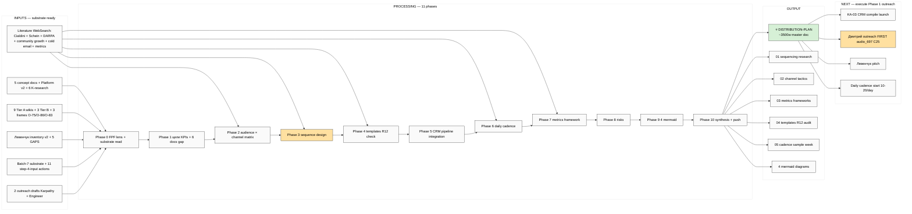

# EXPLAIN — Step 4 Distribution Plan

> **TL;DR.** Server CC autonomous draft Distribution Plan (главный strategic outreach roadmap) + research arms (outreach sequencing literature / channel tactics / metrics frameworks). Output: master DISTRIBUTION-PLAN doc + 4 research support docs + 4 mermaid. Substrate для Phase 1 outreach launch (cascade 150 → 15 → 1M).

---

## §1 Что у нас есть СЕЙЧАС (substrate готов на 100%)

**Sprint 16-19.05 substrate (READ-ONLY references):**
- 5 acked concept docs F2 (Hackathon Platform / Recursive Engine / System Merger / Outreach Scalable / Education Layer)
- Platform v2 (22 people Tier-1 / 32 resources / 15 monetization / **20 outreach templates** в §20)
- 6 K-research deep (особенно K-2 AGI Reception PITCH-BLOCKING + K-6 Method)
- **9 Tier A wikis** включая 3 NEW frames для outreach:
  - **O-75 Pre-existing Partnership Positioning** ⭐⭐ canonical baseline
  - **O-86 Project-of-Humanity Positioning** ⭐ humanitarian frame
  - **O-83 Cheat-code Positioning** template idea (R12 paired discipline)
- 3 Tier B wikis (intellect-5-skills / trichotomy / supportive-control)
- Левенчук inventory v2 (5 GAPS surface + cross-link к 8 substrate sources)
- Batch-7 substrate: 16 Key Actions (11 step-4-input) + 24 candidates + 9 NEW DR + Pool documents
- Sprint-Synthesis-v2 Doc 4 — Master Packaging Step 6 roadmap (parent context)
- 2 outreach drafts (Karpathy + Engineer cohort)

**Pending separately (НЕ блокирует этот run):**
- KA-03 CRM compile prompt — SAVED, можно запустить parallel в другом tmux
- Левенчук books distillation — PENDING материал; будет следующим шагом

---

## §2 Что делает этот prompt (одним абзацем)

Server CC автономно: (a) **read sprint substrate** (8 sources) + Левенчук inventory v2; (b) **research arms** — distill literature по outreach sequencing (Cialdini «Influence» + Schein process consultation + community-led growth research + DARPA cohort cascade + Reichheld NPS) + channel-specific tactics (cold email / Twitter / Telegram DM / podcast / IRL events) + metrics frameworks (CRM funnel mechanics / HubSpot/Salesforce literature / referral measurement); (c) **design master Distribution Plan** с 8 sections: цели+KPIs / 6 promotion docs status / Audience × channel matrix / Sequence (Дмитрий → Левенчук → cascade per audio_697 C25) / Templates usage rules (O-75/O-86/O-83/O-94 + Platform v2 §20) / CRM pipeline integration (per-contact action mapping linking к KA-03 output future) / Daily cadence schedule (sample week) / Metrics framework + risks; (d) **R12 paired-frame discipline** enforced во всех templates; (e) **4 mermaid diagrams** (audience matrix / sequence diagram / funnel / cadence calendar); (f) **5 supporting research docs** в `reports/distribution-plan-research-2026-05-20/`; (g) **synthesis + push**.

**НЕ делает:** auto-launch outreach (тут только plan, execution отдельно) / paid content download / Foundation modifications / strategic prose authoring beyond brigadier scribe (R1 — Ruslan acks final draft) / KA-03 CRM compile (отдельный prompt, parallel launch если хочешь).

---

## §3 Что берёт на вход

**Sprint substrate (READ-ONLY):**
- `decisions/strategic/JETIX-*-2026-05-18.md` x5 (concept docs)
- `reports/jetix-platform-v2-2026-05-19/` + §20 outreach templates
- `research/{agi-reception-market,method-systems-thinking,...}-deep-2026-05-19/` x6 K-research summaries
- `wiki/concepts/{pre-existing-partnership-positioning,project-of-humanity-positioning,...}.md` (9 Tier A + 3 Tier B)
- `wiki/ideas/cheat-code-positioning.md`
- `research/levenchuk-corpus-inventory-v2-2026-05-19-evening/`
- `reports/voice-pipeline-2026-05-20-batch-7/{06-key-actions-list.md,05-candidates-3-buckets.md,_FULL-DIGEST,_RESEARCH-CANDIDATES-POOL}.md`
- `reports/sprint-synthesis-v2-2026-05-19-evening/04-master-packaging-step6-roadmap.md` (parent)
- `outreach/karpathy-outreach-pack-2026-05-19.md` + `outreach/engineer-cohort-outreach-script-2026-05-19.md` (existing drafts)
- `prompts/ka-03-crm-first-pass-100-2026-05-20.md` (CRM linkage reference)

**Research arms — WebSearch + WebFetch (literature):**
- Cialdini «Influence: Science and Practice» (6 principles)
- Schein «Process Consultation» (helping relationship)
- DARPA program manager outreach mechanics
- Community-led growth literature (open-source + creator economy)
- Cold email tactics (modern playbooks)
- Twitter/Telegram outreach research
- Referral / NPS measurement (Reichheld)
- CRM funnel mechanics

---

## §4 11 phases

| # | Phase | Time | Commit |
|---|---|---|---|
| 0 | Pre-flight + FPF lens scope + read all substrate (8 sources) | 10m | `[step-4-dp] Phase 0 FPF lens + substrate read` |
| 1 | Цели + KPIs + 6 promotion docs gap analysis (что готово / что нужно) | 10-15m | `[step-4-dp] Phase 1 цели KPIs + 6 docs gap` |
| 2 | Audience × channel matrix research + design (literature distill + custom для Jetix) | 15-20m | `[step-4-dp] Phase 2 audience × channel matrix` |
| 3 | Sequence design Дмитрий → Левенчук → cascade (per audio_697 C25 + sequencing literature) | 10-15m | `[step-4-dp] Phase 3 sequence design + literature` |
| 4 | Templates usage review (O-75/O-86/O-83/O-94 + Platform v2 §20 + R12 paired discipline) | 10-15m | `[step-4-dp] Phase 4 templates review + R12 check` |
| 5 | CRM pipeline integration design (per-contact action mapping + KA-03 linkage) | 10-15m | `[step-4-dp] Phase 5 CRM pipeline integration` |
| 6 | Daily cadence schedule + sample week walkthrough (10-20 touches/day) | 10-15m | `[step-4-dp] Phase 6 daily cadence sample week` |
| 7 | Metrics framework + measurement protocol (response rate / conversion / amplification factor) | 10m | `[step-4-dp] Phase 7 metrics framework` |
| 8 | Risks + mitigations + R12 paired-frame enforcement check | 5-10m | `[step-4-dp] Phase 8 risks + R12 check` |
| 9 | 4 mermaid diagrams (audience matrix / sequence / funnel / cadence calendar) | 10-15m | `[step-4-dp] Phase 9 4 mermaid diagrams` |
| 10 | Synthesis + DISTRIBUTION-PLAN master doc + Summary + push | 15m | `[step-4-dp] Phase 10 master doc + Summary + push` |

**Total: ~120-150 min server CC autonomous; <€3.5 (WebSearch/WebFetch + analysis).**

---

## §5 Что получим на выходе

**Master doc:**
- `decisions/strategic/DISTRIBUTION-PLAN-2026-05-20.md` (~3500w + 4 mermaid) ⭐ — primary deliverable

**Supporting research docs:**
```
reports/distribution-plan-research-2026-05-20/
├── 00-SUMMARY-FOR-RUSLAN.md (≤800w entry)
├── 01-outreach-sequencing-research.md (Cialdini + Schein + DARPA + community-led growth literature distill)
├── 02-channel-tactics-research.md (cold email / Twitter / Telegram / podcast / IRL — per-channel tactics)
├── 03-metrics-frameworks-research.md (CRM funnel + NPS + amplification measurement)
├── 04-templates-review-r12-check.md (3 frames + Platform v2 §20 + R12 paired-frame audit)
├── 05-cadence-schedule-sample-week.md (week walkthrough with daily 10-20 touches example)
└── diagrams/
    ├── 01-audience-channel-matrix.md
    ├── 02-sequence-дмитрий-левенчук-cascade.md
    ├── 03-outreach-funnel.md
    └── 04-cadence-calendar.md
```

**Plus modifications (append-only):**
- `daily-logs/_DAILY-LOG-2026-05-20.md` §APPEND step-4 execution log
- `reports/phase-0-fpf-scope/01-jetix-objects-inventory.md` §APPEND if new candidates surface

**Master doc structure (3500w breakdown):**
- §0 TL;DR + цели KPIs
- §1 6 promotion docs status (C.1-C.6 gap analysis)
- §2 Audience × channel matrix
- §3 Sequence (Дмитрий → Левенчук → cascade 150→15→1M)
- §4 Templates usage rules per audience с R12 paired discipline
- §5 CRM pipeline integration (per-contact action mapping)
- §6 Daily cadence schedule (sample week)
- §7 Metrics framework
- §8 Risks + mitigations
- §9 Constitutional posture preserved (R1/R6/R11/R12/IP-1/EP-5/AP-6)
- §10 Cross-link к substrate
- §11 Next steps (KA-03 launch / first outreach wave / metrics measurement)

---

## §6 К чему ведёт

После завершения этого run:
1. **Distribution Plan = strategic master doc** для всего outreach effort
2. **Research arms = knowledge base** для conversation depth («больше до информации для общения, наработанных стратегий» per Ruslan)
3. **Готовность к launch Phase 1 outreach** — после Ruslan ack + KA-03 CRM compile + Левенчук books (optional context enrichment)

**Sequence per Ruslan voice 2026-05-20:**
1. ← Сейчас (этот run) — Distribution Plan draft
2. Параллельно — Левенчук books distillation (Step 3) если материал есть
3. KA-03 CRM compile (parallel или после)
4. После 3 готовы — execute Phase 1 outreach Дмитрий first

---

## §7 Mermaid (для этого EXPLAIN doc)



---

## §8 Constitutional posture

- **R1 surface.** Brigadier-scribe draft + research synthesis; strategic prose finalization = Ruslan ack on master doc before any outreach execution
- **R2.** No Foundation modifications; new namespace `reports/distribution-plan-research-2026-05-20/` + `decisions/strategic/DISTRIBUTION-PLAN-2026-05-20.md`
- **R6 provenance.** Per-claim citation (substrate cross-ref / literature source / Platform v2 §X)
- **R11 Default-Deny.** No novel actions launched; this = plan only, execution = separate ack
- **R12 anti-extraction.** Paired-frame discipline (offer + ask) enforced во всех templates §4; explicit R12 audit per template variant
- **EP-5 F-grade.** F2-F3 surface; verbatim Ruslan voice anchors preserved где applicable
- **AP-6 dissent preservation.** O-88 anti-tiered universalism documented as future-direction; current Platform v2 §6 segmentation operational
- **IP-1 STRICT.** Roles abstract; executor binding = Ruslan-as-instance (sole strategist)
- **SKIP-list integrity.** O-62/O-66/O-67/O-68 НЕ surfaced

---

## §9 Cost + runtime

- Runtime: ~120-150 min server CC autonomous
- Cost: <€3.5 (WebSearch/WebFetch heavier than batch-7 + analysis time)
- Per-phase commit + push cadence preserves recoverability

---

## §10 Trigger для launch

Ruslan acked 2026-05-20: «как раз можем уже пишешь prompt да давай это сразу запустим и только это запустим». Per `feedback_cowork_can_push.md` — explicit launch ack.

После Cloud Cowork commit+push prompt:
1. Ruslan в Claude Code на server (VS Code Remote SSH session) paste'aет launch text
2. Server CC autonomous executes 11 phases
3. ~2-2.5h позже — Distribution Plan ready

**Parallel:** Ruslan может started Левенчук books handoff в это время (Step 3) для следующего prompt.

---

*EXPLAIN closure 2026-05-20. Ready для launch. Per memory `feedback_prompt_explanation_required.md` enforced.*
