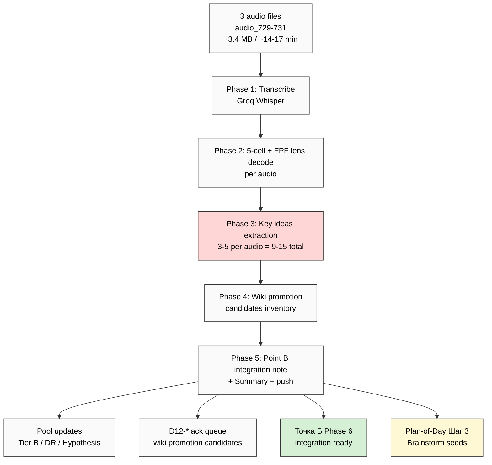

# 📋 EXPLAIN — Voice Batch-12 QUICK

## §1 Что у нас есть СЕЙЧАС

- ✅ 3 audio files copied + renamed в `raw/voice-memos-2026-05-23-batch/`:
  - `audio_729@23-05-2026_18-50-30.ogg` (210K)
  - `audio_730@23-05-2026_18-50-35.ogg` (1.4M)
  - `audio_731@23-05-2026_18-50-40.ogg` (1.8M)
- Total ~3.4 MB / ~14-17 min audio
- Last processed: audio_728 (batch-11 closure)
- Точка А prompt running на сервере
- Точка Б prompt waiting на Точку А

---

## §2 Что делает этот prompt

**6 phases server CC autonomous** (1-2h LIGHT / <€1 / per-phase commit + push):
- Transcribe via Groq Whisper
- Per-audio 5-cell + FPF lens decode
- Extract 3-5 key ideas per audio (9-15 total)
- Surface pool candidates (Tier B / DR / Hypothesis)
- Surface wiki promotion suggestions
- Prepare integration note для Точка Б

**Mode: QUICK** — НЕ full 17-lens cross-analysis batch (тот = 6-10h). Speed > depth.

→ выдаёт integration-ready substrate для Точки Б Phase 6 + Plan-of-Day Шаг 3 brainstorm

---

## §3 Что берёт на вход

| Input | Откуда |
|---|---|
| 3 audio files | `raw/voice-memos-2026-05-23-batch/audio_729..731@*.ogg` |
| Last processed reference | audio_728 batch-11 |
| Pool current state | Tier B 73 / DR 38 / Hypothesis 33 |
| 13 LOCKED items preservation list | Substrate |
| Plan-of-Day 23.05 | `daily-logs/_PLAN-OF-DAY-2026-05-23.md` (context) |
| REFLECTION-INBOX recent | §APPEND-batch-10 + 11 |
| Memory rules | constitutional + research-pool + breadth + fpf-first + no-unsolicited |

---

## §4 Что обрабатывает (6 phases)

0. Pre-flight + inventory check
1. Transcribe 3 audio (Groq Whisper)
2. Per-audio 5-cell + FPF lens decode (verbatim + decode)
3. Key ideas extraction + pool candidates surface (3-5 per audio)
4. Wiki promotion candidates inventory (D12-* ack queue)
5. Point B integration note + Summary + final push

---

## §5 Что получим на выходе

| File | Что внутри |
|---|---|
| 3 transcripts | `raw/voice-transcripts/audio_729+.txt` |
| 3 per-audio MDs | `raw/voice-memos-2026-05-23-batch/audio_729+@*.md` |
| `01-per-note-breakdown.md` | 5-cell per audio = 15 datapoints |
| `02-key-ideas-pool-candidates.md` | 9-15 key ideas + suggested pool destinations |
| `03-wiki-promotion-candidates.md` | Wiki promotion suggestions (Tier A NEW / §APPEND existing / Tier B only) |
| `04-point-b-integration-note.md` | Note для Точка Б Phase 6 |
| `00-SUMMARY-FOR-RUSLAN.md` | ≤500w summary |
| REFLECTION-INBOX §APPEND-batch-12-quick | D12-* ack queue |

---

## §6 К чему ведёт

- **Feeds Точка Б Phase 6** — новые ideas integrated в Near Target description когда Точка Б runs
- **Feeds Plan-of-Day Шаг 3 Brainstorm directions** — новые idea seeds для direction generation
- **Pool additions** — Tier B / DR / Hypothesis pools обновлены
- **Wiki promotion D12-* ack queue** — surface для potential next-batch decisions
- **Continuity** — sequence audio_728 → 729-731 preserved

---

## §7 Mermaid flow

---

## §8 Дополнительные notes

- ⚠️ **NOT full batch-12 deep** — этот = QUICK; full deep можно сделать later если решишь
- ✅ Light prompt → OK parallel с Точка А (если ещё running) ИЛИ standalone
- ✅ Cost <€1 / 1-2h
- ✅ Per-phase commit = resumable
- ✅ Pool result only — никаких auto-promotion / auto-launch

---

## §9 Готов к launch?

После ack «погнали batch-12 quick» → дам launch command.

---

*EXPLAIN closure 2026-05-23. Per `feedback_prompt_explanation_required.md`.*
