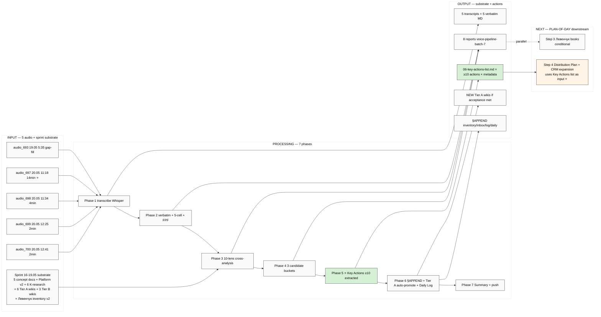

# EXPLAIN — Voice Batch-7 Deep Analysis

> **TL;DR.** Per PLAN-OF-DAY 2026-05-20 Step 1+2 — 5 new voice notes (1 gap-fill 19.05 + 4 fresh 20.05) → 10-lens analysis → 3 bucket candidates + Tier A wiki auto-promote + **key actions extraction embedded** (≥10 actionable per идея/инсайт с owner/dep/priority/cross-link). Substrate для Step 4 distribution plan + CRM expansion.

---

## §1 Что у нас есть СЕЙЧАС

**Уже processed (batch-4/5/6):**
- audio_682-687 (batch-4, 18-19.05 morning) — KEYSTONE: Engineer Workshop STOPPER / 1M-$1B-100M targets
- audio_689-691 + text_010-014 (batch-5, 19.05 morning-afternoon) — AGI redefinition + Method-Systems-Thinking + 6 K-research substrate
- audio_694-696 (batch-6, 19.05 evening) — FPF-vocabulary anchor + Mastery formula + Persistence>Talent (3 Tier A wikis created)

**Vendored этим Cloud Cowork run (9 audio = 5 gap-fill 18-19.05 + 4 fresh 20.05):**
- `raw/voice-memos-2026-05-19-batch/audio_680@18-05-2026_02-42-57.ogg` (2min — gap-fill pre-batch-4)
- `raw/voice-memos-2026-05-19-batch/audio_681@18-05-2026_06-04-03.ogg` (14min ⭐ — gap-fill pre-batch-4)
- `raw/voice-memos-2026-05-19-batch/audio_688@19-05-2026_01-43-13.ogg` (9min — gap-fill between batch-4 audio_687 + batch-5 audio_689)
- `raw/voice-memos-2026-05-19-batch/audio_692@19-05-2026_04-49-13.ogg` (4min — gap-fill between batch-5 audio_691 + audio_693)
- `raw/voice-memos-2026-05-19-batch/audio_693@19-05-2026_05-35-29.ogg` (5.5min — gap-fill before batch-6 audio_694)
- `raw/voice-memos-2026-05-20-batch/audio_697@20-05-2026_11-18-43.ogg` (14min) ⭐
- `raw/voice-memos-2026-05-20-batch/audio_698@20-05-2026_11-34-20.ogg` (4min)
- `raw/voice-memos-2026-05-20-batch/audio_699@20-05-2026_12-25-19.ogg` (2min)
- `raw/voice-memos-2026-05-20-batch/audio_700@20-05-2026_12-41-50.ogg` (2min)

**Total NEW:** 9 audio ≈ 56 min / 11.9 MB.

**Sprint 16-19.05 substrate cross-link (READ-ONLY):**
- Foundation v1.0 / Pillar C / 8 Octagon LOCK / shared/schemas / VISION-FUNDAMENTAL
- 5 acked concept docs F2 (Hackathon Platform / Recursive Engine / System Merger / Outreach Scalable / Education Layer)
- Platform v2 (22 people / 32 resources / 15 monetization / 20 outreach templates)
- 6 K-research deep summaries (K-1..K-6)
- 6 NEW Tier A wikis (3 K-6 + 3 batch-6)
- 3 NEW Tier B wikis (O-65/O-70/O-71)
- Левенчук inventory v2 (cross-link matrix + 5 GAPS surfaced)
- Sprint-Synthesis-v2 (4 docs + 10 mermaid; Master Packaging Step 6 roadmap)

---

## §2 Что делает этот prompt

Server CC автономно: (a) **transcribe** 5 audio через Groq Whisper (`tools/transcribe.py` pattern); (b) **verbatim extract + 5-cell analysis + FPF lens** per audio; (c) **10-lens cross-analysis** (FPF Phase 0 / 5 concept docs / 5 deep research / batch-4-5-6 cross-refs / Platform v2 / 6 K-research / 3 K-6 Tier A wikis / 3 batch-6 Tier A wikis / 3 batch-6 Tier B wikis / Левенчук inventory v2 + Sprint-Synthesis-v2 — full integration); (d) **3 candidate buckets** surface (Tier A/B/C wikis + Phase 1 plan additions + NEW DR candidates) per batch-5/6 pattern; (e) **Key actions extraction embedded** Phase 5 — actionable items per идея/инсайт с owner/dep/priority/time/cross-link (≥10 actions; per PLAN-OF-DAY Step 2 explicit); (f) **§APPEND** inventory §26 + REFLECTION-INBOX + wiki/log + Daily Log §APPEND; (g) **Tier A auto-promote** wikis where acceptance criteria met (verbatim Ruslan voice anchor + cross-batch corroboration); (h) **Summary + push**.

**НЕ делает:** Foundation modifications (R2) / strategic prose authoring (R1 — Ruslan-only) / автономный LOCK / paid content access / Octagon expansion decisions (Ruslan acks).

---

## §3 Что берёт на вход

- 5 audio files (vendored этим run)
- Memory rules: `feedback_fpf_lens_first.md` / `feedback_breadth_not_selection.md` / `feedback_no_unsolicited_alternatives.md`
- `daily-logs/_PLAN-OF-DAY-2026-05-20.md` — for Step 2 key-actions integration
- Batch-4/5/6 substrate (all 7 reports per voice-pipeline-2026-05-19-batch-N)
- Master Map + Sprint-Synthesis-v2 (cross-link target)
- 6 Tier A wikis K-6 + batch-6 (target Tier A wiki cross-cite)
- Левенчук inventory v2 (cross-link substrate)
- 5 acked concept docs / Platform v2 (cross-link target)
- `tools/transcribe.py` (Groq Whisper) — transcription stage

---

## §4 7 phases

| # | Phase | Time | Commit |
|---|---|---|---|
| 1 | Transcribe 9 audio via Groq Whisper | 10-15m | `[voice-pipeline][batch-7] Phase 1 transcribe 9 audio files` |
| 2 | Verbatim + 5-cell + FPF lens per audio | 20-30m | `[voice-pipeline][batch-7] Phase 2 verbatim + 5-cell + FPF lens` |
| 3 | 10-lens cross-analysis (full sprint substrate) | 20-25m | `[voice-pipeline][batch-7] Phase 3 10-lens cross-analysis (90 datapoints)` |
| 4 | 3 candidate buckets (wiki + Phase 1 plan + DR) | 10-15m | `[voice-pipeline][batch-7] Phase 4 3 candidate buckets + NEW DR` |
| 5 ⭐ | **Key Actions extraction** ≥10 (per PLAN Step 2) — actionable items с per-action metadata | 15-20m | `[voice-pipeline][batch-7] Phase 5 ⭐ key actions ≥10 extracted` |
| 6 | §APPEND inventory + REFLECTION-INBOX + Tier A wiki auto-promote + Daily Log §APPEND | 10-15m | `[voice-pipeline][batch-7] Phase 6 §APPEND inventory/inbox + wiki Tier A + daily log` |
| 7 | Summary for Ruslan + final push | 10m | `[voice-pipeline][batch-7] Phase 7 Summary + final push` |

**Total: ~95-130 min server CC autonomous; <€4.5 (vision N/A; audio transcription + analysis).**

---

## §5 Что получим на выходе

```
raw/voice-transcripts/
├── audio_693@19-05-2026_05-35-29.txt
├── audio_697@20-05-2026_11-18-43.txt
├── audio_698@20-05-2026_11-34-20.txt
├── audio_699@20-05-2026_12-25-19.txt
└── audio_700@20-05-2026_12-41-50.txt

raw/voice-memos-2026-05-19-batch/
└── audio_693@19-05-2026_05-35-29.md  (verbatim + 5-cell)

raw/voice-memos-2026-05-20-batch/
├── audio_697@20-05-2026_11-18-43.md
├── audio_698@20-05-2026_11-34-20.md
├── audio_699@20-05-2026_12-25-19.md
└── audio_700@20-05-2026_12-41-50.md

reports/voice-pipeline-2026-05-20-batch-7/
├── 00-MASTER-INDEX.md
├── 00-SUMMARY-FOR-RUSLAN.md (≤1500w)
├── 01-per-note-breakdown.md (5-cell × 5 audio = 25 cell analyses)
├── 02-fpf-lens-jetix-track.md
├── 03-10-lenses-cross-analysis.md
├── 04-detailed-work-plan.md
├── 05-candidates-3-buckets.md (Tier A/B/C + Phase 1 + NEW DR)
└── 06-key-actions-list.md ⭐ NEW (≥10 actions × metadata; PLAN-OF-DAY Step 2)

wiki/concepts/<new-Tier-A-slugs>.md (если acceptance met)
wiki/claims/<new-Tier-A-claim-slugs>.md

§APPEND (existing files):
- reports/phase-0-fpf-scope/01-jetix-objects-inventory.md (§26)
- decisions/REFLECTION-INBOX-2026-05-16.md (§APPEND batch-7)
- wiki/log.md (Tier A promotion entries)
- daily-logs/_DAILY-LOG-2026-05-20.md (§N §APPEND — create if not exists)
```

---

## §6 Key Actions Phase 5 — special (PLAN-OF-DAY Step 2 integration)

**Difference от batch-6:** Batch-6 surface'нул 30 items в 3 buckets но без explicit **key actions list** form. Batch-7 adds Phase 5 specifically:

Per action format:
```markdown
### KA-<N> — <Action title>
- **Source:** [audio_NNN claim N / batch-X cross-ref / canonical doc]
- **Owner:** Ruslan / Cloud Cowork / Server CC autonomous
- **Dependency:** what must be ready first (e.g., notebook content done / Левенчук material received / X concept doc §APPEND)
- **Priority:** P1 / P2 / P3
- **Time estimate:** brigadier substrate (min) / Ruslan strategic prose (variable)
- **Cross-link:** {concept doc / Platform v2 / K-research / wiki / Левенчук inventory}
- **Acceptance:** what «done» looks like
- **Risk / blocker:** if any
```

Surface ≥10 actions. Server CC ranks by priority (P1/P2/P3) and provides dependency map. NOT selection — surface ALL surfaced; let Ruslan pick execution order.

**Cross-link к Step 4 distribution plan (PLAN-OF-DAY):** Key actions for outreach / promotion / CRM expansion get tagged `[step-4-input]` для downstream synthesis.

---

## §7 Mermaid



---

## §8 Constitutional

- R1 surface (no strategic prose / Ruslan = sole strategist)
- R2 Foundation read-only (only §APPEND voice substrate)
- R6 provenance per claim (`[src: audio_NNN claim N]`)
- R11 Default-Deny (no novel actions; SKIP-list O-62/O-66/O-67/O-68 honored если повторно surfaced)
- R12 anti-extraction (check per any monetization/distribution claim)
- IP-1 STRICT (substrate ≠ instance; роли abstract)
- EP-5 F-grade (F2 surface; verbatim quotes F2 R-high; синтез F2 R-medium)
- FPF lens FIRST (Phase 0 mandatory)
- Breadth NOT selection (5 audio = full corpus; key actions = list, не top-3 pick)
- Append-only (no canonical modifications)
- AP-6 dissent preservation (if Ruslan surface conflicting positions across audio — preserve both)

---

## §9 Cost

- Groq Whisper transcription: ~€0.10-0.20 (5 audio × ~5min avg)
- Claude analysis Phases 2-7: ~€2-3
- **Total estimate: <€3.5**
- Runtime: ~75-105 min autonomous
- Per-phase commit cadence preserves recoverability

---

*EXPLAIN closure 2026-05-20. Per memory `feedback_prompt_explanation_required.md` — EXPLAIN before launch enforced. Ruslan acked execute.*
