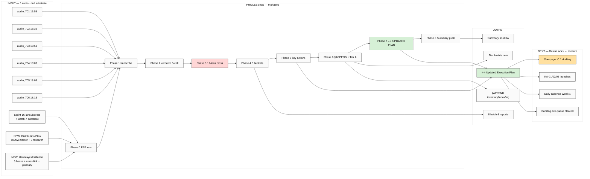

# EXPLAIN — Voice Batch-8 Deep Analysis + Updated Plan

> **TL;DR.** 6 NEW audio (audio_701-706, 20.05 afternoon 15:58→18:13) → deep analysis + **updated execution plan synthesis** based on **all just-completed substrate** (Distribution Plan Step 4 + Левенчук Books Distillation Step 3 + previous PLAN-OF-DAY). Output: standard 8-phase batch + Phase 8 «updated plan» integrating all NEW substrate + ack-pending queue + immediate-actionable items + research pool extensions.

---

## §1 Что у нас есть СЕЙЧАС

**Полный sprint substrate (READ-ONLY для batch-8 cross-link):**

**Sprint 16-19.05:**
- Foundation v1.0 + 8 Octagon LOCK + 5 acked concept docs F2 + Platform v2 + 6 K-research deep
- 9 Tier A wikis + 3 Tier B wikis (batch-6) + 3 batch-7 wikis (partnership / mastery / persistence) + 2 batch-7-fixation wikis (cheat-code / project-humanity)
- Sprint-Synthesis-v2 (4 docs + 10 mermaid) + Master Map

**Sprint 20.05 today (JUST COMPLETED):**
- **Step 3 Левенчук Books Distillation** — 5 converted MDs (~78K lines / ~10 MB UTF-8) + 5 per-book TOC+highlights + cross-link matrix 5 books × 8 Jetix sources + DE-RU glossary 40 entries + 3 mermaid + Summary
- **Step 4 Distribution Plan** — `decisions/strategic/DISTRIBUTION-PLAN-2026-05-20.md` ~5000w + 5 research docs (sequencing / channels / metrics / templates R12 audit / cadence) + 4 mermaid

**Batch-7 substrate (12:02 today):**
- 9 audio analysed → 16 Key Actions + 24 candidates + 9 NEW DR
- 12 D7-* decisions resolved (4 ack walkthrough)
- Pool documents created (research + Tier B)
- KA-03 CRM compile prompt SAVED (not launched)

**Vendored этим Cloud Cowork run:**
- `raw/voice-memos-2026-05-20-batch/audio_701@20-05-2026_15-58-28.ogg` (1.05 MB)
- `raw/voice-memos-2026-05-20-batch/audio_702@20-05-2026_16-35-24.ogg` (1.94 MB)
- `raw/voice-memos-2026-05-20-batch/audio_703@20-05-2026_16-53-02.ogg` (0.53 MB)
- `raw/voice-memos-2026-05-20-batch/audio_704@20-05-2026_18-03-17.ogg` (0.52 MB)
- `raw/voice-memos-2026-05-20-batch/audio_705@20-05-2026_18-08-53.ogg` (0.56 MB)
- `raw/voice-memos-2026-05-20-batch/audio_706@20-05-2026_18-13-09.ogg` (0.34 MB)

**Total NEW: 6 audio ≈ 22 min / 4.9 MB.**

---

## §2 Что делает prompt (одним абзацем)

Server CC autonomous: (a) **transcribe** 6 audio через Groq Whisper; (b) **verbatim + 5-cell + FPF lens** per audio (30 cell analyses); (c) **10-lens cross-analysis** — теперь lenses обновлены: K-1..K-6 + 9+3+2 wikis + Левенчук books distillation (cross-link matrix + DE-RU glossary + 5 per-book highlights) + Distribution Plan master doc + 5 research docs + Sprint-Synthesis-v2 + Master Map = **12 lenses**; (d) **3 candidate buckets surface** (Tier A/B/C wikis + Phase 1 plan additions + NEW DR candidates); (e) **Key actions extraction ≥10**; (f) **⭐ Phase 8 NEW** — **updated execution plan synthesis**: integrate batch-8 findings с Distribution Plan + Левенчук distillation + previous PLAN-OF-DAY → новый updated roadmap с (i) immediate-actionable items / (ii) ack-queue для backlog / (iii) research pool extensions / (iv) what to do NEXT (one-pager drafting / KA-01 Левенчук pitch / KA-03 CRM launch / etc); (g) **§APPEND** inventory + REFLECTION-INBOX + Tier A auto-promote + Daily Log; (h) **Summary + push**.

**НЕ делает:** strategic prose authoring beyond brigadier scribe (R1 Ruslan-only) / Foundation modifications / auto-launch any DR or KA (research-pool pattern preserved) / SKIP-list violations (O-62/O-66/O-67/O-68).

---

## §3 Что берёт на вход

- 6 audio files (vendored этим run)
- Memory: feedback_research_pool_pattern + feedback_breadth_not_selection + feedback_no_unsolicited_alternatives + feedback_fpf_lens_first
- **NEW cross-link substrate (батч-7 evening + Step 3 + Step 4):**
  - `decisions/strategic/DISTRIBUTION-PLAN-2026-05-20.md` ⭐⭐ 5000w master
  - `reports/distribution-plan-research-2026-05-20/` 5 research docs + 4 mermaid
  - `research/levenchuk-books-distillation-2026-05-20/` Summary + 5 per-book + cross-link matrix + DE-RU glossary + 3 mermaid
  - `raw/external/levenchuk-books-2026-05-20/converted/` 5 books full text
  - `wiki/ideas/cheat-code-positioning.md` + `wiki/concepts/project-of-humanity-positioning.md` (batch-7 fixation)
  - Pool documents: `_RESEARCH-CANDIDATES-POOL` + `_TIER-B-CANDIDATES-POOL`
- Previous sprint substrate (12 lenses)
- `daily-logs/_PLAN-OF-DAY-2026-05-20.md` — Step 1+2+3+4 status update

---

## §4 9 phases

| # | Phase | Time | Commit |
|---|---|---|---|
| 0 | FPF lens scope + read all substrate (12 lenses) | 5-10m | `[batch-8] Phase 0 FPF lens + substrate read` |
| 1 | Transcribe 6 audio (Groq Whisper) | 5-10m | `[batch-8] Phase 1 transcribe 6 audio` |
| 2 | Verbatim + 5-cell + FPF lens per audio (30 cell analyses) | 15-20m | `[batch-8] Phase 2 verbatim + 5-cell + FPF` |
| 3 | **12-lens cross-analysis** (was 10-lens; added Distribution Plan + Левенчук distillation) — 6 audio × 12 lenses = 72 datapoints | 15-20m | `[batch-8] Phase 3 12-lens cross-analysis (72 datapoints)` |
| 4 | 3 candidate buckets surface (Tier A/B/C + Phase 1 plan + NEW DR) | 10-15m | `[batch-8] Phase 4 3 candidate buckets + NEW DR` |
| 5 | Key actions extraction ≥10 (per-action metadata) | 10-15m | `[batch-8] Phase 5 ⭐ key actions ≥10 extracted` |
| 6 | §APPEND inventory + REFLECTION-INBOX + Tier A auto-promote + Daily Log §APPEND | 10-15m | `[batch-8] Phase 6 §APPEND + Tier A + daily log` |
| 7 | ⭐⭐ **Updated Execution Plan synthesis** — integrate batch-8 + Distribution Plan + Левенчук + previous → новый roadmap | 20-30m | `[batch-8] Phase 7 ⭐⭐ updated execution plan synthesis` |
| 8 | Summary + final push | 10m | `[batch-8] Phase 8 Summary + final push` |

**Total: ~100-130 min server CC autonomous; <€3.**

---

## §5 Phase 7 — Updated Execution Plan synthesis ⭐⭐ (PRIMARY value-add)

**Output:** `daily-logs/_UPDATED-EXECUTION-PLAN-2026-05-20-evening.md`

Этот файл = синтез всего что произошло сегодня + новые actions:

### Structure:
1. **§0 TL;DR** — что изменилось vs предыдущий PLAN-OF-DAY morning + batch-7 execution-plan
2. **§1 Inputs synthesised:**
   - PLAN-OF-DAY morning (Steps 1-4)
   - Batch-7 16 key actions (8 P1 / 5 P2 / 3 P3)
   - Step 3 Левенчук distillation (6 ⭐⭐⭐ chapters + 5 GAPS + 5 pitch hooks + 10 cross-overlaps)
   - Step 4 Distribution Plan (5000w master + 7 risks + 10 actionable items + sequence Дмитрий→Левенчук→cascade)
   - Batch-8 NEW findings (key actions / candidates / DR)
3. **§2 Immediate-actionable items (≤7 days)** — что Ruslan может execute NEXT прямо сейчас:
   - One-pager C.1 drafting (per Master Packaging Step 6) ⭐ Ruslan mentioned
   - KA-07 R12 ethical-surface review O-83
   - KA-01 Левенчук pitch drafting (с verbatim quotes из distillation §4 5 hooks)
   - KA-02 Дмитрий pitch drafting (O-86 + O-94 custom)
   - KA-03 CRM compile (prompt SAVED launch ready)
   - Daily cadence Week 1 launch (5-8 touches/day)
4. **§3 Ack queue / Backlog** — items добавляемые в pool documents:
   - Tier B candidates batch-8 NEW
   - DR pool batch-8 NEW
   - One-pager drafting subtasks
   - 6 ⭐⭐⭐ Левенчук chapters → future deep FPF phase candidates
5. **§4 Updated roadmap timeline:**
   - Week 1 (this week 20-26.05) — what concrete
   - Week 2 (27.05-2.06) — what concrete
   - Week 3+ — what queued
6. **§5 Dependency map** — обновлённый dependency graph всех actions
7. **§6 Risks update** — что добавилось / закрылось vs Distribution Plan §8
8. **§7 What's READY-FOR-RUSLAN-ACK** — list для quick acknowledgment queue
9. **§8 Mermaid** — updated gantt + dependency diagram

### Special focus per Ruslan voice:
- «**one-pager делать**» — explicit как next concrete deliverable С.1 (Master Packaging Step 6)
- «**акнем что добавим в бэк-лог**» — backlog ack queue в §3
- «**что еще надо сделать**» — immediate actions в §2
- «**что может проресерчить**» — research pool extensions в §3 (per `feedback_research_pool_pattern.md` — pool not auto-launch)

---

## §6 Что получим на выходе

```
raw/voice-transcripts/
└── audio_701..706@20-05-2026_*.txt (6 transcripts)

raw/voice-memos-2026-05-20-batch/
└── audio_701..706@...md (6 verbatim + structured)

reports/voice-pipeline-2026-05-20-batch-8/
├── 00-MASTER-INDEX.md
├── 00-SUMMARY-FOR-RUSLAN.md ≤1500w
├── 01-per-note-breakdown.md (30 cell analyses)
├── 02-fpf-lens-jetix-track.md
├── 03-12-lenses-cross-analysis.md (72 datapoints; added Distribution Plan + Левенчук lenses)
├── 04-detailed-work-plan.md
├── 05-candidates-3-buckets.md
├── 06-key-actions-list.md (per-action metadata)
└── phase-0-fpf-lens-scope.md

daily-logs/
└── _UPDATED-EXECUTION-PLAN-2026-05-20-evening.md ⭐⭐ (Phase 7 NEW output)

wiki/concepts/<new-Tier-A-slugs>.md (if acceptance met)
§APPEND existing files (inventory §27 + REFLECTION-INBOX batch-8 + Daily Log)
```

---

## §7 К чему ведёт

После batch-8 завершения у Ruslan будет:
1. **Все новые идеи / гипотезы** из 701-706 captured
2. **Updated execution plan** synthesizing all today's work
3. **Clear backlog ack queue** для quick acknowledgment
4. **Immediate next actions** — one-pager / KA-01/02/03 launch / cadence start
5. **Research pool extended** с batch-8 new candidates

**Next step после Phase 8:** Ruslan reads Summary + Updated Execution Plan → acks → execute (one-pager drafting / KA-launch / cadence start).

---

## §8 Mermaid



---

## §9 Constitutional posture

- **R1 surface.** Brigadier-scribe; voice anchors verbatim preserved
- **R2.** Foundation read-only; new namespace `reports/voice-pipeline-2026-05-20-batch-8/` + `daily-logs/_UPDATED-EXECUTION-PLAN-...md`
- **R6.** Per-claim provenance
- **R11.** No auto-launch; research-pool pattern preserved
- **R12.** Paired-frame discipline in any outreach-related actions
- **EP-5.** F2 surface
- **AP-6.** Preserve dissents
- **SKIP-list.** O-62/O-66/O-67/O-68 untouched
- **FPF lens FIRST** — Phase 0 mandatory

---

## §10 Cost

- Groq Whisper (6 audio): ~€0.10
- Claude analysis Phases 2-8: tool-bundled
- **Total Ruslan-card: ~€0.10-0.20**
- Runtime: ~100-130 min autonomous

---

*EXPLAIN closure 2026-05-20 evening. Ruslan acked launch — «давай погнали с этим разбираться, акнем что добавим в бэк-лог, что добавим прямо сейчас сделаем, потом ван-пэйджер делать». Per memory `feedback_prompt_explanation_required.md`.*
