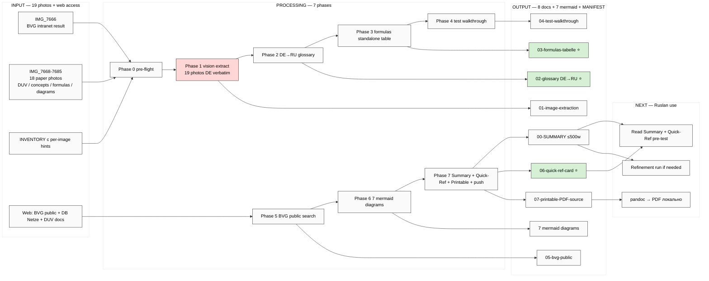

# EXPLAIN — SIPO/ZIPO Schulung BVG Deep Analysis

> **TL;DR.** Personal task — Ruslan проходит SIPO Schulung BVG (Berlin U-Bahn track-warning post role). 19 photos материалов теста vendored в repo. Server CC deep run: vision-extract все photos → DE→RU glossary + formulas + test walkthrough + BVG public search + mermaid + printable PDF source. Russian primary output.

---

## §1 Что у нас есть СЕЙЧАС

**Vendored (commit forthcoming этим Cloud Cowork run):**
- `raw/external/zipo-bvg-schulung-2026-05-20/images/IMG_76{66,68-85}.JPG` — **19 photos** (~58 MB)
- `raw/external/zipo-bvg-schulung-2026-05-20/00-INVENTORY.md` — per-image surface description с 4-photo deep peek
- This EXPLAIN + prompt file

**Context surfaced 4-photo peek:**
- IMG_7666 = BVG **intranet** page «Regelwerke Betriebsleiter U-Bahn (LTB)»
- IMG_7670 = SIPO warning tones (Ro 1 / Ro 2 / Ro 3)
- IMG_7676 = key concepts list (Sakra / Gefahrenanstrich / Kleingruppe / Nachbargleis / Räumzeit)
- IMG_7682 = U-Bahn Großprofil Mindestabstände diagrams (3.70m / 4.50m / 2.20m / 0.70m)

**Не существует:** prior research namespace на этот topic; server CC будет создавать с нуля.

---

## §2 Что делает этот prompt (одним абзацем)

Server CC автономно executes vision-driven deep analysis 19 SIPO/ZIPO Schulung photos: (a) **per-image extract** German content verbatim (text + diagrams + signals + numbers) с rotation-invariant Claude vision; (b) **translate DE→RU** с пояснениями + примерами per concept (NOT verbatim translation — semantic transfer + examples); (c) **vyvesti все основные формулы** отдельно (название / формула / логика расчёта / worked пример из теста); (d) **walkthrough пройденного теста** — взять IMG_7666 (intranet result) + IMG_7668/7669 (answer sheets) и показать «как что высчитывается» step-by-step; (e) **BVG public search** — WebFetch bvg.de + WebSearch публичные SIPO/Sicherungsposten/DUV/Schulung materials; intranet skip (auth-blocked); (f) **mermaid schemes** для visualisation Sicherheitsraum / Ro signals / Räumzeit procedure / роли + responsibilities; (g) **output comprehensive Markdown** с diagrams + quick-reference card готовое для PDF print через pandoc или browser print.

**НЕ делает:** modify Foundation paths (R2 N/A — это personal task outside Jetix Foundation) / любые Jetix-strategic decisions / hand-author Ruslan strategic prose (R1 N/A для personal task но scribe mode preserved).

---

## §3 Что берёт на вход

- 19 photos в `raw/external/zipo-bvg-schulung-2026-05-20/images/`
- `raw/external/zipo-bvg-schulung-2026-05-20/00-INVENTORY.md` — per-image hints
- Web access: BVG public site (bvg.de) + WebSearch для DUV / Sicherungsposten / SIPO Schulung public materials
- Optional: DB Netze / общественные railway track safety standards (для cross-context)

---

## §4 Что обрабатывает (7 phases)

| Phase | Что делает | Time est | Commit |
|---|---|---|---|
| **Phase 0** | Pre-flight: read INVENTORY + verify all 19 photos present + setup output namespace | 5 min | `[zipo-bvg] Phase 0 pre-flight + output namespace` |
| **Phase 1** | **Vision extract per-image** — все 19 photos, verbatim German content (text / numbers / diagrams / signals); flag any illegible passages | 25-35 min | `[zipo-bvg] Phase 1 vision extract 19 photos DE verbatim` |
| **Phase 2** | **DE→RU concepts glossary** — для каждого extracted term: German term / RU translation / definition / пример use case | 15-20 min | `[zipo-bvg] Phase 2 concepts glossary DE→RU` |
| **Phase 3** | **Formulas extraction** — все numeric thresholds (3.70m / 4.50m / 1.5m / 2.20m / 0.70m / Räumzeit / signal counts) → standalone table «название / формула / логика / worked пример» | 10-15 min | `[zipo-bvg] Phase 3 formulas standalone table` |
| **Phase 4** | **Test walkthrough** — IMG_7666 result + IMG_7668/7669 answer sheets → step-by-step «как что высчитывается» с примерами | 10-15 min | `[zipo-bvg] Phase 4 test walkthrough` |
| **Phase 5** | **BVG public search** — WebFetch bvg.de + WebSearch «Sicherungsposten BVG» / «DUV BVG U-Bahn» / public training materials; intranet attempt → flag blocked; capture relevant public docs | 10-15 min | `[zipo-bvg] Phase 5 BVG public materials search` |
| **Phase 6** | **5-7 Mermaid диаграммы** (black-text init) — Sicherheitsraum cross-section / Ro signal sequence / Räumzeit flow / SIPO role responsibilities / Großprofil-vs-Kleinprofil / Gefahrenanstrich identification | 10-15 min | `[zipo-bvg] Phase 6 mermaid diagrams` |
| **Phase 7** | **Synthesis + Quick-Reference Card + Printable PDF source + Summary + push** | 10 min | `[zipo-bvg] Phase 7 Summary + Quick-Ref + Printable + push` |

**Total: ~90-120 min server CC autonomous. Cost estimate: <€5 (vision-heavy phase 1 ~€2-3; rest ~€1-2). All built-in tools (Read vision / WebFetch / WebSearch / Write / Bash); no external API.**

---

## §5 Что получим на выходе

```
research/zipo-sipo-bvg-schulung-deep-2026-05-20/
├── 00-SUMMARY-FOR-RUSLAN.md        # entry; key concepts + formulas; ≤500w
├── 01-image-by-image-extraction.md # per-photo DE verbatim + RU caption
├── 02-concepts-glossary-de-ru.md   # DE↔RU glossary с пояснениями + примерами ⭐
├── 03-formulas-tabelle.md          # standalone formulas table ⭐ (название / формула / логика / пример)
├── 04-test-walkthrough.md          # walkthrough пройденного теста IMG_7666+7668+7669
├── 05-bvg-public-materials.md      # что нашлось в public BVG search + intranet flagged
├── 06-quick-reference-card.md      # 1-2 страница карточка для быстрой ориентации ⭐
├── 07-printable-pdf-source.md      # combined document, ready для pandoc → PDF
├── diagrams/
│   ├── 01-sicherheitsraum-cross-section.md
│   ├── 02-ro-signal-sequence.md
│   ├── 03-räumzeit-flow.md
│   ├── 04-sipo-role-responsibilities.md
│   ├── 05-grossprofil-vs-kleinprofil.md
│   ├── 06-gefahrenanstrich-identification.md
│   └── 07-grundarten-sicherungsmassnahmen.md
└── MANIFEST.md                     # output inventory + cost snapshot
```

**Что в ключевых файлах:**
- `02-concepts-glossary-de-ru.md` — ⭐ primary deliverable для understanding (SIPO / Sakra / Bauleiter / Beschäftigte / Sicherheitsraum / Räumzeit / Nachbargleis / Großprofil / Kleinprofil / DUV / DA U/O / Gefahrenanstrich / Kleingruppe / Grundarten der Sicherungsmaßnahmen / Ro 1/2/3 / Gleissperrung / Langsamfahrstrecken / ... все surfaced terms)
- `03-formulas-tabelle.md` — ⭐ все numeric thresholds в одной таблице; «когда какое расстояние / какой signal / сколько повторов / какая Räumzeit» с worked примерами
- `06-quick-reference-card.md` — ⭐ 1-2 страница cheat sheet для access pre-test / on-the-job
- `07-printable-pdf-source.md` — full document combined; comand `pandoc 07-printable-pdf-source.md -o zipo-bvg-schulung-russian.pdf --pdf-engine=xelatex -V mainfont="DejaVu Sans"` → готовый PDF (Cyrillic-capable font)

---

## §6 Конкретные шаги (sequential)

1. Server CC reads prompt + EXPLAIN + INVENTORY
2. Phase 0 — verify 19 photos + mkdir output namespace
3. Phase 1 — vision extract per-image (parallel batches of 3-5 photos per Read call OK)
4. Phase 2 — build glossary from extracted terms
5. Phase 3 — extract numeric thresholds → standalone formulas table
6. Phase 4 — walkthrough using IMG_7666+7668+7669 substrate
7. Phase 5 — BVG public site fetch + WebSearch
8. Phase 6 — 7 mermaid diagrams (black-text init theme)
9. Phase 7 — Summary ≤500w + Quick-Ref + printable combined + push

Per-phase commit + final push origin main. Final echo: `DONE Phase 7 — N commits / M files / 7 mermaid / printable PDF source ready`.

---

## §7 К чему ведёт

После завершения:
- Ruslan reads `00-SUMMARY` (~3 min) + `06-quick-reference-card` (~2 min) для quick orientation
- При нужде глубже — `02-concepts-glossary-de-ru` (~10 min) + `03-formulas-tabelle` (~5 min)
- Test prep — `04-test-walkthrough` (~5 min)
- PDF generation locally: `pandoc research/zipo-sipo-bvg-schulung-deep-2026-05-20/07-printable-pdf-source.md -o zipo-bvg.pdf` (если установлен pandoc; иначе VS Code Markdown PDF extension)
- Mermaid renders в любом Markdown viewer (Obsidian / Notion / GitHub / VS Code)

**Next:** Ruslan reviews; если нужно — refinement run (e.g., добавить specific test scenarios / расширить formulas examples / etc.).

---

## §8 Mermaid схема (input → processing → output)



---

## §9 Constitutional posture

- **R1 N/A для strategic prose** — personal task; brigadier-scribe scribe mode preserved
- **R2 N/A** — no Foundation modifications; new namespace `research/zipo-sipo-bvg-schulung-deep-2026-05-20/`
- **R6 provenance.** Per-claim source citation: `[src: IMG_NNNN]` или `[src: bvg.de/path retrieved 2026-05-20]`
- **R11 Default-Deny.** Only built-in tools (Read vision / WebFetch / WebSearch / Write / Bash git); no external API
- **R12 N/A** — personal training material, no extraction concerns
- **EP-5 F-grade.** F2 surface (image extraction = verbatim; translation = derivative; примеры = derivative с marker)
- **No paid content download.** Intranet behind auth → flagged, not bypassed
- **Russian primary** output; German terms preserved verbatim per memory + per Ruslan «снова с немецким чтобы я понимал как что блять значит»

---

## §10 Cost cap

- Estimate <€5 total (~€2-3 vision Phase 1; <€1 phases 2-7; <€0.5 WebFetch/Search)
- All built-in tools; no external API
- Per-phase commit cadence preserves recoverability

---

*EXPLAIN closure 2026-05-20 morning Berlin. Ready для launch. Per memory `feedback_prompt_explanation_required.md` — EXPLAIN before launch enforced.*
