# KM + Project-Mgmt Architecture Research — Deep Execution Prompt (Phase A swarm, Cycle-3 M-class)

> **Read this entire file end-to-end before writing a single byte.** The depth
> directive in §1 is not decorative — it is the acceptance predicate for this
> cycle. Every subsequent §-section operationalizes the §1 mission; skipping §1
> invalidates the rest. The Stage-Gated pause in §8 is non-negotiable. The
> locked decisions in §7 are non-negotiable. The anti-scope in §9 is
> non-negotiable. The matrix 5×4 invocation plan in §6 is non-negotiable
> (all 20 cells must fire, logged, auditable).

---

## §1 — Mission + Critical Framing (read this section twice, literally)

### §1.1 Why this cycle exists

This research cycle is the **operational materialization of Pillars 2 + 3 of
the Next Strategic Horizon** (see `decisions/VISION-NEXT-STRATEGIC-HORIZON-2026-04-24.md`
§2 Pillars 2 + 3 + §1 concepts C-1 / C-2 / C-3). Pillar 2 is per-domain-expert
topic-wiki accumulation (the "domain brain" layer). Pillar 3 is per-project
project-wiki + mini-swarm (the "project brain" layer). Until this cycle lands,
Jetix has the *scaffold* for both (wiki v3 layout per ROY-WIKI-V3-ARCHITECTURE-SPEC,
5 alphas per FPF-ENHANCEMENT, 6 agents + 14 legacy), but **not the operating
design** for how knowledge accumulates, retrieves, self-reinforces, and how
projects are spawned / tracked / cross-leveraged.

The variants you produce in this cycle will **determine how Jetix's primary
competitive moat — knowledge-as-leverage — physically materializes**. Per
`decisions/ROY-INFORMATION-DIET.md §1.6` (canonical text): *"Jetix конкурентное
преимущество = curated качественная база знаний + новая философия работы с
информацией… Knowledge-as-leverage — главный ров (moat)."* Per
`decisions/JETIX-PHILOSOPHY.md §14` (canonical text): *"Foundation — это
главный актив. Потеряем wiki — потеряем Jetix."* Per Ruslan's 2026-04-24
voice brief: *"AI на мусоре = мусор; Jetix на curated + self-reinforcing
wiki = 10× leverage."*

**Shallow design = decaying moat.** A "good enough" architecture that ships
today but can't pass UC-1 through UC-8 at scale (§3) destroys the moat thesis
silently. A deep design — one that compounds month-over-month, survives the
€50K → €200K → €1M → $100M → $1T trajectory without re-architecture (24-Lock
D19), and makes every agent *smarter across sessions* — turns knowledge
accumulation into a *true antifragile asset*, the kind OPP-04 in cycle-2
instantiated at the cell-predicate level but this cycle must instantiate at
the wiki-and-project-layer level.

**Deep design = compound returns for years.** The variants you author will
be read by Ruslan, one will be picked (possibly hybrid), and that pick will
shape the next 6-24 months of Jetix's operating model. This is not a draft
cycle. This is the decision substrate.

### §1.2 Ruslan's explicit quality bar — «ёбнутую мощную на всю тысячу процентов»

Verbatim from the 2026-04-24 brief: *«должны сделать работу тоже ёбнутую
мощную на всю тысячу процентов глубокую»*. The English equivalent used across
the cycle-2 execution prompt and the master synthesis: **"1000% depth. No good
enough."** Concretely, for this cycle:

1. **Three variants per layer that each work to 100% independently.** Not
   three flavors of the same design. Three genuinely different positions in
   the design space (different governing metaphor, different dominant
   retrieval mechanic, different agent-coupling model) so Ruslan has a real
   choice — not three labels on one underlying recommendation.
2. **Every variant must demonstrably support UC-1..UC-10** (§3). Ten use
   cases — UC-1..UC-8 structural (ingest / digest / solve / skill / onboard
   / cross-project / contradiction / scale), plus **UC-9 client-isolation**
   and **UC-10 offline-first inference** (added 2026-04-24 post-BIOS-research
   — see `decisions/STRATEGIC-INSIGHT-JETIX-AI-BIOS-MOMENT-2026-04-24.md`).
   If a variant cannot trace all ten use cases through its mechanics — you
   do NOT ship a "partial support" excuse. You either iterate the variant
   until it supports all ten, or you drop the variant and produce a third
   that does. **UC-9 and UC-10 are NOT optional extensions — they are the
   architectural differentiation of Jetix vs 35K generic AI-wrapper
   consulting companies; any variant discarding them discards Jetix's
   strategic position.**
3. **Matrix 5×4 must actually fire.** All 5 experts × 4 modes = 20 invocation
   cells, logged, each producing a draft artefact under
   `swarm/wiki/drafts/T-km-architecture-research-2026-04-XX-<expert>-<mode>-<artefact>.md`.
   Scalability-mode is NOT optional for any of the 5 experts; each must
   project all 6 variants through the 5 horizon gates (€50K / €200K / €1M /
   $100M / $1T). Philosophy × integrator verdict + systems × scalability
   verdict must both appear in the consolidation.
4. **F-G-R tagging (per `decisions/JETIX-ARCHITECTURE-BRIEF.md` §4.1 + FPF
   Enhancement E-5)** on every major claim in every variant. Triples: `F:`
   formality level F0-F9, `ClaimScope:` bounded-context identifier, `R:`
   reliability `low|medium|high|certified|formally-proven`. Bare assertions
   without F-G-R are not claims in this cycle; they are noise.
5. **Explicit preserved dissents, minimum three.** Per Cycle-1 epistemic
   hygiene precedent (matrix-vs-solo decision, §5.5.2 master synthesis): do
   NOT average dissenting conclusions. When two experts disagree, both
   positions land in the final with F-G-R tagging and brigadier's rationale
   for picking (or hybridizing). No "on balance we recommend" smoothing.
6. **Zero locked-decision re-opening.** 24 Locks (§7), FPF E-1..E-18, W-1..W-12
   from ROY-WIKI-V3-GOALS, 8-block manifests, 5 alphas, shared-protocols 9
   sections — all remain as-is. This cycle EXTENDS, never RESETS.
7. **Local-first, client-private architecture is the sixth demand** (added
   2026-04-24 post-BIOS-clone-wars research — see
   `decisions/STRATEGIC-INSIGHT-JETIX-AI-BIOS-MOMENT-2026-04-24.md`). The
   KM architecture you produce is NOT just Jetix-internal — it IS the
   template we will deploy per client. Each client's KB lives on their
   infrastructure; their data never enters Jetix central pool; their AI
   archivist runs on their server (locally-distilled LLM — Llama /
   DeepSeek / Mistral family); Jetix methodology is pushed to them as
   versioned updates, their data is NOT pulled back. This is
   non-negotiable Jetix positioning (parallel: IBM BIOS was published +
   copyright-protected; clone-wars freed the market at 30-40× total pie;
   Jetix methodology = open interface, closed implementation, local KB =
   client's BIOS). **Every variant MUST architecturally prove UC-9
   (client-isolation) and UC-10 (offline-first inference) — by construction,
   not by policy.** Variants that discard these fail immediately; drop and
   replace with a variant that preserves Jetix's strategic differentiation
   against the 35K generic AI-wrapper market.

**Disqualifying anti-patterns** (if any appear in the final document the cycle
is incomplete and brigadier re-enters Phase 4):

- Variant descriptions < 1500 words each (per §5.1 depth floor) — shallow
  shortcut.
- A variant that names a governing metaphor (e.g., "GraphRAG-style") but does
  not specify *concretely* how the metaphor touches ingest / retrieval /
  write-back / refresh mechanics for Jetix's existing `swarm/wiki/` v3
  substrate — *label-only variant*.
- A "hybrid recommendation" that collapses the three variants into a single
  blend before Ruslan has seen them separately — violates the 3×3 mandate and
  the Cycle-1 preserve-dissents pattern.
- Any variant that requires paid APIs, vector DB services, or non-Max-subscription
  infrastructure without flagging it as a hard D19-gate failure — Max-subscription
  discipline per D6 §6.10 + cycle-2 §4.
- Missing UC traces — a variant listing UC-1..UC-8 as "supported" without
  concrete walkthrough (input → which wiki paths touched → which agent
  invoked → which write-back fires → which citation chain is emitted).
- Any horizon projection that does not name *what physically breaks* at a
  gate (latency ceiling, file-count ceiling, graph-traversal ceiling,
  hook-timeout ceiling, context-window ceiling) and *what upgrade path fires*.
  Projections of the form "scales fine to $1T" are non-variants.
- Triviality in scalability-mode: scalability rubric requires BOSC-A-T-X
  trigger check per FPF E-6 + Janus-degraded-mode spec. Variants without both
  are incomplete.
- Any variant proposing to modify legacy `wiki/` v2 (untouched per D17 + Q9
  coexist) or the 14 legacy agents under `.claude/agents/` that are NOT the
  6 Phase-A roster (brigadier + 5 experts).
- Any variant that skips the integration spec — Layer A and Layer B MUST
  demonstrate concrete read/write contracts with each other (project-wiki
  reads topic-wikis; topic-wikis receive write-backs from project-wiki
  patterns).
- **Any variant that cannot architecturally prove UC-9 client-isolation**
  — i.e., the variant relies on "Jetix admins will be careful" or "policy
  prevents cross-client access" rather than showing that by construction
  (directory boundaries, per-client signing keys, per-client agent
  instantiation, isolated indexes) two simultaneous Jetix clients cannot
  observe each other's data. Policy-based isolation = disqualifying.
- **Any variant that cannot architecturally prove UC-10 offline-first
  inference** — i.e., the variant requires the client's wiki retrieval /
  synthesis path to hit OpenAI / Anthropic / cloud APIs to answer a
  substantive query about client-private data. Cloud-dependent inference
  for the core "your data never leaves your server" pathway = disqualifying.
  (Cloud augmentation is permissible as an optional-upgrade tier where the
  client explicitly opts in and sends redacted/public-data queries; the
  default-offline pathway must still work standalone for client-private
  data.)

If you catch yourself thinking "close enough," or "Ruslan will understand the
gap," or "the other expert will fill this" — **stop. Re-read §1. Tighten.**

### §1.3 What you are NOT doing in this cycle

- **NOT implementing** any architecture. No new directories, no new skill
  files, no agent-prompt edits. The Phase-A swarm writes variants only; the
  materialization task is a separate M-class cycle after Ruslan picks.
- **NOT re-deriving** the 9-layer wiki v3 substrate, the 12-edge enum, the 5
  alphas, the 8-block manifest, or shared-protocols 9 sections. Those exist,
  are locked, and every variant builds *on top* of them.
- **NOT running M3** (solo-vs-matrix measurement experiment) — separate task
  outside this M-class slot; HD-02 permits same-cycle companion if chosen,
  but M3 has its own brief.
- **NOT touching** legacy `wiki/` v2 or the 14 non-Phase-A agents.
- **NOT producing** TWO separate documents. One consolidated output per §10.
- **NOT ingesting** Tier-4 books during this cycle (expert canonical sources
  per `decisions/ROY-ALIGNMENT-2026-04-22.md §2` are referenced but not
  freshly read — the *pool-first-query-second* discipline of master synthesis
  §4.6.2 governs: read what you already distilled + cite).
- **NOT calling** paid APIs. `unset ANTHROPIC_API_KEY` at session start per
  `swarm/lib/shared-protocols.md §9`. No Pinecone / Weaviate / OpenAI /
  Cohere SDK invocations. All retrieval is filesystem + ripgrep + typed-BFS
  + Claude Code built-in tools.

### §1.4 How "depth" is measured in this cycle

Five concrete depth floors. Each variant failing any floor gets iterated
until it passes.

1. **Word-count floor per variant** (per §5.1 template): ≥1500 words on
   architecture description (mechanics section), ≥1000 words on use-case
   walkthrough (UC-1..UC-10 traced concretely — 100 words × 10 UCs ≥
   minimum), ≥600 words on horizon projection (all 5 gates, each with
   named failure mode + upgrade path), ≥400 words on anti-fragility
   assessment, ≥400 words on client-isolation + offline-first architectural
   proof (UC-9 + UC-10 co-located sub-section). Total per variant:
   ~4500-5500 words. Total for 6 variants: ~27-33K words of variant prose
   alone, plus matrix synthesis + recommendation + dissents + decision
   packet.
2. **Citation floor**: ≥8 Tier-1 citations per variant (see §5 research
   corpus), each citing path + section. Bare assertions without source are
   disqualified. Each major claim carries F-G-R.
3. **Integration-pair concreteness**: every Layer-A × Layer-B pair (6 total
   = 3×2 paired-choice combinations of your choosing; at minimum one pair
   per recommended "canonical pairing" plus explicit discussion of
   cross-pair interactions) must show concrete read/write contracts — which
   wiki paths does the project-wiki scaffold read at onboarding? Which
   project-wiki patterns write back to which topic-wiki layer? What edge
   types traverse the boundary?
4. **Horizon-projection concreteness**: at each gate, name (a) *what
   physically breaks*, (b) *what upgrade path fires*, (c) *which MHT event
   per FPF E-6* is triggered, (d) *what Janus failure mode (S-A excess or
   INT excess per FPF E-11) is at elevated risk at that scale*.
5. **Dissent-preservation count**: the final consolidation names ≥3 distinct
   dissents (e.g., systems × scalability disagrees with philosophy ×
   integrator on Variant A2 retrieval-heavy mechanics; investor ×
   scalability disagrees with engineering × optimizer on Variant B1 cost
   model at €1M gate). Each dissent carries F-G-R and the brigadier's
   handling decision (hybridize / preserve-both / prefer-one-with-reason).

### §1.5 Tie-back to locked decisions and operating mode

This cycle is Stage-Gated per HD-01 + HD-02 (cycle-2 landed). You run Phases
1-5 autonomously (intake → decomposition → dispatch → integration → variant
drafts), land an AWAITING-APPROVAL file at `swarm/gates/AWAITING-APPROVAL-km-architecture-variants-<date>.md`
with variant summaries + recommendation + preserved dissents, **pause**, wait
for Ruslan's 4-response ack (accept / modify / hybrid / reject per §5.9
shared-protocols), then consolidate in Phase 6 (§8.4). Full-Auto is NOT
authorized for this cycle.

**M-class budget.** Per HD-02 N=2 M-class per cycle rule (cycle-2 landed),
this research consumes **1 structural M-slot** — specifically, it is the
"structural" variant of M-class since it produces design artefacts (not
measurement data). HD-02 permits 1 companion measurement M-task in the same
cycle window (e.g., M3 solo-vs-matrix if Ruslan green-lights it). **Do NOT
run M3 inside this prompt's execution.** The brigadier running this prompt
watches only the 1 M-slot for this research; measurement tasks, if authorized,
run in parallel brigadier sessions with their own mailboxes + gates +
cycle-logs.

---

## §2 — Scope: Two Layers, One Coherent Task

### §2.1 The split — why two layers, not two prompts

Jetix's knowledge and project operations are **coupled by design**: projects
consume topic-knowledge; topic-knowledge accumulates from project experience.
A wiki/KM architecture that doesn't specify how project-managers-agents query
topic-wikis is incomplete. A project-mgmt architecture that doesn't declare
what it writes back to the knowledge layer is incomplete. Therefore this
cycle produces **one consolidated output document**, with 3 Layer-A variants
(KM), 3 Layer-B variants (project-mgmt), and explicit integration pairs.

But the two layers *differ in operating shape* — one is long-lived accretive
memory (Layer A), one is time-boxed goal-driven execution (Layer B) — so
they merit variants that differ along layer-native axes. That is why 3×3,
not 1×3: a real choice for Ruslan requires seeing the KM design space AND
the project-mgmt design space as separate axes, then picking a pair.

### §2.2 Layer A — Wiki / Knowledge Management Architecture

The swarm designs 3 full variants of **how knowledge is structured, ingested,
retrieved, accumulated, self-reinforced, refreshed, and scaled**. Each of the
seven sub-dimensions below must be specified concretely for each variant —
not "broadly like Karpathy's pattern," but *which file paths, which skill
invocations, which agent writes, which lint check fires*.

**A.1 Structured.** Entity types, edge types, layer hierarchy, granularity
rules. Does the variant extend the 9-entity + 12-edge baseline (D1 + D3 of
ROY-WIKI-V3-SPEC) or does it introduce a new entity class (e.g., "pattern"
as distinct from "summary" per Tiago Forte CODE / Distill→Express)? If yes,
with what admission criterion and what impact on the edge enum?

**A.2 Ingested.** Video / article / book / paper / podcast → structured notes
→ wiki entries. Concretely for Jetix: how does a 45-min YouTube lecture
become ≥5 concept pages + ≥8 typed edges + the systems-expert's training
corpus (UC-1)? What automation fires? What dedup logic? What niche routing?
What handles the 393-book Tier-4 Private Library subset allocated per expert
(per `decisions/ROY-ALIGNMENT-2026-04-22.md §2` + `decisions/MASTER-SYNTHESIS
§4.6.1`)?

**A.3 Retrieved.** Query types, retrieval latency, retrieval precision, how
agents use wiki in-session. Existing baseline is Q1 4-tier retrieval (direct
path → index+grep → typed-BFS → long-context fallback). Does the variant
add HippoRAG-style Personalized PageRank (per
`raw/research/knowledge-architecture-deep-research §B.2`), GraphRAG
community-summaries preprocessing, HyDE enhancement, or does it double down
on filesystem+grep? Under what scale does the choice break?

**A.4 Accumulated.** Agent skills, insights, emergent patterns write back to
wiki. This is the W-5 Two-level Compounding Engineering mandate (per
ROY-WIKI-V3-GOALS). Concretely: when brigadier successfully runs a novel
task decomposition, which file gets appended, with what frontmatter, via
which skill or protocol? When does the `agents/<expert>/strategies.md` entry
get promoted to `swarm/wiki/global/compound-rules/` (per D1 §1.3 permission
table)?

**A.5 Self-reinforced.** Cross-links, contradiction detection, claim-updating
when new evidence arrives. Existing baseline is `contradicts` + `invalidates`
+ `supersedes` edges (D3) + `/lint` Q5 5-signal orchestration. Does the
variant add a scheduled cadence (weekly / monthly `/lint --refresh-claims`)?
Does it add an automatic claim-stance-downgrade trigger (asserted →
contested when contradiction_count > 0)?

**A.6 Refreshed.** Curated-book reading cadence, expert knowledge refresh
cycle. Existing baseline is Private Library pool-first-query-second + Phase
B book-distillation sweep (per W-3 + master synthesis §4.6.2). Does the
variant define a concrete refresh ritual — "every ~N cycles each domain
expert reads M Tier-4 sources and updates strategies.md + foundations"? With
what trigger, what audit trail, what metric surfaced in `meta/health.md`?

**A.7 Scaled.** What breaks at €1M / $100M / $1T per D19 trajectory. Baseline
guidance in `raw/research/knowledge-architecture-deep-research §G.1-G.5`:
557 → 5,000 → 50,000 pages; HippoRAG PPR → GraphRAG communities → hybrid
BM25+dense+PPR+RRF. Does your variant follow, diverge, or propose a
different scale-path? Name the physical failure modes.

**Meaningful axis-of-differentiation** — the three variants should not all
be "slightly different retrieval tweaks." At minimum one axis must be
**categorically different** between variants. Examples of real axes (pick
one per variant, DO NOT produce three on the same axis):

- *Retrieval-heavy (query-time assembly) vs Pre-compiled-heavy (prebuilt
  topic MoCs + community summaries) vs Demand-pull-hybrid (cold-cache
  compile-on-first-ask)*.
- *Strict hierarchy (Левенчук ШСМ ontological — 9 layers + FPF slots) vs
  Emergent-link (Zettelkasten / Roam-style ZK atomic notes + backlink
  surfing) vs Typed-graph-with-community (Microsoft GraphRAG communities
  over typed edges)*.
- *Agent-owned sub-wikis (each expert masters and writes to own theme wiki)
  vs Shared-spine with niche filters (one canonical tree; agents read via
  niche-symlinks per CLAUDE.md) vs Federated per-theme wikis with bridge
  edges (like multi-repo monorepo with cross-tree.jsonl — extending T1 +
  D3 §3.2.12)*.

### §2.3 Layer B — Project Management Architecture

The swarm designs 3 full variants of **how Jetix's 8 active projects are
onboarded, state-tracked, agent-allocated, cross-leveraged, reviewed,
surfaced-to-Ruslan, and lifecycle-managed**. Each of the eight sub-dimensions
below must be specified concretely.

**B.1 Project onboarding.** New Jetix project direction → scaffold wiki +
agent allocation + decision records. Concretely: in ≤30 min wall-clock,
what is created? Which skill fires? What frontmatter gets written? Which
topic-wikis get linked? Which mini-swarm (if any) gets defined?

**B.2 State tracking.** ICP / leads / contracts / decisions / open questions
/ next actions. Existing baseline: per Vision doc §1 C-2, minimum scaffold
is `_moc.md + context.md + history.md + decisions.md + open-questions.md`.
Does the variant match, expand, or redefine? Per `decisions/VISION-NEXT §6 Q2`
— minimum scaffold vs richer sections — is an explicit open question.

**B.3 Agent-per-project model.** Single project brigadier? Mini-swarm inside?
Shared experts across projects? Project-brigadier + allocated experts per
`decisions/VISION-NEXT §1 C-2`. Does the variant use mini-swarm (3-4 agents
inside), single-agent (one brigadier, calls shared experts on demand), or
hybrid (core 2 agents + on-demand call-out)?

**B.4 Cross-project leverage.** Insight from project A informs project B.
Existing baseline: master synthesis §5.8 + Level-2 CE (W-5). Does the variant
use explicit cross-project edges (new edge type? — extending D3 enum),
periodic meta-agent sweep (weekly pattern-extraction across all projects),
or emergent discovery via shared-spine + niche filters?

**B.5 Cadence.** Weekly / monthly review rhythm, what gets reviewed, who
reports. Per `decisions/JETIX-ARCHITECTURE-BRIEF §4.7` — weekly dashboard
ritual; FPF Part 5 §5.1 — daily log / weekly review / quarterly letter.
Does the variant fit those cadences, or propose different cadence for
project-level state?

**B.6 Ruslan's strategic overview.** At any moment, how does Ruslan see
"all 8 projects health" without drowning? Dashboard (per D4 §4.7)?
Project-rollup skill (`/project-status` sweep)? Traffic-light summary
generated on-demand? Scheduled Monday-morning digest?

**B.7 Lifecycle.** Project pause, project kill, project pivot, project spawn.
What state machine governs a project? How does a paused project preserve
its accumulated knowledge? How does a killed project tombstone its wiki
without creating orphans (per `/lint` anti-pattern discipline)? How does a
pivot relate to α-5 Direction's `hypothesized → activated → pivoted` state
machine per swarm-alphas §5?

**B.8 Linkage to Layer A.** How does project-wiki read from topic-wikis;
what gets written back as topic-wiki entries (patterns, anti-patterns,
foundations)? This sub-dimension overlaps with §2.4 integration spec —
each variant's B.8 description references the companion Layer-A variant it
pairs with.

**Axes-of-differentiation for Layer B** — same discipline: three variants on
categorically different axes. Examples:

- *High-autonomy (project-brigadier runs daily, Ruslan sees Monday digest) vs
  High-touch (Ruslan sees every project decision gate for P1 projects) vs
  Phase-gated-autonomy (autonomy scales with project validation level —
  early-stage high-touch, scaled-stage high-autonomy)*.
- *Thin-scaffold (minimal `_moc.md + context.md + history.md`, everything
  else emerges) vs Rich-scaffold (PMBOK-style WBS + risk register +
  stakeholder map + gantt-like timeline per project) vs Adaptive-scaffold
  (scaffold grows with project complexity, starts minimal, expands on
  trigger)*.
- *Monolithic-projects-as-namespaces (one wiki, projects are Layer-6
  `operations/<slug>/` namespaces per D1) vs Federated-per-project-wikis
  (each project is its own wiki tree under `wiki/projects/<slug>/` with
  cross-project edges) vs Hybrid (Layer-6 `operations/` for execution state
  + Layer-1 `themes/` for pattern accretion; per-project tree is "view" not
  "fork")*.

### §2.4 Integration requirement — one coherent output

Variants MUST show how Layer A and Layer B fit together. Concretely:

- **Paired canonical choices.** Each Layer-A variant has a *preferred*
  Layer-B companion (you declare the pairing and justify it). Non-preferred
  pairings are discussed as alternative combinations with tradeoffs.
- **Read-contract from B to A.** At project onboarding (UC-5), which topic-
  wiki paths does the project-wiki scaffold pull? Under what edge type?
- **Write-contract from B to A.** When a project-wiki accumulates a novel
  pattern (UC-6), which topic-wiki layer receives the write (Layer 7 global
  compound-rules? Layer 4 meta/agent-improvements? Layer 1 themes/)? With
  what frontmatter? What authority gate (Q2 single-writer brigadier; does
  project-brigadier have its own single-writer slot or does it route through
  the canonical brigadier)?
- **Cross-project edges.** When a pattern learned in `quick-money` informs
  `research` project methodology (UC-6), what edge type in
  `graph/edges.jsonl` expresses this? If the 12-enum (D3) doesn't cover it,
  propose an extension with justification — the 13th edge must survive
  critic review; do NOT add it casually.
- **Skill reuse.** Which existing skills (`/ingest`, `/ask`, `/lint`,
  `/consolidate`, `/build-graph` per D8) cover project-wiki operations? Which
  new skills (if any) does your Layer-B variant require? Every new skill
  must cite Q6 activation pipeline (candidate → learning → active) and D11
  owners table.
- **Health dashboard integration.** How does `meta/health.md` (D10) surface
  project-level signals in addition to its existing 8-section scaffold
  (orphans, stale, contradictions, gate throughput, cycle count, skill
  usage, cross-niche edges, Layer-9 trigger state)? Propose concrete new
  fields with computation rules.

### §2.5 Output structure (one document)

- `decisions/KM-ARCHITECTURE-VARIANTS-2026-04-XX.md`
  - §1 Context (why this cycle; Pillars 2+3 framing; Ruslan quality bar)
  - §2 Method (matrix 5×4 protocol; how experts were dispatched; what each
    mode produced; dissent-preservation discipline)
  - §3 Layer-A Variant 1 (full §5.1 template)
  - §4 Layer-A Variant 2 (full §5.1 template)
  - §5 Layer-A Variant 3 (full §5.1 template)
  - §6 Layer-B Variant 1 (full §5.1 template)
  - §7 Layer-B Variant 2 (full §5.1 template)
  - §8 Layer-B Variant 3 (full §5.1 template)
  - §9 Integration Pairs (canonical pairings A1↔B?, A2↔B?, A3↔B?; one
    cross-pair discussion per variant minimum)
  - §10 Use-case Matrix (6 variants × 8 use cases — pass / partial / fail;
    each partial/fail with explicit reason)
  - §11 Recommendation (brigadier's pick with philosophy × integrator +
    systems × scalability verdicts; may be hybrid if justified)
  - §12 Preserved Dissents (≥3; each with F-G-R + handling decision)
  - §13 Ruslan Decision Packet (clear 4-response template: accept / modify
    specific variant / hybrid A+B / reject with reason)

Target word-count: **15-25K words** in the final document. Under 15K → too
shallow. Over 25K → likely redundant; compress before landing.

---

## §3 — Use-case Acceptance Matrix (UC-1 .. UC-10)

Every variant MUST demonstrably support all 10 use cases. Support is defined
by concrete trace: input → wiki paths touched → agent invoked → write-back
fires → citation chain emitted. "Supports in principle" = fail.

**UC-1..UC-8 are structural acceptance criteria** (how the KM + project-mgmt
architecture functions). **UC-9 and UC-10 are strategic acceptance criteria**
(how the architecture preserves Jetix's competitive moat against the 35K
generic AI-wrapper consulting market). Structural failure is recoverable
through iteration; strategic failure drops the variant.

### §3.1 UC-1 — Video Ingest (ingestion pipeline that learns)

**Scenario.** Ruslan shares a 45-minute YouTube lecture on systems thinking
(e.g., Donella Meadows 1999 "Leverage Points" talk). Pipeline extracts a
transcript (either via existing Whisper pipeline per `CLAUDE.md` — note that
`GROQ_API_KEY` must be explicitly re-set for transcription windows per
shared-protocols §9.1, else skip the transcription step and substitute a
pre-existing transcript file in `raw/sources/`), distills the content, and
produces structured wiki artefacts.

**Acceptance criteria (each variant must trace):**

- ≥5 `wiki/concepts/<slug>.md` pages created (e.g.,
  `leverage-points-system-structure`, `feedback-loop-paradigm-shift`,
  `systems-archetype-shifting-burden`, etc.) — each with frontmatter per D2
  §2.2 (id, title, type, layer, niche=meta, pipeline=ingested, state=drafted,
  confidence, tier, produced_by=/ingest, sources[] including the transcript
  file and the video URL, related[] cross-references).
- ≥8 typed edges appended to `swarm/wiki/graph/edges.jsonl` per D3 12-enum
  (e.g., `{from: concept/leverage-points, to: concept/feedback-loop, type:
  extends}`; `{from: source/meadows-1999-leverage-points, to:
  concept/leverage-points, type: supports}`; etc.).
- The content appears in `systems-expert`'s training corpus — i.e., the
  pages land in `wiki/themes/systems/` (per D1 theme-niche map: systems →
  meta niche) and/or `wiki/foundations/systems/` if they qualify as
  axiomatic; systems-expert's next invocation reads them via Tier A
  (niche-filtered direct path) of Q1 retrieval.
- A "new knowledge" alert surfaces in next weekly digest (UC-2 trace): the
  variant specifies which mechanism generates the alert — scheduled
  `/build-graph` summaries writing to `graph/summaries.md`? A `/lint` cron
  emitting "new pages this week" count to `meta/health.md`? A new
  `digest.md` aggregator skill?
- **Failure mode to trace.** What happens if the 45-min transcript exceeds
  a context-window budget (Opus 4.7 1M is fine; Sonnet 4.6 200K may not
  be)? What happens if `/ingest` dedup finds 3 of the 5 concept slugs
  already exist with `pipeline: compiled`? What happens if the video URL
  is unreachable a week later and `sources[]` resolution fails a `/lint`
  sweep?

### §3.2 UC-2 — Weekly Digest Query

**Scenario.** Monday morning. Ruslan asks *"Что нового в wiki за прошлую
неделю?"*. System returns grouped-by-niche summary with top 5 concepts, new
cross-links, and emergent themes.

**Acceptance criteria:**

- Response structure: grouped by 6 niches (personal / business / sales /
  life / tech / meta per CLAUDE.md L70 lock). Top-5 concepts per niche
  (empty niches explicitly named as "no new pages"). New cross-links count
  per niche. Emergent themes section drawn from `/build-graph` community
  summaries (D1 §1.2) + `/lint` contradiction report.
- Latency floor: ≤60 seconds to first byte, ≤180 seconds complete. A
  variant that requires GraphRAG-style community preprocessing on every
  query fails this floor at 557+ pages.
- Citations: every claim in the digest cites at least one wiki page with
  path + frontmatter id.
- Delivery format: Markdown, viewable in terminal or IDE. (No HTML
  generation required Phase A.)
- **Failure mode.** What happens when no new pages were added ("empty"
  week)? Variant specifies default response. What happens when the week
  contained only `drafts/` additions (not yet promoted to canonical)? Does
  the digest surface drafts? (Recommendation: no — drafts are pre-canonical;
  digest shows canonical only, but variants can override with justification.)

### §3.3 UC-3 — Solve-with-Wiki

**Scenario.** Ruslan asks *"Как применить systems-thinking к нашему outreach-
процессу в DACH?"*. Agent retrieves relevant concepts, synthesizes, returns
with citations, and writes insight back to wiki.

**Acceptance criteria:**

- Retrieval fires per variant's Q1-extended protocol. Trace: which Tier (A
  niche / B index+grep / C typed-BFS / D long-context) returned the top
  results? How many results? Precision (does the answer actually use what
  was retrieved, or synthesize over the wrong subset)?
- Synthesis produces a concrete application plan for DACH outreach (e.g.,
  "stocks and flows of lead → prospect → qualified → closed; feedback loops
  are response-rate ↔ template-quality; leverage point = calibration step
  before outreach rather than volume after"). Plan cites ≥4 wiki pages:
  ≥2 from `systems/` theme + ≥2 from `sales/` niche or `business/` niche.
- Write-back: if the synthesis is novel (per a novelty threshold — variant
  specifies), a new page lands. Options include `wiki/comparisons/YYYY-MM-DD-
  apply-systems-thinking-to-outreach.md` (per `/ask` filing loop, D1 §1.3),
  OR a new `wiki/ideas/<slug>.md` routed to `experiment` per D2 §2.3, OR
  an append to `wiki/projects/quick-money/open-questions.md` (if the Layer-B
  variant supports per-project open-questions).
- F-G-R on the synthesis: the composed answer carries `F: F2 | ClaimScope:
  dach-outreach-quick-money | R: medium` frontmatter if it's a draft
  proposal, vs `F: F4 | R: high` if it grounds in multiple accepted claims.
- **Failure mode.** What happens if the query retrieves 50+ candidate
  concepts (context-window pressure)? What happens if there's a contradiction
  between `systems/` and `sales/` niches (e.g., one concept says "high
  volume wins DACH", another says "hyper-targeting wins DACH")? Variant
  specifies disambiguation protocol — surface both with preserved dissent
  (per Cycle-1 hygiene) or route to HITL.

### §3.4 UC-4 — Skill Accumulation (the Compound Loop)

**Scenario.** Brigadier successfully runs a novel task decomposition (e.g.,
a task that used a new matrix-cell selection pattern not previously
strategies.md-documented). Pattern is extracted, stored, and queryable in
the next cycle as "have we done this before?".

**Acceptance criteria:**

- Append to `agents/brigadier/strategies.md` (per CLAUDE.md "Strategies"
  Level-1 CE lock + T5/R6 from ROY-WIKI-V3-SPEC) in 4-part DRR format (FPF
  E-9): context / decision / alternatives considered / review-checkpoint.
- Mirror to `swarm/wiki/brigadier/how-to-decompose-tasks/<slug>.md` per D1
  §1.3 — brigadier-write, Layer 2 bucket.
- After ≥10 uses with ✓/✗ ratio ≥ 3:1 (per α-3 `active → validated`
  transition in swarm-alphas), promotion to `swarm/wiki/global/compound-rules/
  <slug>.md` per W-5 Level-2 CE + D12 collapse migration.
- Next-cycle query: when brigadier intakes a similar task, its §3
  Decomposition preamble reads `agents/brigadier/strategies.md` (per FPF
  E-9 protocol) AND `swarm/wiki/brigadier/how-to-decompose-tasks/` (per
  Layer-2 bucket) — both surfaces appear in Q1 Tier-A niche-filtered pull
  (niche=meta).
- **Failure mode.** What if two simultaneously-running cycles both extract
  conflicting patterns? Q2 single-writer brigadier mitigates via integration
  at α-4 `closed` boundary — variant specifies the merge protocol. What if
  the pattern is Ruslan-only (e.g., requires his voice judgment) — is it
  still extracted, and if so, tagged `produced_by: ruslan-attested`?

### §3.5 UC-5 — Project Onboarding

**Scenario.** New Jetix project direction spawned (e.g., Ruslan decides to
activate the `bets` project that was paused, with a concrete first bet). In
≤30 min wall-clock: project-wiki scaffold lands + mini-swarm (if that
variant's B.3 model uses one) allocation + initial ICP/thesis drafts +
linked to relevant topic-wikis.

**Acceptance criteria:**

- Scaffold files created with frontmatter per B.2 (Layer-B variant spec).
  Minimum: `_moc.md`, `context.md`, `history.md`, `decisions.md`,
  `open-questions.md`. Layer-B variants may add: `icp.md`, `thesis.md`,
  `pipeline.md`, `leads/`, `contracts/`, etc.
- Topic-wiki links established: project-wiki reads relevant `wiki/themes/
  <theme>/` pages (e.g., for a bet on AI-infra infrastructure consulting,
  reads `themes/engineering/`, `themes/investing/`, `themes/systems/`), and
  these reads appear as `related[]` in project-wiki `_moc.md` frontmatter.
- Mini-swarm allocation (if the variant uses): a `project-brigadier.md`
  system file or analogous allocation declaration specifies which of the 5
  canonical experts are the "default invocation set" for this project's
  cycles. Alternatives per B.3: single-expert, shared-experts-on-demand.
- Elapsed time budget: ≤30 min for the initial scaffold pass. Variants that
  require heavy book-distillation at onboarding (e.g., "first onboarding
  reads all 393 books") fail this floor.
- **Failure mode.** What if the project is a "kill / pivot of an earlier
  project" (e.g., `bets` pivots from an earlier variant)? Does the onboarding
  preserve history and link-forward? How does α-5 Direction's state
  transition log?

### §3.6 UC-6 — Cross-project Insight Transfer

**Scenario.** A pattern learned in `quick-money` (e.g., "DACH enterprise
decision-makers respond 3× better to German-language outreach threading a
specific regulatory concern in the first paragraph") propagates to `research`
project's methodology (e.g., "research thesis-validation interviews use
regulatory-concern opening in DE + EN variants").

**Acceptance criteria:**

- Explicit cross-project edge (per §2.4 integration spec). Variant proposes
  edge type — existing 12-enum covers it (maybe `derived_from` or new
  `learned-in`?) or a new edge type is proposed with justification.
- Automated surface — either scheduled meta-agent sweep surfaces the
  pattern in next weekly digest, or `/consolidate` detects similar claim
  slugs across projects and proposes merge.
- Philosophy and investor and systems expert verdicts on epistemic status
  of "transfer" (does DACH outreach n=20 generalize to thesis-interview n=5?
  F-G-R on the transfer itself).
- **Failure mode.** What if `quick-money` pattern conflicts with an earlier
  `research` pattern? Surfaced as `contradicts` edge; triggers UC-7
  (contradiction detection).

### §3.7 UC-7 — Contradiction Detection

**Scenario.** Two claims disagree. E.g., in `wiki/concepts/private-library-
moat.md` a 2026-04 entry says "Private Library is *the* primary moat for
Jetix"; a 2026-05 derivative from cycle-4 evidence says "Private Library is
necessary but not sufficient; matchmaker Lock-21 is equally primary." A
`/lint` run surfaces the contradiction for Ruslan resolution.

**Acceptance criteria:**

- `/lint` Q5 signal #4 fires: contradiction_count > 0 on the affected
  concept pages. The `graph/edges.jsonl` has bidirectional `contradicts`
  edges (per D3 §3.2.2 + critic-gate1 H-fix).
- `meta/health.md` contradiction section increments; the affected concept's
  `stance: contested` (per D2 claims schema).
- Ruslan is prompted at the next gate or weekly digest. Resolution options:
  edit claim (state: revised), supersede (new page with `supersedes` edge),
  tombstone (state: tombstoned per D5), or preserve both as conditional
  claims with bounded ClaimScope (per FPF E-5 F-G-R discipline).
- **Failure mode.** Multi-hop contradiction (claim A supports concept X;
  claim B invalidates concept Y; X and Y are semantically equivalent but
  different slugs — dedup failure). Variant specifies how `/consolidate`
  discovers the semantic equivalence — heuristic keyword overlap, `/ask`-
  backed LLM synthesis, or Ruslan manual resolution.

### §3.8 UC-8 — Scale Test

**Scenario.** Variant explicitly projects behavior at 10,000 wiki pages / 50
active projects / 100 agents. What breaks? What upgrades? What MHT event
(per FPF E-6 BOSC-A-T-X triggers) fires?

**Acceptance criteria per gate (variants project all 5 gates per MHT event
naming):**

| Gate | Revenue | Wiki-page floor | Project count | Agent count | Named physical failure | Named upgrade path |
|------|---------|------------------|----------------|-------------|------------------------|---------------------|
| G1   | €50K    | ~1,000           | 2-3 active     | 6 (Phase A) | filesystem+grep latency approaches ~2s p95 on multi-hop | BM25 secondary + PPR index warmup |
| G2   | €200K   | ~5,000           | 5-8            | 8-10        | edges.jsonl in-memory size crosses ~50MB (networkx load) | edges split by layer; GraphRAG community detection daily cron |
| G3   | €1M     | ~15,000          | 10-15          | 15-25       | contradictions surface rate > 3/week; `/lint` weekly takes >30 min | persistent graph store (Neo4j/ArangoDB trigger); sharded /lint |
| G4   | $100M   | ~50,000          | 30-50          | 60-100      | Q1 Tier-4 long-context fallback exceeds budget; cross-niche edges overwhelm manual review | hybrid BM25+dense+PPR+RRF; automated contradiction clustering |
| G5   | $1T     | ~200,000+        | 100+           | 200+ (multi-roy) | distributed wiki across roys; merge-conflict rate > 1/hour | federated wikis + CRDT for edges; per-roy sub-lints |

Each variant must fill in this table with its own specifics — the numbers
above are illustrative, not prescriptive. Per-variant, each gate row must
name the **specific BOSC-A-T-X trigger** (Boundary / Operation / Scale /
Composition / Agency / Time / eXternal per FPF E-6) that fires, and the
**MHT event** (Fission / Phase Promotion / Role-Lift / Fusion / Context
Reframe per FPF E-6).

**Anti-fragility assessment** (see §5.1 template field): does the variant
*get better* with scale (true antifragile, like OPP-04's per-cell predicate
discipline), or does it merely *survive* (robust but linear), or does it
*strain and degrade* (fragile)? Justify with mechanism.

### §3.9 UC-9 — Client Isolation (MANDATORY; added v2 post-BIOS-research)

**Scenario.** Two Jetix clients — Client-A (DACH Mittelstand manufacturing,
€40M revenue) and Client-B (DACH Mittelstand professional services, €15M
revenue) — simultaneously run the SAME Jetix methodology + tooling + agent
prompts on separate infrastructure. Both have ingested their own internal
documents (contracts, financials, strategy memos, customer lists, R&D notes,
personnel files). Both use the AI archivist / per-project-agents / wiki
system at the same time. A hostile Client-A employee attempts (directly or
via a compromised agent prompt-injection) to extract anything about Client-B
— customer list, strategy, internal memo. **The architecture must make this
impossible by construction — not by policy, not by careful admin, not by
"trusted Jetix employees" — by the physical / directory / cryptographic
structure of the variant.**

**Acceptance criteria (trace must be architectural, not administrative):**

- **Cross-client data-leak impossible by construction.** Each client's KB
  lives in a physically isolated location — separate filesystem trees,
  separate git repositories, separate agent instantiations keyed to the
  client (e.g., `jetix-os-client-A/swarm/wiki/` vs `jetix-os-client-B/
  swarm/wiki/`). Each client's agents have read-permission only to their
  own tree. Prompt-injection attempting "read /path/to/client-B" fails at
  filesystem permission level, not at "agent politely declines."
- **Portable & deletable.** Each client's KB is mountable, portable, and
  deletable independently. On contract termination, Client-A's data can
  be handed to Client-A on a drive / repo and deleted from Jetix
  infrastructure with zero lingering cross-references elsewhere.
  (Architectural implication: cross-client edges in `graph/edges.jsonl`
  are FORBIDDEN; the only edges from Client-A KB point to Jetix
  methodology repo, not to other clients.)
- **Methodology push, data no pull.** Jetix pushes methodology updates
  (new skills, new templates, new patterns) from Jetix-central to Client-A
  (or Client-A pulls from a Jetix-methodology git remote) **without any
  reverse data flow**. Client-A's wiki never sends its content back to
  Jetix-central. If Jetix wants insights from Client-A engagements, it
  must negotiate explicit, audited knowledge-transfer (redacted case
  study, opt-in).
- **Agent instantiation per client.** The variant specifies how a Phase-A
  swarm (brigadier + 5 experts) is **re-instantiated per client** — the
  brigadier running for Client-A is a *different process instance* (with
  its own `swarm/logs/`, its own `mailboxes/`, its own session memory)
  from the brigadier running for Client-B. No shared mutable state.
- **Cryptographic attestation (optional but recommended).** Variant
  discusses whether each client-KB is signed / hashed for tamper-evidence
  (e.g., git-commit SHAs as ambient attestation; optional GPG signatures
  per commit; BSI C5 / ISO 27001 audit-trail compatibility).
- **Isolation test.** Variant describes a concrete pen-test scenario:
  "simulated hostile Client-A employee attempts `find / -name '*client-B*'`
  + reads filesystem / queries agents / crafts prompt-injection; trace
  confirms zero Client-B data returned / accessible."
- **Failure mode to trace.** What happens if the hosting model (Path A
  Jetix-hosted vs Path B Client-hosted vs Path C Hybrid per the Strategic
  Insight doc §5) changes between clients? Variant specifies how isolation
  is preserved across hosting modes — in particular Path C (Jetix hosts
  agent-swarm; client hosts KB; secure tunnel between) requires the most
  architectural care.

**Architectural proof required — brigadier's integrator cell must produce
a named proof section in the variant draft:** either "proof by filesystem
isolation" (simple case: each client is a fork / namespaced subtree with
OS-level permissions), or "proof by cryptographic scoping" (per-client
signing keys govern which agents can read which KBs), or "proof by
federated holon boundaries" (each client = its own swarm-holon per FPF
Part 8; cross-holon edges forbidden by D3 enum + `/lint` check
extending Q5 signal set). Bare "agents read their scope" claim
without concrete mechanism = disqualified.

### §3.10 UC-10 — Offline-First Inference (MANDATORY; added v2 post-BIOS-research)

**Scenario.** Client-A is network-disconnected from OpenAI / Anthropic /
public cloud APIs (could be policy, compliance, regulatory EU-sovereign
environment, geographic air-gap, incident response, or just a failed cable).
Their Jetix AI archivist — powered by a locally-runnable distilled LLM
(Llama family, DeepSeek family, Mistral family — or Phi / Qwen variants
appropriately licensed for commercial Mittelstand deployment) — answers
a substantive query about Client-A's own data without any external API
call. Examples of substantive queries:
- "What's the status of our account-receivable pipeline this month?"
- "Summarize the last 3 partnership negotiations and extract recurring
  objections."
- "What's our current ICP definition and how does contract-042 fit or not?"

**Acceptance criteria (architectural, not marketing):**

- **Inference path doesn't require external API call.** For any query about
  client-private data, the inference path is: query → retrieval over local
  filesystem/vectorstore/edges.jsonl → local LLM synthesis → response.
  Zero network calls to OpenAI / Anthropic / cloud endpoints. Variant
  specifies which local-LLM families it supports (Llama 3.x, DeepSeek V3,
  Mistral 7B / Mixtral, Phi-3, Qwen 2.5 — non-exhaustive; must be
  commercially licensed for Mittelstand deployment). Variant specifies
  expected hardware footprint (e.g., "7B Q4 quantized runs on 16GB GPU;
  70B Q4 runs on 48GB GPU"; variant flags where tradeoffs sit).
- **KB retrieval protocol works against local filesystem/vectorstore.** Q1
  4-tier retrieval extends to Q1' offline-tier: Tier-A direct path (grep
  + pathwalk) — already offline-first; Tier-B index+grep — already offline-
  first; Tier-C typed-BFS over `edges.jsonl` — already offline-first;
  Tier-D long-context fallback — MUST be backed by local LLM, not cloud
  LLM (this is the key offline-first discipline). If the variant adds
  HippoRAG PPR, it runs against local graph; if it adds GraphRAG community
  summaries, they are pre-computed locally (nightly cron) and read as
  local files.
- **Response quality bar measurable (not marketing claim).** Variant
  specifies what use-case complexity tier works fully offline vs when
  cloud LLM augmentation becomes needed. Examples of the tier split:
  - T-Offline (fully offline-sufficient): fact retrieval; summarization
    of single document ≤10K tokens; classification; extraction against
    known schema; short synthesis (≤500 words).
  - T-Hybrid (offline-default, cloud-optional-with-consent): synthesis
    across 10+ documents; novel reasoning over domain edge cases; long
    composition (≥2000 words). Client opts in to cloud per-query with
    redacted input (e.g., placeholders for PII).
  - T-Cloud-only (for public-data queries, not client-private): benchmark
    comparisons; SOTA research; open-source code search. These never
    touch client-private data at all.
- **Security layer controls what enters the client KB.** Every ingest
  carries signed provenance (who, when, from where, approved by whom);
  audit trail survives ingest; `/lint` includes signature validation
  (extending existing signals). No "open ingest" from untrusted sources.
- **Network-disconnect test.** Variant describes: "detach client network;
  issue query against client KB; expect local-only response with citation
  to client-KB pages; verify zero outbound network events in the audit
  log."
- **Failure mode to trace.** What happens when the local LLM hits a query
  outside its Tier-Offline capability? (Option A: degrade — local LLM
  returns "best-effort partial answer" with confidence=low. Option B:
  explicit mode-switch — "this query exceeds local capability; to use
  cloud-augmentation with redacted input, approve here"; HITL gate.
  Option C: refuse — "this query requires cloud; local-only mode is
  enforced; cancel or approve.") Variant names the default (recommended:
  Option B for Mittelstand Phase-1, per Strategic Insight §5 Path C).

**Architectural proof required — brigadier's engineering × integrator cell
must produce a named proof section:** either "proof by local LLM
instantiation" (specific model file present in the client deployment;
inference stack specified — ollama / llama.cpp / vLLM / LM Studio — with
trade-offs); "proof by retrieval pathway" (retrieval layer has no network
I/O on Tier-A/B/C; Tier-D fallback uses local LLM context window); "proof
by redacted cloud-augmentation" (when opt-in, outbound request redacts
PII per NER + pattern matching; audit log records redaction delta). Bare
"offline-capable" claim = disqualified.

**Why this is a moat, not a feature.** OpenAI / Anthropic / cloud vendors
CANNOT replicate "your data never leaves your server" via any API upgrade
— that is architecturally impossible for an API-first vendor. Jetix owns
this pathway by construction. Every Mittelstand client concerned about
GDPR / EU AI Act / sectoral compliance (finance / health / defense) reads
"offline-first with local LLM" as "this one actually understands our
constraint." Variants that discard offline-first discard this moat
permanently.

### §3.11 UC interaction matrix

UC-9 and UC-10 are not independent — they co-construct the local-first
client-private architecture:

- UC-1 (video ingest) must run under Client-A's isolation + with
  optional cloud (OK — transcription can be outsourced to Jetix-central
  with client-approved redaction; or fully local via Whisper.cpp).
- UC-2 (weekly digest) must run fully offline per Client-A's data.
- UC-3 (solve-with-wiki) is the central UC-10 test: local LLM + local KB
  + local retrieval + possible T-Hybrid opt-in.
- UC-4 (skill accumulation) — Client-A's pattern accumulates in
  Client-A's wiki; Jetix-central pulls optional case studies only with
  explicit consent.
- UC-5 (project onboarding) must spawn isolated project-wiki under
  Client-A's tree, not Jetix-central.
- UC-6 (cross-project transfer) — *within* Client-A's portfolio only by
  default; cross-Client-A-to-Client-B transfer is architecturally
  forbidden (UC-9).
- UC-7 (contradiction detection) runs per-client; Jetix-central does not
  see cross-client contradictions (and MUST NOT — privacy).
- UC-8 (scale test) now gets a per-client dimension: client count scales
  from 1 (Phase-1 proof-of-concept) → 10 (€200K) → 50 (€1M) → 500
  ($100M) → 5000+ ($1T Mittelstand AI Alliance member network); each
  scale adds isolation operational complexity, not capability change.

---

## §4 — Per-Variant Deliverable Template (§5.1 canonical)

Every variant (×6 total: 3 Layer-A + 3 Layer-B) is written against the
following template. Deviation = incomplete variant. Template fields are
ordered; each has a depth floor.

### §5.1 Template

**Name.** Short, distinctive, English+Russian alias if helpful. Example:
"A-Variant-1: Karpathy-baseline-plus (LLM-compiled, filesystem-resident,
pool-first-query-second-extended)".

**One-line pitch.** ≤160 characters. Example: "Extends Karpathy's LLM-wiki
with typed edges, pool-first Private Library per-expert slices, and
scheduled `/consolidate` daily."

**Axis of differentiation.** One paragraph, ~100 words, naming the *category*
of the axis this variant occupies vs the other 2 variants in its layer.
Example: "This variant occupies the *retrieval-lean / write-heavy /
filesystem-native* quadrant. Variant A2 occupies *retrieval-heavy / compute-
bursty / graph-native*. Variant A3 occupies *emergent-link / zero-hierarchy
/ surfing-native*. Choice between them is governed by: expected query
latency tolerance, size of operational team, appetite for infrastructure
dependencies."

**Architecture diagram.** ASCII or Mermaid in markdown. Must show: entry
points (ingest / query), storage shape (directories / edges / indexes),
agent-touchpoints (which role reads where), write-back loops. Example
Mermaid:

```mermaid
%%{init: {'theme':'base', 'themeVariables': {'primaryTextColor':'#000000','textColor':'#000000','lineColor':'#333333','primaryBorderColor':'#333333','primaryColor':'#fafafa','noteTextColor':'#000000','noteBkgColor':'#fff8d5','edgeLabelBackground':'#ffffff'}}}%%
graph TD
    Ruslan[Ruslan voice/text input] -->|/ingest| Ingest[/ingest skill]
    Ingest --> Sources[swarm/wiki/sources/]
    Ingest --> Concepts[swarm/wiki/concepts/]
    Ingest --> Edges[graph/edges.jsonl]
    Query[Expert/Ruslan query] -->|/ask| Ask[/ask skill Q1 4-tier]
    Ask --> Index[swarm/wiki/index.md]
    Ask --> Edges
    Ask --> Niche[swarm/wiki/niches/<niche>/]
    Ask -->|filing loop| Comparisons[swarm/wiki/comparisons/]
    Brigadier[brigadier] -->|promotes| Global[swarm/wiki/global/]
    Experts[5 domain experts] -->|strategies.md| Strategies[agents/<expert>/strategies.md]
    Strategies -->|W-5 Level-2| Improvements[swarm/wiki/meta/agent-improvements/]
    Improvements -->|validated| Global
```

**Mechanics (≥1500 words; this is the main variant body).** Every mechanism
spelled out concretely.

- *Ingest pipeline.* For each of the 6 input source types (voice-memo,
  article URL, YouTube video, book excerpt, peer-reviewed paper, Ruslan
  Telegram note): what skill fires, what dedup check, what routing to niche
  and entity-type, what frontmatter populates, what edge types are auto-
  derived, what write-back to `log.md` + `index.md`.
- *Retrieval protocol.* Q1 Tier A/B/C/D behavior extended by this variant.
  For each tier: typical latency target, failure fallback, cache (if any),
  skill invocation order. Worked example: /ask "what do we know about Y"
  traces through Tier B (index+grep) returning 12 candidates, then Tier C
  (typed-BFS depth 2) expanding to 24 candidates, then LLM synthesis with
  filing loop write-back to comparisons/.
- *Write-back protocol.* W-5 Two-level CE operationalized. Level-1 (per-
  expert strategies.md): when does an expert append? Format (4-part DRR
  per FPF E-9). Level-2 (swarm-wide agent-improvements): when does brigadier
  aggregate across experts? Promotion to `wiki/global/compound-rules/`
  criteria (α-3 validated predicate: ≥10 uses + ✓/✗ ≥ 3:1).
- *Refresh cadence.* Private Library distillation cycle (per W-3 + Pillar 2
  of Vision-Next): which expert reads which book subset, at what cadence,
  with what audit trail, what health.md surface. Variant specifies cadence
  (every ~N cycles / weekly / monthly).
- *Lifecycle transitions.* D5 α-2 Artefact transitions (drafted → reviewed
  → revised → accepted → referenced → superseded → retired → tombstoned).
  Who moves each transition? How is the transition logged? What invariants
  are preserved (e.g., a `referenced` page cannot be deleted; a `tombstoned`
  page retains its edges marked `archived: true`)?

**Use-case walkthrough (≥1000 words; one sub-section per UC-1..UC-10).**
Trace each use case concretely: input text → paths touched → agent invoked
→ writes → citation chain. Do not list acceptance criteria; *demonstrate
meeting them*. **UC-9 (client-isolation) and UC-10 (offline-first
inference) each require their own architectural-proof sub-section** —
at minimum ≥200 words per UC-9 and UC-10 with the specific
proof-by-construction mechanism named (see §3.9 and §3.10 above).

**Client-isolation + offline-first architectural-proof section (≥400
words).** Co-located dedicated section addressing UC-9 + UC-10 together.
Discusses: isolation model (filesystem-namespaced / cryptographic-
scoping / federated-holon); local-LLM family supported (Llama / DeepSeek
/ Mistral — variant's preferred defaults + rationale); hosting model
alignment (Path A Jetix-hosted / Path B Client-hosted / Path C Hybrid
per Strategic Insight §5); tier split (T-Offline / T-Hybrid /
T-Cloud-only); pen-test / network-disconnect test outlined; security
layer on ingest (signed provenance, audit trail); compatibility with EU
compliance (GDPR Art. 22 + 32; EU AI Act Art. 14 + risk-routing; BSI C5
/ ISO 27001 alignment target).

**Integration spec (≥400 words; refers to the companion Layer-B variant if
this is a Layer-A variant, and vice versa).** Read/write contracts between
layers. Specific file paths. Specific edge types. Specific skill invocations.
Handle at least one UC-5 (onboarding) and one UC-6 (cross-project) trace.

**Pros / Cons / Tradeoffs (≥300 words).** Honest, not marketing. Name the
specific trades: "Pro: low infra complexity. Con: at scale the `/build-graph`
full-tree rebuild is a daily-cron job that blocks other skills for N
minutes; acceptable at 5K pages, impossible at 50K pages without the upgrade
path named in the scaling section."

**Effort estimate.**
- Hours to bootstrap (Day 1 scaffolding): range in hours.
- Days to reach UC-1..UC-4 live (ingestion + weekly digest + solve-with-
  wiki + skill accumulation): range in days.
- Weeks to UC-5..UC-8 stable (project onboarding + cross-project transfer
  + contradiction detection + scale-tested at G1): range in weeks.
- Weeks to UC-9 + UC-10 live (client-isolation pen-test passed + offline-
  first inference demo against a simulated client KB on a local LLM):
  range in weeks — separate line, because this is strategic differentiation
  work (requires local-LLM stack integration, isolation audit, methodology
  repo packaging).
  Each estimate must cite its governing bottleneck (e.g., "UC-10 limited
  by local-LLM ops-engineer time for quantization + inference-stack
  tuning, not by architectural design"; "UC-9 limited by per-client
  instantiation automation — first client takes ~2 days manual bootstrap,
  subsequent clients ≤2 hours via script").

**Horizon projection (≥600 words; table per §3.8 UC-8 gate per 5 gates).**
Each gate row: specific number + named physical failure + named upgrade
path + MHT event + BOSC-A-T-X trigger + Janus risk flag.

**Anti-fragility assessment (≥400 words).** Does the variant get better
with scale, merely survive, or strain and degrade? Justify with mechanism.
Include: 2-3 specific "pressure tests" (e.g., "what if cross-niche edges
double overnight?", "what if a domain expert is replaced?", "what if a
project is forked into two parallel directions"?).

**Migration path from current state.** `swarm/wiki/` v3 is bootstrapped per
D1 §1.4 (day-one state). Legacy `wiki/` v2 coexists per Q9 + R3. Variant
must show: which existing files / edges / agent prompts change? Which new
files are created? What is the staging order (what can be parallelized)?
What rollback point exists if the migration fails?

**Open questions.** List explicit decisions Ruslan must make before the
variant ships. Example: "(a) Cadence for Private Library refresh — weekly
or monthly? (b) Does project-brigadier write-authority extend to
`wiki/operations/<project>/` or must route through canonical brigadier? (c)
Should the digest skill require explicit `/digest` invocation or auto-run
on Monday 8:00 CET via cron?"

---

## §5 — Research Corpus (mandatory reads + per-expert curated)

### §5.1 Tier-1 mandatory (ALL experts read; ALL modes reference)

- `prompts/meta-brief-km-architecture-research-2026-04-24.md` (v2) — the
  short brief this prompt operationalizes; v2 adds UC-9 + UC-10 mandate.
- **`decisions/STRATEGIC-INSIGHT-JETIX-AI-BIOS-MOMENT-2026-04-24.md`** —
  MANDATORY. 211 lines. Local-first / client-private architecture
  positioning; defines UC-9 + UC-10 rationale; Path A/B/C hosting
  alternatives; parallels to IBM BIOS / clean-room / Wintel; 24 Locks
  cross-references (D13, D17, D19, D20, D21, D24). ALL experts read §§0-6
  + §9 open questions + §10 immediate actions. Scalability-mode reads
  §7-8 for roadmap pillars.
- **`raw/research/2026-04-24-bios-clone-wars-jetix-ai-parallel.md`** —
  MANDATORY FULL READ for integrator + scalability modes; ≥skim for
  critic + optimizer. 646 lines. PC market 1977-1995 history; BIOS
  copyright + clean-room legal innovation; Columbia → Compaq → Phoenix
  → AMI → Award chronology; Wintel structural emergence; 11 structural
  lessons; 12 parallels to AI 2024-2026. Provides the HISTORICAL
  grounding for why local-first + open-methodology × closed-implementation
  is Jetix's defensible position.
- `design/ROY-WIKI-V3-ARCHITECTURE-SPEC-2026-04-23.md` — existing wiki v3
  spec, 4,730 lines. Read in full at least by integrator-mode on each
  expert. Critic-mode reads D1 + D2 + D3 + D5 + D6 + D10 + D11 at minimum.
- `decisions/FPF-ENHANCEMENT-FOR-DOMAIN-EXPERTS-2026-04-23.md` — 5 alphas
  + 18 enhancements (E-1..E-18). Integrator-mode reads Parts 2-4 + Part 10
  shopping list. Scalability-mode reads Parts 4, 6, 8.
- `decisions/VISION-NEXT-STRATEGIC-HORIZON-2026-04-24.md` — Pillars 2+3
  kernel; C-1 / C-2 / C-3 concepts. ALL experts read Parts §1 + §2 Pillar
  2 + Pillar 3 + §4 principles.
- `decisions/JETIX-PHILOSOPHY.md §§6, 10, 14` — Quality Fundamentals,
  Universality Criterion, Foundation as Main Asset.
- `decisions/JETIX-ARCHITECTURE-BRIEF.md` — D4; §4 Foundation Layer spec;
  F-G-R trust calculus; 24 Locks §2.
- `decisions/ROY-INFORMATION-DIET.md §1.6` — Jetix Private Library +
  Knowledge-as-Leverage moat. Canonical quotes for §1 Mission of the output
  doc.
- `decisions/MASTER-SYNTHESIS-HOW-TO-BUILD-BEST-SWARM-2026-04-22.md §§4.6,
  5.5-5.10` — Private Library integration; wiki baseline; §5.5.5 provenance
  gate; §5.6 PostToolUse mechanics; §5.7 Max-subscription.
- `decisions/ROY-ALIGNMENT-2026-04-22.md §§2-3` — matrix 5×4 canonical
  sources per expert; expert allocation.
- `raw/research/knowledge-architecture-deep-research-2026-04-19.md` — 828
  lines, FULL READ required. This is the single densest prior-art digest
  for Jetix's KM design — Karpathy LLM Wiki, GraphRAG, HippoRAG, MemGPT/
  Letta, Mem0, Claude Code memory, Obsidian/Logseq/Foam/Dendron, Zettelkasten/
  Luhmann/Ahrens, BASB/CODE, Tulving memory taxonomy, HippoRAG PPR pseudo-
  code, Agentic RAG loop, HyDE, alpha-storage matrix (Part D), KB/CRM/
  decisions boundaries (Part E), writeback patterns (Part F), scale paths
  (Part G), final folder tree + context loading (Part H).
- `swarm/lib/shared-protocols.md` — 9-section runtime contract (274 lines).
- `swarm/wiki/foundations/swarm-alphas.md` — α-1..α-5 definitions.
- `.claude/agents/brigadier.md` — brigadier system prompt (including cycle-
  2 HD-01 + HD-02 + OPP-04 updates).
- `.claude/agents/{engineering,mgmt,systems,philosophy,investor}-expert.md`
  — canonical expert prompts.

### §5.2 Tier-4 curated (per expert allocation per ROY-ALIGNMENT §2 + master
synthesis §4.6.1 — DO NOT freshly read; cite distilled knowledge already
in strategies.md + foundations + existing wiki where it lives)

**systems-expert** (Layer A ontology axis, Layer B scalability lens):
Левенчук ШСМ (Интеллект-стек 2023 16-canon disciplines); Meadows "Thinking
in Systems"; Senge "Fifth Discipline" (11 laws); Ashby "Introduction to
Cybernetics" (requisite variety); Beer "Brain of the Firm" (VSM); Kauffman
"At Home in the Universe" (adjacent possible); Kelly "Out of Control";
Mitchell "Complexity"; Beinhocker "The Origin of Wealth". Key for this
cycle: mereology/holon discipline per FPF Part 8; Janus failure modes 9.4
S-A excess and 9.5 INT excess.

**mgmt-expert** (Layer B project-mgmt axis, Layer A refresh-cadence):
PMBOK (7th ed.) Work lifecycle states; Grove "High Output Management"
(leverage, managerial output); Cagan "Inspired/Empowered/Transformed"
(problem-over-solution, team topology); Drucker "Effective Executive"
(knowledge-work efficacy); Allen "Getting Things Done" (GTD weekly review
rhythm, inbox-to-zero); Forte "Building a Second Brain" (CODE: Capture /
Organize / Distill / Express; PARA). Key: per-project scaffold cadence;
handoff protocols; review rhythms.

**engineering-expert** (Layer A ingest + retrieval pipelines):
Ousterhout "Philosophy of Software Design" (cognitive load, modules deep);
Brooks "Mythical Man-Month" (Conceptual integrity, surgical team); Fowler
"Refactoring" (Extract, Rename); Martin "Clean Code" (naming, functions,
comments); Hunt/Thomas "The Pragmatic Programmer"; Raymond "The Art of
Unix Programming" (silence is golden, rule of composition); Kernighan/Pike
"The Practice of Programming"; Karpathy LLM Wiki gist (2026-04) — the
direct prior art. Key: filesystem-native patterns; Unix pipeline
composition; Karpathy's "LLM as compiler" framing.

**philosophy-expert** (Layer A epistemic self-reinforcement, claim-validity,
contradiction handling):
Popper "Logic of Scientific Discovery" + "Conjectures and Refutations"
(falsifiability, error-correction); Kuhn "Structure of Scientific
Revolutions" (paradigm, anomaly accumulation); Lakatos (research
programmes, hard core + protective belt); Feyerabend; Naval Ravikant
Almanack; Aurelius/Epictetus (stoic epistemology); Munger "Poor Charlie's
Almanack" (mental models, multidisciplinary); Koen "Discussion of the
Method" (engineering SoTA vs research SoTA); Vincenti "What Engineers
Know and How They Know It"; Altshuller TRIZ. Key: F-G-R reliability
calculus; contradiction → revision → supersession; epistemic hygiene.

**investor-expert** (Layer A/B horizon projections, MHT events, capital
allocation):
Buffett shareholder letters (owner's manual, intrinsic value); Graham
"Intelligent Investor" (margin of safety); Marks "The Most Important
Thing" (cycles, second-level thinking); Fisher "Common Stocks and Uncommon
Profits" (scuttlebutt, growth); Munger (shared with philosophy); Taleb
"Antifragile" (fragile / robust / antifragile; barbell; via negativa);
Poundstone "Fortune's Formula" (Kelly criterion). Key: does the variant's
horizon projection survive a barbell stress test? What's the Kelly-like
bet sizing for infrastructure migrations (conservative BM25 added at G2 vs
aggressive Neo4j added at G2)?

### §5.3 External-domain tools to reference (by name + brief pointer; NOT
re-derive; NOT re-implement)

- Zettelkasten method (Niklas Luhmann's 90K card slip-box; Sönke Ahrens
  "How to Take Smart Notes" 2017). Atomicity, own-words, immediate linking,
  index-as-entry-point.
- Roam / Logseq (outliner + graph, block-oriented backlinks).
- Obsidian (vault, Markdown, backlinks, graph view, plugin ecosystem).
- Notion (database-first, structured tables + pages; Jetix's Notion
  Collaboration UI, NOT authoritative per D17).
- Karpathy LLM Wiki (2026-04 gist — LLM-as-compiler over raw sources +
  CLAUDE.md schema; already described in research doc A.1).
- GraphRAG (Microsoft, 2024 — community summaries over typed entity graph;
  already described A.2).
- HippoRAG + HippoRAG 2 (hippocampus-inspired LLM + KG + PPR; already
  described A.3).
- MemGPT / Letta (OS paging analog for context management; already described
  A.4).
- Mem0 (production long-term memory; LOCOMO benchmark 26% improvement; A.5).
- BASB / Tiago Forte (Capture/Organize/Distill/Express — PARA projects/
  areas/resources/archives).
- Левенчук FPF (already integrated per FPF-ENHANCEMENT).
- ATLAS.ti (qualitative coding; referenced as tagging/coding discipline).
- Org-mode (Emacs plain-text outline + code + dates; filesystem-native
  priot art).
- TiddlyWiki (self-contained HTML + tiddlers — "non-linear personal web
  notebook" — filing/tagging paradigm).

Reference them; do NOT try to wholesale-import any of them. Each variant
should name which existing tool / pattern most closely matches its
governing metaphor, then specify where Jetix's variant diverges.

### §5.4 Tool matrix Phase A (all retrieval / all writes)

Per cycle-2 + shared-protocols §9, the swarm uses:

- **Read / Write / Edit** (Claude Code built-ins).
- **Grep / Glob** (Claude Code built-ins).
- **Bash** (brigadier only; experts do not call Bash per D6 §6.6.3 role_tool_
  matrix).
- **Task** (brigadier dispatches to experts; experts never call Task).

No SDK calls. No anthropic / openai / cohere / groq SDK. No vector DB. No
paid embeddings. `ANTHROPIC_API_KEY` MUST be unset at SessionStart (hook).
`GROQ_API_KEY` stays unset unless an explicit transcription window is opened
(UC-1 optional substep; default in this cycle: skip transcription, substitute
existing transcript from `raw/sources/` if any exists for the test video).

---

## §6 — Matrix 5×4 Invocation Plan

Per `decisions/ROY-ALIGNMENT-2026-04-22.md §3` and `decisions/FPF-ENHANCEMENT
§4`, the matrix is fixed at 5 domain experts × 4 modes = 20 cells. All 20
cells MUST fire in this cycle. Below is the dispatch plan. Deviations require
brigadier rationale in the cycle-log.

### §6.1 Cells and primary output per cell

Each cell produces ≥1 draft under `swarm/wiki/drafts/T-km-architecture-
research-2026-04-XX-<expert>-<mode>-<artefact-slug>.md`. Each draft carries
frontmatter per D2 §2.2 + §2.5 drafts addendum. `state: drafted`;
`produced_by: <expert>-<mode>`; `task_id: T-km-architecture-research-2026-04-XX`;
`sources[]` cites ≥3 Tier-1 paths from §5.1.

| # | Cell | Primary focus |
|---|------|---------------|
|  1 | engineering × critic | Audit existing wiki v3 spec D1-D12 for ingest / retrieval weaknesses; check Q1 4-tier ability to serve UC-1..UC-3 at G1-G3 gates |
|  2 | engineering × optimizer | Propose concrete ingest-skill + retrieval-skill edits to enable UC-1..UC-3 with minimal new code; Unix-pipeline composition; pre-cache vs on-demand tradeoffs |
|  3 | engineering × integrator | Compose Layer-A Variant candidate from engineering perspective; wire into shared-protocols; specify new skill vs extended existing skill trade |
|  4 | engineering × scalability | Project ingest/retrieval mechanics through 5 gates; name latency ceilings + upgrade paths; Karpathy pattern vs GraphRAG preprocessing vs HippoRAG PPR persistent-graph thresholds |
|  5 | mgmt × critic | Audit existing project scaffolding (D1 Layer 6 `operations/`) for UC-5 / UC-6 weaknesses; PMBOK Work lifecycle alignment check; cadence rhythm vs Jetix reality |
|  6 | mgmt × optimizer | Propose minimal scaffold that hits UC-5 in ≤30 min; GTD weekly-review rhythm; BASB CODE distillation workflow; Cagan problem-over-solution on project-wiki design |
|  7 | mgmt × integrator | Compose Layer-B Variant candidate from mgmt perspective; define cadence + handoff + stakeholder-model per project; align to Ruslan's 6 non-delegatable functions |
|  8 | mgmt × scalability | Project project-mgmt model through 5 gates; 8 → 50 projects; Ruslan attention budget (≤20 active tasks per CLAUDE.md) as Agency trigger; Grove leverage as MHT marker |
|  9 | systems × critic | Audit both layers for Janus-failure-mode risk (S-A excess / INT excess); weak-supplementation test per R-E §1.2 P.4; ontology drift; cross-niche edge coherence |
| 10 | systems × optimizer | Propose minimal ontological spine (9 layers + 12 edges + 5 alphas) extensions (if any) — or propose ZERO extensions with justification; feedback loops surfaced concretely |
| 11 | systems × integrator | Compose both Layer-A + Layer-B Variant candidate from systems perspective; Левенчук ШСМ Методология + Системная инженерия apex; holarchy: swarm-holon ↔ project-holons ↔ expert-holons; **client-holon boundary** — each client = sealed holon with Jetix-methodology-holon as separate parent (UC-9 architectural proof via federated-holon-boundary option) |
| 12 | systems × scalability | Project BOTH layers through 5 gates; name BOSC-A-T-X trigger per gate; MHT Fission / Role-Lift / Fusion events; requisite-variety checks per Ashby |
| 13 | philosophy × critic | Audit variant candidates for epistemic hygiene — falsifiable claims? multiple-alternatives-considered? Anti-scope explicit? Popperian falsifiability on every "works at scale" assertion |
| 14 | philosophy × optimizer | Sharpen F-G-R tagging discipline across variants; propose 4-part DRR entry format in strategies.md + per-variant DRR embedded at `decisions/` entry point; supersession chain invariants |
| 15 | philosophy × integrator | Compose epistemic-backbone overlay for both layers; claim-validity gates; contradiction-handling protocol; universality test per JETIX-PHILOSOPHY §10 for each variant |
| 16 | philosophy × scalability | Project epistemic invariants through 5 gates; at $100M / $1T — does the contradiction-detection mechanism hold? What is the equivalent of "peer review at $1T scale"? Research programme hardcore per Lakatos; **epistemic integrity of client-isolated knowledge** — does a federated multi-client deployment still allow Popperian falsification of shared methodology claims without leaking client data? |
| 17 | investor × critic | Audit variant candidates for capital allocation — does the variant justify infrastructure spend at each gate? Margin-of-safety analysis on infrastructure migrations; unit-econ check per page / per query; per-client deployment cost for Path A/B/C (Strategic Insight §5) |
| 18 | investor × optimizer | Propose Kelly-like bet-sizing for each gate upgrade (conservative BM25 at G2 vs Neo4j migration at G2 vs stay-filesystem at G2); barbell construction across variants; local-LLM inference cost-curve per client (Llama 7B Q4 GPU-hours vs Llama 70B vs Mistral 7B) |
| 19 | investor × integrator | Compose moat analysis across variants; Private Library ROI; knowledge compounding as intangible asset valuation; Buffett owner-earnings framing applied to wiki-as-asset; **Mittelstand AI Alliance EISA-moment valuation** (network-effect compound from federation of Mittelstand deployments per Strategic Insight §3-§4) |
| 20 | investor × scalability | Project investment-fund mechanics through 5 gates; when does Private Library cross $10M / $100M asset value? Token economy Option B (D23) tie-in at G3-G4 — does variant enable it? **Mittelstand AI Alliance scaling** — how does methodology-license revenue stack vs per-client methodology-deployment revenue per horizon gate |

**Dispatch discipline.**
- Brigadier dispatches cells in parallel waves (not serially). Wave 1: cells
  #1, #5, #9, #13, #17 (all 5 critics) — seed the landscape with adversarial
  review first. Wave 2: cells #2, #6, #10, #14, #18 (optimizers) — propose
  concrete moves. Wave 3: cells #3, #7, #11, #15, #19 (integrators) —
  compose candidate variants. Wave 4: cells #4, #8, #12, #16, #20
  (scalability) — stress-test at all 5 gates.
- Per-cell turn budget: brigadier allocates `ap_cost` + `ap_budget` per
  cycle-2 OPP-04 schema + `cell_acceptance_predicate` (Hamel-binary, 20-200
  chars, not matching the trivial anti-regex). Example:

```yaml
- cell: systems × integrator
  ap_cost: 65000
  ap_budget: 90000
  inputs:
    - design/ROY-WIKI-V3-ARCHITECTURE-SPEC-2026-04-23.md
    - raw/research/knowledge-architecture-deep-research-2026-04-19.md
    - decisions/FPF-ENHANCEMENT-FOR-DOMAIN-EXPERTS-2026-04-23.md (Parts 4, 7, 8)
    - decisions/VISION-NEXT-STRATEGIC-HORIZON-2026-04-24.md
    - swarm/wiki/foundations/swarm-alphas.md
    - swarm/wiki/drafts/T-km-architecture-research-2026-04-XX-systems-critic-ontology-audit.md
    - swarm/wiki/drafts/T-km-architecture-research-2026-04-XX-systems-optimizer-minimal-extensions.md
  expected_artefact: swarm/wiki/drafts/T-km-architecture-research-2026-04-XX-systems-integrator-layerA-layerB-holarchy-candidate.md
  cell_acceptance_predicate: "Returns ≥2 layerA variant outlines AND ≥2 layerB variant outlines AND holarchy-mereology spec tying both AND self-assertive-scope vs integrative-obligation per FPF E-11 AND ≥4 distinct feedback loops named with Ashby requisite variety check"
```

- Integrator cells read prior-wave drafts via `inputs:` list (direct path
  reads; Q1 Tier-A direct paths). Scalability cells read integrator drafts.
- Each cell's return packet carries structured-output schema per shared-
  protocols §3 (9-field packet); brigadier evaluates §5.5.5 provenance gate
  on each returned draft.
- If a cell returns `status: refused` (per cycle-2 OPP-04 refuse-on-trivial-
  predicate rule), brigadier fixes the predicate and redispatches; never
  proceeds with a refused cell.

### §6.2 Cross-cycle coherence guard

After Wave-3 (integrator) lands, brigadier runs an *inter-expert coherence
sweep*: does the Layer-A outline from engineering × integrator cohere with
the Layer-A outline from systems × integrator? If they diverge on a
structural decision (e.g., engineering says "filesystem-native, no
GraphRAG"; systems says "ontological-layered, requires GraphRAG") —
brigadier does NOT average. Divergence is a candidate variant-axis (§2.2
axis-of-differentiation): both positions become candidates for the 3 Layer-A
variants.

### §6.3 Dissent preservation

Per Cycle-1 epistemic hygiene precedent: a cell's minority view becomes a
PRESERVED DISSENT in §12 of the output doc. Do NOT smooth over. Each
preserved dissent carries:
- Which cell (e.g., `systems × scalability`)
- The dissenting claim
- F: formality level (typically F2-F4 for cell returns; F5+ for consolidated)
- ClaimScope: bounded context (e.g., "G3-gate upgrade cost vs variant")
- R: reliability (low/medium/high/certified/formally-proven)
- Brigadier's handling decision: hybridize / prefer-one-with-reason /
  preserve-both-conditional / elevate-to-Ruslan

Minimum 3 preserved dissents in the final doc. If fewer emerge naturally
— go back to critic-mode cells and ask harder questions; a one-voice
output is a failure state in this cycle.

### §6.4 Canonical ordering of sources per mode

- **Critic.** Reads the existing spec first (ROY-WIKI-V3-ARCHITECTURE-SPEC,
  FPF-ENHANCEMENT, VISION-NEXT) and the research doc (knowledge-architecture-
  deep-research). Produces adversarial rubric per FPF E-3: Conformance
  Checklist, Acceptance Predicate, ≥2 Alternatives, Anti-scope.
- **Optimizer.** Reads the critic draft of the same expert + the research
  doc. Produces WLNK/MONO/IDEM/COMM/LOC invariant-check row per FPF E-4.
  Refuses if optimization would change a Method (capital-M strategizing).
- **Integrator.** Reads all critic + optimizer drafts of same + other
  experts as applicable + the Tier-1 spec docs. Produces composition with
  F / ClaimScope / R per claim per FPF E-5. Dissent-preservation AP-6.
- **Scalability.** Reads the integrator draft + FPF E-6 BOSC-A-T-X + E-11
  Janus + the research doc Part G (scale section). Produces horizon
  projection per 5 gates + named MHT events + degraded-mode spec per Janus
  failure modes.

---

## §7 — Locked Decisions (non-negotiable; any variant violating is DOA)

### §7.1 24 Locks (binding list; see `decisions/JETIX-ARCHITECTURE-BRIEF §2`)

Full table in the brief. Most-relevant for this cycle:

- **D17 Lock 17 — Filesystem = Single Source of Truth.** Wiki lives in git.
  Notion is mirror/view-only. No variant may propose Notion-primary or DB-
  primary architecture. **Extended by v2 Strategic Insight: client's data
  lives on client's filesystem; Jetix is never the central server for
  client data.**
- **D19 Lock 19 — $1T Holding-Scale.** Every variant projects through all 5
  gates (€50K / €200K / €1M / $100M / $1T) without fundamental re-architecture.
  Per Strategic Insight §4: Intel/Microsoft parallel — they captured
  trillions NOT by owning BIOS but by owning layers above; Jetix owns
  methodology + orchestration + community, not client data.
- **D24 Lock 24 — Open-source research Phase 2+.** Research content eligible
  for open-source; methodology closed. Variant specifies which wiki layers
  fall under which tier — `topics/` and `sources/` may be publicly shareable
  Phase 2+; `themes/`, `agents/`, `brigadier/` remain closed-core. Per
  Strategic Insight §4: "Research on HOW to run local-first secure AI in
  Mittelstand published openly; methodology on WHAT to do for specific
  client = closed."
- **D13 Lock 13 — Open surface / closed core. CORE TO UC-9 + UC-10.**
  Published: Jetix methodology + templates + patterns. Closed: client KB +
  specific prompts + client-specific configurations. This IS the concrete
  implementation of the open-interface / closed-implementation grammar
  that UC-9 + UC-10 require. Per Strategic Insight §4: "BIOS was published
  (documentation) + legally protected (copyright) = open interface, closed
  implementation. Jetix methodology will be published (documentation,
  templates, patterns) + legally protected (IP/licensing) = open interface,
  closed implementation. Client's KB = client's BIOS — each one unique,
  non-replicated. Jetix orchestration layer = EISA consortium — open
  standard all adopt."
- **D20 Lock 20 — USB-C + Enterprise-Fast. CORE TO UC-9 + UC-10.**
  Standards-level interoperability is the positioning — client can swap
  underlying LLM (OpenAI → Llama → Claude → DeepSeek) without losing
  their KB. Jetix = standard connector. Variants MUST support LLM-swap
  at the inference-stack boundary.
- **D21 Lock 21 — Matchmaker + Roy-Replication.** Each client site = node
  in federated network. Jetix orchestrates without centralizing data. Per
  Strategic Insight §4: every client deployment becomes a node in the
  Mittelstand AI Alliance federation at G2-G3 gates. Variants specify
  federation protocol (what data NEVER crosses the boundary; what
  methodology DOES cross; how partner clients discover each other).
- **D18 Lock 18 — Productization over hours.** Wiki-as-asset + project-
  wikis are productization substrate.
- **D21 Lock 21 — Matchmaker + Roy-Replication.** Each variant must
  consider: can the Layer-A architecture package as a `jetix-os/` kernel
  for another roy? Per JETIX-PHILOSOPHY §10 Universality Criterion.
- **D22 Lock 22 — ICP 5-criteria + direction-of-life axis.** Layer-B
  variant project-onboarding must respect ICP filter at membership tier.

### §7.2 Wiki v3 Design Decisions (binding per ROY-WIKI-V3-SPEC D1-D12)

- **D1 layout — 9 layers + global spine.** Do NOT invent a new root. Build
  on existing `swarm/wiki/{themes,brigadier,agents,tasks,operations,global,
  skills,insights,meta,_archive,...}/`.
- **D2 frontmatter — cross-layer 24-field minimum + per-entity-type
  additions.** Do NOT skip fields. Do NOT invent new required fields without
  brigadier-attested justification in the variant.
- **D3 12-edge enum.** `extends / contradicts / supports / inspired_by /
  tested_by / invalidates / supersedes / derived_from / part_of / alpha-ref
  / layer-ref / cross-tree-ref`. A variant proposing a 13th edge type must
  justify (not cosmetic rename of an existing; must be semantically
  distinct) and pass critic review.
- **D5 5 alphas — α-1..α-5.** Do NOT add a 6th alpha without Ruslan approval.
- **D6 shared-protocols 9 sections.** Do NOT rewrite. Extend via §7 imports
  only.
- **D7 `.claude/config/wiki-roots.yaml` $WIKI_ROOT indirection.** All path
  references in variant specs use `$WIKI_ROOT/...` or literal `swarm/wiki/...`
  consistently.
- **D8 5 in-scope skills + 3 documented exclusions.** Any new skill a
  variant introduces must include Q6 activation pipeline (candidate →
  learning → active) + D11 owners table + exclusion rationale if it replaces
  an existing skill.
- **D10 health.md 8 sections.** Extend; do not replace.
- **D11 Q6 activation rubric.** Governs any new skill.
- **D12 strategies trio collapse.** `agents/<expert>/strategies.md` at
  project root (Level-1) + `swarm/wiki/meta/agent-improvements/` (Level-2).
  NO `swarm/strategies/`. Variants must respect.

### §7.3 FPF Enhancements (binding per FPF-ENHANCEMENT E-1..E-18)

All 18 enhancements are APPROVED (200% depth directive, Ruslan 2026-04-23).
Of particular relevance:

- **E-2 Ontological Spine** — variant must specify a primary-alpha per
  theme layer, with past-participle state naming + A.14 typed edges.
- **E-3 Critic rubric** — 4 rows: Conformance Checklist / Acceptance
  Predicate / ≥2 Alternatives / Anti-scope. Variants must include per
  layer.
- **E-5 Integrator F-G-R** — per-claim tagging mandatory in integrator
  cell outputs and in the final consolidation.
- **E-6 Scalability BOSC-A-T-X + Janus** — horizon projection format.
- **E-7 Shared protocols extraction** — variants reference the library,
  don't copy.
- **E-9 DRR** — 4-part format in strategies.md entries + at `decisions/`
  entry point.
- **E-10 writing-support clause** — agents never author primary prose in
  user-facing docs; for this cycle the consolidation is brigadier-authored
  with cell extractions.
- **E-16 granularity field** — frontmatter field `granularity:` present
  per D2 §2.2 extensions.
- **E-17 Decompose-or-Chat gate** — brigadier's §3 gate governs all
  dispatches; for this cycle, all 20 cells justify matrix invocation
  against the gate (depth of task requires full matrix).

### §7.4 HD-01 / HD-02 rate-limits (cycle-2 landed)

- **HD-01** 5-gate propagation: every scalability projection uses all 5
  gates. No skipping.
- **HD-02** N=2 M-class per cycle: this research is 1 structural M-task;
  1 companion measurement slot available (e.g., M3 if Ruslan authorizes in
  the decision packet; default in this cycle: do NOT run M3, leave the slot
  open for next cycle).

### §7.5 Coexistence constraint

Legacy `wiki/` v2 (557 pages, per `raw/research/knowledge-architecture-
deep-research`) untouched per Q9. 14 legacy agents under `.claude/agents/`
(manager, personal-assistant, system-admin, sales-lead, sales-researcher,
sales-outreach, inbox-processor, crazy-agent, knowledge-synth, strategist,
life-coach, meta-agent, staging-writer, sweep-worker) remain their own
operating layer. Phase A swarm = brigadier + 5 experts only. Variants do
NOT modify legacy.

### §7.6 Max-subscription discipline

Per `swarm/lib/shared-protocols.md §9`:

- `unset ANTHROPIC_API_KEY` at SessionStart. Hook verifies.
- `unset GROQ_API_KEY` unless explicit transcription window opened.
- No SDK calls, no vector DB, no paid embeddings.
- Filesystem + grep + typed-BFS only.
- Cost = turn count, not billing. maxTurns enforces budget. Session hit
  rate-limit = downtime recoverable; nothing lost because filesystem is SoT.

---

## §8 — Operating Mode + Gates (Stage-Gated)

### §8.1 Phase flow

```
Phase 1 (intake)       — brigadier reads this prompt + meta-brief + Tier-1 specs
Phase 2 (decomposition) — brigadier produces proposals/T-km-architecture-research-...-decomposition.md
                          with 20-cell breakdown (§6), ap_cost / ap_budget / cell_acceptance_predicate
                          per cell, 4-wave dispatch plan, per-cell Inputs manifest
Phase 3 (dispatch)     — brigadier fires 4 waves per §6.1
Phase 4 (integration)   — brigadier integrates cell drafts per wave into composite variant drafts;
                          6 variants drafted in swarm/wiki/drafts/...-variant-A1..A3,B1..B3
Phase 5 (variant drafts) — brigadier composes the full variant outputs per §5.1 template;
                           UC-matrix §10 filled (pass/partial/fail for each of 6 variants × 8 UCs);
                           preserved dissents collected (≥3)
Phase 5-GATE           — brigadier lands swarm/gates/AWAITING-APPROVAL-km-architecture-variants-<date>.md
                         with 6 variant summaries + recommendation + preserved dissents + 4-response template.
                         Commit + push. PAUSE.
================== RUSLAN REVIEWS + ACKS ==================
Phase 6 (consolidation) — on Ruslan 4-response ack:
                           (a) accept → brigadier promotes Variant X+Y pairing to
                               decisions/KM-ARCHITECTURE-VARIANTS-<date>.md as the canonical record;
                           (b) modify variant X → brigadier iterates variant X;
                           (c) hybrid A+B → brigadier composes a hybrid 7th variant;
                           (d) reject with reason → brigadier re-enters Phase 4 with critique.
Phase 7 (compound)     — brigadier appends learnings to
                         agents/brigadier/strategies.md (Level-1 CE)
                         + swarm/wiki/meta/agent-improvements/*.md (Level-2 CE) per W-5.
Phase 8 (archive)       — brigadier writes swarm/logs/<cycle-id>/cycle-log.md; α-4 closed.
                          Final document committed; cycle ends.
```

### §8.2 AWAITING-APPROVAL gate file shape

The file at `swarm/gates/AWAITING-APPROVAL-km-architecture-variants-<YYYY-MM-DD>.md`
contains:

```markdown
---
title: AWAITING-APPROVAL — KM + Project-Mgmt Architecture Variants (Phase-5 gate)
date: <YYYY-MM-DD>
type: gate
task_id: T-km-architecture-research-<YYYY-MM-DD>
cycle_id: cyc-km-architecture-<YYYY-MM-DD>
gate_for: decisions/KM-ARCHITECTURE-VARIANTS-<YYYY-MM-DD>.md
produced_by: brigadier
sources: [... all variant drafts ...]
---

# AWAITING-APPROVAL — KM Architecture Variants

## 6 Variant Summaries (≤300 words each)

### Layer-A Variant A1: <name>
<pitch + axis + top-line pros/cons + UC support count + scaled-to-G5-status>

### Layer-A Variant A2: <name>
...

### Layer-A Variant A3: <name>
...

### Layer-B Variant B1: <name>
...

### Layer-B Variant B2: <name>
...

### Layer-B Variant B3: <name>
...

## Integration Pairings

### Canonical pair A1↔B?
### Canonical pair A2↔B?
### Canonical pair A3↔B?

## Brigadier recommendation

<≤500 words; names preferred pairing; cites which variants per layer;
philosophy × integrator + systems × scalability sign-off quotes;
F-G-R on each claim>

## Preserved dissents (≥3)

### Dissent 1: <cell> vs <cell> on <claim>
### Dissent 2: ...
### Dissent 3: ...

## 4-response template for Ruslan

Please reply ONE of:

**(a) ACCEPT** — proceed to Phase 6 with recommended pairing.
Optional: which UC matters most in next materialization cycle.

**(b) MODIFY VARIANT X** — reject one variant; specify what should change
(e.g., "A2 retrieval mechanic is too heavy; swap for pre-compiled summaries
at G2"). Brigadier re-drafts only the named variant.

**(c) HYBRID A+B+...** — specify which 2-3 variants combine and how.
Brigadier composes the hybrid as the 7th variant + recommends.

**(d) REJECT** — reason required. Brigadier re-enters Phase 4.

## Duration estimate for Phase 6+
<hours to materialization>
```

### §8.3 Stage-Gated commits during Phases 1-5

- Every cell draft commit carries message `[km-arch] <expert>-<mode> draft:
  <artefact-slug>` per CLAUDE.md commit convention.
- Every brigadier integration commit `[km-arch] integrate <wave-N>: <summary>`.
- Every variant draft commit `[km-arch] variant <A1|A2|A3|B1|B2|B3> draft:
  <slug>`.
- Gate commit `[km-arch] gate: awaiting-approval km-architecture-variants`.
- NO force-push. NO rebase.
- Push after each wave boundary (not on every cell commit — amortize push
  cost per Max-subscription discipline).

### §8.4 Full-Auto prohibition

Full-Auto mode is NOT authorized. If Ruslan is unavailable at Phase 5-GATE,
brigadier waits. Does NOT proceed to Phase 6. Does NOT ship a "draft final
doc" speculatively. Wait time is capped at 72 hours per the Termination
Stack (shared-protocols §4.4); after 72h brigadier adds a log entry
`swarm/logs/<cycle-id>/events.md` and escalates via mailbox to
`mailboxes/manager.jsonl` (Phase A manager agent — if not instantiated in
this cycle, mailbox appends await Phase B wake-up).

### §8.5 Companion measurement slot (M3 optional)

Per HD-02 N=2, the brigadier may authorize running M3 (solo-vs-matrix
measurement on task T-B unit-econ) in parallel, in a separate brigadier
session with its own mailbox + cycle-log. This prompt does NOT require or
forbid M3; it is at Ruslan's discretion and surfaces in the gate file
recommendation ("Shall M3 run in parallel this cycle? Cost: ~2-3h swarm
turns; risk: distracts from variant quality; reward: measurement signal
for Cycle-3 scalability claims."). If Ruslan's ack includes "run M3 in
parallel," a second brigadier session spawns with its own brief; it is
NOT orchestrated from inside this prompt's execution.

---

## §9 — Anti-Scope (enforced; any violation = cycle failure)

Per meta-brief §10:

- **NO implementation** in this swarm cycle. Research + variant design ONLY.
  Materialization is a separate task after Ruslan picks. If brigadier feels
  pressure to "prototype the scaffold," STOP and resist. The variants must
  stand as specifications; a brigadier who implements under the guise of
  "clarifying" violates the Decompose-or-Chat gate (FPF E-17) and produces
  contaminated output.
- **NO touching legacy** `wiki/` v2. Not a single file. Not a read-modify-
  write. Read-only grep is permitted for prior-art citation; any write to
  `wiki/` (not `swarm/wiki/`) is a disqualifying violation.
- **NO touching** the 14 legacy agents (manager, personal-assistant,
  system-admin, sales-*, inbox-processor, crazy-agent, knowledge-synth,
  strategist, life-coach, meta-agent, staging-writer, sweep-worker) — their
  system.md files remain untouched.
- **NO re-opening 24 Locks / FPF E-items / W-decisions / shared-protocols.**
  Variants EXTEND. If a variant requires relaxing a lock, that variant is
  disqualified and must be replaced. Escalation (§12) covers cases where
  locks appear to conflict with Ruslan's 2026-04-24 vision — then we STOP
  and write an AMBIGUITY file, we do NOT guess or re-open.
- **NO collapsing to 1 variant** for expediency. 3×3 is the minimum; less
  = failure.
- **NO variant without UC-1..UC-8 demonstrable support.** Drop + replace
  rather than "partial support" excuses. If all three Layer-A variants can't
  do UC-4 (skill accumulation), it's a sign that our baseline substrate
  lacks a mechanic — surface that as a dissent, do not paper over.
- **NO skipping matrix 5×4 invocation.** All 20 cells minimum fire +
  logged. Brigadier attests in cycle-log.
- **NO averaging dissents.** Preserve verbatim per Cycle-1 precedent.
- **NO M3 execution** in this cycle. If Ruslan authorizes M3 parallel,
  separate session spawns.
- **NO OPP-03 / OPP-05 / OPP-06 work.** Those are Cycle-3+ queue items
  outside this M-task.
- **NO Tier-4 book fresh reads.** Pool-first-query-second: experts cite
  what has already been distilled per strategies.md + foundations.
- **NO paid API calls** of any kind.
- **NO "clarification" edits to Tier-1 specs during the cycle.** If a spec
  is ambiguous (e.g., "how does Q1 Tier-3 typed-BFS depth cap get set?"),
  the variant documents the ambiguity, does NOT edit the Tier-1 spec.
- **NO premature promotion of draft → canonical wiki.** Every draft lands
  under `swarm/wiki/drafts/...` until brigadier runs §5.5.5 gate +
  integrates into the final document (itself a decisions/ artefact, not a
  wiki/ write).

---

## §10 — Output Format

### §10.1 Final document

Path: `decisions/KM-ARCHITECTURE-VARIANTS-<YYYY-MM-DD>.md`.

Structure:

```markdown
---
title: KM + Project-Mgmt Architecture Variants (Cycle-3 M-structural)
date: <YYYY-MM-DD>
type: decision-document
state: awaiting-ruslan-decision
task_id: T-km-architecture-research-<YYYY-MM-DD>
cycle_id: cyc-km-architecture-<YYYY-MM-DD>
produced_by: brigadier
sources: [ ...full corpus cited in §5 + all matrix 5×4 cell drafts... ]
tier: core
granularity: jetix-shared
word_count_approx: <15-25K>
---

# KM + Project-Mgmt Architecture Variants

## §1 Context
## §2 Method (matrix 5×4 dispatch record)
## §3 Layer-A Variant A1
## §4 Layer-A Variant A2
## §5 Layer-A Variant A3
## §6 Layer-B Variant B1
## §7 Layer-B Variant B2
## §8 Layer-B Variant B3
## §9 Integration Pairs
## §10 Use-case Matrix
## §11 Recommendation
## §12 Preserved Dissents
## §13 Ruslan Decision Packet
## §14 Appendix — Tier-1 citation index (path + section + claim)
## §15 Appendix — 20-cell dispatch log (cell, turns, verdict, draft path)
```

### §10.2 Variant drafts (intermediate)

Under `swarm/wiki/drafts/T-km-architecture-research-<date>-variant-<slug>.md`.
Each variant draft is the full §5.1 template output. Cell drafts (inputs to
variant drafts) live at the same directory level with `<expert>-<mode>-<slug>.md`.

### §10.3 Task workspace

`swarm/wiki/tasks/T-km-architecture-research-<date>/` contains:

- `context/manifest.yaml` — Q4 priority-ranked pull manifest (~20,000 tokens
  total cap). At minimum:
  - priority 1: `prompts/meta-brief-km-architecture-research-2026-04-24.md`
  - priority 1: this prompt
  - priority 2: ROY-WIKI-V3-ARCHITECTURE-SPEC.md D1-D12
  - priority 2: FPF-ENHANCEMENT-FOR-DOMAIN-EXPERTS Parts 2-4-10
  - priority 3: VISION-NEXT Parts 1-2-4
  - priority 3: ROY-INFORMATION-DIET §1.6
  - priority 3: JETIX-PHILOSOPHY §§6, 10, 14
  - priority 4: JETIX-ARCHITECTURE-BRIEF §4
  - priority 4: knowledge-architecture-deep-research full 828 lines
  - priority 5: MASTER-SYNTHESIS §§4.6, 5.5-5.10
  - priority 5: ROY-ALIGNMENT §§2-3
  - priority 5: swarm-alphas.md + shared-protocols.md + brigadier.md + expert.md
- `context/pinned.md` — brigadier override surface; usually empty
- `artefacts/` — expert cell drafts (if pattern is "drafts near task" vs
  "drafts at global") — default keep drafts at `swarm/wiki/drafts/` per
  D1 §1.3; `artefacts/` receives post-integration composite drafts
- `decisions/<YYYY-MM-DD-HHMM>-<slug>.md` — brigadier per-task decisions
  (e.g., "dispatched Wave-3 integrator cells"; "consolidation iteration
  after philosophy × integrator flagged X")
- `open-questions.md` — open questions that neither brigadier nor experts
  can resolve autonomously; rolled into the gate file

### §10.4 Logging

- `swarm/logs/<cycle-id>/events.md` — append-only, one entry per Task()
  invocation, integration, gate emission. Format:

```markdown
## [YYYY-MM-DD HH:MM] Task dispatched: <cell-name>
- task_id: T-km-architecture-research-<date>
- cell: <expert> × <mode>
- ap_cost: <N>
- ap_budget: <N>
- cell_acceptance_predicate: "<Hamel-binary>"
- expected_artefact: swarm/wiki/drafts/<path>.md

## [YYYY-MM-DD HH:MM] Task returned: <cell-name>
- status: <integrated|refused|returned>
- turns_used: <N>
- draft_path: <path>
- verdict: <gate-pass|gate-fail|iterate>
```

- `swarm/logs/<cycle-id>/cycle-log.md` — written at α-4 `closed`. Required
  frontmatter per D1 §1.3: cycle_id, task_id, summary (≥1 line),
  open_questions (≥1 line). Body free-form summary of learnings.

### §10.5 Expected output word-counts

- Final doc: 18-28K words (up from 15-25K to absorb UC-9 + UC-10
  architectural-proof sections across 6 variants).
- Per variant: ~4.5-5.5K words (×6 = 27-33K, but some is shared structure
  across variants → expect ~18-22K in variant bodies alone + 6-10K in
  framing / integration / matrix / recommendation / dissents / decision
  packet).
- Each cell draft: 800-2500 words. 20 cells × ~1500 avg = ~30K words in
  drafts.
- Total prose generated this cycle: ~55-65K words.

---

## §11 — Definition of Done (for Phase 5-GATE landing)

### §11.1 Structural checks (binary)

All of the following MUST be true. Brigadier runs a self-audit before
emitting the gate file.

- [ ] `decisions/KM-ARCHITECTURE-VARIANTS-<date>.md` drafted (stopped at
      gate; promoted to canonical only post-ack).
- [ ] 6 variant drafts in `swarm/wiki/drafts/T-km-architecture-research-
      <date>-variant-<A1|A2|A3|B1|B2|B3>-<slug>.md` (one per variant).
- [ ] Each variant has the full §5.1 template output, with sections in
      order, and with each section meeting its word-count floor (§1.4).
- [ ] 20 cell drafts in `swarm/wiki/drafts/T-km-architecture-research-
      <date>-<expert>-<mode>-<slug>.md` (one per matrix cell; all 5
      experts × 4 modes accounted for in `swarm/logs/<cycle-id>/events.md`
      dispatch log).
- [ ] Use-case matrix §10 of output doc filled: 6 variants × 10 UCs = 60
      cells, each marked pass / partial / fail (partial and fail each
      with explicit reason; no "TBD"). UC-9 and UC-10 cells MUST all read
      `pass` for every variant (partial / fail on UC-9 or UC-10 = variant
      disqualified and iterated or dropped; see §1.2 depth bar #2).
- [ ] Integration pairs §9 of output doc specifies ≥3 paired
      recommendations A↔B with cross-pair discussion.
- [ ] ≥3 preserved dissents in §12, each with F-G-R + handling decision.
- [ ] Recommendation §11 names preferred pairing with philosophy ×
      integrator + systems × scalability sign-off quotes verbatim from cell
      drafts.
- [ ] Horizon projections in every variant cover all 5 gates with named
      physical failure + upgrade path + MHT event + BOSC-A-T-X trigger +
      Janus risk per gate.
- [ ] Anti-fragility assessment per variant with ≥2 pressure tests.
- [ ] UC-9 architectural proof section ≥200 words in every variant;
      names the specific proof-by-construction mechanism (filesystem-
      namespaced / cryptographic-scoping / federated-holon-boundary);
      includes pen-test scenario walkthrough.
- [ ] UC-10 architectural proof section ≥200 words in every variant;
      names supported local-LLM family; names inference stack (ollama /
      llama.cpp / vLLM / LM Studio); names T-Offline / T-Hybrid / T-Cloud-
      only tier split; includes network-disconnect test walkthrough.
- [ ] Co-located UC-9 + UC-10 proof section ≥400 words per variant (per
      §5.1 template field) addressing hosting model (Path A/B/C), EU
      compliance alignment, security layer on ingest.
- [ ] F-G-R triples on every major claim in the final doc.
- [ ] No prose assertion without citation.
- [ ] `swarm/gates/AWAITING-APPROVAL-km-architecture-variants-<date>.md`
      landed with §8.2 format.
- [ ] Commit + push on wave boundaries + at gate emission.
- [ ] Cycle-log `swarm/logs/<cycle-id>/events.md` complete.
- [ ] `swarm/wiki/log.md` appended with the cycle summary (new-on-top).

### §11.2 Content checks (judgment; brigadier self-audits)

- [ ] Each variant is categorically different from the other two in its
      layer (axis of differentiation passes inspection).
- [ ] Each variant's mechanics specify concrete skill invocations +
      file paths + frontmatter fields + edge types (no label-only variants).
- [ ] Each UC trace in each variant is concrete (input → paths → agent →
      writes → citations).
- [ ] Horizon projections name *mechanisms*, not just scale numbers.
- [ ] Anti-fragility assessment names *mechanisms*, not "scales well."
- [ ] Migration path from current `swarm/wiki/` v3 state specifies
      concrete changes per variant.
- [ ] Open questions per variant are surfaced (not hidden in prose).
- [ ] The recommendation is justifiable — not by democratic count of
      pro votes, but by the named best-fit with Ruslan's vision + the 24
      Locks + the horizon trajectory.

### §11.3 Epistemic checks (philosophy × critic audits)

- [ ] Every "supports all 8 UCs" claim is backed by trace, not assertion.
- [ ] Every "scales to $1T" claim is backed by a specific upgrade path,
      not hand-wave.
- [ ] Contradictions between experts preserved as dissents, not smoothed.
- [ ] No single-author assertions without ≥1 Tier-1 citation.
- [ ] F-G-R triples are not decorative — the R in particular is backed by
      cited evidence or explicit "expert-judgment" confidence method
      (per D2 §2.2 `confidence_method`).

---

## §12 — Escalation

If, during Phases 1-5, brigadier encounters any of the following, STOP,
write `prompts/AMBIGUITY-km-architecture-<YYYY-MM-DD>.md`, commit, push,
notify via `swarm/gates/AMBIGUITY-<slug>.md`, and wait for Ruslan. Do NOT
guess or re-open locked decisions.

### §12.1 Potential contradictions to watch for

- **Existing wiki v3 spec vs Ruslan's 2026-04-24 vision.** For example:
  wiki v3 D1 layout has `themes/` + `agents/<expert>/` (Layer 1 +
  Layer 3) as the expert-owned substrate. Ruslan's Pillar 2 calls for
  "topic-wikis per domain expert" — is this equivalent to `themes/<theme>/`
  (existing) or does Pillar 2 imply a distinct `wiki/<theme>/` namespace
  outside `swarm/wiki/`? If interpretation is genuinely ambiguous, ESCALATE.

- **Layer-A single doc vs Layer-B single doc.** Meta-brief §2.5 locks one
  consolidated output document. If a variant's integration logic requires
  physically separate docs per layer for Ruslan to meaningfully pick
  (e.g., one variant proposes distinct repositories for Layer A and Layer
  B), ESCALATE.

- **UC-1..UC-8 granularity.** If UC-8 scale test at G5 $1T seems too
  prescriptive (e.g., all variants end up forced into "federated per-roy
  wiki + CRDT edges"), surface the prescription risk rather than letting
  all 3 Layer-A variants converge there. If UC-3 "solve-with-wiki"
  requires LLM synthesis, clarify which LLM (default: Claude Code Max
  session — no paid API).

- **New edge-type proposal.** If a variant requires a 13th edge in the
  12-enum (D3), the variant's proposal must justify; if brigadier's critic
  sweep finds justification weak, iterate the variant or drop the 13th
  edge. Do NOT expand the enum without Ruslan approval via AWAITING-
  APPROVAL-edge-type-extension-*.md.

- **Private Library cadence.** Meta-brief implies refresh cycles; if a
  variant proposes daily book-distillation sweep, that may conflict with
  Max-subscription turn budget. Surface as open question if budget
  conflict is material.

### §12.2 Non-escalation (brigadier decides autonomously)

- Choice of axes-of-differentiation across the 3 Layer-A variants.
- Pairing of A-variants with B-variants as canonical (with the requirement
  of cross-pair discussion).
- Exact word-counts per section (subject to §1.4 floors).
- Specific wording of F-G-R claims.
- Specific skill-invocation examples.
- Wave dispatch order within the 4 waves (brigadier's discretion within
  the critic→optimizer→integrator→scalability progression).

### §12.3 Refusal conditions

Brigadier REFUSES intake if:

- Ruslan's prior `AWAITING-APPROVAL-km-architecture-variants-*.md` from an
  earlier cycle exists but is not yet acked.
- Legacy `wiki/` v2 modification is demanded (scope violation).
- Any paid API is implicitly required to execute.
- The task exceeds M-class budget (single structural M slot).
- Tier-1 specs are found corrupted or broken (e.g.,
  ROY-WIKI-V3-ARCHITECTURE-SPEC-2026-04-23.md unreadable due to file
  damage).

In refusal case, brigadier emits `swarm/gates/REFUSED-<slug>-<date>.md`
with reason.

---

## §13 — Verification Checks (pre-gate sanity pass)

Before emitting the AWAITING-APPROVAL gate, brigadier runs these verification
steps. Each produces an artefact or log line. A failure means "fix and
re-verify" not "proceed with warning."

### §13.1 Structural verifications

```bash
# V1 — 6 variant drafts exist
ls swarm/wiki/drafts/T-km-architecture-research-*-variant-A1-*.md \
   swarm/wiki/drafts/T-km-architecture-research-*-variant-A2-*.md \
   swarm/wiki/drafts/T-km-architecture-research-*-variant-A3-*.md \
   swarm/wiki/drafts/T-km-architecture-research-*-variant-B1-*.md \
   swarm/wiki/drafts/T-km-architecture-research-*-variant-B2-*.md \
   swarm/wiki/drafts/T-km-architecture-research-*-variant-B3-*.md \
   | wc -l
# Expect: 6

# V2 — 20 cell drafts exist (one per matrix cell)
for expert in engineering mgmt systems philosophy investor; do
  for mode in critic optimizer integrator scalability; do
    ls swarm/wiki/drafts/T-km-architecture-research-*-${expert}-${mode}-*.md 2>/dev/null \
      | head -1 || echo "MISSING: ${expert}-${mode}"
  done
done
# Expect: 20 paths, 0 MISSING

# V3 — all variant drafts have §5.1 template sections
for v in swarm/wiki/drafts/T-km-architecture-research-*-variant-*.md; do
  echo "=== $v ==="
  grep -c "^## \(Name\|One-line pitch\|Axis of differentiation\|Architecture diagram\|Mechanics\|Use-case walkthrough\|Integration spec\|Pros\|Effort estimate\|Horizon projection\|Anti-fragility\|Migration path\|Open questions\)" "$v"
done
# Expect: each variant ≥12 sections (template floor)

# V4 — UC matrix filled in final doc
grep -A 100 "^## §10 Use-case Matrix" decisions/KM-ARCHITECTURE-VARIANTS-*.md | head -60
# Expect: 6×8 cells, no "TBD"

# V5 — ≥3 dissents
grep -c "^### Dissent " decisions/KM-ARCHITECTURE-VARIANTS-*.md
# Expect: ≥3

# V6 — gate file landed
ls swarm/gates/AWAITING-APPROVAL-km-architecture-variants-*.md
# Expect: 1 file

# V7 — cycle-log started
ls swarm/logs/cyc-km-architecture-*/events.md
# Expect: 1 file with ≥20 dispatch entries
```

### §13.2 Content verifications

```bash
# V8 — word-count floor per variant
for v in swarm/wiki/drafts/T-km-architecture-research-*-variant-*.md; do
  wc=$(wc -w "$v" | awk '{print $1}')
  echo "$v → ${wc} words $([ "$wc" -ge 4000 ] && echo OK || echo BELOW-4K-FLOOR)"
done

# V9 — F-G-R triples count in final doc
grep -cE "F[0-9]+.*ClaimScope.*R:" decisions/KM-ARCHITECTURE-VARIANTS-*.md
# Expect: ≥20 (major claims each tagged)

# V10 — Tier-1 citations per variant
for v in swarm/wiki/drafts/T-km-architecture-research-*-variant-*.md; do
  citations=$(grep -cE '(design/ROY-WIKI|decisions/FPF|decisions/VISION-NEXT|decisions/JETIX|decisions/MASTER|decisions/ROY-ALIGNMENT|decisions/ROY-INFORMATION|raw/research/knowledge-architecture)' "$v")
  echo "$v → $citations Tier-1 citations"
done
# Expect: ≥8 per variant

# V11 — horizon table per variant (all 5 gates)
for v in swarm/wiki/drafts/T-km-architecture-research-*-variant-*.md; do
  gates=$(grep -cE 'G[12345]|€50K|€200K|€1M|\$100M|\$1T' "$v")
  echo "$v → $gates gate mentions"
done
# Expect: ≥5 per variant (one per gate minimum)

# V12 — UC-9 + UC-10 architectural proof markers per variant
for v in swarm/wiki/drafts/T-km-architecture-research-*-variant-*.md; do
  uc9=$(grep -cE 'UC-9|[Cc]lient[- ][Ii]solat|filesystem-namespaced|cryptographic-scoping|federated-holon' "$v")
  uc10=$(grep -cE 'UC-10|[Oo]ffline-[Ff]irst|[Ll]ocal[- ][Ll]LM|[Ll]lama|[Dd]eep[Ss]eek|[Mm]istral|T-Offline|T-Hybrid|T-Cloud' "$v")
  echo "$v → UC-9: $uc9 / UC-10: $uc10 markers"
done
# Expect: ≥3 UC-9 markers + ≥3 UC-10 markers per variant. A variant with
# 0 on either is disqualified; iterate until both pass.

# V13 — pen-test + network-disconnect test descriptions present
for v in swarm/wiki/drafts/T-km-architecture-research-*-variant-*.md; do
  pentest=$(grep -cE '[Pp]en-?test|[Hh]ostile.*Client|[Pp]rompt[- ]injection' "$v")
  disconnect=$(grep -cE '[Nn]etwork[- ]?disconnect|[Aa]ir[- ]?gap|[Oo]ffline test' "$v")
  echo "$v → pentest: $pentest / disconnect: $disconnect"
done
# Expect: ≥1 pentest scenario + ≥1 disconnect-test walkthrough per variant

# V14 — Strategic-Insight + BIOS-research citations per variant
for v in swarm/wiki/drafts/T-km-architecture-research-*-variant-*.md; do
  ins=$(grep -cE 'STRATEGIC-INSIGHT-JETIX-AI-BIOS|bios-clone-wars' "$v")
  echo "$v → strategic-insight/BIOS-research citations: $ins"
done
# Expect: ≥2 per variant (both sources referenced at least once each)
```

### §13.3 Provenance gate (per shared-protocols §5.5.5)

- Every promoted page (brigadier-written canonical) carries non-empty
  `sources[]`.
- Every draft with `pipeline ≠ raw` AND `state ∉ {drafted}` has
  `sources[]`.
- Every edge in `swarm/wiki/graph/edges.jsonl` appended this cycle has
  both `from` + `to` resolvable paths.
- `/lint` run (dry, not committing) on `swarm/wiki/` returns 0 critical
  errors. Warnings acceptable (pre-cycle warnings persist; new warnings
  introduced this cycle must be explained in the cycle-log).

### §13.4 Q1 retrieval integrity check

Before the gate, brigadier runs `/ask` with the three canonical queries
from Ruslan's vision (UC-2, UC-3, UC-1-implicit — "what's new this week"):

- *"Что нового в wiki за прошлую неделю?"* — expect pointer to cycle-
  3 cell drafts.
- *"Как применить systems-thinking к нашему outreach-процессу в DACH?"*
  — expect retrieval of ≥4 pages from `systems/` + `sales/` niches + a
  synthesis + a comparisons/ writeback.
- *"Что мы знаем про knowledge-as-leverage moat?"* — expect retrieval of
  `decisions/ROY-INFORMATION-DIET.md §1.6` + `decisions/JETIX-PHILOSOPHY.md
  §14` + `decisions/VISION-NEXT-STRATEGIC-HORIZON-2026-04-24.md` + this
  cycle's new drafts + synthesis + optional writeback.

If any of the three queries fails to retrieve (empty result, or missing a
Tier-1 source that the indexer should have found), add a diagnostic log
entry + surface in open-questions.md — this is early evidence that a
variant's retrieval mechanic needs hardening. It is NOT a gate blocker
(the baseline Q1 is not the variant's implementation), but it is a signal.

### §13.5 Depth attestation in cycle-log

Cycle-log final entry MUST include brigadier's attestation:

```markdown
## Depth attestation (Phase 5-GATE pre-emit)

I attest that:
- All 20 matrix cells fired (see §6.1 dispatch log in swarm/logs/cyc-
  km-architecture-<date>/events.md).
- All 6 variants pass §11.1 structural checks.
- Word-count floors per §1.4 met or exceeded.
- F-G-R triples tagged on ≥20 major claims.
- ≥3 preserved dissents with handling decisions.
- No legacy wiki/ v2 touched (attested via `git status` + `git diff`
  showing no wiki/ path changes in this cycle's commits).
- No paid API calls (ANTHROPIC_API_KEY unset at SessionStart; no SDK
  imports).
- No implementation attempted — all work is variant specification.
- Q1 retrieval integrity check run (3 canonical queries executed;
  results logged).
- Max-subscription turn budget respected (remaining turns logged).
- UC-9 architectural proof present in every variant (specific proof-by-
  construction mechanism named; pen-test scenario walkthrough included).
- UC-10 architectural proof present in every variant (local-LLM family
  specified; inference-stack named; T-Offline / T-Hybrid / T-Cloud tier
  split named; network-disconnect test walkthrough included).
- Strategic Insight doc + BIOS research cited in every variant (V14 pass).

— brigadier (produced_by: brigadier), <YYYY-MM-DD HH:MM>
```

---

## §14 — Task Intake Protocol (brigadier reads this first)

### §14.1 Acceptance predicate

**Machine-verifiable task acceptance (AP-25; per FPF-ENHANCEMENT §10.4;
cycle-2 OPP-04).** This task is ACCEPTED by brigadier when:

```
AND(
  prompts/meta-brief-km-architecture-research-2026-04-24.md EXISTS (v2 with UC-9+UC-10),
  prompts/km-architecture-research-2026-04-24.md EXISTS (this file, v2),
  decisions/STRATEGIC-INSIGHT-JETIX-AI-BIOS-MOMENT-2026-04-24.md EXISTS,
  raw/research/2026-04-24-bios-clone-wars-jetix-ai-parallel.md EXISTS,
  swarm/wiki/foundations/swarm-alphas.md EXISTS,
  swarm/lib/shared-protocols.md EXISTS,
  .claude/agents/brigadier.md EXISTS,
  .claude/agents/engineering-expert.md EXISTS,
  .claude/agents/mgmt-expert.md EXISTS,
  .claude/agents/systems-expert.md EXISTS,
  .claude/agents/philosophy-expert.md EXISTS,
  .claude/agents/investor-expert.md EXISTS,
  swarm/gates/AWAITING-APPROVAL-cycle-2-*.md IS ACKED OR NOT PRESENT,
  ANTHROPIC_API_KEY IS UNSET,
  GROQ_API_KEY IS UNSET
)
```

If any predicate fails: REFUSE intake per §12.3. Emit
`swarm/gates/REFUSED-km-architecture-<date>.md` with the failing predicate
named.

### §14.2 Intake artefact

On acceptance, brigadier writes
`swarm/wiki/tasks/T-km-architecture-research-<date>/decisions/<YYYY-MM-DD-
HHMM>-task-accepted.md`:

```markdown
---
title: Task accepted — KM + Project-Mgmt Architecture Research
task_id: T-km-architecture-research-<YYYY-MM-DD>
cycle_id: cyc-km-architecture-<YYYY-MM-DD>
alpha_state: intaked
produced_by: brigadier
sources:
  - prompts/meta-brief-km-architecture-research-2026-04-24.md
  - prompts/km-architecture-research-2026-04-24.md
---

Acceptance predicate passed. Proceeding to Phase 2 decomposition.
```

### §14.3 Decomposition artefact (Phase 2)

Path: `swarm/wiki/proposals/T-km-architecture-research-<date>-decomposition.md`.

Contains:

- 20-cell breakdown (§6.1 table reproduced with ap_cost, ap_budget, cell_
  acceptance_predicate, inputs, expected_artefact per cycle-2 schema).
- Wave dispatch plan.
- Per-cell inputs manifest referencing `swarm/wiki/tasks/T-km-architecture-
  research-<date>/context/manifest.yaml`.
- Integration strategy (how brigadier composes Wave-3 integrator drafts
  into Wave-5 variant drafts).
- Risk register: top 5 risks + mitigation (e.g., "R1: scalability-mode cells
  may diverge on G4-G5 upgrade paths → mitigation: preserve as dissents if
  divergent after 1 iteration").

Ruslan does NOT ack the decomposition artefact; brigadier dispatches Wave-1
immediately.

---

## §15 — Worked-Example Fragments (brigadier reference)

To anchor depth expectations, here are illustrative fragments for each
deliverable type. These are NOT the actual variants — they are shape guides
showing the caliber expected. DO NOT copy these verbatim; they seed
imagination, not content.

### §15.1 Example Layer-A Variant skeleton (truncated)

```markdown
## §3 Layer-A Variant A1 — "Karpathy++ (filesystem-resident, pool-first-query-
second-extended, lint-driven self-reinforcement)"

### Name + one-line pitch
Extends the Karpathy LLM-Wiki pattern with typed edges, Private-Library-per-
expert pool-first-query-second slices, and scheduled `/consolidate` daily +
`/lint` weekly + `/build-graph` post-wave as the self-reinforcement trio.

### Axis of differentiation
Retrieval-lean / write-heavy / filesystem-native. Variant A2 occupies
retrieval-heavy / compute-bursty / graph-native (GraphRAG pre-computed
community summaries). Variant A3 occupies emergent-link / zero-hierarchy /
surfing-native (Zettelkasten atomic notes + backlink graphs). Choice between
them governed by: (1) expected query volume — A1 supports ~50-200 queries/
day low-latency; A2 needs daily pre-compute but handles global-sensemaking
queries faster at scale; A3 supports serendipitous discovery at the cost
of structured retrieval guarantees. (2) operational team size — A1 & A3
fit solo-now-team-ready (D2 Lock 2); A2 needs a dedicated daily-cron
maintainer at G3+. (3) infrastructure appetite — A1 stays pure filesystem
+ grep to G3; A2 requires Neo4j or equivalent at G3+; A3 starts pure but
accretes backlink-index overhead at G2+.

### Architecture diagram

```mermaid
%%{init: {'theme':'base', 'themeVariables': {'primaryTextColor':'#000000','textColor':'#000000','lineColor':'#333333','primaryBorderColor':'#333333','primaryColor':'#fafafa','noteTextColor':'#000000','noteBkgColor':'#fff8d5','edgeLabelBackground':'#ffffff'}}}%%
graph TD
    ...
```


### Mechanics
*(≥1500 words on ingest / retrieval / writeback / refresh / lifecycle)*
Concretely: `/ingest raw/videos/meadows-1999-leverage-points-transcript.md`
fires. Step 1: `/ingest` resolves `$WIKI_ROOT` via D7 algorithm → `swarm/wiki/`.
Step 2: read `meadows-1999-leverage-points-transcript.md`, detect type
(transcript, per D2 §2.3 source_type enum). Step 3: extract entities via
LLM in-session (no embeddings): "leverage point", "feedback loop", "systems
archetype", "shifting the burden", etc. Step 4: for each extracted concept,
check `swarm/wiki/concepts/<slug>.md`:
  - 4a: if absent → create with frontmatter per D2 §2.3 concept template;
        `produced_by: /ingest`; `pipeline: ingested`; `state: drafted`;
        `niche: meta` (per D1 theme→niche map for systems content);
        `sources: [{path: raw/videos/..., range: '<start>-<end>'}]`.
  - 4b: if present with `pipeline: compiled` → append `sources[]` entry;
        emit `derived_from` edge in `graph/edges.jsonl`.
  - 4c: if present with `pipeline: linted` or `ready` → emit `supports`
        edge (new source supporting existing concept); do NOT modify the
        existing page.
Step 5: emit typed edges per D3 12-enum... [continues with retrieval +
writeback + refresh + lifecycle, ~1500 words]

### Use-case walkthrough
#### UC-1 Video Ingest (Meadows 1999 "Leverage Points")
[trace 200-400 words]
#### UC-2 Weekly Digest Query
[trace 100-200 words]
...

### Integration spec (pairs canonically with Layer-B Variant B2: "Rich-scaffold
per-project with GTD-weekly-review cadence")
[≥400 words specifying how B2 reads A1 topic-wiki on project onboarding;
writes back project-patterns to A1 topic-wiki; uses cross-project edge type
`learned_in` (a 13th edge — justified in §X by ...)]

### Pros / Cons / Tradeoffs
[≥300 words]

### Effort estimate
- Bootstrap: 4-8 hours (build on D1 day-one state; no new skills required).
- UC-1..UC-4 live: 2-3 days.
- UC-5..UC-8 stable: 3-4 weeks.

### Horizon projection
| Gate | Revenue | Wiki pages | Breaks | Upgrade | MHT | BOSC-A-T-X | Janus risk |
|------|---------|------------|--------|---------|-----|------------|------------|
| G1   | €50K    | 1,000      | /lint >60s weekly; acceptable | nothing | — | Time | low |
| G2   | €200K   | 5,000      | /build-graph full rebuild >5min | incremental /build-graph | Phase Promotion | Scale | S-A if engineering owns edge-derivation alone |
| G3   | €1M     | 15,000     | in-memory edges.jsonl ~50MB | persistent graph (networkx → Neo4j) | Fission (graph tier separates) | Composition + Scale | INT if experts defer all edge-curation to brigadier |
| G4   | $100M   | 50,000     | Q1 Tier-D long-context fallback overflow | sharded /ask per niche | Role-Lift (per-niche sub-brigadiers) | Boundary + Agency | S-A or INT per sub-roy |
| G5   | $1T     | 200,000+   | distributed wiki across roys; merge rate >1/hour | CRDT edges + federated wikis | Fusion (multi-roy meta-wiki) | eXternal + Composition + Agency | S-A pervasive (per-roy ontologies drift) |

### Anti-fragility assessment
[≥400 words; pressure tests: "cross-niche edges double overnight";
"expert replaced"; "project forked into parallel directions"]

### Migration path
...

### Open questions for Ruslan
(1) Is `learned_in` edge warranted (13th edge) or should we reuse `derived_
from`? ...
```

### §15.2 Example Layer-B Variant skeleton (truncated)

```markdown
## §7 Layer-B Variant B2 — "Rich-scaffold per-project with GTD-weekly-review
cadence (Cagan-problem-over-solution, mini-swarm-of-3 per active P1-P2
project)"

### Axis of differentiation
Rich-scaffold + high-touch for P1 / adaptive for P3 / monolithic-projects-as-
namespaces (Layer-6 `operations/`). Variants B1 and B3 occupy thin-scaffold-
high-autonomy and thin-scaffold-federated-per-project respectively. ...

### Mechanics
Project onboarding flow (UC-5): Ruslan invokes `/project-bootstrap <slug>
<p-level>` with P1-P4 designation per CLAUDE.md project roster. Skill (new,
Q6 candidate):
1. Creates `swarm/wiki/operations/<slug>/` with scaffold files: `_moc.md`
(type: topic, layer: 6, niche: business/meta/sales per slug; includes
project-type + project-level + thesis + kill-criteria); `context.md`
(current state: ICP / offers / pricing / leads / active-contracts);
`history.md` (append-only events, new-on-top per CLAUDE.md convention);
`decisions.md` (4-part DRR entries per FPF E-9); `open-questions.md` (for
Ruslan).
2. For P1 / P2 projects: allocates a mini-swarm-of-3 via creating
`swarm/wiki/agents/<slug>-brigadier/README.md` (project-scoped brigadier
with scope limited to `swarm/wiki/operations/<slug>/`) + 2 default experts
per slug (e.g., quick-money → mgmt-expert + sales-researcher; research →
systems-expert + philosophy-expert). For P3 / P4 projects: single on-demand
expert invocation, no dedicated project-brigadier.
3. Pulls topic-wiki context: reads `swarm/wiki/themes/<relevant-theme>/
README.md` per the thesis; drops `related[]` entries in `_moc.md`
frontmatter; emits `part_of` edges from the project `_moc.md` to relevant
topic pages...

### Use-case walkthrough (UC-5 traced)
...

### Integration spec (with Layer-A A1)
Project-wiki reads Layer-A: at bootstrap, reads `themes/<slug-relevant>/` +
`foundations/<theme>/` via Q1 Tier-A direct path + adds `related[]`. During
project execution, `/ask --project=<slug>` scopes retrieval to
`operations/<slug>/` + `themes/<slug-relevant>/` + Tier-4 fallback.
Project-wiki writes to Layer-A: when a pattern validates (≥3 repetitions
in `history.md`), project-brigadier emits a new `wiki/claims/<pattern-
slug>.md` in the global spine, links back to `operations/<slug>/` as
`derived_from`; canonical brigadier integrates at next α-4 cycle close.

### Cadence
Weekly Monday review per project: project-brigadier writes
`swarm/wiki/operations/<slug>/weekly-<YYYY-Www>.md` summarizing since last
Monday. Monthly: project-brigadier + Ruslan co-author `monthly-<YYYY-MM>.md`
(Ruslan owns prose per FPF E-10 writing-support clause; project-brigadier
extracts).

### Ruslan's overview
Generated on-demand via `/project-overview` (new skill) or scheduled Monday
8:00 CET: traffic-light table by project, with drill-down links. Per
D4 §4.7 dashboard extension.

### Lifecycle
Project pause: `state: paused` frontmatter; history.md append entry "paused
<date> reason: <string>"; mini-swarm dormant (no scheduled invocation).
Resume: `state: active` + entry. Kill: `state: tombstoned`; `/consolidate`
scans for knowledge extraction; project lessons appended to
`wiki/global/compound-rules/` before archive. Pivot: `state: pivoted` +
new project spawned with `supersedes` edge.

### Horizon projection
| Gate | Projects | Breaks | Upgrade | MHT | BOSC-A-T-X | Janus |
| G1 | 8 | mini-swarm count = 6 (2 P1 × 3 + 2 P2 × 2 = 10 agents total, but brigadier attention ≤20 tasks fine) | nothing | — | Time | low |
| G2 | 15 | project-overview skill latency grows linearly, ~10s @ 15 | parallel scan + cached dashboards | Phase Promotion | Scale | S-A if Ruslan becomes bottleneck |
| G3 | 30 | Ruslan attention budget blown; mini-swarm count = 30 exceeds ≤20 active tasks CLAUDE.md rule 9 | sub-roy per portfolio (e.g., "consulting" holds 10 projects; "infra" holds 8) | Fission | Composition + Agency | high INT (Ruslan drowns) |
| G4 | 100 | per-roy autonomy required; Ruslan touches only coalition-level decisions | per-roy meta-coordinator (Lock 21) | Role-Lift | Agency + Composition | — |
| G5 | 500+ | federated holding; projects are distributed across roys | full holding coordination layer (D19 + D21) | Fusion (holding) | eXternal + Agency | S-A per-roy |
```

### §15.3 Example integration pair narrative

"A1↔B2 Canonical Pairing — 'Filesystem-resident topic wikis + Rich-scaffold
per-project with GTD cadence'. This pair lands at the intersection of
conservative infra + high-touch project governance, matching Ruslan's
Phase-1 disciplinary preferences: small team, filesystem-first, rich per-
project artefacts for Ruslan's voice to compose from. At G2 the pair's
coupling weakens: as project count crosses 15, Ruslan's attention budget
threatens INT-excess (Janus 9.5). Mitigation: adaptive scaffold (B3)
elements are retrofitted to P3/P4 projects, keeping rich-scaffold for
P1/P2 only. At G3 the pair graduates to A2 Layer-A GraphRAG preprocessing
(pre-computed community summaries accelerate cross-project insight UC-6)
while Layer-B B2 scaffold becomes Layer-B hybrid (B2+B1 elements). Thus
A1↔B2 is not a 5-year pair; it is a 18-month pair that migrates to A2↔B2-
hybrid as the holding matures. This migration path is itself a
deliverable: `decisions/policy/km-architecture-migration-plan-<date>.md`."

### §15.4 Example preserved dissent

```markdown
### Dissent 1: systems × scalability vs engineering × optimizer on Variant A1 edge-type stability

**Claim in tension.**
- Engineering × optimizer (cell draft #2): "The 12-edge enum (D3) is
  sufficient through G3. No new edge types should be added to support
  cross-project transfer (UC-6); reuse `derived_from` with explicit
  frontmatter `granularity: cross-project` field (per D2 §2.4)."
- Systems × scalability (cell draft #12): "Reusing `derived_from` loses
  semantic fidelity. At G4 the `derived_from` edge count exceeds 100K and
  filters on `granularity` become performance-pathological; a new edge
  type `learned_in` survives requisite-variety test (Ashby); add the 13th
  edge now."

**F-G-R.** Both claims carry R: medium (expert-judgment); F: F3 (structured
argument with reasoning steps); ClaimScope: edge-enum-governance-G3-to-G4-
transition.

**Brigadier handling.** Preserve both. The conservative default (reuse
`derived_from`) is adopted in Phase-A materialization (aligned with "extend
don't reset" in §7.2). The addition of `learned_in` is flagged as a
conditional G3-gate upgrade, surfaced in variant A1's Horizon Projection
G3 row, to be reconsidered when project count × wiki size crosses the
20K-cross-project-edges threshold (concrete, measurable via
`meta/health.md`). Ruslan decides at gate time whether to pre-emptively
add the edge or wait for the threshold. Either path survives; the
epistemic hygiene is preserved by making the decision conditional rather
than collapsed.
```

---

## §16 — Final Invariants (brigadier rechecks before commit)

Before any commit in this cycle:

1. **Commit discipline.** Message format `[km-arch] <phase> <verb>: <slug>`
   per CLAUDE.md convention. No force-push. No rebase.
2. **Frontmatter completeness.** Every new `.md` has required D2 §2.2
   fields. Edits to existing canonical wiki files: FORBIDDEN (only
   `swarm/wiki/drafts/`, `swarm/wiki/proposals/`, `swarm/wiki/tasks/`,
   `swarm/wiki/log.md` appends, `swarm/logs/`, `swarm/gates/`,
   `decisions/<new>.md` writes).
3. **Niche correctness.** Every page's `niche:` in frontmatter matches the
   6-niche enum (per CLAUDE.md L70 + D1 §2.2 correction): personal /
   business / sales / life / tech / meta. No `global` as niche value
   (Layer 7 `swarm/wiki/global/` is a directory, not a niche enum value).
4. **Tier discipline.** No Tier-4 `raw/books-md/` fresh reads. Citations
   reference existing distilled knowledge.
5. **Path discipline.** `swarm/wiki/` (NOT `wiki/`) is the target for all
   this-cycle writes.
6. **Max-subscription.** `ANTHROPIC_API_KEY` unset at SessionStart hook.
   No SDK imports.
7. **File-existence check before Write.** Brigadier checks `ls <path>`
   before creating (per CLAUDE.md global rule 4).
8. **append-only logs.** `swarm/wiki/log.md`, `swarm/logs/<cycle>/events.md`,
   `history.jsonl`, `edges.jsonl` — append new entries at the TOP for .md
   logs (new-on-top) per CLAUDE.md convention; at the END for .jsonl
   (append-only chronological).
9. **Writing-support clause (FPF E-10).** The final decisions doc is
   brigadier-authored; cell drafts feed extractions; no cell produces the
   final's primary prose.
10. **Cycle-log attestation.** §13.5 depth attestation present.

---

## §17 — Closing framing (read before starting)

You are launching a research cycle that determines how Jetix's knowledge
substrate + project substrate physically operate for the next 6-24 months
and — via the trajectory locked in D19 — through the next 7 orders of
scale magnitude. The quality floor is 1000% depth. The anti-pattern is
"close enough." The permission to ship a shallow pass does not exist.

**Additionally (v2, 2026-04-24 post-BIOS-research):** this cycle does NOT
just determine Jetix's internal operating model. It determines the
template Jetix deploys **per client**, with the architectural guarantee
that Client-A's data never touches Client-B — by construction, not by
policy. Each variant you produce must prove UC-9 client-isolation and
UC-10 offline-first inference. The strategic rationale, drawn from the
BIOS / clean-room / Wintel historical parallel, is: the AI consulting
market in 2026 has 35K generic wrapper shops with 90%+ year-one
mortality; Jetix's defensible position is **architectural** (local-first,
client-private, open-standard methodology, closed-implementation client
KB) and NOT tactical (better prompts, more training). Variants that
discard the architectural differentiation discard Jetix's 6-12 month
window to claim the Mittelstand AI Alliance / EISA-moment position. Drop
and replace a UC-9-or-UC-10-failing variant; never ship a "partial
support" excuse.

The variants you produce will be read by Ruslan, one will become
canonical (possibly hybrid), and that canonical will shape:
- how a 45-min video becomes structured wiki in <1 hour Day-after-tomorrow.
- how a weekly digest arrives on Monday mornings, compounding knowledge
  month over month.
- how an insight earned in `quick-money` finds its way to `research`
  methodology without manual rewiring.
- how at $100M Jetix's fifteenth brigadier inherits a wiki that STILL
  compounds, in a way a re-implementation would never recover.

Every "good enough" shortcut you take here becomes a technical + epistemic
debt that scales 7 orders of magnitude. Every deep design choice you make
here becomes a compounding advantage for years.

Read this prompt again. Read the meta-brief again. Read the 4,730-line
ROY-WIKI-V3-ARCHITECTURE-SPEC. Read the 828-line knowledge-architecture-
deep-research. Read JETIX-PHILOSOPHY §§6, 10, 14. Read ROY-INFORMATION-DIET
§1.6 verbatim. Sit with them.

Then begin Phase 1 intake.

*End of execution prompt.*

---

## Appendix A — Quick-reference pointers (paste-ready citations)

- `decisions/STRATEGIC-INSIGHT-JETIX-AI-BIOS-MOMENT-2026-04-24.md` §§0-4
  — IBM BIOS parallel; Jetix stack position; client-private KB kernel;
  24 Locks cross-references (D13, D17, D19, D20, D21, D24 — how insight
  materializes each lock).
- `decisions/STRATEGIC-INSIGHT-JETIX-AI-BIOS-MOMENT-2026-04-24.md` §5 —
  3 hosting paths: Path A Jetix-hosted (managed VPS in EU) / Path B
  Client-hosted (client owns infrastructure; Jetix ships methodology) /
  Path C Hybrid (client-hosted data + Jetix-hosted agent-swarm via
  secure tunnel). Recommendation: Path C for Enterprise, Path B for
  self-sufficient technical clients, Path A for low-touch SMB.
- `decisions/STRATEGIC-INSIGHT-JETIX-AI-BIOS-MOMENT-2026-04-24.md` §6 —
  what's built / what's missing for client-facing production
  (client-isolation mechanics, ingest security layer, offline-first AI
  integration, methodology repo, sync protocol, compliance layer,
  onboarding automation).
- `decisions/STRATEGIC-INSIGHT-JETIX-AI-BIOS-MOMENT-2026-04-24.md` §7 —
  Pillar 2-6 alignment (Pillar 2/3 topic+project wikis = exact
  groundwork; Pillar 4 overview must include this positioning; Pillar
  5 strategy docs built on this differentiation; Pillar 6 first pitch
  deck leads with this).
- `decisions/STRATEGIC-INSIGHT-JETIX-AI-BIOS-MOMENT-2026-04-24.md` §8 —
  7 recommendations (commodity foundation models; Mittelstand moat;
  Mittelstand AI Alliance = EISA moment; patents on AI×Mittelstand
  combinations; 6-12 month window; Compaq dealers = marathon partners;
  "Mittelstand LLM" as Phoenix BIOS equivalent).
- `raw/research/2026-04-24-bios-clone-wars-jetix-ai-parallel.md` §§1-8
  — historical narrative (PC market pre-IBM, IBM 1981 open arch,
  Apple v. Franklin 1983, clean-room mechanics, Columbia / Compaq /
  Phoenix / AMI / Award chronology).
- `raw/research/2026-04-24-bios-clone-wars-jetix-ai-parallel.md` §§9-12
  — market numbers (IBM $4B/1984 → Wintel trillions), structural lessons,
  AI 2024-2026 parallels.
- `raw/research/2026-04-24-bios-clone-wars-jetix-ai-parallel.md` §13 —
  practical implications for Jetix + Mittelstand AI Alliance.
- `design/ROY-WIKI-V3-ARCHITECTURE-SPEC-2026-04-23.md` D1 §1.2 — 9-layer
  + global spine ASCII tree.
- `design/ROY-WIKI-V3-ARCHITECTURE-SPEC-2026-04-23.md` D1 §1.3 — permission
  table per path.
- `design/ROY-WIKI-V3-ARCHITECTURE-SPEC-2026-04-23.md` D2 §2.2 — cross-layer
  frontmatter fields.
- `design/ROY-WIKI-V3-ARCHITECTURE-SPEC-2026-04-23.md` D2 §2.3 — per-entity-
  type frontmatter additions.
- `design/ROY-WIKI-V3-ARCHITECTURE-SPEC-2026-04-23.md` D3 §3.2 — 12-edge
  enum per type.
- `design/ROY-WIKI-V3-ARCHITECTURE-SPEC-2026-04-23.md` D5 — 5 swarm alphas
  state machines.
- `design/ROY-WIKI-V3-ARCHITECTURE-SPEC-2026-04-23.md` D6 — shared-
  protocols 9 sections.
- `design/ROY-WIKI-V3-ARCHITECTURE-SPEC-2026-04-23.md` D7 §7.4 — $WIKI_
  ROOT resolution algorithm.
- `design/ROY-WIKI-V3-ARCHITECTURE-SPEC-2026-04-23.md` D10 §… — health.md
  8 sections.
- `design/ROY-WIKI-V3-ARCHITECTURE-SPEC-2026-04-23.md` D11 — Q6 skill
  activation rubric.
- `design/ROY-WIKI-V3-ARCHITECTURE-SPEC-2026-04-23.md` D12 — strategies
  trio collapse migration.
- `decisions/FPF-ENHANCEMENT-FOR-DOMAIN-EXPERTS-2026-04-23.md` Part 2 —
  9-section skeleton critique.
- `decisions/FPF-ENHANCEMENT-FOR-DOMAIN-EXPERTS-2026-04-23.md` Part 3 —
  5 new blocks (4 Graph of Creation, 5 Seniority, 6 Implementation AI,
  7 Implementation Human, 8 Evolution).
- `decisions/FPF-ENHANCEMENT-FOR-DOMAIN-EXPERTS-2026-04-23.md` Part 4 —
  5 alphas definition.
- `decisions/FPF-ENHANCEMENT-FOR-DOMAIN-EXPERTS-2026-04-23.md` Part 6 —
  brigadier enhancements (PMBOK + Grove + Cagan + Drucker).
- `decisions/FPF-ENHANCEMENT-FOR-DOMAIN-EXPERTS-2026-04-23.md` Part 7 —
  16 trans-disciplines mapping.
- `decisions/FPF-ENHANCEMENT-FOR-DOMAIN-EXPERTS-2026-04-23.md` Part 8 —
  Holon / mereology integration (6 rules).
- `decisions/FPF-ENHANCEMENT-FOR-DOMAIN-EXPERTS-2026-04-23.md` Part 10 —
  shopping list E-1..E-18 + per-expert block additions.
- `decisions/VISION-NEXT-STRATEGIC-HORIZON-2026-04-24.md` §1 — C-1/C-2/
  C-3 concepts.
- `decisions/VISION-NEXT-STRATEGIC-HORIZON-2026-04-24.md` §2 Pillars 2+3.
- `decisions/VISION-NEXT-STRATEGIC-HORIZON-2026-04-24.md` §4 principles.
- `decisions/JETIX-PHILOSOPHY.md` §6 — Quality Fundamentals (1000%, fractal
  quality, continuous validation).
- `decisions/JETIX-PHILOSOPHY.md` §10 — Universality Criterion (B / C / D
  tests).
- `decisions/JETIX-PHILOSOPHY.md` §14 — Foundation as Main Asset (8
  elements).
- `decisions/JETIX-ARCHITECTURE-BRIEF.md` §2 — 24 Locks table.
- `decisions/JETIX-ARCHITECTURE-BRIEF.md` §4.1 — agent contracts + role.md
  / executor-binding.yaml split.
- `decisions/JETIX-ARCHITECTURE-BRIEF.md` §4.5 — shared-memory architecture.
- `decisions/JETIX-ARCHITECTURE-BRIEF.md` §4.6 — continuous quality
  metrics (F-G-R, BA-cycle, 11 Pillars, Guard-Rails).
- `decisions/JETIX-ARCHITECTURE-BRIEF.md` §4.7 — dashboard spec.
- `decisions/ROY-INFORMATION-DIET.md` §1.6 — Jetix Private Library +
  Knowledge-as-Leverage moat (quote source).
- `decisions/MASTER-SYNTHESIS-HOW-TO-BUILD-BEST-SWARM-2026-04-22.md` §4.6
  — Private Library integration (pool-first-query-second protocol).
- `decisions/MASTER-SYNTHESIS-HOW-TO-BUILD-BEST-SWARM-2026-04-22.md` §5.5
  — wiki baseline (9 entity types, niches, filing loop).
- `decisions/MASTER-SYNTHESIS-HOW-TO-BUILD-BEST-SWARM-2026-04-22.md` §5.5.5
  — provenance gate (every write cites ≥1 source).
- `decisions/MASTER-SYNTHESIS-HOW-TO-BUILD-BEST-SWARM-2026-04-22.md` §5.6.2
  — PostToolUse hook (schema check on write).
- `decisions/MASTER-SYNTHESIS-HOW-TO-BUILD-BEST-SWARM-2026-04-22.md` §5.7
  — Max-subscription discipline.
- `decisions/MASTER-SYNTHESIS-HOW-TO-BUILD-BEST-SWARM-2026-04-22.md` §5.8
  — content pipeline + Private Library + roy-replication.
- `decisions/ROY-ALIGNMENT-2026-04-22.md` §2 — canonical sources per
  expert.
- `decisions/ROY-ALIGNMENT-2026-04-22.md` §3 — matrix 5×4 cells.
- `raw/research/knowledge-architecture-deep-research-2026-04-19.md` Part A
  — SOTA 2024-2026 (Karpathy / GraphRAG / HippoRAG / MemGPT / Mem0 /
  Obsidian / Logseq / Zettelkasten / BASB).
- `raw/research/knowledge-architecture-deep-research-2026-04-19.md` Part B
  — Retrieval patterns (Dense / Sparse / Hybrid / Graph / HippoRAG PPR
  pseudo-code / Agentic RAG / HyDE / Long-context).
- `raw/research/knowledge-architecture-deep-research-2026-04-19.md` Part C
  — Memory systems (Tulving × Kahneman × AI taxonomy; Claude Code memory
  specifics; writeback patterns).
- `raw/research/knowledge-architecture-deep-research-2026-04-19.md` Part D
  — KB ↔ Alpha lifecycle (Hybrid C pattern for 7/10 alphas).
- `raw/research/knowledge-architecture-deep-research-2026-04-19.md` Part E
  — Boundary wiki / CRM / decisions.
- `raw/research/knowledge-architecture-deep-research-2026-04-19.md` Part F
  — Knowledge compounding (insight loop, writeback, quality control).
- `raw/research/knowledge-architecture-deep-research-2026-04-19.md` Part G
  — Scale 557 → 5,000 → 50,000 pages.
- `raw/research/knowledge-architecture-deep-research-2026-04-19.md` Part H
  — Final folder tree + context loading (50K token budget).
- `swarm/lib/shared-protocols.md` §1 — wiki-write protocol.
- `swarm/lib/shared-protocols.md` §3 — structured-output schema.
- `swarm/lib/shared-protocols.md` §4 — HITL escalation protocol.
- `swarm/lib/shared-protocols.md` §5 — cross-cell reference (read wiki,
  never call cell).
- `swarm/lib/shared-protocols.md` §6 — tool-permission self-check.
- `swarm/lib/shared-protocols.md` §7 — mode: writing-support clause.
- `swarm/lib/shared-protocols.md` §8 — verb dictionary (Frontmatter,
  snapshot, local gate, etc.).
- `swarm/lib/shared-protocols.md` §9 — Max-subscription discipline.
- `swarm/wiki/foundations/swarm-alphas.md` §1 — α-1 Task.
- `swarm/wiki/foundations/swarm-alphas.md` §2 — α-2 Artefact.
- `swarm/wiki/foundations/swarm-alphas.md` §3 — α-3 Strategies-Rule.
- `swarm/wiki/foundations/swarm-alphas.md` §4 — α-4 Cycle.
- `swarm/wiki/foundations/swarm-alphas.md` §5 — α-5 Direction.
- `.claude/agents/brigadier.md` — brigadier system prompt (cycle-2
  landed: HD-01 5-gate, HD-02 rate-limit, OPP-04 cell_acceptance_predicate,
  OPP-01 eval harness, OPP-02 hook layer).
- `.claude/agents/engineering-expert.md` — 8-block manifest.
- `.claude/agents/mgmt-expert.md` — 8-block manifest.
- `.claude/agents/systems-expert.md` — 8-block manifest.
- `.claude/agents/philosophy-expert.md` — 8-block manifest.
- `.claude/agents/investor-expert.md` — 8-block manifest.

---

## Appendix B — Glossary of acronyms used in this prompt

- **A.14 edges** (FPF) — typed mereology edges (ComponentOf /
  ConstituentOf / PortionOf / PhaseOf / MemberOf / AspectOf).
- **α-N** — swarm alpha number N per FPF-ENHANCEMENT Part 4 (α-1 Task /
  α-2 Artefact / α-3 Strategies-Rule / α-4 Cycle / α-5 Direction).
- **AP-N** — anti-pattern N (e.g., AP-1 summary-compression, AP-6
  average-dissent, AP-25 missing acceptance predicate).
- **AWAITING-APPROVAL** — Stage-Gated HITL pause file under `swarm/gates/`.
- **BASB** — Building a Second Brain (Tiago Forte; PARA + CODE).
- **BA-N** — Bias-Audit Cycle step N (D.5 FPF).
- **BOSC-A-T-X** — 7 scale-emergence triggers per FPF E-6 (Boundary /
  Operation / Scale / Composition / Agency / Time / eXternal).
- **CE** — Compounding Engineering (Every guide; Plan 40% / Work 10% /
  Review 40% / Compound 10%).
- **CODE** — Forte's distillation framework (Capture / Organize / Distill
  / Express).
- **D1..D24** — 24 Locked Decisions per JETIX-ARCHITECTURE-BRIEF §2.
- **DRR** — Decision Review Record (FPF E.9; 4-part: context / decision /
  alternatives / review-checkpoint).
- **E-N** — FPF Enhancement N (E-1 identity split / E-5 F-G-R / E-6 MHT
  /  E-11 Janus / E-17 Decompose-or-Chat / etc., per FPF-ENHANCEMENT).
- **F-G-R** — Formality / ClaimScope / Reliability trust triple
  (JETIX-ARCHITECTURE-BRIEF §4; FPF E-5).
- **FPF** — Framework of Product Framework (Levenchuk derivative locked
  constitutional).
- **GTD** — Getting Things Done (David Allen).
- **HD-N** — HITL Decision N (HD-01 5-gate propagation; HD-02 M-class
  rate-limit N=2).
- **HITL** — Human-In-The-Loop.
- **MHT** — Meta-Holon Transition event (Fission / Phase Promotion /
  Role-Lift / Fusion / Context Reframe per FPF E-6).
- **OME** — OPS-like Methodology Essence (architecture reference doc).
- **OPP-N** — cycle-2 opportunity N (OPP-01 eval-harness / OPP-02 hook /
  OPP-04 cell_acceptance_predicate / etc.).
- **PMBOK** — Project Management Body of Knowledge (7th ed.).
- **Q1..Q9** — wiki-v3 mechanics decision (e.g., Q1 4-tier retrieval; Q2
  single-writer brigadier; Q3 triple-channel cross-refs; Q4 task-scoped
  context; Q5 5-signal /lint; Q6 skill activation; Q7 git branches; Q8
  Layer-9 trigger; Q9 v2/v3 coexist).
- **R1..R8** — wiki-v3 resolution decision (e.g., R3 `$WIKI_ROOT`
  indirection; R5 Q8 3-AND lock; R6 drop `swarm/strategies/`; R7 12-edge
  total; R8 …).
- **SoT** — Source of Truth.
- **T1..T5** — wiki-v3 tension (T1 edges.jsonl location asymmetry; T5
  strategies.md trio collapse).
- **UC-N** — use case N (UC-1 video ingest / UC-2 weekly digest / UC-3
  solve-with-wiki / UC-4 skill accumulation / UC-5 project onboarding /
  UC-6 cross-project transfer / UC-7 contradiction detection / UC-8 scale
  test).
- **W-1..W-12** — ROY-WIKI-V3-GOALS decision (e.g., W-1 multi-layer
  mandate; W-2 brigadier own wiki; W-3 books → wiki distillation; W-4
  agent-improvement layer; W-5 Two-level Compounding Engineering; W-6
  git branches per roy; W-7 two parallel task layers; W-8 decisions-log
  at project root; W-9 skills first-class; W-10 crazy-agent deferred;
  W-11 cognitive infrastructure framing; W-12 1000% depth).
- **ZK** — Zettelkasten (Niklas Luhmann's atomic-notes method).

---

*End of deep execution prompt for KM + Project-Mgmt Architecture Research
(Cycle-3 M-structural). Brigadier: begin Phase 1 intake.*
