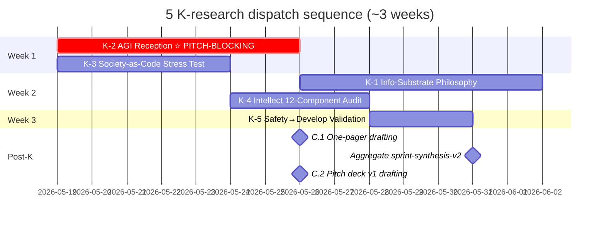

# META-PROMPT — Generate 5 K-Research Prompts + Launcher

ultrathink

Ты brigadier ROY swarm. Ruslan acked: создать **5 K-research prompts** (K-1 to K-5) + 5 _EXPLAIN siblings + 1 launcher document. Pattern mirror gold standard `ml-ai-engineers-deep-research`. **Это meta-generation run — НЕ execution самих researches.** После завершения Ruslan launches каждый из 5 researches через launcher.

═══════════════════════════════════════════════════════════
§0 MISSION
═══════════════════════════════════════════════════════════

**Цель:** Создать 5 K-research deep prompts + 5 _EXPLAIN + 1 launcher document со sequence-aware launch commands.

**Pattern parent (gold standard):**
- `prompts/ml-ai-engineers-deep-research-2026-05-18.md` (14 sections, 8 phases, ultrathink trigger, constitutional posture, halt conditions, acceptance criteria)
- Existing 5 deep research prompts 18.05 (Hackathon Platform / Recursive Engine / System Merger / Outreach Scalable / Education Layer) — pattern reference

**5 K-researches to generate (per batch-5 §3.3 / Summary-for-Ruslan §7):**

| # | Research | Priority | Time | Namespace | Critical-path role |
|---|---|---|---|---|---|
| **K-1** | Info-Substrate Philosophy Deep — Wheeler/Wolfram/Floridi/Bateson lineage | P2 | 1 week | `research/info-substrate-philosophy-deep-2026-05-19/` | Vision narrative L3 framing |
| **K-2 ⭐⭐** | **AGI Reception Market** — L1/L2/L3 reception к «AGI = collective substrate» + competitive landscape | **P1** | 1 week | `research/agi-reception-market-deep-2026-05-19/` | **PITCH-BLOCKING (C.1/C.2)** |
| **K-3** | Society-as-Code Stress Test — Toffler/Castells/Lessig + breakdown analysis | P2 | 4-5 days | `research/society-as-code-stress-test-2026-05-19/` | Positioning stress-test |
| **K-4** | Intellect 12-Component Audit — exhaustiveness + curriculum implications | P2 | 3-4 days | `research/intellect-12-component-audit-2026-05-19/` | Education Layer curriculum |
| **K-5** | Safety→Develop Cross-Disciplinary Validation — Maslow/SRE/Toyota/Knight/Taleb | P3 | 3 days | `research/safety-develop-validation-2026-05-19/` | Constitutional-grade validation |

**Launcher sequence:**
- Week 1 NOW: K-2 (critical) + K-3 (parallel)
- Week 2: K-1 + K-4 (parallel)
- Week 3: K-5 (single)

═══════════════════════════════════════════════════════════
§1 READ FIRST (ultrathink between blocks)
═══════════════════════════════════════════════════════════

### 1.1 Gold standard pattern:
- `prompts/ml-ai-engineers-deep-research-2026-05-18.md` (gold standard structure)
- `_EXPLAIN-ml-ai-engineers-deep-research-2026-05-18.md` (8 sections + mermaid)
- `research/ml-ai-engineers-2026-05-18/` (output quality reference)

### 1.2 Existing 5 deep research prompts (pattern reference):
- `prompts/hackathon-platform-deep-research-2026-05-18.md`
- `prompts/recursive-self-development-engine-deep-research-2026-05-18.md`
- `prompts/system-merger-protocol-deep-research-2026-05-18.md`
- `prompts/outreach-system-scalable-deep-research-2026-05-18.md`
- `prompts/education-layer-system-thinking-deep-research-2026-05-18.md`

### 1.3 Voice anchors (batch-5):
- `raw/voice-memos-2026-05-19-batch/audio_689@19-05-2026_03-35-50.md` (society-as-code)
- `raw/voice-memos-2026-05-19-batch/audio_690@19-05-2026_04-05-57.md` ⭐⭐ KEYSTONE (info-substrate / safety→develop / AGI redefinition / 1-year ambition)
- `raw/voice-memos-2026-05-19-batch/audio_691@19-05-2026_04-17-11.md` (intellect 12-component addendum)

### 1.4 Batch-5 output context:
- `reports/voice-pipeline-2026-05-19-batch-5/00-SUMMARY-FOR-RUSLAN.md`
- `reports/voice-pipeline-2026-05-19-batch-5/05-candidates-3-buckets.md` (§3.3 K-1-5 details)
- `reports/voice-pipeline-2026-05-19-batch-5/03-9-lenses-cross-analysis.md` (27 datapoints)

### 1.5 Phase 0 inventory:
- `reports/phase-0-fpf-scope/01-jetix-objects-inventory.md` (14 + O-21-51 candidates; O-46-51 batch-5)

### 1.6 Platform v2 (9th lens; just completed):
- `reports/jetix-platform-v2-2026-05-19/` (11 docs + 7 mermaid; 22 people / 32 resources / FPF 8-layer / 15 monetization / 20 outreach templates)

### 1.7 Constitutional baselines (READ-ONLY):
- CLAUDE.md / Foundation v1.0 / Pillar C 12 rules / shared/schemas / VISION-FUNDAMENTAL / 8 Octagon LOCK content

### 1.8 Memory rules:
- `~/.claude/projects/C--Users-49152/memory/feedback_fpf_lens_first.md` ⭐
- `~/.claude/projects/C--Users-49152/memory/feedback_breadth_not_selection.md` ⭐
- `~/.claude/projects/C--Users-49152/memory/feedback_prompt_explanation_required.md` ⭐
- `~/.claude/projects/C--Users-49152/memory/feedback_no_api_keys.md`

═══════════════════════════════════════════════════════════
§2 CONSTITUTIONAL POSTURE (meta-run)
═══════════════════════════════════════════════════════════

- R1 surface only — meta-generation = brigadier-scribe authoring prompts; NO autonomous strategic prose; NO LOCK promotions
- R2 Foundation READ-ONLY (reference в generated prompts)
- R6 each generated prompt enforces per-claim provenance в own output
- R11 Default-Deny
- R12 each generated research prompt has R12 alignment check section
- IP-1 STRICT (generated research prompts surface IP-1 in own constitutional posture)
- EP-5 F-grade explicit
- Append-only: new files в `prompts/` + `_EXPLAIN-*` + `_LAUNCH-*`
- FPF-lens-FIRST: each generated prompt has Phase 0 FPF lens scope
- Breadth-NOT-selection: each generated prompt enforces hypothesis bank breadth

═══════════════════════════════════════════════════════════
§3 PHASE 1 — Generate K-1 _EXPLAIN + prompt (Info-Substrate Philosophy)
═══════════════════════════════════════════════════════════

### K-1 spec:

**Topic:** Info-Substrate Philosophy Deep — historical lineage assessment

**Voice anchor:** audio_690 ¶ info-substrate hypothesis section

**Sources (WebFetch budget allocated):**
- Wheeler «It from Bit» (1989-1990 papers)
- Wolfram «A New Kind of Science» (2002) + «Wolfram Physics» (2020)
- Floridi «The Philosophy of Information» (2011) + «The Ethics of Information» (2013)
- Bateson «Mind and Nature» (1979) + «Steps to an Ecology of Mind» (1972)
- Adjacent: Shannon Information Theory / Norbert Wiener Cybernetics / Cybernetics 2.0 (von Foerster)

**8 phases:**
- Phase 0: FPF lens scope + IP-1 boundary
- Phase 1: Wheeler «It from Bit» deep mining (verbatim claims + adoption)
- Phase 2: Wolfram «Computational Universe» deep mining
- Phase 3: Floridi «Philosophy of Information» deep mining
- Phase 4: Bateson «Mind and Nature» deep mining
- Phase 5: Adjacent thinkers (Shannon / Wiener / von Foerster)
- Phase 6: Adoption assessment + opposing schools (materialism / dualism / functionalism counterarguments) + strongest critiques
- Phase 7: Hypothesis bank 20-30 H + Jetix positioning options (commit lineage / discreet / adapt)
- Phase 8: Cross-cutting synthesis + Summary ≤1500w + 6-8 mermaid

**Acceptance criteria:** 4 primary thinkers deep + 3-5 adjacent + 20+ H bank + Jetix positioning options + Vision narrative L3 framing recommendation

**Output namespace:** `research/info-substrate-philosophy-deep-2026-05-19/`

**Files to create:**
- `prompts/k-1-info-substrate-philosophy-deep-2026-05-19.md` (≥14 sections gold standard)
- `_EXPLAIN-k-1-info-substrate-philosophy-deep-2026-05-19.md` (8 sections + mermaid)

COMMIT 1: `[meta][k-research] Phase 1 K-1 Info-Substrate Philosophy prompt + EXPLAIN`

═══════════════════════════════════════════════════════════
§4 PHASE 2 — Generate K-2 _EXPLAIN + prompt (AGI Reception Market) ⭐ PITCH-BLOCKING
═══════════════════════════════════════════════════════════

### K-2 spec ⭐⭐ HIGHEST PRIORITY:

**Topic:** AGI Reception Market — how L1/L2/L3 audiences react к «AGI = collective substrate NOT computer» positioning + competitive landscape

**Voice anchor:** audio_690 ¶ AGI redefinition (system-level NOT computer-level)

**Sources (WebFetch + WebSearch budget):**
- Recent AGI definition discourse (2024-2026): OpenAI / Anthropic / DeepMind official AGI statements / Sutskever SSI / Karpathy threads
- AGI critics: Andrew Ng / Yann LeCun (different ASI/AGI views) / Marcus Hutter / Sutton
- Alternative AGI frames: Wolfram «Computational Universe» / Tang+Weyl Plurality (collective intelligence) / Sapienship «AI Agents» framing
- L1 engineers (ML/AI Twitter discourse / Hacker News / r/MachineLearning sentiments)
- L2 founders (a16z AI portfolios / Sequoia AI essays / Founders Fund stance)
- L3 investors (institutional perspective: Sequoia / a16z / Founders / Khosla Ventures AI thesis pieces 2024-2026)

**8 phases:**
- Phase 0: FPF lens scope + IP-1 boundary
- Phase 1: Current AGI discourse landscape mapping (Big Lab statements + critics + adjacent frames; 2024-2026)
- Phase 2: «AGI = collective substrate» framing analysis — who else uses this? Adjacent frames (Plurality / collective intelligence / Sapienship)
- Phase 3: L1 engineer reception simulation (ML/AI Twitter sentiment / HN / Reddit signals + expected critiques)
- Phase 4: L2 founder reception simulation (founder pitch reception patterns + expected friction)
- Phase 5: L3 investor reception simulation (institutional thesis fit + due diligence concerns)
- Phase 6: Competitive landscape — кто конкуренты на этой framing? Differentiation surface
- Phase 7: Hypothesis bank 25-35 H + reception mitigation strategies + pitch framing recommendations
- Phase 8: Cross-cutting synthesis + Summary ≤1500w + 8-10 mermaid

**Acceptance criteria:** 3 audience reception maps + competitive landscape (≥5 competitors / adjacent positioning) + 25+ H bank + pitch framing recommendations (anchor / hook / objection-handling) + C.1+C.2 drafting substrate ready

**Output namespace:** `research/agi-reception-market-deep-2026-05-19/`

**Files to create:**
- `prompts/k-2-agi-reception-market-deep-2026-05-19.md`
- `_EXPLAIN-k-2-agi-reception-market-deep-2026-05-19.md`

COMMIT 2: `[meta][k-research] Phase 2 K-2 AGI Reception Market prompt + EXPLAIN (PITCH-BLOCKING)`

═══════════════════════════════════════════════════════════
§5 PHASE 3 — Generate K-3 _EXPLAIN + prompt (Society-as-Code Stress Test)
═══════════════════════════════════════════════════════════

### K-3 spec:

**Topic:** Society-as-Code Metaphor Stress Test — historical precedent + breakdown analysis

**Voice anchor:** audio_689 ¶ society-as-code + Jetix-as-debugger metaphor

**Sources (WebFetch):**
- Toffler «The Third Wave» (1980) + «Powershift» (1990) — society-as-information-system precedent
- Castells «The Rise of Network Society» (1996) + «Communication Power» (2009) — networked society code-like analysis
- Lessig «Code is Law» (1999) + «Code v2» (2006) — legal precedent
- Adjacent: Donella Meadows «Thinking in Systems» / Boyd OODA / Vinge «Singularity»
- Breakdown analysis: где metaphor ломается (legal / cultural / ethical limits)

**8 phases:**
- Phase 0: FPF lens scope + metaphor primitive (U.MethodDescription metaphor-as-tool)
- Phase 1: Toffler deep mining (Third Wave + Powershift verbatim)
- Phase 2: Castells deep mining (Network Society + Communication Power)
- Phase 3: Lessig «Code is Law» deep mining
- Phase 4: Adjacent (Meadows / Boyd / Vinge)
- Phase 5: Breakdown analysis (where metaphor fails — humans-as-bugs caveat / determinism / agency / cultural diversity / Marxist counter)
- Phase 6: Jetix differentiation — what's NEW vs precedent + counter-arguments ready
- Phase 7: Hypothesis bank 20-30 H + Jetix positioning options (lean-in / qualify / pivot)
- Phase 8: Cross-cutting synthesis + Summary ≤1500w + 6-8 mermaid

**Acceptance criteria:** 4 primary thinkers deep + breakdown analysis (≥5 failure modes) + 20+ H + Jetix positioning options + counter-argument inventory

**Output namespace:** `research/society-as-code-stress-test-2026-05-19/`

**Files to create:**
- `prompts/k-3-society-as-code-stress-test-2026-05-19.md`
- `_EXPLAIN-k-3-society-as-code-stress-test-2026-05-19.md`

COMMIT 3: `[meta][k-research] Phase 3 K-3 Society-as-Code Stress Test prompt + EXPLAIN`

═══════════════════════════════════════════════════════════
§6 PHASE 4 — Generate K-4 _EXPLAIN + prompt (Intellect 12-Component Audit)
═══════════════════════════════════════════════════════════

### K-4 spec:

**Topic:** Intellect 12-Component Exhaustiveness Audit — what's missing + curriculum implications

**Voice anchor:** audio_690 + audio_691 ¶ intellect components (questions / proportion / goals)

**Sources (WebFetch):**
- Sternberg Triarchic Theory of Intelligence
- Cattell-Horn-Carroll model
- Gardner Multiple Intelligences (1983 + 1999 updates)
- Sternberg «Successful Intelligence»
- Modern AI capability frameworks (e.g. ARC-AGI benchmarks / Helm benchmark / MMLU)
- Adjacent: Goleman Emotional Intelligence / Deary individual differences

**8 phases:**
- Phase 0: FPF lens scope (intellect-as-system A.1 + capability A.17)
- Phase 1: Sternberg Triarchic deep mining
- Phase 2: Cattell-Horn-Carroll model deep
- Phase 3: Gardner Multiple Intelligences deep
- Phase 4: Modern AI capability frameworks + EI / Deary individual differences
- Phase 5: Audit — что 12 components missing? gap analysis vs each precedent
- Phase 6: Curriculum implications (Education Layer Tier 1 module map per 12 components)
- Phase 7: Hypothesis bank 20-30 H + curriculum design recommendations
- Phase 8: Cross-cutting synthesis + Summary ≤1500w + 6-8 mermaid

**Acceptance criteria:** 4 primary intelligence frameworks deep + gap analysis (missing components surface ≥3) + curriculum module map (12 components → educational modules) + 20+ H bank

**Output namespace:** `research/intellect-12-component-audit-2026-05-19/`

**Files to create:**
- `prompts/k-4-intellect-12-component-audit-2026-05-19.md`
- `_EXPLAIN-k-4-intellect-12-component-audit-2026-05-19.md`

COMMIT 4: `[meta][k-research] Phase 4 K-4 Intellect 12-Component Audit prompt + EXPLAIN`

═══════════════════════════════════════════════════════════
§7 PHASE 5 — Generate K-5 _EXPLAIN + prompt (Safety→Develop Validation)
═══════════════════════════════════════════════════════════

### K-5 spec:

**Topic:** Safety→Develop Ordering Cross-Disciplinary Validation

**Voice anchor:** audio_690 ¶ safety-before-develop principle

**Sources (WebFetch):**
- Maslow «Motivation and Personality» (1954) — hierarchy of needs (safety → ... → self-actualisation)
- Google SRE Book — error budget + reliability vs feature velocity
- Toyota Production System — Jidoka (stop-the-line for quality)
- Knight «Risk, Uncertainty and Profit» (1921) — risk vs uncertainty distinction
- Taleb «Antifragile» (2012) + «The Black Swan» (2007) — fragility-before-growth principle
- Adjacent: NASA safety-first ethos / nuclear plant safety hierarchies / aviation accident investigation discipline

**8 phases:**
- Phase 0: FPF lens scope + IP-1 boundary
- Phase 1: Maslow hierarchy of needs deep mining
- Phase 2: SRE error budget + reliability deep mining
- Phase 3: Toyota Jidoka deep mining
- Phase 4: Knight Risk vs Uncertainty deep mining
- Phase 5: Taleb Antifragile / Black Swan deep mining
- Phase 6: Cross-disciplinary corroboration synthesis — common pattern across all 5
- Phase 7: Hypothesis bank 15-25 H + Pillar C extension candidate evidence + AWAITING-APPROVAL packet substrate
- Phase 8: Cross-cutting synthesis + Summary ≤1500w + 6-8 mermaid

**Acceptance criteria:** 5 primary disciplines deep + common pattern identified + 15+ H bank + Pillar C extension evidence assembled (Safety→Develop как new rule 13 candidate) + AWAITING-APPROVAL packet substrate ready

**Output namespace:** `research/safety-develop-validation-2026-05-19/`

**Files to create:**
- `prompts/k-5-safety-develop-validation-2026-05-19.md`
- `_EXPLAIN-k-5-safety-develop-validation-2026-05-19.md`

COMMIT 5: `[meta][k-research] Phase 5 K-5 Safety→Develop Cross-Disciplinary Validation prompt + EXPLAIN`

═══════════════════════════════════════════════════════════
§8 PHASE 6 — Launcher document creation
═══════════════════════════════════════════════════════════

Create `_LAUNCH-5-K-RESEARCH-2026-05-19.md` в repo root.

**Document structure:**

```markdown
---
type: launcher-document
date: 2026-05-19 afternoon
session: launch-5-k-research-runs-2026-05-19
parent_meta: prompts/meta-generate-5-k-research-prompts-2026-05-19.md
status: READY-TO-LAUNCH (Ruslan executes copy-paste commands)
sequence_recommendation: K-2+K-3 Week 1; K-1+K-4 Week 2; K-5 Week 3
expected_completion: ~3 weeks total wall-clock (K-2 PITCH-BLOCKING = 1 week)
constitutional_posture: R1 + R6 + R11 + R12 + IP-1 + EP-5 + append-only + FPF-lens-FIRST + breadth-NOT-selection
language: russian + english
audience: Ruslan (primary operator)
---

# LAUNCHER — 5 K-Research Runs

> Copy-paste launcher для 5 K-research deep runs. Sequence: K-2+K-3 parallel Week 1 (K-2 pitch-blocking) → K-1+K-4 Week 2 → K-5 Week 3.

## §0 Pre-flight checks (run ONCE before each launch wave)

```bash
cd ~/jetix-os && \
git pull --rebase --autostash && \
git log --oneline -3 && \
tmux ls 2>/dev/null || echo "(no existing sessions)" && \
echo "Ready"
```

## §1 Week 1 — Launch K-2 + K-3 NOW (parallel)

### Run K-2 (PITCH-BLOCKING; 1 week) ⭐⭐

```bash
tmux new -s k2 "claude --dangerously-skip-permissions"
```

Внутри claude paste:
```
ultrathink. Прочитай _EXPLAIN-k-2-agi-reception-market-deep-2026-05-19.md и prompts/k-2-agi-reception-market-deep-2026-05-19.md. Выполни все 8 phases автономно, per-phase commit, final push origin main. Ruslan acked. Не пауза.
```

Detach: Ctrl-b → d

### Run K-3 (parallel; 4-5 days)

```bash
tmux new -s k3 "claude --dangerously-skip-permissions"
```

Внутри:
```
ultrathink. Прочитай _EXPLAIN-k-3-society-as-code-stress-test-2026-05-19.md и prompts/k-3-society-as-code-stress-test-2026-05-19.md. Выполни все 8 phases автономно, per-phase commit, final push origin main. Ruslan acked. Не пауза.
```

Detach: Ctrl-b → d

### Verify both running:
```bash
tmux ls
```

## §2 Week 2 — Launch K-1 + K-4 (parallel; after K-2 + K-3 complete)

[similar tmux + paste blocks для K-1 + K-4]

## §3 Week 3 — Launch K-5 (single; after K-1 + K-4 complete)

[tmux + paste для K-5]

## §4 Watch progress / Halt / Diagnostic

[same patterns как previous launcher: tmux attach / kill-session / git log]

## §5 Expected completion

- K-2: 1 week wall-clock / <€3.50
- K-3: 4-5 days / <€3
- K-1: 1 week / <€3.50
- K-4: 3-4 days / <€2.50
- K-5: 3 days / <€2
- **Total: ~3 weeks wall-clock / <€15**

## §6 Post-completion

После K-2 (Week 1):
- Pull → read K-2 Summary
- **C.1 one-pager + C.2 pitch deck v1 drafting NOW UNBLOCKED** (per batch-5 §8)
- Ruslan-authored Direction Card monetization (D-1 from Platform v2)

После всех 5 K (Week 3):
- Aggregate: новый sprint-synthesis-v2 (mirror sprint-synthesis-2026-05-19 pattern)
- All 6 promotion package docs drafting unlocked
- Step 6 Master Packaging closure

## §7 Sequence map


```

COMMIT 6: `[meta][k-research] Phase 6 launcher document _LAUNCH-5-K-RESEARCH-2026-05-19.md + sequence Gantt`

═══════════════════════════════════════════════════════════
§9 PHASE 7 — Meta summary + push
═══════════════════════════════════════════════════════════

Create `_META-K-RESEARCH-SUMMARY-FOR-RUSLAN-2026-05-19.md` в repo root:

- §0 TL;DR (≤200w)
- §1 5 K-research prompts created
- §2 5 _EXPLAIN siblings created
- §3 Launcher document
- §4 Sequence recommendation (K-2 PITCH-BLOCKING first; K-3 parallel; etc.)
- §5 Estimated total cost / time
- §6 Post-completion: C.1+C.2 unblock + aggregate

Word budget: ≤1500.

COMMIT 7: `[meta][k-research] Phase 7 Meta-summary + final push origin main`

`git push origin main`

Final echo: `DONE Phase 7 — N commits / M files / launcher ready / Ruslan: cat _LAUNCH-5-K-RESEARCH-2026-05-19.md`

═══════════════════════════════════════════════════════════
§10 HALT CONDITIONS
═══════════════════════════════════════════════════════════

- R1/R2/R6/R11 violation → immediate halt + escalate
- Cost approaching €3 → halt + ask (meta-run should be cheap)
- Single phase >10min wall → log + continue
- Total run >45min → halt at phase boundary + escalate
- Generated prompt quality below gold standard → halt + diagnose

═══════════════════════════════════════════════════════════
§11 DON'T (anti-list)
═══════════════════════════════════════════════════════════

❌ Modify existing concept docs / 5 deep research / Platform v2 / batch-5 outputs
❌ Touch Foundation / Pillar C / Schemas / VISION-FUNDAMENTAL / 8 Octagon LOCK content
❌ Launch any of 5 K-researches auto (Ruslan acts via launcher)
❌ Generate prompts shallower than ml-ai-engineers gold standard (≥14 sections each)
❌ Skip FPF lens FIRST in any generated prompt
❌ Skip breadth-NOT-selection в hypothesis bank specifications
❌ Skip R12 alignment check section
❌ Skip IP-1 STRICT в K-2 (AGI redefinition has IP-1 implications)
❌ Pause за подтверждениями — Ruslan ack явный

═══════════════════════════════════════════════════════════
§12 ACCEPTANCE CRITERIA
═══════════════════════════════════════════════════════════

- [ ] 5 K-research prompts created в `prompts/` (≥14 sections each)
- [ ] 5 _EXPLAIN siblings created в repo root (8 sections each + mermaid)
- [ ] 1 launcher document `_LAUNCH-5-K-RESEARCH-2026-05-19.md`
- [ ] 1 meta-summary `_META-K-RESEARCH-SUMMARY-FOR-RUSLAN-2026-05-19.md`
- [ ] Each generated prompt: FPF lens FIRST + breadth-NOT-selection + 8 phases + halt conditions + acceptance criteria + R12 alignment + IP-1 STRICT (where applicable)
- [ ] Launcher document copy-paste-ready
- [ ] Sequence Gantt mermaid в launcher §7
- [ ] All commits per-phase (7 commits total)
- [ ] Final push origin main
- [ ] Constitutional posture preserved
- [ ] 5 K-research prompts ≥ gold standard quality
- [ ] Cross-link к batch-5 voice anchors (audio_689/690/691) + Platform v2 в each prompt

═══════════════════════════════════════════════════════════
§13 ACCEPTANCE TEST (self-check)
═══════════════════════════════════════════════════════════

After Phase 7, verify:
- [ ] Ruslan can `cat _LAUNCH-5-K-RESEARCH-2026-05-19.md` and copy-paste launch commands per week
- [ ] Each generated prompt is parallel-safe (different namespaces)
- [ ] No interdependencies between 5 K-runs (each completes independently)
- [ ] K-2 is clearly marked PITCH-BLOCKING
- [ ] Sequence Gantt is clear (Week 1 → 2 → 3)

═══════════════════════════════════════════════════════════
§14 START
═══════════════════════════════════════════════════════════

ultrathink. Read §1 inputs. Execute Phases 1-7 sequentially. Per-phase commit. Final push origin main.

Жми.

---

*Brigadier meta-prompt 2026-05-19 afternoon. Generates 5 K-research prompts + launcher. After this run: Ruslan launches K-2 + K-3 (Week 1) → K-1 + K-4 (Week 2) → K-5 (Week 3) → C.1+C.2 unblocked + aggregate.*
