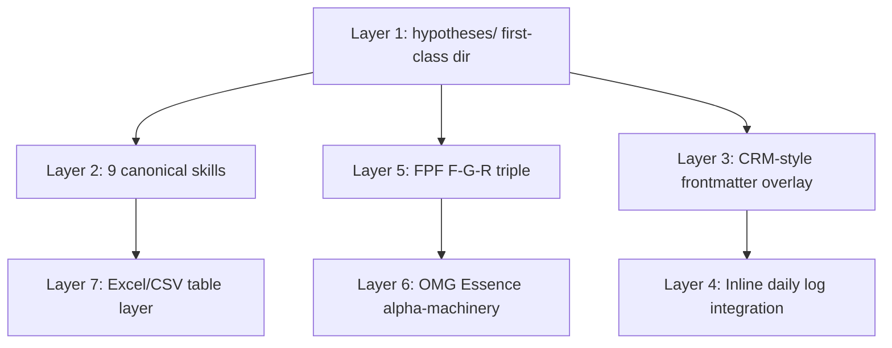
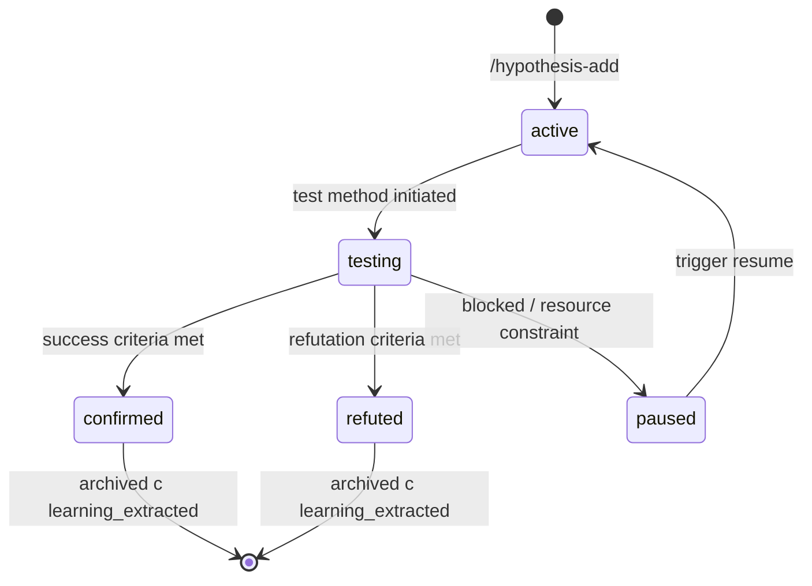

# Hypotheses Architecture Scaffolding — Deep Prompt

> **Trigger:** Ruslan ack 2026-05-20 evening — «самый ебейший вариант + альфы Левенчук всё подряд + Excel + CRM-style + inline daily log + 1000+ hypotheses target». Per-phase commit + push. NOT plan mode — execute autonomously.

---

## §0 Pre-flight (mandatory)

ПЕРЕД Phase 0 прочитай:
1. **EXPLAIN:** `prompts/explanations/_EXPLAIN-scaffolding-hypotheses-architecture-2026-05-20.md`
2. **Decision record:** `decisions/REFLECTION-INBOX-2026-05-16.md` §APPEND-2026-05-20-evening-hypothesis-tables-decision
3. **Decision analysis:** `daily-logs/_HYPOTHESIS-TABLES-DECISION-2026-05-20.md` (5 options analysis)
4. **Memory rules:**
   - `feedback_fpf_lens_first.md` — FPF lens Phase 0 mandatory
   - `feedback_research_pool_pattern.md` — surface options не auto-promote
   - `feedback_no_unsolicited_alternatives.md` — execute selected architecture
   - `feedback_constitutional.md` — R1 sole strategist; brigadier scaffolds structure not content
5. **Substrate cross-link:**
   - `wiki/concepts/method-systems-thinking.md` §APPEND batch-8 (meta-method + hypothesis cycle)
   - `research/levenchuk-books-distillation-2026-05-20/06-cross-link-к-jetix-substrate.md` §2.1 (метод), §2.10 (alphas), §3.1 (alpha-machinery GAP)
   - `raw/external/levenchuk-books-2026-05-20/converted/03-metodologiya-2025.md` (Методология 2025 Гл. 4 + 6 verbatim)
   - `crm/_schema/` + `crm/_templates/` (analogous CRM pattern для skills)
   - `shared/schemas/` (FPF F-G-R)
   - Foundation Part 5 + Part 7

---

## §1 Phase 0 — Pre-flight + FPF lens (10-15m)

**Output:** `hypotheses/_BUILD-LOG/phase-0-preflight.md`

### Steps
1. Read ALL `_EXPLAIN` + decision record + substrate refs
2. Verify Python tools availability:
   ```bash
   python3 -c "import openpyxl; print(openpyxl.__version__)"
   python3 -c "import pandas; print(pandas.__version__)"
   # если fail → pip install openpyxl pandas
   ```
3. Verify CRM analogous pattern accessible:
   ```bash
   ls crm/_schema/
   ls crm/_templates/
   ls .claude/skills/ | grep -E "crm-"
   ```
4. Declare FPF lens scope:
   - **Object:** hypotheses-tables substrate = first-class methodology infrastructure для Jetix
   - **FPF layer:** Part B.3 F-G-R primitives integrated into frontmatter
   - **Acceptance:** 9 phases done + 7 layers operational + ≥3 sample hypotheses + 2 mermaid + skills functional

Commit: `[hypotheses-scaffold] Phase 0 pre-flight + FPF lens + tools check`

---

## §2 Phase 1 — Layer 1: `hypotheses/` dir + schema + templates (60-90m)

**Output:** Full `hypotheses/_schema/` + `hypotheses/_templates/` + status dirs + `_log.md` + `_index.md` initial

### Steps

1. **Mkdir structure:**
```bash
mkdir -p hypotheses/{_schema,_templates,active,testing,confirmed,refuted,paused,alphas/state-graphs,tables,samples,docs/diagrams,_BUILD-LOG}
```

2. **`_schema/hypothesis.schema.yaml`** — define frontmatter schema:
```yaml
# Hypothesis frontmatter schema
required_fields:
  - id          # H-NNN unique
  - title
  - slug
  - status      # active | testing | confirmed | refuted | paused
  - category    # see categories.yaml
  - lifecycle   # short | medium | long
  - created
  - owner
  - fpf_F       # F2..F8
  - fpf_G       # group scope
  - fpf_R       # low | medium | high
  - test_method
  - success_criteria
  - refutation_criteria

optional_fields:
  - alphas      # list per alphas.yaml
  - strategic_region  # per fpf-strategic-regions.yaml
  - resources_needed
  - linked_artefacts
  - linked_hypotheses
  - outcome     # post-closure
  - learning_extracted

# Standard sections (Russian primary)
standard_sections:
  - "## Гипотеза"
  - "## Метод теста"
  - "## Условия / scope"
  - "## Результаты (post-closure)"
  - "## Cross-cite Левенчук (optional)"
```

3. **`_schema/status.yaml`**:
```yaml
statuses:
  active:    "Hypothesis surfaced; not yet testing"
  testing:   "Test in progress; results emerging"
  confirmed: "Test confirmed hypothesis (true within scope)"
  refuted:   "Test refuted hypothesis (false within scope)"
  paused:    "Testing paused; revisit trigger conditions documented"
transitions:
  active → testing: "Test method initiated"
  testing → confirmed: "Success criteria met"
  testing → refuted: "Refutation criteria met"
  testing → paused: "Resources / dependency block"
  paused → active: "Trigger condition met; resume"
```

4. **`_schema/categories.yaml`** — 8 primary categories:
```yaml
categories:
  outreach:        "Outreach pipeline / pitches / cascade"
  engineering:     "Technical / Jetix infrastructure / tooling"
  method:          "Methodology / method-systems-thinking / meta-method"
  pitch:           "Pitch deck / one-pager / promotion docs"
  business:        "Monetization / org form / partnership economics"
  personal-dev:    "Mastery / persistence / daily anchor / habits"
  partnership:     "Specific partner / relationship / collaboration"
  fpf-extension:   "FPF spec extensions / Левенчук cross-pollination"
```

5. **`_schema/alphas.yaml`** — 7 OMG Essence alphas:
```yaml
# OMG Essence 2.0:2024 alphas — per Левенчук Методология 2025 Гл. 4
# 7 essential progress dimensions of any endeavor
alphas:
  stakeholder:
    purpose: "Entities affected by / interested in outcome"
    state_graph: [recognized, represented, involved, in_agreement, satisfied_for_deployment, satisfied_in_use]
  opportunity:
    purpose: "Reason for the endeavor / problem space"
    state_graph: [identified, solution_needed, value_established, viable, addressed, benefit_accrued]
  requirements:
    purpose: "What outcome must achieve"
    state_graph: [conceived, bounded, coherent, acceptable, addressed, fulfilled]
  software-system:
    purpose: "Software / artifact being created"  # adapted for Jetix substrate
    state_graph: [architecture_selected, demonstrable, usable, ready, operational, retired]
  work:
    purpose: "Activity being undertaken"
    state_graph: [initiated, prepared, started, under_control, concluded, closed]
  team:
    purpose: "Group performing the work"
    state_graph: [seeded, formed, collaborating, performing, adjourned]
  way-of-working:
    purpose: "Practices / tools used"
    state_graph: [principles_established, foundation_established, in_use, in_place, working_well, retired]
```

6. **`_schema/ownership.yaml`**:
```yaml
ownership_types:
  ruslan: "Direct Ruslan ownership (R1 strategist)"
  brigadier: "brigadier-scribe autonomous (Cloud Cowork)"
  agent-<id>: "Specific agent ownership (e.g., agent-mgmt-expert)"
  partner-<handle>: "External partner (e.g., partner-levenchuk)"
```

7. **`_schema/outputs.yaml`** — deliverable taxonomy:
```yaml
output_types:
  decision: "Strategic decision recorded"
  artifact: "Document / code / data created"
  learning: "Compound learning extracted"
  pivot: "Direction change in upstream work"
  validation: "Existing direction confirmed empirically"
```

8. **`_schema/resources.yaml`** — link к Platform v2 §3 32-resource framework:
```yaml
# Per reports/jetix-platform-v2-2026-05-19/ §3
resource_types:
  R1-money: "Financial capital"
  R2-time: "Person-hours"
  R3-attention: "Cognitive load (Pillar C §4.2 max 20 budget)"
  R4-trust: "Reputation / relationships"
  R5-knowledge: "Domain expertise / Jetix substrate"
  R6-method: "Process / how-to"
  # ... 32 total — full reference в Platform v2 §3
```

9. **`_schema/fpf-strategic-regions.yaml`** — 5 регионов Левенчук Методология Гл. 6:
```yaml
# Per Методология 2025 Гл. 6 — 5 регионов стратегирования
strategic_regions:
  robinson:
    name: "Робинзон Крузо"
    description: "Изолированный агент; нет других стейкхолдеров; пример: solo personal-dev hypothesis"
  catallactic:
    name: "Каталлактика"
    description: "Mises экономический обмен; добровольное взаимодействие; пример: outreach hypothesis"
  war:
    name: "Война"
    description: "Adversarial; zero-sum; пример: competitive positioning hypothesis"
  game-theory:
    name: "Теория игр"
    description: "Strategic interactions с mixed motives; пример: partnership negotiation hypothesis"
  unknown:
    name: "Неизвестное"
    description: "Genuine novelty / exploration; пример: deep FPF research hypothesis"
```

10. **`_schema/fgr-triple.yaml`** — FPF B.3 reference:
```yaml
# Per FPF spec (raw/external/ailev-FPF/FPF-Spec.md B.3)
fpf_F:
  F2: "Surface observation / pattern noticed"
  F3: "Conceptual claim with reasoning"
  F4: "Empirically supported (some evidence)"
  F5: "LOCKED foundation primitive"
  F6: "Inter-Foundation consistent"
  F8: "Constitutional / Default-Deny canonical"

fpf_R:
  low: "Speculative / single observation"
  medium: "Multi-observation / corroborated"
  high: "Empirically verified / replicated"
```

11. **`_templates/hypothesis.md`** — base template:
```markdown
---
id: H-XXX
title: <одна строка statement>
slug: <kebab-case-slug>
status: active
category: <see _schema/categories.yaml>
lifecycle: medium
created: 2026-05-20
updated: 2026-05-20
owner: ruslan

# FPF F-G-R triple
fpf_F: F2
fpf_G: <group scope>
fpf_R: low

# OMG Essence alphas (optional)
alphas: []

# Strategic region (Левенчук)
strategic_region: catallactic

# Resources
resources_needed: []

# Cross-link
linked_artefacts: []
linked_hypotheses: []

# Testing
test_method: |
  <как проверим>
test_scope: |
  <где применимо>
success_criteria: |
  <observable / verifiable>
refutation_criteria: |
  <что would falsify>

# Outputs (post-closure)
outcome: null
learning_extracted: null
---

# H-XXX — <Title>

## Гипотеза
[verbose statement]

## Метод теста
[steps]

## Условия / scope
[where applicable]

## Результаты (post-closure)
*To be filled when status → confirmed/refuted/paused*

## Cross-cite Левенчук (optional)
*If relevant — Методология Гл. X / СМ Т Y Гл. Z reference*
```

12. **`_templates/hypothesis-short.md`** (1-7d) — minimal version
13. **`_templates/hypothesis-medium.md`** (1-3mo) — base = default
14. **`_templates/hypothesis-long.md`** (3-6mo+) — extended sections для long-running

15. **`_log.md`** — initial header:
```markdown
# Hypotheses Audit Log

> Append-only chronological log всех hypothesis state changes.

## 2026-05-20 — Architecture launched
- Layer 1 scaffolding complete
- ...
```

16. **`_index.md`** — initial placeholder (regenerated through skill later)

Commit: `[hypotheses-scaffold] Phase 1 Layer 1 dir + schema (10 files) + templates (4) + log + index`

---

## §3 Phase 2 — Layer 2: 9 canonical skills (120-180m)

**Output:** `.claude/skills/hypothesis-*.md` × 9 + canonical registration

### Skills к build (CRM-analogous pattern; see `.claude/skills/crm-add.md` if exists для format)

1. **`/hypothesis-add <slug> [--category CAT] [--owner OWNER] [--lifecycle short|medium|long]`**
   - Scaffolds new H-NNN file в `active/` with template
   - Auto-increments H-NNN counter (next available)
   - Frontmatter pre-filled (created date / status=active / etc.)
   - Output: file path + ID assigned

2. **`/hypothesis-update <H-NNN> [--status STATUS] [--reason REASON]`**
   - Updates frontmatter status (active/testing/confirmed/refuted/paused)
   - If status transition implies dir move (e.g., active→confirmed) — execute move
   - Append entry к `_log.md` (timestamp + change + reason)
   - Output: confirmation + new file path

3. **`/hypothesis-close <H-NNN> --outcome OUTCOME [--learning LEARNING]`**
   - Move к `confirmed/` or `refuted/` or `paused/`
   - Fill outcome + learning_extracted frontmatter
   - Append `_log.md` entry
   - Output: archived path + summary

4. **`/hypothesis-dash [--filter active|testing|...] [--category CAT] [--owner OWNER]`**
   - Aggregate view of all hypotheses
   - Default: active + testing (current focus)
   - Sortable / filterable
   - Output: markdown table OR JSON list

5. **`/hypothesis-search <query>`**
   - Grep across all hypothesis MDs
   - Search title / body / linked_artefacts
   - Output: ranked matches

6. **`/hypothesis-stuck [--days 14]`**
   - Find hypotheses status=testing с updated >N days ago
   - Surface для review
   - Output: list + recommended actions

7. **`/hypothesis-link <H-NNN> <artefact-path>`**
   - Add к linked_artefacts frontmatter
   - Also reverse-add — patch host artefact frontmatter `linked_hypotheses: [H-NNN]`
   - Output: confirmation both files updated

8. **`/hypothesis-build-table`**
   - Rebuild `tables/hypotheses.xlsx` + `.csv` from all hypothesis MDs
   - Aggregate frontmatter → tabular form
   - Output: file path + row count

9. **`/hypothesis-alpha-state <H-NNN> [--alpha ALPHA --state STATE]`**
   - Update OMG Essence alpha state for hypothesis
   - Per `_schema/alphas.yaml` state-graphs
   - Append к alpha state-graphs/<H-NNN>-alpha-trail.md
   - Output: confirmation + state-graph visualization

### Skill MD format example (canonical):

```markdown
---
name: hypothesis-add
description: Scaffold new hypothesis в active/ status dir с template
trigger: User wants to track a hypothesis
---

# /hypothesis-add

## Purpose
Create new H-NNN hypothesis file в hypotheses/active/ с pre-filled frontmatter.

## Arguments
- `<slug>` (required): kebab-case identifier
- `--category CAT` (optional): see _schema/categories.yaml; default: prompts Ruslan
- `--owner OWNER` (optional): default: ruslan
- `--lifecycle short|medium|long` (optional): default: medium

## Workflow
1. Read `_schema/hypothesis.schema.yaml` для frontmatter requirements
2. Determine next H-NNN ID by scanning existing files (max + 1)
3. Read `_templates/hypothesis-<lifecycle>.md` template
4. Substitute: ID / slug / created / owner / lifecycle / category
5. Write к `hypotheses/active/H-NNN-<slug>.md`
6. Append к `_log.md`: «`2026-05-20 — H-NNN created by <owner> via /hypothesis-add`»
7. Output: full file path + reminder Ruslan editing prompts

## Examples
```bash
/hypothesis-add partnership-frame-better-than-cheatcode-l2 --category outreach --lifecycle medium
# Output: hypotheses/active/H-002-partnership-frame-better-than-cheatcode-l2.md
```
```

Repeat similar для all 9 skills. ~15-20 min per skill = 2-3h.

Commit: `[hypotheses-scaffold] Phase 2 Layer 2 9 canonical skills (.claude/skills/hypothesis-*)`

---

## §4 Phase 3 — Layer 5: FPF F-G-R integration (30-45m)

**Output:** Schema already includes F-G-R (Phase 1). Phase 3 ensures consistency.

### Steps
1. Verify `_schema/hypothesis.schema.yaml` required_fields include fpf_F / fpf_G / fpf_R
2. Cross-check `shared/schemas/f-g-r.json` (если existing) для compatibility
3. Document FPF integration в `docs/fpf-integration.md`:
   - When each F-grade applies (F2 surface vs F3 conceptual etc.)
   - Group scope (G) examples (Jetix-foundation / outreach-experiment / personal-dev / etc.)
   - Reliability (R) progression rules — when low → medium → high
4. Add FPF validation к `/hypothesis-add` skill — block creation если F-G-R missing
5. Example: H-001 sample должна demonstrate F-G-R triple properly

Commit: `[hypotheses-scaffold] Phase 3 Layer 5 FPF F-G-R integration mandatory frontmatter triple`

---

## §5 Phase 4 — Layer 6: OMG Essence alpha-machinery (60-90m)

**Output:** `hypotheses/alphas/` populated + state-graphs + 5 регионов стратегирования mappings

### Steps

1. **`alphas/_alphas-overview.md`** — explanation:
   - OMG Essence 2.0:2024 background (per Левенчук Методология Гл. 4)
   - 7 alphas как progress-tracking primitives
   - State-graphs per alpha (см. `_schema/alphas.yaml`)
   - Adaptation к Jetix substrate (software-system → Jetix artifacts / Jetix education content)
   - Cross-cite Левенчук directly

2. **Per alpha file** `alphas/<alpha>.md`:
   - Purpose / definition
   - State-graph diagram (mermaid)
   - Example state transitions
   - How to apply к hypothesis tracking

3. **`alphas/state-graphs/`** — mermaid diagrams per alpha:
   - stakeholder-state-graph.md
   - opportunity-state-graph.md
   - requirements-state-graph.md
   - software-system-state-graph.md
   - work-state-graph.md
   - team-state-graph.md
   - way-of-working-state-graph.md

4. **5 регионов стратегирования mapping:**
   - Reference `_schema/fpf-strategic-regions.yaml`
   - Document how each region informs hypothesis testing approach в `docs/alpha-machinery-guide.md`

5. **`/hypothesis-alpha-state` skill validation:**
   - Test: assign hypothesis к alpha + state
   - Verify transition rules respected per alpha state-graph

6. **Sample H-005 hypothesis** demonstrating alpha-machinery usage:
   - Multiple alphas with explicit states
   - Strategic region per Левенчук

Commit: `[hypotheses-scaffold] Phase 4 Layer 6 OMG Essence alpha-machinery + 5 регионов стратегирования + 7 state-graphs`

---

## §6 Phase 5 — Layer 7: Excel/CSV table layer (45-60m)

**Output:** `hypotheses/tables/` populated + `_build-table.py` operational

### Steps

1. **`hypotheses/tables/_build-table.py`** — Python script:
```python
"""
Rebuild hypotheses.xlsx + hypotheses.csv from MD files в hypotheses/{active,testing,confirmed,refuted,paused}/

Usage:
  cd ~/jetix-os
  python3 hypotheses/tables/_build-table.py
"""
import os
import yaml  # or frontmatter library
from pathlib import Path
try:
    import openpyxl
    from openpyxl.styles import PatternFill, Font
    HAS_OPENPYXL = True
except ImportError:
    HAS_OPENPYXL = False

try:
    import pandas as pd
    HAS_PANDAS = True
except ImportError:
    HAS_PANDAS = False

HYPOTHESES_DIR = Path("hypotheses")
STATUS_DIRS = ["active", "testing", "confirmed", "refuted", "paused"]
TABLES_DIR = HYPOTHESES_DIR / "tables"

def parse_frontmatter(md_path):
    """Extract YAML frontmatter from markdown file."""
    with open(md_path, encoding="utf-8") as f:
        content = f.read()
    if not content.startswith("---"):
        return None
    end = content.find("\n---", 4)
    if end == -1:
        return None
    return yaml.safe_load(content[4:end])

def collect_hypotheses():
    """Walk все status dirs + collect hypothesis frontmatter."""
    rows = []
    for status_dir in STATUS_DIRS:
        path = HYPOTHESES_DIR / status_dir
        if not path.exists():
            continue
        for md_file in path.glob("H-*.md"):
            fm = parse_frontmatter(md_file)
            if fm:
                fm["_file"] = str(md_file)
                fm["_status_dir"] = status_dir
                rows.append(fm)
    return rows

def write_csv(rows, csv_path):
    if not rows:
        return
    if HAS_PANDAS:
        df = pd.DataFrame(rows)
        df.to_csv(csv_path, index=False, encoding="utf-8")
    else:
        # fallback manual CSV
        import csv
        fieldnames = sorted({k for row in rows for k in row.keys()})
        with open(csv_path, "w", encoding="utf-8", newline="") as f:
            w = csv.DictWriter(f, fieldnames=fieldnames)
            w.writeheader()
            for row in rows:
                w.writerow(row)

def write_xlsx(rows, xlsx_path):
    if not HAS_OPENPYXL:
        print("openpyxl not available — skipping xlsx")
        return
    wb = openpyxl.Workbook()
    ws = wb.active
    ws.title = "Hypotheses"
    
    # Header row
    if rows:
        fieldnames = sorted({k for row in rows for k in row.keys()})
        for col_idx, name in enumerate(fieldnames, 1):
            cell = ws.cell(row=1, column=col_idx, value=name)
            cell.font = Font(bold=True)
            cell.fill = PatternFill("solid", fgColor="DDDDDD")
        
        # Data rows
        for row_idx, row in enumerate(rows, 2):
            for col_idx, name in enumerate(fieldnames, 1):
                val = row.get(name, "")
                if isinstance(val, (list, dict)):
                    val = str(val)
                ws.cell(row=row_idx, column=col_idx, value=val)
        
        # Auto-width (rough)
        for col in ws.columns:
            ws.column_dimensions[col[0].column_letter].width = 20
    
    wb.save(xlsx_path)

def main():
    rows = collect_hypotheses()
    print(f"Collected {len(rows)} hypotheses")
    
    TABLES_DIR.mkdir(exist_ok=True)
    write_csv(rows, TABLES_DIR / "hypotheses.csv")
    write_xlsx(rows, TABLES_DIR / "hypotheses.xlsx")
    
    print(f"Wrote {TABLES_DIR}/hypotheses.csv + .xlsx")

if __name__ == "__main__":
    main()
```

2. **`hypotheses/tables/alphas-state-graph.xlsx`** — separate Excel для alpha state tracking:
   - Sheet per alpha (7 sheets)
   - Per row: hypothesis ID / current state / state history

3. **`hypotheses/tables/README.md`** — usage documentation:
   - How to rebuild
   - How to filter
   - Claude Code workflow with xlsx (openpyxl read/write examples)
   - CSV alternative if xlsx unavailable

4. **Test build** — execute `_build-table.py` после Phase 8 samples ready

Commit: `[hypotheses-scaffold] Phase 5 Layer 7 Excel/CSV + build script + alphas state-graph table`

---

## §7 Phase 6 — Layer 3: CRM-style overlay (45-60m)

**Output:** `tools/build-hypothesis-views.py` + frontmatter schema extension

### Steps

1. **Frontmatter schema extension** для existing files (wiki / decisions / outreach / etc.):
   - Add `linked_hypotheses: [H-NNN]` field (optional)
   - Document в `hypotheses/docs/crm-style-overlay.md`

2. **`tools/build-hypothesis-views.py`**:
```python
"""
Aggregate hypothesis-linked content across all markdown files в repo.

Walks repo, finds frontmatter linked_hypotheses field, builds:
- crm/hypothesis-views/by-hypothesis.md (H-NNN → list of linked artefacts)
- crm/hypothesis-views/by-artefact-type.md
- crm/hypothesis-views/orphans.md (hypotheses без artefacts linked)
"""
import os
import yaml
from pathlib import Path
from collections import defaultdict

REPO_ROOT = Path(".")
EXCLUDE_DIRS = {".git", "node_modules", "__pycache__", "venv", ".claude/worktrees"}

def parse_frontmatter(md_path):
    try:
        with open(md_path, encoding="utf-8") as f:
            content = f.read()
        if not content.startswith("---"):
            return None
        end = content.find("\n---", 4)
        if end == -1:
            return None
        return yaml.safe_load(content[4:end])
    except Exception:
        return None

def walk_repo():
    """Walk all .md files in repo, collect linked_hypotheses."""
    hypothesis_to_files = defaultdict(list)
    for root, dirs, files in os.walk(REPO_ROOT):
        dirs[:] = [d for d in dirs if d not in EXCLUDE_DIRS]
        for fname in files:
            if not fname.endswith(".md"):
                continue
            path = Path(root) / fname
            fm = parse_frontmatter(path)
            if fm and "linked_hypotheses" in fm:
                hyps = fm["linked_hypotheses"]
                if isinstance(hyps, list):
                    for h in hyps:
                        hypothesis_to_files[h].append(str(path))
    return hypothesis_to_files

def write_views(mapping):
    out_dir = Path("crm/hypothesis-views")
    out_dir.mkdir(parents=True, exist_ok=True)
    
    # by-hypothesis.md
    with open(out_dir / "by-hypothesis.md", "w", encoding="utf-8") as f:
        f.write("# Hypotheses → Linked Artefacts\n\n")
        for h_id in sorted(mapping.keys()):
            f.write(f"## {h_id}\n")
            for fpath in mapping[h_id]:
                f.write(f"- {fpath}\n")
            f.write("\n")

def main():
    mapping = walk_repo()
    write_views(mapping)
    print(f"Built views for {len(mapping)} hypotheses")

if __name__ == "__main__":
    main()
```

3. **Skill registration:** Add `/build-hypothesis-views` skill `.claude/skills/build-hypothesis-views.md`

4. **Document** в `hypotheses/docs/crm-style-overlay.md`:
   - When to use `linked_hypotheses` frontmatter (vs hypothesis file's `linked_artefacts`)
   - Bidirectional pattern: H-NNN linked_artefacts ↔ artefact linked_hypotheses
   - `/hypothesis-link` skill maintains both sides

Commit: `[hypotheses-scaffold] Phase 6 Layer 3 CRM-style overlay frontmatter + build-hypothesis-views.py + skill`

---

## §8 Phase 7 — Layer 4: Inline daily log integration (15-30m)

**Output:** `daily-logs/_PLAN-OF-DAY-template.md` updated + docs

### Steps

1. **`daily-logs/_PLAN-OF-DAY-template.md`** — add section:
```markdown
## §X Active Hypotheses (inline tracking)

Per `hypotheses/active/` + `testing/` current focus (top 3-5):

- **H-NNN** [<category>]: <one-line summary> — status: <status> — next: <next action>
- **H-NNN** [...]
- ...

### Closed last 7 days
- **H-NNN**: <outcome> — learning: <key insight>
```

2. **`hypotheses/docs/inline-daily-log-integration.md`** — usage docs

3. **Weekly reflection ritual extension** (per A-7 in Execution Plan FINAL):
   - Section: «Hypothesis tracking summary»
   - `/hypothesis-dash` output integrated

Commit: `[hypotheses-scaffold] Phase 7 Layer 4 inline daily log integration + template update`

---

## §9 Phase 8 — Sample data + 2 mermaid + docs + Summary + push (30-45m)

**Outputs:**

1. **`hypotheses/samples/H-001-meta-method-success-formula-applicable-cross-domain.md`** — fully filled sample (from method-systems-thinking §APPEND batch-8 KA-17 substrate):
   - Category: method
   - Lifecycle: long
   - Owner: ruslan
   - F: F3 / G: jetix-foundation / R: medium
   - Alphas: way-of-working + work
   - Strategic region: catallactic
   - Test method: apply meta-method к 3 non-engineering domains (Education / Personal-dev / Pitch development)
   - Success: each domain gets clean cycle execution
   - Cross-cite: Левенчук Методология Гл. 4 MG4 ⭐⭐⭐

2. **`hypotheses/samples/H-002-partnership-frame-better-than-cheatcode-l2.md`** — outreach hypothesis:
   - Category: outreach
   - Lifecycle: medium
   - F: F2 / G: outreach-pipeline / R: low
   - Alphas: stakeholder
   - Strategic region: catallactic
   - Linked artefacts: wiki/concepts/pre-existing-partnership-positioning.md + wiki/ideas/cheat-code-positioning.md
   - Linked hypotheses: H-005

3. **`hypotheses/samples/H-003-3tier-funnel-3to6-months-optimal.md`** — education hypothesis:
   - Category: engineering + business
   - Lifecycle: long
   - Linked: wiki/concepts/project-of-humanity-positioning.md (3-tier funnel §APPEND batch-8)

4. **`hypotheses/samples/H-004-imagination-as-intellect-component.md`** — methodology hypothesis from O-101 Tier B:
   - Category: method + personal-dev
   - F: F2 / G: intellect-stack / R: low
   - Cross-cite: K-4 Intellect-12-Component Audit + Левенчук Интеллект-стек Гл. 1

5. **`hypotheses/samples/H-005-method-as-1st-class-object-recursive-engine.md`** — recursive engine corroboration:
   - Category: method + engineering
   - F: F3 / G: jetix-foundation / R: medium
   - Alphas: way-of-working
   - Cross-cite: audio_703 + Левенчук Методология Гл. 4

6. **`hypotheses/docs/architecture-overview.md`** — 7-layer architecture document с references к each layer
7. **`hypotheses/docs/workflow-guide.md`** — how to add / update / close hypothesis
8. **`hypotheses/docs/fpf-integration.md`** — F-G-R usage
9. **`hypotheses/docs/alpha-machinery-guide.md`** — OMG Essence application
10. **`hypotheses/docs/excel-table-usage.md`** — xlsx/csv workflow
11. **`hypotheses/docs/inline-daily-log-integration.md`** — Layer 4 docs

12. **2 mermaid diagrams:**

`hypotheses/docs/diagrams/01-7-layer-architecture.md`:


`hypotheses/docs/diagrams/02-hypothesis-lifecycle.md`:


13. **Run `/hypothesis-build-table`** — execute Phase 5 script на 5 samples — generate `hypotheses.xlsx` + `.csv`

14. **`hypotheses/_index.md`** — regenerate с 5 samples listed + status counts

15. **`hypotheses/_log.md`** — append architecture launch + 5 samples creation

16. **`reports/phase-0-fpf-scope/01-jetix-objects-inventory.md`** §28 §APPEND:
```markdown
### §28 — Hypotheses Architecture Launched 2026-05-20 evening

- `hypotheses/` first-class directory created (7-layer architecture)
- 9 canonical skills `/hypothesis-*`
- Excel/CSV table layer operational
- OMG Essence alpha-machinery integrated (Левенчук Методология Гл. 4 cross-cite)
- 5 starter hypotheses H-001..H-005
- 2 mermaid diagrams (architecture + lifecycle)
- Documentation: 5 docs

Cross-link: wiki/concepts/method-systems-thinking.md §APPEND batch-8 + Левенчук distillation §2.1 + §2.10
```

17. **`daily-logs/_DAILY-LOG-2026-05-20.md` §APPEND** — Phase 8 execution closure

18. **Final Summary** `hypotheses/_BUILD-LOG/00-SUMMARY-FOR-RUSLAN.md` (≤1000w):
   - 7 layers status (all ✅)
   - 9 skills functional
   - 5 starter hypotheses
   - 2 mermaid
   - Cost + runtime
   - What's next (migration 22 Tier B pool candidates + 17 DR pool items если applicable)

19. **Final push:**
```bash
git add hypotheses/ .claude/skills/hypothesis-*.md tools/build-hypothesis-views.py daily-logs/_PLAN-OF-DAY-template.md daily-logs/_DAILY-LOG-2026-05-20.md reports/phase-0-fpf-scope/01-jetix-objects-inventory.md crm/hypothesis-views/
git commit -m "[hypotheses-scaffold] Phase 8 sample data + docs + mermaid + Summary + final push"
git push origin main
```

Final echo:
```
DONE Phase 8 — 9 commits / ~60-80 new files / 7 layers operational / 9 skills / 5 samples / 2 mermaid / cost ~€X / runtime ~Y h
```

Commit: `[hypotheses-scaffold] Phase 8 sample data + docs + mermaid + Summary + final push`

---

## §10 Operational rules

- **Per-phase commit + push** (mandatory)
- **NO Foundation modifications** — new namespace `hypotheses/` + skills + tools
- **NO Notion integration** (Op-3 SKIPPED per Ruslan ack)
- **Russian primary** в content; English для canonical terms (alphas / FPF / OMG Essence)
- **R6 provenance** per hypothesis (`created` / `linked_artefacts` / cross-cite)
- **Filesystem authoritative** — Excel/CSV = derived; MD primary
- **CRM-analogous pattern** — re-use existing skill development pattern
- **FPF F-G-R mandatory** для each hypothesis frontmatter
- **OMG Essence alpha-machinery integrated** — Левенчук-direct primary source

---

## §11 If blocked

- `openpyxl` / `pandas` missing → `pip install openpyxl pandas`; if pip blocked → fallback к csv-only (no xlsx)
- Skill canonical format unclear → check existing `.claude/skills/crm-*.md` for pattern
- FPF F-G-R schema conflict с `shared/schemas/` — defer to shared schema; document conflict
- Sample H-NNN creation blocked → log + skip + continue (5 samples ideal; 3 minimum)
- Per-phase commit fails → rebase + retry; не halt

---

## §12 Trigger для launch

Ruslan в Claude Code на сервере (VS Code Remote SSH tmux session) paste'aет:

```
ultrathink. Прочитай prompts/scaffolding-hypotheses-architecture-2026-05-20.md и prompts/explanations/_EXPLAIN-scaffolding-hypotheses-architecture-2026-05-20.md и decisions/REFLECTION-INBOX-2026-05-16.md §APPEND-2026-05-20-evening-hypothesis-tables-decision. Выполни все 9 phases автономно, per-phase commit + push origin main, final push в конце. Ruslan acked launch — «ебашь это prompt и пусть уже ебашит всё что только можно». 7-layer architecture: Layer 1 hypotheses/ dir + 10 schema files + 4 templates / Layer 2 9 canonical skills / Layer 3 CRM-style overlay / Layer 4 inline daily log / Layer 5 FPF F-G-R mandatory / Layer 6 OMG Essence alpha-machinery + 5 регионов стратегирования / Layer 7 Excel/CSV table layer + Python build script. 5 starter samples + 2 mermaid + 5 docs. ~7-12h, <€5. NO Notion (Op-3 SKIPPED). Russian primary. Не пауза, не вопросы.
```

---

*Prompt closure 2026-05-20 evening. Ruslan acked execute. Per memory `feedback_prompt_explanation_required.md` + `feedback_cowork_can_push.md` + `feedback_no_unsolicited_alternatives.md`.*
