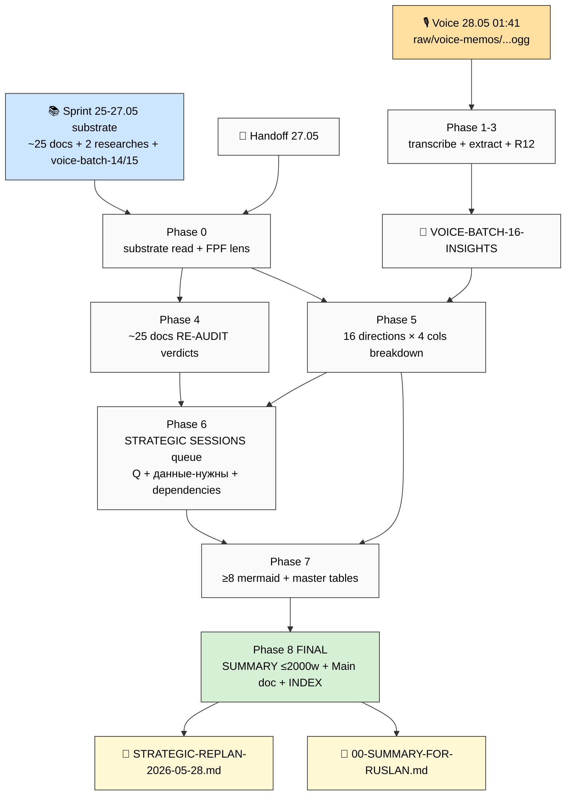

# 🎙️ Voice Batch 16 (quick) + 📋 STRATEGIC RE-PLAN (combined run)

> **PURPOSE.** Process voice file 28.05 01:41 + использовать его как **trigger для full Strategic Re-Plan** учитывая ВСЁ Sprint 25-27.05 substrate. Закрывает также Task B (Situation Report) от voice-batch-15 prompt — integrated в Phases 4-6 этого run'а.

> **DELIVERABLE FRAMING (Ruslan voice 28.05 01:41 paraphrase, R1 surface):**
> «Заметку обработать. Новый документ создать нормальный — таблицы, mermaid схемы, человеческий язык. Вытянуть план из заметки + того что уже есть. Новый план учитывая всё: ещё раз по всем выбранным документам пройтись — все ли подойдут, что именно нужно по каждому направлению сделать, что уже можем сделать. Далее стратегические сессии — основные вопросы + какие данные/информацию ещё нужно узнать для решения каждого вопроса. Подробный отчёт несколько mermaid схем. Промпт для CC на сервере — обработай заметку + всё что попросил.»

---

## §0 EXPLAIN (что делает этот prompt) + Mermaid flow

### §0.1 Что у нас есть СЕЙЧАС (state до запуска)

| Substrate | Файлы / описание | Status |
|---|---|---|
| Voice file 28.05 | `raw/voice-memos/audio_2026-05-28_01-41-33.ogg` (1.6MB / ~18-20 мин) | RAW pending transcribe |
| Voice-batch-15 partial | reports/voice-batch-15-2026-05-27/ Phases 0-3 done (transcript / O-198..206 / dedup-R12 / wiki-KB proposals DRAFT) | Phase 4-7 (Situation Report tail) NOT done — этот prompt closes |
| V4 MetaPlan canonical | `decisions/strategic/JETIX-METAPLAN-V4-FINAL-2026-05-26.md` (16 directions FINAL) | LOCKED concept |
| Workshop+Mastery+Network concept | `decisions/strategic/JETIX-WORKSHOP-MASTERY-NETWORK-CONCEPT-2026-05-26.md` + 2 supplements | Foundation metaphor |
| Founder Role Research | `decisions/strategic/FOUNDER-ROLE-RESEARCH-2026-05-27.md` (702 lines + 9 phase reports + 7 mermaid FR-1..FR-7) | DONE — surface'нул founder operating model + first team queue + 15 R1 |
| Info-Security + Own-Infra Research | `decisions/strategic/INFO-SECURITY-OWN-INFRA-RESEARCH-2026-05-27.md` (543 lines + 7 phase reports + 6 mermaid SEC-1..SEC-6) | DONE — surface'нул threat models + self-hosted alts + 11 R1 |
| 4 LOCKED canonical | Method V2 / Strategic Plan / Economic V10 / AI Market PLAN | UNTOUCHED |
| Notion workspace LIVE | 35 pages + 36 DBs + 44 relations (NOTION-BUILD-REPORT-2026-05-25.md) | LIVE |
| Voice batches 1-14 | INSIGHTS docs + RUSLAN-ACK batch-14 | acked baseline |
| Sprint 25-27.05 outputs | ~25 strategic docs (handoff §10 списком) | available |
| Handoff doc | `_HANDOFF_to_next_cowork_session_2026-05-27.md` | active context-transfer |

### §0.2 Что делает этот prompt (human-language абзац)

Combined run для server CC: (A) обрабатывает свежую голосовую заметку 28.05 01:41 (transcribe Groq Whisper → extract items O-207+ → filter+dedup vs batches 12-15 → R12 paired-frame), и (B) использует её плюс **ВСЁ накопленное Sprint 25-27.05 substrate** для построения **Strategic Re-Plan** — главного нового документа, который: re-audit'ит все выбранные канонические документы Sprint'а (подойдут ли все или есть redundancy / drift), разбирает каждое из 16 направлений V4 (что есть / что нужно сделать / что можем СЕЙЧАС с текущими ресурсами / что блокирует), формирует очередь **Strategic Sessions** с основными вопросами и для каждого — какие данные/информацию нужно ещё узнать чтобы принять решение, и оформляет всё с таблицами, mermaid-схемами (≥8), плотным человеческим языком. Заодно закрывает «хвост» voice-batch-15 prompt (Situation Report Task B — phases 4-7) который не успел отработать.

### §0.3 Что берёт на вход

**Voice substrate:**
- `raw/voice-memos/audio_2026-05-28_01-41-33.ogg` (NEW — primary trigger)
- `raw/transcripts/audio_2026-05-27_18-03-42.txt` (batch-15 transcript — для cross-batch context)

**Strategic substrate (Sprint 25-27.05 selected docs — full list для re-audit):**

V4 + Workshop Foundation cluster:
- `decisions/strategic/JETIX-METAPLAN-V4-FINAL-2026-05-26.md` (16 directions canonical)
- `decisions/strategic/JETIX-METAPLAN-V3-FINAL-2026-05-26.md` (14 directions — predecessor, append-only preserved)
- `decisions/strategic/JETIX-PUBLIC-DOCS-METAPLAN-V2-2026-05-25.md` (11 directions baseline)
- `decisions/strategic/JETIX-PUBLIC-DOCS-METAPLAN-2026-05-25.md` (v1 surface)
- `decisions/strategic/JETIX-WORKSHOP-MASTERY-NETWORK-CONCEPT-2026-05-26.md` (Foundation metaphor)
- `decisions/strategic/WORKSHOP-CONCEPT-SUPPLEMENT-2026-05-26.md` (Founder-as-Exhibit + Mastery deepening)
- `decisions/strategic/PREPARATION-STAGE-CONCEPT-SUPPLEMENT-2026-05-26.md` (Meta-Method 8 шагов + THE TRICK)
- `decisions/strategic/METHOD-MASTERY-PUBLIC-DESCRIPTION-2026-05-26.md`

Research outputs Sprint last 2 days:
- `decisions/strategic/FOUNDER-ROLE-RESEARCH-2026-05-27.md` + 9 phase reports
- `decisions/strategic/INFO-SECURITY-OWN-INFRA-RESEARCH-2026-05-27.md` + 7 phase reports
- voice-batch-15 phase reports (reports/voice-batch-15-2026-05-27/ Phases 0-3)
- `decisions/strategic/VOICE-BATCH-14-INSIGHTS-2026-05-27.md` + RUSLAN-ACK record

Operations / Build / Notion / Outreach:
- `decisions/strategic/JETIX-FULL-MAP-AND-DOCS-SKELETON-2026-05-25.md`
- `decisions/strategic/DOCS-CLASSIFICATION-2026-05-25.md`
- `decisions/strategic/NOTION-TEMPLATES-3-LAYERS-ARCHITECTURE-V2-2026-05-25.md`
- `decisions/strategic/NOTION-BUILD-REPORT-2026-05-25.md`
- `decisions/strategic/PLATFORM-LIFECYCLE-STAGES-PLAN-2026-05-25.md`
- `decisions/strategic/EXECUTION-PLAN-FIXATION-2026-05-24.md`
- `decisions/strategic/CONSOLIDATED-HUMAN-LANGUAGE-PLAN-2026-05-24.md`
- `decisions/strategic/OUTREACH-CONTENT-OUTCOMES-CTAS-2026-05-24.md`
- `decisions/strategic/VOICE-PIPELINE-PUBLIC-V2-2026-05-26.md`
- `decisions/strategic/LETTER-TO-TSEREN-RESPONSE-2026-05-26.md`
- `decisions/strategic/CALL-PLAN-DMITRIY-KAISER-2026-05-25.md`
- `decisions/strategic/JETIX-NAVIGATION-GUIDE-2026-05-22-DRAFT.md`
- `decisions/strategic/AI-TOOLS-LIFEHACKS-MEGA-PAGE-2026-05-25.md`
- `decisions/strategic/PERSONAL-OS-NOTION-TEMPLATE-PLAN-2026-05-24.md`
- `decisions/strategic/BUILD-ARTEFACTS-SPECS-2026-05-25.md`

4 LOCKED canonical (UNTOUCHED — substrate only):
- `decisions/strategic/METHOD-LIFE-DEVELOPMENT-V2-2026-05-21.md` (Method V2 65K / 17 phases)
- `decisions/strategic/STRATEGIC-PLAN-NEAR-FUTURE-2026-05-21.md` (Strategic Plan 28K / 14 phases) — if exists, otherwise find via grep
- `decisions/strategic/ECONOMIC-MODEL-TOKENOMICS-2026-05-22.md` (Economic V10 25K)
- `decisions/strategic/AI-MARKET-ELECTRICITY-ANALOGY-PLAN-2026-05-22.md` (AI Market PLAN Stage 1)

Constitutional context:
- `_HANDOFF_to_next_cowork_session_2026-05-27.md` (context-transfer)
- `CLAUDE.md` (current config)
- `principles/tier-2-system/foundation-generic/` (R1-R12 constitutional)

### §0.4 Что обрабатывает (pipeline)

```
Phase 0 → substrate read (~15 docs above) + FPF lens scope для re-plan
Phase 1 → voice transcribe (Groq Whisper) → raw/transcripts/audio_2026-05-28_01-41-33.txt
Phase 2 → voice extract items (O-207+, D16-*, Q16-*, H16-*, A16-*)
Phase 3 → voice dedup vs batches 12/13/14/15 + R12 paired-frame (influence-ethics auto-fire)
Phase 4 → Re-audit ВСЕХ selected Sprint 25-27.05 docs (per-doc verdict: KEEP / REFINE / MERGE / DEFER / ARCHIVE)
Phase 5 → Per-direction breakdown (16 directions V4) — для каждого 4 столбца (что есть / что нужно / что можем СЕЙЧАС / что блокирует)
Phase 6 → Strategic Sessions queue — основные вопросы + per-Q «какие данные/информацию нужно узнать» + dependencies + время на сессию (15min/30min/1h/2h)
Phase 7 → Mermaid suite (≥8 диаграмм RP-1..RP-N) + master synthesis tables + human-language sections
Phase 8 → SUMMARY-FOR-RUSLAN (≤2000 слов human) + INDEX + main doc → finalize
```

### §0.5 Что получим на выходе (конкретные файлы)

**Main docs (в `decisions/strategic/`):**
- `STRATEGIC-REPLAN-2026-05-28.md` — главный документ; **structure:**
  - §0 TL;DR (90 сек) + что Ruslan просит
  - §1 Voice batch 16 интеграция (новые items O-207+ ядро)
  - §2 Где мы сейчас (post-Sprint 25-27.05) — quantitative state + qualitative shift
  - §3 Doc re-audit verdicts table (~25 docs × KEEP/REFINE/MERGE/DEFER/ARCHIVE + reason)
  - §4 Per-direction breakdown (16 directions × 4 cols таблица + per-direction абзац плотный)
  - §5 What we can do NOW (с текущими ресурсами solo+AI+€34k cap+18ч/день) — actionable список с timeline
  - §6 Strategic Sessions queue (основные вопросы + данные нужны + время + dependencies)
  - §7 Blockers map (что мешает по каждому direction)
  - §8 Roadmap synthesis (28-29.05 / неделя / месяц / квартал)
  - §9 R12 surfaces v16 (new influence/recruitment/gamification flags из этого run'а)
  - §10 R1 decisions queue (consolidated — Sprint 25-27.05 carryover + new v16 items)
  - §11 Mermaid index inline references
  - §12 Cross-refs
- `VOICE-BATCH-16-INSIGHTS-2026-05-28.md` — voice insights (по batch-14/15 паттерну) — items / decisions / questions / hypotheses / actions / R12 surfaces

**Reports dir (`reports/strategic-replan-2026-05-28/`):**
- `00-SUMMARY-FOR-RUSLAN.md` — ≤2000 слов human-language; что узнал / главные сдвиги / topa rekomenduyu surface / 5-7 главных Strategic Sessions / next 7 дней concrete moves
- `01-substrate-read.md` — что прочитал, какие insights cross-doc
- `02-voice-batch-16-transcript.md` (verbatim Phase 1)
- `03-voice-batch-16-extracted.md` (Phase 2)
- `04-voice-batch-16-dedup-r12.md` (Phase 3)
- `05-docs-reaudit.md` (Phase 4 — full ~25 doc verdicts)
- `06-per-direction-breakdown.md` (Phase 5)
- `07-strategic-sessions-queue.md` (Phase 6)
- `08-mermaid-suite.md` (Phase 7 — inline + filenames)
- `INDEX.md`

**Diagrams (`reports/strategic-replan-2026-05-28/diagrams/`):**
- `_INDEX.md`
- RP-1.mmd .. RP-N.mmd (≥8 schemes — see §0.6 для list)

### §0.6 Mermaid suite план (≥8 диаграмм)

| # | Slug | Что показывает |
|---|---|---|
| RP-1 | substrate-overview | Sprint 25-27.05 substrate map: ~25 docs × categories × dependencies |
| RP-2 | voice-batch-16-flow | voice file → extraction → dedup → integration into re-plan |
| RP-3 | doc-reaudit-verdict-tree | per-doc decision tree (KEEP / REFINE / MERGE / DEFER / ARCHIVE) |
| RP-4 | 16-directions-current-state | 16 directions × maturity (Concept / Draft / Wip / Ready) + blockers heatmap |
| RP-5 | what-we-can-do-now-timeline | 28-29.05 / week / month / quarter с конкретными actions |
| RP-6 | strategic-sessions-graph | вопросы × dependencies × данные-нужны |
| RP-7 | blockers-map | блокеры × directions × severity (critical / major / minor) |
| RP-8 | resource-allocation-flow | время Ruslan (maker / seller / AI-orchestrator / recovery) × directions × outputs |
| RP-9 | r12-surfaces-heat-v16 | R12 hot zones из voice-batch-16 + cumulative |
| RP-10 | execution-recommit-flow | как итеративно зацикливать re-plan → execution → review (loop) |

(Можешь добавить ещё если возникнет необходимость — MAX-density mandate; «если можно add 1 more diagram → add».)

### §0.7 Конкретные шаги (по порядку)

1. **Pull repo** (`cd ~/jetix-os && git pull --ff-only`)
2. **Phase 0 substrate read** — прочитать ВСЕ файлы из §0.3 + handoff + memory; FPF lens scope для re-plan (см. §0.10)
3. **Phase 1 transcribe** — `python3 tools/transcribe.py raw/voice-memos/audio_2026-05-28_01-41-33.ogg` → `raw/transcripts/audio_2026-05-28_01-41-33.txt`. Commit `[voice-batch-16] Phase 0 transcript + themes` (включить и FPF lens scope в commit).
4. **Phase 2 extract** — items O-207+ + D16-* + Q16-* + H16-* + A16-* (per batch-14/15 pattern). Commit `[voice-batch-16] Phase 1 extracted items (O-207..+)`.
5. **Phase 3 dedup + R12** — cross-batch dedup vs O-186..O-206 + R12 paired-frame (influence-ethics auto-fire mandatory). Commit `[voice-batch-16] Phase 2-3 dedup + R12`.
6. **Phase 4 docs re-audit** — пройтись по ВСЕМ ~25 docs Sprint 25-27.05; per-doc verdict KEEP/REFINE/MERGE/DEFER/ARCHIVE + reason (≤2 lines); table + per-doc абзац (если REFINE/MERGE — что именно). Commit `[strategic-replan] Phase 4 docs re-audit (~25 verdicts)`.
7. **Phase 5 per-direction breakdown** — для каждого из 16 directions V4 четыре столбца: «что есть» (artefacts present) / «что нужно» (gap) / «что можем СЕЙЧАС» (actionable solo+AI) / «что блокирует». Master table + per-direction абзац (плотный, ≥5 строк каждый, no bullets-only). Commit `[strategic-replan] Phase 5 per-direction breakdown (16 dirs)`.
8. **Phase 6 strategic sessions queue** — основные вопросы (15-25) которые нужно решить на стратегических сессиях; для каждого: какие данные/информацию нужно ещё узнать чтобы принять решение, dependencies, estimated session time (15/30/60/120 min), preferred format (solo reflection / Anatoly call / Tseren call / advisor call / etc.). Commit `[strategic-replan] Phase 6 strategic sessions queue (15-25 Q + data-needs)`.
9. **Phase 7 mermaid suite + master synthesis** — все ≥8 диаграмм RP-1..RP-N с темой `'theme':'base'` + `'primaryTextColor':'#000','textColor':'#000','lineColor':'#333','primaryBorderColor':'#333','primaryColor':'#fafafa'` (per `swarm/wiki/operations/mermaid-style-guide-2026-05-07.md`); диаграмма ≥10 узлов (где content allows); tables; cross-refs. Commit `[strategic-replan] Phase 7 mermaid suite + master synthesis`.
10. **Phase 8 SUMMARY + main doc + INDEX** — `00-SUMMARY-FOR-RUSLAN.md` ≤2000 слов плотного человеческого языка + `STRATEGIC-REPLAN-2026-05-28.md` главный doc + `VOICE-BATCH-16-INSIGHTS-2026-05-28.md` voice insights + INDEX. Commit `[strategic-replan] Phase 8 Main + SUMMARY + Voice-Insights + INDEX (final push)`.
11. Final push.

### §0.8 К чему ведёт (что разблокирует)

После ack:
- Ruslan видит **полную картину** что сейчас есть, какие docs стоит держать, что redundancy / drift
- Per-direction знает: что СЕЙЧАС actionable (без новых ресурсов), что требует данных/решения, что блокирует
- Strategic Sessions queue = explicit list **что обсудить в каких сессиях** (solo / mentor / Anatoly / Tseren / advisor) — не «давайте всё обсудим», а конкретные Q с pre-loaded substrate
- Voice batch 16 insights закрывают tail voice-batch-15 work
- Roadmap (next 7 / 30 / 90 дней) реалистичный с учётом O-201/O-202 (design→execution shift + delegation-as-bottleneck)
- 28.05 видео-A блокер не уходит — он входит в «что можем СЕЙЧАС»

### §0.9 Mermaid flow для overview (этот prompt visual)



### §0.10 FPF lens scope (per memory `feedback_fpf_lens_first.md`)

**Перед Phase 4-6 явно зафиксировать в `01-substrate-read.md` §FPF-Scope:**

1. **ЧТО research'им (re-plan):** strategic plan-as-document (FPF artefact уровня «P-системы планирования» — план как объект-планирование, не как набор шагов) для Jetix-as-Workshop-Mastery-Network = body of Vision
2. **На каком уровне сравниваем:** план-документ × план-документ (predecessor handoff 27.05 vs new re-plan 28.05); за этим — Foundation/system level (FPF Part E constitution)
3. **С чем сравниваем:** Sprint 25-27.05 selected canonical docs (substrate) + voice insights v16
4. **Зачем:** Ruslan-instruction explicit «ещё раз посмотреть всё ли подойдёт + что нужно сделать + что можем сейчас + strategic sessions queue» → ЭТО acceptance predicate
5. **FPF primitives применимы:** P-плана (4D extent) / role-method-work separation per direction / F-G-R per claim / U.Episteme abstract roles (#5 Партнёры IP-1 STRICT)
6. **Claims F-G-R triple** требуется per per-direction verdict (F2/F3 + G + R)

Без этого Phase 4-6 будут «каша непонятная» — explicit FPF lens предотвращает.

---

## §1 OPERATIONAL RULES (MANDATORY READ)

### §1.0 CRITICAL IMPORTANCE MANDATE — MAX-density (per memory `feedback_max_density_max_tokens.md`)

Это **один из самых важных deliverables Sprint 25-28.05** — strategic re-plan, который определит execution за следующий месяц.

1. **ROY swarm на 500%** — brigadier orchestrates entire 17-agent swarm + 4 sub-brigadiers parallel
2. **Use MAX доступных токенов × 3** — не экономь; depth > brevity для strategic deliverables; «потом ещё на 3 умножили блять ещё столько же заебашили»
3. **Максимально сырая информация** — read entire substrate docs (не summaries); verify [src: ...] per claim
4. **Quality explanation focus** — densest human-language explanations; multiple angles per concept; «качественного пояснения, человеческих примеров и так далее, чтобы нахуярили»
5. **Concrete human examples** mandatory — multiple per direction; vivid
6. **Плотность всего** — each section substantive (NOT bullets-only); each diagram dense (≥10 nodes where content allows); each example concrete; per-direction абзац ≥5 строк плотный
7. **Не stopover at minimum** — пренебрегай acceptance criteria ceilings; produce best work possible regardless of estimated runtime/cost
8. **Если можно add 1 more diagram / table / example → add**

### §1.1 Constitutional posture (per CLAUDE.md §4.1 + memory `feedback_constitutional.md`)

- **R1 surface only** — рой surface'ит, Ruslan decides; ВСЕ strategic prose statements (Core statements / triada / ФРАЗЫ-якорь / per-direction strategy claims) ФЛАГНУТЬ `prose_authored_by: ruslan` placeholder + R1 surface note
- **R2 STRICT LOCK preserve** — Foundation v1.0 + 4 LOCKED canonical untouched (READ ONLY); NO writes в `swarm/wiki/foundations/` / `principles/` / `shared/schemas/` / `.claude/config/`
- **R6 provenance per item** — каждое утверждение [src: file:lines OR commit SHA OR voice-batch-N item-ID]
- **R11 Default-Deny** — uncategorized actions = halt-log-alert; specs only, NO sample doc content (don't write the docs we'd later create)
- **R12 paired-frame STRICT** — influence-ethics-expert auto-fires receiver direction whenever propaganda / recruitment-dynamics / nlp / gamification-engagement dispatches; missing pair → Halt-Log-Alert F4 ≤5s
- **IP-1 STRICT** — Foundation роли = U.Episteme abstract role-types (PM/strategist/sales-lead); executor bindings (Anatoly Levenchuk / Tseren Tserenov / Dmitriy Kaiser) = RUSLAN-LAYER per `shared/schemas/executor-binding.yaml.template`; в plan-docs имена = examples ролей, не assignments
- **append-only** — predecessor docs preserved; этот run = новый STRATEGIC-REPLAN, не редактирует existing
- **voice-pipeline DRAFT-only** — NEVER auto-promote voice items в canonical; pool result для batch-16

### §1.2 Pool result pattern (per memory `feedback_research_pool_pattern.md`)

ВСЕ NEW research candidates / NEW DR / NEW Tier B wiki ideas surfaced в Phase 5 (per-direction «что нужно») и Phase 6 (strategic sessions queue) → **в pool format**, NOT auto-launch consequent prompts. Per-item:
1. Name + slug
2. Scope
3. Expected output
4. What prompt/launch needed (когда захотим)
5. Dependency
6. Priority hint (surface only, NOT recommendation)

Ruslan reads → cherry-picks → ack → отдельные prompts позже.

### §1.3 Breadth-research posture (per memory `feedback_breadth_not_selection.md`)

Phase 6 Strategic Sessions queue — Open Questions = **hypotheses to test**, NOT decisions для немедленного ack. NE предлагать «давай выбирать», NE «моя рекомендация». Per-Q:
- сам вопрос (clean formulation)
- какие данные/информацию нужно узнать чтобы принять решение (это и есть ядро Ruslan's instruction)
- dependencies (что блокирует ответ)
- estimated session time
- preferred format
- references to existing substrate

**ЗАПРЕЩЕНО** добавлять секции «§РЕШЕНИЯ ПО ФИКСАЦИИ» / «§МОИ РЕКОМЕНДАЦИИ» / «Что МОЖНО взять». Output = чистая структура + содержание + data-needs.

### §1.4 No unsolicited alternatives (per memory `feedback_no_unsolicited_alternatives.md`)

Ruslan выбрал substrate (Sprint 25-27.05 ~25 docs + research outputs) → re-audit ИХ. NE подсовывать «лучше начать заново» / «вот идеальная структура которой нет». Если direction есть в V4 — он есть; если doc есть в substrate — он есть.

### §1.5 Prompt explanation discipline (per memory `feedback_prompt_explanation_required.md`)

EXPLAIN секция уже встроена в §0 этого prompt (inline pattern за prep-stage 28.05 — Ruslan voice 28.05 01:41 explicit «давай нахуй делай помпки для код кода на сервере»). Per-Phase commits должны включать что и почему делалось.

### §1.6 Git discipline

- Commits per-Phase с tag `[strategic-replan]` или `[voice-batch-16]`
- Final push после Phase 8
- NO force-push / NO `--no-verify` / NO secrets / NO `private/` `~/.ssh/` `.env` touches
- API-key audit перед каждым commit (per CLAUDE.md): `grep -rE 'ANTHROPIC_API_KEY|sk-' <staged files>` → 0 hits

---

## §2 PHASE-BY-PHASE DETAIL

### Phase 0 — Substrate read + FPF lens scope (~30 min)

1. Read all files listed §0.3.
2. Read `_HANDOFF_to_next_cowork_session_2026-05-27.md` in full.
3. Read `CLAUDE.md` + `principles/tier-2-system/foundation-generic/` (constitutional reload).
4. Write `reports/strategic-replan-2026-05-28/01-substrate-read.md` containing:
   - §1 List прочитанных файлов с word-count est + ключевыми insights per-doc (1-2 строки)
   - §2 Cross-doc observations (что повторяется / что conflicts / что drift'ит between docs)
   - §3 FPF-Scope (per §0.10 этого prompt — explicit)
   - §4 Working list ~25 docs для re-audit (Phase 4 input)
   - §5 Working list 16 directions для breakdown (Phase 5 input)
   - §6 Working list strategic questions кандидатов (initial — refined в Phase 6)
5. Commit `[strategic-replan] Phase 0 substrate read + FPF scope`.

### Phase 1 — Voice transcribe (~10 min)

```bash
python3 tools/transcribe.py raw/voice-memos/audio_2026-05-28_01-41-33.ogg
# → raw/transcripts/audio_2026-05-28_01-41-33.txt
```

Then write `reports/strategic-replan-2026-05-28/02-voice-batch-16-transcript.md`:
- §1 Transcript verbatim (F2)
- §2 Themes initial pass (3-5 main topics surfaced)
- §3 Voice character notes (energy / urgency level / emotional surfaces — для R12 paired-frame Phase 3)

Commit `[voice-batch-16] Phase 0-1 transcript + themes`.

### Phase 2 — Extract structured items (~30 min)

Use CC headless extract (per batch-14/15 precedent — НЕ Anthropic API key direct).

Output `reports/strategic-replan-2026-05-28/03-voice-batch-16-extracted.md`:
- §1 Ideas table (O-207..O-NNN) — columns: ID / Idea / Topic / Direction / Urgency / Confidence / Type
- §2 Decisions candidates (D16-*) — surface only, prose Ruslan-authored
- §3 Open Questions (Q16-*)
- §4 Hypotheses (H16-*) — with «how to test»
- §5 Immediate Actions (A16-*) — owner / срок / dependency
- §6 R12 surfaces preliminary (для Phase 3 deeper)

Commit `[voice-batch-16] Phase 2 extracted items (O-207..N + D16/Q16/H16/A16)`.

### Phase 3 — Dedup + R12 paired-frame (~20 min)

Cross-batch dedup vs batches 12/13/14/15 — flag дубли / refinements / contradictions.

R12 paired-frame STRICT:
- influence-ethics-expert auto-fires (mandatory receiver)
- propaganda / recruitment-dynamics / nlp / gamification дispatches → influence-ethics paired
- Per-surface: lens(es) / severity (high/med/low) / verdict (POOL-LOCKED / reframe / refute / safe-as-is)

Output `reports/strategic-replan-2026-05-28/04-voice-batch-16-dedup-r12.md`:
- §1 Dedup table (which items vs which batch)
- §2 Refinements (item refines O-X)
- §3 Contradictions (item conflicts with O-Y)
- §4 R12 surfaces full
- §5 POOL-LOCKED items (нельзя external as-is)

Commit `[voice-batch-16] Phase 3 dedup + R12 paired-frame`.

Also: write `decisions/strategic/VOICE-BATCH-16-INSIGHTS-2026-05-28.md` — voice insights doc (per batch-14 structure: ядро + items + R12 + cross-batch arc).

### Phase 4 — Docs RE-AUDIT (~60 min)

Pass over ВСЕХ ~25 docs из §0.3 (strategic substrate). Per-doc:

| Doc | Verdict | Reason (≤2 lines) | Action if not KEEP |
|---|---|---|---|
| KEEP | держим as-is, canonical / reference | (e.g. «V4 = THE structure, no drift») | — |
| REFINE | держим, нужны небольшие правки | «add §X / update §Y per voice-batch-16» | what change + who authors (Ruslan flag) |
| MERGE | сливаем с другим doc | «overlap >50% with doc-Y; merge into Y» | which target |
| DEFER | пока не работаем — pool | «valid но не Wave 1; pool для post-Foundation» | flag pool location |
| ARCHIVE | устарел / superseded | «v1 superseded v3; preserve via git mv» | git mv path |

Plus master table в `reports/strategic-replan-2026-05-28/05-docs-reaudit.md`:
- §1 Verdicts summary (~25 rows)
- §2 Per-doc плотный абзац (для REFINE/MERGE/ARCHIVE — что именно)
- §3 Drift analysis cross-doc (где documents диверsили / conflict)
- §4 Recommended consolidations (pool — Ruslan picks)

Commit `[strategic-replan] Phase 4 docs re-audit (~25 verdicts)`.

### Phase 5 — Per-direction breakdown (~90 min)

Для каждого из 16 directions V4 — четыре столбца:

| # | Direction | Что ЕСТЬ (artefacts present) | Что НУЖНО (gap) | Что можем СЕЙЧАС (solo+AI+~€34k cap) | Что БЛОКИРУЕТ |
|---|---|---|---|---|---|
| 1 | Метод | Method V2 65K LOCKED + meta-method 8-step | publication video / cohort design | record video A draft / cohort outline | none — solo actionable |
| ... | ... | ... | ... | ... | ... |

PLUS per-direction абзац ≥5 строк плотный с:
- Maturity assessment (Concept / Draft / WIP / Ready)
- Resource needs (time / capital / people / data)
- Dependencies
- Critical R12 surfaces (если есть)
- Concrete worked example «что выглядит как done на следующей неделе»

Output `reports/strategic-replan-2026-05-28/06-per-direction-breakdown.md`:
- §1 Master 4-cols table (16 rows)
- §2-§17 Per-direction абзацы (16 sections, ≥5 lines each)
- §18 Cross-direction patterns (что повторяется, какие directions share gaps / blockers)
- §19 Direction-cluster synthesis (по 3 хабам #1/#8/#12 + 2 движкам #15/#16 + остальные)

Commit `[strategic-replan] Phase 5 per-direction breakdown (16 dirs × 4 cols + dense paragraphs)`.

### Phase 6 — Strategic Sessions queue (~60 min)

15-25 основных вопросов которые ждут решения. Per-Q:

```
Q-ID: <slug>
Question: <чёткая формулировка>
Type: strategic / tactical / operational / R12-gate / capital / partnership / etc.
Direction(s) affected: #N, #M
Substrate refs: [src: doc-X §Y]
Data needs (КЛЮЧЕВОЕ — per Ruslan instruction):
  - what info / data / observation needed to make decision
  - where to get it (research / call X / experiment / observation)
  - estimated time to gather
Dependencies: какие другие Q блокируют этот
Session format: solo reflection (15-30 min) / Anatoly call (60 min) / Tseren call (30 min) / advisor call (X) / etc.
Session time estimate: 15 / 30 / 60 / 120 min
Priority hint: P1 / P2 / P3 (surface only, NOT recommendation)
```

Output `reports/strategic-replan-2026-05-28/07-strategic-sessions-queue.md`:
- §1 Sessions queue table (15-25 rows, summary cols)
- §2-§N Per-Q expanded (full structure above; ≥5 lines per Q description + rationale)
- §N+1 Cluster sessions (какие Q можно решать в одной сессии — bundling)
- §N+2 Sequence dependency map (which Q blocks which)
- §N+3 Time-budget estimate (если решать все Q — сколько часов сессий total)

Commit `[strategic-replan] Phase 6 strategic sessions queue (15-25 Q with data-needs)`.

### Phase 7 — Mermaid suite + master synthesis (~45 min)

8-10+ диаграмм RP-1..RP-N per §0.6 list. Style mandatory:
```
%%{init: {'theme':'base','themeVariables':{'primaryTextColor':'#000','textColor':'#000','lineColor':'#333','primaryBorderColor':'#333','primaryColor':'#fafafa','noteBkgColor':'#fff8d5'}}}%%
```

Per `swarm/wiki/operations/mermaid-style-guide-2026-05-07.md`. Каждая диаграмма:
- ≥10 nodes (where content allows; if not — explain)
- styled nodes (color-coded by category)
- annotations / notes
- direction TB or LR per content

Save each as `.mmd` in `diagrams/`. Index `diagrams/_INDEX.md` with one-line description per scheme + inline-reference в каком §.

Plus master synthesis tables в `08-mermaid-suite.md`:
- §1 RP-1..RP-N inline + filename refs
- §2 Master matrix (если applicable — 16 dirs × Wave × R12 × resource-need)

Commit `[strategic-replan] Phase 7 mermaid suite (≥8 RP-N) + master synthesis tables`.

### Phase 8 — SUMMARY + Main doc + INDEX (final push) (~60 min)

**`reports/strategic-replan-2026-05-28/00-SUMMARY-FOR-RUSLAN.md`** (≤2000 слов плотного человеческого языка):
- §1 Что прочитал / что обработал (1 параграф)
- §2 Главные сдвиги post-voice-16 (3-5 ядерных insights — design→execution shift refinement / delegation bottleneck / 34k capital decision frame / др.)
- §3 Re-audit headline — сколько docs KEEP / REFINE / MERGE / DEFER / ARCHIVE + ключевые drift'ы
- §4 16 directions snapshot — какие Ready / WIP / Draft / Concept; top-3 actionable СЕЙЧАС
- §5 Top-5 Strategic Sessions — каждая 2-3 строки с data-need ядром
- §6 Что можем сделать на этой неделе (concrete moves — 28-29.05 priority видео-А + еще 5-7 пунктов)
- §7 R12 surfaces critical
- §8 Pointer к main doc + reports

**`decisions/strategic/STRATEGIC-REPLAN-2026-05-28.md`** — главный doc per §0.5 structure (~10K-20K words диапазон с MAX-density).

**`reports/strategic-replan-2026-05-28/INDEX.md`** — listing всех phase reports + diagrams + cross-refs.

**`decisions/strategic/VOICE-BATCH-16-INSIGHTS-2026-05-28.md`** — voice insights doc (если не сделан в Phase 3 уже).

Final commit `[strategic-replan] Phase 8 Main + SUMMARY + Voice-Insights + INDEX (final push)`.

Final push to origin/main.

---

## §3 SUCCESS CRITERIA (R-predicate refutation)

Этот run **refuted** если в финале НЕТ:
- `decisions/strategic/STRATEGIC-REPLAN-2026-05-28.md` (main doc с §0-§12 structure)
- `decisions/strategic/VOICE-BATCH-16-INSIGHTS-2026-05-28.md` (voice insights)
- `reports/strategic-replan-2026-05-28/00-SUMMARY-FOR-RUSLAN.md` (≤2000w human)
- `reports/strategic-replan-2026-05-28/` ≥8 phase reports (01-08)
- ≥8 RP-N mermaid schemes в `diagrams/`
- ВСЕ ~25 docs из §0.3 strategic substrate visited в Phase 4 (verdict per-doc)
- ВСЕ 16 directions V4 visited в Phase 5 (4 cols + dense paragraph each)
- 15-25 Strategic Sessions Q в Phase 6 (per-Q data-needs explicit)
- voice file processed (transcript + extracted + dedup + R12 + insights doc)
- voice-batch-15 Situation Report tail absorbed (закрыли Task B)
- ANY LOCK violation (Foundation/4LOCKED touched)
- ANY auto-promote strategic prose без Ruslan-authoring flag
- ANY voice item auto-distributed в canonical без ack
- ANY R12 surface unflagged (influence-ethics missing pair)
- ANY direction missed FPF lens scope (Phase 0 §FPF-Scope absent)

---

## §4 LAUNCH commands (для tmux на сервере)

```bash
ssh jetix
tmux new -s strategic-replan-2026-05-28
cd ~/jetix-os && git pull --ff-only
claude --dangerously-skip-permissions -p "Autonomous execution: prompts/voice-batch-16-plus-strategic-replan-2026-05-28.md. ROY swarm на 500% MAX-density. Execute all 9 phases (0-8) sequentially with per-Phase commits. Push origin/main after final phase. R1/R2/R6/R11/R12 STRICT. ~4-6h runtime."
# Ctrl-B then D — detach
# Reattach: tmux attach -t strategic-replan-2026-05-28
```

---

## §5 Cross-refs

| Document | Зачем |
|---|---|
| `_HANDOFF_to_next_cowork_session_2026-05-27.md` | active session context-transfer |
| `JETIX-METAPLAN-V4-FINAL-2026-05-26.md` | 16 directions canonical (THE structure для Phase 5) |
| `JETIX-WORKSHOP-MASTERY-NETWORK-CONCEPT-2026-05-26.md` | Foundation metaphor |
| `FOUNDER-ROLE-RESEARCH-2026-05-27.md` + 9 phase reports | founder operating model substrate |
| `INFO-SECURITY-OWN-INFRA-RESEARCH-2026-05-27.md` + 7 phase reports | security pillar substrate |
| `prompts/voice-batch-15-plus-situation-report-2026-05-27.md` | predecessor — Task B absorbed |
| `reports/voice-batch-15-2026-05-27/` 4 phase reports | batch-15 partial (O-198..206) — substrate |
| `decisions/strategic/VOICE-BATCH-14-INSIGHTS-2026-05-27.md` + RUSLAN-ACK | acked baseline batch-14 (O-186..197) |
| 4 LOCKED canonical (Method V2 / Strategic Plan / Economic V10 / AI Market PLAN) | substrate ONLY (R2 STRICT — read but don't write) |
| `swarm/wiki/operations/mermaid-style-guide-2026-05-07.md` | mermaid style mandatory |
| `principles/tier-2-system/foundation-generic/` | R1-R12 constitutional |
| memory `feedback_max_density_max_tokens.md` | MAX-density mandate ref |
| memory `feedback_research_pool_pattern.md` | pool format для NEW candidates |
| memory `feedback_breadth_not_selection.md` | Q = hypotheses to test, NOT decisions |
| memory `feedback_fpf_lens_first.md` | FPF lens scope mandatory Phase 0 |

---

*Prompt closure 2026-05-28 02:00. Voice Batch 16 (quick) + STRATEGIC RE-PLAN combined run. Absorbs voice-batch-15 Situation Report tail. ROY swarm 500% MAX-density mandate. R1 surface / R2 STRICT / R6 / R11 / R12 paired-frame STRICT / IP-1 STRICT / append-only / voice DRAFT-only. 9 phases / ~4-6h runtime. Outputs: 1 main strategic-replan doc + 1 voice-insights doc + 9 phase reports (00-08) + ≥8 mermaid RP-1..RP-N + INDEX. Pool result — NO auto-launch consequent prompts.*
