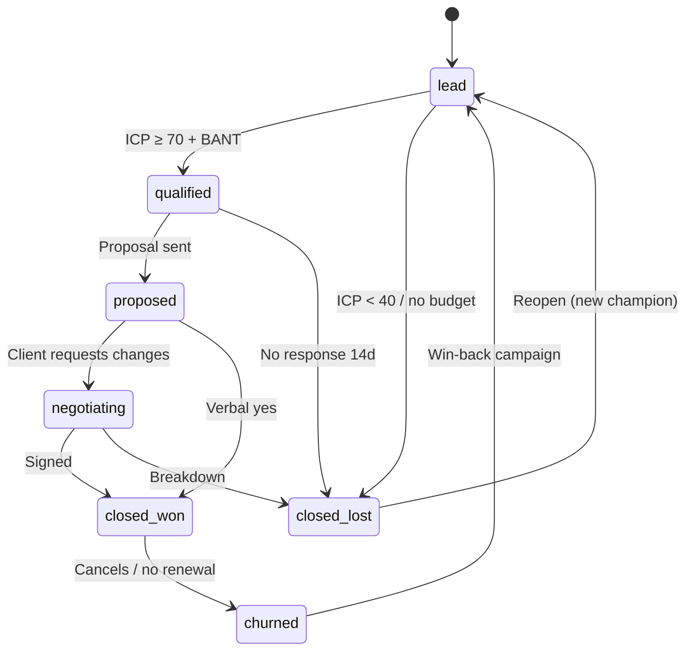

# ШСМ × AI-агенты × Jetix
## Adaptation Research: методология Левенчука как L2 Cognitive слой AI-native мега-корпорации

**Автор подготовки:** research-синтез для Ruslan (Jetix, Berlin)
**Статус:** Academic research + actionable design inputs
**Целевой output:** `design/JETIX-FPF-LITE.md`, `design/JETIX-ROLE-MANIFESTS.md`, `design/JETIX-ALPHA-SET.md`
**Объём:** ~7500 слов, 8 частей (A–H)

---

## Executive summary

Jetix строится как AI-native мега-корпорация: один founder + 12–14 AI-агентов через Claude Code + будущие human executors, все — через единую role-abstraction. L2 Cognitive слой архитектуры берёт 5 примитивов ШСМ (Школа системного менеджмента Анатолия Левенчука) selectively: **роль, альфа, граф создания, стратегирование, мышление письмом**. Полный FPF (First Principles Framework), 17 дисциплин интеллект-стека, мереология холонов — остаются read-only reference.

Центральный тезис исследования: **в AI-эпоху узкое место — не execution, а framing и acceptance**. Левенчук в посте [«Моё место посреди всполохов сингулярности» (2026)](https://ailev.livejournal.com/1795494.html) формулирует это напрямую: «Проблемы больше с планированием того, что они [агенты] должны проходить (problem framing)». Отсюда — ставка на L2: 5 примитивов не как теоретическая надстройка, а как архитектура рабочей среды агентов.

Пять примитивов переводятся в AI-контекст по-разному: Роль — 1:1 (уже абстракция от исполнителя). Альфа, Граф создания, Мышление письмом — адаптация. Стратегирование — invent (остаётся исключительно за человеком). Этот вывод задаёт разделение труда в L0 Executive Core и форму role-manifest'ов.

---

## Часть A — Пять примитивов ШСМ: академический deep-dive

### A.1 Ролевая онтология

Концепция роли в ШСМ синтезирует три традиции: системно-инженерную (ISO/IEC/IEEE 15288, INCOSE), программно-инженерную (OMG Essence / SEMAT) и третье поколение системного подхода Левенчука в [«Системном мышлении 2024»](https://books.yandex.ru/books/oTQZfRrv/read-online). Стандарт [OMG Essence 1.2](https://www.omg.org/spec/Essence/1.2/About-Essence) принят в 2018 году; он формально разделяет *competency* (способности агента) и *role* (позиция в практике), оставляя понятие «роли» в расширениях ядра.

В системной инженерии роль — это **функциональный объект**: набор обязанностей, интересов (concerns) и методов работы, приписанных к позиции, независимо от того, кто её занимает. Левенчук даёт каноническую аналогию: «Гамлет — это **роль**, конкретный актёр на сцене — **исполнитель**» ([видео-обзор «Системного мышления»](https://www.youtube.com/watch?v=xYuOTXmS2cc)). Отсюда формула: *«Роль — функция, актор — конкретный исполнитель: человек, команда, организация или ИИ»*.

| Понятие | Онтологический тип | Persistence |
|---|---|---|
| **Role** | Функциональный/интенсиональный объект (Product Owner, Architect) | Независима от исполнителя |
| **Person** | Физический агент (homo sapiens) | Биологическая личность |
| **Agent** | Создатель, исполняющий роли (человек, команда, AI, организация) | Может исполнять множество ролей |
| **Organizational Unit** | Коллективный агент (отдел, компания) | Агрегирует агентов |

В [ArchiMate Business Role](https://ea.rna.nl/2011/07/28/archimate-problem-areas-business-role/) отделяется от Actor через отношение Assignment. В Essence роли реализуются через поле Competency и через role definitions в практиках-расширениях ([SEMAT Quick Reference](https://semat.org/quick-reference-guide.html)).

В [«Методологии 2025»](https://www.litres.ru/book/anatoliy-levenchuk/metodologiya-2025-71307523/chitat-onlayn/) Левенчук вводит роль через **сигнатуру метода**: каждый метод имеет предмет (альфу) и набор ролей — позиций, от которых ожидается определённое мастерство. В FPF 2025 роль формализована глубже — как **«маска» холона**: *«холон в некотором контексте играет роль (holon as a holder of a role), которая служит его маской»* ([ailev 1776793](https://ailev.livejournal.com/1776793.html)).

**Критика.** Ролевая онтология ломается в трёх ситуациях: (1) размытая многоролевость (founder + CEO + CTO одновременно); (2) dynamic role assignment в AI-агентах (агент назначает себе роль сам по ситуации — традиционные нотации не описывают этот паттерн); (3) informal organisations (Holacracy, DAO), где роль — временный контракт, долгоживущие карты теряют актуальность быстрее, чем создаются.

### A.2 Альфы с состояниями

Alpha — ключевой конструкт [OMG Essence 1.2](https://www.omg.org/spec/Essence/1.2/) — определяется как *«essential element of the software-engineering endeavour — one that is relevant to an assessment of its progress and health»* ([Communications of the ACM, 2012](https://cacm.acm.org/practice/the-essence-of-software-engineering/)).

| Понятие | Суть | Пример |
|---|---|---|
| **Alpha** | Предмет метода с отслеживаемыми состояниями | Requirements, Team |
| **Work product** | Артефакт, результат работы | Документ требований, код |
| **Entity / Object** | Объект без state machine | Клиент как юридическое лицо |
| **Activity** | Действие по методу | Sprint planning |

Альфа **не является** ни документом, ни задачей, ни процессом. Это абстракция над **судьбой** предмета в проекте. Каждая альфа описывается state machine — упорядоченным набором состояний, каждое с checklist верифицируемых критериев. Состояния формулируются глаголами в прошедшем времени: не «Planning», а «Planned».

**Семь стандартных альф Essence Kernel** в трёх областях: *Customer* (Opportunity, Stakeholders), *Solution* (Requirements, Software System), *Endeavour* (Work, Team, Way of Working). Альфы не изолированы — один и тот же человек может быть элементом и Team, и Stakeholders.

В «Методологии 2025» Левенчук ретипизирует: *«Альфа — это предмет метода, который может быть и физическим объектом (системой), и абстрактным объектом (описанием)»*. Ключевое расширение — безмасштабность: альфы применимы к любым проектам. Бизнес-альфы (Client, Deal, Invoice, Product) получают полноценные state machines — корпоративная замена формальным Essence-карточкам.

**Критика.** Альфы предполагают, что прогресс почти линеен. В сложных адаптивных системах состояния часто откатываются (Requirements → Conceived после market pivot), state machine превращается в граф с циклами. Кроме того, семь стандартных альф Kernel ориентированы на software endeavour — перенос в управленческие или R&D контексты требует доработки.

### A.3 Граф создания

**Граф создания** — ориентированный граф, в узлах которого стоят **системы**, а рёбра — отношение «кто создаёт кого». В [«Методологии 2025»](https://www.litres.ru/book/anatoliy-levenchuk/metodologiya-2025-71307523/chitat-onlayn/) это обязательный инструмент системного инженера; граф строится «по мотивам OMG Essence 2.0:2024».

Принципиальная идея: **проект — это не только целевая система**. Вокруг неё — **система создания** (creators: команда, инструменты, процессы) и **надсистема** (supersystem, в которую целевая система встраивается).

| Концепт | Акцент | Отличие от графа создания |
|---|---|---|
| **Value Stream** (Lean) | Поток ценности для клиента | Граф шире — создание, не только ценность |
| **Dependency Graph** | Технические зависимости | Онтологические отношения создания |
| **RACI Matrix** | Распределение ответственности | Кто создаёт ЧТО, не кто за что отвечает |
| **Supply Chain** | Цепочка поставщиков | Без системно-инженерной типизации |

Граф создания мереологически ориентирован: системы-создатели сами — системы, которые кто-то создаёт. Это рекурсивное свойство делает его средством навигации по уровням сложности. В FPF 2025 *«связь трасс конструирования происходит к kinds»* — типам ([ailev 1776793](https://ailev.livejournal.com/1776793.html)).

Для Jetix граф создания показывает: какие агенты создают продукт (целевая система), какие управляют другими агентами (мета-уровень), кто создаёт саму AI-систему (Ruslan + Claude Code). Это ключевой инструмент для онбординга нового агента или аудита архитектуры.

### A.4 Стратегирование

*«Метод выбора метода — стратегирование... стратегирование — выбирать новый метод работы в условиях, когда вообще непонятно, что делать»* ([«Методология 2025»](https://www.litres.ru/book/anatoliy-levenchuk/metodologiya-2025-71307523/chitat-onlayn/)).

Трёхступенчатый примат: сначала **стратегирование** (выбор метода), затем **планирование** (ресурсы под метод), затем **работа**. Без стратегирования планирование невозможно — «потребные ресурсы неизвестны».

| Понятие | Когда применяется |
|---|---|
| **Стратегирование** (ШСМ) | При неизвестности: не знаю, что делать |
| **Planning** | Распределение ресурсов под известный метод |
| **Strategy** (бизнес) | Долгосрочный план позиционирования (часто смешивает оба) |
| **Tactic** | Конкретные шаги в рамках метода |

В корпоративной практике «стратегия» часто означает уже выбранный метод (business model, GTM). У Левенчука стратегирование — процесс выбора этого метода, т.е. оно *предшествует* тому, что бизнес-литература называет «стратегией». Аналог — выбор жанра игры до начала геймплея.

Левенчук явно не использует [Cynefin](https://en.wikipedia.org/wiki/Cynefin_framework), но стратегирование ложится на Complex домен Cynefin (probe-sense-respond) и фазы Observe + Orient OODA (Boyd). Практическая сессия стратегирования включает: reconnaissance (SoTA), критика вариантов (теория решений), синтез метода, документация (мышление письмом).

### A.5 Мышление письмом

В [«Системном мышлении 2024»](https://www.litres.ru/book/anatoliy-levenchuk/sistemnoe-myshlenie-2024-tom-1-70915630/) Левенчук формулирует:

> «Системное мышление происходит путём мышления моделированием... и письмом (с текстами на естественных языках, но с отслеживанием типов объектов и видов отношений объектов в этих текстах), поэтому внимание не только наводится на важные предметы, но и удерживается на них всё время проекта: записанное не так легко забыть в суете».

Мышление письмом — не документирование, а **онтологизация** мышления: типизация свободного текста.

**Peter Naur, «Programming as Theory Building» (1985)**:

> *«The proper, primary aim of programming is, not to produce programs, but to have the programmers build theories... The death of a program happens when the programmer team possessing its theory is dissolved»* ([Naur 1985 summary](https://inventwithpython.com/drafts/naur-programming-as-theory-building.html)).

Для Jetix: AI-агент, как программист Наура, несёт теорию системы в контексте. Когда контекст теряется — теория умирает. Мышление письмом экстернализирует теорию, делает её transferable. Парадокс: Наур считал, что теория не может быть полностью записана; LLM меняют это — способность AI восстанавливать теорию из документации существенно выше человеческой при достаточно богатой документации.

**Andy Clark / David Chalmers — Extended Mind thesis**: *«cognitive processes can be offloaded onto external artifacts»* ([Extended Mind](https://www.organism.earth/library/topic/extended-mind)). Ноутбук или блокнот — не инструмент, а часть когнитивной системы. Левенчук прямо использует концепт: агент включает **экзокортекс** — *«увеличивающий аппаратные возможности агента инструментарий»*. Для Jetix AI-агенты сами являются экзокортексом founder'а.

**Нейронаука подтверждает:** EEG-исследование van der Meer (2024) показало, что письмо от руки производит widespread theta/alpha connectivity across parietal and central brain regions — паттерны, критичные для памяти ([Frontiers in Psychology](https://www.frontiersin.org/news/2024/01/26/writing-by-hand-increase-brain-connectivity-typing)). Generation effect (мета-анализ 86 исследований Bertsch et al.): effect size 0.40 — написанное запоминается существенно сильнее прочитанного ([Structural Learning](https://www.structural-learning.com/post/generation-effect-active-learning)).

**Корпоративные адаптации:** [Amazon 6-pager](https://amazonchronicles.substack.com/p/working-backwards-dave-limp-on-amazons) (Безос, 2004) — «PowerPoint is easy for the author and hard for the audience; memo is the opposite». [GitLab handbook-first](https://handbook.gitlab.com/handbook/company/culture/all-remote/building-culture/) — 2700+ страниц handbook как единый источник истины: *«Culture is equal to the values you write down»*.

---

## Часть B — FPF (First Principles Framework): полная картина

### B.1 Что такое FPF

FPF — формальная спецификация Левенчука, определяющая upper ontology — минимальный набор элементарных понятий/концептов/типов, до которых декомпозируется описание любой ситуации:

> *«Формальный FPF (First Principles Framework), где первые принципы понимались по факту как upper ontology, "элементарные понятия/концепты/типы", до которых происходит декомпозиция обсуждения самых разных ситуаций — с последующей возможностью что-нибудь пересобрать, исходя из первых принципов»* ([ailev 1769548](https://ailev.livejournal.com/1769548.html)).

FPF — это «фреймворк фреймворков и фасетов»: **Kernel** (U.Types — U.System, U.Objective, U.Reliability) + **Frameworks** (системный подход, эпистемология, методология, этика) + **Facets** (Assurance Metrics Facet).

| Год | Этап |
|---|---|
| 2021 | «Образование для образованных» — первое изложение интеллект-стека |
| 2023 | [«Интеллект-стек 2023»](https://ridero.ru/books/intellekt-stek_2023/) — 17 трансдисциплин |
| 2024 | «Системное мышление 2024», «Методология 2025» — граф создания via Essence 2.0 |
| Июль 2025 | FPF как «фреймворк фреймворков», разработка со LLM-командой |
| Сентябрь 2025 | «Компактификация FPF» — интерфейсы, порты, мереология холонов |
| Апрель 2026 | МИМ-2026: «Планы развития FPF» + секция по AI-агентам |

### B.2 Интеллект-стек: 17 трансдисциплин

«Интеллект — часть киберличности, представляющая собой мастерство мышления по интеллект-стеку» ([ailev 1769890](https://ailev.livejournal.com/1769890.html)). Семнадцать трансдисциплин ([«Интеллект-стек 2023»](https://ridero.ru/books/intellekt-stek_2023/)):

Понятизация · Собранность · Семантика · Математика · Физика · Теория понятий · Онтология · Алгоритмика · Логика · Рациональность · Познание · Эстетика · Этика · Риторика · Методология · Системная инженерия · Системный менеджмент.

В FPF 2025 стек визуализируется пятью слоями: Structure & Reality → Knowledge & Reasoning → Action & Execution → Strategy & Rationality → Governance & Purpose.

### B.3 Холоны и мереология

Термин введён Артуром Кёстлером в «The Ghost in the Machine» (1967): «everything in nature is both a whole and a part». Из греческого *holos* + *-on*. Совокупность холонов — **holarchy**. Параллельно Герберт Саймон в «The Architecture of Complexity» (1962) показал, что *«complex systems have a hierarchical structure»* и ввёл **near-decomposability** ([SFI Press](https://www.sfipress.org/21-simon-1962)).

Левенчук кодифицирует: *«За основу мы берём мереологию холонов (эпистем, дисциплин, систем, сообществ и т.д.). Холоны отличаются конструированием их из частей и входимостью в другие целые как части»* ([ailev 1776793](https://ailev.livejournal.com/1776793.html)). Ключевые свойства холона в FPF: интерфейс и инкапсуляция, роль как маска, архитектура, трансформации.

Мереология в FPF — «advanced mereology», основанная на идеях Kit Fine и constructor theory Дойча–Марлетто.

### B.4 FPF как протокол для AI-агентов

Левенчук позиционирует FPF как инструмент, адресованный AI:

> *«FPF как "большой системный промпт" (manual вместо fine tuning), заставляющий AI умнеть, новое применение — поддержка хода на "умный экзокортекс киберличности инженера-менеджера"»* ([ailev 1769890](https://ailev.livejournal.com/1769890.html)).

> *«В рамках Software 3.0 можно давать экзокортексу для его настройки прямо FPF или даже Guides»* ([ailev 1769548](https://ailev.livejournal.com/1769548.html)).

Инфраструктура: [fpf-problem-solving-skill](https://github.com/CodeAlive-AI/fpf-problem-solving-skill), [fpf-agent](https://github.com/pokrovskiyv/FPF-agent). FPF должен бороться с тенденцией LLM переводить всё на язык доминирующей обучающей области (DevOps/programming): *«LLM ведёт себя так же, как программист: он долго тебя слушает, потом его взгляд проясняется — и он говорит "я понял! это можно написать на Фортране!"»*.

### B.5 МИМ-2026

10-я конференция «Современная системная инженерия и менеджмент — 2026» прошла 18–19 апреля 2026 ([ailev 1798285](https://ailev.livejournal.com/1798285.html)). Ключевая Секция 2: «Фреймворки первых, вторых, третьих принципов и их использование AI-агентами». Главные тезисы:

1. **Framing как узкое место AI**: LLM имеют мощные вычислительные способности, но «застревают» в доминирующем фрейме обучающих данных. FPF — ответ: явный протокол смены фреймов через upper ontology.
2. **IWE (Intelligent Work Environment)** — персональный AI-ассистент, знающий FPF, как новый стандарт рабочей среды.
3. **AI-агенты как новые участники мастерской** — их нужно обучать по тем же руководствам, что и людей.

### B.6–B.7 Критика и выбор для Jetix

**FPF избыточен** (overkill): краткосрочные проекты, хорошо формализованные домены, малые команды с неявной культурой, попытка сразу применить полную холонную иерархию + 17 дисциплин к стартапу из 3 человек.

**FPF обязателен** (mandatory): multi-agent architectures (Jetix), трансдисциплинарные проекты, онбординг нового агента (FPF как системный промпт резко сокращает time-to-first-contribution), стратегирование, долгоживущие системы.

**Jetix FPF-Lite (3–5 страниц) включает:**

| Компонент | Обоснование |
|---|---|
| Target System | Что создаётся (Jetix-продукт в надсистеме рынка) |
| Stakeholders | Ruslan, клиенты, агенты, инвесторы |
| Creation Graph | Кто создаёт что |
| Roles (5–7 ключевых) | С отделением роли от исполнителя |
| Key Alphas (3–5) | Target System, Client, Deal, Way of Working |
| Strategizing Protocol | Когда и как проводить стратегирование |
| Writing Principles | 6-pager lite: обязательная письменная документация |
| U-Types lite (4–6) | U.System, U.Role, U.Method, U.Stakeholder |

**Исключается:** полная иерархия холонов (overkill для стартапа), 17 дисциплин (read-only reference), advanced mereology Kit Fine (академический аппарат), category theory formalization (только при 50+ агентов), архитектурные инварианты полного FPF (откладывается на Series A).

---

## Часть C — Role-manifest format: спецификация

### C.0 Выбор формата

Три кандидата:

| Format | Pros | Cons |
|---|---|---|
| Pure YAML (`manifest.yaml`) | Diff-friendly, JSON Schema | Нет места для prose |
| YAML frontmatter + Markdown | Машинные поля + human-readable prose; рендерится в GitHub/Obsidian | Два парсера |
| Dual: manifest.yaml + system.md | Чёткое разделение контракт vs prompt | Две файла, синхронизация |

**Рекомендация: YAML frontmatter + Markdown body (единый `role.md`).** Rationale: Jetix — AI-native, агенты читают файлы напрямую. Markdown с YAML frontmatter — стандарт de facto для documentation-as-code ([Hugo](https://gohugo.io/content-management/front-matter/), [Jekyll](https://jekyllrb.com/docs/front-matter/), [Obsidian](https://obsidian.md/)). Claude Code читает файл целиком; CI/CD парсит только frontmatter.

**File naming:** `roles/{slug}/role.md` (например `roles/sales-lead/role.md`).

### C.1–C.8 Восемь блоков

**Block 1 — Identity.** Уникальная идентификация для routing при 14→100 ролях: `name` (slug), `display-name`, `version` (SemVer), `layer` (L0–L7 Jetix архитектуры), `family` (functional group: sales/delivery/intelligence/ops), `status` (draft/active/deprecated), `created`/`updated` (ISO-dates).

**Block 2 — Ontological (по Левенчуку).** Связка роли с онтологией ШСМ. В [Holacracy Constitution v5](https://www.holacracy.org/constitution) каждая роль должна иметь явный Purpose и Domain; в Essence Alpha — главная единица прогресса; роль = тот, кто двигает альфу.

```yaml
ontological:
  purpose: >              # Что роль создаёт в мире
  target-system:          # Система, которой служит роль
  primary-alpha: client   # Одна главная alpha
  secondary-alphas: [deal, invoice]
  domains:                # Что роль контролирует эксклюзивно
  accountabilities:       # Ongoing activities (глагол + объект)
  out_of_scope:           # Явные НЕ-accountabilities (scope creep prevention)
  acceptance-criteria:    # Когда переход альфы считается успешным
```

**Block 3 — Method.** Epistemology роли. Без anti-methods роль деградирует к cargo cult. `primary_frameworks` (с URL), `thinking_protocol` (обязательные шаги перед работой), `quality_criteria` (когда артефакт готов), `anti_patterns` (что явно НЕ делать), `golden_examples` (few-shot: ссылки на 10 эталонных completed tasks).

**Block 4 — Graph of Creation.** Из [Sociocracy 3.0 role pattern](https://patterns.sociocracy30.org/role.html) — domain delegation требует чёткого понимания inputs/outputs:

```yaml
graph_of_creation:
  produces:                       # Артефакты роли
    - artifact: pipeline-report
      states: [draft, final]
      consumers: [manager, strategic-management]
  consumes:                       # Входы
    - artifact: qualified-contact
      produced_by: sales-research
      required: true
  artefacts-produced:             # С templates
    - type: "Proposal"
      template: "templates/sales/proposal-v2.md"
```

Этот блок позволяет meta-agent строить dependency graph всей системы автоматически.

**Block 5 — Seniority / Scale.** Матрица принятия решений (из [GitLab job families](https://about.gitlab.com/handbook/hiring/job-families/) и [Stripe levels](https://stripe.com/jobs/eng)):

```yaml
seniority:
  current_level: phase1-solo  # phase1-solo | phase2-lead | phase2-manager | phase3-vp
  decision-rights:
    autonomous:     [...]
    requires-approval: [...]
    never:          [...]
  escalation-trigger:
    - condition: "Deal > $50k"
      escalate-to: strategic-management
  split_trigger:              # Когда роль становится слишком большой
    conditions: ["accountabilities > 7", "2+ FTE needed concurrently"]
    split_into: [sales-strategy, sales-execution, account-management]
```

Explicit decision-rights предотвращают paralysis у AI-агентов; при mega-corp scale это enforcement layer — CI/CD проверяет соблюдение.

**Block 6 — Implementation AI.** Первичный для Jetix:

```yaml
implementation_ai:
  agent_type: claude-code
  current-executor: "claude-sonnet-4-5"
  prompt-file: "roles/sales-lead/system.md"
  eval-dataset: "evals/sales-lead/eval-v1.jsonl"
  eval-passing-threshold: 0.85
  tools-allowed:
    mcp-tools:
      - name: filesystem
        permissions: [read, write]
        scope: "workspace/clients/, workspace/templates/"
      - name: hubspot-crm
    forbidden-tools: [email-send, git-push]
  context-window-budget: 180000
  memory-strategy: "rolling-summary + pinned-client-context"
  upgrade-policy:
    auto-upgrade: false
    eval-on-upgrade: true
```

Принцип наименьших привилегий для AI — tools-allowed с explicit scope. Eval-dataset определяет, не сломалась ли роль при смене модели.

**Block 7 — Implementation Human.** Миграционный путь к гибридной модели:

```yaml
implementation_human:
  hired-person: null            # null = AI; имя человека при найме
  onboarding-path:
    - "Изучить role.md + golden examples (2 дня)"
    - "Shadow AI-агента на 10 сделках (1 неделя)"
    - "Co-pilot mode: подтверждение решений агента (2 недели)"
    - "Autonomous mode с weekly review"
  reporting-to: manager
  performance-kpis:
    - metric: "Pipeline conversion (lead→closed-won)"
      target: "> 25%"
      cadence: monthly
```

KPIs идентичны для AI и human — позволяет A/B сравнение.

**Block 8 — Evolution.** Audit trail:

```yaml
evolution:
  created-at: "2024-09-01"
  last-updated: "2025-01-15"
  changelog:
    - version: "1.2.0"
      date: "2025-01-15"
      change: "Добавлен hubspot-crm MCP tool"
  expected-evolution:
    - "Q2 2025: LinkedIn Sales Navigator MCP"
    - "2026: Split sales-lead-smb vs enterprise при > 50 deals"
```

### C.9 Example: role-manifest для sales-lead

```yaml
---
identity:
  name: sales-lead
  display-name: "Sales Lead"
  version: "1.2.0"
  layer: L3
  family: sales
  status: active

ontological:
  purpose: >
    Максимизировать conversion lead→closed-won, поддерживая pipeline velocity
    и ICP-precision.
  target-system: "client-pipeline"
  primary-alpha: client
  secondary-alphas: [deal, invoice]
  accountabilities:
    - Квалифицировать leads по ICP scorecard
    - Вести Client alpha: lead → qualified → proposed → closed-won
    - Создавать proposals по шаблону
    - Передавать closed-won в delivery через handoff brief
  out_of_scope:
    - Outreach-сообщения (→ sales-outreach)
    - Поиск контактов (→ sales-research)
    - Подписание контрактов (→ strategic-management)
  acceptance-criteria:
    - "Client.qualified: ICP score ≥ 70, BANT partially validated"
    - "Client.closed-won: signed agreement + handoff brief sent"

method:
  primary_frameworks:
    - name: MECE hypothesis-driven segmentation
      url: https://www.barbaraminto.com/
    - name: SPIN Selling / Challenger Sale
  thinking_protocol:
    - "Прочитай все открытые deals и их обновления"
    - "Применяй MECE: каждый deal — в одну стадию"
    - "Решение = гипотеза → данные → вывод → next action"
  quality_criteria:
    - "Pipeline обновлён (все deals с next action ≤ 7 дней)"
    - "ICP ≤ 4 сегмента, MECE"
  anti_patterns:
    - "Proposal без подтверждённого champion"
    - "Verbal price без written quote"
    - "Deals без next action > 14 дней"

graph_of_creation:
  produces:
    - artifact: pipeline-report
      consumers: [manager, strategic-management]
    - artifact: icp-definition
      consumers: [sales-research, sales-outreach]
    - artifact: deal-strategy
      consumers: [sales-outreach, delivery]
  consumes:
    - artifact: qualified-contact
      produced_by: sales-research
      required: true

seniority:
  current_level: phase1-solo
  decision-rights:
    autonomous: ["Disqualify lead (ICP < 40)", "Standard proposal (list price)"]
    requires-approval: ["Discount > 15% → manager", "Contract > 12 months → strategic-management"]
    never: ["Sign contracts", "Change pricing"]
  escalation-trigger:
    - condition: "Deal > $50k"
      escalate-to: strategic-management
  split_trigger:
    conditions: ["Active deals > 30", "Separate AM + BDR needed"]
    split_into: [sales-strategy, sales-execution, account-management]

implementation_ai:
  current-executor: "claude-sonnet-4-5"
  prompt-file: "roles/sales-lead/system.md"
  eval-dataset: "evals/sales-lead/eval-v1.jsonl"
  eval-passing-threshold: 0.85
  tools-allowed:
    mcp-tools:
      - {name: filesystem, scope: "workspace/clients/, workspace/templates/"}
      - {name: hubspot-crm}
    forbidden-tools: [email-send, git-push]
  context-window-budget: 180000
  memory-strategy: "rolling-summary + pinned-client-context"

implementation_human:
  hired-person: null
  reporting-to: manager
  performance-kpis:
    - {metric: "Lead → closed-won conversion", target: "> 25%", cadence: monthly}
    - {metric: "Avg deal cycle time", target: "< 30 days", cadence: monthly}
  handoff_from_ai:
    triggers: ["Deal > €50k live pitch", "Client requests human call", "Legal/NDA"]

evolution:
  last_review: "2025-07-01"
  expected-evolution:
    - "Q2 2025: LinkedIn Sales Navigator MCP"
    - "2026: Split SMB/Enterprise при > 50 deals"
---

# Sales Lead — System Prompt

## Purpose
Максимизировать conversion rate от qualified lead до closed-won, поддерживая
pipeline velocity и ICP-precision.

## Method: MECE ICP Qualification
При получении нового лида:
1. Запроси `research/{client-slug}/icp-score.json` у sales-research
2. Score < 40 → disqualify + запиши причину
3. Score 40–70 → discovery call перед proposal
4. Score > 70 → proposal path, champion должен быть подтверждён

## Decision Log
Каждое нетривиальное решение — в `clients/{slug}/decision-log.md`:
  date, decision, rationale, alternatives-considered
```

---

## Часть D — Alpha set для Jetix: 10 core alphas

Все альфы — по [OMG Essence 1.2](https://www.omg.org/spec/Essence/1.2/): Abstract-Level Progress Health Attribute. Каждая alpha — lifecycle-entity (не объект данных!); acceptance criteria в стиле Essence State Cards.

### D.1 Client alpha

**Определение:** не контакт в CRM и не компания-объект, а живые отношения с progression и health. Аналог Opportunity в Essence.



**Transitions (ключевые):**

| From | To | Trigger | Responsible | Artefact |
|------|----|---------|-------------|----------|
| — | lead | Inbound/outbound | inbox-processor / sales-research | `clients/{slug}/lead-card.md` |
| lead | qualified | ICP ≥ 70, BANT partial | sales-lead | `clients/{slug}/icp-scorecard.md` |
| qualified | proposed | Proposal sent | sales-lead | `clients/{slug}/proposal-v{n}.md` |
| proposed | closed-won | Verbal acceptance | sales-lead | `clients/{slug}/verbal-acceptance.md` |
| negotiating | closed-won | Signed agreement | sales-lead | `clients/{slug}/signed-agreement.pdf` |
| closed-won | churned | Cancellation | delivery | `clients/{slug}/churn-report.md` |
| closed-lost | lead | Win-back trigger | sales-research | `clients/{slug}/reopen-rationale.md` |

**Acceptance criteria per state** (checklists): **lead** → company + domain + assigned. **qualified** → ICP ≥ 70 + BANT + no blockers. **proposed** → proposal + champion + follow-up. **closed-won** → signed + handoff + CRM updated. **closed-lost** → reason documented + lessons-learned. **Events:** `lead→qualified` webhook; `proposed→closed-won` → создание Project alpha. **Metrics:** time in `lead` (< 2d), lead→qualified (> 40%), qualified→closed-won (> 25%), avg deal cycle (< 30d).

### D.2–D.10 — остальные альфы (компактная спецификация)

**D.2 Project** (Work analogue). States: `scoped → kicked-off → in-progress → delivery ⇄ closed → follow-up`. Рождается при `client.closed-won`; backward transition `delivery→in-progress` при client revision. Responsible: delivery. Metrics: on-time delivery rate, Client NPS, scope creep incidents, revision count.

**D.3 Deal/Contract.** States: `draft → signed → active → completed / cancelled`; `cancelled → draft` при renegotiation. Отличается от Client: Client = отношения, Contract = документ с правовыми последствиями. Responsible: sales-lead (draft), system-admin (signed/active), manager (cancelled).

**D.4 Invoice** (на основе [QuickBooks](https://developer.intuit.com/app/developer/qbo/docs/learn/learn-basic-bookkeeping/invoicing)). States: `issued → sent → paid → reconciled`; boundary: `sent→disputed`, `paid→disputed` (chargeback), `disputed→paid/cancelled`. Responsible: system-admin; manager — для disputes. Metrics: DSO, dispute rate.

**D.5 Content Item.** States: `draft ⇄ in-review → approved → published → retired → draft` (repurpose). Responsible: knowledge-synth / delivery.

**D.6 Hypothesis.** States: `formulated → active → validating → validated / invalidated → implemented` или `invalidated → formulated` (pivot). Каждая гипотеза — falsifiable, с confidence threshold и success metric.

**D.7 SKU/Product.** States: `idea → prototype → launched → active → deprecated`. Не внутренний процесс, а рыночная единица.

**D.8 Member (Alliance).** `applied → invited → active → at-risk ⇄ active / → churned → applied` (re-application). Inspired by [HubSpot Lifecycle Stages](https://knowledge.hubspot.com/object-settings/create-and-customize-lifecycle-stages).

**D.9 Research Note.** `started → draft ⇄ started → completed → integrated`. Не документ, а epistemic entity с progression статуса достоверности.

**D.10 Postmortem.** `incident → draft ⇄ reviewed → action-items → closed` (из [Google SRE postmortem culture](https://sre.google/sre-book/postmortem-culture/)). Blameless tone обязателен.

### Directory structure

```
jetix/
├── roles/              ← 14 role.md файлов (YAML+MD)
├── templates/          ← templates per alpha (clients/, contracts/, content/, ...)
├── alphas/             ← live instances (clients/, projects/, invoices/, ...)
├── registry/
│   ├── alphas.yaml     ← live alpha instance registry
│   └── role-graph.yaml ← auto-generated dependency graph
├── strategizing/       ← YYYY-MM-DD-slug.md files
├── weekly/             ← YYYY-Www.md weekly reviews
├── letters/            ← YYYY-Qn.md quarterly letters
├── postmortems/
└── examples/           ← golden examples per role
```

---

## Часть E — Ritual design

### E.1 Стратегирование-ритуал

**Триггеры:** новый проект / новый SKU; новая роль или смена ответственности; крупное решение с необратимыми последствиями; квартальный reset; сигнал от альфы о смене состояния.

**Industry comparison:**

| Формат | Длина | Применимо в Jetix? |
|--------|-------|---------------------|
| [Amazon 6-pager](https://writingcooperative.com/the-anatomy-of-an-amazon-6-pager-fc79f31a41c9) | 6 стр | Тяжёлый для solo |
| [ADR (MADR)](https://adr.github.io/madr/) | 0.5–1 стр | Узок, только технические |
| [Shape Up Pitch](https://basecamp.com/shapeup/1.5-chapter-06) | 1–2 стр | Близко по духу |
| [IETF RFC](https://datatracker.ietf.org/doc/html/rfc2119) | 3–20 стр | Слишком формально |
| **Jetix Стратегирование** | **1 стр** | **Целевой формат** |

Для AI-агентов смысл документа другой — он передаёт framing. Агенты не читают 6 страниц с «тенетами» — им нужен 1-страничный манифест с чёткой декомпозицией.

**Template (упрощённый):**

```markdown
# Стратегирование: {slug}
date: YYYY-MM-DD · author: strategic-management · status: draft|accepted
trigger: {что запустило сессию}
related-alphas: [{alpha-name(s)}]

## 1. Context и триггер
Что происходит · Почему сейчас · Горизонт (< 3м / 3–12м / > 1г)

## 2. Текущая реальность
Что работает · Что не работает · Ключевые метрики (таблица)

## 3. Проблематизация (MECE)
Главный вопрос · Декомпозиция: ветки A, B, C (MECE-проверка)

## 4. Гипотезы
| # | Гипотеза | Основание | Риск | Проверяемость |

## 5. Опции (≥ 2 + status quo)
| Опция | Описание | Плюсы | Минусы | Ресурс |

## 6. Решение
Выбор · Логика (2–4 предл) · Assumptions · Kill conditions

## 7. Action Plan
| Действие | Роль | Дедлайн | Артефакт |

## 8. Review checkpoint
Когда · Критерии успеха
```

**Example filled (сжато): «Запуск первого AI Audit»**

Trigger: 3 входящих запроса за 2 недели на «AI readiness audit». Горизонт 4 недели. MECE-декомпозиция: Scope (что аудируем) × Deliverable (формат) × GTM (цена+процесс). Три опции: (A) productize немедленно · (B) ещё 2 discovery → potom productize · (C) ad hoc. **Выбрано A**: три запроса = достаточный сигнал, неточный scope лучше потерянных 2 недель. Kill conditions: 3 «нет» после presentation; пилот > 20 часов. Action: 1-page offer (3d) → outreach (5d) → first commitment (2w) → пилот (4w).

### E.2 Thinking-by-writing rituals

Левенчук (2025): у агентов есть S1 (генерация), нет S2 (рефлексия) — он «внешнее, в обвязке» ([ailev 1769411](https://ailev.livejournal.com/1769411.html)). Writing rituals — это и есть обвязка.

**Daily log** (`daily-log/YYYY-MM-DD.md`). Утро — brain dump (Julia Cameron Morning Pages): поток сознания, framing проблем дня. Вечер — structured check: alpha transitions today, framing failures, one-sentence summary. Секция Tasks → Agents: таблица `задача | агент | framing OK? | acceptance | статус EOD`.

**Weekly review** (`weekly/YYYY-Www.md`, Shape Up-style + [GTD weekly review](https://www.asianefficiency.com/productivity/gtd-weekly-review/)). Три фазы: *Get Clear* (collect inbox агентов, loose ends), *Get Current* (alpha states table: было → стало, agent performance: framing failures count + top example), *Get Creative* (betting table на следующую неделю: appetite, shaped, bet? — и решение: стратегирование нужно? Y/N).

**Quarterly letter** (`letters/YYYY-Qn.md`) — сначала для себя, потом Alliance. Обязательные разделы по [Buffett](https://www.berkshirehathaway.com/letters/2025ltr.pdf), [Mark Leonard Constellation](https://www.csisoftware.com/category/pres-letters), [Patrick Collison Stripe](https://stripe.com/newsroom/news/stripe-2023-update): **The Quarter in One Paragraph** (честный summary) → **Alpha States Then vs Now** (таблица) → **What I Got Wrong** (обязательно; без этого письмо — PR, не рефлексия) → **What Worked and Why** (конкретно: не «агенты стали лучше», а «framing audit снизил redo с N до M») → **System Changes Made** → **Outlook: What I'm Betting On** (Shape Up language) → **One Question I Can't Answer Yet**.

### E.3 Как агенты участвуют в writing rituals

**Паттерн Jetix: Human writes → Agents extract → Agents propose.**

1. Ruslan пишет weekly review вручную (без агентов).
2. Extraction-агент читает → извлекает alpha transitions, framing failures с categorization, задачи без acceptance.
3. Strategy-support агент → предлагает возможные стратегирования и задачи для betting decision.

**Агент как автор** — никогда для primary writing rituals. Может генерировать черновик quarterly letter section на основе weekly one-liners, но Ruslan переписывает от первого лица.

**Агент как редактор** — для quarterly letter OK (проверка структуры, пропущенных разделов), но не переписывает содержание.

**Агент как критик** — для стратегирование-документов рекомендуется (есть ли минимум 2 альтернативы? acceptance criteria? anti-scope?).

**Критический anti-pattern: полная автоматизация writing.** Левенчук ([2025](https://ailev.livejournal.com/1769411.html)): «без внешнего по отношению к LLM контуру обработки текста — никак, LLM всегда обманет». Если и сам текст пишет LLM — исчезает «мышление письмом» как когнитивный процесс. Агент генерирует синтаксически корректные, семантически пустые тексты. **Письмо — не output, это process.**

---

## Часть F — AI-specific adaptation

Левенчук разрабатывал методологию для человеческих агентов. Что меняется, когда исполнитель AI?

### F.1 Agents don't have inner life

Майкл Полани в [«Tacit Dimension»](https://www.polanyisociety.org/TAD%20WEB%20ARCHIVE/TAD30-2/TAD30-2-pg11-23-pdf.pdf) (1966): *«We can know more than we can tell»*. Вся human cognition опирается на tacit knowledge. **AI-агенты его не имеют**: нет эмоций (Damasio's somatic markers), нет интуиции как накопленных телесным опытом паттернов, нет commitment к роли как identity.

Для Jetix role-manifests: для человека роль «включается» через identity и профессиональную культуру; для агента — только через explicit context. Нужна явная декомпозиция задачи (шаги, которые человек делает автоматически), few-shot примеры («хорошая постановка задачи» конкретно), explicit criteria для решений, которые человек делает интуитивно.

Наур в «Programming as Theory Building» (1985) показал: программист хранит «теорию программы» в голове — знание, не сводящееся к коду. [Sean Goedecke (2026)](https://www.seangoedecke.com/programming-with-ai-agents-as-theory-building/): *«AI agents are permanently in this unfortunate position: forced to construct a theory of the software from scratch, every single time they're spun up»*.

### F.2 Agents don't learn between sessions

Без fine-tuning — каждая сессия с нуля. Контекст = единственная память. Левенчук ([ailev 1795494, 2026](https://ailev.livejournal.com/1795494.html)): *«Узкое место сейчас... в том, чтобы дать людям и агентам общий режим работы со смыслами, представлениями в совместной памяти (экзокортексы по отношению и к кортексу, и к "сухому кортексу")»*.

| Проблема | Решение в Jetix |
|----------|------------------|
| Агент не помнит прошлые решения | Memory files (`CLAUDE.md`, `decisions/`) грузятся каждую сессию |
| Не знает контекст проекта | RAG из `strategizing/` и `weekly/` |
| Не накапливает опыт | `audit/` как explicit lessons learned |
| Не знает о failure modes | Explicit failure catalog в role-manifest |

[Claude Code agent teams docs](https://code.claude.com/docs/en/agent-teams): «Each teammate has its own context window. When spawned, a teammate loads the same project context: CLAUDE.md, MCP servers, and skills». **CLAUDE.md и есть экзокортекс агента для проекта.**

### F.3 Context engineering взамен prompt engineering

[Karpathy (2025)](https://ht-x.com/posts/2025/09/1-for-context-engineering-over-prompt-engineering/): *«+1 to context engineering over prompt engineering»*. Развёрнутая формулировка: *«In every industrial-strength LLM app, context engineering is the delicate art and science of filling the context window with just the right information for the next step»*.

Tobi Lütke (Shopify): *«Context engineering describes the core skill better: the art of providing all the context for the task to be plausibly solvable by the LLM»* ([addyo](https://addyo.substack.com/p/context-engineering-bringing-engineering)). Левенчук параллельно: *«для агентов это всё "контекст", многоуровневая память»* ([2026](https://ailev.livejournal.com/1795494.html)).

| Компонент контекста | Файл в Jetix |
|---|---|
| System prompt | `roles/{agent}/role.md` |
| Tools (MCP, bash) | Claude Code config |
| Examples | `examples/framing-good.md` |
| State | `CLAUDE.md` + `strategizing/latest.md` |
| RAG | `decisions/` + `audit/` |

Prompt engineering — «выразить запрос лучше» (риторика). Context engineering — «спроектировать информационную среду агента» (архитектура). Для Jetix с 12+ агентами архитектура контекста важнее quality отдельных промптов.

### F.4 Role-manifest как worldview

Anthropic в [Constitution (2026)](https://www.anthropic.com/news/claude-new-constitution) делает сдвиг от rules («не делай X») к worldview («понимай, почему X нежелательно, и обобщай на новые ситуации»). Точное соответствие роли Левенчука как мировоззрения. [Constitutional AI (Bai et al., 2022, arXiv:2212.08073)](https://arxiv.org/abs/2212.08073): список принципов, по которым AI сам критикует и пересматривает ответы. **Role-manifest в Jetix — это «конституция» агента.**

Практически: identity (кто этот агент в графе создания) + values (что приоритетно) + method (как принимает решения) + anti-patterns (что не делает) + acceptance (как знает что готово).

### F.5 Meta-cognitive abilities

Люди могут остановиться и отрефлексировать. Агентам это нужно включать явно:

- **Chain-of-Thought** — базовый: агент «думает вслух».
- **[ReAct (Yao et al., 2022, arXiv:2210.03629)](https://arxiv.org/abs/2210.03629)**: Thought → Action → Observation в цикле. Снижает hallucinations на 10–20% в проверяемых задачах.
- **[Reflexion (Shinn et al., 2023, arXiv:2303.11366)](https://arxiv.org/abs/2303.11366)**: verbal reflection хранится в episodic memory. 91% pass@1 на HumanEval (vs 80% у GPT-4) без изменения весов — через linguistic feedback.
- **[Tree-of-Thoughts (Yao et al., 2023, arXiv:2305.10601)](https://arxiv.org/abs/2305.10601)**: параллельные reasoning paths. GPT-4 с CoT решает 4% Game of 24; с ToT — 74%.

**Применение Jetix:** acceptance-критерии задачи → ReAct. Первый ответ часто неверен → Reflexion (хранить failure в контексте). Стратегический выбор → ToT.

### F.6 Multiple agents на одной роли

**[Multi-agent debate (Du et al., 2023, arXiv:2305.14325)](https://arxiv.org/abs/2305.14325):** несколько инстанций LLM предлагают ответы и критикуют друг друга. Outperforms одиночного агента + reflection на математических задачах.

**[Anthropic multi-agent research system](https://www.anthropic.com/engineering/built-multi-agent-research-system)**: outperforms одиночного Claude Opus 4 на 90.2% в internal eval. [Claude Code agent teams](https://code.claude.com/docs/en/agent-teams): lead agent + teammates с собственными context windows.

Паттерн Левенчука ([2026](https://ailev.livejournal.com/1795494.html)): «разработчик в Codex + reviewer в ChatGPT, причём reviewer исключительно Pro модель». Но: **«Мультиагентность: добавление агентов работает до определённого предела, ибо коммуникация и синхронизация съедают с какого-то момента всё счастье от распараллеливания. Начинать надо с single-agent»**.

**Паттерн для Jetix:** acceptance-критерии — один агент (быстро/дёшево). Стратегические решения / framing — два (Claude + GPT-5 cross-check). Аудит role-manifest — три (автор + critic + acceptance).

### F.7 Таблица: что переводится, адаптируется, изобретается

| Примитив Левенчука | Режим | Комментарий |
|---|---|---|
| **Роль** | **1:1** | Уже абстракция от исполнителя. AI читает manifest как worldview. Добавить только explicit decomposition того, что у человека tacit. |
| **Альфа** | **Adapt** | Концепция работает, но агент не «замечает» изменение состояния — нужны explicit alpha-check шаги в промптах и events on transition. |
| **Граф создания** | **Adapt** | Агент не строит граф автономно. Граф должен быть explicit в CLAUDE.md. Агент может предлагать изменения, но утверждает Ruslan. |
| **Стратегирование** | **Invent** | Агенты не стратегируют — нет identity, нет долгосрочной памяти, нет commitment к выбору. Исключительно роль Ruslan (strategic-management). Агенты могут support (генерировать alternatives, проверять anti-scope). |
| **Мышление письмом** | **Adapt** | Агент не «мыслит» письмом — нет consciousness. Но экзокортекс работает: writing rituals производят artifacts, которые агент читает как контекст следующей сессии. Функция сохраняется, механизм другой. |

---

## Часть G — Mega-corporation scale adaptation

### G.1 Роли 10 → 100 → 1000 executors

Роль разделяется, когда: (1) регулярно выдаёт больше артефактов, чем исполнитель обрабатывает за цикл, (2) требуется разная экспертиза одновременно, (3) accountabilities > 7 (Miller's law).

**Паттерн разделения (sales-lead):**
```
sales-lead (solo, Phase 1)
    ├── sales-strategy     (ICP, pipeline architecture, playbooks)
    ├── sales-execution    (daily outreach, follow-up cadence)
    └── sales-enablement   (templates, tooling)
```

**Multi-executor per role** через [Holacracy](https://www.holacracy.org/constitution): несколько Role Lead с фокусировкой по контексту (inbound vs outbound). В AI — несколько параллельных агентов с одним role-manifest, разрезанным по `context-filter`.

**Role inheritance (4 уровня):** L1 Generic (thinking-protocol, MECE framing — для всех Jetix ролей) → L2 Functional family (sales-* наследуют pipeline hygiene) → L3 Specific (sales-research: LinkedIn enrichment) → L4 Focused instance (sales-research@enterprise: > 500 сотрудников).

**Holacracy circles как scaling pattern (Jetix Phase 2–3):**
```
Anchor Circle (Jetix)
├── Revenue Circle:       sales-lead, sales-research, sales-outreach
├── Delivery Circle:      delivery, analyst
├── Intelligence Circle:  knowledge-synth, crazy-agent, meta-agent
└── Operations Circle:    manager, inbox-processor, personal-assistant, system-admin
```

### G.2 Альфы at scale

| Альфа | Phase 1 (solo) | Phase 2 (10 чел) | Phase 3 (100+) |
|-------|---------------|------------------|----------------|
| Client | `clients/*.md` | Notion DB | HubSpot CRM |
| Project | `projects/*.md` | Linear/Jira | Salesforce Opportunities |
| Invoice | `invoices/*.md` | FreeAgent/Xero | ERP |
| Role Manifest | `roles/*.yaml` | Git monorepo | Git + CI validation |

**Правило:** альфа остаётся в repo пока меняется реже 1 раза в день и team < 5. Выше → external system.

**Автоматические триггеры смены состояния** (из [HubSpot](https://www.project36.io/blog/hubspot-lifecycle-stages-best-practices-for-scaleups)):
```
Lead → MQL: contact_score ≥ 40 AND email_verified = true
MQL → SQL:  meeting_booked = true OR SDR_qualified = true
```
Для Phase 1 (repo-first): альфы меняют состояние через git commit с тегом: `[alpha:client:acme][state:proposal→active]`. `meta-agent` парсит теги и обновляет `alphas/index.md`.

### G.3 Граф создания at mega-corp

При 100+ ролях ручное поддержание невозможно.

**Автогенерация:** каждый role-manifest содержит `produces:`/`consumes:`, скрипт генерирует граф.
```bash
grep -r "produces:\|consumes:" roles/ | parse_to_dot > creation-graph.dot
dot -Tsvg creation-graph.dot > creation-graph.svg
```

| Уровень | Инструмент | Когда |
|---|---|---|
| L1 Overview (< 20 узлов) | Mermaid в `.md` | Daily use, README |
| L2 Departmental (20–100) | D2 / Graphviz | Design docs |
| L3 Full system (100–1000) | Neo4j / Gephi | Architecture review |
| L4 Live (> 1000) | Observable + API | Enterprise platform |

Связь с [C4 model](https://c4model.com/): граф создания Jetix = Container diagram (один C4 L2 per Circle). Связь с [Wardley mapping](https://docs.onlinewardleymaps.com/docs/map-features/evolution/): Wardley показывает *стратегическое* движение артефактов; граф создания — *операционные* зависимости.

### G.4 Стратегирование at scale

```
Уровень       Кто              Горизонт   Паттерн
L0 Executive  Founder/Board    3–5 лет    Berkshire letters
L1 Operating  C-level/VPs      1 год      Constellation Operating Groups
L2 Circle     Circle Lead      Квартал    Holacracy Circle Strategy
L3 Role       Role Lead        Спринт     Linear / Shape Up
```

**Berkshire decentralization:** центр минимальный (capital allocation + финансы), каждый BU имеет полную автономию. Прямой аналог для Jetix Phase 3: `strategic-management` владеет только capital allocation + OKR framework, каждый Circle стратегирует сам.

**[Constellation Software](https://www.csisoftware.com/docs/default-source/investor-relations/presidents-letter/presidents-letter-april-2018-final.pdf)** — «delegation to the point of abdication». Head office: capital allocation + best practice sharing + occasional training. Всё остальное — Operating Group.

**RACI для ключевых решений Jetix:**

| Решение | Responsible | Accountable | Consulted | Informed |
|---|---|---|---|---|
| Смена ICP | sales-lead | strategic-management | delivery, analyst | все |
| Новый продукт | strategist | strategic-management | delivery, knowledge-synth | клиенты |
| Первый human hire | strategic-management | Ruslan | manager, meta-agent | — |
| Ценообразование | sales-lead | strategic-management | delivery | клиенты |
| Технологический стек | system-admin | strategic-management | meta-agent | — |

### G.5 Writing rituals at scale

| Организация | Ритуал | Cadence | Цель |
|---|---|---|---|
| [Berkshire Hathaway](https://futureblind.com/p/60-years-of-berkshire-hathaway-letters) | Annual Letter | Yearly | Capital allocation philosophy |
| [Constellation Software](https://www.csisoftware.com/category/pres-letters) | President's Letter | Quarterly | Operating model + best practices |
| [Amazon](https://visme.co/blog/amazon-6-pager/) | 6-pager narrative | Per decision | Decision alignment |
| [GitLab](https://about.gitlab.com/handbook/handbook-usage/) | Handbook (2700+ pp) | Continuous | Single source of truth |

GitLab handbook-first = любое решение сначала пишется в handbook, потом обсуждается. Для Jetix: **role-manifests в Git = handbook-first для операционной системы**. «Как работает роль X?» — ответ всегда «читай `roles/X/role.md`».

Минимальный стек Jetix по фазам: Daily brief (inbox-processor) → Weekly review (manager) → Monthly note (founder) → Quarterly strategizing (strategist) → Annual letter (reflection doc → investor update → Berkshire-style letter).

---

## Часть H — Практические выходы для Jetix

### H.1 FPF-Lite Jetix — полный draft (copy-paste для `design/JETIX-FPF-LITE.md`)

```markdown
# JETIX — Functional Product Framework Lite
version: 0.1-draft · author: Ruslan (strategic-management) · status: draft

## 1. Целевая система
Jetix создаёт AI-native delivery — трансформацию бизнес-задач клиентов в
структурированные аналитические и стратегические результаты через архитектуру
ролей, управляемых одним founder'ом с помощью AI-агентов. Ключевой продукт —
не отчёт и не консультация, а воспроизводимый процесс превращения
неструктурированной бизнес-проблемы в actionable решение, масштабируемый
без rebuild при переходе solo → team → mega-corp.

## 2. Stakeholders
| Stakeholder | Роль | Интерес |
|-------------|------|---------|
| Ruslan (Founder) | Executive Core, authorizer | Рост, качество, leverage |
| Клиенты (текущие) | Потребители deliverables | Результат, скорость, предсказуемость |
| Leads (потенциальные) | Входящий поток | Релевантность, trust signals |
| Alliance members | Партнёры смыслов | Взаимная выгода, нетворк |
| AI-агенты (14 ролей) | Исполнители через Claude Code | Чёткость задачи, role clarity |
| Future human executors | Phase 2+ | Онбординг, справедливая оплата |
| Future инвесторы | Capital Phase 2–3 | Unit economics, scalability |
| Регуляторы (EU AI Act, GDPR) | Compliance constraints | Data handling, human oversight |
| Tech партнёры (Anthropic, GitHub) | Infrastructure | Соблюдение ToS |
| Конкуренты/рынок | Контекст позиционирования | Влияют на стратегирование |

## 3. Граф создания (core value chain)
\```mermaid
graph LR
    SR[sales-research] -->|qualified contact| SL[sales-lead]
    SO[sales-outreach] -->|distributed message| SL
    SL -->|won deal| DL[delivery]
    AN[analyst] -->|insight| DL
    KS[knowledge-synth] -->|research note| DL
    ST[strategist] -->|method| DL
    DL -->|deliverable| CLIENT([Client ✓])
    SM[strategic-management] -->|direction| ST
    SM -->|direction| SL
    MG[manager] -->|grading/ops| SM
    MA[meta-agent] -.->|QA audit| DL
    MA -.->|QA audit| SL
\```

## 4. Принципы работы с клиентами
1. Результат раньше отношений. Deliverable определён до начала.
2. MECE-структура каждого output.
3. Прозрачность процесса, не инструментов.
4. Predictable cadence — обновления по расписанию.
5. One point of contact (Ruslan в Phase 1; delivery lead в Phase 2).
6. Feedback loop обязателен — structured, не NPS.
7. Scope creep = новый контракт.

## 5. Принципы internal (Ruslan ↔ agents ↔ executors)
1. Роль ≠ исполнитель. Смена executor не требует пересмотра accountabilities.
2. Context is king. Неполный контекст = предсказуемо плохой output.
3. Artifacts over conversations. Значимое решение → decision-record.
4. meta-agent как иммунная система — имеет право остановить любой output.
5. Explicit state transitions альф — через commit-тег или запись в индексе.
6. No role left undefined. Не покрытая задача → сигнал для новой роли.
7. Writing as thinking. Мысль не существует, пока не написана.

## 6. Critical alphas (10)
1. Client — lead → qualified → proposed → negotiating → closed-won/lost → churned
2. Project — scoped → kicked-off → in-progress ⇄ delivery → closed → follow-up
3. Deal/Contract — draft → signed → active → completed/cancelled
4. Invoice — issued → sent → paid → reconciled / disputed
5. Content Item — draft ⇄ in-review → approved → published → retired
6. Hypothesis — formulated → active → validating → validated/invalidated → implemented
7. SKU/Product — idea → prototype → launched → active → deprecated
8. Member (Alliance) — applied → invited → active → at-risk → churned
9. Research Note — started → draft → completed → integrated
10. Postmortem — incident → draft → reviewed → action-items → closed

## 7. Ritual cadence
| Ритуал | Частота | Владелец | Артефакт |
|--------|---------|----------|----------|
| Inbox triage | Daily | inbox-processor | classified-inbox.md |
| Pipeline review | Daily | sales-lead | pipeline-snapshot.md |
| Agent grading | Daily | manager | graded-output.md |
| Weekly review | Weekly | manager | weekly/YYYY-Www.md |
| Strategizing | Monthly / trigger | strategist | strategizing/YYYY-MM-DD-slug.md |
| QA audit | Monthly | meta-agent | audit/YYYY-MM.md |
| Founder letter | Monthly | strategic-management | letters/monthly/YYYY-MM.md |
| OKR review | Quarterly | strategic-management | OKR-scorecard.md |
| Quarterly letter | Quarterly | strategic-management | letters/YYYY-Qn.md |
| Role manifest update | Quarterly / trigger | meta-agent + Ruslan | updated role.md |
```

### H.2 Role-manifest template + example

Полная спецификация — см. **Часть C**. Copy-paste example для `sales-lead` — см. **C.9** выше. При миграции каждой роли использовать этот шаблон, заполнять 8 блоков последовательно.

### H.3 Стратегирование template + example

Полный template — см. **Часть E.1**. Filled example «Запуск первого AI Audit» — см. там же (сжатая версия).

### H.4 Метрика «качество framing»

Три альтернативы:

| Метрика | Описание | Сложность сбора |
|---|---|---|
| **First-Pass Acceptance Rate (FPAR)** | % задач принятых без rework с первого прогона | Низкая (ручная метка) |
| **Framing Error Rate (FER)** | % postmortems с root cause = framing | Средняя |
| **Time-to-First-Good-Output (TTFGO)** | Время от постановки до первого принятого output | Средняя |

**Рекомендация: FPAR.** Обоснование: прямой прокси для качества framing. Если задача сформулирована правильно (роль + альфа + контекст + артефакт), агент выдаст нужный результат с первого раза. Измеряемо с первого дня, не требует postmortem-культуры.

**Инструментирование:** каждый agent session → `sessions/{date}/{role}/session.yaml`:

```yaml
task_id: string
role: string
started_at: ISO-datetime
accepted_at: ISO-datetime        # null если не принят
accepted_first_pass: bool
retry_count: int                 # 0 = first pass
rejection_reason: framing | context_missing | quality | scope | null
```

Скрипт подсчёта:
```bash
grep -r "accepted_first_pass:" sessions/2025-Q3/ | awk '{print $2}' | sort | uniq -c
# → "42 true / 18 false" = FPAR = 70%
```

**Baseline / Target:**

| Период | FPAR | Retry (avg) | Комментарий |
|---|---|---|---|
| Сейчас (без manifests) | ~45–55% | 2.5 | Ожидаемый baseline |
| После 5 role-manifests (M+1) | ≥ 65% | ≤ 1.5 | После первых 5 |
| Полная миграция (M+3) | ≥ 75% | ≤ 1.0 | Зрелая система |
| Phase 2 target | ≥ 80% | ≤ 0.8 | Human + AI mix |

**Почему не 100%?** Creative tasks (crazy-agent) и exploratory research (knowledge-synth) структурно имеют lower FPAR — designed for divergence. Исключить их из KPI или трекать отдельно.

### H.5 Migration plan: 14 ролей в role-manifest format

**Принципы:** не переписывай всё сразу; начинай с мета-ролей (manager, meta-agent — потребляют outputs всех остальных); каждый manifest = самодостаточный, тестируй сразу.

**Рекомендуемый порядок + оценка времени:**

| # | Роль | Почему сейчас | Часов |
|---|------|--------------|-------|
| 1 | **manager** | Мета: потребляет всё, видит систему | 3–4 ч |
| 2 | **meta-agent** | QA-слой: начнёт улучшать остальные | 2–3 ч |
| 3 | **strategist** | Определяет method — критичен для quality | 3–4 ч |
| 4 | **sales-lead** | Наибольший business impact (revenue) | 3–4 ч |
| 5 | **delivery** | Core product delivery | 3–4 ч |
| 6 | **analyst** | Поддерживает delivery и strategist | 2–3 ч |
| 7 | **knowledge-synth** | Поддерживает стратегирование | 2–3 ч |
| 8 | **sales-research** | Поддерживает sales-lead | 2–3 ч |
| 9 | **sales-outreach** | Поддерживает sales-lead | 2–3 ч |
| 10 | **strategic-management** | High-level, меняется реже | 3–4 ч |
| 11 | **inbox-processor** | Операционная, простая | 1–2 ч |
| 12 | **personal-assistant** | Простая, ad-hoc | 1–2 ч |
| 13 | **crazy-agent** | Специализированная | 2–3 ч |
| 14 | **system-admin** | Техническая, меняется редко | 2–3 ч |

**Итого:** 33–47 часов ≈ 6–9 рабочих дней при 5–6 часах в день.

**Timeline (реалистичный с буфером, параллельно операционной работе):**

- **Неделя 1** (10–12 ч): manager → meta-agent → strategist + тесты
- **Неделя 2** (12–15 ч): sales-lead → delivery → analyst + knowledge-synth (core value chain)
- **Неделя 3** (10–12 ч): sales-research → sales-outreach → strategic-management → inbox-processor
- **Неделя 4** (6–8 ч): personal-assistant + crazy-agent + system-admin + ревизия всех manifests

**Итого:** 3.5–4 недели для solo founder.

**Тест каждого manifest:**
1. Запусти агента с manifest как system context
2. Дай последний реальный output этой роли — попроси оценить по quality criteria
3. Дай новую задачу из области роли
4. FPAR первого прогона = 1 → manifest рабочий; иначе → уточни `thinking_protocol` или `context_requirements`

### H.6 Anti-patterns specific Jetix

**АП-1. Онтология ради онтологии.** Симптом: 2 часа на выбор между «domain» и «accountability» вместо написания manifest. Лечение: зафиксируй любой термин, работай. Терминология — не суть.

**АП-2. Полный интеллект-стек с первого дня.** Симптом: пытаешься одновременно формализовать все 8 блоков + граф создания + все альфы + ritual cadence. Лечение: minimum viable manifest — блоки 1 (identity), 2 (ontological), 4 (graph), 6 (implementation-ai). Остальное — итерация.

**АП-3. Формализация стабильных вещей.** Симптом: подробный manifest для `personal-assistant` раньше `sales-lead`. Лечение: начинай с самых изменяемых и критичных для revenue.

**АП-4. Manifest без теста.** Симптом: написал, положил в папку, никогда не запускал. Лечение: manifest готов только после первого успешного реального запуска.

**АП-5. Длинные system prompts вместо структурированных manifests.** Симптом: manifest превратился в 5000-word essay. Лечение: каждый блок ≤ 200 слов. Специфика — в примерах и quality criteria, не в prose.

**АП-6. Игнорирование `out_of_scope`.** Симптом: каждая роль расползается. Лечение: `out_of_scope` обязательно — это самое ценное поле для multi-agent системы.

**Кривая cost of formalization:**
```
Ценность
│         ╭──────── FPF-Lite plateau (optimal для Phase 1–2)
│        ╱
│       ╱
│      ╱ ← sweet spot для solo/small team
│     ╱
│   ╱ ← мало формализации (хаос)
└─────────────────────────────────────────
              Затраты на формализацию
```

**Правило:** формализуй ровно столько, сколько нужно чтобы онбордить нового исполнителя без вопросов за < 30 мин.

**Когда переходить от FPF-Lite к полному FPF:**

| Trigger | Действие |
|---|---|
| Team > 10 человек | Добавь Seniority levels + Career ladder |
| Clients > 100 | Migrate Client alpha в CRM |
| Revenue > €1M ARR | Финансовые метрики в OKR |
| EU AI Act audit | Compliance блок в meta-agent |
| Multiple product lines | Circle structure по Holacracy |
| First external investor | Investor-grade quarterly letter |
| Onboarding time > 1 week | Расширь implementation_human + playbook |

**Правило Constellation:** делегируй «до точки отречения». Если founder тратит время на задачи, которые мог бы полностью делегировать агенту с хорошим manifest — это сигнал написать manifest, не расширять FPF.

---

## Критерий успеха: next steps

На основе этого отчёта Ruslan может:

1. ✅ Написать `design/JETIX-FPF-LITE.md` — скопировать **H.1** и доработать (~1 день).
2. ✅ Написать `design/JETIX-ROLE-MANIFESTS.md` — template из **C.1–C.8**, 14 examples по **C.9 pattern** (migration plan **H.5**, 3.5–4 недели).
3. ✅ Написать `design/JETIX-ALPHA-SET.md` — 10 альф из **Part D** с state machines и templates.
4. ✅ Запустить первое стратегирование — использовать template из **E.1** и пример (AI Audit).
5. ✅ Начать измерять FPAR — инструментирование из **H.4** (sessions/*.yaml + grep).

**Главный тезис для сохранения в памяти:** L2 Cognitive слой Jetix — это не теоретическая надстройка, а инженерное решение для узкого места AI-эпохи — **framing и acceptance**. Каждый из 5 примитивов ШСМ, переведённый в AI-контекст, снижает framing cost на конкретном этапе: роль (worldview для агента), альфа (lifecycle tracking), граф создания (routing), стратегирование (человеческая ставка перед запуском), мышление письмом (экзокортекс, переживающий конкретного агента/исполнителя).

---

## Источники (все inline-цитируются выше)

**Русскоязычные первичные:** ailev.livejournal.com (посты 2022–2026: [1656653](https://ailev.livejournal.com/1656653.html), [1676032](https://ailev.livejournal.com/1676032.html), [1725757](https://ailev.livejournal.com/1725757.html), [1769411](https://ailev.livejournal.com/1769411.html), [1769548](https://ailev.livejournal.com/1769548.html), [1769890](https://ailev.livejournal.com/1769890.html), [1776793](https://ailev.livejournal.com/1776793.html), [1795494](https://ailev.livejournal.com/1795494.html), [1798285](https://ailev.livejournal.com/1798285.html)); книги Левенчука на [ЛитРес](https://www.litres.ru/book/anatoliy-levenchuk/) и [Яндекс Книгах](https://books.yandex.ru/books/oTQZfRrv/read-online); [«Интеллект-стек 2023» на Ridero](https://ridero.ru/books/intellekt-stek_2023/).

**Англоязычные первичные:** [OMG Essence 1.2](https://www.omg.org/spec/Essence/1.2/), [SEMAT](https://semat.org/quick-reference-guide.html), [Essence of Software Engineering (CACM 2012)](https://cacm.acm.org/practice/the-essence-of-software-engineering/), Peter Naur «Programming as Theory Building» ([summary](https://inventwithpython.com/drafts/naur-programming-as-theory-building.html)), Andy Clark ([Extended Mind](https://www.organism.earth/library/topic/extended-mind), [Natural-Born Cyborgs](https://philpapers.org/rec/CLANCM)), Herbert Simon ([Architecture of Complexity 1962](https://www.sfipress.org/21-simon-1962)), Michael Polanyi ([Tacit Dimension](https://www.polanyisociety.org/TAD%20WEB%20ARCHIVE/TAD30-2/TAD30-2-pg11-23-pdf.pdf)), van der Meer 2024 ([handwriting EEG](https://www.frontiersin.org/news/2024/01/26/writing-by-hand-increase-brain-connectivity-typing)), [Generation effect meta-analysis](https://www.structural-learning.com/post/generation-effect-active-learning).

**AI agent papers:** [ReAct (Yao 2022, 2210.03629)](https://arxiv.org/abs/2210.03629), [Reflexion (Shinn 2023, 2303.11366)](https://arxiv.org/abs/2303.11366), [Tree-of-Thoughts (Yao 2023, 2305.10601)](https://arxiv.org/abs/2305.10601), [Multi-Agent Debate (Du 2023, 2305.14325)](https://arxiv.org/abs/2305.14325), [Constitutional AI (Bai 2022, 2212.08073)](https://arxiv.org/abs/2212.08073), [Anthropic Constitution 2026](https://www.anthropic.com/news/claude-new-constitution), [Anthropic multi-agent research](https://www.anthropic.com/engineering/built-multi-agent-research-system), [Claude Code agent teams](https://code.claude.com/docs/en/agent-teams), [Karpathy on context engineering](https://ht-x.com/posts/2025/09/1-for-context-engineering-over-prompt-engineering/).

**Corporate patterns:** [Holacracy Constitution v5](https://www.holacracy.org/constitution), [Sociocracy 3.0 role pattern](https://patterns.sociocracy30.org/role.html), [GitLab handbook](https://about.gitlab.com/handbook/) и [job families](https://about.gitlab.com/handbook/hiring/job-families/), [HubSpot Lifecycle Stages](https://knowledge.hubspot.com/object-settings/create-and-customize-lifecycle-stages), [QuickBooks Invoice lifecycle](https://developer.intuit.com/app/developer/qbo/docs/learn/learn-basic-bookkeeping/invoicing), [Google SRE Postmortem](https://sre.google/sre-book/postmortem-culture/), [Basecamp Shape Up](https://basecamp.com/shapeup/), [ADR (MADR)](https://adr.github.io/madr/), [Amazon 6-pager](https://amazonchronicles.substack.com/p/working-backwards-dave-limp-on-amazons), [Berkshire Hathaway letters](https://www.berkshirehathaway.com/letters/2025ltr.pdf), [Constellation Software letters](https://www.csisoftware.com/category/pres-letters), [Stripe 2023 letter](https://stripe.com/newsroom/news/stripe-2023-update), [C4 model](https://c4model.com/), [Wardley mapping](https://docs.onlinewardleymaps.com/docs/map-features/evolution/), [Julia Cameron Morning Pages](https://juliacameronlive.com/basic-tools/morning-pages/), [David Allen GTD](https://www.asianefficiency.com/productivity/gtd-weekly-review/), [Ryder Carroll Bullet Journal](https://bulletjournal.com/pages/rydercarroll).
