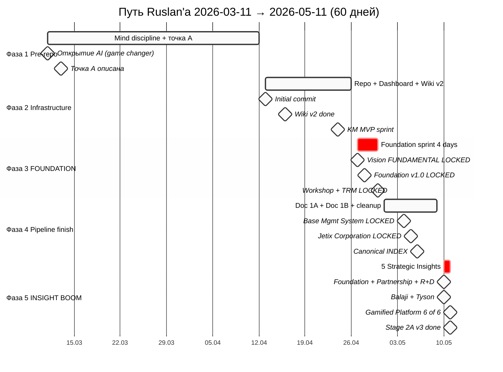
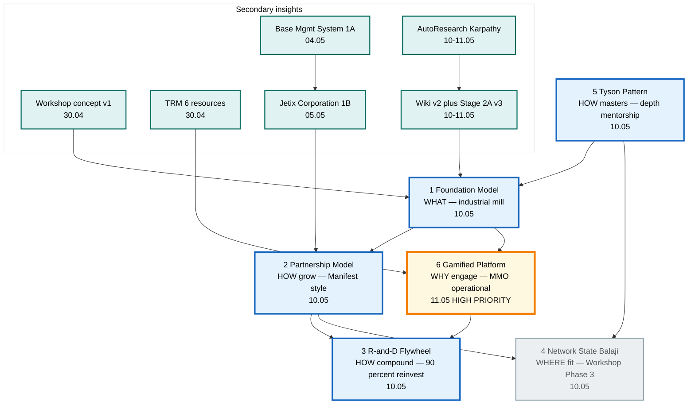

# 🧠 Отчёт для созвона с Антоном — путь за 2 месяца

> **Зачем этот документ.** Антон, мы давно не созванивались (~2 месяца). За это время произошло **много**: я закрыл этап «настройка видения + Life OS v0» и зашёл в активную сборку **Jetix OS** — рабочей системы, в которой я живу и работаю. Этот отчёт — попытка упаковать путь так, чтобы тебе с нуля было понятно: где я был, куда пришёл, что узнал, где застрял, и где мне нужна твоя помощь.
>
> **Структура.** §A executive (1 страница) → §B путь → §C insights → §D что сделано → §E что не сделано → §F где я сейчас → §G блоки вопросов → §H как ты можешь помочь → §I открытые вопросы.
>
> **Тон.** Прямой, человеческий. AI помогал собрать факты + структуру; стратегические смыслы — мои. Где написано «verbatim Ruslan» — это мои слова, AI не сочинял.

---

## §A Executive summary (1 страница)

### Где я был (2026-03-11)

- Настроил **видение жизни** (что я хочу, какие ценности)
- Собрал **Life OS «v0»** в Notion — базовая система ведения дня, недели, проектов
- Открыл для себя **рабочий AI** (mid-Feb 2026 — Claude Code) как «game changer»
- Начал описывать **«точку А»** + систему управления проектами (прото-Jetix)
- 0 клиентов, 0 выручки от AI-консалтинга
- Жил в Берлине один, режим карнивор, физика в так-се (травма колена в Sep 2025 ещё аукалась)

### Где я сейчас (2026-05-11)

- **Foundation v1.0 LOCKED** — конституциональная архитектура системы из 11 Parts + Pillar A/B/C (28.04.2026, git tag `foundation-architecture-locked-2026-04-28`)
- **6 Hexagon Strategic Insights** LOCKED (10-11.05): Foundation Model / Partnership Model / R&D Flywheel / Network State / Tyson Pattern / Gamified Platform
- **3 канонических документа** LOCKED: Базовая Система Управления (Документ 1A), Jetix Corporation (Документ 1B), Workshop concept v1
- **Wiki KB** на 575 страниц + 609 связей в graph, шесть «ниш» (business / life / meta / personal / sales / tech)
- **Voice pipeline canonical** + **AutoResearch MVP** + **Mermaid стек** — операционная инфраструктура работает
- **Stage 2A v3** (LLM precision rerank по 1262 voice candidates) — done, 60.1% match rate, +137 высокоуверенных связей ждут bulk-ack
- В работе **Gamification Deep Wiki Mining** + **видео-проpоsal Цэрэну** (потенциальный bridge к Левенчуку/ШСМ)
- 0 клиентов, 0 выручки — **главный диссонанс** между амбициями и реальной точкой

### 3 ключевых инсайта периода

1. **Jetix = foundation model для управления информацией.** Не консалтинг и не «один эксперт продаёт услуги». А **индустриальная мельница**, которая берёт сырьё (мысли, идеи, voice memos, источники) и перерабатывает в знания + решения + действия. Универсальная база, которую можно «натянуть» на любую нишу (медицина, geymdev, e-commerce, research).

2. **Партнёрская модель ≠ продажа софта.** Я не буду «долбоёбом, продающим софт». Я буду партнёрить с предпринимателями (Manifest-style): они приносят домен и амбицию, я приношу систему и AI-инструменты, мы делим upside. Online-first (никакого DACH-Mittelstand больше). 90% прибыли реинвестируем в R&D (Manifest / Amazon флайвил).

3. **Gamification — не «бейджи», а MMO-операционный слой.** Я в один вечер 10-11.05 при чтении про Torn / Roblox / Dota увидел, что Jetix Realm можно построить как геймифицированную **операционную среду** для предпринимателей — с реальными ресурсами (TRM 6 видов), уровнями мастерства, синергиями. Это меняет product design радикально.

### 3 главных блока сейчас

1. **Как быстрее дойти до $100K** (Phase 1 цель к концу лета 2026) — фокус на quick-money AI-services vs. глубокая стройка Jetix
2. **Gamification Life OS — psychology angle** — какие mechanisms motivation обязательны, как избежать anti-patterns (whaling / pay-to-win)
3. **Mental clarity / overload** — 6 Hexagon insights + 6 secondary за 2 недели = «boom of insights»; как не утонуть в проектировании

### 1 ключевой вопрос для тебя

**«Я в фазе intensive build, но без клиента. Не строю ли я слишком масштабную теорию вместо того, чтобы продавать?»** — это самый честный мой вопрос, и я хочу услышать твою оценку.

---

## §B Путь (timeline narrative по фазам)

Я разделил 60 дней на **5 фаз**. Каждая фаза — отдельный режим работы и отдельный качественный сдвиг.

### Фаза 1 — Pre-repo, mind discipline (2026-03-11 → 2026-04-12, ~32 дня)

**Что делал:**
- Описал «точку А» (свою ситуацию) формально — это стало прото-документом Jetix Vision
- Создал систему управления проектами в Notion (8 канонических проектов)
- Брал уроки экономики (2 урока с учителем) — для системного мышления
- Читал, думал, искал репетитора/ментора для прокачки мышления
- Открыл, что **AI = electricity** — ценность смещается «от ума к выбору» (это потом стало одной из ключевых wiki-идей)

**Toggl (March 2026):** 716h logged, DW 103h, Сон 271h (хороший месяц трекинга).
**Notion weekly review:** обрывается ~15.03.2026 — я перешёл на CC-based daily logs.

**Что узнал:**
- AI — не tool, а **новая среда**. Раньше я думал, как заставить себя работать; теперь думаю, как использовать AI как «второй мозг»
- Mindset сначала, инструменты потом. Когда mindset = «обезьяна управляет мной», никакие инструменты не помогут

**Turning points:**
- 09-15.03 — неделя «отличного состояния» + описание точки А (sentiment subjectively peak)
- Mid-March — решение «надо строить систему на коде, не в Notion» → подготовка к repo init

**Sentiment:** концентрированный, направленный, но без operational output. Много мышления, мало pull.

### Фаза 2 — Repo init + Infrastructure (2026-04-13 → 2026-04-26, ~14 дней)

**Что делал:**
- **13.04** — initial commit Jetix OS. Master CLAUDE.md, 12 agent roster, 6 departments
- **14-15.04** — Jetix HQ Dashboard (React + Vite + Tailwind + Express + SQLite + WebSocket). 8 экранов: command center, kanban, knowledge, HQ, agents, analytics, observability, settings
- **16.04** — Wiki Architecture v2 (Karpathy LLM Wiki + OmegaWiki). 9 типов entity, niches, graph/edges.jsonl, skills (/ingest, /ask, /lint, /consolidate, /build-graph)
- **16-21.04** — Notion alpha extraction (29 ideas imported), ideas batch 1/2/3
- **18.04** — Stage A pipeline closure, templates closure, folders closure
- **23-24.04** — KM Materialization MVP sprint (cyc-km-materialization-mvp-2026-04-24): A1 Karpathy++ substrate + B2 Rich mini-swarm + B3 stage-gate mechanic
- **26.04** — CRM build cycle (cycle-10), CRM system 14 sections + 10 skills + 13 statuses + 24 roles

**Объём:** ~200 commits за 14 дней. Это **самая интенсивная** инфраструктурная фаза.

**Что узнал:**
- Filesystem = source of truth, Notion = view (не наоборот). Это было неочевидно сначала, но после первой попытки sync'ать стало кристально
- Multi-agent — это не про «больше моделей», а про **distribution of attention**. Manager — лимит 20 задач (Tier 2 RUSLAN-LAYER override)
- KM (knowledge management) первичнее всех skills — без структурированной wiki agents бесполезны

**Turning points:**
- 14.04 — момент «у меня есть рабочая dashboard» = первый раз система видна визуально
- 16.04 — wiki/ заменил knowledge-base/ — переход на «Karpathy substrate»
- 24.04 — KM MVP sprint завершён, ready для Foundation build

**Sentiment:** высокая velocity, flow, чувство «мы строим что-то реальное».

### Фаза 3 — FOUNDATION SPRINT (2026-04-27 → 2026-04-30, 4 дня)

Это **самая концентрированная фаза в моей жизни**. За 4 дня LOCKED 5 канонических артефактов.

**Хронология:**

- **27.04** — JETIX VISION FUNDAMENTAL v1.0 LOCKED. 35 use cases × 12 категорий. Layer 1 of 2 (RUSLAN-LAYER overlay = Layer 2). Constitutional anchor для всего что дальше
- **27.04** — JETIX FPF Constitutional Spec (3758 lines). FPF-Steward governed
- **28.04** — Foundation v1.0 LOCKED. 11 Parts (System State / Signal Ingestion / Knowledge Base / Role Taxonomy / Compound Learning / Provenance Officer / Human Gate / Project Lifecycle / Health Monitoring / Owner Interaction / External Touchpoints) + Pillar A/B/C (Strategic Direction / Project Lifecycle Substrate / Principles)
- **28.04** — F-G-R / Default-Deny / Halt-Log-Alert / Corrigibility schemas. 11 hard rules constitutional Tier 2
- **28.04** — Bundle 5 Strategic Layer Foundation. Pillar A/B/C structural placement. 8 RUSLAN-ACK records (Bundles 1+1supp1+1supp2+2+3+4+Wave D+Strategic Layer)
- **30.04** — JETIX WORKSHOP CONCEPT LOCKED. Метафора «мастерская для работы с информацией» — заменяет старую метафору «дом». Ruslan-dictated.
- **30.04** — JETIX TRM MODEL LOCKED. Total Resource Management — 6 ресурсов (финансы / время / аудитория / знания / compute / команда). Business model parallel: BlackRock управляет 1 ресурсом ($), Jetix — 6

**Что узнал:**
- **Constitutional posture работает.** Когда есть «AI = scribe, Ruslan = sole strategist» прописанная константа, я перестаю проигрывать AI стратегические решения. Это огромный сдвиг
- **Foundation = язык, на котором обсуждаем всё остальное.** Без него каждый день — заново
- **«Workshop» лучше чем «дом».** Дом — статика. Мастерская — там делают / меняют / собирают. Это точнее моей реальной модели

**Turning points:**
- 28.04 evening — момент LOCKED. После недели мышления + 4 дней sprint'a — Foundation v1.0 закрыта
- 30.04 — Workshop + TRM = у Jetix есть **WHAT** (метафора) + **HOW** (бизнес-модель)

**Sentiment:** apex. Чувство, что я закрыл главный архитектурный долг. Velocity 6-24× быстрее чем эстимейт по Wave C bundles.

### Фаза 4 — Pipeline finish + Doc 1A/1B (2026-05-01 → 2026-05-09, 9 дней)

**Что делал:**
- **01.05** — Voice pipeline run + Workshop deepening. ActivityWatch installed + AFK 180s
- **02.05** — Malware-partnership analysis (1100 lines) + CC-as-OS course analysis (1110 lines) + Time-tracking categories v1.1 LOCKED
- **03.05** — Toggl pipeline LOCKED (Starter, 8 projects clean, 49 tags). Historical baseline corrected. Retrospective 2025-05..2026-04 compiled
- **04.05** — **BASE MANAGEMENT SYSTEM (Документ 1A) LOCKED.** Универсальный каркас управления — применим к любой нише. Parent of Jetix Corp
- **05.05** — **JETIX CORPORATION (Документ 1B) LOCKED.** Applied use case Базовой Системы. Видение, бизнес-модель, фазы, предложение партнёрам
- **06.05** — Canonical cleanup. `canonical/INDEX.md` (110 docs со статусом), `CANONICAL-WALKTHROUGH-2026-05-06.md` (110 docs walkthrough), archive/INDEX.md (~63 pre-Foundation docs). Cross-ref audit log
- **07.05** — Mermaid Style Guide canonical (Variant A cool blues palette). Mermaid skills (create / iterate / export / validate)
- **08.05** — Workshop deep diagrams v4-v6 (system boundary explicit, network/sources/output outside system)
- **08-09.05** — Подготовка к outreach Цэрэну + Левенчуку (видео proposal в драфте)

**Что узнал:**
- **Документы 1A + 1B = базовая пара.** 1A — каркас (универсальный), 1B — наполнение (Jetix-specific). Это паттерн, который можно повторять
- **Voice pipeline canonical** — операционный workflow для voice→KB. Reusable (lens config-driven, не one-shot). Tseren — первая инстанциация
- **Cleanup критичен.** 110 docs ушло в `canonical/`, 63 в `archive/`. Без этого папка `decisions/` была бы свалкой

**Turning points:**
- 04-05.05 — Документы 1A + 1B = у Jetix есть universal + specific layer
- 06.05 — Canonical Walkthrough = первый раз вижу все 110 doc'ов и их статус сразу

**Sentiment:** консолидация. После Foundation sprint — последовательный clean-up + операционная подготовка.

### Фаза 5 — INSIGHT BOOM + Pipeline upgrade (2026-05-10 → 2026-05-11, 2 дня)

**Что делал:**
- **10.05** — Voice pipeline Phase 2 → 47 memos processed → 8 deliverables (per-note breakdown, structured clean, current-lens, wiki candidates, backlog flagged, meta-analysis, discipline log, master index). **1627 items scored → 48 above threshold 0.6 → top 20**
- **10.05** — Wiki Integration v2 (Stage 5 fix: 0% → 50.1% match rate; BM25 + Russian morphology + 3-tier classification). Merged to main, tag `wiki-integration-v2-2026-05-10`
- **10.05** — AutoResearch Phase 2 MVP (Karpathy pattern applied). D.2 voice lens pilot: 81 experiments, 8 KEEPs, baseline 0.129 → 0.240 (+86%). Tag `autoresearch-v1-2026-05-11`
- **10.05 evening** — 5 Strategic Insights LOCKED в один вечер:
    1. **Foundation Model** — verbatim Ruslan voice insight при чтении статьи про Foundation Models в AI: «Jetix тоже идёт в foundation модели, и будет именно foundation моделью — этой индустриальной мельницей»
    2. **Partnership Model** — verbatim при чтении про Manifest AI: «долбоёбами не будем — продавать только софт. Партнёрить с предпринимателями». RES.1 Mittelstand DACH ABANDONED. RES.2 R&D 90% reinvest. RES.3 equity terms deferred Phase 2
    3. **R&D Flywheel** (§13 within Partnership) — 90% reinvest target, Manifest+Amazon pattern
    4. **Network State / Balaji** — Workshop Phase 3 ≈ Network State substrate pattern (5 of 7 NS steps map). Deferred Phase-3+
    5. **Tyson Pattern** — depth-mentorship (Cus D'Amato analogy). Левенчук = primary mentor candidate
- **11.05** — **Strategic Insight 6/6: Gamified Platform** ⭐ HIGH PRIORITY. Torn/Roblox/Dota patterns applied. Jetix Realm = MMO operational layer. 6 entities + 7 mechanics + recruitment top game designers (Yanis Varoufakis + Joost van Dreunen NYU Stern + Castronova confirmed + Machinations.io as core tool)
- **11.05** — **Stage 2A v3 DONE.** Overnight LLM precision rerun: 158 batches, 1262 candidates × 10 wiki matches each. Result: Tier A grew 39 → **137** (+3.5×). Match rate 50.1% → 60.1% (+10pp). 0 throttle, 0 fallback. 5h 47min runtime
- **11.05** — Wiki state analysis + Wiki edges deep explanation (6 mermaid + concrete 39 examples)
- **11.05** — Gamification Deep Wiki Mining plan-doc (5 domains: top 10 games, game economy experts, game theory, psychology, 6 Realm entities)

**Что узнал:**
- **Insights валятся боком.** За 36 часов — 6 связанных Strategic Insights. Каждый меняет product/strategy stack. Это пугает (overload) и радует (compound learning работает)
- **AutoResearch (Karpathy pattern)** — paradigm shift: запускаешь mutations + evaluator, оставляешь топ-K KEEPs. Не «правильный ответ» в голове, а **breed of variants**
- **Gamification ≠ HR-bullshit.** Это про **внутренние ресурсы и их трансформацию** — TRM 6 ресурсов = MMO inventory; уровни мастерства = skill trees; синергии = guild mechanics

**Turning points:**
- 10.05 evening — момент, когда я понял, что Jetix = foundation model (не консалтинг и не AI-tools shop)
- 11.05 evening — Gamified Platform → Jetix Realm gains operational layer

**Sentiment:** одновременно euphoria и **overload**. Меньше структуры, больше «mind on fire».

---

## §C Что нового узнал (insights breakdown)

### §C.1 Шесть Hexagon Strategic Insights (главные)

Они связаны попарно и образуют hexagon — каждый отвечает на свой вопрос «что» / «как» / «где» / «почему».

| # | Insight | Дата | Вопрос | Главная мысль (verbatim Ruslan где применимо) |
|---|---------|------|--------|------------------------------------------------|
| 1 | **Foundation Model** | 10.05 | WHAT? | «Jetix тоже идёт в foundation модели — этой индустриальной мельницей» |
| 2 | **Partnership Model** | 10.05 | HOW grow? | «Долбоёбами не будем — продавать только софт. Партнёрить с предпринимателями» |
| 3 | **R&D Flywheel** | 10.05 | HOW compound? | 90% reinvest target (Manifest + Amazon pattern) |
| 4 | **Network State / Balaji** | 10.05 | WHERE fit? | Workshop Phase 3 = Network State substrate pattern (deferred Phase-3+) |
| 5 | **Tyson Pattern** | 10.05 | HOW masters? | Молодой чемпион через лучших менторов (Cus D'Amato analogy) |
| 6 | **Gamified Platform** ⭐ | 11.05 | WHY engage? | Torn / MMO / Roblox patterns applied; Jetix Realm = operational layer |

**Связи между инсайтами:**
- (1) **Foundation Model** → даёт **WHAT** для (2) **Partnership Model** (что мы партнёрим) + (6) **Gamified Platform** (что мы геймифицируем)
- (2) **Partnership** + (3) **R&D Flywheel** = пара: WHO joins us + HOW we grow with them
- (5) **Tyson** + (4) **Balaji** = пара: founder masters via mentors (input) → builds substrate community (output)
- (6) **Gamified Platform** — самый недавний — operational layer для (1) Foundation Model

### §C.2 Шесть secondary insights

1. **Workshop concept v1** (30.04) — метафора «мастерская» лучше «дома» (Ruslan-dictated)
2. **TRM 6 ресурсов** (30.04) — финансы / время / аудитория / знания / compute / команда
3. **Базовая Система Управления** (04.05) — universal foundation, применимая к любой нише
4. **Jetix Corporation** (05.05) — applied use case 1A: видение, бизнес-модель, фазы, предложение партнёрам
5. **AutoResearch (Karpathy pattern)** (10-11.05) — autonomous experiment loops применённые к Jetix workflow
6. **Wiki Integration v2 + Stage 2A v3** — операционная инфраструктура для voice→KB pipeline; semantic precision через LLM rerank

### §C.3 Что эти insights меняют

- **Бизнес-модель:** не консалтинг, не SaaS, а **партнёрство + foundation substrate**. Это меняет offer, pricing, sales motion полностью
- **Product:** не AI-tools shop, а **Jetix Realm** — операционная среда (геймифицированная) для предпринимателей-«психопатов»
- **Команда:** не наём agency-style, а **«мастерская мастеров»** + Strategic Council (Tyson pattern → депт-mentorship 1-2 ментора)
- **География:** **online-first ONLY** (DACH-Mittelstand abandoned, RES.1)
- **R&D:** жёсткий **90% reinvest** target — founder living costs minimal до Phase 2

---

## §D Что реально сделал (deliverables)

### §D.1 Canonical LOCKED docs (12)

| Документ | Дата | Tag |
|----------|------|-----|
| JETIX VISION FUNDAMENTAL v1.0 | 27.04 | — |
| Foundation v1.0 (11 Parts + Pillar C) | 28.04 | `foundation-architecture-locked-2026-04-28` |
| 8 RUSLAN-ACK records (Bundles 1+1s+1s2+2+3+4+Wave D+Strategic Layer) | 27-28.04 | — |
| Workshop Concept v1 | 30.04 | — |
| TRM Model | 30.04 | — |
| Base Management System (Doc 1A) | 04.05 | `base-management-system-locked-2026-05-05` |
| Jetix Corporation (Doc 1B) | 05.05 | `jetix-corporation-locked-2026-05-06` |
| 5 Strategic Insights (Foundation / Partnership / Balaji / Tyson / Gamified) | 10-11.05 | — |
| FPF Constitutional Spec (3758 lines) | 27.04 | — |
| Foundation Build Master Plan Brief | 27.04 | — |

### §D.2 Infrastructure (operational)

| Инфраструктура | Что это |
|----------------|---------|
| **Jetix HQ Dashboard** | 8 экранов: command center, kanban, knowledge, HQ, agents, analytics, observability, settings (React + Vite + Express + SQLite + WebSocket) |
| **Wiki Architecture v2** | Karpathy LLM Wiki + OmegaWiki. 9 entity types, niches, graph, /ingest /ask /lint /consolidate /build-graph skills |
| **CRM System** | 24 roles в 6 groups, 13 pipeline statuses, 10 skills, voice integration через DRAFT-only |
| **Voice Pipeline canonical** | reusable workflow (lens config-driven). 47 memos processed → 8 deliverables |
| **AutoResearch (Karpathy pattern)** | mutation_generator + evaluator + constitutional_gate + cost_tracker. Phase 2 MVP done |
| **Mermaid stack canonical** | Variant A cool blues palette + 4 skills (create/iterate/export/validate) |
| **Toggl pipeline** | Starter activated, 8 projects clean, 49 tags, scripts ready |
| **ActivityWatch + Toggl + voice→CC→entries** | WIP integration |
| **KM Materialization MVP** | 4 типа проектов, 7 новых skills + 5 расширенных, `.claude/config/project-types.yaml` |
| **Mini-swarm template** | `.claude/agents/project-brigadier.md` (≤7 задач, project-scope) |
| **Stage 2A v3** | LLM precision rerank done. 137 Tier A awaiting bulk-ack |
| **Canonical INDEX** | 110 docs со статусом, walkthrough, archive INDEX |

### §D.3 Wiki KB current state

- **575 entries:** ideas 257 + sources 271 + concepts 14 + entities 4 + claims 5 + (foundations / topics / summaries / experiments empty)
- **609 edges:** part_of 233 + derived_from 219 + supports 84 + extends 35 + mentions 32 + people 5 + contradicts 1 (⚠️ слабая antithesis detection)
- **6 niches:** business / life / meta / personal / sales / tech
- **Pending bulk-ack:** 137 Tier A (LLM-confirmed) ждут merge → 609 → ~720+ edges

### §D.4 Reports (sample, наиболее важные)

- `retrospective_2025-05_to_2026-04.md` — 12 месяцев пути
- `timeline-narrative-2025-07_to_2026-05.md` — 10 месяцев narrative
- `toggl_full_history_v2_2026-05-03.json` — полная история по проектам
- `deep-analysis-wiki-autoresearch-2026-05-11.md` — 1095 lines, 4 mermaid, 25 variants forward
- `wiki-edges-deep-explanation-2026-05-11.md` — 6 mermaid + 39 examples
- `wiki-state-analysis-2026-05-11.md` — post Stage 2A v3
- `gamification-deep-wiki-mining-plan-2026-05-11.md` — план Шага C (видео Цэрэну отложено пока gamification mining не done)
- `voice-pipeline-2026-05-10/` — 8 deliverables + EXPLAINED-FOR-RUSLAN

### §D.5 Toggl breakdown (2026-03-11 → 2026-05-11, ~60 дней)

| Месяц | Total logged | Сон | DW | Рутина | Ебланил | Отдых | Спорт+Зарядка+Гулял |
|-------|-------------|-----|----|---------|---------|--------|-------|
| **2026-03** | 716.8h | 271.0h | 103.3h | 197.6h | 41.0h | 46.3h | 44.9h |
| **2026-04** | 702.5h | 230.3h | **150.4h** ⭐ | 146.3h | 75.0h | 54.5h | 43.9h |
| 2026-05 (partial) | 57h (2 дня) | — | — | — | — | — | — |

**Объективные сигналы:**
- DW в апреле = 150.4h (all-time peak month) — Foundation sprint + Documents 1A/1B
- «Ебланил» вырос с 41h (Март) → 75h (Апрель) — ⚠️ значимый рост, может быть compensation после sprint'a
- Сон упал с 271h → 230h (Март → Апрель) — overtime cost Foundation sprint
- 2026-05 partial — tracker не дотрекивает (только 57h logged за 2 дня = density ~50%)

---

## §E Что НЕ сделал / что блокирует

### §E.1 Open tensions (Partnership Model резолюции 10.05)

| ID | Tension | Status |
|----|---------|--------|
| RES.1 | Mittelstand DACH ICP | **ABANDONED** (online-first only) |
| RES.2 | R&D Reinvestment target | **90%** (founder living costs minimal) |
| RES.3 | Equity-leaning partnership terms | **DEFERRED** to Phase 1-2 transition |

### §E.2 Deferred Phase-2+

- **Balaji / Network State outreach** — Phase 2+ deferred. Trigger: $100K + 20+ мастерских + published artifact (5 of 7 NS steps уже map к Workshop Phase 3)
- **Foundation Model deep development** — defer until 1+ partner-led case study + ≥3 niches validated
- **Tyson Pattern** — depth-mentorship-dedication operationalization (Левенчук = primary candidate, режим неясен — еженедельно / месячно / depth project)
- **Equity-leaning partnership term sheet** — defer until есть real partnership flowback
- **Strategic Council ambition** — 7-8 топ-стратегов как отдельный слой (deferred до $100K + partnership traction)

### §E.3 Что не закрыто / висит

- **0 клиентов, 0 выручки** — главный диссонанс. Voice memos (47 штук) **не содержат ни одной задачи про реальный outreach** — 26 из 50 items привязаны к «Сообщество» (P3), при том что P1 = Quick Money
- **Видео-proposal Цэрэну** — в драфте (10.05); запуск отложен пока Gamification Deep Wiki Mining не done. Это **bridge к Левенчуку/ШСМ** = главный outreach lever
- **Документ «Кто я / Кто такой Jetix»** для бренда — упоминается в voice 2× как «now actionable», но не сделан
- **Bulk-ack 137 Tier A edges** — pending (5-10 min работы)
- **Gamification Deep Wiki Mining** — plan-doc готов (1002 lines, 13 Q acked defaults), execute Шаг C — pending
- **Question Mining (Шаг D)** — после mining: 4 categories questions → варианты / hypothesis. Pending
- **Wiki gap: concepts (14) + entities (4)** = critically light. Gamification mining нужен чтобы balance ~95-115 / 30-40
- **Contradicts edges = 1** (⚠️ слабая antithesis detection) — нет «debate» структуры в graph
- **3 канала outreach простаивают** — LinkedIn, email, community engagement
- **Founder isolation pattern** — concept в wiki, реальная контра ещё не построена

### §E.4 Антипаттерны, которые я наблюдаю в себе

Из meta-analysis voice pipeline (50 voice memos):
- **Sub-investment в P1.** 50 items → 0 задач про реальный outreach / клиентов. 4 косвенные задачи. Mass attention уходит в архитектуру + Сообщество (P3)
- **Over-engineering риск.** «Сразу внедрять, а не описывать» — принцип, который я нарушаю чаще, чем выполняю
- **Эскалация амбиций.** За одну ночь (08-09.04): outreach клиентам → холдинг как у Маска → платформа уровня интернета → миллионы выручки. Признак повышенного эмоционального запала, ночные записи (03:40-04:37)
- **«Описать систему ещё раз»** — 5+ задач этого типа. Риск проектного паралича
- **AI-агенты как универсальный решатель.** Mention в почти каждом проекте. Возможна over-dependency на инструмент, который ещё не построен полностью

---

## §F Где я сейчас (Точка А detailed snapshot)

### §F.1 Constitutional posture

- **AI = scribe, Ruslan = sole strategist.** Tier 2 RUSLAN-LAYER. Без исключений
- **Filesystem = source of truth.** Notion = view (не authoritative)
- **Default-Deny + Halt-Log-Alert.** 11 hard rules Tier 2. F8 grade violations ≤1s halt
- **Append-only logs.** Никаких mutating edits в decisions/ или canonical/
- **Russian для content, English для code и configs**

### §F.2 Ресурсы

| Resource | Где я |
|----------|-------|
| **Время** | ~4-5h/день active DW logged (Toggl), реально ~10h работаю. Density ~50% |
| **Команда** | 1 человек (я) + 12 AI agents (Sonnet 4.6 / Haiku 4.5 / Opus 4.6). Нет co-founder, нет hires |
| **Капитал** | Minimal living, без runway-кризиса но и без буфера. 0 client revenue |
| **Внимание** | 8 активных проектов (P1 quick-money / P2 research / P2 brand / P2 ai-tools / P3 community / P3 life-os / P3 engineering-thinking / P4 bets). Это many fronts |
| **Знания** | 575 wiki entries, 609 edges, 6 niches. Сильнее всего в Foundation / System Thinking / AI Tools. Слабее в Sales / Marketing / Community building |
| **Сеть** | Берлин-локализован. Контакты: Цэрэн (потенциальный bridge к Левенчуку/ШСМ), Левенчук (target mentor), Дима (друг). Strategic Council pending |

### §F.3 Состояние ментальное (по daily logs + voice meta-analysis)

- **High velocity** — Foundation sprint + Pipeline finish + Insight Boom = 60 дней concentrated build
- **Mind on fire** — 6 Hexagon + 6 secondary insights за 2 недели = «boom of insights»
- **Founder isolation** — concept identified в wiki, реальная mitigation ещё не построена
- **Overload signal** — increase в «Ебланил» апреле (41→75h)
- **Доминирующая тема в voice:** Сообщество как стратегический рычаг масштабирования (24/50 items)
- **Главный страх (verbatim my voice):** «расслабиться пока семья не в безопасности» (audio_411)

### §F.4 Что я понял про себя за период

1. **Я могу долго строить в одиночку.** Foundation sprint = 4 дня velocity 6-24× выше эстимейта. Это не норма, но я могу
2. **Я нуждаюсь в depth-mentorship.** Tyson pattern resonates сильно — не 7 ментор на повестке, а 1-2 глубоких
3. **Я склоняюсь к over-engineering.** Каждый new insight ведёт к new doc/skill/architecture. Reality check: 0 клиентов
4. **Я работаю под давлением «семья + финансовая стабильность».** Это сильный мотиватор + риск burnout
5. **Я лучше всего работаю когда есть clarity об архитектуре.** Foundation LOCKED → velocity взлетела

---

## §G Ключевые вопросы / задачи для Антона

### §G.1 Блок 1 — Strategy / fast money

- **Q1.** Как быстрее прийти к $100K (Phase 1 цель до конца лета 2026)? У меня 75 дней до 1 августа
- **Q2.** Как balance между **quick-money AI-services** (P1) vs **deep Jetix building** (P2-3-4)?
- **Q3.** Voice meta показал: 50 items, 0 real outreach задач, 26 items на Сообщество (P3). **Стоит ли мне сейчас сознательно switch focus** на 2 недели интенсивного outreach?
- **Q4.** **Video-proposal Цэрэн → Левенчук/ШСМ** — это правильный first move? Или есть более прямой путь к первому клиенту?

### §G.2 Блок 2 — Gamification of Life OS / Jetix Realm (psychology angle)

Это блок, где **твоё psychology expertise критично**.

- **Q5.** **Jetix Realm 6 entities** (TRM-derived: финансы / время / аудитория / знания / compute / команда) — какие **psychological hooks обязательны** для motivation? Что обязательно из Self-Determination Theory (autonomy / competence / relatedness)?
- **Q6.** Как **избежать anti-patterns** — whaling, pay-to-win, cringe gamification, sunk-cost-fallacy traps?
- **Q7.** **ICP «профессионалы-психопаты»** — это рискованный target. Какие у тебя соображения как у психолога? Это **healthy frame** или я romanticизирую destructive patterns?
- **Q8.** **Реализм vs. эскапизм.** Геймификация Life OS — это **усиление реальности** (real resources, real consequences) или потенциальный эскапизм (играю в систему вместо жизни)?

### §G.3 Блок 3 — Mental clarity / overload

- **Q9.** «Boom of insights» (6 Hexagon + 6 secondary за 2 недели) — как **integrate без overload**? Каждый insight тянет product/strategy/team changes
- **Q10.** **Founder isolation** — я concept identified в wiki, mitigation не построена. Какие **practical practices** ты бы порекомендовал?
- **Q11.** «Sub-investment в P1» — у меня сильный creative pull в архитектуру, sub-pull в продажи. Как **rebalance** without losing momentum?
- **Q12.** **Sentiment cycle** (peak → crash → recovery каждые 6-8 недель в 2025). За 2 месяца 2026 я не вижу crash — это **healthy** или buildup?

### §G.4 Блок 4 — Workflow / discipline

- **Q13.** **AI = scribe rule** — работает на практике или я перекладываю стратегические решения на AI имплиситно?
- **Q14.** **Mentorship time с тобой** — как лучше использовать? Tyson pattern говорит «depth, не breadth». Какой ритуал / частота / формат?
- **Q15.** **Decision discipline** — у меня 8 LOCKED канонических артефактов + 6 Strategic Insights за 2 недели. Не **over-decide ли я**? Стоит ли часть прикинуться к bets/scratchpad вместо LOCKED?

### §G.5 Блок 5 — Идея наперёд: Tyson pattern + ритуал

- **Q16.** **Anton как «Cus D'Amato»?** Готов ли ты на **регулярный созвон + ритуал mentorship**? Я готов формализовать formats (созвон 1×/месяц + async / weekly check / depth-project 1×/квартал — варианты)
- **Q17.** Какие **areas твоего опыта** наиболее useful для меня сейчас (psychology of motivation / strategic thinking / decision quality / другое)?

---

## §H Как Антон может быть useful (предложение areas)

В порядке убывания priority по моей оценке:

1. **Psychology of motivation для gamified Life OS** — это блок, где я двигаюсь slepo. Critical input нужен **до того** как я начну product design Jetix Realm
2. **Strategic thinking / decision quality** — у меня много возможных moves, мало clarity «который сейчас правильный». Helpful для блока 1 (fast money)
3. **Mentorship pattern (Tyson-style)** — design нашего ongoing collaboration. Я хочу избежать «один раз поговорили и забыли»
4. **Mental clarity / counter-isolation** — как **balance** intensive build с emotional health. Counter founder isolation
5. **Anti-pattern detection** — посмотреть на меня снаружи. Где у меня blind spots? Где я romanticизирую destructive patterns?

**Ничего из этого не требует от тебя стать «бизнес-консультантом» — это psychology + system thinking, что и есть твой core.**

---

## §I Открытые вопросы для меня (не блокируют)

- **Anchor date.** Anchor выбран как 2026-03-11 (60 days назад). Notion weekly review обрывается ровно ~15.03.2026 — на 4-дневной границе. Если бы anchor был 15.03 — фаза 1 была бы тоньше. Не критично, но любопытно
- **Anton psychology background.** Я не помню точно — клинический / коучинг / academic? Это влияет на формулировку Блока 2 (Q5-Q8). Surface для уточнения в созвоне
- **Дата созвона.** Когда оптимально? У меня есть **Gamification Deep Wiki Mining** в работе (1-2 дня) + видео Цэрэну после него (1 день). Идеально созвон **до видео Цэрэну** — тогда clarity усилит проpoсал
- **Bets/experiments tier.** 6 Hexagon insights все LOCKED. Не стоит ли часть (например Network State / Tyson Pattern) опустить до status `bets` пока не появится первый real test?

---

## §J Schemes (mermaid)

### §J.1 Timeline 5 фаз (gantt)

### §J.2 Insights map — 6 Hexagon + связи

### §J.3 State Точка А → Точка Б

```mermaid
%%{init: {'theme':'base', 'themeVariables': {'primaryTextColor':'#000000','textColor':'#000000','lineColor':'#333333','primaryBorderColor':'#333333','primaryColor':'#fafafa','noteTextColor':'#000000','noteBkgColor':'#fff8d5','edgeLabelBackground':'#ffffff'}}}%%
stateDiagram-v2
    [*] --> PointA

    state PointA {
        [*] --> LifeOS_v0
        LifeOS_v0: Life OS v0 in Notion<br/>видение настроено<br/>0 clients<br/>AI discovery mid-Feb
        LifeOS_v0 --> TochkaA: точка А описана<br/>март 2026
        TochkaA: Foundation predecessor<br/>система управления проектами<br/>прото-Jetix
    }

    PointA --> Phase2: 13.04 repo init

    state Phase2 {
        [*] --> Dashboard
        Dashboard: HQ Dashboard 8 screens<br/>14-15.04
        Dashboard --> WikiV2: Wiki v2 substrate<br/>16.04
        WikiV2 --> KM_MVP: KM Materialization<br/>23-24.04
    }

    Phase2 --> Phase3: 27.04 Foundation sprint

    state Phase3 {
        [*] --> FoundationLOCKED
        FoundationLOCKED: Foundation v1.0 LOCKED<br/>11 Parts plus Pillar A B C<br/>28.04
        FoundationLOCKED --> WorkshopTRM: Workshop plus TRM LOCKED<br/>30.04
    }

    Phase3 --> Phase4: 01.05 pipeline finish

    state Phase4 {
        [*] --> Docs1A1B
        Docs1A1B: Doc 1A plus 1B LOCKED<br/>Base Mgmt plus Jetix Corp<br/>04-05.05
        Docs1A1B --> Canonical: Canonical INDEX cleanup<br/>06.05
        Canonical --> Mermaid: Mermaid stack canonical<br/>07-08.05
    }

    Phase4 --> Phase5: 10.05 insight boom

    state Phase5 {
        [*] --> Insights5
        Insights5: 5 Strategic Insights<br/>Foundation Partnership R-and-D<br/>Balaji Tyson<br/>10.05
        Insights5 --> Insight6: Gamified Platform<br/>HIGH PRIORITY<br/>11.05
        Insight6 --> Stage2Av3: Stage 2A v3 done<br/>LLM rerank 137 Tier A<br/>11.05
    }

    Phase5 --> PointB

    state PointB {
        PointB_now: Foundation LOCKED<br/>6 Hexagon insights<br/>3 canonical docs<br/>Wiki 575 plus 609 edges<br/>Voice plus AutoResearch ops<br/>0 clients still
        [*] --> PointB_now
        PointB_now --> NextSteps: Gamification mining<br/>Video Tseren<br/>1st client target
    }

    PointB --> [*]: 11.05 today
```

---

## §K Сводка для созвона

**Если у нас 60 минут с Антоном, я бы предложил такой порядок:**

| Время | Топик |
|-------|-------|
| 0-10 min | §A Executive summary — где был / где сейчас / ключевой вопрос |
| 10-20 min | Блок 3 — Mental clarity (Q9-Q12). Mention founder isolation + insight overload |
| 20-35 min | **Блок 2 — Gamification psychology** (Q5-Q8). Самый critical input для product design |
| 35-50 min | Блок 1 — Strategy / fast money (Q1-Q4). $100K в 75 дней — реалистично или нет? |
| 50-60 min | Блок 5 — Tyson pattern (Q16-Q17). Design ongoing collaboration |

**Не успеем — переносим на следующий созвон:**
- Блок 4 (workflow / AI scribe rule discipline)
- Deep technical Foundation walk
- Specific document reviews

---

## §L Provenance + audit trail

Каждый факт в этом отчёте имеет source:

| Что | Source |
|------|--------|
| Git log 810 commits | `/tmp/git-log-2mo.txt` (since 2026-03-11) |
| Notion subpage 35d2496333bf8179b809f68640f86ed3 | прочитано полностью |
| Decisions 12 LOCKED + 5 insights | `ls decisions/ \| grep -E "RUSLAN-ACK\|STRATEGIC-INSIGHT\|JETIX"` |
| Voice meta-analysis 50 items | `reports/voice-pipeline-2026-05-10/06-meta-analysis.md` |
| Wiki state 575+609 | `reports/wiki-state-analysis-2026-05-11.md` |
| Toggl breakdown | `reports/toggl_full_history_v2_2026-05-03.json` (months 2026-03 + 2026-04 + 2026-05) |
| Retrospective context | `reports/timeline-narrative-2025-07_to_2026-05.md` |
| Action plan + RES.1-3 | `decisions/STRATEGIC-INSIGHT-JETIX-PARTNERSHIP-MODEL-2026-05-10.md` §10.1 |
| Handoff context | `_archive/handoffs/_HANDOFF_to_next_cowork_session_2026-05-11.md` |
| Hexagon insights | каждый `decisions/STRATEGIC-INSIGHT-*.md` прочитан в headers |

Constitutional posture preserved. AI = scribe (структурировал факты, не сочинял стратегию). Ruslan = sole strategist (все «verbatim Ruslan» quotes — фактические; все hypothesis / questions — мои, не AI).

---

*Готово 2026-05-11. Готово к созвону с Антоном. После созвона — apply clarity к видео Цэрэну.*
