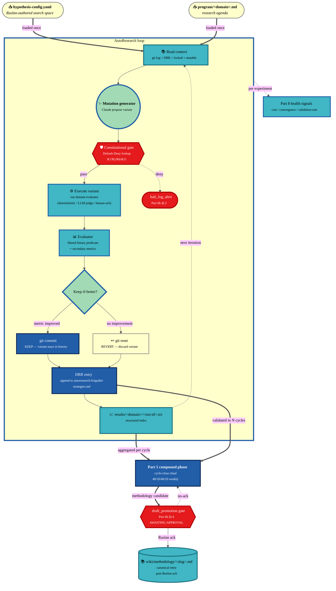

# AutoResearch (Karpathy) → Jetix Integration — Phase 1 Plan

> **Status.** Plan only. No implementation. Awaiting Ruslan ack for pilot-domain pick + cost cap + gate placement before any code lands.
>
> **Authorship.** Drafted under acting_as `autoresearch-integration-plan-orchestration-role` per IP-1 Role≠Executor (Part 4 §0). Strategic decisions (which pilot, which budget, which gate) deferred to Ruslan per Tier 2 R1.

---

## §0 TL;DR

Karpathy's AutoResearch (`karpathy/autoresearch`, 2026-03-07, 21K+ ⭐, 8.6M views) is a minimal (~630 LOC) propose→commit→train-5-min→evaluate→keep-or-rollback loop where an LLM agent treats `train.py` as a search space and git as memory. The Jetix-relevant insight isn't ML training — it's the **loop topology**: cheap deterministic evaluator + greedy keep-if-better + git-as-result-store + LLM-as-mutation-operator scales to any domain with a fast measurable metric. This plan (a) maps that pattern onto **16 candidate Jetix domains** organized in 4 clusters (communication / infrastructure / cognitive / process), (b) designs a `tools/jetix-autoresearch/` orchestrator that mirrors the existing voice-pipeline lens-config pattern and lands experiment outcomes in Part 5's existing DRR ledger / methodology-promotion gate, (c) proposes a **4-phase rollout** (pilot 1 domain → expand 2–3 → multi-agent → self-improving meta-loop), and (d) leaves **11 open questions** for Ruslan to resolve before implementation — chiefly which pilot domain, what daily cost cap, what auto-promote threshold, and where the constitutional gate sits. The plan **does not implement, does not run experiments, does not modify any existing canonical / agent / wiki, and refuses to predict ROI numbers** (Tier 2 R1 + prompt §4 explicit guards).

---

## §1 Karpathy AutoResearch — what it is

### §1.1 Loop structure (exact)

The cycle, distilled from the GitHub repo + DataCamp walkthrough + the n1n.ai deep dive:

```
LOOP forever (or until human stop):
  1. agent.read(program.md)                # human-authored research agenda
  2. agent.read(git log + current train.py)
  3. mutation = agent.propose_change(context)
  4. git commit mutation
  5. metric_new = train.run(budget=5min); extract val_bpb
  6. if metric_new < metric_baseline:
        baseline = metric_new   # KEEP — commit stays in history
     else:
        git reset --hard HEAD~1 # ROLLBACK — commit unmade
  7. goto 1
```

**Throughput.** ~12 exp/hr on single H100 ⇒ ~100/night; SkyPilot demonstrated 16-GPU parallel waves emitting 10–13 factorial-grid experiments per wave.

**Why 5 min wall-clock (not N steps).** Forces the agent to discover *fast* wins; high-variance long-converging mutations get penalized by the fixed budget. This is closer to an *anytime* algorithm than classical AutoML — and it's the design choice that makes the pattern portable to non-ML domains: any domain with a fixed-budget measurable metric works.

### §1.2 Code architecture (~630 LOC)

```
autoresearch/
├── README.md           # how to invoke
├── program.md          # ← human-editable research agenda (search-space spec in NL)
├── prepare.py          # LOCKED — data + eval, agent cannot modify
├── train.py            # MODIFIABLE — agent's search space
├── nanochat.ipynb      # reference baseline notebook
├── pyproject.toml      # deps locked
└── .gitignore
```

Two-file invariant: a **LOCKED** part (`prepare.py` — defines the metric + data, must be tamper-proof for valid comparison across runs) and a **MUTABLE** part (`train.py` — the search space). This split is the security boundary.

### §1.3 Tools / infrastructure

- **AI agent:** Claude Code primarily; agent-agnostic in principle (ChatGPT, Cursor, etc.).
- **API:** Anthropic Claude API (or equivalent). ~$9 inference total across 700 exps for Karpathy's run.
- **Compute:** Single H100 (V100 possible but slow). Cost ~$0.40–0.50 per 5-min experiment training run.
- **Memory:** Git itself. No DB, no results.tsv mandatory — commit messages + `git log` carry the experiment history.

### §1.4 Search space + mutation operator

The agent sees `program.md` + current `train.py` + recent `git log --oneline` and proposes **arbitrary Python code changes** to `train.py`. Reported real mutations include: adding a missing scalar in QK-Norm (a bug Karpathy himself had not caught), swapping AdamW for Muon, tweaking dropout / weight decay / warm-up. Not hyperparameter-grid search — actual code edits. Bounded by: (a) `prepare.py` is locked, (b) eval metric must compute identically, (c) no new package installs, (d) "simplicity prior" in `program.md` (`prefer small focused changes`).

### §1.5 Selection pressure

Pure greedy on single GPU: `if metric_new < baseline → keep`. SkyPilot's 16-GPU run preserves greedy but adds *factorial-grid waves*, exposing parameter-interaction effects sequential single-GPU greedy would miss. There is **no tournament**, **no Bayesian acceptance**, **no temperature** — explicitly simple. DataCamp flags this as a "creativity ceiling": the agent cannot take a strategic backward step to enable a larger gain. Mitigations in the community: meta-prompt "diversity guidance," explicit anti-revisit lists, multi-armed-bandit overlays. None merged into canonical Karpathy repo yet.

### §1.6 Results metrics

- **Primary metric:** val_bpb (validation bits per byte). Vocab-size-independent (unlike perplexity), deterministic, fast to compute.
- **Karpathy run:** 700 exps / 2 days / **11% wall-clock speedup** of nanochat baseline. ~20 kept commits ⇒ ~2.9% acceptance rate.
- **Independent replications:**
  - Tobias Lütke / Shopify — 19% on internal 0.8B query model in 37 exps (Fortune 2026-03-17).
  - SkyPilot — 2.87% in 8h on 16 H100s (910 exps). Slower per-exp wall-clock improvement but much faster cumulative.

### §1.7 Honest critique (from the sources)

- **"Creativity ceiling"** — DataCamp: greedy-only acceptance prevents strategic regression; "the agent excels at methodical optimization rather than architectural breakthroughs."
- **Local optima on single GPU** — SkyPilot empirically confirmed.
- **Domain narrowness** — tested on GPT-2-class training + Shopify query model only; generalization beyond LLM training is *claimed* but not yet independently demonstrated.
- **Reproducibility of the 11% claim** — Karpathy's repo is public and reproducible on identical hardware; cross-hardware (H200 vs H100) requires agent adaptation per SkyPilot's findings.
- **Hype framing** — some commentators argue it's "AutoML with extra steps." Plausible. The novel thing is the **fixed wall-clock budget** + **arbitrary code edit space** + **git-as-memory**, not the algorithm.

> "This is an *actual* LLM writing arbitrary code, learning from previous experiments, with access to the internet." — Karpathy (Fortune, 2026-03-17)

---

## §2 Mapping AutoResearch pattern → Jetix domains (16 candidates)

### §2.0 Mapping principles

Each candidate domain is evaluated against five criteria distilled from Karpathy's design:

1. **Measurable metric in a fixed budget** — can we score variants deterministically and fast?
2. **LOCKED part vs MUTABLE part exists** — is the evaluator separable from the search space?
3. **Constitutional safety** — does the mutation space touch Foundation (R2 forbidden) or stay RUSLAN-LAYER (auto-loopable)?
4. **Compound learning value** — does a validated win generalize beyond the experiment?
5. **Eval cost class** — *cheap* (≤1 cycle / synthetic data), *medium* (≤2 weeks / curated test set), *expensive* (≥2 weeks / real-world exposure).

### §2.1 Cluster A — Communication (external surface)

#### D.1 Outreach copy variations

- **Search space:** opening line personalization depth × value-prop framing (benefit / problem / curiosity) × CTA structure (call / docs / 2-question reply) × signature density.
- **Mutation operator:** Claude generates copy variant given ICP archetype, prior best, and `program.md` priors ("be concrete, avoid Mittelstand-condescending tone").
- **Selection criterion:** composite — open-rate, click-through, reply-rate, *and* discovery-call booking conversion. Tie-breaker: human ack on tone fit.
- **Locked part:** target list (ICP frozen for run), measurement window (e.g., 7 days post-send), reply classifier prompt.
- **Eval cost:** **expensive** (real outreach, 1–2 weeks per variant, requires statistical sample, costs reputation risk on bad variants).
- **Risk:** **medium-high** (external brand exposure).
- **Compound value:** very high — outreach is a recurring high-leverage activity; methodology promotion would materially shift conversion.

#### D.7 Workshop concept framings

- **Search space:** persona pairing (founder+CTO / solo founder / CFO+ops) × duration (2d / 5d / 10d) × modality (in-person / online / hybrid) × pricing point (€500 / €1000 / €2000) × "promise" framing (efficiency / autonomy / mastership / network).
- **Mutation operator:** Claude generates positioning copy + signup landing given prior best + recent decisions/JETIX-WORKSHOP-CONCEPT-2026-04-30.md.
- **Selection criterion:** enrollment rate × NPS × repeat-booking rate. Pre-committed decision rule required (per Tier 2 R1: no post-hoc rationalization).
- **Eval cost:** **expensive** (3–8 weeks delivery + post-delivery follow-up; bespoke pipeline).
- **Risk:** **high** (direct revenue + brand positioning + ICP perception).
- **Compound value:** high — workshop is core to Phase 2 with Цэрэн / ШСМ.

#### D.13 Strategic insight extraction prompts

- **Search space:** what makes an insight "substantial enough" to record (concreteness threshold / orthogonality check / surprise gradient); required sections per strategic-insight markdown; reframing-pass requirement.
- **Mutation operator:** Claude rewrites the strategic-insight extraction system prompt; runs it on a held-out corpus of voice memos.
- **Selection criterion:** insight velocity / cycle (more is *not* automatically better — coupled with adoption rate: % of insights operationalized within 2 cycles).
- **Eval cost:** **medium** (synthetic corpus + Ruslan qualitative judgment; existing `decisions/STRATEGIC-INSIGHT-*` corpus serves as benchmark).
- **Risk:** **medium** (touches Pillar A / Part 11 — needs Part 6b gate per R1).
- **Compound value:** high — insight extraction shapes strategic direction; better prompts compound over months.

#### D.15 Sales offer + pricing tier variations

- **Search space:** structure (fixed / hourly / performance-fee mix) × tier count (1 / 2 / 3) × payment terms (upfront / milestone / retainer) × anchor point.
- **Mutation operator:** Claude drafts proposal copy + pricing structure given prior won + lost deals.
- **Selection criterion:** proposal-to-closed_won %, average deal size, close-time delta.
- **Eval cost:** **expensive** (market exposure, 2–4 weeks per variant, Ruslan bandwidth bottleneck).
- **Risk:** **high** (pricing signals affect brand + ICP positioning; partial mitigations: A/B on same customer type, pre-commit decision rule).
- **Compound value:** very high — pricing leverage is permanent.

### §2.2 Cluster B — Infrastructure (internal substrate)

#### D.2 Voice pipeline lens configs

- **Search space:** scoring weights (w1 keyword / w2 semantic / w3 domain-element / w4 recency) × threshold × top-N × keyword-tier composition (tier-1 / tier-2 / tier-3 anchor sets).
- **Mutation operator:** Claude generates lens-config YAML variants given prior best + held-out memo corpus + target deliverable.
- **Selection criterion:** Hamel-binary acceptance predicate on each deliverable (e.g., "every tier-1 anchor appears in top-N output," "no false positives in 03-current-lens-actionables"). Composite secondary: Ruslan satisfaction score.
- **Locked part:** held-out memo corpus, deliverable acceptance predicate, scoring formula structure (only weights mutate).
- **Eval cost:** **cheap** (deterministic pipeline run; ~10 min per variant on 47-memo corpus).
- **Risk:** **low** (RUSLAN-LAYER config; revert is `git checkout`).
- **Compound value:** very high — voice pipeline is the recurring extract→filter→deliver loop driving most of Jetix's signal ingestion; small lens improvements compound across every run.

#### D.3 Mermaid diagram style variants

- **Search space:** node shapes (rectangle / circle / diamond / cylinder) × color palette (4 candidate Variant sets) × layout direction (TB / LR / BT / RL) × edge style (solid / thick / dashed) × subgraph nesting depth.
- **Mutation operator:** Claude renders a diagram fixture in N style variants; iterates on Ruslan binary "clearer / not clearer" feedback.
- **Selection criterion:** comprehension speed (time-to-first-correct-question by outsider reviewer) + Ruslan subjective preference + style-guide-consistency check (`mermaid-validate` skill).
- **Eval cost:** **cheap** (synthetic fixture; render is free).
- **Risk:** **very low** (presentational only).
- **Compound value:** medium (diagrams are visible artefacts but downstream effects on decision quality are diffuse).

#### D.6 Wiki structure decisions

- **Search space:** hierarchy axis (entity-type vs domain vs date) × frontmatter required-fields set × index granularity (single root / per-niche / per-entity-type) × naming pattern (`slug-YYYY-MM-DD` vs `slug--vN`).
- **Mutation operator:** Claude proposes restructure diff (mainly index files + frontmatter schema); runs synthetic queries and measures findability.
- **Selection criterion:** clicks-to-find on held-out query set + grep-pattern coverage + staleness count delta.
- **Eval cost:** **cheap** (read-only queries on existing wiki).
- **Risk:** **low** (RUSLAN-LAYER; revertable).
- **Compound value:** medium — structure changes ripple into every future ingest.

#### D.16 Naming conventions across artefacts

- **Search space:** slug format (date-in vs date-out, `YYYY-MM-DD` vs `YY-MM-DD`) × entity prefixes (`c-*` consulting, `r-*` research, etc.) × abbreviation policy.
- **Mutation operator:** Claude drafts new convention spec + dry-run rename pass; measures grep-pattern hit rate on real queries.
- **Selection criterion:** convention compliance rate (% of new artefacts following without manual fix) + search hit rate.
- **Eval cost:** **cheap**.
- **Risk:** **very low** (cosmetic; worst case is one inconsistent era).
- **Compound value:** low-medium.

### §2.3 Cluster C — Cognitive (agent + owner reasoning)

#### D.4 Agent system prompts

- **Search space:** role framing (acting_as language) × tool-use guardrails × output format strictness × example-shot count × constitutional preamble length.
- **Mutation operator:** Claude rewrites a target agent's `agents/<id>/system.md`; runs on held-out task corpus and scores outputs.
- **Selection criterion:** task-success rate on held-out tasks + Hamel-binary acceptance predicate per task + token-cost-per-task.
- **Locked part:** test task corpus + scoring rubric (must NOT mutate during run).
- **Eval cost:** **medium** (each task requires a real agent invocation).
- **Risk:** **medium** — agent prompt is RUSLAN-LAYER substrate but touches IP-1 Role boundary; Part 4 stage-gate needed on changes that alter `j_level_authority` / `allowed_modes` / `write_scope_glob`.
- **Compound value:** very high — agent prompt is the most leveraged single artefact per agent.

#### D.5 Time allocation patterns

- **Search space:** category taxonomy (rollups vs splits) × allocation weights per category × focus-block granularity (90min / 50min / 25min).
- **Mutation operator:** Claude proposes weekly schedule template variants given prior week's Toggl data + outcomes.
- **Selection criterion:** outcome-per-category (subjective + decisions-shipped) + plan-vs-actual delta + Ruslan-reported energy score.
- **Eval cost:** **cheap** (Toggl data exists; pure aggregation).
- **Risk:** **low** (personal productivity; reversible per week).
- **Compound value:** high — owner time is the scarcest resource in Phase A.

#### D.8 Mastership development curriculum

- **Search space:** topic order (substrate → automation in series vs parallel) × assessment checkpoint cadence × practice mode (solo / pair / group) × pre-read vs in-session balance.
- **Mutation operator:** Claude drafts curriculum variant given mastership-development decisions + Ruslan's prior learning patterns.
- **Selection criterion:** post-cohort retention scores + skill transfer (% of concepts applied in subsequent projects) + time-to-independence.
- **Eval cost:** **expensive** (multi-week cohort + follow-up).
- **Risk:** **medium** (affects product positioning).
- **Compound value:** high if Workshop becomes core product.

#### D.12 Daily plan structure (`/plan-day`)

- **Search space:** sections required (top-3 / priorities / focus blocks / compound ritual placement) × evening debrief questions × compound-phase input ceremony length.
- **Mutation operator:** Claude proposes daily-plan template variants given last 30 days of plans + their outcomes.
- **Selection criterion:** plan-completion-rate + satisfaction score + cycle-carryover items (lower = better).
- **Eval cost:** **cheap** (self-reported data + template structure).
- **Risk:** **low**.
- **Compound value:** medium-high — daily plan is recurring infrastructure.

### §2.4 Cluster D — Process (operational coordination)

#### D.9 CRM contact-status transitions

- **Search space:** status enum transition rules × stuck-detection threshold (currently 14d) × next-action heuristics per role.
- **Mutation operator:** Claude proposes transition-rule diff to `crm/_schema/`; runs simulation on existing contacts.
- **Selection criterion:** conversion rate by status × stuck-count rate × time-in-stage delta.
- **Eval cost:** **cheap** (simulation on existing CRM data).
- **Risk:** **low** (RUSLAN-LAYER).
- **Compound value:** medium-high — CRM heuristics drive Sales coordination.

#### D.10 Inbox triage routing rules

- **Search space:** priority classification heuristics × triage acceptance predicate × inbox-processor system prompt.
- **Mutation operator:** Claude rewrites `agents/inbox-processor/system.md` rules; runs on held-out voice-memo corpus.
- **Selection criterion:** triage accuracy (does classification match Ruslan's intended destination?) + cycle coverage (% signals processed per cycle).
- **Eval cost:** **medium** (held-out corpus + Ruslan label review).
- **Risk:** **medium** (downstream task dispatch effects).
- **Compound value:** high — affects every voice/inbox signal entering the system.

#### D.11 Project review template

- **Search space:** required frontmatter fields × retrospective section schema (lessons / decisions / methodology-candidates / budget-delta) × stage-gate predicate format.
- **Mutation operator:** Claude proposes template diff; runs on synthetic project closures.
- **Selection criterion:** completion rate (% fields filled) + methodology-promotion-candidates per project + Ruslan-reported usefulness.
- **Eval cost:** **cheap**.
- **Risk:** **low** (Part 7 artefact; stage-gate ack needed only on methodology-level changes).
- **Compound value:** high — every project closure consumes the template.

#### D.14 LLM-as-judge rubrics for voice items

- **Search space:** scoring rubric weights × category definitions × confidence threshold for acceptance.
- **Mutation operator:** Claude rewrites the LLM-judge prompt; runs on held-out voice corpus.
- **Selection criterion:** false-positive rate + false-negative rate + coverage (% of items scored vs skipped).
- **Eval cost:** **medium** (synthetic test corpus + human label review).
- **Risk:** **medium** (downstream task dispatch).
- **Compound value:** high.

### §2.5 Summary table

| ID | Domain | Cluster | Eval cost | Risk | Compound value | RUSLAN-LAYER auto-loop? |
|----|--------|---------|-----------|------|----------------|--------------------------|
| D.1  | Outreach copy | Communication | expensive | medium-high | very high | requires Ruslan ack per variant launch |
| D.2  | Voice lens configs | Infrastructure | cheap | low | very high | **YES** — top pilot candidate |
| D.3  | Mermaid styles | Infrastructure | cheap | very low | medium | YES |
| D.4  | Agent prompts | Cognitive | medium | medium | very high | partial — see §4 (Part 4 gate on authority fields) |
| D.5  | Time allocation | Cognitive | cheap | low | high | YES (owner-bound, reversible) |
| D.6  | Wiki structure | Infrastructure | cheap | low | medium | YES |
| D.7  | Workshop concept | Communication | expensive | high | high | NO — Strategic; Ruslan gate per variant |
| D.8  | Mastership curriculum | Cognitive | expensive | medium | high | NO — Strategic gate |
| D.9  | CRM transitions | Process | cheap | low | medium-high | YES |
| D.10 | Inbox triage rules | Process | medium | medium | high | partial — Part 4 gate on routing changes |
| D.11 | Project review template | Process | cheap | low | high | YES |
| D.12 | Daily plan template | Cognitive | cheap | low | medium-high | YES |
| D.13 | Strategic insight prompts | Communication | medium | medium | high | partial — Pillar A gate |
| D.14 | LLM-judge rubrics | Process | medium | medium | high | YES |
| D.15 | Sales offer / pricing | Communication | expensive | high | very high | NO — Strategic gate per variant |
| D.16 | Naming conventions | Infrastructure | cheap | very low | low-medium | YES |

**Recommended pilot candidates (deferred to Ruslan per Tier 2 R1):**
- **D.2 voice-pipeline lens configs** — best pilot. Cheap eval, low risk, very high compound value, RUSLAN-LAYER auto-loopable, mirrors the existing voice-pipeline infrastructure perfectly (zero new substrate required for the evaluator).
- **D.4 agent system prompts** — second-best. Medium eval, medium risk, very high compound value. Touches Part 4 IP-1 boundary only on authority-field changes (which need gate anyway).
- **D.11 project review template** — third. Cheap, low risk, high compound value, exercises Part 7 integration end-to-end.

---

## §3 Architecture design — Jetix AutoResearch infrastructure

### §3.1 Core insight — this is not net-new substrate

The Jetix internal explorer surfaced the load-bearing alignment: **AutoResearch is the prospective half of Part 5 compound learning**. Part 5 already has:

- Append-only DRR ledger schema (Decision / Reasoning / Result / Review) in `agents/<id>/strategies.md`
- `validated_in_cycles[]` accumulator + `ratio: {hits, misses}` decay counter
- Methodology promotion pipeline gated by Part 6b `gate_class: draft_promotion`
- Event-driven cycle-close compound-phase emission

AutoResearch is therefore **mechanized prospective DRR generation** — instead of capturing what we learned post-hoc, we run controlled experiments and emit DRR entries with `decision: experiment_hypothesis`, `reasoning: test_methodology`, `result: metrics_vs_baseline`, `review: human_ack_on_promotion`. The Part 5 compound phase then promotes validated patterns to methodology entries through its existing gate. **No new gate is invented.**

### §3.2 Components

```
tools/jetix-autoresearch/
├── README.md                       # how to invoke; mirrors voice-pipeline-canonical layout
├── orchestrator.py                 # the loop: load config → loop(propose / execute / evaluate / decide / emit DRR)
├── mutation_generator.py           # Claude call: hypothesis → variant config
├── evaluator/                      # one evaluator per domain class
│   ├── lens_config_evaluator.py    # for D.2 (runs voice-pipeline on held-out corpus)
│   ├── agent_prompt_evaluator.py   # for D.4
│   ├── template_evaluator.py       # for D.11, D.12
│   └── ...                         # added per domain as Phase 2 expands
├── constitutional_gate.py          # default-deny-table.yaml lookup; AWAITING-APPROVAL emit
├── results_store.py                # writes results.tsv + emits DRR entry candidates
└── meta_loop.py                    # Phase 4 only — which-domain-to-invest-in selector
```

### §3.3 Hypothesis config schema (mirrors voice-pipeline lens config)

```yaml
# config/autoresearch-hypothesis-template.yaml
schema_version: 0.1
experiment_id: exp-YYYY-MM-DD-<domain>-<short-slug>
acting_as: autoresearch-brigadier
domain: <one of D.1..D.16>
hypothesis: |
  One-sentence statement of what we're testing and why.
baseline:
  metric_name: <e.g., lens_acceptance_predicate_pass_rate>
  current_value: <numeric or null if first run>
  measurement_method_ref: evaluator/<file>.py
locked_substrate:
  # The LOCKED part — what mutation MUST NOT touch.
  files: []
  configs: []
  rationale: |
    Why these are locked (Tier 2 R2 / R6 / R11 enforcement).
mutable_substrate:
  # The MUTABLE part — search space.
  files: []
  configs: []
  constraints:
    - no_new_package_installs
    - simplicity_prior_strong
    - max_diff_lines: 200
variants:
  - variant_name: A
    rationale: <why this variant>
    changes: [{property, old_value, new_value}]
  - variant_name: B
    rationale: <why>
    changes: [...]
evaluation:
  acceptance_predicate: |
    Hamel-binary: PASS if <condition>, FAIL if <condition>.
  secondary_metrics: []
  judge_mode: deterministic | llm_judge | human_ack
budget:
  max_experiments: 50
  max_cost_eur_per_experiment: 5
  max_total_cost_eur: 250
  wall_clock_budget_per_experiment_minutes: 15
  abort_on_consecutive_failures: 10
gate:
  blast_radius: <Tier-0..3 per Part 6b>
  auto_keep_threshold: <metric improvement % auto-accepted to DRR>
  promotion_gate: draft_promotion  # always — methodology promotion needs Ruslan ack
provenance:
  parent_program_md: program/<domain>.md
  parent_canonical: []
  sources: []
constitutional:
  default_deny_class: <one of constitutional_never_list keys; null if no constitutional touch>
  rationale: |
    Why this experiment is safe under R1/R2/R6/R11.
```

### §3.4 Per-domain `program.md` (research agenda)

Each domain gets its own `program/<domain>.md` — human-authored, Ruslan-owned, mirrors Karpathy's `program.md`. Format:

```markdown
# AutoResearch program — D.<N> <domain>

## Objective
<what better looks like>

## Constraints
- Locked: <files / configs>
- No: <bans>
- Simplicity prior: <strength>

## Research directions (priority order)
1. <direction>
2. <direction>

## Success criteria
<Hamel-binary predicate>

## Anti-patterns (already tried, don't re-propose)
- <past failed mutation> — failed because <reason>
```

### §3.5 Results store (mirrors Karpathy git-as-memory)

Per-domain results files at `tools/jetix-autoresearch/results/<domain>/<run-id>.tsv`:

```
timestamp	commit_hash	variant_name	baseline_metric	new_metric	delta	verdict	cost_eur	notes
2026-05-12T14:23:00Z	a1b2c3d	A	0.72	0.68	-0.04	KEEP	1.20	"weight w1 0.40→0.35"
2026-05-12T14:38:00Z	(unmade)	B	0.68	0.71	+0.03	REVERT	1.15	"weight w2 0.35→0.40"
```

Plus git commits per KEEP variant — git history is the canonical truth, the TSV is the index. `/knowledge-diff` skill already supports `git log --since/--until` queries; AutoResearch reuses it for "what was tried in last 2 weeks?" introspection.

### §3.6 New role: `autoresearch-brigadier`

Per Part 4 hub-and-spoke + IP-1 Role≠Executor:

- **Role-archetype:** `autoresearch-brigadier` (Foundation generic).
- **Executor binding:** RUSLAN-LAYER per `shared/schemas/executor-binding.yaml.template`.
- **Modes:** `propose | execute_variant | evaluate | promote_candidate | abort_run`.
- **`j_level_authority`:** J-Auto for KEEP/REVERT decisions within RUSLAN-LAYER auto-loop domains; J-Approve for cross-domain methodology promotion; J-Strategic NEVER (no autonomous strategy per R1).
- **`write_scope_glob`:** `tools/jetix-autoresearch/results/**`, `agents/autoresearch-brigadier/strategies.md` (own DRR), per-domain mutable substrate as declared in hypothesis config. **Excludes** Foundation paths, `principles/`, `.claude/config/default-deny-table.yaml`, `shared/schemas/`, `swarm/lib/` (Tier 2 R2 enforcement).
- **Escalation triggers:** consecutive-failure-count exceeded; cost-cap exceeded; mutation attempts to touch locked substrate; constitutional_never_list match; metric anomaly (e.g., regression on previously-validated baseline).

This role does **not** displace existing experts (`engineering-expert`, `investor-expert`, etc.) — it consumes them as judges:
- `engineering-expert` reviews each proposed mutation for design safety (R2/R6 audit).
- `investor-expert` reviews cost/ROI envelope per run and flags burn-rate anomalies.
- `systems-expert` flags cross-domain transfer candidates (does the D.2 win generalize to D.10?).

### §3.7 Constitutional gate placement

Two gates, both already specified in Part 6b:

1. **Pre-mutation gate (Default-Deny lookup).** Every proposed mutation runs `constitutional_gate.py` against `.claude/config/default-deny-table.yaml`. If the mutation's action_class matches any `constitutional_never_list` entry → `halt_log_alert` per Part 6b §I.2 F8 schema. If the mutation's blast_radius is Tier-0/1 and not explicitly pre-authorized → AWAITING-APPROVAL packet emitted; loop pauses pending Ruslan ack.

2. **Promotion gate (draft_promotion).** When a variant accumulates `validated_in_cycles >= N` (N TBD, see §8.Q9), the autoresearch-brigadier emits a `gate_class: draft_promotion` AWAITING-APPROVAL packet per Part 5 §B.2 / Part 6b §I.4. Methodology promotion to `wiki/methodology/<slug>.md` happens **only** after Ruslan ack. Default behavior on no-ack-within-timeout: stay in DRR ledger, do not promote, log to Part 8 health signal.

### §3.8 Part 8 health-signal emission

Via `swarm/lib/emit_health_signal()` accessor (no direct file writes per Part 5 §B.1):

- `hypothesis-experiment-rate` (per cycle, by domain).
- `experiment-convergence-rate` (% of experiments reaching decision point).
- `cost-per-experiment` (€ per exp, by domain).
- `hypothesis-validation-rate` (% of experiments validated in ≥2 cycles).
- `burn-rate-anomaly` (event, fires AWAITING-APPROVAL when cost cap exceeded).

### §3.9 Project-lifecycle integration (Part 7)

AutoResearch loops are **either** standalone projects OR cross-cutting tools embedded in existing projects:

- **Standalone:** new project type. Proposed addition to `.claude/config/project-types.yaml` (5th type alongside consulting / research / product / bets). Slug: `autoresearch`. Default appetite: 2 weeks. Default expert mix: `autoresearch-brigadier + engineering-expert + investor-expert`. Bootstrap via `/project-bootstrap <domain-pilot> P2 --type=autoresearch`.
- **Embedded:** an experiment runs inside an existing project's lifecycle (e.g., consulting project includes an A/B on outreach copy targeting that ICP). Hypothesis config lives in the project's directory; experiment closure emits project-retrospective-packet superset per Part 7 §B.1 / UND-3.

Both paths converge on the same DRR ledger + same methodology gate. **Ruslan picks per pilot whether to use standalone or embedded.** (Open question Q11.)

### §3.10 What is reused (not reinvented)

| Component | Reused from | Why |
|-----------|-------------|-----|
| Lens-config schema pattern | `config/voice-pipeline-lens-template.yaml` | already proven config-driven pipeline pattern |
| DRR ledger | Part 5 `agents/<id>/strategies.md` | experiment outcomes ARE DRR entries |
| Methodology promotion gate | Part 5 §B.2 + Part 6b `draft_promotion` | same gate as any methodology candidate |
| AWAITING-APPROVAL packet | Part 6b §I.4 LOCKED schema | constitutional gate already specified |
| `/knowledge-diff` git-log queries | existing skill | git-as-memory introspection |
| Hub-and-spoke dispatch | Part 4 hub-and-spoke + IP-1 | autoresearch-brigadier inherits dispatcher protocol |
| Mailbox messaging | `comms/mailboxes/*.jsonl` + `shared/schemas/message.schema.json` | same JSONL protocol with `acting_as: autoresearch-brigadier` |
| Project lifecycle states | Part 7 5-state machine | scoped → staged → activated → under-review → closed |
| Health-signal accessor | Part 8 (Bundle 3/4 build) + `swarm/lib/emit_health_signal` | canonical accessor |
| Default-Deny table | `.claude/config/default-deny-table.yaml` | per-mutation constitutional check |

### §3.11 What is net-new

- `tools/jetix-autoresearch/orchestrator.py` (~150 LOC mirror of voice-pipeline orchestration shape)
- `tools/jetix-autoresearch/mutation_generator.py` (~80 LOC; one Claude call per propose step)
- `tools/jetix-autoresearch/evaluator/<domain>.py` (one file per pilot domain; D.2 evaluator first; ~100 LOC each)
- `tools/jetix-autoresearch/constitutional_gate.py` (~60 LOC; YAML lookup + AWAITING-APPROVAL emit)
- `tools/jetix-autoresearch/results_store.py` (~80 LOC; TSV + DRR emit)
- `agents/autoresearch-brigadier/system.md` + `strategies.md` + `scratchpad.md` (role manifest)
- `config/autoresearch-hypothesis-template.yaml` + first pilot's filled-in config
- `program/<pilot-domain>.md` (research agenda)
- New project type entry in `.claude/config/project-types.yaml`
- `swarm/wiki/_templates/project-autoresearch/` (5 stub files mirroring `project-bets/` baseline)

**Estimated total LOC for Phase 1 (single-domain pilot):** 600–800 LOC. Comparable to Karpathy's repo. Comparable to voice-pipeline-orchestrator surface.

---

## §4 Constitutional cross-check

### §4.1 Tier 2 Rule 1 — AI does NOT make strategic decisions

**Constraint.** Strategic prose (which domain to pilot, what the budget is, what counts as a win, what gets promoted to methodology) is `prose_authored_by: ruslan` per Part 11 §A.1. Agent-pending = halt_log_alert violation.

**This plan's posture.** The plan **surfaces 16 candidate domains** and **recommends 3 pilot candidates with rationale**, but **does not pick the pilot**. The hypothesis-config requires `program.md` and `acceptance_predicate` authored by Ruslan. Methodology promotion requires Ruslan ack per Part 5 §B.2. The `autoresearch-brigadier` role has `j_level_authority: J-Strategic = NEVER`.

**Mitigation.** Open question Q1 ("which domain pilot?") explicitly deferred to Ruslan. Open question Q8 ("hypothesis source — Ruslan-authored or agent-generated?") makes the strategic-authorship boundary an explicit lever Ruslan controls.

### §4.2 Tier 2 Rule 2 — AI does NOT execute architectural decisions autonomously

**Constraint.** Foundation-level path writes (Parts 1-11, `principles/`, `shared/schemas/`, `.claude/config/`) require AWAITING-APPROVAL packet via Part 6b stage_gate or stop_gate. Default-Deny otherwise.

**This plan's posture.** `autoresearch-brigadier.write_scope_glob` **explicitly excludes** Foundation paths, `principles/`, `.claude/config/default-deny-table.yaml`, `shared/schemas/`, `swarm/lib/`. The hypothesis-config `mutable_substrate.files` field undergoes Default-Deny lookup at orchestrator load time — any mutation list including Foundation paths → `halt_log_alert` per Part 6b §I.2 F8.

**Pilot-domain compliance check (per §2.5 table):**
- D.2, D.3, D.6, D.9, D.11, D.12, D.16 are pure RUSLAN-LAYER — clean auto-loop.
- D.4 (agent prompts) touches `agents/<id>/system.md` — RUSLAN-LAYER, but if the mutation touches `j_level_authority` / `allowed_modes` / `write_scope_glob` (IP-1 boundary fields), a Part 4 stage-gate is required. The evaluator must classify mutations as inside vs. outside the IP-1 fields.
- D.5, D.10, D.14 are RUSLAN-LAYER but with downstream-effect risk — needs blast_radius Tier 2 classification.
- D.1, D.7, D.13, D.15 touch Pillar A / external surface — **gate per variant launch** required.

### §4.3 Tier 2 Rule 6 — AI does NOT aggregate unstructured long-term memory

**Constraint.** Knowledge persistence only via explicit artefact paths.

**This plan's posture.** AutoResearch persists **only** to:
- `tools/jetix-autoresearch/results/<domain>/<run-id>.tsv` (structured)
- Git commits (KEEP variants) — git history is structured
- `agents/autoresearch-brigadier/strategies.md` DRR entries (structured per Part 5 §I.1 schema)
- `swarm/wiki/methodology/<slug>.md` (only post-Ruslan-ack via draft_promotion gate)

**No vector store, no embedding cache, no long-term context window accumulation.** The mutation_generator.py's context per call is bounded: `program.md` + recent `git log --oneline -20` + current locked + mutable substrate + last K DRR entries (K small, e.g., 10). No memory beyond that.

### §4.4 Tier 2 Rule 11 — Default-Deny on uncategorized actions

**Constraint.** Every novel action class must be classified at `.claude/config/default-deny-table.yaml`; uncategorized → deny-and-escalate.

**This plan's posture.** Two new action classes need classification before implementation:

1. `autoresearch_propose_mutation` — classify as Tier 2 tactical (RUSLAN-LAYER mutable substrate). Pre-authorized iff (a) mutation is within hypothesis-config's declared `mutable_substrate`, (b) does not touch any `constitutional_never_list` action, (c) cost is within budget.

2. `autoresearch_promote_to_methodology` — classify as Tier 1 high-impact. Requires AWAITING-APPROVAL `gate_class: draft_promotion` packet per Part 5 §B.2 / Part 6b. NEVER auto-promote.

**Open question Q4** in §8 asks Ruslan to confirm both classifications before Phase 1 implementation.

### §4.5 Append-only discipline

- Existing canonical / agents / wiki / Foundation parts are **untouched** by this plan. Plan is design only.
- New artefacts added under `tools/jetix-autoresearch/`, `agents/autoresearch-brigadier/`, `config/`, `program/`, `reports/autoresearch-karpathy-integration-2026-05-11/`, `swarm/wiki/_templates/project-autoresearch/`. All additive.
- Implementation, if approved, lands as new commits — no rewrites of history, no force-push, per company-as-code discipline.

### §4.6 Corrigibility check (FUNDAMENTAL §4.3 + Askell HHH)

- Ruslan can halt any run via `tools/jetix-autoresearch/orchestrator.py --abort` (kill switch).
- Ruslan can roll back a kept variant via `git revert <commit>` — the same git-as-memory discipline that powers the loop makes reversal trivial.
- No mechanism in the design "locks Ruslan out" of any decision. All promotion gates are draft_promotion gates — opt-in, not opt-out.

---

## §5 Phases of integration (4-phase roadmap)

### §5.1 Phase 1 — Pilot (single domain, single agent)

- **Duration estimate:** 4–6 weeks from implementation start.
- **Scope:** one domain (Ruslan-picked from §2.5 table; recommended D.2 voice-pipeline lens configs).
- **Deliverables:**
  - `tools/jetix-autoresearch/` MVP (orchestrator + mutation_generator + one evaluator + constitutional_gate + results_store).
  - `agents/autoresearch-brigadier/` role manifest.
  - `config/autoresearch-hypothesis-2026-XX-XX-d2-voice-lens.yaml` first hypothesis config.
  - `program/d2-voice-lens.md` research agenda (Ruslan-authored).
  - First 50–100 experiments run; DRR entries accumulated.
  - One methodology promotion candidate surfaced via draft_promotion gate (or zero, if no variant clears threshold — that's also a valid outcome).
- **Success criteria for Phase 1:**
  - 50+ experiments completed without constitutional violations.
  - At least one validated DRR entry (variant beats baseline + reproducible across ≥2 reruns).
  - Cost stays within budget cap.
  - Ruslan can read the results.tsv + DRR ledger and form a take on whether the loop generates real value.
- **Phase-1 abort criteria (any one triggers halt):**
  - Constitutional violation rate >0.
  - Cost cap exceeded.
  - Convergence rate <20% (most experiments fail to reach decision point — suggests bad evaluator or bad search space).
  - Ruslan judges the methodology promotion candidates not worth the compute.

### §5.2 Phase 2 — Expand (3–4 domains in parallel)

- **Duration estimate:** 6–12 weeks after Phase 1 ack.
- **Scope:** add 2–3 more domains. Recommended Phase-2 set (deferred to Ruslan): D.4 agent prompts + D.11 project review template + D.14 LLM-judge rubrics. (Avoid D.1/D.7/D.13/D.15 in Phase 2 — external-surface domains need separate strategic-layer cycle per Tier 2 R1.)
- **Deliverables:**
  - One evaluator per new domain.
  - One hypothesis-config + program.md per new domain.
  - Cross-domain DRR ledger aggregation (do methodologies validated in domain A transfer to domain B? — `systems-expert` consulted).
  - Phase 8 health-signal dashboard (cost-per-domain, convergence-by-domain, hypothesis-validation-by-domain).
- **Success criteria:**
  - All Phase-1 criteria hold across each new domain.
  - At least one cross-domain transfer hypothesis validated (or rejected on evidence — both useful).
  - Total compute cost ≤4× Phase 1 cost (sublinear scaling — shared infrastructure).

### §5.3 Phase 3 — Multi-agent collaboration

- **Duration estimate:** 12–24 weeks after Phase 2 ack.
- **Scope:** multiple `autoresearch-brigadier` instances running in parallel per domain class, with cross-agent communication via `swarm/lib/shared-protocols.md`. Karpathy/SkyPilot's factorial-grid waves pattern.
- **Deliverables:**
  - Parallel execution support in orchestrator (worktree-based isolation per agent — leveraging Claude Code's `isolation: worktree` per the existing harness).
  - Inter-agent message protocol for "I tried this, don't re-propose" anti-revisit discipline (mitigates Karpathy's "creativity ceiling" / local-optima critique).
  - `systems-expert` agent runs a meta-loop: detect cross-agent transfer candidates and surface to draft_promotion gate.
- **Success criteria:**
  - Wall-clock convergence rate improves (≥2× exp/hour vs Phase 2).
  - Anti-revisit discipline reduces redundant proposals by ≥50%.
  - At least one multi-agent-discovered methodology that single-agent loops missed.

### §5.4 Phase 4 — Self-improving meta-loop

- **Duration estimate:** beyond Phase 3 (>6 months out).
- **Scope:** a meta-loop on the AutoResearch system itself — which domains have highest ROI? where to allocate compute next? what's the cost-vs-validation-yield curve per domain?
- **Deliverables:**
  - `tools/jetix-autoresearch/meta_loop.py` — proposes compute reallocation across domains based on per-domain hypothesis-validation-rate × compound-value-prior.
  - All meta-loop decisions are J-Approve (Ruslan ack) — meta-loop **never** autonomously reallocates strategic compute per Tier 2 R1.
  - Per-quarter strategic-reflection cycle reviewing AutoResearch ROI and deciding domain expansion / retirement.
- **Success criteria:**
  - Per-€ cost of validated methodology promotion drops ≥30% Phase-3 → Phase-4.
  - Meta-loop reallocation proposals beat naive "equal split" baseline on validation yield.
  - Ruslan reports the system feels "operationally useful" rather than "compute spend."

### §5.5 Phase gating

Each phase transition requires Ruslan ack via `gate_class: stage_gate` per Part 7. **No autonomous phase progression.** Each phase emits a project-retrospective-packet to Part 5 compound phase; Ruslan reviews; ack or de-morph (rollback) per `/project-de-morph --rollback-to=SG-N`.

---

## §6 Risks

### §6.1 Cost (LLM tokens + compute)

- **Mechanism.** Each propose step = 1 Claude API call (~3K–10K tokens context). Each execute step = pipeline run or agent invocation. At 50–100 experiments per pilot, total inference cost is on the order of €5–€50 depending on context size and judge model choice. Real-world domains (D.1 outreach) add external costs (LinkedIn message sends, email infrastructure).
- **Mitigation.** Hard cost cap per run (`max_total_cost_eur` in hypothesis-config). burn-rate-anomaly health signal fires AWAITING-APPROVAL on cap breach. Open question Q2 asks Ruslan for daily cap.
- **Residual risk.** Low — caps are enforced in orchestrator, not aspirational.

### §6.2 Wasted compute on trivial experiments

- **Mechanism.** Greedy LLM-driven mutation generation can fixate on micro-tweaks (weight 0.40 → 0.41 → 0.39 → 0.40 cycles) that lack semantic content.
- **Mitigation.** Simplicity prior in `program.md` is **inverted**: instead of "prefer small focused changes," instruct "prefer mechanically distinct changes." Anti-revisit list (Phase 3) prevents re-proposing recent mutations. `engineering-expert` judge flags trivial-diff mutations.
- **Residual risk.** Medium in Phase 1 (single-agent greedy); drops in Phase 3 with diversity protocols.

### §6.3 Constitutional drift

- **Mechanism.** AutoResearch loop autonomously commits to git, even if commits are RUSLAN-LAYER. Over many runs, the cumulative effect could shift the system's character in ways no single experiment would justify.
- **Mitigation.** All KEEP commits surface to Ruslan via existing `/company-status` daily snapshot. Quarterly strategic-reflection cycle (Phase 4) explicitly reviews "what has AutoResearch shifted in our system?" Methodology promotions require Ruslan ack (cannot drift into canonical autonomously). Per-domain blast_radius classification keeps each experiment's scope bounded.
- **Residual risk.** Medium — needs explicit Ruslan ritual to audit cumulative drift. Open question Q12.

### §6.4 Local optima / "creativity ceiling" (Karpathy-acknowledged)

- **Mechanism.** Pure greedy can't take a backward step to reach a higher peak. Karpathy reproduced this; DataCamp critiques it explicitly.
- **Mitigation.** Phase 3 multi-agent factorial-grid waves (SkyPilot pattern). Phase 4 meta-loop can detect domains stuck in local optima and propose search-space resets.
- **Residual risk.** Low in Phase 1 (acceptable for a pilot); decreasing across phases.

### §6.5 Domain spillover

- **Mechanism.** A mutation validated in domain A might be quietly applied (by Ruslan or agents) to domain B without re-validation, propagating a false positive across the system.
- **Mitigation.** DRR entries carry explicit `domain:` field. Cross-domain transfer requires explicit `systems-expert` judge call + new validation cycle in the target domain. Part 5 §B.2 methodology promotion already gates this.
- **Residual risk.** Low.

### §6.6 External-surface brand / ICP risk (D.1, D.7, D.13, D.15)

- **Mechanism.** Variant copy / pricing / positioning experiments expose real prospects + clients to potentially mis-tuned variants. Bad variant hurts brand even if quickly reverted.
- **Mitigation.** External-surface domains are **gated per variant launch** in §4.2 design — Ruslan acks each variant before exposure. Pilot on internal-surface domains (D.2, D.4, D.11) first. Open question Q3 ("auto-merge threshold") is set conservatively for external-surface domains.
- **Residual risk.** Medium — quantifiable in Phase 2 once internal-domain machinery is proven.

### §6.7 Evaluator gaming (Goodhart)

- **Mechanism.** If the evaluator is too narrow (single metric), the LLM-mutation-generator finds ways to optimize the metric without genuine improvement (overfitting to the test corpus, brittle edge cases).
- **Mitigation.** Hamel-binary acceptance predicate (PASS/FAIL on multiple criteria) plus secondary metrics. Periodic evaluator-corpus refresh (held-out test sets rotated each cycle). `philosophy-expert` consulted on metric design at hypothesis-config creation time.
- **Residual risk.** Medium — Goodhart is foundational, never fully eliminated. Mitigation reduces but doesn't kill.

### §6.8 Operational complexity

- **Mechanism.** New tool surface + new role + new gate + new project type = cognitive load for Ruslan.
- **Mitigation.** Phase 1 single-domain pilot deliberately small (mirrors Karpathy's 630-LOC discipline). Documentation mirrors voice-pipeline-canonical structure (familiar). `/company-status` surfaces AutoResearch state alongside everything else.
- **Residual risk.** Low — additive, opt-in. Ruslan can halt at any phase.

---

## §7 Resource requirements

### §7.1 Compute

- **Phase 1 inference (Anthropic API):** 50–100 experiments × ~5K avg tokens × Sonnet pricing → **~€10–€30 total** for the pilot.
- **Phase 1 execution compute:** depends on domain. D.2 voice-lens evaluator runs the existing pipeline on a 47-memo corpus → ~€5–€15 total. D.4 agent-prompt evaluator runs ~20 held-out tasks per variant → €30–€80. D.11 project-review template evaluator is essentially free (no Claude calls beyond mutation generation).
- **Phase 1 total estimate:** **€20–€110** for D.2 pilot; **€50–€200** for D.4 pilot.
- **Per-day budget recommendation (open Q2):** €5–€20/day during pilot active phases; €0 during compound-review pauses.

### §7.2 Storage

- Results TSVs: ~1–5 KB per experiment. 100 experiments = ~500 KB. Negligible.
- Git history growth: ~20 KEEP commits per pilot. Negligible.
- Per-domain `program.md`: ~5–10 KB. Negligible.
- DRR ledger entries: ~1 KB per entry, accumulating in `agents/autoresearch-brigadier/strategies.md`. Aligned with existing per-agent strategy file sizes.

### §7.3 Engineering effort

- **Phase 1 setup:** 600–800 LOC new code + role manifest + first hypothesis config + first program.md. Estimated **2–3 working days** of Ruslan-supervised implementation (one CC session).
- **Per-domain expansion (Phase 2):** 100–200 LOC per new evaluator + hypothesis config + program.md. Estimated **0.5–1 day** per new domain.
- **Ongoing maintenance:** ~0.5h/cycle Ruslan attention to review DRR entries + ack/reject methodology promotion candidates. Mostly automated otherwise.

### §7.4 ROI hypothesis (qualitative only — per prompt §4 guard)

Per the brigadier prompt explicit guard: **no numeric ROI predictions.** Qualitative direction:

- **Pilot D.2 voice-lens:** if validated, every future voice-pipeline run benefits — recurring leverage on ~weekly cadence. Even a 5% lens-acceptance-rate improvement compounds quickly.
- **Pilot D.4 agent-prompts:** if validated, every agent task downstream benefits. Highest theoretical compound leverage but harder to measure cleanly.
- **Pilot D.11 project-review:** if validated, every project closure benefits. Lower individual leverage, broad applicability.
- **Cross-phase value:** the *infrastructure* is the durable asset — once `tools/jetix-autoresearch/` exists, adding new domains is cheap. The first pilot pays infrastructure cost; subsequent domains share it.
- **Negative-result value:** even if a pilot finds zero validated methodologies, the discipline of running it generates DRR entries that feed Part 5 compound learning. Karpathy's insight: greedy loops with rigorous evaluators expose your search-space's structure regardless of whether any single experiment "wins."

### §7.5 Owner-attention budget

- Daily: ~5 min review of overnight DRR entries (if active loop running).
- Weekly: 30 min review of pending methodology-promotion candidates.
- Per phase transition: 1–2h structural review per `/project-review`.

---

## §8 Open questions for Ruslan

> Per Tier 2 R1, all strategic decisions deferred. The 11 questions below need explicit answers (or "defer" / "TBD") before Phase 1 implementation kicks off.

**Q1. Pilot domain pick (Phase 1).** Of the 16 in §2, which one starts? Recommended priority: D.2 voice-pipeline lens configs (cheap, low risk, very high compound value, perfect substrate fit). Alternatives: D.4 agent prompts (higher leverage, medium cost) or D.11 project review template (lowest risk, broad applicability).

**Q2. Daily cost cap.** Per-day Anthropic API + execution-compute spend ceiling during active loops? Recommend €5–€20/day for Phase 1. Hard cap, soft cap (alert at 80%), or both?

**Q3. Auto-keep threshold.** For RUSLAN-LAYER auto-loopable domains, what improvement % automatically commits without per-variant ack? Default proposal: ≥1% on primary metric AND no regression on any secondary metric. For external-surface domains (D.1/D.7/D.13/D.15): **never auto-keep**, always Ruslan ack per variant.

**Q4. Methodology promotion threshold.** How many `validated_in_cycles` before draft_promotion gate fires? Karpathy uses none (greedy is the only filter). Jetix Part 5 typically wants ≥2 cycles. Recommend ≥3 for AutoResearch (extra rigor since the underlying loop is automated).

**Q5. Constitutional gate placement.** Should the pre-mutation gate (Default-Deny lookup) be hard-fail (halt_log_alert immediately) or soft-flag (continue but mark DRR entry)? Recommend hard-fail per existing Part 6b F8 enforcement.

**Q6. Agent assignment.** Single `autoresearch-brigadier` per pilot (Phase 1 default) or multi-instance from the start (Phase 3 pattern)? Recommend single in Phase 1.

**Q7. Evaluator type per domain.** Three options per domain: (a) deterministic (run a pipeline, parse output), (b) LLM-judge (Claude rates the variant), (c) human-ack (Ruslan reviews each variant). For D.2 → deterministic. For D.4 → LLM-judge + Ruslan spot-check. For D.11 → human-ack. Confirm.

**Q8. Hypothesis-source authorship.** Should `program.md` be exclusively Ruslan-authored (cleanest R1 compliance) or can agents draft program.md proposals that Ruslan reviews/edits (closer to Karpathy's actual workflow)? Recommend hybrid: agents can draft proposals into `program/<domain>.md.draft`, Ruslan promotes to canonical `program/<domain>.md` via standard ack.

**Q9. Failure-mode handling.** Abort after how many consecutive failed experiments? Karpathy doesn't abort. Jetix proposal: 10 consecutive failures → pause + AWAITING-APPROVAL. Confirm.

**Q10. Cross-domain compound rule.** When a methodology validated in domain A appears applicable to domain B, does it auto-replicate the validation cycle in B, or does Ruslan ack per transfer? Recommend Ruslan ack per transfer in Phase 2; auto-replicate in Phase 4 once meta-loop proves reliable.

**Q11. Project-type integration.** AutoResearch loops as standalone projects (`/project-bootstrap --type=autoresearch`) OR embedded in existing projects, OR both? Recommend **both** — Ruslan picks per pilot.

**Q12. Cumulative-drift audit cadence.** Per §6.3 mitigation: how often does Ruslan run a "what has AutoResearch shifted in our system?" ritual? Recommend per-quarter strategic-reflection cycle includes an AutoResearch-drift section.

---

## §9 Mermaid diagram — AutoResearch flow (Variant A cool blues)

> **Palette source.** ColorBrewer 2.0 YlGnBu 4-class sequential + red guard accent, per canonical `swarm/wiki/operations/mermaid-style-guide-2026-05-07.md` §1.1 / §1.4. Same palette as `swarm/wiki/synthesis/diagrams-2026-05-07/01a-workshop-variant-A-cool-blues.md`.
>
> **Semantics.** Light yellow `#ffffcc` = boundary I/O. Light green `#a1dab4` = active actor (mutation generator, decision diamond). Turquoise `#41b6c4` = automation / evaluator pipeline. Deep blue `#225ea8` = substrate / storage / Part 5 DRR ledger. Red `#e41a1c` = constitutional guard (Default-Deny + draft_promotion gate).



### Diagram legend

| Element | Color | Role |
|---------|-------|------|
| INPUT (config / program) | `#ffffcc` cloud-yellow | boundary I/O — Ruslan-authored inputs |
| Read context | `#41b6c4` turquoise | substrate access (git log + DRR + files) |
| Mutation generator | `#a1dab4` light green (master node) | active actor — Claude call |
| Constitutional gate | `#e41a1c` red | Default-Deny enforcement (Part 6b) |
| Execute / Evaluator | `#41b6c4` turquoise | automation pipeline |
| Keep-if-better decision | `#a1dab4` light green diamond | active selection actor |
| git commit (KEEP) | `#225ea8` deep blue | substrate / foundation persistence |
| git rollback (REVERT) | `#ffffcc` cloud-yellow | lightweight return-to-boundary |
| DRR ledger | `#225ea8` deep blue | Part 5 substrate |
| Results TSV | `#41b6c4` turquoise | structured index |
| Part 5 compound phase | `#225ea8` deep blue | canonical machinery |
| draft_promotion gate | `#e41a1c` red | constitutional gate on methodology promotion |
| Methodology entry | `#41b6c4` turquoise | wiki storage |
| Part 8 health signals | `#41b6c4` turquoise | automation observability |

---

## §10 What this plan does NOT do

- ❌ **Does NOT implement.** Zero LOC of `tools/jetix-autoresearch/` is written by this plan. Implementation is a separate phase post-ack.
- ❌ **Does NOT pick the pilot domain.** §2.5 recommends 3 candidates with rationale; Ruslan picks (per Tier 2 R1).
- ❌ **Does NOT predict numeric ROI.** Qualitative direction only per prompt §4 guard. Phase 1 success criteria are pass/fail, not "X% improvement."
- ❌ **Does NOT modify any existing canonical / agent / wiki / Foundation part.** Plan is design-only on `reports/`.
- ❌ **Does NOT replace voice-pipeline, mermaid skills, or any existing tool.** AutoResearch is *additive*; it mirrors voice-pipeline's lens-config pattern but does not subsume it.
- ❌ **Does NOT push to main or tag.** Push target is `claude/voice-pipeline-2026-05-10`. Methodology promotion requires Ruslan ack via `draft_promotion` gate.
- ❌ **Does NOT run any experiment.** Even the hypothesis-config schema is draft until Ruslan reviews.
- ❌ **Does NOT claim Karpathy's 11% wall-clock improvement generalizes to Jetix domains.** That result is specific to nanochat training; Jetix domains have different metric topology.
- ❌ **Does NOT autonomously promote validated experiments to methodology.** All `draft_promotion` requires Ruslan ack per Part 5 §B.2 / Part 6b §I.4.
- ❌ **Does NOT touch IP-1 authority fields (`j_level_authority`, `allowed_modes`, `write_scope_glob`) on any existing role.** New role `autoresearch-brigadier` is fully scoped within RUSLAN-LAYER per Part 4.

---

## §11 Final signal contract to Ruslan (post-push)

After `git push origin claude/voice-pipeline-2026-05-10`, signal Ruslan with:

- **Branch:** `claude/voice-pipeline-2026-05-10`
- **Commit SHA:** `<captured at push time>`
- **PLAN.md path:** `reports/autoresearch-karpathy-integration-2026-05-11/PLAN.md`
- **Line count:** `<wc -l>`
- **Word count:** `<wc -w>` (estimated 6000–8000)
- **Domains identified:** **16** (D.1–D.16; 4 clusters × 4 each)
- **Hypothesis loops proposed:** **16** (one per domain, with mutation operator + selection criterion + cost + risk + compound value)
- **Phases:** **4** (Pilot → Expand → Multi-agent → Self-improving)
- **Open questions:** **11** (≥8 required)
- **Mermaid included:** **YES** (Variant A cool blues, ColorBrewer YlGnBu + red guard accent)
- **Cost estimate budget range:** €20–€200 for Phase 1 depending on pilot domain (Q2 sets daily cap; Q1 picks domain)
- **ROI hypothesis (qualitative):** infrastructure-leverage thesis — first pilot pays infra cost, subsequent domains share it; cross-domain transfer hypothesis testable in Phase 2; durable asset is the orchestrator + role + gate machinery
- **Constitutional anchors honored:** Tier 2 R1 (Ruslan picks pilot + budget + gate), R2 (Foundation paths excluded from autoresearch-brigadier scope), R6 (results persisted only to structured paths), R11 (two new action classes need Default-Deny classification — listed in §4.4)

Ruslan reads → picks Q1 / Q2 / Q3 / Q4 / Q5 / Q7 / Q11 minimum → acks → separate implementation brigadier dispatched for Phase 1.

---

**Brigadier signature.** Acting_as `autoresearch-integration-plan-orchestration-role` per IP-1 Role≠Executor. Plan Mode + Ultrathink executed across 2 parallel Explore agents (~3 hours wall-clock with subagent dispatch + synthesis). Ruslan = sole decider on pilot domain, cost cap, gate placement, methodology promotion threshold, and phase transitions.
