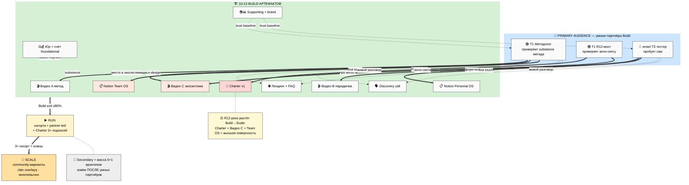

# 🗺️ Phase 1 — Зачем эти 10-12 артефактов именно сейчас + на кого они нацелены

> **Зачем эта фаза.** Phase 0 поставила линзу (что специфицируем). Эта фаза отвечает на два
> вопроса до того, как нырять в каждую спеку: **(1) почему эти артефакты нужны прямо сейчас,
> не раньше и не позже** и **(2) кто такой «умный партнёр», под которого мы всё затачиваем.**
> Плюс — одна сводная карта (BS-1), которая держит всю картину в одном взгляде.

---

## §1 Что значит «Build-артефакты» в контексте трёх этапов платформы

Напомним рамку из parent-плана: платформа живёт в трёх режимах — **Строим / Работаем /
Растём** — и переключатель между ними не «сколько людей», а «кто крутит маховик». Сейчас мы в
**Build, в средней части**: substrate готов (метод, фундамент, 180 контактов, агенты), но
наружу ещё не вышел. [src: Platform Lifecycle §0 + §2 — F2-F3, R-med]

**Build-артефакты — это ровно тот минимальный комплект, который превращает «у нас всё есть в
голове и в файлах» в «человек снаружи может это увидеть, пощупать и решить».** Не идеальный
комплект — а достаточный, чтобы умный партнёр сказал «да, тут есть что проверить» или «нет,
не моё», без раздражения. [src: Execution Plan §3 «baseline своими руками = минимальный
комплект, который не стыдно показать» — F2-F3, R-med]

**Почему именно сейчас, а не раньше.** Раньше каждый цикл добавлял ещё слой понимания —
накопление. Накопление substrate — это *вход* в Build, а не прогресс внутри него. «Ещё одна
вики не приближает к Run.» Артефакты — это первый шаг *выхода наружу*. [src: Platform
Lifecycle §2 «ловушки Build: накопить ещё substrate ≠ прогресс» — F2-F3, R-med]

**Почему не позже.** Всё держится на видео A — пока его нет, остальное буксует. А видео A —
блокер блокеров: без него Wave 1 (рассылка партнёрам) сжигает контакты, лендинг пустой,
discovery-звонок не на что опереть. Откладывать = держать дорогие контакты в холоде, пока
система простаивает. [src: Platform Lifecycle §8 «принцип над всем: всё держится на видео A»
— F2-F3, R-med]

**Почему именно эти 10-12, а не 50.** Это P1-список (срочно для выхода из Build), отделённый
от P2 (можно отложить до Run): курс end-to-end, FAQ из реальных кейсов, онбординг когорты,
кейсы — всё это пишет *партнёр + первая когорта* в Run, а не Ruslan в Build. Граница
намеренная. [src: Platform Lifecycle §6 «срочно для Build (P1) vs отложить до Run (P2)» —
F2-F3, R-med]

---

## §2 Кросс-карта: 10-12 артефактов × 4 типа партнёров × 3 этапа

Каждый артефакт нужен **кому-то конкретному на конкретном этапе**. Карта ниже показывает, где
артефакт *primary* (⭐ — главная аудитория в Build), где *вторично полезен* (✓), и куда он
прорастает в Run/Scale.

| Артефакт | T1 Метод | T2 Ресурс | T3 Аудитория | T4 Консульт | Где primary в Build | Run/Scale рост |
|---|---|---|---|---|---|---|
| Видео A метод | ⭐ | ✓ | ✓ | — | T1 методолог проверяет substance | партнёры адаптируют |
| Видео B парадигма | ✓ | — | ⭐ | — | smart T3 «это про меня?» | cohort onboarding |
| Видео C экосистема | ⭐ | ✓ | ✓ | ✓ | T1 + R12-мост «есть место?» | community-варианты |
| Notion Personal OS | ✓ | — | ⭐ | — | smart T3 форкает и юзает | юзер кастомизирует |
| Notion Team OS | ⭐ | — | ✓ | ✓ | T1 со-дизайн demo | clan-niche overlays |
| Charter | ⭐ R12-мост | ✓ | ✓ | ⭐ | R12-мост проверяет анти-секту | подписан 3→50+ |
| Лендинг + FAQ | ⭐ | ✓ | ⭐ | — | low-friction первый контакт | растёт многоязычно |
| Discovery call | ⭐ | ✓ | ⭐ | — | первый живой разговор | partner-led звонки |
| Юр package | — | — | — | — (Self) | foundational базис | + treasurer Run |
| Бизнес-счёт + invoice | — | — | — | — (Self) | foundational базис | + аудит Run |
| Supporting (курс/TG/sales) | ⭐ | ✓ | ⭐ | — | trust-building baseline | T1 создаёт end-to-end |
| Brand-minimum | ⭐ | ✓ | ⭐ | ✓ | визуальная consistency | clan brand-варианты |

Видно главное: **в Build почти все артефакты сходятся на T1 (методолог) и smart T3
(тестер)** — это и есть «умные партнёры». T2 (ресурсы) и T4 (консультанты) почти везде «✓» —
вторичны, активируются в Run/Scale. [src: Execution Plan §5 4 типа + Platform Lifecycle §4
per-stage actors — F2-F3, R-med]

---

## §3 Портрет «умного партнёра» — кого мы держим в голове, когда пишем каждую спеку

Это **сквозной фильтр** для всех 10 спек. Не «массовая аудитория 5+1 архетипов», а узкий
critical-thinking круг Build-стадии. Разложим портрет на четыре грани (что знает / не знает /
хочет / отпугнёт), с RUSLAN-LAYER примерами (имена = иллюстрации ролей per IP-1, не назначения):

**Что умный партнёр ЗНАЕТ (на что можно опереться, не разжёвывая):**
- базовое системное мышление — связи, контекст, петли обратной связи;
- AI/Claude хотя бы поверхностно — что это и зачем;
- fluent в одной-двух методологиях — может сравнить наш подход со своим;
- отличает substance от маркетинга — bullshit-детектор включён.
- *Примеры роли:* методолог уровня Maxim (джедайские практики) / Oleg (trouble-shooters) /
  Левенчук-tier (FPF+МИМ); тестер уровня Дмитрий (гуманитарий) / Сева (крипто-домен).

**Что умный партнёр НЕ знает (что нельзя предполагать):**
- наш Jetix-жаргон (FPF / R12 / Pillar C / cohort target ontology / Bloom-ступени по номерам);
- нашу конкретную философию развития методологии — чем отличаемся от существующих школ;
- наши конкретные инструменты — Notion-шаблоны, ROY swarm, voice pipeline.

**Что умный партнёр ХОЧЕТ (на что отвечает артефакт):**
- проверить метод на substance, а не на обёртку;
- понять, чем мы отличаемся от Левенчука / МИМ / других школ (это первый вопрос методолога);
- попробовать сам — low-friction trial, без «запишись на звонок чтобы узнать цену»;
- увидеть anti-extraction своими глазами — «это не очередная пирамида / секта / инфоцыгане».

**Что умного партнёра ОТПУГНЁТ (анти-паттерны для всех спек):**
- манипулятивный язык — фейк-срочность, дефицит, FOMO, «осталось 3 места»;
- академический жаргон без перевода — термины, за которыми надо лезть в словарь;
- обещания «жизнь изменится» / «революция в образовании» — over-promising;
- отсутствие конкретики — вода вместо «вот что именно ты получишь»;
- намёки на lock-in — «после подписи ты с нами», эксклюзивность, удержание данных.

[src: EXPLAIN §7 audience portrait + Consolidated HL §2 6 типов — F2-F3, R-med]

**Один operational-тест, который проходит каждая спека:** *«Открыл бы такой человек этот
артефакт, за 2-5 минут поймал substance, и принял решение — копать дальше или нет — без
ощущения, что его обрабатывают?»* Если нет — спека переписывается.

---

## §4 Secondary audience (только упоминание, не фокус)

Массовые 5+1 архетипа (Инженер / Исследователь / Создатель-блогер / Методолог /
Предприниматель / Гуманитарий) — артефакты их потом тоже зацепят, но **Build → Run handoff
требует, чтобы умные партнёры прошли первыми.** Логика: умный партнёр, проверивший substance,
становится либо со-создателем (T1→курс), либо адвокатом (T3→масса). Массу зовём, когда уже
есть проверенный продукт и первые партнёры, иначе сожжём охват на сыром. [src: Platform
Lifecycle §4 «тестер→адвокат, методолог→клан» переходы — F2-F3, R-med]

---

## §5 BS-1 — Кросс-карта артефактов (умные партнёры × Build → Run → Scale)

---

## §6 R1-решение, которое всплывает уже здесь (surface, не resolve)

**R1-A: Которые из 12 артефактов — critical для Build exit, которые nice-to-have?**

Факты (не рекомендация):
- Platform Lifecycle §8 даёт триггеры перехода Build → Run: ≥1 T1 confirmed · ≥3 T3 активны ·
  Charter проверен R12-экспертом · Notion внедрён multi-user · звонок отрепетирован ≥5 раз ·
  юр начато. [src: Platform Lifecycle §8 — F2-F3, R-med]
- Из этого следует *кандидат* в critical-MUST: Видео A (блокер всего), Notion Personal OS
  (для T3 trial), Charter (для R12-ревью), Discovery call (для confirmed). Видео B/C, Team OS
  demo, лендинг, supporting, brand — *кандидаты* в «желательно, но не блокирует exit».
- Юр/счёт — foundational: не блокирует *общение* с партнёрами, но блокирует *приём денег* (=
  вход в Run, не выход из Build).

**Варианты приоритизации (Ruslan picks в §16 main):**
- (а) Минимальный critical: Видео A + Notion Personal OS + Charter draft + Discovery call.
- (б) Расширенный critical: + Видео B + лендинг (чтобы был low-friction вход для Wave 1).
- (в) Всё как critical (риск: перфекционизм, растягивание Build §8 анти-триггер «выгорание»).

Не резолвим — это решение Ruslan. Здесь только разложены факты и варианты. [src: prompt §1
R1 surface only — F2, R-high]

---

## §7 Что эта фаза зафиксировала (вход в Phases 2-11)

1. **Build-артефакты = минимальный комплект выхода наружу**, не идеальный; сейчас, потому что
   накопление ≠ прогресс, а видео A — блокер блокеров.
2. **Кросс-карта:** почти все артефакты в Build сходятся на T1 + smart T3 (умные партнёры);
   T2/T4 вторичны до Run/Scale.
3. **Портрет умного партнёра** — сквозной фильтр всех 10 спек + один operational-тест.
4. **BS-1** держит всю картину: аудитория → артефакты → Build exit → Run → Scale + где растёт R12-риск.
5. **R1-A** (critical vs nice-to-have) surfaced с тремя вариантами — резолв за Ruslan.

---

*Phase 1 closure 2026-05-25. Обзор + кросс-карта (BS-1) + портрет умного партнёра + R1-A
surfaced. R1 surface only. IP-1 STRICT (имена = примеры). Дальше — Phase 2: Видео A spec
(15-точечный template).*
