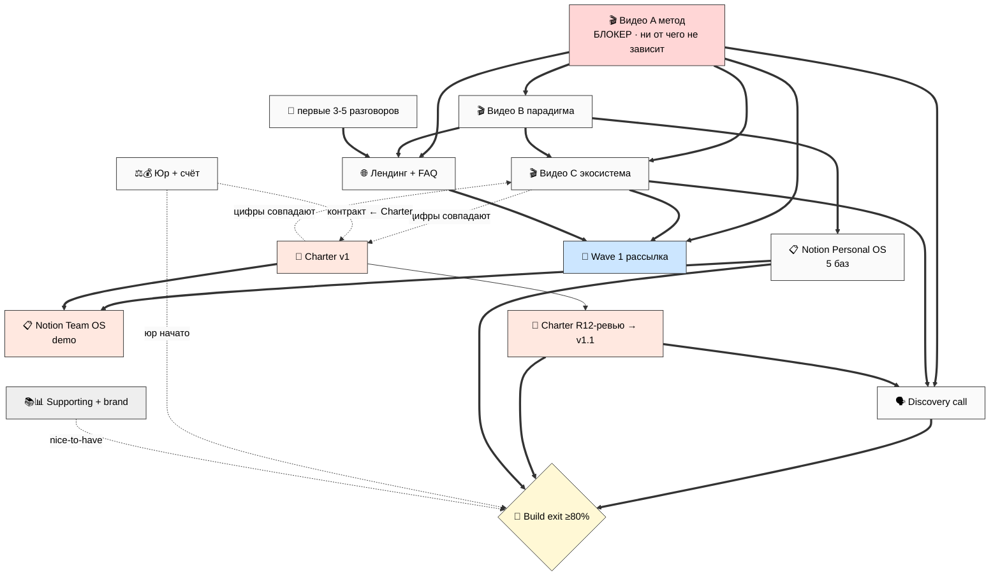
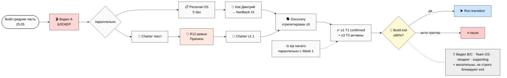

# 🔗 Phase 12 — Зависимости, порядок, риски, критический путь

> **Зачем эта фаза.** 10 спек написаны по отдельности. Эта фаза связывает их в граф: что от
> чего зависит, что можно делать параллельно, что строго по очереди, и какой минимальный путь
> выводит из Build. Плюс — риск-карта per артефакт и наложение на 4-недельный план Platform
> Lifecycle §8.

---

## §1 Граф зависимостей (что от чего зависит)

Главный принцип, унаследованный из всех спек: **всё держится на видео A.** Это единственный
артефакт без pre-reqs, и от него зависит почти всё остальное. [src: Platform Lifecycle §8 +
Видео A spec §10 — F2-F3, R-med]

| Артефакт | Зависит ОТ (pre-reqs) | Блокирует (что ждёт его) |
|---|---|---|
| Видео A | — (первый, ни от чего) | Wave 1, лендинг, discovery, видео B/C |
| Видео B | A желательно (тон/схемы) | onboarding тестеров, лендинг-раздел |
| Видео C | A+B + Charter cross-ref (цифры) | Wave 1 T1, discovery (4 типа) |
| Notion Personal OS | B желательно; решение «5 баз» (R1) | trial Дмитрий→feedback→Сева; Team OS |
| Notion Team OS | Personal OS + Charter slot | T1 co-design сессия |
| Charter | Team OS §6 baseline + Economic V10 + видео C cross-ref | R12-ревью→v1.1→подписи (Run); Team OS slot |
| Лендинг + FAQ | A+B + первые 3-5 разговоров (для FAQ-ответов) | Wave 1 (посадочная) |
| Discovery call | A/B/C + Charter + 8 R12-вопросов | confirmed T1; trial T3 |
| Юр + Финансы | 4.1-4.2 independent; контракт ← Charter | приём денег (вход в Run) |
| Supporting | видео + лендинг + Charter (consistency) | ничего critical (nice-to-have) |

## §2 BS-2 — Граф зависимостей артефактов

## §3 Критический путь (минимальная цепь к Build exit)

Триггеры перехода Build → Run (Platform Lifecycle §8): ≥1 T1 confirmed · ≥3 T3 активны ·
Charter проверен R12-экспертом · Notion внедрён multi-user · звонок отрепетирован ≥5 раз · юр
начато. [src: Platform Lifecycle §8 — F2-F3, R-med]

**Минимальная critical-цепь** (кандидат, R1-A из Phase 1):
1. **Видео A** (блокер) →
2. параллельно: **Notion Personal OS 5 баз** (→ trial Дмитрий → feedback) ‖ **Charter текст** →
3. **Charter R12-ревью** (Прапион) → **Charter v1.1** →
4. **Discovery call** отрепетирован ≥5 раз →
5. **≥1 T1 confirmed + ≥3 T3 активны** + **юр начато** → **Build exit ≥80%**.

Видео B/C, Team OS demo, лендинг, supporting, brand — на этой цепи *желательны*, но не строго
блокируют exit (зависит от R1-A выбора Ruslan: минимальный vs расширенный critical).

## §4 BS-3 — Критический путь (timeline-flow)

## §5 Параллельность (что можно одновременно, что строго по очереди)

**Можно параллельно (independent):**
- Видео A + Steuerberater email + CRM-разметка 5+1 архетипов + Notion Personal OS (Week 1).
- Видео B + старт C + Charter текст (Week 2 — разные «руки»).
- Лендинг-каркас + Team OS demo (Week 3).
[src: Platform Lifecycle §8 «пункты параллельно» + Execution Plan §6 — F2-F3, R-med]

**Строго последовательно (нельзя параллелить):**
- Charter текст → R12-ревью → правка → v1.1 → подписи (ревью идёт ПОСЛЕ текста).
- Steuerberater email → консультация → выбор формы → регистрация → бизнес-счёт.
- Notion Personal OS → trial → feedback → правка → Сева (правка по живому фидбэку).
- Видео A → видео B → видео C (наследование тона/схем; или A‖B параллельно — R1-A2 Execution).

## §6 Risk map per артефакт (top риски + mitigation)

| Артефакт | Топ-риски | Mitigation |
|---|---|---|
| Видео A | перфекционизм (блокер не выходит); over-promise; присвоение чужого вклада | потолок «достаточно хорошо»; явная атрибуция FPF/Левенчука |
| Видео B | академический жаргон; элитарность «избранные» | человеческий язык; «признание ≠ превосходство» |
| Видео C | mass-movement язык; «семья/племя»; fudge долей | R12 AUTO-FIRE 3 эксперта; R12-мост ревью до публикации |
| Notion Personal OS | over-engineering; Jetix-жаргон в полях; нет fork | 5 баз core; LITE-формулы; явная fork-инструкция |
| Notion Team OS | «успешный клан» fait accompli; lock-in поля | demo 1 mock-проект; fork-кнопка; нет vesting |
| Charter | legal-eze; fluffy без зубов; выход в конце | plain-language версия; 5:1 numerical; выход §6 первым |
| Лендинг + FAQ | scarcity/FOMO; fake testimonials; forced signup | nlp-ревью per фраза; контент без signup-стены |
| Discovery call | leading questions; pressure; over-talking | nlp-ревью скрипта; «нет — спасибо»; их-контекст ≥ наш |
| Юр + Финансы | выбор формы без эксперта; контракт с lock-in | решение после Steuerberater; fork-and-leave MUST |
| Supporting | premature brand-investment; fake metrics; cadence-pressure | DIY минимум; нет vanity; канал-заглушка |

**Сквозной риск (Platform Lifecycle §8 анти-триггеры):** выгорание, methodology drift (4 LOCKED
тронуты), R12 violation, Wave 1 без видео. Любой = «не переходим в Run, пауза». [src: Platform
Lifecycle §8 анти-триггеры — F2-F3, R-med]

## §7 Timeline overlay на Platform Lifecycle §8 (4 недели)

| Неделя | Артефакты ready by | Спека-источник |
|---|---|---|
| **Week 1 (25-31.05)** | Видео A; Дмитрий звонок+старт trial; CRM 5+1; Steuerberater email | Phase 2, 9, 10 |
| **Week 2 (1-7.06)** | Видео B + старт C; Notion Personal OS 5 баз; Charter текст v1; Дмитрий feedback #1; Wave 1 (Maxim+Oleg); бизнес-счёт | Phase 3, 4, 5, 7, 10 |
| **Week 3 (8-14.06)** | Wave 1 вторая (Левенчук/Цэрэн/Прапион); Team OS demo; discovery-звонки; лендинг + FAQ из реальных разговоров | Phase 4, 6, 8, 9 |
| **Week 4 (15-22.06)** | 1-2 T1 confirmed; 3-5 T3 активны; лендинг published; **Build exit check ≥80%** | все |

Supporting + brand (Phase 11) — распределены по Week 2-4 как nice-to-have, не на критическом
пути. [src: Platform Lifecycle §8 4-недельный план — F2-F3, R-med]

## §8 R1-решения (5-7, surface — резолв за Ruslan)

- **R1-DEP1 Priority order** — какой минимальный critical-набор для Build exit? (Видео A +
  Personal OS + Charter + Discovery vs расширенный + видео B + лендинг). Связано с R1-A (Phase 1).
- **R1-DEP2 Когда запускать Notion implementation prompt** — Week 1 (рано, под Дмитрий trial) vs
  Week 2 (по плану)? *Факт:* Дмитрий звонок уже Week 1, шаблон нужен под trial.
- **R1-DEP3 Видео порядок** — A→B→C строго или A‖B параллельно? [src: Execution Plan §9 R1-2 —
  F2-F3, R-med]
- **R1-DEP4 Team OS demo timing** — Build Week 2-3 (ранний, под T1) vs Run Week 5 (по плану)?
  [src: Platform Lifecycle §10 R1-4 — F2-F3, R-med]
- **R1-DEP5 Лендинг до или после первых разговоров** — FAQ-ответы требуют разговоров, но каркас
  можно раньше. Публиковать с placeholder-FAQ или ждать реальных вопросов?
- **R1-DEP6 Что critical-MUST на Build→Run checkpoint** — 1 T1 + 3 T3 + Charter проверен, или
  больше? [src: Platform Lifecycle §10 R1-7 — F2-F3, R-med]
- **R1-DEP7 Темп Build** — push 4 недели или растянуть при признаках выгорания (анти-триггер §8)?

## §9 Проверка: не всплыл ли обязательный 13-й артефакт?

Сквозной аудит 10 спек: **новых обязательных артефактов не всплыло.** Все упоминания (Welcome-
frame doc, navigation guide, R12 disclosure doc, mass-advocate ethics doc из Outreach Content
P0-P6) — это либо части существующих 12 (R12 disclosure ⊂ Charter; Welcome-frame ⊂ лендинг),
либо Run-стадия (P4-P6). **Surface как R1, не add silently:** возможный кандидат — отдельный
«R12 honesty one-pager» как standalone, но он покрыт секцией 6 лендинга + Charter. Решение
оставить в составе — за Ruslan. [src: prompt §2 «если всплыл лишний — surface в Phase 12» +
Outreach Content §7.3 P0-P6 — F2-F3, R-med]

---

*Phase 12 closure 2026-05-25. Dependencies + critical path (BS-2 + BS-3) + параллельность +
risk map per артефакт + timeline overlay §8 + 7 R1-решений. 13-й обязательный артефакт НЕ
всплыл (всё покрыто 12 или = Run-стадия). R1 surface only. Дальше — Phase 13: Main + Summary +
INDEX (final push).*
