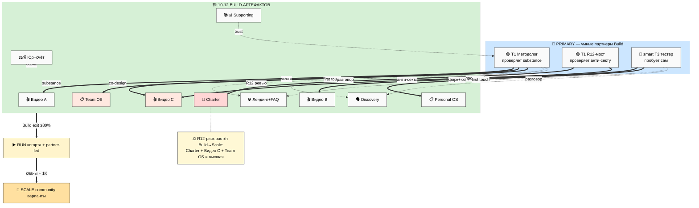
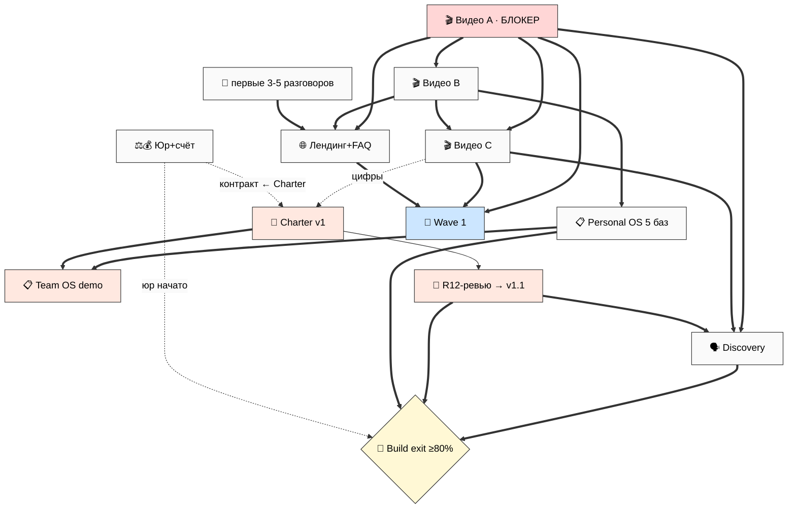
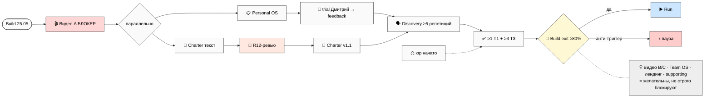
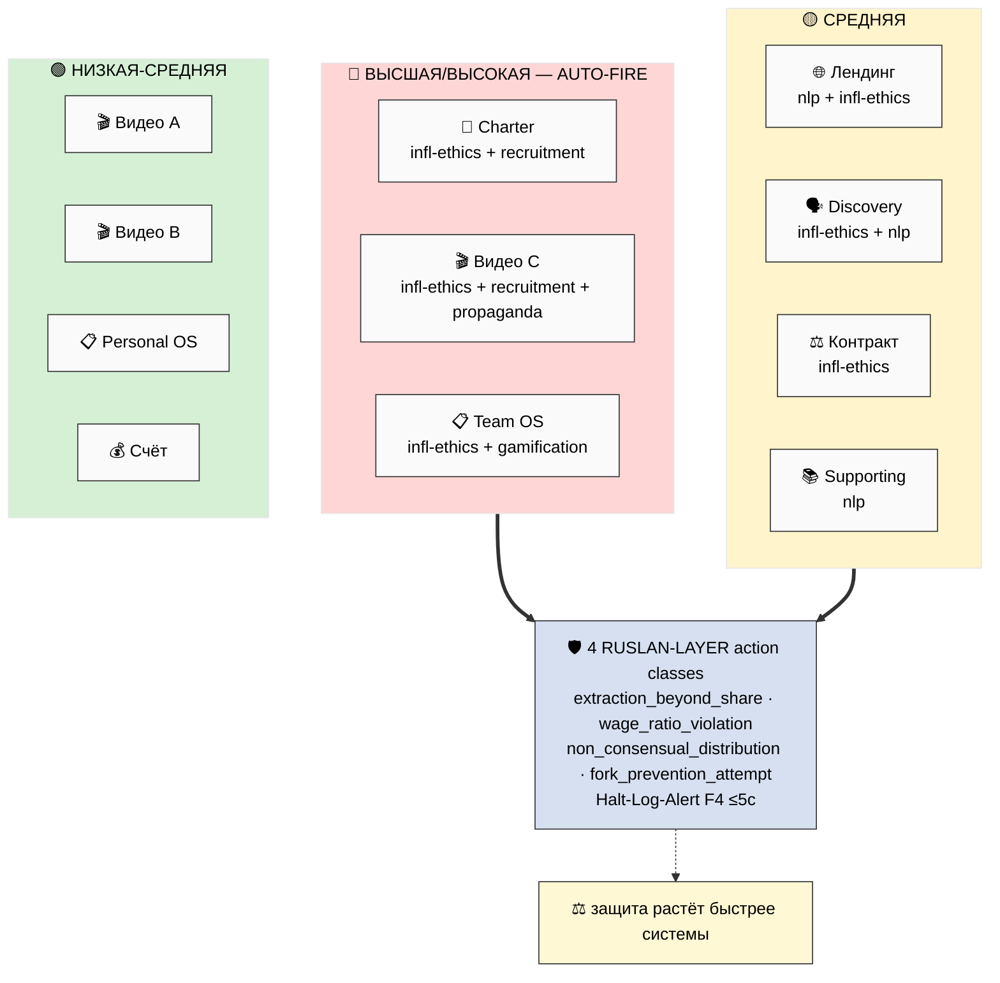
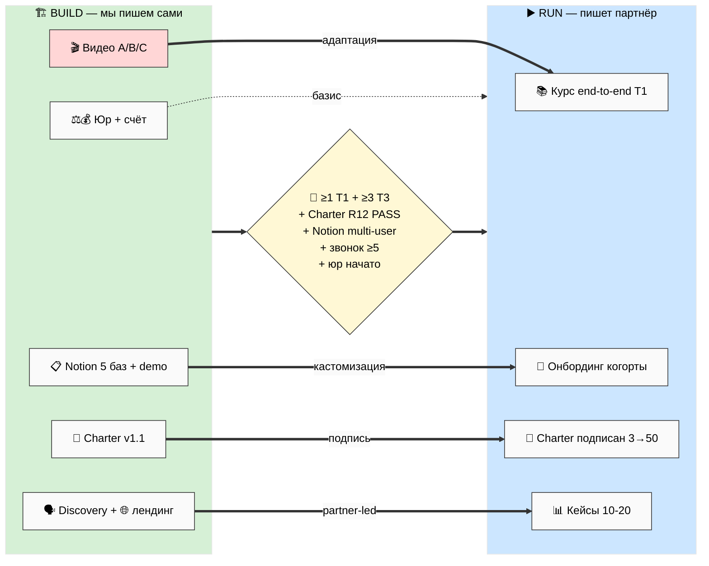
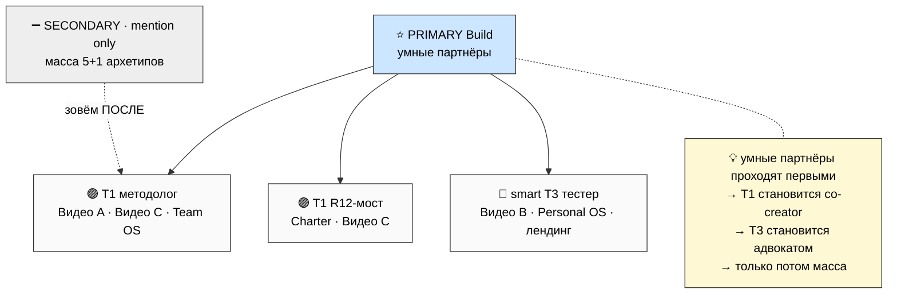
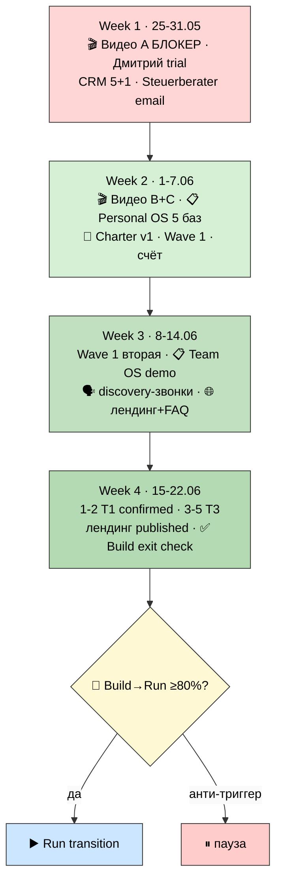

# 🎨 Mermaid INDEX — BS-1..BS-7

Каталог всех 7 схем Build Artefacts Specs (тема base / light bg для GitHub-читаемости).

| # | Схема | О чём | Где inline |
|---|---|---|---|
| **BS-1** | Кросс-карта артефактов | 10-12 артефактов × умные партнёры × Build→Run→Scale | Main §2 + `02-overview-cross-map.md` |
| **BS-2** | Граф зависимостей | что от чего зависит; видео A = блокер | Main §13 + `13-dependencies-risks.md` |
| **BS-3** | Критический путь | минимальная цепь к Build exit | Main §13 + `13-dependencies-risks.md` |
| **BS-4** | R12-риск overlay | где высшая R12-поверхность + AUTO-FIRE | Main §14 |
| **BS-5** | Build → Run handoff | что каждый артефакт сдаёт в Run | Main §15 |
| **BS-6** | Приоритет аудитории | умные партнёры primary, масса secondary | Main §15 |
| **BS-7** | Порядок 4 недель | sequencing Week 1-4 → Build exit | Main §18 |

---

## BS-1 — Кросс-карта артефактов (умные партнёры × Build → Run → Scale)

---

## BS-2 — Граф зависимостей артефактов

---

## BS-3 — Критический путь к Build exit

---

## BS-4 — R12-риск по артефактам (overlay)

---

## BS-5 — Build → Run handoff

---

## BS-6 — Приоритет аудитории в Build

---

## BS-7 — Порядок 4 недель (sequencing)

---

*Mermaid INDEX closure 2026-05-25. 7 схем BS-1..BS-7, тема base / light bg. Все inline в Main +
phase reports. Per prompt §13 mermaid INDEX 5-7 schemes.*
