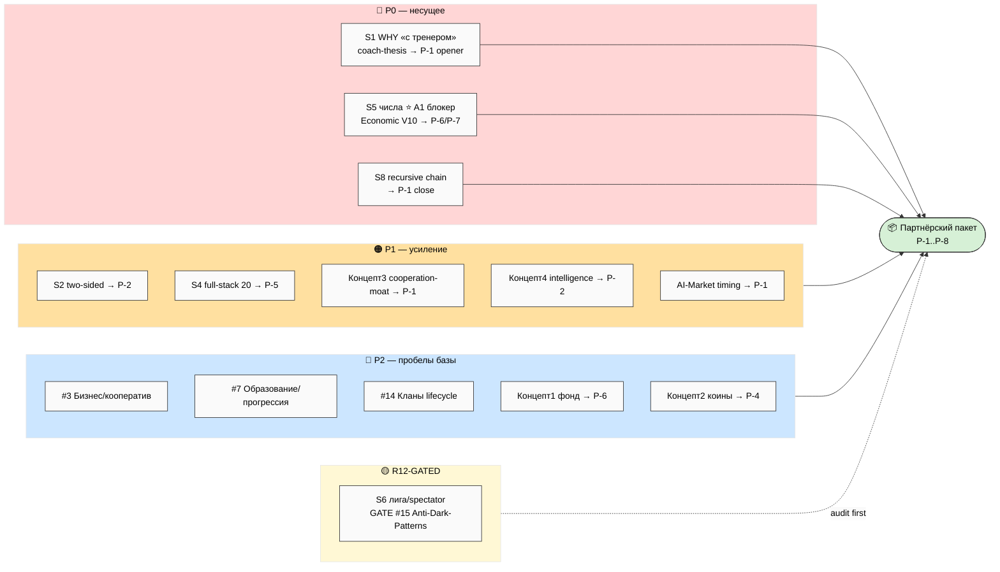

# D1 — Additions → directions / пакет (приоритет + R12)

> Светлая тема. P0 = красный (срочно/несущее) · P1 = оранжевый · P2 = синий · gated = жёлтый.

**Чтение.** 3 P0-additions (WHY-opener · числа · recursive close) = несущие пробелы пакета.
P1 = усиление (two-sided / когорта / 2 moat-аргумента / timing). P2 = 6 недопредставленных
направлений + 2 механизм-концепта (фонд/коины). GATED = лига (#15 audit обязателен до вставки).
