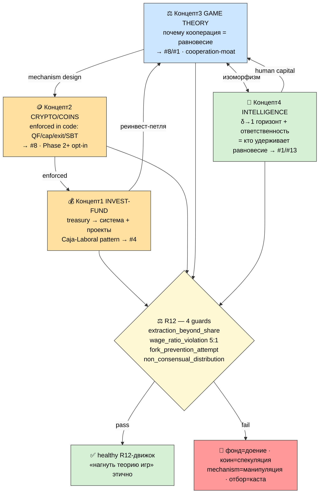

# D2 — 4 концепта: один контур + R12-guards

> Светлая тема. Красный = R12 CRITICAL/HIGHEST surface · жёлтый = guard/gate · зелёный = healthy.

**Чтение.** 4 концепта = **один контур**, не 4 темы: §3 (почему) ↔ §4 (кто) — изоморфизм
(δ→1 + ответственность = условие folk-theorem); §2 enforced'ит §3 в коде; §1 финансирует петлю.
**R12 (4 guards) = то, что держит весь контур на здоровой стороне.** Без guards каждый концепт
коллапсирует в extraction. Ни один концепт НЕ требует нового направления (суб-грани #4/#8/#14/#1).
