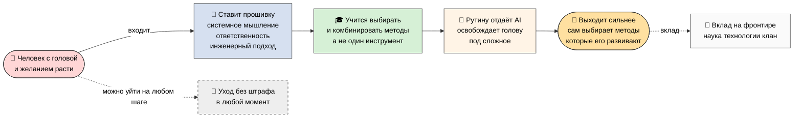
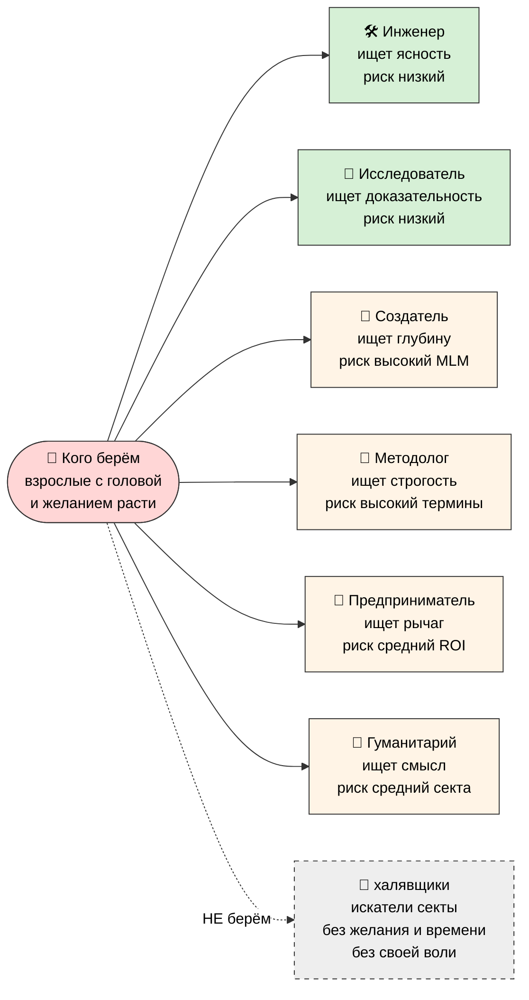
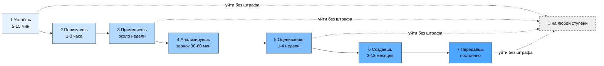
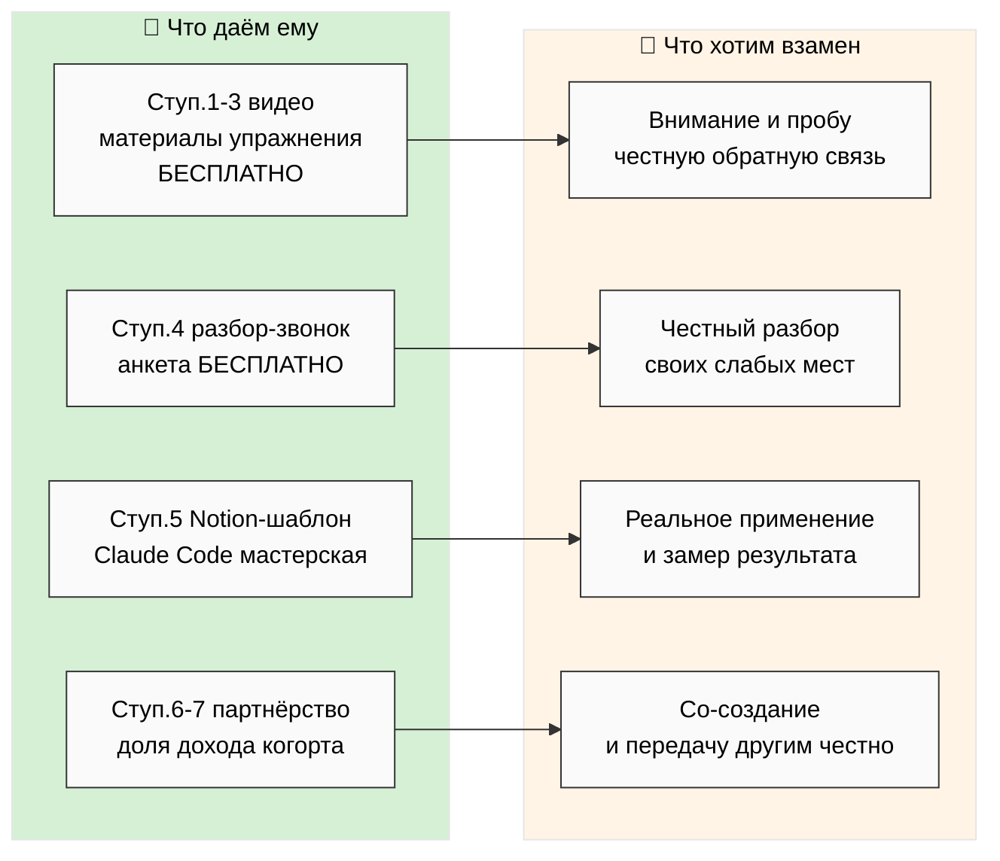
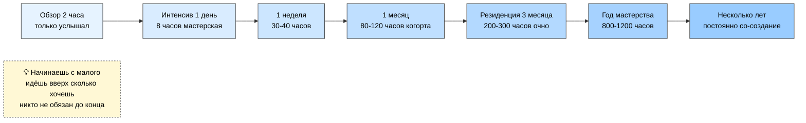

# 🎨 Пять схем — понятные с одного взгляда

> Цель схем — чтобы человек посмотрел и сразу понял, без жаргона. Мягкие цвета,
> тёмный текст, читаются без расширений. Каждая схема — про одну вещь.

---

## HL-1 — Вся картина целиком

**Про что:** как человек входит, что с ним происходит, кем он выходит.

---

## HL-2 — Шесть типов людей, кого берём

**Про что:** кто наши люди и что каждый из них ищет.

---

## HL-3 — Семь ступеней обучения (с временем)

**Про что:** путь от «впервые услышал» до «учит других». И уйти можно на любой.

---

## HL-4 — Что человек получает и что мы хотим взамен

**Про что:** честный обмен — что даём на каждой ступени и что просим в ответ.

---

## HL-5 — Варианты программ (время × кому)

**Про что:** лесенка форматов от «глянуть за 2 часа» до «много лет вместе».

---

## Как читать эти схемы

- **HL-1** — вся картина: вошёл человек → прошивка → учится выбирать методы → рутину
  AI → вышел сильнее → вклад на фронтире. И уйти можно всегда.
- **HL-2** — шесть типов людей, что каждый ищет, у кого какой риск. И кого не берём.
- **HL-3** — семь ступеней с временем. Уход без штрафа на любой.
- **HL-4** — честный обмен: что даём ↔ что хотим взамен, по ступеням.
- **HL-5** — форматы по времени, от 2 часов до многих лет.

---

*Phase 5 closure 2026-05-24. 5 схем, мягкие цвета, читаются без расширений. R1 surface only.*
