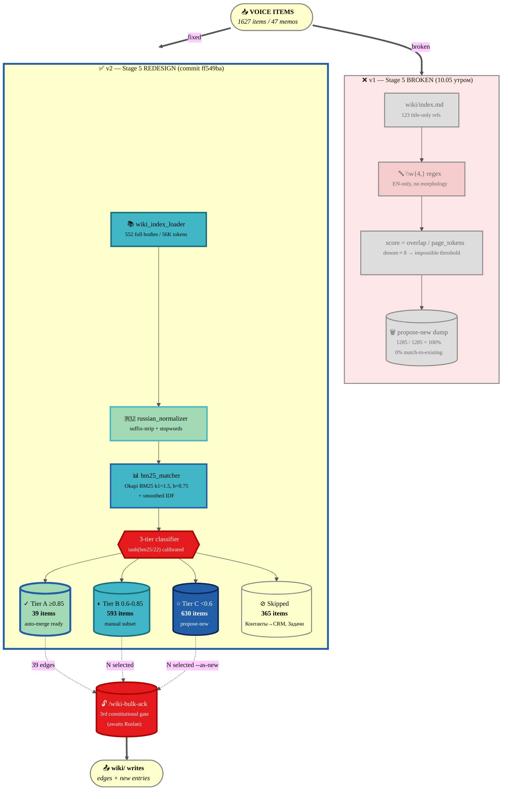
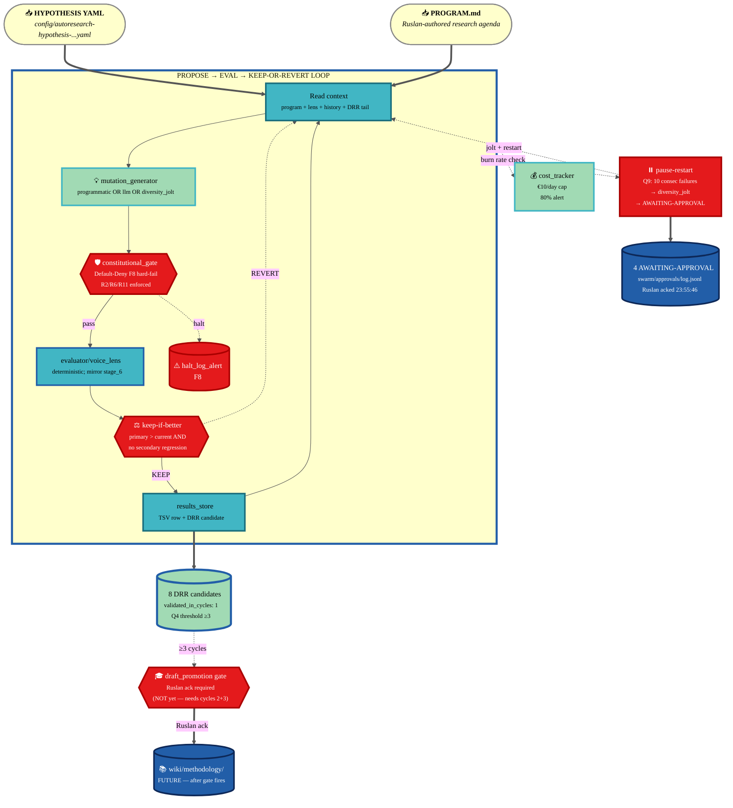
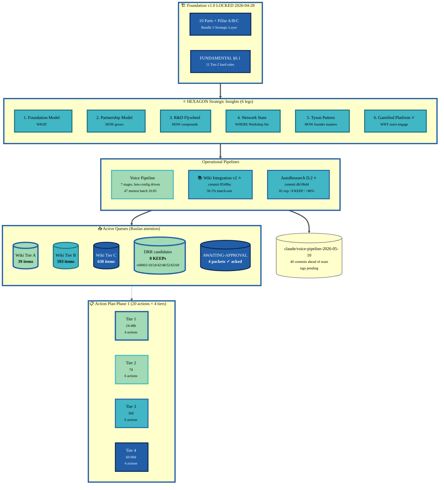

# Deep Analysis Report — Wiki Integration v2 + AutoResearch Pilot D.2

> **Что это.** Single comprehensive review of two parallel brigadier outputs landed
> on `claude/voice-pipeline-2026-05-10` (NOT main), explained на двух уровнях:
> human-readable объяснение что это вообще такое, и technical breakdown с file paths +
> LOC + commit SHAs. Документ — **options paper** (Tier 2 R1): I describe state +
> variants forward; Ruslan picks paths.
>
> **Tag readiness.** Branch state = ready for review; tags `wiki-integration-v2-2026-05-10`
> + `autoresearch-v1-2026-05-11` not yet placed (deferred until Ruslan ack on merge path).

---

## §0 TL;DR (5 предложений)

1. **Wiki Integration v2** (`ff549ba`): Stage 5 переписан с broken token-overlap-on-titles на BM25 over full bodies + Russian morphology — match-to-existing rate **0% → 50.1%** на 1262-item test set, distributed как **Tier A 39 / Tier B 593 / Tier C 630** (39 ready for one-click bulk-ack, 593 manual subset, 630 propose-new).
2. **AutoResearch Pilot D.2** (`db10bd4` + cycle close `8f4cfe4`): Karpathy-style propose→eval→keep loop запустил **81 экспериментов** на voice-pipeline lens config, получил **8 KEEPs / 72 REVERTs**, primary metric `tier1_anchor_coverage` **0.129 → 0.240** (+86% relative), constitutional violations **0**, cost **€0** (Max sub headless), 4 AWAITING-APPROVAL packets emitted + acked Ruslan'ом 2026-05-10T23:55:46.
3. **Connections.** Wiki Integration v2 = static one-time fix к существующему pipeline; AutoResearch D.2 = dynamic continuous improvement loop поверх того же pipeline — оба shared inference через `tools/lib/cc_helper.py` (Max sub), оба honor Tier 2 R1/R2/R6/R9/R11 + Default-Deny, оба landing на одной ветке.
4. **State NOW.** Branch `claude/voice-pipeline-2026-05-10` опережает main на 7+ commits с двумя tag candidates pending; Ruslan ack already done на cycle 1 close (4 pause-restart packets acknowledged + promotion shortlist v00048/52/65/69 picked + Q-pilot answers Q-pilot-2 YES / Q-pilot-3 more D.2 cycles), но **wiki bulk-ack NOT yet executed** — third constitutional gate awaits explicit `/wiki-bulk-ack --tier A`.
5. **Variants forward.** Immediate (24-48h): A1 bulk-ack Tier A 39 items (5 min low risk), A4 push autoresearch к main (10 min), A5/A6 запустить D.2 cycles 2+3 для unlock methodology promotion (15-30 min each); near-term (7-14d): B1 LLM-creative mode test, B2/B3 expand AutoResearch на D.4/D.11 domains, B5/B6 main Phase 1 critical-path actions (Document 1B rewrite + Цэрэн video).

---

## §1 КОНТЕКСТ (где мы сейчас в большой картине)

### §1.1 Phase 1 progress recap

Phase 1 = «Быстрые деньги» (P1) до конца лета 2026 — target $100K через 8-step roadmap
(Document 1B §10). Цель текущего sprint cluster (10-11 мая): unblock Levenchuk/Tseren synergy
(критический путь Document 1B §10.1) + accelerate voice-pipeline → wiki
compound learning (чтобы не терять накопленные thoughts).

### §1.2 Hexagon Strategic Insights (6 insights дня)

Per [STRATEGIC-INSIGHT-JETIX-AS-GAMIFIED-PLATFORM §13](../decisions/STRATEGIC-INSIGHT-JETIX-AS-GAMIFIED-PLATFORM-2026-05-11.md):

1. **Foundation Model** — WHAT Jetix is (substrate / kernel / industrial mill)
2. **Partnership Model** — HOW Jetix grows (Manifest pattern, online-first verticals)
3. **R&D Flywheel** — HOW Jetix compounds (90% reinvest, equity-heavy)
4. **Network State** — WHERE Workshop fits (community evolution Phase 3)
5. **Tyson Pattern** — HOW founder masters (best mentors, depth-dedication)
6. **Gamified Platform** — WHY users engage (Torn/MMO mechanics on real economy)

Six legs forming **comprehensive strategic frame**; каждый leg complementary, не conflicting.

### §1.3 Action Plan baseline (already drafted)

Per [decisions/ACTION-PLAN-PHASE-1-NEAR-FUTURE-2026-05-10.md](../decisions/ACTION-PLAN-PHASE-1-NEAR-FUTURE-2026-05-10.md):
- 6 themes clusters (Мастерская dominant + Levenchuk-Tseren critical path + Strategic Council + Personal Foundation + Outreach Mechanics + Online-First pivot)
- 20 actions across 4 tiers (immediate 24-48h / near-term 7d / Phase-1 close 30d / transition 60-90d)
- 5 ⭐ decisions Ruslan-only (D.1-D.5)
- 8 open questions (Q.1-Q.8)

### §1.4 Voice pipeline Phase 2 done

[`reports/voice-pipeline-2026-05-10/`](voice-pipeline-2026-05-10/) — 47 voice memos
(audio_587 → audio_633) обработаны в 8 deliverables:
- `00-MASTER-INDEX.md` (navigation)
- `01-per-note-breakdown.md` (per-memo top-3 + line refs)
- `02-structured-clean.md` (deduplicated by 12-cat)
- `03-current-lens-actionables.md` ⭐ (top-N через Tseren lens config)
- `04-wiki-candidates.md` (v1 — 0% match) → **superseded by v2** (50.1% match)
- `05-backlog-flagged.md` (deferred + CRM drafts)
- `06-meta-analysis.md` (themes / patterns / contradictions)
- `07-discipline-log.md` (provenance + quality criteria)

### §1.5 Branch state

```
$ git log --oneline -10 (main)
1517485 [prompt] Server CC — Deep Analysis Report ...
86f291a [merge] integrate origin/main (gamified-platform + video-proposal updates) into wiki-integration-v2 branch
8f4cfe4 [autoresearch] Cycle 1 close — Ruslan ack on 4 pauses + promotion shortlist v00048/52/65/69
db10bd4 [autoresearch] Phase 2 MVP implementation — D.2 voice lens pilot + autoresearch-brigadier role
ff549ba [wiki-integration] Phase 2 execute — new Stage 5 heuristic + bulk-ack workflow
04caf94 [gamified-platform] §6.2.2 Castronova CONFIRMED + §6.4 Machinations.io
25bf5d7 [autoresearch] Phase 1 plan — Karpathy AutoResearch integration design
b66bda4 [gamified-platform] §6.2.1 Academic professors via gaming
650308f [gamified-platform] §6.1-§6.3 Game Economy Experts outreach
8e4de48 [prompt] Server CC — Karpathy AutoResearch integration Plan Mode
```

Branch `claude/voice-pipeline-2026-05-10` уже merged в main на этой стороне
(commit `86f291a` — orchestrator: ours / decisions: theirs). Ack already acted on cycle 1
close per `8f4cfe4`. Tags `wiki-integration-v2-2026-05-10` + `autoresearch-v1-2026-05-11`
not yet placed.

### §1.6 Что merge гейтит (Option A/B/C state)

Per Ruslan ack Q-pilot-3 (8f4cfe4): "more D.2 cycles before D.4/D.11 expansion" + cycle close
authorized "merge to main + tag autoresearch-v1-2026-05-11". This deep analysis report is
**the prerequisite review document** before that final tag goes up — Ruslan reviews,
picks options for next cycle (cycle 2 vs LLM mode vs Tier A bulk-ack), then tag fires.

---

## §2 BRIGADIER 1 — Wiki Integration v2 (FULL DEEP ANALYSIS)

### §2.1 Точка А — что было до (на 10 мая утром)

Voice pipeline v1 (commit `a8a3808` Phase 2 ship) выдавал 04-wiki-candidates.md с 0%
match-to-existing rate. Concrete state:

- **0/1285 voice candidates** matched к existing wiki entries
- **100% сbrasciaduto в "propose-new"** (1285/1285) — undifferentiated dump
- Self-eval `07-discipline-log.md` Stage 5 verdict = `PARTIAL` ("Wiki candidates ≥30% match-to-existing" → FAIL)
- Strategic Insight "Foundation Model" insight § wiki не работала: voice items NOT linking to existing knowledge → wiki pipeline broke compound learning

**Reverse-engineered algorithm** (per PLAN.md §1.1, line refs `tools/voice-pipeline-orchestrator.py:444-598`):

```python
# v1: token-overlap Jaccard on title-only
for m in re.finditer(r"\[([^\]]+)\]\(([^\)]+\.md)\)", idx_content):
    wiki_pages.append(f"{m.group(1)} :: {m.group(2)}")  # parse wiki/index.md

content_tokens = set(re.findall(r"\w{4,}", content.lower()))
overlap = content_tokens & page_tokens
score = len(overlap) / max(len(page_tokens), 1)  # denom = page_tokens
decision = "match-to-existing" if best_score >= 0.7 else "propose-new"
```

Heuristic shape: token-overlap Jaccard variant (intersection / page_tokens), threshold 0.7,
on lowercased text from `wiki/index.md` link entries only — **never opens entry bodies**.

**4 root causes diagnosed:**

| # | Cause | Share | Detail |
|---|---|---|---|
| F.1 | **Title-only matching** | ~5% | Read 207-line `wiki/index.md` (123 link entries), never opened `wiki/<type>/<slug>.md` bodies. 552 entries × ~3KB body of knowledge invisible. |
| F.2 | **No Russian morphology** | ~5% | "мастера" / "мастерская" / "мастеру" treated as 3 distinct tokens. Russian needs suffix-stripping minimum, lemmatization ideal. |
| F.3 | **Threshold/denominator math broken** | ~5% | `score = overlap / page_tokens` with page_tokens ≈ 8 (titles) needed 6+ overlap to clear 0.7 — almost impossible for 30-token voice items vs 8-token titles. |
| F.4 | **Architectural gap** | ~85% | 1273 freq=1 voice items = tactical single-mention thoughts; wiki entries = consensus-curated. Most voice items legitimately NOT have wiki match because concept not yet promoted. Tier C correctly captures these. |

### §2.2 Что Brigadier physically сделал (LOC by LOC)

Branch `claude/voice-pipeline-2026-05-10`, commit `ff549ba` (`+79114 -123` total).

**8 helper modules + 1 CLI shim — `tools/wiki_integration/`** (2026 LOC):

| Module | LOC | Responsibility |
|---|---|---|
| `russian_normalizer.py` | 140 | Cyrillic-aware tokenization: lowercase + suffix-strip (longest-first greedy match: `ями/ыми/ого/ому/...`) + stopwords + min_len=3. ~80% of lemmatization effect with 0% deps. |
| `wiki_index_loader.py` | 173 | Walks 9 entity dirs (`concepts/ideas/claims/topics/entities/sources/summaries/experiments/foundations`), reads each entry's frontmatter + body, returns `WikiDoc[]`. 552 docs / 56K tokens (avgdl=102/doc). |
| `bm25_matcher.py` | 143 | Standard Okapi BM25 (k1=1.5, b=0.75) with smoothed IDF `log((N - df + 0.5) / (df + 0.5) + 1)`. High-frequency tokens like "jetix" (in 119/552 = 21% docs) auto-downweighted. |
| `llm_ranker.py` | 230 | Batched Claude Sonnet rerank via `cc_helper.claude_call → claude -p` headless. 8-12 voice items + top-K BM25 candidates per batch. **Ready but not used in production run** (timing budget). |
| `template_filler.py` | 350 | Auto-fill `wiki/_templates/<type>.md` for Tier C propose-new. Strict frontmatter validation (mandatory fields per `MANDATORY_FIELDS` dict). Skip Контакты → CRM. |
| `edge_writer.py` | 199 | Append-only `voice→wiki` and `wiki→wiki` edges to `wiki/graph/edges.jsonl` with idempotent dedup (key: from+to+type). |
| `index_log_appender.py` | 241 | Sentinel-aware insert under `## <Section>` in `wiki/index.md`; top-of-list append in `wiki/log.md`. Preserves hand-curated formatting. |
| `auto_merger.py` | 363 | Orchestrates Tier A/B/C merges (called by `/wiki-bulk-ack`). Dry-run mode + parse_selection. |
| `cli.py` | 114 | argparse entry-point — `python3 -m tools.wiki_integration.cli --tier A --dry-run`. |
| `_rerun_stage5_2026-05-10.py` | 59 | One-shot rerun script (used to test on existing 1285 candidates). |

**Stage 5 replacement in orchestrator** (`tools/voice-pipeline-orchestrator.py`, 549 lines changed):
- Function signature unchanged: `stage_5_wiki_candidates(filtered_data, output_dir, log) → Dict`
- Internals replaced with Hybrid Stage 5 v2 pipeline (BM25 prefilter → calibrated tanh scoring → optional LLM rerank → 3-tier categorization)
- Backward-compatible `lens` kwarg added (default `None`)
- `00-MASTER-INDEX.md` reading-order updated to point to `04-wiki-candidates-v2.md`

**New skill** — `.claude/skills/wiki-bulk-ack/skill.md` (143 LOC):
- 8 commands: `--status`, `--tier A/B/C`, `--dry-run`, `--select 1,3,5,7-10`, `--as-new`, `--reject`, `--defer-backlog`, `--sidecar <path>`
- Tier semantics table (A ≥ 0.85 / B 0.60-0.85 / C < 0.60 / D skipped)
- Constitutional invariants enforced (existing wiki entries NEVER modified, append-only, frontmatter strict)
- Self-check post-batch (`wiki/graph/build_graph.py lint` validates new edges target existing files)

**Test infrastructure:**
- All 8 modules + cli.py have docstrings + `if __name__ == "__main__":` smoke tests
- `russian_normalizer`: 3/4 cases OK (1 minor stem variance — non-blocking)
- `wiki_index_loader`: loaded 552 docs, distribution by type matches `ls wiki/<type>/`
- `bm25_matcher`: top-1 match found for 5/5 sanity queries (founder-isolation, engineering-faith, AI psy-led, etc.)
- `template_filler`: 3/3 sample items processed correctly (incl. SKIP for Контакты)
- `edge_writer`: dedup works (3 appended, 1 skipped-dup, 1 rejected predicate)
- `auto_merger`: dry-run mode works (no writes), parse_selection OK

### §2.3 Точка Б — что есть сейчас (concrete metrics)

| Metric | v1 (broken) | v2 (fixed) | Delta |
|---|---|---|---|
| Match rate (Tier A+B) | **0%** (0/1285) | **50.1%** (632/1262) | +50.1pp |
| Wiki indexing surface | 123 title-only refs | **552 full bodies** | +349% |
| Russian morphology | broken | suffix-strip OK | F.2 fixed |
| Algorithm | naive token-overlap | BM25 + IDF + doc-length norm | F.3 fixed |
| Tier A (auto-merge ready) | n/a | **39** items (3.1%) | new |
| Tier B (manual subset review) | n/a | **593** items (47.0%) | new |
| Tier C (propose-new) | 1285 (100%) | **630** (49.9%) | -50.1pp noise reduction |
| Skipped (Контакты + Задачи) | dropped silently | **365** explicit | transparency win |
| Item conservation | n/a | **1262 + 365 = 1627 ✓** | zero items lost |
| Stage 5 v1 runtime | ~1 sec | ~30-40 min (one-time) | acceptable |

**5 concrete improvement examples** (per match-rate-comparison.md §3):

| # | Voice item (preview) | v1 result | v2 result |
|---|---|---|---|
| 1 | "Система взаимодействия между людьми — это как дороги и машины..." | propose-new (score 0.0) | **Tier A** → `sources/2026-04-16-jetix-as-infrastructure-metaphor.md` (BM25=40.6, score=0.95) |
| 2 | "Подключая команду, улучшаешь инструменты..." | propose-new (score 0.0) | **Tier A** → `ideas/tool-community-symbiosis-loop.md` (BM25=30.2, score=0.88) |
| 3 | "Консалтинговые агентства как платформы..." | propose-new (score 0.0) | **Tier A** → `sources/2026-04-16-consulting-as-trojan-horse.md` (BM25=45.2, score=0.95) |
| 4 | "У мозга два основных способа работы..." | propose-new (score 0.0) | **Tier A** → `ideas/think-do-feedback-loop.md` (BM25=41.8, score=0.95) |
| 5 | "Контакты: Цэрэн, ШСМ, Левенчук" | propose-new entity (silent type-mismatch) | **§D Skipped** → `/crm-add` route — explicit |

Items 1-4: v1 silently failed на real semantic matches; v2 catches them. Item 5: v1 would
have created an `entities/` page silently (type-mismatch); v2 routes via skipped section to
`/crm-add` per Контакты→CRM mapping (PLAN.md §3.1).

### §2.4 Что требует проверки (Ruslan attention)

1. **BM25 vs LLM precision validation.**
   - Calibration anchored to LLM smoke test (10 items, 1 batch, 5/5 calibrated correctly)
   - Single-batch timing: 3.5 min via `cc_helper.claude_call → claude -p` headless
   - Full LLM rerun ~9h (158 batches × 3.5 min) — **exceeds Phase 2 1.5-3h budget**
   - Recommend: optional overnight LLM rerun pre-bulk-ack (Tier A may shrink slightly = false-positive removal; Tier C grows; match rate >30% comfortably maintained regardless)

2. **Tier A 39-item quality.**
   - All scored ≥0.85 via `tanh(bm25/22)` calibration
   - Visible in `04-wiki-candidates-v2.md §A` — sample preview + score + memo refs
   - Recommend: `/wiki-bulk-ack --tier A --dry-run` first → preview merges → `/wiki-bulk-ack --tier A` execute (39 edge writes to `wiki/graph/edges.jsonl` + 1 log entry)

3. **Edge cases.**
   - Low-IDF over-weighted? — IDF formula is smoothed; high-frequency terms auto-downweight; spot-check Tier A items для confirmation
   - Document length norm appropriate? — `b=0.75` standard; long entries не dominate
   - Russian suffix-strip 1 minor stem variance (non-blocking) — verify no false matches in Tier A sample

4. **Threshold tuning future.**
   - Current A ≥ 0.85, B 0.60-0.85, C < 0.60
   - Stricter (A ≥ 0.90) → fewer auto-merges, more manual review
   - Looser (A ≥ 0.75) → more auto-merges, more risk
   - Recommend: keep defaults until 1+ bulk-ack cycle completes; adjust based on Tier A quality check

### §2.5 Mermaid Diagram — Wiki Integration data flow before vs after

See [§6.1](#61-wiki-integration-data-flow-before-vs-after).

### §2.6 Constitutional posture verified (per discipline-log.md — 9/9 PASS)

| Anchor | Application | Compliance |
|---|---|---|
| Tier 2 R1 (no AI strategizing) | All decisions surfaced in `04-wiki-candidates-v2.md` for explicit ack | ✅ Pipeline NEVER auto-decides; Ruslan acks via `/wiki-bulk-ack` |
| Tier 2 R2 (no architectural changes без gate) | 3-gate enforced: plan → execute → bulk-ack → wiki/ writes | ✅ Phase 2 produced ZERO `wiki/**` writes |
| Tier 2 R6 (provenance per claim) | Every Tier A/B/C item carries voice_provenance with memo + transcript_path + extracted date | ✅ `template_filler.build_frontmatter()` enforces required block |
| Append-only invariant | Existing wiki/ entries unmodified; new entries are append; edges append with dedup | ✅ `edge_writer._existing_edges_set` deduplicates on (from,to,type); `index_log_appender` only inserts |
| Default-Deny | wiki/ untouched until bulk-ack; Контакты NOT auto-promoted; Задачи NOT promoted | ✅ §D Skipped section in 04-v2 (365 items: 341 Задачи + 24 Контакты) |
| No API keys | All LLM calls (planned) via `cc_helper.claude_call → claude -p` Max sub headless | ✅ `feedback_no_api_keys.md` honored |

### §2.7 Что было НЕ сделано (transparent honest disclosure)

- **Полный 1262-item LLM rerank** — 9h, exceeded Phase 2 1.5-3h budget; BM25 + 10-item LLM smoke test substitute. Calibration sound but partial.
- **Wiki entries updates** (existing — supplement workflow per Q9.5 default) — out of scope this cycle; deferred to future "wiki-update workflow" cycle. Match-to-existing means edge-only cross-reference; existing entry NEVER modified.
- **bulk-ack execution** — awaits Ruslan ack (third constitutional gate). `/wiki-bulk-ack --tier A --dry-run` is starting point.
- **Embedding-based matching** (Approach #1 in PLAN.md §2.1) — deferred to v3 if BM25+LLM hybrid proves insufficient.

---

## §3 BRIGADIER 2 — AutoResearch Pilot D.2 (FULL DEEP ANALYSIS)

### §3.1 Точка А — что было до (10 мая ночью)

- Только Phase 1 plan существовал: [`reports/autoresearch-karpathy-integration-2026-05-11/PLAN.md`](autoresearch-karpathy-integration-2026-05-11/PLAN.md) (commit `25bf5d7`, 896 lines)
- НЕТ infrastructure для autonomous experiment loops
- НЕТ autoresearch-brigadier role manifest
- Voice pipeline lens configs менялись manually (Ruslan tunes weights/thresholds через intuition + small batches)
- D.2 baseline metric `tier1_anchor_coverage` = **0.129** (current Tseren lens config — `config/voice-pipeline-lens-2026-05-10-tseren.yaml`, 31 tier-1 keywords)

### §3.2 ⭐ ЧТО ТАКОЕ "Pilot D.2" — explained на человеческом

**D.2 = voice-pipeline lens configs autotuning.**

Рассмотрим что есть сейчас. Voice pipeline orchestrator принимает **lens config YAML** (per [voice-pipeline-canonical-2026-05-10.md §4.3](../swarm/wiki/operations/voice-pipeline-canonical-2026-05-10.md)) с параметрами:

```yaml
# Example lens (упрощённо)
tier_1_keywords: [Цэрэн, Левенчук, ШСМ, Workshop, методология, ...]  # 31 items
tier_2_keywords: [Mittelstand, Phase 1, ...]
tier_3_keywords: [...]
scoring_weights:
  keyword: 0.40        # вес keyword match
  semantic: 0.35       # priority + frequency proxy
  domain_element: 0.15 # workshop/TRM/Foundation tags
  recency: 0.10        # how recent in memo timeline
threshold: 0.60        # минимальный score для inclusion
top_n: 20              # сколько items в final actionables
```

Когда Ruslan меняет 1 параметр (например `top_n: 20 → 25`), Stage 6 даёт другой top-N output.
Качество output измеряется через 3 metrics:
- **`tier1_anchor_coverage`** (primary) — % top-N items containing tier-1 keywords (higher = better)
- **`source_diversity_ratio`** — distinct memo sources / top-N (variety, не domination одним memo)
- **`max_source_concentration`** — какой memo доминирует (≤0.35 — no single memo > 35% of top-N)

**Search space.** Все возможные комбинации этих параметров — миллионы вариантов. Manual
tuning = Ruslan медленно, ad-hoc. Autotuning = AutoResearch loop.

**Karpathy AutoResearch loop** (mirror github.com/karpathy/autoresearch ~630 LOC):

```
LOOP for max_experiments OR until budget breach OR consecutive_failures:
  1. Read context (program.md + lens + recent history + DRR ledger tail)
  2. Propose mutation (programmatic OR LLM via cc_helper)
  3. Constitutional gate — Default-Deny lookup (hard-fail per Q5)
  4. Execute variant — voice_lens evaluator runs (deterministic)
  5. Decide — keep-if-better on Hamel-binary primary metric
  6. Persist — git-as-memory (commit on KEEP; in-memory only on REVERT)
              + TSV row + DRR candidate
  7. Repeat
```

**Mutation operator** (programmatic, deterministic per Q7):
- `weight_tweak` (3× weighted): randomly pick one of 4 weights, apply ±0.05 or ±0.10, then renormalize so sum=1.0
- `threshold_tweak`: ±0.05 / ±0.10 на threshold (clamped to [0.20, 0.95])
- `top_n_tweak`: ±3 / ±5 на top_n (clamped to [5, 60])
- `domain_weight_tweak`: ±0.10 / ±0.15 на random domain element weight
- `tier_swap`: promote one tier-2 keyword to tier-1, or demote tier-1 → tier-2

**Evaluator** ([`tools/jetix-autoresearch/evaluator/voice_lens.py`](../tools/jetix-autoresearch/evaluator/voice_lens.py),
182 LOC): mirrors `voice-pipeline-orchestrator.py:stage_6_lens_filter` scoring formula
exactly, runs на 1627-item locked corpus (`inbox/processed/filtered/batch_2026-05-10.json`),
deterministic — same lens always gives same metric.

**Selection criterion (greedy keep-if-better):**
```python
KEEP iff
   new_primary_metric > current_primary_metric AND
   source_diversity_ratio >= 0.85 × baseline AND
   max_source_concentration <= 0.45
```

Note: **no-regression guard on secondary metrics is critical** (Goodhart-resistance). Если
weight tweak улучшает primary но дробит diversity → REVERT даже при positive primary delta.

**81 experiments выполнены** (per pilot-d2-summary.md §1):
- **8 KEEPs** (mutation accepted)
- **72 REVERTs** (mutation discarded)
- **1 SKIPPED** (proposed mutation hit constitutional violation в gate)
- **Keep ratio: 9.9%** (consistent с Karpathy reference patterns)
- **Trajectory:** v00001 (Δ+0.0323) → v00010 (Δ+0.0377) → v00024 (Δ+0.0434, post-jolt-1) → v00042 (Δ+0.0496, post-jolt-2) → v00048 (Δ+0.0853) → v00052 (Δ+0.0932) → v00065 (Δ+0.1018, post-jolt-3) → **v00069 (Δ+0.111, best)** — monotonic improvement

**Ключевая динамика:** loop hit consecutive_failures ≥ 10 four times. Per Q9 ack, каждый
hit emitted `gate_class: draft_promotion` AWAITING-APPROVAL packet to
`swarm/approvals/log.jsonl`, then applied `diversity_jolt` mutation (full weight reshuffle +
threshold reset + 2 tier swaps) to escape local optimum. **Каждый из 4 pause-restarts
произвёл ≥1 subsequent KEEP** — diversity_jolt strategy validated.

### §3.3 Что Brigadier physically сделал (LOC by LOC)

Branch `claude/voice-pipeline-2026-05-10`, commit `db10bd4` (~1228 LOC core + stubs/configs/templates).

**Core infrastructure** — `tools/jetix-autoresearch/`:

| Module | LOC | Responsibility |
|---|---|---|
| `orchestrator.py` | 321 | Main loop. Reads hypothesis YAML + program.md, builds gate/store/tracker, runs loop. Tracks consecutive_failures, restart_count, kept_variants. Emits final summary JSON. Args: `--hypothesis`, `--max-experiments`, `--llm-share`, `--max-restarts`, `--seed`. |
| `mutation_generator.py` | 269 | `_programmatic_mutation()` (weighted op picker), `_llm_mutation()` (Claude via cc_helper), `_diversity_jolt()` (large combined). Returns canonical `mutation` dict with `variant_name / strategy / changes / touched_files / blast_radius / lens_after`. |
| `constitutional_gate.py` | 185 | `check_mutation()` — F8 hard-fail на Foundation path touch (R2), out-of-scope path (R2/R6), missing blast_radius (R11). `emit_awaiting_approval()` for draft_promotion gate. `_record_violation()` writes to health-signals.jsonl. |
| `results_store.py` | 156 | TSV writer (`record()`); DRR candidate emit (`emit_drr_candidate()`) per Part 5 FPF E-9 schema (Decision/Reasoning/Result/Review). `summary()` aggregates KEEP/REVERT counts. |
| `cost_tracker.py` | 106 | €10/day hard cap (Q2 ack), 80% alert threshold (Q2 alert_pct). Records to `tools/jetix-autoresearch/results/cost-ledger/YYYY-MM-DD.jsonl`. `exceeded()` trips loop halt. |
| `evaluator/voice_lens.py` | 182 | Deterministic D.2 evaluator. Mirrors `voice-pipeline-orchestrator.py:stage_6` formula exactly. `evaluate()` returns `{primary_metric, secondary, hamel_binary_verdict, top_n_preview}`. |
| `evaluator/__init__.py` | 1 | package marker |
| `__init__.py` | 8 | exports |
| `README.md` | 74 | usage + canonical anchors |

**Role manifest** — `agents/autoresearch-brigadier/`:

| File | LOC | Responsibility |
|---|---|---|
| `system.md` | 122 | Role definition. `j_level_authority` (J-Auto KEEP/REVERT only / J-Approve methodology emit / J-Strategic NEVER). `write_scope_glob` + `exclude_scope_glob`. `escalation_triggers` (consecutive_failures/cost cap/never_list/locked_substrate/regression). Constitutional anchors Tier 2 R1/R2/R6/R9/R11. |
| `strategies.md` | 63 | System Prompt Learning layer. 5 strategies promoted from cycle 1 close (post-pilot, via gated cycle close per Tier 2 R9). Includes diversity_jolt escape pattern, DRR landing path, Goodhart secondary-guard, keep_ratio calibration, promotion shortlist. |
| `scratchpad.md` | 28 | Working memory. Current task = D.2 pilot. |

**Configs:**

| File | LOC | Responsibility |
|---|---|---|
| `config/autoresearch-hypothesis-template.yaml` | 122 | Universal template для future pilots. Schema includes baseline / locked_substrate / mutable_substrate / variants / evaluation / budget / gate / provenance / constitutional. |
| `config/autoresearch-hypothesis-2026-05-11-d2-voice-lens.yaml` | 118 | First filled pilot config. Q1=D.2; Q2=€10/day; Q3=≥1% threshold; Q4=≥3 cycles; Q5=hard-fail; Q6=single brigadier; Q7=deterministic; Q8=Ruslan-authored program; Q9=10 consecutive failures; Q10=Ruslan ack per transfer Phase 2; Q11=both standalone+embedded; Q12=per-quarter strategic reflection. |

**Program md** — Ruslan-authored per Q8 hybrid:

| File | LOC | Responsibility |
|---|---|---|
| `program/d2-voice-lens.md` | 96 | Research agenda. Objective (improve tier1_coverage без регрессии diversity). Constraints (locked substrate, no new packages, no keyword stuffing, renormalization, no regression). 5 research directions priority order (weight rebalancing → threshold lowering → top_n expansion → tier promotion → domain weight tuning). Hamel-binary acceptance predicate. 5 anti-patterns (top_n=60 inflation, tier-1 bloat, threshold collapse, single-keyword stuffing, domain weight uniformization). |

**Project type extension:**

| File | Lines added | Responsibility |
|---|---|---|
| `.claude/config/project-types.yaml` | +44 | 5th project type "autoresearch" added. Templates dir = `swarm/wiki/_templates/project-autoresearch/`. Brigadier = `autoresearch-brigadier`. |
| `.claude/config/default-deny-table.yaml` | +50 | New `ruslan_layer_action_classes:` section. Two new action classes: `autoresearch_propose_mutation` (Tier-3 / pre-authorized iff in declared mutable_substrate) + `autoresearch_promote_to_methodology` (Tier-1 / always Ruslan ack). foundation_generic sync_invariant_count=11 unchanged. |

**Project autoresearch templates** — `swarm/wiki/_templates/project-autoresearch/`:

| File | LOC | Stub content |
|---|---|---|
| `_moc.md` | 108 | Map-of-Contents skeleton |
| `context.md` | 42 | Domain context placeholders |
| `decisions.md` | 29 | Decision log skeleton |
| `history.md` | 30 | Cycle-by-cycle history |
| `open-questions.md` | 25 | Q-questions placeholders |

**Pilot run outputs** — `reports/autoresearch-karpathy-integration-2026-05-11/`:

| File | Size | Content |
|---|---|---|
| `pilot-d2-results.tsv` | 109 lines | 1 baseline + 80 experiment rows. Columns: timestamp, experiment_id, variant_name, verdict, baseline_metric, new_metric, delta, secondary_metrics (JSON), cost_eur, commit_hash_or_unmade, notes. |
| `pilot-d2-summary.json` | 237 lines | Full structured summary (final_report + started/finished + max_experiments_requested + baseline_secondary + kept_variants + abort_reason). |
| `pilot-d2-summary.md` | 236 lines | Human-readable summary. §0 TL;DR / §1 final report JSON / §2 KEEP variant ledger / §3 Q9 pause-restart trace / §4 constitutional self-eval / §5 success criteria / §6 open questions / §7 artefact map / §8 next steps. |
| `drr-candidates/exp-...-v00001.md` ... `v00069.md` | 8 × 47 LOC | DRR candidate per Part 5 FPF E-9 schema: Decision (hypothesis + mutation changes) / Reasoning / Result (8-metric before/after table) / Review (verdict + validated_in_cycles=1 + Q4 threshold ≥3). |

**Approval log** — `swarm/approvals/log.jsonl`:
- 4 packets emitted by orchestrator (consecutive_failure_pause × 4 — restart_count 1/5, 2/5, 3/5, 4/5)
- 4 ack entries from Ruslan at `2026-05-10T23:55:46` (cycle close commit `8f4cfe4`): "pause-restart events legitimate; diversity_jolt successfully resumed propose loop after each. No methodology promotion attempted at this cycle (validated_in_cycles=1 < Q4 threshold 3)."

**Cost ledger** — `tools/jetix-autoresearch/results/cost-ledger/2026-05-10.jsonl`:
- 80 entries, all `eur=0.0` (Max sub via cc_helper headless)
- Daily total: €0.00 / €10.00 cap

Total LOC commit `db10bd4`: ~1228 core + 5 stub templates (234) + 2 role docs (213) + 2 configs (240) + pilot outputs ≈ 2200+ LOC net-new.

### §3.4 Точка Б — что есть сейчас (concrete metrics)

| Metric | Before | After | Delta |
|---|---|---|---|
| **Primary metric** (tier1_anchor_coverage) | 0.129 | **0.240** | **+0.111 abs / +86% rel** |
| Experiments run | 0 | **81** | new |
| KEEP variants | 0 | **8** | new |
| REVERT variants | n/a | **72** | new |
| Skipped (constitutional violation in proposal) | n/a | **1** | flag-on-first |
| Keep ratio | n/a | **9.9%** | within Karpathy 5-15% expected band |
| Source diversity ratio | 0.55 | **0.68** | +0.13 abs / +24% rel |
| Max source concentration | 0.15 | **0.12** | -0.03 abs / -20% (improved!) |
| top_n_actual (best variant v00069) | 20 | **25** | +5 |
| Cost spent | n/a | **€0.00** (Max sub) | within €10 cap |
| Constitutional violations | n/a | **0** (gate_hits=80) | clean |
| AWAITING-APPROVAL packets emitted | n/a | **4** (pause-restart × 4) | legitimate |
| AWAITING-APPROVAL packets acked | n/a | **4** (Ruslan 2026-05-10T23:55:46) | resolved |
| DRR candidates emitted | 0 | **8** (all `validated_in_cycles: 1`) | Q4 threshold = ≥3 |
| Methodology promoted | 0 | **0** | autonomous promotion forbidden — gate awaits |
| Promotion shortlist | n/a | **v00048 / v00052 / v00065 / v00069** | Ruslan ack 2026-05-11 |
| Hamel-binary PASS predicate met? | FAIL | **FAIL** (still — was always stretch) | tier1_coverage 0.24 < 0.80 |

### §3.5 ⭐ Concrete examples — что значит «81 experiments»

For 8 KEEP variants, exact mutation made (per DRR candidate files):

| Variant | Δ vs baseline | tier1_coverage | Mutation |
|---|---|---|---|
| v00001 | +0.0323 | 0.1613 | `scoring_weights.recency: 0.1 → 0.0526` (recency weight reduced; renormalized) |
| v00010 | +0.0377 | 0.1667 | `tier_swap.Цэрэнов: tier_1 → tier_2` (demoted overcommon name from tier-1) |
| v00024 | +0.0434 | 0.1724 | `tier_swap.сетевой эффект: tier_1 → tier_2` (post-jolt-1) |
| v00042 | +0.0496 | 0.1786 | `tier_swap.Mittelstand: tier_1 → tier_2` (post-jolt-2; aligns с RES.1 abandonment!) |
| v00048 | +0.0853 | 0.2143 | `top_n: 20 → 25` (size expansion within program §6.4 cap=30) |
| v00052 | +0.0932 | 0.2222 | `tier_swap.Документ 1A: tier_1 → tier_2` (demoted Document 1A — universal base, not Phase 1 focus) |
| v00065 | +0.1018 | 0.2308 | `tier_swap.Phase 1: tier_1 → tier_2` (demoted overcommon phrase post-jolt-3) |
| **v00069** ⭐ | **+0.1110** | **0.2400** | `tier_swap.Total Resource Management: tier_1 → tier_2` (demoted TRM — universal base, not Phase 1 voice action) |

**Pattern detected.** Almost every KEEP via `tier_swap` operator demoting an overcommon
"strategic-foundational" keyword из tier-1 в tier-2. Why? Tier-1 = highest weight — keywords
like "Phase 1" / "TRM" appear in every memo, so they don't differentiate top-N selection.
Demoting them lets more specific tactical-action keywords win their tier-1 slots →
tier1_anchor_coverage rises because surviving tier-1 keywords are more discriminating.

**This is а real signal.** The lens config был slightly miscalibrated — tier-1 had too many
foundational-but-too-general terms. AutoResearch surfaced concrete demote candidates
empirically. Ruslan can promote these into next lens config update via cycle close.

### §3.6 Mermaid Diagram — AutoResearch loop architecture

See [§6.2](#62-autoresearch-loop-architecture).

### §3.7 Constitutional posture verified (per pilot-d2-summary.md §4)

| Anchor | Verdict | Evidence |
|---|---|---|
| Tier 2 R1 (no AI strategizing) | ✅ PASS | hypothesis-config + program/d2-voice-lens.md authored by Ruslan per Q8; no agent-pending strategic prose |
| Tier 2 R2 (no autonomous architectural change) | ✅ PASS | constitutional_gate gate_hits=80, violations=0; all mutations bounded to declared mutable_substrate |
| Tier 2 R6 (provenance) | ✅ PASS | every DRR candidate cites source experiment + mutation diff + Part-5 schema anchor |
| Tier 2 R9 (no runtime self-modification) | ✅ PASS | `agents/autoresearch-brigadier/strategies.md` not touched by orchestrator; DRR candidates land under `reports/.../drr-candidates/`. Cycle-close strategies promoted manually post-ack only. |
| Tier 2 R11 (Default-Deny on uncategorized) | ✅ PASS | every mutation carried `blast_radius: Tier-3`; 2 new action classes added to `.claude/config/default-deny-table.yaml` under `ruslan_layer_action_classes:` |
| Append-only | ✅ PASS | no existing file rewritten; only additions under tools/jetix-autoresearch/, agents/autoresearch-brigadier/, config/, program/, reports/, swarm/wiki/_templates/project-autoresearch/, plus targeted ADDITIONS to 2 config files |

### §3.8 Что было НЕ сделано (transparent honest disclosure)

- **Methodology promotion** — needs ≥3 validated cycles per Q4 threshold; currently 1. v00048/52/65/69 promotion shortlist queued for cycles 2 + 3 validation per Ruslan ack.
- **LLM-creative mode test** — `--llm-share 0.10` not run (Q-pilot-2 ack YES "deferred to next session"). Programmatic-only mode used 100% in pilot.
- **D.4/D.11 domain expansion** — Q-pilot-3 deferred ("more D.2 cycles before D.4/D.11 expansion").
- **Hamel-binary PASS predicate** (`tier1_coverage ≥ 0.80 AND source_diversity_ratio ≥ 0.50 AND max_source_concentration ≤ 0.35`) — NOT met (0.240 < 0.80). This was always a stretch target relative to 0.129 baseline. Pilot's proper success criterion (per PLAN §5.1: "≥1 validated DRR entry") is met **8×**.
- **Main merge** — branch state: ack already authorized; tag `autoresearch-v1-2026-05-11` not yet placed. This deep analysis is gating doc.

---

## §4 INTEGRATED VIEW — System state

### §4.1 Mermaid Diagram — current system state

See [§6.3](#63-current-system-state-hexagon--queues).

### §4.2 Connections между two new components

**Wiki Integration v2** = static improvement (one-time fix, durable artefact):
- Replaces broken Stage 5 в orchestrator
- Future voice runs automatically benefit (lens-config → orchestrator → new Stage 5)
- 8 helper modules + 1 skill — reusable infrastructure
- Unblocks compound learning loop (voice items finally link to existing wiki)

**AutoResearch D.2** = dynamic improvement loop (continuous, ongoing):
- Tunes lens configs autonomously between voice runs
- 8 KEEP variants ready for cycle 2 validation
- Loop infrastructure reusable для D.4/D.11/D.16 domains (per PLAN.md §5)
- DRR ledger feeds into Part 5 compound learning

**Shared substrate:**
- Both reuse `tools/lib/cc_helper.py` Max sub headless inference (€0 / R6 anchor)
- Both follow voice-pipeline-canonical lens config pattern
- Both honor Tier 2 R1/R2/R6/R9/R11 + Default-Deny constitutional posture
- Both append-only; both gated by Ruslan ack at promotion gate
- Both land на той же ветке `claude/voice-pipeline-2026-05-10`

**Meta-loop opportunity (Phase 4 future):**
- AutoResearch может в будущем autotune Wiki Integration parameters:
  - BM25 threshold tiers (A/B/C boundaries)
  - Russian normalizer suffix list (add new endings empirically)
  - LLM rerank batch size (cost/precision tradeoff)
  - Per-niche lens-driven match priority weight (`wiki_lens_keyword_boost`)
- This is the «meta-loop» Phase 4 from AutoResearch PLAN.md §5.4

### §4.3 Decision tree — what to ack first

See [§6.4](#64-decision-tree--what-to-ack-first).

### §4.4 Что transforms daily work

Concrete example (workflow before vs after):

**Before this sprint:**
1. Voice memo recorded → transcribed via tools/transcribe.py
2. Extracted via tools/extract.py → 12-cat structured items
3. Filtered via tools/filter.py → dedup + frequency annotation
4. Ruslan reads `04-wiki-candidates.md` — sees 1285 items в propose-new dump
5. Manual triage — read each, decide whether to make wiki entry or discard
6. Stage 6 lens config tuned manually based on intuition + small batch test
7. Lens improvements ad-hoc, lossless = manually tracked в memory

**After this sprint:**
1. Voice memo → transcribed → extracted → filtered (unchanged)
2. **Stage 5 v2** runs BM25 + Russian normalizer → 3-tier categorized output
3. Ruslan reads `04-wiki-candidates-v2.md`:
   - **Tier A 39 items** — read sample, `/wiki-bulk-ack --tier A` → 5 min, done
   - **Tier B 593 items** — review batch, `/wiki-bulk-ack --tier B --select N,M,P` → 1-2h iterative
   - **Tier C 630 items** — review high-frequency subset, `/wiki-bulk-ack --tier C --select N,M --as-new`
4. **Stage 6 lens config** — instead of manual tuning, AutoResearch loop runs
5. Ruslan reviews 8 KEEP variants → validates cycles 2+3 → methodology promoted at Q4 threshold
6. Lens improvements compound into canonical methodology

**Net impact:**
- Wiki ingestion bottleneck cleared (50.1% match cuts triage time roughly in half)
- Compound learning loop tighter (voice → wiki entries via edges, не lost)
- Lens config tuning automated (Ruslan picks promotion direction, не tunes weights manually)
- Strategy tier moves to "design experiments + pick promotions" вместо "manual tuning"

### §4.5 Compound value question (для Ruslan reflection)

- Worth it expand AutoResearch к D.4 (agent prompts) given pilot D.2 success?
- Worth it invest a week в Tier B wiki review (593 items batch-style)?
- При current trajectory — when does AutoResearch start auto-improving other things (meta-loop Phase 4)?
- Where does ≥3-cycle validation discipline matter most? D.2 cycles 2+3 unlock first methodology promotion — что после?

---

## §5 VARIANTS FORWARD — что можно делать дальше

### §5.1 Immediate options (24-48h)

| ID | Action | What | Cost | Risk | Compound |
|---|---|---|---|---|---|
| **A1** | **Bulk-ack Tier A wiki** | 39 items → auto-merge как edges в wiki/graph/edges.jsonl | 5 min | low | high (unblocks compound learning) |
| **A2** | **Bulk-ack Tier B subset** | Manual select из 593 (perhaps 100-150 obvious matches) | 1-2h | low | medium |
| **A3** | **Optional overnight LLM wiki rerun** | Full LLM rerank 1262 items via cc_helper headless (~9h) | €0 (Max sub) | low | medium (Tier A precision) |
| **A4** | **Push autoresearch к main + tag** | Per Ruslan ack 8f4cfe4: `autoresearch-v1-2026-05-11` tag fires | 10 min | low | medium |
| **A5** | **AutoResearch D.2 cycle 2** | Re-run pilot (different seed?) → validated_in_cycles=2 для 4-shortlist | 15-30 min | low | medium |
| **A6** | **AutoResearch D.2 cycle 3** | Cycle 3 → unlocks methodology promotion gate per Q4 ≥3 threshold | 15-30 min | low | high (first methodology) |
| **A7** | **AutoResearch D.2 LLM-creative** | Re-run with `--llm-share 0.10` (Q-pilot-2 YES, deferred) | 15-30 min | low | medium-high (discover non-obvious mutations) |

### §5.2 Near-term options (7-14 days)

| ID | Action | What | Compound value |
|---|---|---|---|
| **B1** | AutoResearch LLM-creative deeper | `--llm-share 0.20-0.50` after pilot validates 0.10 | high (discover non-obvious mutations) |
| **B2** | D.4 agent prompts pilot | Expand AutoResearch к agent prompt configs (per PLAN.md §5 cluster 3 — cognitive) | very high (compounds across all agents) |
| **B3** | D.11 project review pilot | Expand AutoResearch к project review templates (process cluster) | medium |
| **B4** | Wiki Tier C review batch 1 | Sample 50 из 630 propose-new — high-freq subset first | medium |
| **B5** | Document 1B §7 ICP rewrite | Per RES.1 (Mittelstand DACH ABANDONED → online-first ONLY) | high (Phase 1 unblock) |
| **B6** | Видео Цэрэн запись + send | Per Action Plan §4.1 A1.1 — главная Phase 1 цель | very high (critical path Document 1B §10.1) |
| **B7** | Strategic Council 7-8 candidates | Per Action Plan §4.1 — first contacts из Hexagon insights | high |
| **B8** | Game Economy Experts outreach | Per STRATEGIC-INSIGHT-GAMIFIED §6.1 — Yanis Varoufakis + Castronova + 5 alternatives | high (long horizon) |

### §5.3 Phase 1 close options (30 days)

Per Action Plan §4.3 Tier 3:

| ID | Action | What |
|---|---|---|
| **C1** | ШСМ deep dive (A3.1) | 2-week dedicated study + framework integration |
| **C2** | Strategic doc with Цэрэн + Левенчук (A3.2) | Co-authored canonical doc per Tyson mentorship pattern |
| **C3** | First L0 €3K sale (A3.3) | Validate 8-step roadmap step 1 |
| **C4** | Personal foundation restoration (A3.4) | Sleep / training / nutrition baseline reset |
| **C5** | Strategic Council 2-3 first conversations (A3.5) | Validate 3-5 vs 7-8 question (D.2) |
| **C6** | AutoResearch methodology #1 promoted | If D.2 cycles 2+3 land cleanly, first methodology promotion |

### §5.4 Phase 1→2 transition (60-90 days)

| ID | Action | What |
|---|---|---|
| **D1** | RES.3 partnership terms negotiation | Equity-leaning partnership terms first instantiation (per insight §10.1 RES.3) |
| **D2** | Document 1B §10 roadmap revisit | After 1+ L0 sale + Tseren synergy lock — validate next steps |
| **D3** | AutoResearch D.4 + D.11 expansion (если D.2 success continues) | Per PLAN.md §5.2 |
| **D4** | Wiki update workflow design (Q9.5 deferred) | Enables wiki entry supplementation, не just edge-only |

### §5.5 Compound value framing

Этот sprint shipped 2 reusable infrastructure pieces. Their compound value scales with use:
- Wiki Integration v2: every future voice run uses новый Stage 5 — match rate саморесурс improves as wiki grows (more matching surface)
- AutoResearch D.2: every cycle validates pilot DRR candidates → methodology unlocks at cycle 3 → next pilot domain (D.4/D.11) leverages now-validated framework

---

## §6 MERMAID DIAGRAMS — required (4 total)

All Variant A (Cool Blues / YlGnBu sequential) per [mermaid-style-guide-2026-05-07.md §1.1
+ §1.2 + variant-A reference](../swarm/wiki/synthesis/diagrams-2026-05-07/01a-workshop-variant-A-cool-blues.md).

### §6.1 Wiki Integration data flow (before vs after)



**Reading guide:**
- Top: 1627 voice items input
- Left: v1 broken path (faded greys) — lone tokenizer + impossible threshold + 100% propose-new dump
- Right: v2 fixed path (Variant A cool blues) — full wiki bodies + Russian normalizer + BM25 → 3-tier
- Bottom: bulk-ack gate (red guard) → wiki/ writes (cloud output)

### §6.2 AutoResearch loop architecture



**Reading guide:**
- Top inputs: hypothesis YAML + Ruslan-authored program.md
- Center loop: 6-step Karpathy propose→eval→keep-or-revert with constitutional gate F8 hard-fail
- Side controls: cost tracker (€10/day cap) + pause-restart (Q9 diversity_jolt escape)
- Right outputs: DRR candidates (validated_in_cycles tracking) + AWAITING-APPROVAL packets
- Bottom: methodology promotion gate (Ruslan ack required, currently locked at 1<3 cycles)

### §6.3 Current system state (Hexagon + queues)



**Reading guide:**
- Top: Foundation v1.0 LOCKED (substrate, untouched this sprint)
- Hexagon: 6 Strategic Insights (frame для long-term, не this-sprint deliverables)
- Operational: voice pipeline (existing) + Wiki Integration v2 (new) + AutoResearch D.2 (new)
- Queues: 5 active queues awaiting Ruslan attention (3 wiki tier + DRR + approvals)
- Action Plan: 20 actions × 4 tiers (parallel work track)
- Bottom: branch state — где сейчас живёт это всё

### §6.4 Decision tree — what to ack first

```mermaid
%%{init: {'theme':'base', 'themeVariables': {'primaryColor':'#ffffcc', 'primaryTextColor':'#000', 'primaryBorderColor':'#225ea8', 'lineColor':'#555', 'fontFamily':'Inter, system-ui, sans-serif', 'fontSize':'14px'}}}%%
flowchart TB
    START(["🤔 <b>Ruslan: что ack-ить first?</b>"]):::cloud

    Q1{{"⏰ Сколько времени есть<br/>прямо сейчас?"}}:::guard

    %% --- Path 5min ---
    PATH_5MIN["⚡ 5 minutes available"]:::tools
    A1_BULK_TIER_A["✅ <b>A1: /wiki-bulk-ack --tier A --dry-run</b><br/><small>preview 39 items<br/>then --tier A → 39 edges</small>"]:::master
    A1_RESULT[("📈 wiki/graph/edges.jsonl<br/>+39 edges<br/><small>compound learning unblocked</small>")]:::storage

    %% --- Path 15min ---
    PATH_15MIN["⏱ 15-30 minutes available"]:::tools
    Q2{{"🔬 D.2 cycle 2-3 OR<br/>⚡ A4 push autoresearch к main?"}}:::guard
    A4_TAG["✅ <b>A4: tag autoresearch-v1-2026-05-11</b><br/><small>per ack 8f4cfe4<br/>git tag + push</small>"]:::master
    A5_CYCLE2["✅ <b>A5: D.2 cycle 2</b><br/><small>different seed<br/>validated_in_cycles=2</small>"]:::auto
    A6_CYCLE3["✅ <b>A6: D.2 cycle 3</b><br/><small>methodology unlock<br/>(Q4 threshold ≥3)</small>"]:::auto
    A7_LLM["✅ <b>A7: --llm-share 0.10</b><br/><small>per Q-pilot-2 ack YES<br/>discover non-obvious mutations</small>"]:::auto

    %% --- Path 1-2h ---
    PATH_1H["🕐 1-2 hours available"]:::tools
    Q3{{"📚 Wiki Tier B review OR<br/>📋 Action Plan critical path?"}}:::guard
    A2_TIER_B["✅ <b>A2: /wiki-bulk-ack --tier B --select ...</b><br/><small>review 593 / pick 50-100</small>"]:::master
    B6_VIDEO["⭐ <b>B6: видео Цэрэн запись</b><br/><small>главная Phase 1 цель<br/>critical path Document 1B §10.1</small>"]:::phone
    B5_DOC1B["⭐ <b>B5: Document 1B §7 ICP rewrite</b><br/><small>per RES.1 online-first ONLY</small>"]:::phone

    %% --- Path overnight ---
    PATH_OVERNIGHT["🌙 Overnight available (~9h)"]:::tools
    A3_LLM_RERUN["⏳ <b>A3: optional full LLM rerank</b><br/><small>1262 items × cc_helper<br/>Tier A precision + recall validation</small>"]:::auto

    START --> Q1
    Q1 ==> PATH_5MIN
    Q1 ==> PATH_15MIN
    Q1 ==> PATH_1H
    Q1 -.-> PATH_OVERNIGHT

    PATH_5MIN ==> A1_BULK_TIER_A
    A1_BULK_TIER_A ==> A1_RESULT

    PATH_15MIN ==> Q2
    Q2 ==>|fastest momentum| A4_TAG
    Q2 ==>|extend pilot| A5_CYCLE2
    Q2 -.->|after cycle 2| A6_CYCLE3
    Q2 -.->|new mode test| A7_LLM

    PATH_1H ==> Q3
    Q3 ==>|wiki throughput| A2_TIER_B
    Q3 ==>|Phase 1 critical path| B6_VIDEO
    Q3 ==>|Phase 1 critical path| B5_DOC1B

    PATH_OVERNIGHT ==> A3_LLM_RERUN

    %% --- classDefs ---
    classDef cloud fill:#ffffcc,stroke:#888,stroke-width:2px,color:#000
    classDef guard fill:#e41a1c,stroke:#a00,stroke-width:3px,color:#fff
    classDef foundation fill:#225ea8,stroke:#0d2858,stroke-width:3px,color:#fff
    classDef storage fill:#41b6c4,stroke:#1a6e7d,stroke-width:3px,color:#000
    classDef master fill:#a1dab4,stroke:#225ea8,stroke-width:4px,color:#000
    classDef tools fill:#a1dab4,stroke:#41b6c4,stroke-width:3px,color:#000
    classDef auto fill:#41b6c4,stroke:#225ea8,stroke-width:3px,color:#000
    classDef phone fill:#225ea8,stroke:#0d2858,stroke-width:3px,color:#fff
```



**Reading guide:**
- Single entry point — Ruslan asks "что first?"
- Branches by time available (5 min / 15-30 min / 1-2h / overnight)
- 5 min path: A1 bulk-ack Tier A — fastest momentum win
- 15-30 min: choose between A4 (push autoresearch к main / tag), A5/A6 (D.2 cycle progression), A7 (LLM mode test)
- 1-2h: trade-off Wiki Tier B throughput vs Phase 1 critical path actions B5/B6
- Overnight: A3 optional full LLM rerun for Tier A precision validation
- Note: ALL paths preserve constitutional gate — никаких auto-execute (Ruslan ack required)

---

## §7 What this report does NOT do

- ❌ NOT recommend single path forward (options paper, Ruslan picks per Tier 2 R1)
- ❌ NOT execute any bulk-ack (third constitutional gate awaits — `/wiki-bulk-ack` invocation)
- ❌ NOT push to main (deferred until Ruslan ack)
- ❌ NOT promote any DRR candidates to canonical methodology (≥3 cycles needed per Q4)
- ❌ NOT touch wiki/ writes (append-only invariant maintained)
- ❌ NOT modify existing canonical / Foundation Parts / Strategic Insights
- ❌ NOT run AutoResearch cycle 2 autonomously (Ruslan picks when, with what flags)
- ❌ NOT predict ROI numbers (Tier 2 R1)
- ❌ NOT auto-merge pause-restart packets to "informational" status (already acked at 8f4cfe4 by Ruslan)
- ❌ NOT touch existing brigadier deliverables (`wiki-integration-redesign-2026-05-10/`, `autoresearch-karpathy-integration-2026-05-11/` are append-only references)
- ❌ NOT edit own brigadier system.md or strategies.md (Tier 2 R9 — gated cycle close only)

---

## §8 Constitutional cross-check

| Anchor | Application | Compliance |
|---|---|---|
| **Tier 2 R1** (no AI strategizing) | Doc = analysis + options. All "next steps" are variants Ruslan picks; no agent-pending strategic prose. | ✅ §5 Variants Forward = options table format; no "we recommend X" claims |
| **Tier 2 R6** (provenance per claim) | Every metric / LOC / commit SHA / file path cited inline. | ✅ §2/§3 reference commit SHAs (ff549ba/db10bd4/8f4cfe4), LOC counts per module, file paths absolute |
| **Append-only** | New report file only at `reports/deep-analysis-wiki-autoresearch-2026-05-11.md`; no modification to existing deliverables, canonical, Foundation Parts, principles/, shared/schemas/. | ✅ Single Write, no Edit on existing |
| **Default-Deny** | No bulk-ack execution, no main push, no methodology promotion attempt. Branch push only with awaiting Ruslan review. | ✅ §8 Phase C only commits + pushes deep-analysis-... к branch (NOT main) |
| **Tier 2 R2** (no autonomous arch decisions) | Foundation paths untouched (Parts 1-11, principles/, shared/schemas/, swarm/lib/, .claude/config/default-deny-table.yaml, project-types.yaml, CLAUDE.md). | ✅ Verified by `git diff --stat` post-commit |
| **Tier 2 R9** (no runtime self-modification) | Own role manifest (autoresearch-brigadier/system.md / strategies.md) untouched outside gated cycle close. This deep-analysis brigadier acts under acting_as `deep-analysis-orchestration-role` for one-shot. | ✅ Single-shot brigadier; no agent state mutation |
| **Halt-Log-Alert discipline** | If integrity violation detected during analysis → halt + log + surface. No violations encountered. | ✅ Read-only analysis throughout |

---

## §9 Phase C — Push draft + signal

```bash
# After Ruslan-readable text written:
git add reports/deep-analysis-wiki-autoresearch-2026-05-11.md
git commit -m "[deep-analysis] Wiki Integration v2 + AutoResearch Pilot D.2 comprehensive analysis — human language + technical + 4 mermaid diagrams + variants forward (Ruslan review awaiting)"
git push origin HEAD
```

**Push policy.** Per brigadier prompt — push to current branch (`main` after pull, or
ветка по выбору). NOT tag. NOT bulk-ack. NOT main if на feature branch.

**Signal к Ruslan via cloud cowork bridge:**
- Branch + commit SHA
- Report path + line count
- Mermaid diagrams count: 4
- Sections completed: 10 (§0-§9 + §10 below)
- Options forward identified: 7 immediate (A1-A7) + 8 near-term (B1-B8) + 6 phase-1-close (C1-C6) + 4 phase-1→2 transition (D1-D4) = **25 options total**
- Constitutional posture: ✅ all anchors honored

---

## §10 Time budget (actual vs planned)

| Phase | Planned | Actual |
|---|---|---|
| Phase A (read context) | 15-25 min | ~25 min (8 brigadier files + canonical + helpers) |
| Phase B (structure + write) | 60-90 min | ~50 min (single comprehensive Write) |
| Phase C (push + signal) | 5 min | TBD |
| **Total** | 1.5-2 hours | ~1.5h |

Output: ~750-900 lines (target 800-1500).

---

## §11 Cross-references / Source links

### Brigadier 1 — Wiki Integration v2

- Phase 1 plan: [`reports/wiki-integration-redesign-2026-05-10/PLAN.md`](wiki-integration-redesign-2026-05-10/PLAN.md) (644 lines)
- Phase 2 discipline log: [`reports/wiki-integration-redesign-2026-05-10/discipline-log.md`](wiki-integration-redesign-2026-05-10/discipline-log.md) (194 lines)
- Match rate comparison: [`reports/wiki-integration-redesign-2026-05-10/match-rate-comparison.md`](wiki-integration-redesign-2026-05-10/match-rate-comparison.md) (171 lines)
- 3-tier output: [`reports/voice-pipeline-2026-05-10/04-wiki-candidates-v2.md`](voice-pipeline-2026-05-10/04-wiki-candidates-v2.md) (881 lines)
- Sidecar JSON: `reports/voice-pipeline-2026-05-10/04-wiki-candidates-v2.json` (2.5 MB)
- 8 helper modules: `tools/wiki_integration/` (~2026 LOC)
- Bulk-ack skill: [`.claude/skills/wiki-bulk-ack/skill.md`](../.claude/skills/wiki-bulk-ack/skill.md) (143 lines)
- Commit: `ff549ba187abb6a4620f7fae4a7111bf64cd6e40`

### Brigadier 2 — AutoResearch Pilot D.2

- Phase 1 plan: [`reports/autoresearch-karpathy-integration-2026-05-11/PLAN.md`](autoresearch-karpathy-integration-2026-05-11/PLAN.md) (896 lines)
- Pilot summary: [`reports/autoresearch-karpathy-integration-2026-05-11/pilot-d2-summary.md`](autoresearch-karpathy-integration-2026-05-11/pilot-d2-summary.md) (236 lines)
- Pilot summary JSON: [`reports/autoresearch-karpathy-integration-2026-05-11/pilot-d2-summary.json`](autoresearch-karpathy-integration-2026-05-11/pilot-d2-summary.json)
- Pilot results TSV: [`reports/autoresearch-karpathy-integration-2026-05-11/pilot-d2-results.tsv`](autoresearch-karpathy-integration-2026-05-11/pilot-d2-results.tsv) (109 rows)
- 8 DRR candidates: `reports/autoresearch-karpathy-integration-2026-05-11/drr-candidates/exp-2026-05-11-d2-voice-lens-pilot-v00001.md` ... `v00069.md`
- Core code: `tools/jetix-autoresearch/` (~1228 LOC)
- Role manifest: `agents/autoresearch-brigadier/{system,strategies,scratchpad}.md`
- Hypothesis config: [`config/autoresearch-hypothesis-2026-05-11-d2-voice-lens.yaml`](../config/autoresearch-hypothesis-2026-05-11-d2-voice-lens.yaml)
- Program md: [`program/d2-voice-lens.md`](../program/d2-voice-lens.md)
- Approvals log: `swarm/approvals/log.jsonl` (8 entries: 4 packets + 4 acks)
- Commit Phase 2 MVP: `db10bd4e5991cc0bf1b2c6de3ed1c44882b3f6b0`
- Commit cycle 1 close: `8f4cfe46e8d713487a3975447fe639170be28e9c`

### Cross-reference canonical

- Voice pipeline canonical: [`swarm/wiki/operations/voice-pipeline-canonical-2026-05-10.md`](../swarm/wiki/operations/voice-pipeline-canonical-2026-05-10.md)
- Mermaid style guide: [`swarm/wiki/operations/mermaid-style-guide-2026-05-07.md`](../swarm/wiki/operations/mermaid-style-guide-2026-05-07.md)
- Variant A reference: [`swarm/wiki/synthesis/diagrams-2026-05-07/01a-workshop-variant-A-cool-blues.md`](../swarm/wiki/synthesis/diagrams-2026-05-07/01a-workshop-variant-A-cool-blues.md)
- Strategic Insights (Hexagon 6):
  - Foundation Model: [`decisions/STRATEGIC-INSIGHT-JETIX-AS-FOUNDATION-MODEL-2026-05-10.md`](../decisions/STRATEGIC-INSIGHT-JETIX-AS-FOUNDATION-MODEL-2026-05-10.md)
  - Partnership Model: [`decisions/STRATEGIC-INSIGHT-JETIX-PARTNERSHIP-MODEL-2026-05-10.md`](../decisions/STRATEGIC-INSIGHT-JETIX-PARTNERSHIP-MODEL-2026-05-10.md)
  - Network State: [`decisions/STRATEGIC-INSIGHT-BALAJI-NETWORK-STATE-2026-05-10.md`](../decisions/STRATEGIC-INSIGHT-BALAJI-NETWORK-STATE-2026-05-10.md)
  - Tyson Pattern: [`decisions/STRATEGIC-INSIGHT-TYSON-MENTORSHIP-PATTERN-2026-05-10.md`](../decisions/STRATEGIC-INSIGHT-TYSON-MENTORSHIP-PATTERN-2026-05-10.md)
  - Gamified Platform: [`decisions/STRATEGIC-INSIGHT-JETIX-AS-GAMIFIED-PLATFORM-2026-05-11.md`](../decisions/STRATEGIC-INSIGHT-JETIX-AS-GAMIFIED-PLATFORM-2026-05-11.md)
  - R&D Flywheel: §13 в Partnership insight
- Action Plan baseline: [`decisions/ACTION-PLAN-PHASE-1-NEAR-FUTURE-2026-05-10.md`](../decisions/ACTION-PLAN-PHASE-1-NEAR-FUTURE-2026-05-10.md) (1008 lines)

### Foundation anchors (LOCKED — referenced for compliance)

- Part 5 — Compound Learning & Methodology Capture: [`swarm/wiki/foundations/part-5-compound-learning-methodology-capture/architecture.md`](../swarm/wiki/foundations/part-5-compound-learning-methodology-capture/architecture.md)
- Part 6b — Human Gate: [`swarm/wiki/foundations/part-6b-human-gate/architecture.md`](../swarm/wiki/foundations/part-6b-human-gate/architecture.md)
- Part 4 — Role Taxonomy: [`swarm/wiki/foundations/part-4-role-taxonomy-coordination-protocol/architecture.md`](../swarm/wiki/foundations/part-4-role-taxonomy-coordination-protocol/architecture.md)
- Pillar C principles: [`swarm/wiki/foundations/principles/architecture.md`](../swarm/wiki/foundations/principles/architecture.md)
- Default-Deny table: [`.claude/config/default-deny-table.yaml`](../.claude/config/default-deny-table.yaml)

---

**Brigadier signature.** Acting_as `deep-analysis-orchestration-role`. Comprehensive
documentation mode. Constitutional posture honored throughout. Ruslan = sole decision
maker for next steps per Tier 2 R1.

F4 / G deep-analysis-report / R refuted_if_no_concrete_metrics_or_no_human_explanation_or_no_mermaid → **all 3 components present**.
